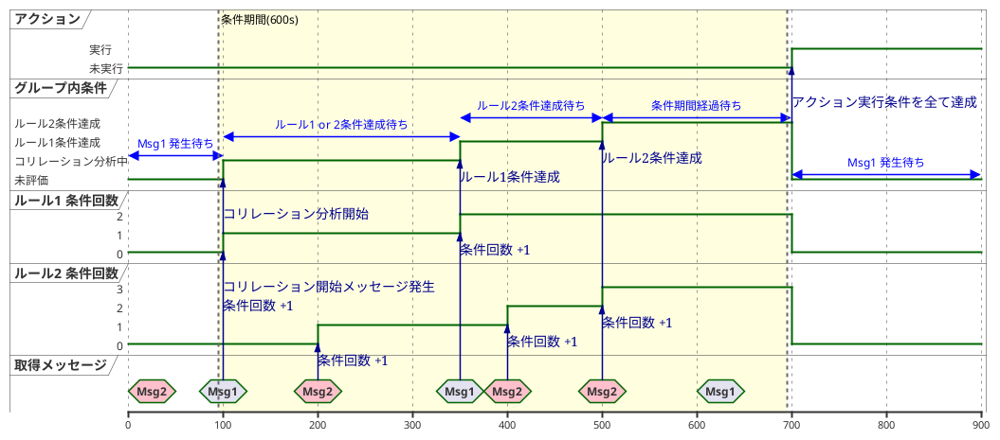
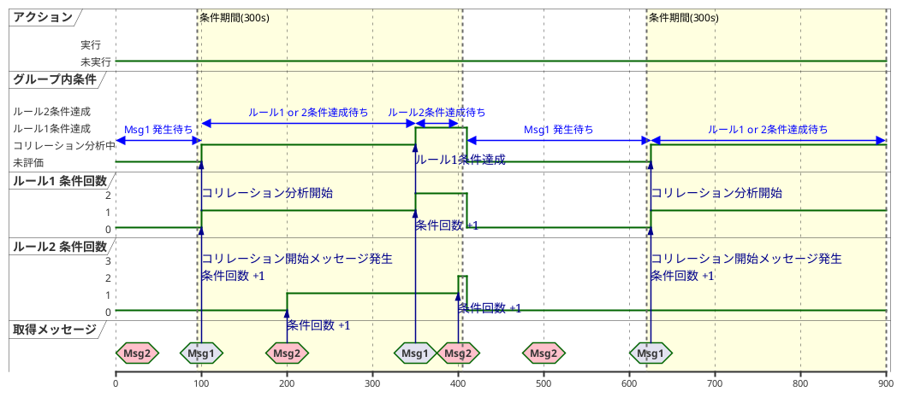

|条件式|ルール名|アクション|条件回数|条件期間|親グループ|優先順位|小グループ|優先順位|
|----|----|----|----|----|----|----|----|----|
|Msg1|ルール1|なし|2|600|グループA|1|グループA1|1|
|Msg2|ルール2|自動対処|3|600|グループA|2|グループA1|2|

|条件式|ルール名|アクション|条件回数|条件期間|親グループ|優先順位|小グループ|優先順位|
|----|----|----|----|----|----|----|----|----|
|Msg1|ルール1|なし|2|300|グループA|1|グループA1|1|
|Msg2|ルール2|自動対処|3|300|グループA|2|グループA1|2|

