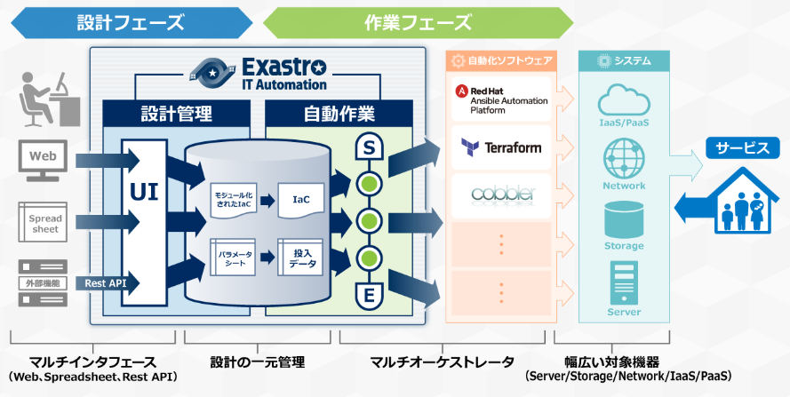
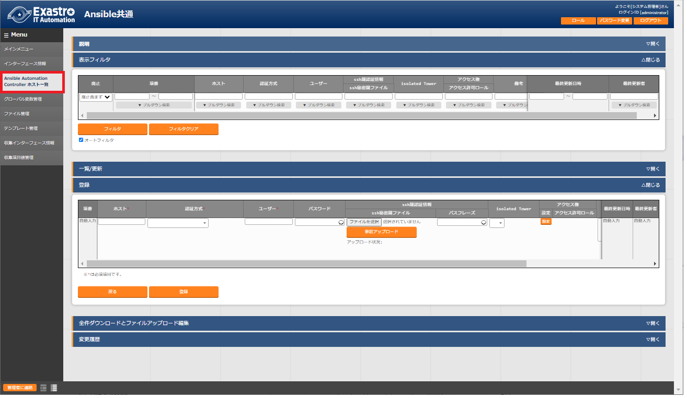
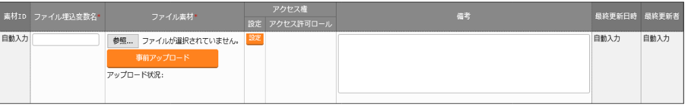
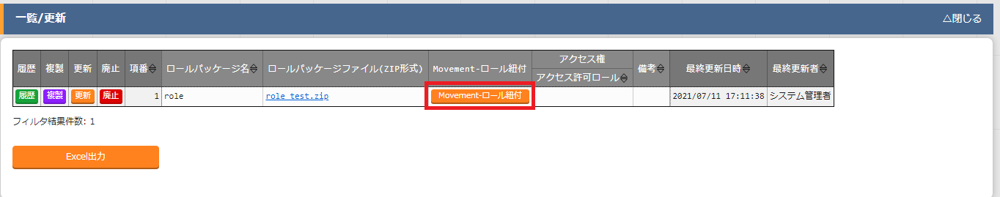
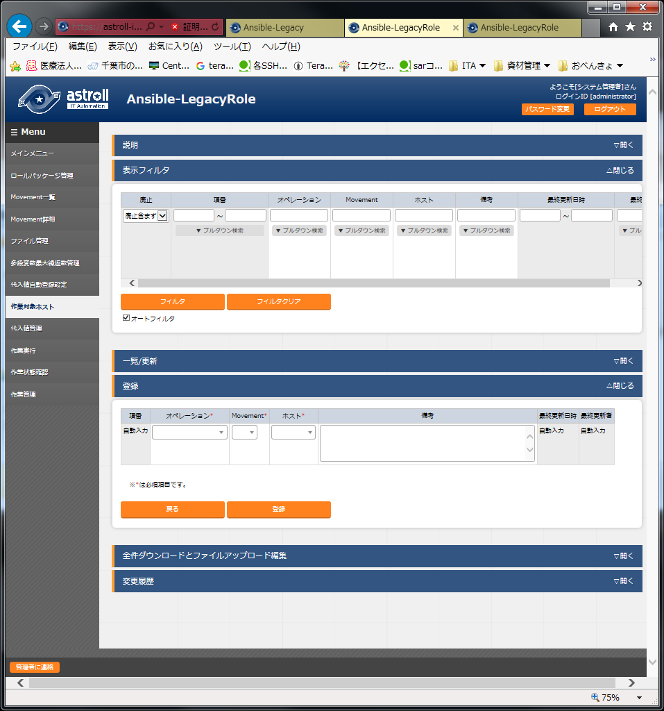
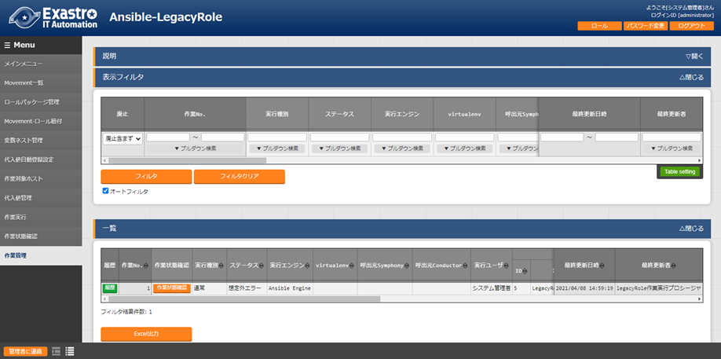
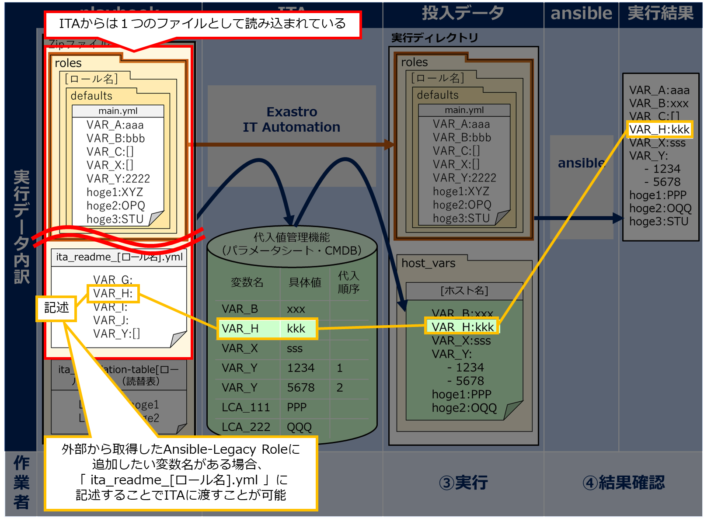
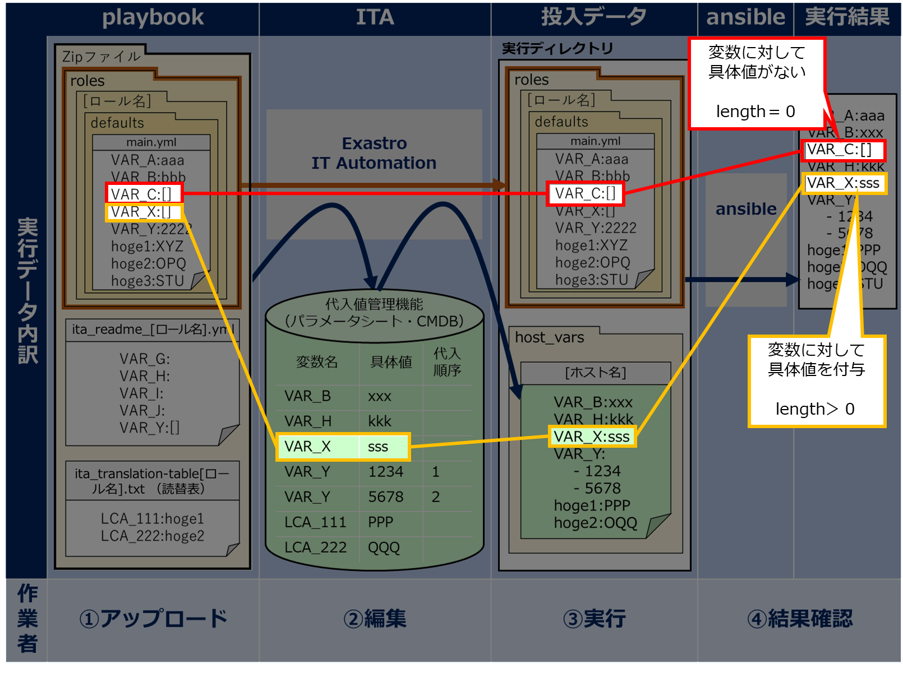

.. image:: ./general_operations/image1.png
   :width: 3.35069in
   :height: 0.78542in

ITA_利用手順マニュアル

Ansible-driver

*－*\ 第1.10版\ *－*

Copyright © NEC Corporation 2019. All rights reserved.

免責事項

本書の内容はすべて日本電気株式会社が所有する著作権に保護されています。

本書の内容の一部または全部を無断で転載および複写することは禁止されています。

本書の内容は将来予告なしに変更することがあります。

日本電気株式会社は、本書の技術的もしくは編集上の間違い、欠落について、一切責任を負いません。

日本電気株式会社は、本書の内容に関し、その正確性、有用性、確実性その他いかなる保証もいたしません。

商標

-  LinuxはLinus
      Torvalds氏の米国およびその他の国における登録商標または商標です。

-  Red Hatは、Red Hat,
      Inc.の米国およびその他の国における登録商標または商標です。

-  Apache、Apache Tomcat、Tomcatは、Apache Software
      Foundationの登録商標または商標です。

-  Ansibleは、Red Hat, Inc.の登録商標または商標です。

-  AnsibleTowerは、Red Hat, Inc.の登録商標または商標です。

-  Ansible Automation Controllerは、Red Hat,
      Inc.の登録商標または商標です。

-  Ansible Automation Pratformは、Red Hat,
      Inc.の登録商標または商標です。

その他、本書に記載のシステム名、会社名、製品名は、各社の登録商標もしくは商標です。

なお、® マーク、TMマークは本書に明記しておりません。

※本書では「Exastro IT Automation」を「ITA」として記載します。

※「Ansible Tower」はAnsible Automation Pratform2.0以降で「Ansible
Automation Controller」に名称が変更になりました。本書での「Ansible
Automation Controller」の記載は、「Ansible
Tower」も含めた記載となっています。

目次
====

`目次 <#目次>`__ `2 <#目次>`__

`はじめに <#_Toc101774393>`__ `4 <#_Toc101774393>`__

`1 Ansible driver概要 <#ansible-driver概要>`__
`5 <#ansible-driver概要>`__

`1.1 Ansible Coreについて <#ansible-coreについて>`__
`5 <#ansible-coreについて>`__

`1.2 Ansible Automation
Controllerについて <#ansible-automation-controllerについて>`__
`5 <#ansible-automation-controllerについて>`__

`1.3 Ansible driverについて <#ansible-driverについて>`__
`6 <#ansible-driverについて>`__

`2 Ansible driverでの変数取り扱い <#ansible-driverでの変数取り扱い>`__
`7 <#ansible-driverでの変数取り扱い>`__

`2.1 変数の種類 <#変数の種類>`__ `7 <#変数の種類>`__

`2.2 変数の抜出および具体値登録 <#変数の抜出および具体値登録>`__
`10 <#変数の抜出および具体値登録>`__

`2.3 代入値登録による変数の扱い <#代入値登録による変数の扱い>`__
`12 <#代入値登録による変数の扱い>`__

`3 Ansible driver
コンソールメニュー構成 <#ansible-driver-コンソールメニュー構成>`__
`13 <#ansible-driver-コンソールメニュー構成>`__

`3.1 メニュー/画面一覧 <#メニュー画面一覧>`__ `13 <#メニュー画面一覧>`__

`4 Ansible driver利用手順 <#ansible-driver利用手順>`__
`16 <#ansible-driver利用手順>`__

`4.1 作業フロー <#_Toc101774405>`__ `16 <#_Toc101774405>`__

`4.1.1 Ansible-Legacy作業フロー <#ansible-legacy作業フロー>`__
`16 <#ansible-legacy作業フロー>`__

`4.1.2 Ansible-Legacy Role作業フロー <#ansible-legacy-role作業フロー>`__
`19 <#ansible-legacy-role作業フロー>`__

`4.1.3 Ansible-Pioneer作業フロー <#ansible-pioneer作業フロー>`__
`22 <#ansible-pioneer作業フロー>`__

`5 Ansible driver機能・操作方法説明 <#ansible-driver機能操作方法説明>`__
`25 <#ansible-driver機能操作方法説明>`__

`5.1 基本コンソール <#基本コンソール>`__ `25 <#基本コンソール>`__

`5.1.1 機器一覧 <#機器一覧>`__ `25 <#機器一覧>`__

`5.1.2 オペレーション一覧 <#オペレーション一覧>`__
`30 <#オペレーション一覧>`__

`5.2 Ansible 共通コンソール <#ansible-共通コンソール>`__
`31 <#ansible-共通コンソール>`__

`5.2.1 インターフェース情報 <#インターフェース情報>`__
`31 <#インターフェース情報>`__

`5.2.2 Ansible Automation
Controllerホスト一覧 <#ansible-automation-controllerホスト一覧>`__
`36 <#ansible-automation-controllerホスト一覧>`__

`5.2.3 グローバル変数管理 <#グローバル変数管理>`__
`38 <#グローバル変数管理>`__

`5.2.4 テンプレート管理 <#テンプレート管理>`__
`40 <#テンプレート管理>`__

`5.2.5 ファイル管理 <#ファイル管理>`__ `44 <#ファイル管理>`__

`5.2.6 収集インターフェース情報 <#収集インターフェース情報>`__
`46 <#収集インターフェース情報>`__

`5.2.7 収集項目値管理 <#収集項目値管理>`__ `46 <#収集項目値管理>`__

`5.3 Ansibel-Legacy／Legacy
Role／Pioneer　コンソール <#ansibel-legacylegacy-rolepioneer-コンソール>`__
`47 <#ansibel-legacylegacy-rolepioneer-コンソール>`__

`5.3.1 OS種別マスタ <#os種別マスタ>`__ `47 <#os種別マスタ>`__

`5.3.2 Movement一覧 <#movement一覧>`__ `49 <#movement一覧>`__

`5.3.3
Playbook素材集（Ansible-Legacyのみ） <#playbook素材集ansible-legacyのみ>`__
`52 <#playbook素材集ansible-legacyのみ>`__

`5.3.4 ロールパッケージ管理（Ansible-Legacy
Roleのみ） <#ロールパッケージ管理ansible-legacy-roleのみ>`__
`54 <#ロールパッケージ管理ansible-legacy-roleのみ>`__

`5.3.5
対話種別リスト（Ansible-Pioneerのみ） <#対話種別リストansible-pioneerのみ>`__
`56 <#対話種別リストansible-pioneerのみ>`__

`5.3.6
対話ファイル素材集（Ansible-Pioneerのみ） <#対話ファイル素材集ansible-pioneerのみ>`__
`57 <#対話ファイル素材集ansible-pioneerのみ>`__

`5.3.7
Movement-Playbook紐付（Movement-対話種別紐付、Movement-ロール紐付） <#movement-playbook紐付movement-対話種別紐付movement-ロール紐付>`__
`59 <#movement-playbook紐付movement-対話種別紐付movement-ロール紐付>`__

`5.3.8 変数ネスト管理（Ansible-Legacy
Roleのみ） <#変数ネスト管理ansible-legacy-roleのみ>`__
`61 <#変数ネスト管理ansible-legacy-roleのみ>`__

`5.3.9 代入値自動登録設定 <#代入値自動登録設定>`__
`64 <#代入値自動登録設定>`__

`5.3.10 作業対象ホスト <#作業対象ホスト>`__ `70 <#作業対象ホスト>`__

`5.3.11 代入値管理 <#代入値管理>`__ `72 <#代入値管理>`__

`5.3.12 作業状態確認 <#作業状態確認>`__ `77 <#作業状態確認>`__

`5.3.13 作業管理 <#作業管理>`__ `80 <#作業管理>`__

`5.3.14 作業実行 <#作業実行>`__ `81 <#作業実行>`__

`6 構築コード記述方法 <#構築コード記述方法>`__
`83 <#構築コード記述方法>`__

`6.1 Playbook（Ansible-Legacy）の記述 <#playbookansible-legacyの記述>`__
`83 <#playbookansible-legacyの記述>`__

`6.2
対話ファイル（Ansible-Pioneer）の記述 <#対話ファイルansible-pioneerの記述>`__
`84 <#対話ファイルansible-pioneerの記述>`__

`6.3 ロールパッケージ（Ansible-Legacy
Role）の記述 <#ロールパッケージansible-legacy-roleの記述>`__
`102 <#ロールパッケージansible-legacy-roleの記述>`__

`6.4 ITAreadme（Ansible-Legacy
Roleのみ）の記述 <#itareadmeansible-legacy-roleのみの記述>`__
`106 <#itareadmeansible-legacy-roleのみの記述>`__

`6.5 読替表（Ansible-Legacy
Roleのみ）の記述 <#読替表ansible-legacy-roleのみの記述>`__
`108 <#読替表ansible-legacy-roleのみの記述>`__

`6.6 「ita_readme」と「読替表」の活用例（Ansible-Legacy
Roleのみ） <#ita_readmeと読替表の活用例ansible-legacy-roleのみ>`__
`110 <#ita_readmeと読替表の活用例ansible-legacy-roleのみ>`__

`6.7 BackYardコンテンツ <#backyardコンテンツ>`__
`120 <#backyardコンテンツ>`__

`6.8
Ansible利用ガイドラインITA追加ルール <#ansible利用ガイドラインita追加ルール>`__
`122 <#ansible利用ガイドラインita追加ルール>`__

`7 運用操作 <#運用操作>`__ `123 <#運用操作>`__

`7.1 メンテナンス <#メンテナンス>`__ `123 <#メンテナンス>`__

`7.2 メンテナンス方法について <#メンテナンス方法について>`__
`124 <#メンテナンス方法について>`__

`8 付録 <#_Toc101774448>`__ `125 <#_Toc101774448>`__

`8.1
Ansible実行時に使用される投入データとITAメニューの紐づけ <#ansible実行時に使用される投入データとitaメニューの紐づけ>`__
`125 <#ansible実行時に使用される投入データとitaメニューの紐づけ>`__

`8.1.1 Ansible-Legacy投入データ <#ansible-legacy投入データ>`__
`126 <#ansible-legacy投入データ>`__

`8.1.2 Ansible-Pioneer投入データ <#ansible-pioneer投入データ>`__
`128 <#ansible-pioneer投入データ>`__

`8.1.3 Ansible-LegacyRole投入データ <#ansible-legacyrole投入データ>`__
`130 <#ansible-legacyrole投入データ>`__

`8.1.4 投入データを直接実行する方法 <#投入データを直接実行する方法>`__
`132 <#投入データを直接実行する方法>`__

`8.2
Ansible実行時に作成される結果データ <#ansible実行時に作成される結果データ>`__
`133 <#ansible実行時に作成される結果データ>`__

`8.2.1
Legacy/LegacyRole結果データに保存されるファイル一覧 <#legacylegacyrole結果データに保存されるファイル一覧>`__
`133 <#legacylegacyrole結果データに保存されるファイル一覧>`__

`8.2.2
Pioneer結果データに保存されるファイル一覧 <#pioneer結果データに保存されるファイル一覧>`__
`134 <#pioneer結果データに保存されるファイル一覧>`__

`8.3 オプションパラメータ一覧 <#オプションパラメータ一覧>`__
`136 <#オプションパラメータ一覧>`__

`8.4 Ansible Automation
ControllerでITA独自変数を利用する場合の留意事項 <#ansible-automation-controllerでita独自変数を利用する場合の留意事項>`__
`138 <#ansible-automation-controllerでita独自変数を利用する場合の留意事項>`__

`8.5
実行時データ削除で削除されるデータリソース <#実行時データ削除で削除されるデータリソース>`__
`140 <#実行時データ削除で削除されるデータリソース>`__

はじめに
========

本書では、ITAの機能および操作方法について説明します。

Ansible driver概要
==================

本章ではAnsible、Ansible Automation ControllerおよびAnsible
driverについて説明します。

Ansible Coreについて
--------------------

   Ansible
   Coreとは、多数の構築管理対象に対して、アプリーケーション/システムのデプロイ作業を容易にするPF構築自動化ツールです。

   Ansible
   Coreは、PlaybookというYAML形式のテキストファイルに定型処理をタスクとして記述し、それをAnsible
   Coreに実行させることにより、さまざまな処理を実現できます。

   タスクはモジュールと呼ばれる処理プログラムと紐付いており、さまざまな機器に対する制御を行うことができます。

   Ansible Coreの詳細情報については、Ansible
   Coreのマニュアルを参照してください。

Ansible Automation Controllerについて
-------------------------------------

Ansible Automation
Controllerとは、PF構築自動化ツールであるAnsibleにアクセスコントロール、ジョブスケジューリング、タスクの可視化などの機能を拡張した管理プラットフォームです。

“プロジェクト”、”インベントリ”、”認証情報”の組合せで”ジョブテンプレート”を作成しAnsibleを実行できます。

複数の“ジョブテンプレート”を組み合せて”ワークフロージョブテンプレート”を作成することによって、より多彩な作業フローを表現することができます。

Ansible Automation Controllerの詳細情報については、Ansible Automation
Controllerのマニュアルを参照してください。

ITAで対応可能なAnsible Automation
Controllerのバージョンは、「システム構成／環境構築ガイド_Ansible-driver編」を参照してください。

最新のバージョンに対応した記法は使えないことがありますので、ご注意ください。

Ansible driverについて
----------------------

Ansible
driverは、ITAシステムのオプションとして機能し、ITAシステムで登録した構築対象のサーバ・ストレージ・ネットワーク各機器に対し、Ansible
Core、Ansible Automation
Controllerのどちらを経由するかを選択し、実際の運用設定を自動的に行います。

   Ansible driverには用途に応じて以下3つのモードを用意しています。

#. | **Legacy モード**
      | Ansible標準の機能を用いて各種ホストへ設定を投入します。
      | 構築コードを単体YAMLファイルとして登録し、作業パターンをその組み合わせで構成します。
      | OS,NWの環境設定などの作業用に使われることを想定します。

#. | **Legacy Role モード**
      | Legacyモードと同じく、Ansible標準の機能を用いて各種ホストへ設定を投入します。
      | 構築コードをパッケージとして登録し、作業パターンをRoleの組み合わせで構成します。
      | 製品部門などが提供するRoleパッケージを用いて、製品のインストール、環境構築などを行う際に使われることを想定します。

#. | **Pioneer モード**
      | Ansibleに独自モジュールを追加し、対話形式による設定投入を可能とします。
      | サーバ、ストレージ、ネットワークを問わず、Telnet, SSH
        でログイン可能なあらゆる機器に対応しています。対象機器と直接やり取りが必要となるため、相応のＩＴスキルが必要となります。

..

   また、Ansible
   driverは、Playbook中の変数を画面から設定することができます。詳細は本書「\ *2Ansible
   driverでの変数取り扱い*\ 」をご参照ください。

Ansible driverでの変数取り扱い
==============================

変数の種類
----------

Ansible
driverでは、Playbook中の変数の具体値をITAの設定画面から設定することができます。

   **※設定方法の詳細は、本書** 「\ `5.3.11
   代入値管理 <\l>`__\ 」\ **を参照してください。**

   Playbook中の変数で、ITAの変数として扱える変数は以下の8種類があります。

表2.1変数の種類

+----------+------------------------------------+------+------+------+
| 種類     | 内容                               | Le   | Pio  | Le   |
|          |                                    | gacy | neer | gacy |
|          |                                    |      |      |      |
|          |                                    |      |      | Role |
+==========+====================================+======+======+======+
| 通常変数 | 変数名に対し                       | ○    | ○    | ○    |
|          | て具体値を1つ定義できる変数です。  |      |      |      |
|          |                                    |      |      |      |
|          | Playbook内の変数は {{△VAR_xxx△}}   |      |      |      |
|          | で記述してください                 |      |      |      |
|          |                                    |      |      |      |
|          | △:半角スペース　xxx:               |      |      |      |
|          | 半角英数字とアンダースコア（ \_ ） |      |      |      |
|          |                                    |      |      |      |
|          | +-------------------------------+  |      |      |      |
|          | | e.g.)                         |  |      |      |      |
|          | |                               |  |      |      |      |
|          | | VAR_users: root               |  |      |      |      |
|          | +===============================+  |      |      |      |
|          | +-------------------------------+  |      |      |      |
+----------+------------------------------------+------+------+------+
| 複数具   | 変数名に対し                       | ○    | ○    | ○    |
| 体値変数 | て具体値を複数定義できる変数です。 |      |      |      |
|          |                                    |      |      |      |
|          | Playbook内の変数は {{△VAR_xxx△}}   |      |      |      |
|          | で記述してください。               |      |      |      |
|          |                                    |      |      |      |
|          | △:半角スペース　xxx:               |      |      |      |
|          | 半角英数字とアンダースコア（ \_ ） |      |      |      |
|          |                                    |      |      |      |
|          | +-------------------------------+  |      |      |      |
|          | | e.g.)                         |  |      |      |      |
|          | |                               |  |      |      |      |
|          | | VAR_users:                    |  |      |      |      |
|          | |                               |  |      |      |      |
|          | | - root                        |  |      |      |      |
|          | |                               |  |      |      |      |
|          | | - mysql                       |  |      |      |      |
|          | +===============================+  |      |      |      |
|          | +-------------------------------+  |      |      |      |
+----------+------------------------------------+------+------+------+
| 多段変数 | 階層化された変数です。             | ×    | ×    | ○    |
|          |                                    |      |      |      |
|          | Playbook内の変数は {{△VAR_xxx△}}   |      |      |      |
|          | で記述してください。               |      |      |      |
|          |                                    |      |      |      |
|          | △:半角スペース　xxx:               |      |      |      |
|          | 半角英数字とアンダースコア（ \_ ） |      |      |      |
|          |                                    |      |      |      |
|          | +-------------------------------+  |      |      |      |
|          | | e.g.)                         |  |      |      |      |
|          | |                               |  |      |      |      |
|          | | VAR_users:                    |  |      |      |      |
|          | |                               |  |      |      |      |
|          | | - user-name: alice            |  |      |      |      |
|          | |                               |  |      |      |      |
|          | | authorized: password          |  |      |      |      |
|          | |                               |  |      |      |      |
|          | | メンバー変数名は              |  |      |      |      |
|          | | 、下記の7文字を除くascii文字  |  |      |      |      |
|          | |                               |  |      |      |      |
|          | | |                             |  |      |      |      |
|          | |  (0x20～0x7e)が使用出来ます。 |  |      |      |      |
|          | | | 　" . [ ] ' \\ :            |  |      |      |      |
|          | |                               |  |      |      |      |
|          | | 尚、コーテーションで囲ま      |  |      |      |      |
|          | | ないと変数名の先頭に使用出来  |  |      |      |      |
|          | |                               |  |      |      |      |
|          | | ない文字がいくつかあります。  |  |      |      |      |
|          | | 詳しくは、Ansibleドキュメント |  |      |      |      |
|          | | Yaml sntaxを参照くだ\ `Yaml   |  |      |      |      |
|          | | syntax <https://d             |  |      |      |      |
|          | | ocs.ansible.com/ansible/lates |  |      |      |      |
|          | | t/reference_appendices/YAMLSy |  |      |      |      |
|          | | ntax.html>`__\ を参照下さい。 |  |      |      |      |
|          | +===============================+  |      |      |      |
|          | +-------------------------------+  |      |      |      |
+----------+------------------------------------+------+------+------+
| グロー   | 「グローバル変数                   | ○    | ○    | ○    |
| バル変数 | 」メニューから登録された変数です。 |      |      |      |
+----------+------------------------------------+------+------+------+
| ﾃﾝﾌﾟﾚｰﾄ  | 「テンプレート管理                 | ○    | ○    | ○    |
| 埋込変数 | 」メニューから登録された変数です。 |      |      |      |
+----------+------------------------------------+------+------+------+
| ファイル | 「ファイル管理                     | ○    | ○    | ○    |
| 埋込変数 | 」メニューから登録された変数です。 |      |      |      |
+----------+------------------------------------+------+------+------+

+----------+--------------------------------------+----+---+-----+------+
| 種類     | 内容                                 | Le | P |     | Le   |
|          |                                      | ga | i |     | gacy |
|          |                                      | cy | o |     |      |
|          |                                      |    | n |     | Role |
|          |                                      |    | e |     |      |
|          |                                      |    | e |     |      |
|          |                                      |    | r |     |      |
+==========+======================================+====+===+=====+======+
| ITA      | ITA 独自で定義された変数です。       | ○  |   | ○   | ○    |
| 独自変数 |                                      |    |   |     |      |
|          | 基本コンソールの機器                 |    |   |     |      |
|          | 一覧の下記項目を変数として扱えます。 |    |   |     |      |
|          |                                      |    |   |     |      |
|          | +----------------+---------------+   |    |   |     |      |
|          | | 項目名         | 変数名        |   |    |   |     |      |
|          | +================+===============+   |    |   |     |      |
|          | | ホスト名       | \__log        |   |    |   |     |      |
|          | |                | inhostname_\_ |   |    |   |     |      |
|          | +----------------+---------------+   |    |   |     |      |
|          | | プロトコル     | \__log        |   |    |   |     |      |
|          | |                | inprotocol_\_ |   |    |   |     |      |
|          | +----------------+---------------+   |    |   |     |      |
|          | | ロ             | \_            |   |    |   |     |      |
|          | | グインユーザID | _loginuser_\_ |   |    |   |     |      |
|          | +----------------+---------------+   |    |   |     |      |
|          | | ログ           | \__log        |   |    |   |     |      |
|          | | インパスワード | inpassword_\_ |   |    |   |     |      |
|          | +----------------+---------------+   |    |   |     |      |
|          |                                      |    |   |     |      |
|          | **変数名の前後の「                   |    |   |     |      |
|          | __」は半角アンダーバー2文字です。**  |    |   |     |      |
|          |                                      |    |   |     |      |
|          | 機器一                               |    |   |     |      |
|          | 覧については、「利用手順マニュアル_  |    |   |     |      |
|          | 基本コンソール」を参照してください。 |    |   |     |      |
|          |                                      |    |   |     |      |
|          | 作業実行時の                         |    |   |     |      |
|          | オペレーションを変数として扱えます。 |    |   |     |      |
|          |                                      |    |   |     |      |
|          | +----------------+---------------+   |    |   |     |      |
|          | | 項目名         | 変数名        |   |    |   |     |      |
|          | +================+===============+   |    |   |     |      |
|          | | オペレーション | \_            |   |    |   |     |      |
|          | |                | _operation_\_ |   |    |   |     |      |
|          | +----------------+---------------+   |    |   |     |      |
|          |                                      |    |   |     |      |
|          | 設定値 : 実施予定日時「YYYY/MM/DD    |    |   |     |      |
|          | HH:MM」                              |    |   |     |      |
|          | _オペレーションID:オペレーション名称 |    |   |     |      |
|          |                                      |    |   |     |      |
|          | 作業実行時のディレク                 |    |   |     |      |
|          | トリパスを下記の変数として扱えます。 |    |   |     |      |
|          |                                      |    |   |     |      |
|          | +----------------+---------------+   |    |   |     |      |
|          | | 項目名         | 変数名        |   |    |   |     |      |
|          | +================+===============+   |    |   |     |      |
|          | | 作業デ         | \__w          |   |    |   |     |      |
|          | | ィレクトリパス | orkflowdir_\_ |   |    |   |     |      |
|          | +----------------+---------------+   |    |   |     |      |
|          |                                      |    |   |     |      |
|          | Playbook内で作業ディレクトリパ       |    |   |     |      |
|          | ス配下にファイルを作成することで、「 |    |   |     |      |
|          | \ *作業実行*\ 」の結果データでファイ |    |   |     |      |
|          | ルをダウンロードすることができます。 |    |   |     |      |
|          |                                      |    |   |     |      |
|          | Symphony                             |    |   |     |      |
|          | 実行時の各Movementで共有するディレク |    |   |     |      |
|          | トリパスを下記の変数として扱えます。 |    |   |     |      |
|          |                                      |    |   |     |      |
|          | +----------+---------------------+   |    |   |     |      |
|          | | 項目名   | 変数名              |   |    |   |     |      |
|          | +==========+=====================+   |    |   |     |      |
|          | | Symphony | \__symp             |   |    |   |     |      |
|          | |          | hony_workflowdir_\_ |   |    |   |     |      |
|          | | 作業     |                     |   |    |   |     |      |
|          | | ディレク |                     |   |    |   |     |      |
|          | | トリパス |                     |   |    |   |     |      |
|          | +----------+---------------------+   |    |   |     |      |
|          |                                      |    |   |     |      |
|          | Playbook内でSympho                   |    |   |     |      |
|          | ny作業ディレクトリパス配下にファイル |    |   |     |      |
|          | を作成することで、各Movement間でファ |    |   |     |      |
|          | イルを共有することが出来ます。また、 |    |   |     |      |
|          | ansible                              |    |   |     |      |
|          | dri                                  |    |   |     |      |
|          | verの作業実行から実行した場合は__wor |    |   |     |      |
|          | kflowdir__と同じパスが設定されます。 |    |   |     |      |
|          |                                      |    |   |     |      |
|          | Conductor                            |    |   |     |      |
|          | 実行時の各Movementで共有するディレク |    |   |     |      |
|          | トリパスを下記の変数として扱えます。 |    |   |     |      |
|          |                                      |    |   |     |      |
|          | +----------+---------------------+   |    |   |     |      |
|          | | 項目名   | 変数名              |   |    |   |     |      |
|          | +==========+=====================+   |    |   |     |      |
|          | | C        | \__condu            |   |    |   |     |      |
|          | | onductor | ctor_workflowdir_\_ |   |    |   |     |      |
|          | |          |                     |   |    |   |     |      |
|          | | 作業     |                     |   |    |   |     |      |
|          | | ディレク |                     |   |    |   |     |      |
|          | | トリパス |                     |   |    |   |     |      |
|          | +----------+---------------------+   |    |   |     |      |
|          |                                      |    |   |     |      |
|          | Playbook内でConductor作業デ          |    |   |     |      |
|          | ィレクトリパス配下にファイルを作成す |    |   |     |      |
|          | ることで、各Movement間でファイルを共 |    |   |     |      |
|          | 有することが出来ます。また、ansible  |    |   |     |      |
|          | dri                                  |    |   |     |      |
|          | verの作業実行から実行した場合は__wor |    |   |     |      |
|          | kflowdir__と同じパスが設定されます。 |    |   |     |      |
|          |                                      |    |   |     |      |
|          | Conductorの「Status file             |    |   |     |      |
|          | branch」ノー                         |    |   |     |      |
|          | ドで参照するステータスファイルのファ |    |   |     |      |
|          | イルパスを下記の変数として扱えます。 |    |   |     |      |
|          |                                      |    |   |     |      |
|          | +----------+---------------------+   |    |   |     |      |
|          | | 項目名   | 変数名              |   |    |   |     |      |
|          | +==========+=====================+   |    |   |     |      |
|          | | ステー   | \__movement         |   |    |   |     |      |
|          | | タスファ | _status_filepath_\_ |   |    |   |     |      |
|          | | イルパス |                     |   |    |   |     |      |
|          | +----------+---------------------+   |    |   |     |      |
|          |                                      |    |   |     |      |
|          | Playbook内で                         |    |   |     |      |
|          | 作業ディレクトリパス配下にステータス |    |   |     |      |
|          | ファイルを作成することでができます。 |    |   |     |      |
|          |                                      |    |   |     |      |
|          | 収集機能の各ファ                     |    |   |     |      |
|          | イルパスを下記の変数として扱えます。 |    |   |     |      |
|          |                                      |    |   |     |      |
|          | +----------+---------------------+   |    |   |     |      |
|          | | 項目名   | 変数名              |   |    |   |     |      |
|          | +==========+=====================+   |    |   |     |      |
|          | | 作業デ   | \__parame           |   |    |   |     |      |
|          | | ィレクト | ters_dir_for_epc_\_ |   |    |   |     |      |
|          | | リ（in） |                     |   |    |   |     |      |
|          | | の「_pa  |                     |   |    |   |     |      |
|          | | rameters |                     |   |    |   |     |      |
|          | | 」のパス |                     |   |    |   |     |      |
|          | +----------+---------------------+   |    |   |     |      |
|          | | 作       | \__parameters_      |   |    |   |     |      |
|          | | 業ディレ | file_dir_for_epc_\_ |   |    |   |     |      |
|          | | クトリ（ |                     |   |    |   |     |      |
|          | | in）の「 |                     |   |    |   |     |      |
|          | | _paramet |                     |   |    |   |     |      |
|          | | ers_file |                     |   |    |   |     |      |
|          | | 」のパス |                     |   |    |   |     |      |
|          | +----------+---------------------+   |    |   |     |      |
|          | | 作業     | \__parameter_dir_\_ |   |    |   |     |      |
|          | | 結果ディ |                     |   |    |   |     |      |
|          | | レクトリ |                     |   |    |   |     |      |
|          | | （out）  |                     |   |    |   |     |      |
|          | | の「_pa  |                     |   |    |   |     |      |
|          | | rameters |                     |   |    |   |     |      |
|          | | 」のパス |                     |   |    |   |     |      |
|          | +----------+---------------------+   |    |   |     |      |
|          | | 作業結果 | \__par              |   |    |   |     |      |
|          | | ディレク | ameters_file_dir_\_ |   |    |   |     |      |
|          | | トリ（o  |                     |   |    |   |     |      |
|          | | ut）の「 |                     |   |    |   |     |      |
|          | | _paramet |                     |   |    |   |     |      |
|          | | ers_file |                     |   |    |   |     |      |
|          | | 」のパス |                     |   |    |   |     |      |
|          | +----------+---------------------+   |    |   |     |      |
|          |                                      |    |   |     |      |
|          | 「_parameters」                      |    |   |     |      |
|          | ：                                   |    |   |     |      |
|          | ソースファイル（パラメータ）格納先用 |    |   |     |      |
|          |                                      |    |   |     |      |
|          | | 「_parameter                       |    |   |     |      |
|          | s_file」：収集したファイルの格納先用 |    |   |     |      |
|          | | ※パラメータの対象がファイルア      |    |   |     |      |
|          | ップロードカラムの場合のファイル配置 |    |   |     |      |
|          | | 収集機能の詳細                     |    |   |     |      |
|          | については、「ITA_利用手順マニュアル |    |   |     |      |
|          |   収集機能」を参照して下さい。       |    |   |     |      |
+----------+--------------------------------------+----+---+-----+------+
| 読替変数 | Defaults変数定義ファイルまたは ITA   | ×  |   | ×   | ○    |
|          | readmeに定義さ                       |    |   |     |      |
|          | れている「VAR_×××」形式以外の変数を  |    |   |     |      |
|          | ITA                                  |    |   |     |      |
|          | で扱う場合の変数「LCA_×××」です。    |    |   |     |      |
|          |                                      |    |   |     |      |
|          | 詳細は「 6.5読替表（Ansible-Legacy   |    |   |     |      |
|          | Roleのみ）の記述」を参照して下さい。 |    |   |     |      |
+----------+--------------------------------------+----+---+-----+------+

変数の抜出および具体値登録
--------------------------

   各モードとも、ITAにアップロードしたPlaybook等の資材から変数を抜出し、各メニューから具体値を登録できます。各メニューから登録した変数の具体値は、作業実行時にホスト変数ファイルに出力されます。

変数の抜出方法は以下のとおりです。

(1) | **Ansible-Legacy**
       | 「Playbook素材集
         (本書：\ *5.3.3Playbook素材集（Ansible-Legacyのみ）*)」でアップロードしたPlaybookより、以下の書式の変数定義を抜出します。

+-----------------------+----------------------------------------------+
| 書式                  | 具体値の設定                                 |
+=======================+==============================================+
| {{△VAR_xxx△}}         | 具体値の登録は「\ `5.3.9                     |
|                       | 代入                                         |
| {{△VAR_xxx△|△ﾌｨﾙﾀｰ△}} | 値自動登録設定 <#代入値自動登録設定>`__\ 」  |
|                       | や「5.3.11代入値管理」メニューより行います。 |
|                       | 具体値の登録の仕                             |
|                       | 方で通常変数か複数具体値変数かを決定します。 |
+-----------------------+----------------------------------------------+
| {{△GBL_xxx△}}         | 具体値の登録は「5.2                          |
| {{△GBL_xxx△|△ﾌｨﾙﾀｰ△}} | .3グローバル変数管理」メニューより行います。 |
+-----------------------+----------------------------------------------+
| {{△TPF_xxx△}}         | 具体値の登録は「5                            |
| {{△TPF_xxx△|△ﾌｨﾙﾀｰ△}} | .2.4テンプレート管理」メニューより行います。 |
+-----------------------+----------------------------------------------+
| {{△CPF_xxx△}}         | 具体値の登録は                               |
| {{△CPF_xxx△|△ﾌｨﾙﾀｰ△}} | 「5.2.5ファイル管理」メニューより行います。  |
+-----------------------+----------------------------------------------+

※ △:半角スペース　xxx: 半角英数字とアンダースコア（ \_ ）

(2) | **Ansible-Pioneer**
       | 「対話ファイル素材
         (本書：\ *5.3.6対話ファイル素材集（Ansible-Pioneerのみ）*\ 」でアップロードした対話ファイルより、以下の書式の変数定義を抜出します。

+-----------------------+----------------------------------------------+
| 書式                  | 具体値の設定                                 |
+=======================+==============================================+
| {{△VAR_xxx△}}         | 具体値の登録は「\ `5.3.9                     |
|                       | 代入                                         |
|                       | 値自動登録設定 <#代入値自動登録設定>`__\ 」  |
|                       | や「5.3.11代入値管理」メニューより行います。 |
|                       | 具体値の登録の仕                             |
|                       | 方で通常変数か複数具体値変数かを決定します。 |
+-----------------------+----------------------------------------------+
| {{△GBL_xxx△}}         | 具体値の登録は「5.2                          |
|                       | .3グローバル変数管理」メニューより行います。 |
+-----------------------+----------------------------------------------+
| {{△TPF_xxx△}}         | 具体値の登録は「5                            |
|                       | .2.4テンプレート管理」メニューより行います。 |
+-----------------------+----------------------------------------------+
| {{△CPF_xxx△}}         | 具体値の登録は                               |
|                       | 「5.2.5ファイル管理」メニューより行います。  |
+-----------------------+----------------------------------------------+

(3) | **Ansible-Legacy Role**
       | 「ロールパッケージ管理
         (本書：\ *5.3.4ロールパッケージ管理（Ansible-Legacy
         Roleのみ）*\ 」でアップロードしたロールパッケージ内のdefaults変数定義ファイルより変数定義の抜出を行います。
       | 詳しくは「ロールパッケージの記述(本書：\ *5.3.4ロールパッケージ管理（Ansible-Legacy
         Roleのみ）*\ 」を参照してください。

    また、読替表を作成することでdefaults変数定義ファイルまたはITA
    readmeに定義されている「VAR_xxx」以外の変数をITAで扱うことが出来ます。詳しくは「\ `6.7
    読替表の記述 <#読替表ansible-legacy-roleのみの記述>`__\ 」を参照して下さい。

    また、アップロードしたロールパッケージ内のplaybookより、以下の書式の変数定義を抜出します。

+-----------------------+----------+---+-------------------------------+
| 書式                  | ロールパ |   | 具体値の設定                  |
|                       | ッケージ |   |                               |
|                       | 内のディ |   |                               |
|                       | レクトリ |   |                               |
+=======================+==========+===+===============================+
|                       | (4) *    | * |                               |
|                       | *tasks** | * |                               |
|                       |          | そ |                              |
|                       | (        | の |                              |
|                       | 5) **tem | 他 |                              |
|                       | plates** | * |                               |
|                       |          | * |                               |
|                       | (6) **ha |   |                               |
|                       | ndlers** |   |                               |
|                       |          |   |                               |
|                       |          |   |                               |
|                       | **meta** |   |                               |
+-----------------------+----------+---+-------------------------------+
| {{△GBL_xxx△}}         | **〇**   | * | 具体値                        |
| {{△GBL_xxx△|△ﾌｨﾙﾀｰ△}} |          | * | の登録は「5.2.3グローバル変数 |
|                       |          | × | 管理」メニューより行います。  |
|                       |          | * |                               |
|                       |          | * |                               |
+-----------------------+----------+---+-------------------------------+
| {{△TPF_xxx△}}         |          |   | 具体                          |
| {{△TPF_xxx△|△ﾌｨﾙﾀｰ△}} |          |   | 値の登録は「5.2.4テンプレート |
|                       |          |   | 管理」メニューより行います。  |
+-----------------------+----------+---+-------------------------------+
| {{△CPF_xxx△}}         |          |   | 具体値の登録は「5.2.5ファイル |
| {{△CPF_xxx△|△ﾌｨﾙﾀｰ△}} |          |   | 管理」メニューより行います。  |
+-----------------------+----------+---+-------------------------------+

-  〇：変数定義抜出対象のplaybook　 ×：変数定義抜出対象外のplaybook

代入値登録による変数の扱い
--------------------------

Playbookで定義した変数の値は代入値登録機能により上書きすることができます。

Playbook中の変数と、代入値管理機能で登録した変数の値の関係を、以下の図に示します。

代入値管理機能で登録した変数の値は、各ホスト用に変数定義ファイル(host_vars)に出力され、

| Ansibleで元のPlaybookと変数定義用ファイルを入力として各ホストに実行されます。
| この結果、変数の値の優先順位は以下のようになります。

#. 代入値管理機能で登録した値

#. | Playbook中の変数に指定した値
   | 詳細は 「5.3.11\ `代入値管理 <#代入値管理>`__\ 」
     を参照してください。

Ansible driver コンソールメニュー構成
=====================================

本章では、ITAコンソールのメニュー構成について説明します

メニュー/画面一覧
-----------------

#. ITA\ **基本コンソールのメニュー**

..

   Ansible
   driverで利用するITA基本コンソールのメニュー一覧を以下に記述します。

表 3.1‑1基本コンソール メニュー/画面一覧

+---+-----------+--------------+----------------------------------------+
| N | メニュー  | メ           | 説明                                   |
| o | グループ  | ニュー・画面 |                                        |
+===+===========+==============+========================================+
| 1 | ITA       | 機器一覧     | 作業対象システム一覧をメ               |
|   | 基本コ    |              | ンテナンス(閲覧/登録/更新/廃止)します  |
|   | ンソール  |              |                                        |
+---+-----------+--------------+----------------------------------------+
| 2 |           | 紐付         | 代入値                                 |
|   |           | 対象メニュー | 自動登録設定と連携するCMDBを管理します |
+---+-----------+--------------+----------------------------------------+
| 3 |           | 投入オ       | オペレーション一覧をメン               |
|   |           | ペレーション | テナンス(閲覧/登録/更新/廃止)できます  |
|   |           |              |                                        |
|   |           | 一覧         |                                        |
+---+-----------+--------------+----------------------------------------+

2. **Ansible共通コンソールのメニュー**

..

   Ansible共通コンソールのメニュー一覧を以下に記述します。

表 3.1‑2共通コンソール メニュー/画面一覧

+---+-----------+--------------+----------------------------------------+
| N | メニュー  | メ           | 説明                                   |
| o | グループ  | ニュー・画面 |                                        |
+===+===========+==============+========================================+
| 1 | Ansible   | インター     | Ansible Core、Ansible Automation       |
|   |           | フェース情報 | Controllerサーバのどちらを実行エン     |
|   | 共通コ    |              | ジンとし構築作業をするか選択をします。 |
|   | ンソール  |              |                                        |
|   |           |              | ITAシステム・Ansible                   |
|   |           |              | driverサーバと実行                     |
|   |           |              | エンジンのサーバが共有するディレクトリ |
|   |           |              | のパスおよび、実行エンジンのサーバへの |
|   |           |              | 接続インターフェース情報を管理します。 |
+---+-----------+--------------+----------------------------------------+
| 2 |           | Ansible      | Ansible Automation                     |
|   |           | Automation   | ControllerのRestAPI実行                |
|   |           | Controll     | に必要な情報、および構築資材をAnsible  |
|   |           | erホスト一覧 | Automation                             |
|   |           |              | Controllerにファイル                   |
|   |           |              | 転送するために必要な情報を管理します。 |
+---+-----------+--------------+----------------------------------------+
| 3 |           | グロー       | Playbookや対話ファ                     |
|   |           | バル変数管理 | イルなどで共通利用する変数（以降、グロ |
|   |           |              | ーバル変数と称す）と具体値を管理します |
+---+-----------+--------------+----------------------------------------+
| 4 |           | テン         | Playbook内のtemp                       |
|   |           | プレート管理 | lateモジュールでなどで使用するテンプレ |
|   |           |              | ートファイルと埋め込み変数を管理します |
+---+-----------+--------------+----------------------------------------+
| 5 |           | ファイル管理 | Playbook内の各モジュールで使用する     |
|   |           |              | 素材ファイルと埋め込み変数を管理します |
+---+-----------+--------------+----------------------------------------+

4. **Ansibleコンソールのメニュー**

..

   各Ansibleコンソールに対応するメニュー一覧を以下に記述します。

表 3.1‑3 Ansible driverコンソール メニュー/画面一覧

+---+---+----+---+---------------+---+-----------------------------------+
| N | メ |   |   | メ            |   | 説明                              |
| o | ニ |   |   | ニュー・画面  |   |                                   |
|   | ュ |   |   |               |   |                                   |
|   | ー |   |   |               | 非 |                                  |
|   | グ |   |   |               | 表 |                                  |
|   | ル |   |   |               | 示 |                                  |
|   | ー |   |   |               | メ |                                  |
|   | プ |   |   |               | ニ |                                  |
|   |   |    |   |               | ュ |                                  |
|   |   |    |   |               | ー |                                  |
|   |   |    |   |               | ※ |                                   |
|   |   |    |   |               | 1 |                                   |
+===+===+====+===+===============+===+===================================+
|   | * |    |   |               |   |                                   |
|   | * |    |   |               |   |                                   |
|   | A |    |   |               |   |                                   |
|   | n |    |   |               |   |                                   |
|   | s |    |   |               |   |                                   |
|   | i |    |   |               |   |                                   |
|   | b |    |   |               |   |                                   |
|   | l |    |   |               |   |                                   |
|   | e |    |   |               |   |                                   |
|   | コ |   |   |               |   |                                   |
|   | ン |   |   |               |   |                                   |
|   | ソ |   |   |               |   |                                   |
|   | ー |   |   |               |   |                                   |
|   | ル |   |   |               |   |                                   |
|   | * |    |   |               |   |                                   |
|   | * |    |   |               |   |                                   |
+---+---+----+---+---------------+---+-----------------------------------+
|   |   |    |   |               |   |                                   |
|   |   |    |   |               |   |                                   |
|   |   | Le |   |               |   |                                   |
|   | L | ga | P |               |   |                                   |
|   | e | cy | i |               |   |                                   |
|   | g |    | o |               |   |                                   |
|   | a |    | n |               |   |                                   |
|   | c | Ro | e |               |   |                                   |
|   | y | le | e |               |   |                                   |
|   |   |    | r |               |   |                                   |
+---+---+----+---+---------------+---+-----------------------------------+
| 1 |   |    | * | OS種別        |   | Pioneerより操作対象               |
|   |   |    | * |               |   | となる機器のOS種別を管理します。  |
|   |   |    | ○ |               |   |                                   |
|   |   |    | * |               |   |                                   |
|   |   |    | * |               |   |                                   |
+---+---+----+---+---------------+---+-----------------------------------+
| 2 | * | *  | * | Movement一覧  |   | Symphonyに登録                    |
|   | * | *○ | * |               |   | するMovementの一覧を管理します。  |
|   | ○ | ** | ○ |               |   |                                   |
|   | * |    | * |               |   |                                   |
|   | * |    | * |               |   |                                   |
+---+---+----+---+---------------+---+-----------------------------------+
| 3 | * |    |   | P             |   | Playbookファイルを管理します。    |
|   | * |    |   | laybook素材集 |   |                                   |
|   | ○ |    |   |               |   |                                   |
|   | * |    |   |               |   |                                   |
|   | * |    |   |               |   |                                   |
+---+---+----+---+---------------+---+-----------------------------------+
| 4 |   | *  |   | ロールパ      |   | ロールパッケージを管理します。    |
|   |   | *○ |   | ッケージ管理  |   |                                   |
|   |   | ** |   |               |   |                                   |
+---+---+----+---+---------------+---+-----------------------------------+
| 5 |   |    | * | 対            |   | 同一目的の対話ファイルを対話種別  |
|   |   |    | * | 話種別リスト  |   | としてまとめる種別を管理します。  |
|   |   |    | ○ |               |   |                                   |
|   |   |    | * |               |   |                                   |
|   |   |    | * |               |   |                                   |
+---+---+----+---+---------------+---+-----------------------------------+
| 6 |   |    | * | 対話フ        |   | 対話種別に紐づ                    |
|   |   |    | * | ァイル素材集  |   | けるOS種別とITAシステム独自フォー |
|   |   |    | ○ |               |   | マットの作業手順ファイル(以降、対 |
|   |   |    | * |               |   | 話ファイルと称す。)を管理します。 |
|   |   |    | * |               |   |                                   |
+---+---+----+---+---------------+---+-----------------------------------+
| 7 | * | *  | * | Mov           |   | Movementとプレイブ                |
|   | * | *○ | * | ement-Playboo |   | ック素材の関連付けを管理します。  |
|   | ○ | ** | ○ | k紐付（Moveme |   |                                   |
|   | * |    | * | nt-対話種別紐 |   |                                   |
|   | * |    | * | 付、Movement  |   |                                   |
|   |   |    |   | -ロール紐付） |   |                                   |
+---+---+----+---+---------------+---+-----------------------------------+
| 8 |   | *  |   | 変            |   | 多段                              |
|   |   | *○ |   | 数ネスト管理  |   | 変数が繰返配列で構成されている場  |
|   |   | ** |   |               |   | 合の最大繰返配列数を管理します。  |
+---+---+----+---+---------------+---+-----------------------------------+
| 9 | * | *  | * | 代入値        |   | CMD                               |
|   | * | *○ | * | 自動登録設定  |   | Bのメニューに登録されているオぺレ |
|   | ○ | ** | ○ |               |   | ーションとホスト毎の項目値を紐付  |
|   | * |    | * |               |   | けるMovementと変数を管理します。  |
|   | * |    | * |               |   |                                   |
+---+---+----+---+---------------+---+-----------------------------------+
| 1 | * | *  | * | 作            |   | Movem                             |
| 0 | * | *○ | * | 業対象ホスト  |   | entで使用するホストを管理します。 |
|   | ○ | ** | ○ |               |   |                                   |
|   | * |    | * |               |   |                                   |
|   | * |    | * |               |   |                                   |
+---+---+----+---+---------------+---+-----------------------------------+
| 1 | * | *  | * | 代入値管理    |   | 変数の代入値を管理します。        |
| 1 | * | *○ | * |               |   |                                   |
|   | ○ | ** | ○ |               |   |                                   |
|   | * |    | * |               |   |                                   |
|   | * |    | * |               |   |                                   |
+---+---+----+---+---------------+---+-----------------------------------+
| 1 | * | *  | * | 作業実行      |   | 作業実行するMovementとオペレー    |
| 2 | * | *○ | * |               |   | ションを選択し実行を指示します。  |
|   | ○ | ** | ○ |               |   |                                   |
|   | * |    | * |               |   |                                   |
|   | * |    | * |               |   |                                   |
+---+---+----+---+---------------+---+-----------------------------------+
| 1 | * | *  | * | 作業状態確認  |   | 作業実行状態を表示します。        |
| 3 | * | *○ | * |               |   |                                   |
|   | ○ | ** | ○ |               |   |                                   |
|   | * |    | * |               |   |                                   |
|   | * |    | * |               |   |                                   |
+---+---+----+---+---------------+---+-----------------------------------+
| 1 | * | *  | * | 作業管理      |   | 作業実行履歴を管理します。        |
| 4 | * | *○ | * |               |   |                                   |
|   | ○ | ** | ○ |               |   |                                   |
|   | * |    | * |               |   |                                   |
|   | * |    | * |               |   |                                   |
+---+---+----+---+---------------+---+-----------------------------------+
| 1 | * | *  | * | 変数名一覧    | 〇 | | Legacy:                        |
| 5 | * | *○ | * |               |   | | Playbook素                      |
|   | ○ | ** | ○ |               |   | 材集にアップロードしたPlaybookで  |
|   | * |    | * |               |   | 使用している変数名を管理します。  |
|   | * |    | * |               |   | | pioneer:                        |
|   |   |    |   |               |   |                                   |
|   |   |    |   |               |   | 対話ファイル素材集                |
|   |   |    |   |               |   | にアップロードした対話ファイルで  |
|   |   |    |   |               |   | 使用している変数名を管理します。  |
|   |   |    |   |               |   |                                   |
|   |   |    |   |               |   | Legacy:-role:                     |
|   |   |    |   |               |   |                                   |
|   |   |    |   |               |   | ロールパッケージ管理に            |
|   |   |    |   |               |   | アップロードしたロールパッケージ  |
|   |   |    |   |               |   | ファイル「zip」内のデフォルト変数 |
|   |   |    |   |               |   | 定義ファイルやITAreadmeファイルで |
|   |   |    |   |               |   | 定義している変数名を管理します。  |
+---+---+----+---+---------------+---+-----------------------------------+
| 1 | * | *  | * | Movemen       | 〇 | Movemen                          |
| 6 | * | *○ | * | t変数紐付管理 |   | tで使用している変数を管理します。 |
|   | ○ | ** | ○ |               |   |                                   |
|   | * |    | * |               |   |                                   |
|   | * |    | * |               |   |                                   |
+---+---+----+---+---------------+---+-----------------------------------+
| 1 |   | *  |   | ロール名管理  | 〇 | ロール                           |
| 7 |   | *○ |   |               |   | パッケージ管理にアップロードした  |
|   |   | ** |   |               |   | ロールパッケージファイル「zip」内 |
|   |   |    |   |               |   | に登録しているロールを管理します  |
+---+---+----+---+---------------+---+-----------------------------------+
| 1 |   | *  |   | ロー          | 〇 | ロールパッケージ管理にアップロー |
| 8 |   | *○ |   | ル変数名管理  |   | ドしたロールパッケージファイル「  |
|   |   | ** |   |               |   | zip」内のデフォルト変数定義ファイ |
|   |   |    |   |               |   | ルやITAreadmeファイルで定義してい |
|   |   |    |   |               |   | る変数名をロール毎に管理します。  |
+---+---+----+---+---------------+---+-----------------------------------+
| 1 |   | *  |   | 変            | 〇 | ロールパッケージ管理にアップ     |
| 9 |   | *○ |   | 数具体値管理  |   | ロードしたロールパッケージファイ  |
|   |   | ** |   |               |   | ル「zip」内のデフォルト変数定義フ |
|   |   |    |   |               |   | ァイルやITAreadmeファイルで定義し |
|   |   |    |   |               |   | ている変数の具体値を管理します。  |
+---+---+----+---+---------------+---+-----------------------------------+
| 2 |   | *  |   | メン          | 〇 | ロール                           |
| 0 |   | *○ |   | バー変数管理  |   | パッケージ管理にアップロードした  |
|   |   | ** |   |               |   | ロールパッケージファイル「zip」内 |
|   |   |    |   |               |   | のデフォルト変数定義ファイルやIT  |
|   |   |    |   |               |   | Areadmeファイルで定義している多段 |
|   |   |    |   |               |   | 変数のメンバー変数を管理します。  |
+---+---+----+---+---------------+---+-----------------------------------+
| 2 |   | *  |   | 多段変数      | 〇 | ロールパッケージ管理にアップロ   |
| 1 |   | *○ |   | メンバー管理  |   | ードしたロールパッケージファイル  |
|   |   | ** |   |               |   | 「zip」内のデフォルト変数定義ファ |
|   |   |    |   |               |   | イルやITAreadmeファイルで定義して |
|   |   |    |   |               |   | いる多段変数の構造を管理します。  |
+---+---+----+---+---------------+---+-----------------------------------+
| 2 |   | *  |   | 多段変数配    | 〇 | ロー                             |
| 2 |   | *○ |   | 列組合せ管理  |   | ルパッケージ管理にアップロードし  |
|   |   | ** |   |               |   | たロールパッケージファイル「zip」 |
|   |   |    |   |               |   | 内のデフォルト変数定義ファイルや  |
|   |   |    |   |               |   | ITAreadmeファイルで定義している多 |
|   |   |    |   |               |   | 段変数の繰り返し数を管理します。  |
+---+---+----+---+---------------+---+-----------------------------------+
| 2 |   | *  |   | 読替変数一覧  | 〇 | ロールパッケージ管理に           |
| 3 |   | *○ |   |               |   | アップロードしたロールパッケージ  |
|   |   | ** |   |               |   | ファイル「zip」内の読替表ファイル |
|   |   |    |   |               |   | で定義している変数を管理します。  |
+---+---+----+---+---------------+---+-----------------------------------+

※1非表示メニューは、バックヤード機能でデータの登録・更新を行うメニューです。

   Ansible
   Driver機能をインストールした状態では表示されないメニューに設定されています。

   非表示メニューを表示するには、「管理コンソール/ロール・メニュー紐付管理」で各メニューの復活処理を行います。詳細は「利用手順マニュアル_管理コンソール」
   を参照してください。

   尚、\ *データの更新を行うとバックヤード機能が正しく動作しなくなります。データの更新はしないで下さい。*

Ansible driver利用手順
======================

各Ansibleコンソールの利用手順について説明します

作業フロー
----------

   各Ansibleコンソールにおける標準的な作業フローは以下のとおりです。

   各作業の詳細は次項に記載しています。

   ITA基本コンソールの利用方法は、「利用手順マニュアル_基本コンソール」を参照してください。

Ansible-Legacy作業フロー
~~~~~~~~~~~~~~~~~~~~~~~~

以下は、Ansible-Legacyで作業を実行するまでの流れです。

-  **作業フロー詳細と参照先**

#. | **機器情報にAnsible利用情報を設定
     **\ ITA基本コンソールの機器一覧の画面から、各機器に対してAnsible利用情報を設定します。
   | 詳細は *5.1.1機器一覧* を参照してください。

#. **投入オペレーション名の登録**

ITA基本コンソールのオペレーション一覧の画面から、作業用の投入オペレーション名を登録します。

詳細は\ `5.1.2 オペレーション一覧 <\l>`__\ を参照してください。

3. **インターフェース情報の登録**

Ansible共通コンソールのインターフェース情報の画面から、Ansible
Core、Ansible Automation
Controllerサーバのどちらを実行エンジンにするかを選択し、実行エンジンのサーバへの接続情報の登録します。

詳細は\ `5.2.1インターフェース情報 <#インターフェース情報>`__\ を参照してください。

4. | **作業パターン(Movement)の登録
     **\ Ansible-LegacyコンソールのMovement一覧の画面から、作業用のMovementを登録します。
   | 詳細は *5.3.2Movement一覧* を参照してください。

5. | **Playbookの登録
     **\ Ansible-LegacyコンソールのPlaybook素材集の画面から、作業で使用するPlaybookを登録します。
   | 詳細は *5.3.3Playbook素材集（Ansible-Legacyのみ）*
     を参照してください。

6. **テンプレートファイルの登録（必要に応じて実施）**

Ansible共通コンソールのテンプレート管理の画面から、Playbook内のtemplateモジュールなどで使用しているtemplateファイル(src)とtemplate埋め込み変数の登録／更新／廃止を行います。

詳細は5.2.4\ `テンプレート管理 <#テンプレート管理>`__\ を参照してください。

7. **素材ファイルの登録 （必要に応じて実施）
   **\ Ansible共通コンソールのファイル管理の画面から、作業対象サーバに配置するファイルを登録します。

詳細は 5.2.5\ `ファイル管理 <#ファイル管理>`__ を参照してください。

8. **Movementにプレイブック素材を指定
   **\ Ansible-LegacyコンソールのMovement-Playbook紐付（Movement-対話種別紐付、Movement-ロール紐付）の画面から、登録したMovementにプレイブック素材を指定します。

詳細は `5.3.7
Movement-Playbook紐付（Movement-対話種別紐付、Movement-ロール紐付） <#movement-playbook紐付movement-対話種別紐付movement-ロール紐付>`__
を参照してください。

9.  | **作業対象ホストの指定
      **\ Ansible-Legacyコンソールの作業対象ホストの画面から、作業対象ホストを指定します。
    | 詳細は 5.3.10\ *作業対象ホスト* を参照してください。

10. | **変数値の設定（必要に応じて実施）
      **\ Ansible-Legacyコンソールの代入値管理の画面から、Movementに登録したPlaybook内で定義した変数の値を設定します。変数を利用していない場合、設定は不要です。
    | 詳細は 5.3.11\ `代入値管理 <#代入値管理>`__ を参照してください。

11. **作業実行
    **\ Ansible-Legacyコンソールの作業実行の画面から、実行日時、投入オペレーションを選択して設定して処理の実行を指示します。

詳細は *5.3.14作業実行* を参照してください。

12. | **作業状態確認
      **\ Ansible-Legacyコンソールの作業状態確認の画面では、実行した作業の状態がリアルタイムで表示されます。また、作業の緊急停止や、実行ログ、エラーログを監視することができます。
    | 詳細は *5.3.12作業状態確認* を参照してください。

13. **作業履歴確認
    **\ Ansible-Legacyコンソールの作業管理の画面では、実行した作業の一覧が表示され履歴が確認できます。

詳細は *5.3.13作業管理* を参照してください。

Ansible-Legacy Role作業フロー
~~~~~~~~~~~~~~~~~~~~~~~~~~~~~

以下は、Ansible-Legacy Roleで作業を実行するまでの流れです。

**
**

-  **作業フロー詳細と参照先**

#. | **機器情報にAnsible利用情報を設定
     **\ ITA基本コンソールの機器一覧の画面から、各機器に対してAnsible利用情報を設定します。
   | 詳細は *5.1.1機器一覧* を参照してください。

#. **投入オペレーション名の登録**

ITA基本コンソールのオペレーション一覧の画面から、作業用の投入オペレーション名を登録します。

詳細は `5.1.2 オペレーション一覧 <#オペレーション一覧>`__
を参照してください。

3. **インターフェース情報の登録**

Ansible共通コンソールのインターフェース情報の画面から、Ansible
Core、Ansible Automation
Controllerサーバのどちらを実行エンジンにするかを選択し、実行エンジンのサーバへの接続情報を登録します。

詳細は\ `5.2.1インターフェース情報 <\l>`__\ を参照してください。

4. | **作業パターン(Movement)の登録
     **\ Ansible-Legacy
     RoleコンソールのMovement一覧の画面から、作業用のMovementを登録します。
   | 詳細は *5.3.2Movement一覧* を参照してください。

5. | **ロールパッケージの登録
     **\ Ansible-Legacy
     Roleコンソールのロールパッケージ管理の画面から、作業で使用するロールパッケージを登録します。
   | 詳細は *5.3.4ロールパッケージ管理（Ansible-Legacy Roleのみ）*
     を参照してください。

6. **テンプレートファイルの登録（必要に応じて実施）**

Ansible共通コンソールのテンプレート管理の画面から、ロールパッケージのtemplateモジュールなどで使用しているtemplateファイル(src)とtemplate埋め込み変数の登録／更新／廃止を行います。

詳細は5.2.4
`テンプレート管理 <#テンプレート管理>`__\ を参照してください。

7. **素材ファイルの登録 （必要に応じて実施）**

Ansible共通コンソールのファイル管理の画面から、作業対象サーバに配置するファイルを登録します。

詳細は 5.2.5\ `ファイル管理 <#ファイル管理>`__ を参照してください。

8. **Movementにロールパッケージを指定**

Ansible-Legacy
RoleコンソールのMovement-Playbook紐付（Movement-対話種別紐付、Movement-ロール紐付）の画面から、登録したMovementにプレイブック素材を指定します。

詳細は `5.3.7
Movement-Playbook紐付（Movement-対話種別紐付、Movement-ロール紐付） <#movement-playbook紐付movement-対話種別紐付movement-ロール紐付>`__
を参照してください。

9. **多段変数の最大繰返数を指定
   **\ Ansible-Legacy
   Roleコンソールの多段変数最大繰返管理の画面から、多段変数で配列定義されているメンバー変数の配列の最大繰返数を指定します。

詳細は *5.3.8変数ネスト管理（Ansible-Legacy Roleのみ）*
を参照してください。

10. | **作業対象ホストの指定
      **\ Ansible-Legacy
      Roleコンソールの作業対象ホストの画面から、作業対象ホストを指定します。
    | 詳細は *5.3.10作業対象ホスト* を参照してください。

11. | **変数値の設定
      **\ Ansible-Legacy
      Roleコンソールの代入値管理の画面から、Movementに登録したPlaybook内で定義した変数の値を設定します。変数を利用していない場合、設定は不要です。
    | 詳細は 5.3.11\ `代入値管理 <#代入値管理>`__ を参照してください。

12. **作業実行
    **\ Ansible-Legacy
    Roleコンソールの作業実行の画面から、実行日時、投入オペレーションを選択して設定して処理の実行を指示します。

詳細は *5.3.14作業実行* を参照してください。

13. | **作業状態確認
      **\ Ansible-Legacy
      Roleコンソールの作業状態確認の画面から、実行した作業の状態がリアルタイムで表示されます。また、作業の緊急停止や、実行ログ、エラーログを監視することができます。
    | 詳細は *5.3.12作業状態確認* を参照してください。

14. **作業履歴確認
    **\ Ansible-Legacy
    Roleコンソールの作業管理の画面から、実行した作業の一覧が表示され履歴が確認できます。

詳細は *5.3.13作業管理* を参照してください。

Ansible-Pioneer作業フロー
~~~~~~~~~~~~~~~~~~~~~~~~~

以下は、Ansible-Pioneerで作業を実行するまでの流れです。

-  **作業フロー詳細と参照先**

#. **OS種別の登録**

Pioneerより操作対象となる機器のOS種別を設定します。

2. | **機器情報にAnsible利用情報を設定
     **\ ITA基本コンソールの機器一覧の画面から、各機器に対してAnsible利用情報を設定します。
   | 詳細は *5.1.1機器一覧* を参照してください。

3. **投入オペレーション名の登録**

ITA基本コンソールのオペレーション一覧の画面から、作業用の投入オペレーション名を登録します。

詳細は `5.1.2
オペレーション一覧 <#オペレーション一覧>`__\ を参照してください。

4. **インターフェース情報の登録**

Ansible共通コンソールのインターフェース情報の画面から、Ansible
Core、Ansible Automation
Controllerサーバのどちらを実行エンジンにするかを選択し、実行エンジンのサーバへの接続情報の登録します。

詳細は\ `5.2.1インタフェース情報 <\l>`__\ を参照してください。

5. | **作業パターン(Movement)の登録
     **\ Ansible-PioneerコンソールのMovement一覧の画面から、作業用のMovementを登録します。
   | 詳細は *5.3.2Movement一覧* を参照してください。

6. **対話種別の登録**

..

   Ansible-Pioneerコンソールの対話種別リストの画面から、対話種別を登録します。

   OS種別ごとの差異を対話ファイルごとに定義し、同一目的の対話ファイルを対話種別として纏めて機器差分を吸収(抽象化)します。

   詳細は、対話種別リスト（Ansible-Pioneerのみ）
   を参照してください。\ **
   **

7. **対話ファイルの登録**

Ansible-Pioneerコンソールの対話ファイル素材集の画面から、対話種別とOS種別の組み合わせに対して対話ファイルを登録します。

詳細は *5.3.6対話ファイル素材集（Ansible-Pioneerのみ）*
を参照してください。

8. **テンプレートファイルの登録(必要に応じて実施)**

Ansible共通コンソールのテンプレート管理の画面から、対話ファイルで使用しているtemplateファイルとtemplate埋め込み変数の登録／更新／廃止を行います。

詳細は5.2.4\ `テンプレート管理 <#テンプレート管理>`__
を参照してください。

9. **素材ファイルの登録(必要に応じて実施)**

Ansible共通コンソールのファイル管理の画面から、作業対象サーバに配置するファイルを登録します。

詳細は 5.2.5\ `ファイル管理 <#ファイル管理>`__ を参照してください。

10. **Movementに対話ファイルを指定
    **\ Ansible-PioneerコンソールのMovement-Playbook紐付（Movement-対話種別紐付、Movement-ロール紐付）の画面から、登録したMovementに対話ファイルに対応した対話種別リストを指定します。

詳細は `5.3.7
Movement-Playbook紐付（Movement-対話種別紐付、Movement-ロール紐付） <#movement-playbook紐付movement-対話種別紐付movement-ロール紐付>`__\ を参照してください。

11. | **作業対象ホストの指定
      **\ Ansible-Pioneerコンソールの作業対象ホストの画面から、作業対象ホストを指定します。
    | 詳細は *5.3.10作業対象ホスト* を参照してください。

12. | **変数値の設定
      **\ Ansible-Pioneerコンソールの代入値管理の画面から、Movementに登録したPlaybook内で定義した変数の値を設定します。変数を利用していない場合、設定は不要です。
    | 詳細は 5.3.11\ `代入値管理 <#代入値管理>`__ を参照してください。

13. **作業実行
    **\ Ansible-Pioneerコンソールの作業実行の画面から、実行日時、投入オペレーションを選択して設定して処理の実行を指示します。

詳細は *5.3.14作業実行* を参照してください。

14. | **作業状態確認
      **\ Ansible-Pioneerコンソールの作業状態確認の画面では、実行した作業の状態がリアルタイムで表示されます。また、作業の緊急停止や、実行ログ、エラーログを監視することができます。
    | 詳細は *5.3.12作業状態確認* を参照してください。

15. **作業履歴確認
    **\ Ansible-Pioneerコンソールの作業管理の画面では、実行した作業の一覧が表示され履歴が確認できます。

詳細は *5.3.14作業管理* を参照してください。

**■登録画面項目一覧凡例**

次項に記載の登録画面項目一覧表の内容について説明します。

+--------+-------------------------------+----+--------+-------------+
| #.     | **②**                         | *  | **④**  | **⑤**       |
|        |                               | *③ |        |             |
|        |                               | ** |        |             |
+========+===============================+====+========+=============+
| **     | **説明**                      | ** | **入力 | *           |
| 項目** |                               | 入 | 形式** | *制約事項** |
|        |                               | 力 |        |             |
|        |                               | ** |        |             |
|        |                               |    |        |             |
|        |                               | ** |        |             |
|        |                               | 必 |        |             |
|        |                               | 須 |        |             |
|        |                               | ** |        |             |
+--------+-------------------------------+----+--------+-------------+
|        |                               |    |        |             |
+--------+-------------------------------+----+--------+-------------+

..

   **①項目**

   　・サブメニュー内の項目名です

   **②説明**

   　・項目に対する説明です

   **③入力必須**

   　・○：項目に対する内容の入力が必須の項目

   　・‐ ：項目に対する内容の入力が任意の項目

   **④入力形式**

   　・手動入力：手動での入力が必要な項目

   　・自動入力：自動で内容が入力される項目

   　・チェックボックス：チェックボックス形式の項目

   　・ボタン：ラジオボタン形式の項目

   　・リスト選択：リストボックス形式の項目

   **⑤制約事項**

   　・項目に対する制約事項(文字数制限など)です\ **
   **

Ansible driver機能・操作方法説明
================================

本章では、Ansible driverで利用する各コンソールの機能について説明します。

基本コンソール
--------------

   本節では、ITA基本コンソールでの操作について記載します。

   本作業はITA基本コンソールマニュアルを参照して、ITA基本コンソール画面内で作業を実施してください。

機器一覧
~~~~~~~~

(1) | [機器一覧]では、作業対象ホストの情報を登録／更新／廃止を行います。
    | 本書では、主にAnsible
      driverの動作に必要となる項目について説明します。
    | 「利用手順マニュアル_基本コンソール」と合わせて参照してください。

..

   .. image:: ./general_operations/image5.png
      :width: 6.14173in
      :height: 2.86822in

図 5.1‑1サブメニュー画面（機器一覧）

(2) 「登録」-「登録開始」ボタンより、機器情報の登録を行います。

    .. image:: ./general_operations/image6.png
       :width: 3.8781in
       :height: 1.61202in

図 5.1‑2 登録画面（機器一覧 - 共通項目）

.. image:: ./general_operations/image7.png
   :width: 5.97917in
   :height: 1.10417in

図 5.1‑3 登録画面（機器一覧 - Ansible利用情報）

(3) | 登録画面の共通項目一覧は以下のとおりです。
    | Web画面のカラム名の後ろに赤のアスタリスク（＊）が付いているカラムが必須入力になりますが、Ansible　driverを利用する場合には、Ansible利用情報を入力して下さい。

    未入力で作業実行した場合、想定外エラーとなる場合があります。

**表 5.1‑1　登録画面項目一覧（機器一覧）**

+---+----+---+----+-----------------------------+----+------+-----------+---+
| * |    |   |    | **説明**                    | ** | **入 | **制      |   |
| * |    |   |    |                             | 入 | 力形 | 約事項**  |   |
| 項 |   |   |    |                             | 力 | 式** |           |   |
| 目 |   |   |    |                             | ** |      |           |   |
| * |    |   |    |                             |    |      |           |   |
| * |    |   |    |                             | ** |      |           |   |
|   |    |   |    |                             | 必 |      |           |   |
|   |    |   |    |                             | 須 |      |           |   |
|   |    |   |    |                             | ** |      |           |   |
+===+====+===+====+=============================+====+======+===========+===+
| 管 |   |   |    | 登録情報を識別する一        | -  | 自動 | -         |   |
| 理 |   |   |    | 意のＩＤが自動入力されます  |    | 入力 |           |   |
| シ |   |   |    |                             |    |      |           |   |
| ス |   |   |    |                             |    |      |           |   |
| テ |   |   |    |                             |    |      |           |   |
| ム |   |   |    |                             |    |      |           |   |
| 項 |   |   |    |                             |    |      |           |   |
| 番 |   |   |    |                             |    |      |           |   |
+---+----+---+----+-----------------------------+----+------+-----------+---+
| ホ |   |   |    | ホスト名を記入します        | ○  | 手動 | 最大長    |   |
| ス |   |   |    |                             |    | 入力 | 128バイト |   |
| ト |   |   |    | | ※                         |    |      |           |   |
| 名 |   |   |    | ホスト名をlocalhostに設定し |    |      |           |   |
|   |    |   |    | pioneerで作業対象ホストとし |    |      |           |   |
|   |    |   |    | 使用する場合、作業実行でエ  |    |      |           |   |
|   |    |   |    | ラーになる場合があります。  |    |      |           |   |
|   |    |   |    | その場合、インベントリファ  |    |      |           |   |
|   |    |   |    | イル追加オプションに下記パ  |    |      |           |   |
|   |    |   |    | ラメータでansibleサーバーに |    |      |           |   |
|   |    |   |    | インストールされているpyth  |    |      |           |   |
|   |    |   |    | on3のパスを追記して下さい。 |    |      |           |   |
|   |    |   |    | | Exp)                      |    |      |           |   |
|   |    |   |    | |                           |    |      |           |   |
|   |    |   |    | ansible_python_interpreter: |    |      |           |   |
|   |    |   |    |   /usr/bin/python3          |    |      |           |   |
+---+----+---+----+-----------------------------+----+------+-----------+---+
| I |    |   |    | IPアドレス(xxx.x            | ○  | 手動 | 最大長    |   |
| P |    |   |    | xx.xxx.xxx形式)を記入します |    | 入力 | 15バイト  |   |
| ア |   |   |    |                             |    |      |           |   |
| ド |   |   |    |                             |    |      |           |   |
| レ |   |   |    |                             |    |      |           |   |
| ス |   |   |    |                             |    |      |           |   |
+---+----+---+----+-----------------------------+----+------+-----------+---+
| E |    | M |    | MACアドレスを記入します     | -  | 手動 | 最大長    |   |
| t |    | A |    |                             |    | 入力 | 17バイト  |   |
| h |    | C |    |                             |    |      |           |   |
| e |    |   |    |                             |    |      |           |   |
| r |    | ア |   |                             |    |      |           |   |
| W |    | ド |   |                             |    |      |           |   |
| a |    | レ |   |                             |    |      |           |   |
| k |    | ス |   |                             |    |      |           |   |
| e |    |   |    |                             |    |      |           |   |
|   |    |   |    |                             |    |      |           |   |
| O |    |   |    |                             |    |      |           |   |
| n |    |   |    |                             |    |      |           |   |
| L |    |   |    |                             |    |      |           |   |
| a |    |   |    |                             |    |      |           |   |
| n |    |   |    |                             |    |      |           |   |
+---+----+---+----+-----------------------------+----+------+-----------+---+
|   |    | ネ |   | ネットワ                    | -  | 手動 | 最大長    |   |
|   |    | ッ |   | ークデバイス名を記入します  |    | 入力 | 256バイト |   |
|   |    | ト |   |                             |    |      |           |   |
|   |    | ワ |   |                             |    |      |           |   |
|   |    | ー |   |                             |    |      |           |   |
|   |    | ク |   |                             |    |      |           |   |
|   |    | デ |   |                             |    |      |           |   |
|   |    | バ |   |                             |    |      |           |   |
|   |    | イ |   |                             |    |      |           |   |
|   |    | ス |   |                             |    |      |           |   |
|   |    | 名 |   |                             |    |      |           |   |
+---+----+---+----+-----------------------------+----+------+-----------+---+
| ロ |   |   |    | ロ                          | ○  | 手動 | 最大長    |   |
| グ |   |   |    | グインユーザIDを記入します  |    | 入力 | 30バイト  |   |
| イ |   |   |    |                             |    |      |           |   |
| ン |   |   |    |                             |    |      |           |   |
| ユ |   |   |    |                             |    |      |           |   |
| ー |   |   |    |                             |    |      |           |   |
| ザ |   |   |    |                             |    |      |           |   |
| I |    |   |    |                             |    |      |           |   |
| D |    |   |    |                             |    |      |           |   |
+---+----+---+----+-----------------------------+----+------+-----------+---+
| ロ |   | 管 |   | ITAでパスワードを管         | ○  | リ   | -         |   |
| グ |   | 理 |   | 理する場合「●」を選択します |    | スト |           |   |
| イ |   |   |    |                             |    | 選択 |           |   |
| ン |   |   |    |                             |    |      |           |   |
| パ |   |   |    |                             |    |      |           |   |
| ス |   |   |    |                             |    |      |           |   |
| ワ |   |   |    |                             |    |      |           |   |
| ー |   |   |    |                             |    |      |           |   |
| ド |   |   |    |                             |    |      |           |   |
+---+----+---+----+-----------------------------+----+------+-----------+---+
|   |    | ロ |   | パスワードを指定します      | ○  | 手動 | 最大長    |   |
|   |    | グ |   |                             |    | 入力 | 128バイト |   |
|   |    | イ |   |                             |    |      |           |   |
|   |    | ン |   |                             |    |      |           |   |
|   |    |   |    |                             |    |      |           |   |
|   |    | パ |   |                             |    |      |           |   |
|   |    | ス |   |                             |    |      |           |   |
|   |    | ワ |   |                             |    |      |           |   |
|   |    | ー |   |                             |    |      |           |   |
|   |    | ド |   |                             |    |      |           |   |
+---+----+---+----+-----------------------------+----+------+-----------+---+
| s |    | s |    | ssh秘密鍵ファイルを         | -  | ファ | 最        |   |
| s |    | s |    | 指定して鍵認証する場合の秘  |    | イル | 大サイズ  |   |
| h |    | h |    | 密鍵ファイルを入力します。  |    | 選択 | 4Gバイト  |   |
| 鍵 |   | 秘 |   | アップロ                    |    |      |           |   |
| 認 |   | 密 |   | ードしたファイルは暗号化さ  |    |      |           |   |
| 証 |   | 鍵 |   | れて保存されます。※登録後は |    |      |           |   |
| 情 |   | フ |   | ダウンロー不可となります。  |    |      |           |   |
| 報 |   | ァ |   |                             |    |      |           |   |
|   |    | イ |   |                             |    |      |           |   |
|   |    | ル |   |                             |    |      |           |   |
+---+----+---+----+-----------------------------+----+------+-----------+---+
|   |    | パ |   | ssh秘密鍵ファイルにパスフレ | -  | 手動 | 最大長    |   |
|   |    | ス |   | ーズが設定されている場合、  |    | 入力 | 256バイト |   |
|   |    | フ |   | パスフレーズを入力します。  |    |      |           |   |
|   |    | レ |   |                             |    |      |           |   |
|   |    | ー |   |                             |    |      |           |   |
|   |    | ズ |   |                             |    |      |           |   |
+---+----+---+----+-----------------------------+----+------+-----------+---+
|   |    | 認 |   | | Ansible・Ansible          | ○  | リ   | 説        |   |
|   |  L | 証 |   |   Automation                |    | スト | 明欄記載  |   |
|   | eg | 方 |   |   C                         |    | 選択 | のとおり  |   |
| A | ac | 式 |   | ontrollerから機器へ接続する |    |      |           |   |
| n | y/ |   |    | 際の認証方式を選択します。  |    |      |           |   |
| s | Ro |   |    | | ●パスワード認証           |    |      |           |   |
| i | le |   |    |                             |    |      |           |   |
| b | 利 |   |    | ログインパスワードの        |    |      |           |   |
| l | 用 |   |    | 管理で●の選択と、ログインパ |    |      |           |   |
| e | 情 |   |    | スワードの入力が必須です。  |    |      |           |   |
| 利 | 報 |  |    |                             |    |      |           |   |
| 用 |   |   |    | ●鍵認証（パスフレーズなし） |    |      |           |   |
| 情 |   |   |    |                             |    |      |           |   |
| 報 |   |   |    | 　ssh秘密鍵ファイル(id_ras  |    |      |           |   |
|   |    |   |    | )のアップロードが必須です。 |    |      |           |   |
|   |    |   |    |                             |    |      |           |   |
|   |    |   |    | ●鍵認証（パスフレーズあり） |    |      |           |   |
|   |    |   |    |                             |    |      |           |   |
|   |    |   |    | 　ssh秘密鍵ファイル(id      |    |      |           |   |
|   |    |   |    | _ras)のアップロードと、パス |    |      |           |   |
|   |    |   |    | フレーズの入力が必須です。  |    |      |           |   |
|   |    |   |    |                             |    |      |           |   |
|   |    |   |    | ●鍵認証（鍵交換済み）※1     |    |      |           |   |
|   |    |   |    |                             |    |      |           |   |
|   |    |   |    | ssh秘                       |    |      |           |   |
|   |    |   |    | 密鍵ファイル(id_ras)のアッ  |    |      |           |   |
|   |    |   |    | プロードは必要ありません。  |    |      |           |   |
|   |    |   |    |                             |    |      |           |   |
|   |    |   |    | ●パスワード認証（winrm)     |    |      |           |   |
|   |    |   |    |                             |    |      |           |   |
|   |    |   |    | 必要に応じて                |    |      |           |   |
|   |    |   |    | WinRM接続情報を入力します。 |    |      |           |   |
|   |    |   |    |                             |    |      |           |   |
|   |    |   |    | 尚、パスワード認証（winrm   |    |      |           |   |
|   |    |   |    | )以外の認証方式の場合、機器 |    |      |           |   |
|   |    |   |    | 側に以下の設定が必要です。  |    |      |           |   |
|   |    |   |    |                             |    |      |           |   |
|   |    |   |    | ログインユーザの sudo       |    |      |           |   |
|   |    |   |    | 権限を NOPASSWD付で         |    |      |           |   |
|   |    |   |    | /etc/sudoers に設定する。   |    |      |           |   |
|   |    |   |    |                             |    |      |           |   |
|   |    |   |    | Exp)                        |    |      |           |   |
|   |    |   |    |                             |    |      |           |   |
|   |    |   |    | Demo_user ALL=(ALL)         |    |      |           |   |
|   |    |   |    | NOPASSWD:ALL                |    |      |           |   |
+---+----+---+----+-----------------------------+----+------+-----------+---+
|   |    |   | ポ | Win                         | -  | 手動 | 説        |   |
|   |    |   | ー | dowsServerにWinRM接続する際 |    | 入力 | 明欄記載  |   |
|   |    |   | ト | のポート番号を入力します。  |    |      | のとおり  |   |
|   |    | W | 番 |                             |    |      |           |   |
|   |    | i | 号 | 未                          |    |      |           |   |
|   |    | n |    | 入力の場合はデフォルト(598  |    |      |           |   |
|   |    | R |    | 5)でのWinRM接続となります。 |    |      |           |   |
|   |    | M |    |                             |    |      |           |   |
|   |    | 接 |   |                             |    |      |           |   |
|   |    | 続 |   |                             |    |      |           |   |
|   |    | 情 |   |                             |    |      |           |   |
|   |    | 報 |   |                             |    |      |           |   |
+---+----+---+----+-----------------------------+----+------+-----------+---+
|   |    |   | ｻｰ | | WinRM接続ポートでhttpsの  | -  | ファ | 最        |   |
|   |    |   | ﾊﾞ | ポート番号を指定した場合に  |    | イル | 大サイズ  |   |
|   |    |   | 証 | サーバﾞ証明書を入力します。 |    | 選択 | 4Gバイト  |   |
|   |    |   | 明 | | アップロ                  |    |      |           |   |
|   |    |   | 書 | ードしたファイルは暗号化さ  |    |      |           |   |
|   |    |   |    | れて保存されます。※登録後は |    |      |           |   |
|   |    |   |    | ダウンロー不可となります。  |    |      |           |   |
|   |    |   |    |                             |    |      |           |   |
|   |    |   |    | サーバ証明                  |    |      |           |   |
|   |    |   |    | 書の認証を省く場合、インベ  |    |      |           |   |
|   |    |   |    | ントリファイル追加オプショ  |    |      |           |   |
|   |    |   |    | ンに下記を追記して下さい。  |    |      |           |   |
|   |    |   |    |                             |    |      |           |   |
|   |    |   |    | ansible_wi                  |    |      |           |   |
|   |    |   |    | nrm_server_cert_validation: |    |      |           |   |
|   |    |   |    | ignore                      |    |      |           |   |
+---+----+---+----+-----------------------------+----+------+-----------+---+
|   |    | プ |   | | Pioneerから対象機器に     | ○  | リ   | -         |   |
|   |  P | ロ |   | ログインする際のプロトコル  |    | スト |           |   |
|   | io | ト |   | (ssh/telnet)を選択します。  |    | 選択 |           |   |
|   | ne | コ |   | | ●sshを選択した場合        |    |      |           |   |
|   | er | ル |   |                             |    |      |           |   |
|   | 利 |   |    | | 認                        |    |      |           |   |
|   | 用 |   |    | 証方式はパスワード認証（win |    |      |           |   |
|   | 情 |   |    | rm)以外を選択してください。 |    |      |           |   |
|   | 報 |   |    | | ●telnetを選択した場合     |    |      |           |   |
|   |    |   |    | |                           |    |      |           |   |
|   |    |   |    |  認証方式に設定した値は使用 |    |      |           |   |
|   |    |   |    | せずにtelnetで接続します。  |    |      |           |   |
+---+----+---+----+-----------------------------+----+------+-----------+---+
|   |    | O |    | 対象機器のOSを選択します。  | ○  | リ   | -         |   |
|   |    | S |    | OS                          |    | スト |           |   |
|   |    | 種 |   | 種別マスタで登録されているO |    | 選択 |           |   |
|   |    | 別 |   | S種別がリスト表示されます。 |    |      |           |   |
+---+----+---+----+-----------------------------+----+------+-----------+---+
|   |    | L |    | Pionee                      | -  | リ   | -         |   |
|   |    | A |    | rの対話ファイルを実行するユ |    | スト |           |   |
|   |    | N |    | ーザーのLANGを選択します。  |    | 選択 |           |   |
|   |    | G |    |                             |    |      |           |   |
|   |    |   |    | 空白の                      |    |      |           |   |
|   |    |   |    | 場合はutf-8扱いとなります。 |    |      |           |   |
+---+----+---+----+-----------------------------+----+------+-----------+---+
|   | 接 |   |    | (1) （ssh接続の場合）       | -  | 手動 | 最大長    |   |
|   | 続 |   |    |                             |    | 入力 | 512バイト |   |
|   | オ |   |    |     /etc/ansible.c          |    |      |           |   |
|   | プ |   |    | fg/ssh_argsに設定しているss |    |      |           |   |
|   | シ |   |    | hオプション以外のオプション |    |      |           |   |
|   | ョ |   |    | を設定したい場合、設定した  |    |      |           |   |
|   | ン |   |    | いオプションを入力します。  |    |      |           |   |
|   |    |   |    |                             |    |      |           |   |
|   |    |   |    |     （telnet接続の場合）    |    |      |           |   |
|   |    |   |    |                             |    |      |           |   |
|   |    |   |    |                             |    |      |           |   |
|   |    |   |    |    telnet接続時のオプション |    |      |           |   |
|   |    |   |    | を設定したい場合、設定した  |    |      |           |   |
|   |    |   |    | いオプションを入力します。  |    |      |           |   |
+---+----+---+----+-----------------------------+----+------+-----------+---+
|   | イ |   |    | ITAが設                     | -  | 手動 | 最大長    |   |
|   | ン |   |    | 定していないインベントリフ  |    | 入力 | 512バイト |   |
|   | ベ |   |    | ァイルのオプションパラメー  |    |      |           |   |
|   | ン |   |    | タをyaml形式で入力します。  |    |      |           |   |
|   | ト |   |    |                             |    |      |           |   |
|   | リ |   |    | Exp)                        |    |      |           |   |
|   | フ |   |    |                             |    |      |           |   |
|   | ァ |   |    | | ansible_connection:       |    |      |           |   |
|   | イ |   |    |   network_cli               |    |      |           |   |
|   | ル |   |    | | ansible_network_os: ios   |    |      |           |   |
|   | 追 |   |    | | ansible_become: yes       |    |      |           |   |
|   | 加 |   |    | | ansible_become_method:    |    |      |           |   |
|   | オ |   |    |   enable                    |    |      |           |   |
|   | プ |   |    | | 各パラメータ値を変数      |    |      |           |   |
|   | シ |   |    | で記述することも出来ます。  |    |      |           |   |
|   | ョ |   |    | | ansible_become_password:  |    |      |           |   |
|   | ン |   |    |   **‘{{ VAR_passwd }}’      |    |      |           |   |
|   | 「 |   |    |   **　　                    |    |      |           |   |
|   | P  |   |    | 具体値に変数を記述する場合  |    |      |           |   |
|   | io |   |    |                             |    |      |           |   |
|   | ne |   |    | '{{△\ **VAR_passwd**\ △}}'  |    |      |           |   |
|   | er |   |    |                             |    |      |           |   |
|   | 利 |   |    |    △:半角スペース           |    |      |           |   |
|   | 用 |   |    |                             |    |      |           |   |
|   | 時 |   |    | 　                          |    |      |           |   |
|   | は |   |    | ‘:シングル・ダブルコ        |    |      |           |   |
|   | 、 |   |    | ーテーションで囲む「必須」  |    |      |           |   |
|   | 本 |   |    |                             |    |      |           |   |
|   | 項 |   |    | 変数の具                    |    |      |           |   |
|   | 目 |   |    | 体値は「5.3.9代入値自動登録 |    |      |           |   |
|   | は |   |    | 設定」や「5.3.11代入値管理  |    |      |           |   |
|   | 適 |   |    | 」メニューから登録します。  |    |      |           |   |
|   | 用 |   |    |                             |    |      |           |   |
|   | さ |   |    |                             |    |      |           |   |
|   | れ |   |    |                             |    |      |           |   |
|   | ま |   |    |                             |    |      |           |   |
|   | せ |   |    |                             |    |      |           |   |
|   | ん |   |    |                             |    |      |           |   |
|   | 。 |   |    |                             |    |      |           |   |
|   | 」 |   |    |                             |    |      |           |   |
+---+----+---+----+-----------------------------+----+------+-----------+---+
|   |    | イ |   | Ansible Automation          | -  | リ   | -         |   |
|   |  A | ン |   | Controller                  |    | スト |           |   |
|   | ns | ス |   | がクラスタ構成の場合        |    | 選択 |           |   |
|   | ib | タ |   | 、どのインスタンスグループ  |    |      |           |   |
|   | le | ン |   | で実行するかを選択します。  |    |      |           |   |
|   |    | ス |   | ここで設定した、インスタン  |    |      |           |   |
|   |    | グ |   | スグループはインベントリオ  |    |      |           |   |
|   | Au | ル |   | ブジェクトに設定されます。  |    |      |           |   |
|   | to | ー |   |                             |    |      |           |   |
|   | ma | プ |   | 未選択の場合はAnsible       |    |      |           |   |
|   | ti | 名 |   | Automation                  |    |      |           |   |
|   | on | ※ |    | Con                         |    |      |           |   |
|   |    | 2 |    | trollerのデフォルトのインス |    |      |           |   |
|   |    |   |    | タンスグループになります。  |    |      |           |   |
|   | Co |   |    |                             |    |      |           |   |
|   | nt |   |    | Ansible Automation          |    |      |           |   |
|   | ro |   |    | Controller                  |    |      |           |   |
|   | ll |   |    | がクラスタ構成でない場      |    |      |           |   |
|   | er |   |    | 合は、未選択で構いません。  |    |      |           |   |
|   |    |   |    |                             |    |      |           |   |
|   |    |   |    |                             |    |      |           |   |
|   |    |   |    |                             |    |      |           |   |
|   | 利 |   |    |                             |    |      |           |   |
|   | 用 |   |    |                             |    |      |           |   |
|   | 情 |   |    |                             |    |      |           |   |
|   | 報 |   |    |                             |    |      |           |   |
+---+----+---+----+-----------------------------+----+------+-----------+---+
|   |    | 接 |   | Ansible Automation          | ○  | リ   |           |   |
|   |    | 続 |   | Controller認証情            |    | スト |           |   |
|   |    | タ |   | 報の接続タイプを設定します  |    | 選択 |           |   |
|   |    | イ |   | 。通常はmachineを選択します |    |      |           |   |
|   |    | プ |   | 。ansible_cnnectionをlocal  |    |      |           |   |
|   |    |   |    | に設定する必要があるNetwork |    |      |           |   |
|   |    |   |    | OSの                        |    |      |           |   |
|   |    |   |    | 場合にNetworkを選択します。 |    |      |           |   |
|   |    |   |    |                             |    |      |           |   |
|   |    |   |    | Networkを選択し             |    |      |           |   |
|   |    |   |    | た場合、インベントリファイ  |    |      |           |   |
|   |    |   |    | ル追加オプションにPlatform  |    |      |           |   |
|   |    |   |    | Op                          |    |      |           |   |
|   |    |   |    | tions(ansible_cnnection以外 |    |      |           |   |
|   |    |   |    | )を設定する必要があります。 |    |      |           |   |
|   |    |   |    |                             |    |      |           |   |
|   |    |   |    | Exp)                        |    |      |           |   |
|   |    |   |    |                             |    |      |           |   |
|   |    |   |    | インベントリファ            |    |      |           |   |
|   |    |   |    | イル追加オプションの設定例  |    |      |           |   |
|   |    |   |    |                             |    |      |           |   |
|   |    |   |    | Network                     |    |      |           |   |
|   |    |   |    | OSがiosの場合の設定値       |    |      |           |   |
|   |    |   |    |                             |    |      |           |   |
|   |    |   |    | ansible_network_os: ios     |    |      |           |   |
|   |    |   |    |                             |    |      |           |   |
|   |    |   |    | ansible_become: yes         |    |      |           |   |
|   |    |   |    |                             |    |      |           |   |
|   |    |   |    | ansible_become_method:      |    |      |           |   |
|   |    |   |    | enable                      |    |      |           |   |
|   |    |   |    |                             |    |      |           |   |
|   |    |   |    | Ansible Automation          |    |      |           |   |
|   |    |   |    | Controllerの認              |    |      |           |   |
|   |    |   |    | 証情報の接続タイプについて  |    |      |           |   |
|   |    |   |    | は、ドキュメント　`認証情報 |    |      |           |   |
|   |    |   |    | タイプ <https://docs.ansibl |    |      |           |   |
|   |    |   |    | e.com/ansible-tower/3.6.4/h |    |      |           |   |
|   |    |   |    | tml_ja/userguide/credential |    |      |           |   |
|   |    |   |    | s.html#credential-types>`__ |    |      |           |   |
|   |    |   |    | を参照して下さい。          |    |      |           |   |
|   |    |   |    |                             |    |      |           |   |
|   |    |   |    | Network                     |    |      |           |   |
|   |    |   |    | OSとansible                 |    |      |           |   |
|   |    |   |    | _connectionの関連やPlatform |    |      |           |   |
|   |    |   |    | Optionsにつ                 |    |      |           |   |
|   |    |   |    | いては、Ansibleドキュメント |    |      |           |   |
|   |    |   |    | `Platform                   |    |      |           |   |
|   |    |   |    | Options <https://docs.ansi  |    |      |           |   |
|   |    |   |    | ble.com/ansible/devel/netwo |    |      |           |   |
|   |    |   |    | rk/user_guide/platform_inde |    |      |           |   |
|   |    |   |    | x.html#platform-options>`__ |    |      |           |   |
|   |    |   |    | を参照ください。            |    |      |           |   |
+---+----+---+----+-----------------------------+----+------+-----------+---+
| 備 |   |   |    | 自由記述欄です。            | -  | 手動 | 最大長4   |   |
| 考 |   |   |    |                             |    | 入力 | 000バイト |   |
+---+----+---+----+-----------------------------+----+------+-----------+---+

※1　　認証方式が鍵認証（鍵交換済み）に設定する為に必要な公開鍵ファイルの配布

・Ansible Coreの場合

ansibleがインストールされているサーバーの実行ユーザー「Ansible共通コンソール=>インターフェース情報に設定されている実行ユーザー」から作業対象ホストにssh接続します。

実行ユーザーの公開鍵ファイルをログイン先ユーザーのauthorized_keysにコピーして下さい。

・Ansible Automation Controllerの場合

Ansible Automation
Controllerのawxユーザーから作業対象ホストにssh接続しています。

   awxユーザーの公開鍵ファイルをログイン先ユーザーのauthorized_keysにコピーして下さい。ブラウザよりAnsible
   Automation
   Controllerにログインし、「設定」→「ジョブ」→「分離されたジョブに公開するパス」に「/var/lib/awx/.ssh/」を設定します。

| |image1|
| 尚、AnsibleTower4.x以降、awxユーザーの.sshディレクトリが扱えない為、作業対象ホストと鍵認証（鍵交換済み）での接続は出来ません。

※2 Ansible driverのバックヤード機能 「Ansible Automation
Controllerデータ同期」により取得したデータから選択します。

オペレーション一覧
~~~~~~~~~~~~~~~~~~

(1) [オペレーション一覧]画面では、オーケストレータで実行する作業対象ホストに対するオペレーションを管理します。作業はITA基本コンソール内メニューより選択します。

    .. image:: ./general_operations/image9.png
       :width: 6.69236in
       :height: 3.14167in

    **図 5.1‑4サブメニュー画面（オペレーション一覧）**

登録方法の詳細は、関連マニュアルの「利用手順マニュアル_基本コンソール」をご参照下さい。

Ansible 共通コンソール
----------------------

   本節では、Ansible共通コンソールでの操作について記載します。

インターフェース情報
~~~~~~~~~~~~~~~~~~~~

(1) [インターフェース情報]では、Ansible Core、AnsibleTower、Ansible
       Automation
       Controllerのいずれかを実行エンジンに選択し、ITAシステム・Ansible
       driverサーバと実行エンジンのサーバが共有するディレクトリのパスのおよび実行エンジンのサーバへの接続インターフェース情報を登録／更新／廃止を行います。

    .. image:: ./general_operations/image10.png
       :width: 6.11321in
       :height: 3.20764in

**図 5.2‑1サブメニュー画面（インタフェース情報）**

(7) 「一覧」-「更新」ボタンより、インターフェース情報の登録を行います。

    .. image:: ./general_operations/image11.png
       :width: 6.11319in
       :height: 0.69811in

図 5.2‑2 登録画面（インタフェース情報）

(8) | インタフェース情報画面の項目一覧は以下のとおりです。
       | インタフェース情報が未登録または、複数レコード登録されている状態で作業実行した場合、作業実行は想定外エラーとなります。

**表 5.2‑1　登録画面項目一覧（インタフェース情報）**

+---+---+-------+-----------------------------+----+------+-------------+
| * |   |       | **説明**                    | ** | **入 | *           |
| * |   |       |                             | 入 | 力形 | *制約事項** |
| 項 |  |       |                             | 力 | 式** |             |
| 目 |  |       |                             | ** |      |             |
| * |   |       |                             |    |      |             |
| * |   |       |                             | ** |      |             |
|   |   |       |                             | 必 |      |             |
|   |   |       |                             | 須 |      |             |
|   |   |       |                             | ** |      |             |
+===+===+=======+=============================+====+======+=============+
| 実 |  |       | | 実行するエンジンを        | ○  | リ   |             |
| 行 |  |       | 下記の3種類から選択します。 |    | スト |             |
| エ |  |       | | ・Ansible Core            |    | 選択 |             |
| ン |  |       |                             |    |      |             |
| ジ |  |       | | ・Ansible Tower           |    |      |             |
| ン |  |       | | ・Ansible Automation      |    |      |             |
|   |   |       |   Controller                |    |      |             |
+---+---+-------+-----------------------------+----+------+-------------+
|   | ホ |      | Ansi                        | ○  | 手動 | 最大        |
|   | ス |      | bleサーバのホスト名（または |    | 入力 | 長128バイト |
|   | ト |      | IPアドレス）を入力します。  |    |      | 実行エンジ  |
| A |   |       |                             |    |      | ンがAnsible |
| n |   |       | HTTPS通信の                 |    |      | Core以外    |
| s |   |       | 場合はホスト名が推奨です。  |    |      | でもansibl  |
| i |   |       |                             |    |      | e-vaultコマ |
| b |   |       |                             |    |      | ンドを実行  |
| l |   |       |                             |    |      | するAnsible |
| e |   |       |                             |    |      | Coreイン    |
|   |   |       |                             |    |      | ターフェー  |
|   |   |       |                             |    |      | スの設定が  |
|   |   |       |                             |    |      | 必要です。  |
| C |   |       |                             |    |      |             |
| o |   |       |                             |    |      |             |
| r |   |       |                             |    |      |             |
| e |   |       |                             |    |      |             |
| イ |  |       |                             |    |      |             |
| ン |  |       |                             |    |      |             |
| タ |  |       |                             |    |      |             |
| ー |  |       |                             |    |      |             |
| フ |  |       |                             |    |      |             |
| ェ |  |       |                             |    |      |             |
| ー |  |       |                             |    |      |             |
| ス |  |       |                             |    |      |             |
+---+---+-------+-----------------------------+----+------+-------------+
|   | プ |      | An                          | ○  | 手動 | -           |
|   | ロ |      | sibleサーバとのプロトコルを |    | 入力 | 実行エンジ  |
|   | ト |      |                             |    |      | ンがAnsible |
|   | コ |      | http /                      |    |      | Core以外    |
|   | ル |      | http                        |    |      | でもansibl  |
|   |   |       | s　のどちらかを入力します。 |    |      | e-vaultコマ |
|   |   |       |                             |    |      | ンドを実行  |
|   |   |       |                             |    |      | するAnsible |
|   |   |       |                             |    |      | Coreイン    |
|   |   |       |                             |    |      | ターフェー  |
|   |   |       |                             |    |      | スの設定が  |
|   |   |       |                             |    |      | 必要です。  |
+---+---+-------+-----------------------------+----+------+-------------+
|   | ポ |      | Ansibleサーバの接           | ○  | 手動 | -           |
|   | ー |      | 続ポート(80/443)を入力しま  |    | 入力 | 実行エンジ  |
|   | ト |      | す。通常はHTTPS(443)です。  |    |      | ンがAnsible |
|   |   |       |                             |    |      | Core以外    |
|   |   |       |                             |    |      | でもansibl  |
|   |   |       |                             |    |      | e-vaultコマ |
|   |   |       |                             |    |      | ンドを実行  |
|   |   |       |                             |    |      | するAnsible |
|   |   |       |                             |    |      | Coreイン    |
|   |   |       |                             |    |      | ターフェー  |
|   |   |       |                             |    |      | スの設定が  |
|   |   |       |                             |    |      | 必要です。  |
+---+---+-------+-----------------------------+----+------+-------------+
|   | 実 |      | sudoコ                      | ○  | 手動 | 最大        |
|   | 行 |      | マンドでansible-playbook/an |    | 入力 | 長64バイト  |
|   | ユ |      | sible-vaultコマンドを実行す |    |      | 実行エンジ  |
|   | ー |      | るとユーザーを入力します。  |    |      | ンがAnsible |
|   | ザ |      |                             |    |      | Core以外    |
|   | ー |      |                             |    |      | でもansibl  |
|   |   |       |                             |    |      | e-vaultコマ |
|   |   |       |                             |    |      | ンドを実行  |
|   |   |       |                             |    |      | するAnsible |
|   |   |       |                             |    |      | Coreイン    |
|   |   |       |                             |    |      | ターフェー  |
|   |   |       |                             |    |      | スの設定が  |
|   |   |       |                             |    |      | 必要です。  |
+---+---+-------+-----------------------------+----+------+-------------+
|   | A |       | Ansibleサー                 | ○  | 手動 | 最大        |
|   | C |       | バと接続時の認証に使用する  |    | 入力 | 長64バイト  |
|   | C |       | アクセスキーを入力します。  |    |      | 実行エンジ  |
|   | E |       |                             |    |      | ンがAnsible |
|   | S |       |                             |    |      | Core以外    |
|   | S |       |                             |    |      | でもansibl  |
|   | _ |       |                             |    |      | e-vaultコマ |
|   | K |       |                             |    |      | ンドを実行  |
|   | E |       |                             |    |      | するAnsible |
|   | Y |       |                             |    |      | Coreイン    |
|   | _ |       |                             |    |      | ターフェー  |
|   | I |       |                             |    |      | スの設定が  |
|   | D |       |                             |    |      | 必要です。  |
+---+---+-------+-----------------------------+----+------+-------------+
|   | S |       | Ansibleサーバと接続時の     | ○  | 手動 | 最大        |
|   | E |       | 認証に使用するシークレット  |    | 入力 | 長64バイト  |
|   | C |       | アクセスキーを入力します。  |    |      | 実行エンジ  |
|   | R |       |                             |    |      | ンがAnsible |
|   | E |       |                             |    |      | Core以外    |
|   | T |       |                             |    |      | でもansibl  |
|   | _ |       |                             |    |      | e-vaultコマ |
|   | A |       |                             |    |      | ンドを実行  |
|   | C |       |                             |    |      | するAnsible |
|   | C |       |                             |    |      | Coreイン    |
|   | E |       |                             |    |      | ターフェー  |
|   | S |       |                             |    |      | スの設定が  |
|   | S |       |                             |    |      | 必要です。  |
|   | _ |       |                             |    |      |             |
|   | K |       |                             |    |      |             |
|   | E |       |                             |    |      |             |
|   | Y |       |                             |    |      |             |
+---+---+-------+-----------------------------+----+------+-------------+
|   | 代 |      | Ansible Automation          | -  | リ   | 実行エンジ  |
|   | 表 |      | Controllerホスト一覧に      |    | スト | ンがAnsible |
|   | ホ |      | 登録されているホストの一覧  |    | 選択 | Cor         |
| A | ス |      | より、ITAと通信するAnsible  |    |      | e以外の場合 |
| n | ト |      | Automation                  |    |      | に入力必須  |
| s |   |       | Controllerを選択します。    |    |      |             |
| i |   |       |                             |    |      |             |
| b |   |       |                             |    |      |             |
| l |   |       |                             |    |      |             |
| e |   |       |                             |    |      |             |
|   |   |       |                             |    |      |             |
|   |   |       |                             |    |      |             |
|   |   |       |                             |    |      |             |
| A |   |       |                             |    |      |             |
| u |   |       |                             |    |      |             |
| t |   |       |                             |    |      |             |
| o |   |       |                             |    |      |             |
| m |   |       |                             |    |      |             |
| a |   |       |                             |    |      |             |
| t |   |       |                             |    |      |             |
| i |   |       |                             |    |      |             |
| o |   |       |                             |    |      |             |
| n |   |       |                             |    |      |             |
|   |   |       |                             |    |      |             |
|   |   |       |                             |    |      |             |
|   |   |       |                             |    |      |             |
| C |   |       |                             |    |      |             |
| o |   |       |                             |    |      |             |
| n |   |       |                             |    |      |             |
| t |   |       |                             |    |      |             |
| r |   |       |                             |    |      |             |
| o |   |       |                             |    |      |             |
| l |   |       |                             |    |      |             |
| l |   |       |                             |    |      |             |
| e |   |       |                             |    |      |             |
| r |   |       |                             |    |      |             |
|   |   |       |                             |    |      |             |
|   |   |       |                             |    |      |             |
|   |   |       |                             |    |      |             |
| イ |  |       |                             |    |      |             |
| ン |  |       |                             |    |      |             |
| タ |  |       |                             |    |      |             |
| ー |  |       |                             |    |      |             |
| フ |  |       |                             |    |      |             |
| ェ |  |       |                             |    |      |             |
| ー |  |       |                             |    |      |             |
| ス |  |       |                             |    |      |             |
+---+---+-------+-----------------------------+----+------+-------------+
|   | プ |      | Ansible Automation          | -  | 手動 | 実行エンジ  |
|   | ロ |      | Contr                       |    | 入力 | ンがAnsible |
|   | ト |      | ollerサーバとのプロトコルを |    |      | Cor         |
|   | コ |      |                             |    |      | e以外の場合 |
|   | ル |      | http /                      |    |      | に入力必須  |
|   |   |       | http                        |    |      |             |
|   |   |       | s　のどちらかを入力します。 |    |      |             |
+---+---+-------+-----------------------------+----+------+-------------+
|   | ポ |      | Ansible Automation          | -  | 手動 | 実行エンジ  |
|   | ー |      | Controllerサーバの接        |    | 入力 | ンがAnsible |
|   | ト |      | 続ポート(80/443)を入力しま  |    |      | Cor         |
|   |   |       | す。通常はHTTPS(443)です。  |    |      | e以外の場合 |
|   |   |       |                             |    |      | に入力必須  |
+---+---+-------+-----------------------------+----+------+-------------+
|   | 組 |      | Ansible Automation          | -  | リ   | 実行エンジ  |
|   | 織 |      | Controllerサーバに登録され  |    | スト | ンがAnsible |
|   | 名 |      | ている組織名を選択します。  |    | 選択 | Cor         |
|   |   |       |                             |    |      | e以外の場合 |
|   |   |       |                             |    |      | に入力必須  |
+---+---+-------+-----------------------------+----+------+-------------+
|   | 認 |      | ITAからAnsible Automation   | -  | 手動 | 最大        |
|   | 証 |      | Controlle                   |    | 入力 | 長128バイト |
|   | ト |      | rサーバに接続するユーザーの |    |      |             |
|   | ー |      | 認証トークンを入力します。  |    |      | 実行エンジ  |
|   | ク |      |                             |    |      | ンがAnsible |
|   | ン |      |                             |    |      | Cor         |
|   |   |       |                             |    |      | e以外の場合 |
|   |   |       |                             |    |      | に入力必須  |
+---+---+-------+-----------------------------+----+------+-------------+
|   | 実 |      | 作業実行時にITAとAnsible    | -  | リ   | 実行エンジ  |
|   | 行 |      | Automation Controller       |    | スト | ンがAnsible |
|   | 時 |      | 内に一時的に生成した        |    | 選択 | Cor         |
|   | デ |      | データリソースを作業終了後  |    |      | e以外の場合 |
|   | ー |      | に削除するかを選択します。  |    |      | に入力必須  |
|   | タ |      | 「削                        |    |      |             |
|   | 削 |      | 除する」を選択した場合に削  |    |      |             |
|   | 除 |      | 除されるデータリソースは「  |    |      |             |
|   |   |       | 8.5実行時デー               |    |      |             |
|   |   |       | タ削除で削除されるデータリ  |    |      |             |
|   |   |       | ソース」を参照して下さい。  |    |      |             |
+---+---+-------+-----------------------------+----+------+-------------+
|   | A |       | プロキシサー                | -  | 手動 | 最          |
|   | d |       | バのアドレスを入力します。  |    | 入力 | 大128バイト |
|   | r |       |                             |    |      |             |
| P | e |       | ITAがプロキシ               |    |      |             |
| r | s |       | 環境下にある場合、Ansible/  |    |      |             |
| o | s |       | Ansible Automation          |    |      |             |
| x |   |       | Controlle                   |    |      |             |
| y |   |       | rサーバまでの疎通のために設 |    |      |             |
|   |   |       | 定が必要な場合があります。  |    |      |             |
|   |   |       |                             |    |      |             |
|   |   |       | プロキシサーバのURLが       |    |      |             |
|   |   |       |                             |    |      |             |
|   |   |       | http://                     |    |      |             |
|   |   |       | procy.gate.co.jp:8080の場合 |    |      |             |
|   |   |       |                             |    |      |             |
|   |   |       | Address                     |    |      |             |
|   |   |       | にはhttp://procy.gate.co.jp |    |      |             |
|   |   |       | を入力します。              |    |      |             |
|   |   |       |                             |    |      |             |
|   |   |       | Portには 8080を入力します。 |    |      |             |
+---+---+-------+-----------------------------+----+------+-------------+
|   | P |       | プロキシサ                  | -  | 手動 |             |
|   | o |       | ーバのポートを入力します。  |    | 入力 |             |
|   | r |       |                             |    |      |             |
|   | t |       | ITAがプロキシ               |    |      |             |
|   |   |       | 環境下にある場合、Ansible/  |    |      |             |
|   |   |       | Ansible Automation          |    |      |             |
|   |   |       | Controlle                   |    |      |             |
|   |   |       | rサーバまでの疎通のために設 |    |      |             |
|   |   |       | 定が必要な場合があります。  |    |      |             |
+---+---+-------+-----------------------------+----+------+-------------+
|   | ホ |      | Ansible Automation          | -  | 手動 | 最大        |
|   | ス |      | Controllerから連携先のGitリ |    | 入力 | 長128バイト |
|   | ト |      | ポジトリへsshプロトコルで接 |    |      | 実行エンジ  |
| S | 名 |      | 続する為のホスト名（または  |    |      | ンがAnsible |
| C |   |       | IPアドレス）を入力します。  |    |      | Automation  |
| M |   |       |                             |    |      | C           |
| 管 |  |       | Ansible                     |    |      | ontrollerの |
| 理 |  |       | driverのバ                  |    |      | 場合に必須  |
|   |   |       | ックヤード機能がインストー  |    |      | 入力です。  |
|   |   |       | ルされているホストにAnsible |    |      |             |
|   |   |       | Automation                  |    |      |             |
| G |   |       | Controllerと連携するGi      |    |      |             |
| i |   |       | tリポジトリが作成されます。 |    |      |             |
| t |   |       |                             |    |      |             |
| 連 |  |       |                             |    |      |             |
| 携 |  |       |                             |    |      |             |
| 先 |  |       |                             |    |      |             |
| 情 |  |       |                             |    |      |             |
| 報 |  |       |                             |    |      |             |
+---+---+-------+-----------------------------+----+------+-------------+
|   |   | ユー  | Ansible Automation          | -  | 手動 | 最大        |
|   |   | ザー  | Contro                      |    | 入力 | 長128バイト |
|   |   |       | llerから連携先のGitリポジト |    |      | 実行エンジ  |
|   | L |       | リへsshプロトコルで接続する |    |      | ンがAnsible |
|   | i |       | 為のユーザーを入力します。  |    |      | Automation  |
|   | n |       |                             |    |      | C           |
|   | u |       |                             |    |      | ontrollerの |
|   | x |       |                             |    |      | 場合に必須  |
|   |   |       |                             |    |      | 入力です。  |
|   |   |       |                             |    |      |             |
|   |   |       |                             |    |      |             |
|   | ア |      |                             |    |      |             |
|   | カ |      |                             |    |      |             |
|   | ウ |      |                             |    |      |             |
|   | ン |      |                             |    |      |             |
|   | ト |      |                             |    |      |             |
+---+---+-------+-----------------------------+----+------+-------------+
|   |   | ssh秘 | Ansible Automation          | -  | ファ | フ          |
|   |   | 密鍵  | Controllerから連携先の      |    | イル | ァイル選択  |
|   |   | ファ  | Gitリポジトリへsshプロトコ  |    |      |             |
|   |   | イル  | ルの鍵認証で接続する為の秘  |    |      | | 最大サイ  |
|   |   |       | 密鍵ファイルを入力します。  |    |      | ズ4Gバイト  |
|   |   |       |                             |    |      | |           |
|   |   |       |                             |    |      |  実行エンジ |
|   |   |       |                             |    |      | ンがAnsible |
|   |   |       |                             |    |      |             |
|   |   |       |                             |    |      |  Automation |
|   |   |       |                             |    |      |   C         |
|   |   |       |                             |    |      | ontrollerの |
|   |   |       |                             |    |      | 場合に必須  |
|   |   |       |                             |    |      | 入力です。  |
+---+---+-------+-----------------------------+----+------+-------------+
|   |   | パス  | ssh秘密                     | -  | 手動 | 最大        |
|   |   | フレ  | 鍵ファイルに設定されている  |    | 入力 | 長256バイト |
|   |   | ーズ  | パスフレーズを入力します。  |    |      |             |
+---+---+-------+-----------------------------+----+------+-------------+
| デ |  |       | ITAシステム・Ansible        | ○  | 手動 | 最大        |
| ー |  |       | driverサーバから見た        |    | 入力 | 長128バイト |
| タ |  |       | ディレクトリを入力します。  |    |      |             |
| リ |  |       |                             |    |      |             |
| レ |  |       |                             |    |      |             |
| イ |  |       |                             |    |      |             |
| ス |  |       |                             |    |      |             |
| ト |  |       |                             |    |      |             |
| レ |  |       |                             |    |      |             |
| ー |  |       |                             |    |      |             |
| ジ |  |       |                             |    |      |             |
| パ |  |       |                             |    |      |             |
| ス |  |       |                             |    |      |             |
| ( |   |       |                             |    |      |             |
| I |   |       |                             |    |      |             |
| T |   |       |                             |    |      |             |
| A |   |       |                             |    |      |             |
| ) |   |       |                             |    |      |             |
| ※ |   |       |                             |    |      |             |
| 1 |   |       |                             |    |      |             |
+---+---+-------+-----------------------------+----+------+-------------+
| デ |  |       | Ansibleサーバーから見た     | ○  | 手動 | 最大        |
| ー |  |       | ディレクトリを入力します。  |    | 入力 | 長128バイト |
| タ |  |       |                             |    |      | 実行エンジ  |
| リ |  |       |                             |    |      | ンがAnsible |
| レ |  |       |                             |    |      | C           |
| イ |  |       |                             |    |      | ore以外では |
| ス |  |       |                             |    |      | 使用しない  |
| ト |  |       |                             |    |      | 情報です。  |
| レ |  |       |                             |    |      |             |
| ー |  |       |                             |    |      |             |
| ジ |  |       |                             |    |      |             |
| パ |  |       |                             |    |      |             |
| ス |  |       |                             |    |      |             |
| ( |   |       |                             |    |      |             |
| A |   |       |                             |    |      |             |
| n |   |       |                             |    |      |             |
| s |   |       |                             |    |      |             |
| i |   |       |                             |    |      |             |
| b |   |       |                             |    |      |             |
| l |   |       |                             |    |      |             |
| e |   |       |                             |    |      |             |
| ) |   |       |                             |    |      |             |
+---+---+-------+-----------------------------+----+------+-------------+
| S |   |       | Symphony実行時、各Movem     | ○  | 手動 | 最大        |
| y |   |       | entで共有するディレクトリで |    | 入力 | 長128バイト |
| m |   |       | す。Ansibleサーバーから見た |    |      | 実行エンジ  |
| p |   |       | ディレクトリを入力します。  |    |      | ンがAnsible |
| h |   |       |                             |    |      | Core以外で  |
| o |   |       | ITAシステムから見たパ       |    |      | は使用ない  |
| n |   |       | スはSymphonyインターフェー  |    |      | 情報です。  |
| y |   |       | ス情報より設定します。Symph |    |      |             |
| イ |  |       | onyインターフェース情報につ |    |      |             |
| ン |  |       | いては「利用手順マニュアル  |    |      |             |
| ス |  |       | S                           |    |      |             |
| タ |  |       | ymphony」を参照して下さい。 |    |      |             |
| ン |  |       |                             |    |      |             |
| ス |  |       |                             |    |      |             |
| デ |  |       |                             |    |      |             |
| ー |  |       |                             |    |      |             |
| タ |  |       |                             |    |      |             |
| リ |  |       |                             |    |      |             |
| レ |  |       |                             |    |      |             |
| イ |  |       |                             |    |      |             |
| ス |  |       |                             |    |      |             |
| ト |  |       |                             |    |      |             |
| レ |  |       |                             |    |      |             |
| ー |  |       |                             |    |      |             |
| ジ |  |       |                             |    |      |             |
| パ |  |       |                             |    |      |             |
| ス |  |       |                             |    |      |             |
| ( |   |       |                             |    |      |             |
| A |   |       |                             |    |      |             |
| n |   |       |                             |    |      |             |
| s |   |       |                             |    |      |             |
| i |   |       |                             |    |      |             |
| b |   |       |                             |    |      |             |
| l |   |       |                             |    |      |             |
| e |   |       |                             |    |      |             |
| ) |   |       |                             |    |      |             |
+---+---+-------+-----------------------------+----+------+-------------+
| C |   |       | Conducto                    | ○  | 手動 | 最大        |
| o |   |       | r実行時、各Movementで共有す |    | 入力 | 長128バイト |
| n |   |       | るディレクトリです。Ansible |    |      | 実行エンジ  |
| d |   |       | サーバーから見た            |    |      | ンがAnsible |
| u |   |       | ディレクトリを入力します。  |    |      | Core以外で  |
| c |   |       |                             |    |      | は使用ない  |
| t |   |       | ITAシステムから見たパス     |    |      | 情報です。  |
| o |   |       | はConductorインターフェース |    |      |             |
| r |   |       | 情報より設定します。Conduc  |    |      |             |
| イ |  |       | torインターフェース情報につ |    |      |             |
| ン |  |       | いては「利用手順マニュアル  |    |      |             |
| ス |  |       | Co                          |    |      |             |
| タ |  |       | nductor」を参照して下さい。 |    |      |             |
| ン |  |       |                             |    |      |             |
| ス |  |       |                             |    |      |             |
| デ |  |       |                             |    |      |             |
| ー |  |       |                             |    |      |             |
| タ |  |       |                             |    |      |             |
| リ |  |       |                             |    |      |             |
| レ |  |       |                             |    |      |             |
| イ |  |       |                             |    |      |             |
| ス |  |       |                             |    |      |             |
| ト |  |       |                             |    |      |             |
| レ |  |       |                             |    |      |             |
| ー |  |       |                             |    |      |             |
| ジ |  |       |                             |    |      |             |
| パ |  |       |                             |    |      |             |
| ス |  |       |                             |    |      |             |
| ( |   |       |                             |    |      |             |
| A |   |       |                             |    |      |             |
| n |   |       |                             |    |      |             |
| s |   |       |                             |    |      |             |
| i |   |       |                             |    |      |             |
| b |   |       |                             |    |      |             |
| l |   |       |                             |    |      |             |
| e |   |       |                             |    |      |             |
| ) |   |       |                             |    |      |             |
+---+---+-------+-----------------------------+----+------+-------------+
| オ |  |       | Movement共通のオプショ      | -  | 手動 | 最大        |
| プ |  |       | ンパラメータを入力します。  |    | 入力 | 長512バイト |
| シ |  |       |                             |    |      |             |
| ョ |  |       | 実行エンジンがAnsible       |    |      |             |
| ン |  |       | Coreの場合はansible-playboo |    |      |             |
| パ |  |       | kコマンドのオプションパラメ |    |      |             |
| ラ |  |       | ータ、実行エンジンがAnsible |    |      |             |
| メ |  |       | Core以外                    |    |      |             |
| ー |  |       | の場合はジョブテンプレート  |    |      |             |
| タ |  |       | のパラメータを入力します。  |    |      |             |
|   |   |       |                             |    |      |             |
|   |   |       | Movement固                  |    |      |             |
|   |   |       | 有のオプションパラメータは  |    |      |             |
|   |   |       | Movement一覧で入力します。  |    |      |             |
|   |   |       |                             |    |      |             |
|   |   |       | オプションパ                |    |      |             |
|   |   |       | ラメータの詳細については、  |    |      |             |
|   |   |       | *                           |    |      |             |
|   |   |       | 8.3オプションパラメータ一覧 |    |      |             |
|   |   |       | *\ 」覧を参照してください。 |    |      |             |
+---+---+-------+-----------------------------+----+------+-------------+
| 並 |  |       | 同時に実行でき              | ○  | 手動 |             |
| 列 |  |       | るMovement(Legacy/Pioneer/  |    | 入力 |             |
| 実 |  |       |                             |    |      |             |
| 行 |  |       | Legacy-                     |    |      |             |
| 数 |  |       | Role)の最大数を入力します。 |    |      |             |
+---+---+-------+-----------------------------+----+------+-------------+
| 状 |  |       | 「\                         | ○  | 手動 | 最小値 1000 |
| 態 |  |       |  *5.3.12作業状態確認*\ 」で |    | 入力 | ミリ秒      |
| 監 |  |       | 表示されるログのリフレッシ  |    |      |             |
| 視 |  |       | ュ間隔を入力します。通常は3 |    |      |             |
| 周 |  |       | 000ミリ秒程度が推奨値です。 |    |      |             |
| 期 |  |       |                             |    |      |             |
| （ |  |       |                             |    |      |             |
| 単 |  |       |                             |    |      |             |
| 位 |  |       |                             |    |      |             |
| ミ |  |       |                             |    |      |             |
| リ |  |       |                             |    |      |             |
| 秒 |  |       |                             |    |      |             |
| ） |  |       |                             |    |      |             |
+---+---+-------+-----------------------------+----+------+-------------+
| 進 |  |       | 「                          | ○  | 手動 | -           |
| 行 |  |       | \ *5.3.12作業状態確認*\ 」  |    | 入力 |             |
| 状 |  |       | での進行ログ・エラーログの  |    |      |             |
| 態 |  |       | 最大表示行数を入力します。  |    |      |             |
| 表 |  |       |                             |    |      |             |
| 示 |  |       | ステータスが[未実           |    |      |             |
| 行 |  |       | 行]、[準備中]、[実行中]、[  |    |      |             |
| 数 |  |       | 実行中(遅延)]の場合、指定し |    |      |             |
|   |   |       | た行数でログを出力します。  |    |      |             |
|   |   |       |                             |    |      |             |
|   |   |       | ステータス                  |    |      |             |
|   |   |       | が[完了]、[完了(異常)]、[想 |    |      |             |
|   |   |       | 定外エラー]、[緊急停止]、[  |    |      |             |
|   |   |       | 未実行(予約)]、[予約取消]の |    |      |             |
|   |   |       | 場合、指定した行数ではなく  |    |      |             |
|   |   |       | すべてのログを出力します。  |    |      |             |
|   |   |       |                             |    |      |             |
|   |   |       | 環境毎にチュ                |    |      |             |
|   |   |       | ーニングを要しますが、通常  |    |      |             |
|   |   |       | は1000行程度が推奨値です。  |    |      |             |
+---+---+-------+-----------------------------+----+------+-------------+
| N |   |       | 代入値自動登録              | ○  | リ   | -           |
| U |   |       | 設定でパラメータシートの具  |    | スト |             |
| L |   |       | 体値がNULL(空白)の場合に、  |    | 選択 |             |
| L |   |       | 代入値管理への登録をNULL(空 |    |      |             |
| 連 |  |       | 白)の値で行うか設定します。 |    |      |             |
| 携 |  |       |                             |    |      |             |
|   |   |       | 代入値自動登録設定メニ      |    |      |             |
|   |   |       | ューの「NULL連携」が空白の  |    |      |             |
|   |   |       | 場合この値が適用されます。  |    |      |             |
|   |   |       |                             |    |      |             |
|   |   |       | ・「有効」                  |    |      |             |
|   |   |       | の場合、パラメータシートの  |    |      |             |
|   |   |       | 値がどのような値でも代入値  |    |      |             |
|   |   |       | 管理への登録が行われます。  |    |      |             |
|   |   |       |                             |    |      |             |
|   |   |       | ・「無効」の                |    |      |             |
|   |   |       | 場合、パラメータシートに値  |    |      |             |
|   |   |       | が入っている場合のみ代入値  |    |      |             |
|   |   |       | 管理への登録が行われます。  |    |      |             |
+---+---+-------+-----------------------------+----+------+-------------+
| 備 |  |       | 自由記述欄です。            | -  | 手動 | 最大長      |
| 考 |  |       |                             |    | 入力 | 4000バイト  |
+---+---+-------+-----------------------------+----+------+-------------+

※1
データリレイストレージパスは、ITAとAnsibleが別サーバで運用する構成もサポートするので、ディレクトリパスを別々に管理します。詳細は「システム構成／環境構築ガイド_Ansible-driver編」を参照してください。

Ansible Automation Controllerホスト一覧
~~~~~~~~~~~~~~~~~~~~~~~~~~~~~~~~~~~~~~~

   | [Ansible Automation Controllerホスト一覧]では、Ansible Automation
     ControllerのRestAPI実行に必要な情報、および構築資材をAnsible
     Automation
     Controllerにファイル転送するために必要な情報を登録／更新／廃止を行います。
   | クラスタ構成の場合は、構成している全てのサーバを登録して下さい。

ただし、Ansible Automation Controllerのhop nodeの登録は不要です。

**図 5.2‑3サブメニュー画面（Ansible Automation Controller ホスト一覧）**

(1) 「一覧」-「更新」ボタンより、Ansible Automation
    Controllerのホスト情報の登録を行います。

..

   .. image:: ./general_operations/image13.png
      :width: 6.46875in
      :height: 0.83333in

図 5.2‑4 登録画面（Ansible Automation Controller ホスト一覧）

(9) Ansible Automation
       Controllerホスト一覧画面の項目一覧は以下のとおりです。

**表 5.2‑2　登録画面項目一覧（**\ Ansible Automation Controller
ホスト一覧\ **）**

+-----+-------+-----------------------------+----+------+-------------+
| *   |       | **説明**                    | ** | **入 | *           |
| *項 |       |                             | 入 | 力形 | *制約事項** |
| 目  |       |                             | 力 | 式** |             |
| **  |       |                             | ** |      |             |
|     |       |                             |    |      |             |
|     |       |                             | ** |      |             |
|     |       |                             | 必 |      |             |
|     |       |                             | 須 |      |             |
|     |       |                             | ** |      |             |
+=====+=======+=============================+====+======+=============+
|     |       |                             |    |      |             |
+-----+-------+-----------------------------+----+------+-------------+
| ホ  |       | Ansible Automation          | ○  | 手動 | 最大        |
| ス  |       | Control                     |    | 入力 | 長128バイト |
| ト  |       | lerサーバのホスト名（または |    |      |             |
|     |       | IPアドレス）を入力します。  |    |      |             |
|     |       |                             |    |      |             |
|     |       | HTTPS通信の                 |    |      |             |
|     |       | 場合はホスト名が推奨です。  |    |      |             |
+-----+-------+-----------------------------+----+------+-------------+
| 認  |       | | Ansible Automation        | ○  | 手動 | 最大        |
| 証  |       |   Controllerサーバへ        |    | 入力 | 長30バイト  |
| 方  |       | ファイル転送(scp)で接続する |    |      |             |
| 式  |       | 際の認証方式を選択します。  |    |      |             |
|     |       | | ●パスワード認証           |    |      |             |
|     |       |                             |    |      |             |
|     |       | ログインユーザとパ          |    |      |             |
|     |       | スワードの入力が必須です。  |    |      |             |
|     |       |                             |    |      |             |
|     |       | ●鍵認証（パスフレーズなし） |    |      |             |
|     |       |                             |    |      |             |
|     |       | 　ssh秘密鍵ファイル(id_ras  |    |      |             |
|     |       | )のアップロードが必須です。 |    |      |             |
|     |       |                             |    |      |             |
|     |       | ●鍵認証（パスフレーズあり） |    |      |             |
|     |       |                             |    |      |             |
|     |       | 　ssh秘密鍵ファイル(id      |    |      |             |
|     |       | _ras)のアップロードと、パス |    |      |             |
|     |       | フレーズの入力が必須です。  |    |      |             |
|     |       |                             |    |      |             |
|     |       | ●鍵認証（鍵交換済み）※1     |    |      |             |
|     |       |                             |    |      |             |
|     |       | ssh秘                       |    |      |             |
|     |       | 密鍵ファイル(id_ras)のアッ  |    |      |             |
|     |       | プロードは必要ありません。  |    |      |             |
+-----+-------+-----------------------------+----+------+-------------+
| ロ  |       | Ansible Automation          | ○  | 手動 | 最大        |
| グ  |       | Controllerサーバへファイ    |    | 入力 | 長30バイト  |
| イ  |       | ル転送(scp)で接続する際のロ |    |      |             |
| ン  |       | グインユーザを入力します。  |    |      |             |
| ユ  |       |                             |    |      |             |
| ー  |       | ログインユーザは、Ansible   |    |      |             |
| ザ  |       | Automation                  |    |      |             |
|     |       | Controllerインストー        |    |      |             |
|     |       | ル時に生成されるawxユーザー |    |      |             |
|     |       | にパスワードを設定し、使用  |    |      |             |
|     |       | することを強く推奨します。  |    |      |             |
+-----+-------+-----------------------------+----+------+-------------+
| パ  |       | 認証方式                    | － | 手動 | 最大        |
| ス  |       | でパスワード認証を選択した  |    | 入力 | 長30バイト  |
| ワ  |       | 場合に必須入力となります。  |    |      |             |
| ー  |       | ログインユーザ              |    |      |             |
| ド  |       | のパスワードを指定します。  |    |      |             |
+-----+-------+-----------------------------+----+------+-------------+
| ssh | ssh秘 | ssh秘密鍵ファイルを         | -  | ファ | 最大サイ    |
| 鍵  | 密鍵  | 指定して鍵認証する場合の秘  |    | イル | ズ4Gバイト  |
| 認  | ファ  | 密鍵ファイルを入力します。  |    | 選択 |             |
| 証  | イル  | アップロ                    |    |      |             |
| 情  |       | ードしたファイルは暗号化さ  |    |      |             |
| 報  |       | れて保存されます。※登録後は |    |      |             |
|     |       | ダウンロー不可となります。  |    |      |             |
+-----+-------+-----------------------------+----+------+-------------+
|     | パス  | ssh秘密鍵ファイルにパスフレ | -  | 手動 | 最大        |
|     | フレ  | ーズが設定されている場合、  |    | 入力 | 長256バイト |
|     | ーズ  | パスフレーズを入力します。  |    |      |             |
+-----+-------+-----------------------------+----+------+-------------+
| is  |       | ク                          | － | 選択 |             |
| ola |       | ラスタ構成で構築されている  |    | 方式 |             |
| ted |       | 場合で、対象ノードがAnsible |    |      |             |
| To  |       | Towerのisolated             |    |      |             |
| wer |       | node／Ansible Automation    |    |      |             |
|     |       | Controllerのexecution       |    |      |             |
|     |       | node                        |    |      |             |
|     |       | の場合、「●」を選択します。 |    |      |             |
+-----+-------+-----------------------------+----+------+-------------+
| 備  |       | 自由記述欄です。            | － | 手動 | 最大長      |
| 考  |       |                             |    | 入力 | 4000バイト  |
+-----+-------+-----------------------------+----+------+-------------+

※1　　認証方式が鍵認証（鍵交換済み）に設定する為に必要な公開鍵ファイルの配布

ITAがインストールされているサーバーのrootからAnsible Automation
Controllerのawxユーザーでssh接続します。

rootの公開鍵ファイルをAnsible Automation
Controllerのawxユーザーのauthorized_keysにコピーして下さい。

グローバル変数管理
~~~~~~~~~~~~~~~~~~

(1) [グローバル変数管理]では、Playbookや対話ファイルなどで利用するグローバル変数名を登録／更新／廃止を行います。

    .. image:: ./general_operations/image14.png
       :width: 5.8005in
       :height: 2.58022in

**図 5.2‑5サブメニュー画面（グローバル変数管理）**

(2) 「登録」-「登録開始」ボタンより、オペレーション情報の登録を行います。

    .. image:: ./general_operations/image15.png
       :width: 5.78962in
       :height: 0.74566in

    **図 5.2‑6 登録画面（グローバル変数管理）**

(3) グローバル変数管理画面の項目一覧は以下のとおりです。

**表 5.2‑3　登録画面項目一覧（グローバル変数管理）**

+-----------+--------------------------------+----+------+-------------+
| **項目**  | **説明**                       | ** | **入 | *           |
|           |                                | 入 | 力形 | *制約事項** |
|           |                                | 力 | 式** |             |
|           |                                | ** |      |             |
|           |                                |    |      |             |
|           |                                | ** |      |             |
|           |                                | 必 |      |             |
|           |                                | 須 |      |             |
|           |                                | ** |      |             |
+===========+================================+====+======+=============+
| グローバ  | 変数名を入力します。           | ○  | 手動 | 説明欄記    |
| ル変数名  |                                |    | 入力 | 載のとおり  |
|           | 変数名は、                     |    |      |             |
|           | 「GBL_****」形式で入力します。 |    |      |             |
|           |                                |    |      |             |
|           | \****                          |    |      |             |
|           | ：半角英数字とアンダースコア（ |    |      |             |
|           | \_                             |    |      |             |
|           | ）が利用可能です。(最小        |    |      |             |
|           | 値:1バイト、最大値:128バイト)  |    |      |             |
+-----------+--------------------------------+----+------+-------------+
| 具体値    | 具体値を入力                   | -  | 手動 | 最大長      |
|           | します。複数行の具体値も入力で |    | 入力 | 8192バイト  |
|           | きますが、Pioneerの対話ファイ  |    |      |             |
|           | ルで使用しているグローバル変数 |    |      |             |
|           | で複数行の具体値を設定すると、 |    |      |             |
|           | 作業実行時にエラーとなります。 |    |      |             |
|           |                                |    |      |             |
|           | 具体値にファイル埋込変数       |    |      |             |
|           | 「CPF_」とテンプレート埋込変数 |    |      |             |
|           | 「TPF_」が入力出来ます。変数を |    |      |             |
|           | 記述する場合、Playbookに変数を |    |      |             |
|           | 記述する場合と同様、変数名を{{ |    |      |             |
|           | }}で囲みます。                 |    |      |             |
|           |                                |    |      |             |
|           | 入力例)                        |    |      |             |
|           |                                |    |      |             |
|           | 具                             |    |      |             |
|           | 体値にTPF_sampleを入力する場合 |    |      |             |
|           |                                |    |      |             |
|           | '{{△TPF_sample△}}'             |    |      |             |
|           | △:半角スペース                 |    |      |             |
+-----------+--------------------------------+----+------+-------------+
| 変        | 変数に対                       | -  | 手動 | 最大        |
| 数名説明  | する説明・コメントを入力します |    | 入力 | 長256バイト |
+-----------+--------------------------------+----+------+-------------+
| 備考      | 自由記述欄です。               | -  | 手動 | 最大長      |
|           |                                |    | 入力 | 4000バイト  |
+-----------+--------------------------------+----+------+-------------+

テンプレート管理
~~~~~~~~~~~~~~~~

(1) [テンプレート管理]では、Playbookで定義しているtemplateモジュールやios_configモジュールなどのパラメータで使用するJinja2テンプレートファイルとテンプレート埋め込み変数の登録／更新／廃止を行います。

    テンプレート管理でテンプレートモジュールを登録しておくことで、Playbook内で定義しているtemplateモジュールなどで使用するtemplateファイルをテンプレート埋め込み変数で指定することが出来ます。

    .. image:: ./general_operations/image16.png
       :width: 6.12053in
       :height: 2.7269in

**図 5.2-7サブメニュー画面（テンプレート管理）**

**(2)**
「登録」-「登録開始」ボタンより、ファイル管理情報の登録を行います。

　　　　　　　　　　|image2|

図 5.2-8 登録画面（テンプレート管理）

**(3)** 登録画面の項目は以下のとおりです。

表 5.2-4登録画面項目一覧（テンプレート管理）

+-----------+--------------------------------+----+------+-------------+
| **項目**  | **説明**                       | ** | **入 | *           |
|           |                                | 入 | 力形 | *制約事項** |
|           |                                | 力 | 式** |             |
|           |                                | ** |      |             |
|           |                                |    |      |             |
|           |                                | ** |      |             |
|           |                                | 必 |      |             |
|           |                                | 須 |      |             |
|           |                                | ** |      |             |
+===========+================================+====+======+=============+
| ﾃﾝﾌﾟﾚｰﾄ   | templateモジュールやios_co     | ○  | 手動 | 説明欄記    |
|           | nfigモジュールなどのパラメータ |    | 入力 | 載のとおり  |
| 埋        | に埋め込む変数名を入力します。 |    |      |             |
| 込変数名  |                                |    |      |             |
|           | 変数名は、                     |    |      |             |
|           | 「TPF_****」形式で入力します。 |    |      |             |
|           |                                |    |      |             |
|           | \****                          |    |      |             |
|           | ：半角英数字とアンダースコア（ |    |      |             |
|           | \_                             |    |      |             |
|           | ）が利用可能です。(最小        |    |      |             |
|           | 値:1バイト、最大値:128バイト)  |    |      |             |
+-----------+--------------------------------+----+------+-------------+
| ﾃﾝ        | モジュールのパラメー           | ○  | ファ | テ          |
| ﾌﾟﾚｰﾄ素材 | タで使用するJinja2テンプレート |    | イル | キスト形式  |
|           | ファイルをアップロードします。 |    | 登録 | 最大サイ    |
|           |                                |    |      | ズ4Gバイト  |
+-----------+--------------------------------+----+------+-------------+
| 変数定義  | テンプレート素材で             | -  | 手動 | 最大長      |
|           | 使用している変数を定義します。 |    | 入力 | 4000バイト  |
|           |                                |    |      |             |
|           | 具体値は定義の                 |    |      |             |
|           | みで使用することはありません。 |    |      |             |
|           |                                |    |      |             |
|           | Ansible-Roleのみで使用するテン |    |      |             |
|           | プレートで、default変数定義フ  |    |      |             |
|           | ァイルなどに変数定義をしている |    |      |             |
|           | 場合、変数定義は省略できます。 |    |      |             |
|           |                                |    |      |             |
|           | 同名の変数を複                 |    |      |             |
|           | 数のテンプレートで使用する場合 |    |      |             |
|           | 、変数定義を合わせる必要があり |    |      |             |
|           | のす。変数定義が一致していない |    |      |             |
|           | 場合は登録でエラーとなります。 |    |      |             |
|           |                                |    |      |             |
|           | 変数定義はA                    |    |      |             |
|           | nsibleの仕様に準拠していますが |    |      |             |
|           | 、ITA独自仕様があります。表5.2 |    |      |             |
|           | -5-1に変数定義の留意事項を記載 |    |      |             |
|           | します。また、変数名の命名規則 |    |      |             |
|           | は表2.1変数の種類と同様です。  |    |      |             |
+-----------+--------------------------------+----+------+-------------+
| 備考      | 自由記述欄です。               | -  | 手動 | 最大長      |
|           |                                |    | 入力 | 4000バイト  |
+-----------+--------------------------------+----+------+-------------+

「登録」の前に、「テンプレート素材」を「事前アップロード（①）」してください。「アップロード状況（②）」にPlaybookのファイル名が表示されたのを確認してから、「登録」ボタンを押してください。

.. image:: ./general_operations/image18.png
   :width: 2.60802in
   :height: 1.55251in

表 5.2-5変数定義の留意事項

+---------------+------------------------------------------------------+
| 種類          | 留意事項                                             |
+===============+======================================================+
| 通常変数      | 具体値は省略可能です                                 |
|               |                                                      |
|               | e.g.)                                                |
|               |                                                      |
|               | VAR_sample_1: none                                   |
|               |                                                      |
|               | VAR_sample_2:                                        |
+---------------+------------------------------------------------------+
| 複            | 具体値は省略可能です                                 |
| 数具体値変数  |                                                      |
|               | e.g.)                                                |
|               |                                                      |
|               | VAR_sample_1:                                        |
|               |                                                      |
|               | - none                                               |
|               |                                                      |
|               | VAR_sample_2: []                                     |
+---------------+------------------------------------------------------+
| 多段変数      | 階層化された変数構造が定義出来ます。                 |
|               |                                                      |
|               | e.g.)                                                |
|               |                                                      |
|               | VAR_sample_1:                                        |
|               |                                                      |
|               | - item1: none　　　　　                              |
|               |                                                      |
|               | item2:                                               |
|               |                                                      |
|               | VAR_sample_2:                                        |
|               |                                                      |
|               | - array:                                             |
|               |                                                      |
|               | - item1: none　　　                                  |
|               |                                                      |
|               | item2:                                               |
|               |                                                      |
|               | 多段変数を定義したテン                               |
|               | プレートはAnsible-Roleでのみ使用することが出来ます。 |
|               |                                                      |
|               | Ansible-Roleで使用する                               |
|               | 場合、同名の変数をdefault変数定義ファイルなどに定義  |
|               | している場合は、変数定義を合わせる必要があります。変 |
|               | 数定義が一致していない場合は登録でエラーとなります。 |
+---------------+------------------------------------------------------+
| グ            | 具体値は省略可能です                                 |
| ローバル変数  |                                                      |
|               | e.g.)                                                |
|               |                                                      |
|               | GBL_sample_1: none                                   |
|               |                                                      |
|               | GBL_sample_2:                                        |
+---------------+------------------------------------------------------+
| ITA独自変数   | 変数の定義は不要です。                               |
+---------------+------------------------------------------------------+
| 読替変数      | 定義出来る変数の種類は以下の3種類です。              |
|               |                                                      |
|               | ・通常変数                                           |
|               |                                                      |
|               | ・複数具体値変数                                     |
|               |                                                      |
|               | ・多段変数                                           |
|               |                                                      |
|               | 各変数定義の留意事項は同様です。                     |
|               |                                                      |
|               | e.g.)                                                |
|               |                                                      |
|               | LCA_sample_1:                                        |
|               |                                                      |
|               | LCA_sample_2: []                                     |
|               |                                                      |
|               | LCA_sample_3:                                        |
|               |                                                      |
|               | - item1: none　　　                                  |
|               |                                                      |
|               | item2:                                               |
|               |                                                      |
|               | 読替変数を定義したテン                               |
|               | プレートはAnsible-Roleでのみ使用することが出来ます。 |
+---------------+------------------------------------------------------+

詳しくは、別資料
「利用手順マニュアル_Ansible-driver_別紙_Ansible利用ガイドライン_追加ルール」を参照してください。

#. Playbookの記述

テンプレート管理で登録したテンプレートをPlaybookに記述する場合、該当のパラメータにテンプレート埋込変数名を記述します。テンプレート埋込変数名を使用しない場合、代入値管理で登録した変数や該当ファイルのパスを記述します。

※ファイル名にスペースなどが含まれている場合、適切にクォーテーションで囲まないと、作業実行時にエラーになる場合があります。

+-----------------------------------------------------------------------+
| Exp)                                                                  |
|                                                                       |
| **Playbookの記述 登録内容**                                           |
|                                                                       |
| +------------------------------------+----------------------------+   |
| | **テンプレート埋込変数名**         | **テンプレート素材**       |   |
| +====================================+============================+   |
| | TPF_hosts                          | /etc/hosts                 |   |
| +------------------------------------+----------------------------+   |
|                                                                       |
| ..                                                                    |
|                                                                       |
|    - template: src='{{△TPF_hosts△}}' dest=/etc/hosts                  |
|                                                                       |
| △:半角スペース                                                        |
|                                                                       |
| \_destはファイル名も記                                                |
| 述してください。ファイル名の指定がない場合、登録したﾃﾝﾌﾟﾚｰﾄ素材のファ |
| イル名の前にITAの管理番号が付与された名前のファイル名で処理されます。 |
|                                                                       |
| たとえば、dest=/etc/ とした場合、ファイル名は/etc/10桁の数値          |
| \_hostsとなります。                                                   |
+=======================================================================+
+-----------------------------------------------------------------------+

2. 対話ファイルの記述

対話ファイルに記述する場合、テンプレート埋込変数名を記述します。

+-----------------------------------------------------------------------+
| Exp)                                                                  |
|                                                                       |
| **対話ファイルの記述**                                                |
|                                                                       |
| - expect: '{{△__loginuser__△}}@{{△__loginhostname__△}}'               |
|                                                                       |
| exec: 'scp △ITAユーザ@ITAホスト名:{{△TPF_hosts△}}△転送先'             |
|                                                                       |
| - expect:                                                             |
| 'p                                                                    |
| assword:'　　　　　　　　　　　　　　　　　　　　　　　　**登録内容** |
|                                                                       |
| +------------------------------------+----------------------------+   |
| | **テンプレート埋込変数名**         | **テンプレート素材**       |   |
| +====================================+============================+   |
| | TPF_hosts                          | /etc/hosts                 |   |
| +------------------------------------+----------------------------+   |
|                                                                       |
| exec: ITAユーザのパスワード'                                          |
|                                                                       |
| △:半角スペース                                                        |
|                                                                       |
| 転送先はファイル名も記述してくだ                                      |
| さい。ファイル名の指定がない場合、登録し\ **た**\ ファイル素材のファ  |
| イル名の前にITAの管理番号が付与された名前のファイル名で処理されます。 |
|                                                                       |
| 例えば、転送先=/etc/                                                  |
| とした場合、ファイル名は/etc/10桁の数字_hostsとなります。             |
|                                                                       |
| {{△TPF_hosts△}}は実行時に転送元の絶対パスに置換されます。             |
+=======================================================================+
+-----------------------------------------------------------------------+

内部の処理でテンプレートの変数定義を読み取り、「\ `5.3.9
代入値自動登録設定 <#代入値自動登録設定>`__\ 」や「5.3.11\ `代入値管理 <#代入値管理>`__\ 」で具体値が登録可能になります。

読み取りのタイミングはリアルタイムではないので、「\ `5.3.9
代入値自動登録設定 <#代入値自動登録設定>`__\ 」や「5.3.11\ `代入値管理 <#代入値管理>`__\ 」で変数が扱えるまでに\ *時間がかかる\ ※1*\ 場合があります。

※1 読み取りのタイミングは「 `7.2
メンテナンス方法について <#_起動周期の変更>`__\ 」に記載していますので、そちらをご参照ください。

ファイル管理
~~~~~~~~~~~~

(1) [ファイル管理]では、Playbook内で定義している各モジュールで使用するファイルとファイル埋め込み変数の登録／更新／廃止を行います。

    ファイル管理でファイル素材を登録しておくことで、Playbook内で定義している各モジュールで使用するファイルをファイル埋め込み変数名で指定することが出来ます。

    .. image:: ./general_operations/image19.png
       :width: 6.20054in
       :height: 2.75357in

**図5.2-9サブメニュー画面（ファイル管理）**

   **(2)**
   「登録」-「登録開始」ボタンより、ファイル管理情報の登録を行います。

図 5.2-10 登録画面（ファイル管理）

   **(3)** 登録画面の項目は以下のとおりです。

**表 5.2-6 登録画面項目一覧（ファイル管理）**

+---------+---------------------------------+----+------+-------------+
| *       | **説明**                        | ** | **入 | *           |
| *項目** |                                 | 入 | 力形 | *制約事項** |
|         |                                 | 力 | 式** |             |
|         |                                 | ** |      |             |
|         |                                 |    |      |             |
|         |                                 | ** |      |             |
|         |                                 | 必 |      |             |
|         |                                 | 須 |      |             |
|         |                                 | ** |      |             |
+=========+=================================+====+======+=============+
| ファイ  | 各モジュールのパラメータ        | ○  | 手動 | 説明欄記    |
| ル埋込  | に埋め込む変数名を入力します。  |    | 入力 | 載のとおり  |
|         |                                 |    |      |             |
| 変数名  | 変数名は、                      |    |      |             |
|         | 「CPF_****」形式で入力します。  |    |      |             |
|         |                                 |    |      |             |
|         | \***                            |    |      |             |
|         | *：半角英数字とアンダースコア（ |    |      |             |
|         | \_                              |    |      |             |
|         | ）が利用可能です。(最           |    |      |             |
|         | 小値:1バイト、最大値:128バイト) |    |      |             |
+---------+---------------------------------+----+------+-------------+
| ファイ  | 各モジュールで使用する          | ○  | ファ | 最大サイ    |
| ル素材  | ファイルをアップロードします。  |    | イル | ズ4Gバイト  |
|         |                                 |    | 登録 |             |
+---------+---------------------------------+----+------+-------------+
| 備考    | 自由記述欄です。                | -  | 手動 | 最大長      |
|         |                                 |    | 入力 | 4000バイト  |
+---------+---------------------------------+----+------+-------------+

「登録」の前に、「ファイル素材」を「事前アップロード（①）」してください。「アップロード状況（②）」にPlaybookのファイル名が表示されたのを確認してから、「登録」ボタンを押してください。

.. image:: ./general_operations/image18.png
   :width: 2.60802in
   :height: 1.55251in

#. Playbookの記述

..

   プレイブックの各モジュールに記述する場合、ファイル埋め込み変数を記述します。

   ※ファイル名にスペースなどが含まれている場合、適切にクォーテーションで囲まないと、作業実行時にエラーになる場合があります。

+-----------------------------------------------------------------------+
| e.g)                                                                  |
|                                                                       |
| **Playbookの記述** 登録内容                                           |
|                                                                       |
| +-------------------------------------+---------------------------+   |
| | **ファイル埋込変数名**              | **ファイル素材**          |   |
| +=====================================+===========================+   |
| | CPF_hosts                           | hosts                     |   |
| +-------------------------------------+---------------------------+   |
|                                                                       |
| ..                                                                    |
|                                                                       |
|    -copy: src='{{△CPF_hosts△}}' dest=/etc/hosts                       |
|                                                                       |
| △:半角スペース                                                        |
|                                                                       |
| destはファイル名も記述                                                |
| してください。ファイル名の指定がない場合、登録したファイル素材のファ  |
| イル名の前にITAの管理番号が付与された名前のファイル名で処理されます。 |
|                                                                       |
| たとえば、dest=/etc/                                                  |
| とした場合、ファイル名は/etc/10桁の数字_hostsとなります。             |
|                                                                       |
| -unarchive src={{△CPF_tool_tgz△}} dest=/usr/local/bin                 |
|                                                                       |
| +-------------------------------------+---------------------------+   |
| | **ファイル埋込変数名**              | **ファイル素材**          |   |
| +=====================================+===========================+   |
| | CPF_tool_tgz                        | tool.tgz                  |   |
| +-------------------------------------+---------------------------+   |
|                                                                       |
| △:半角スペース                                                        |
+=======================================================================+
+-----------------------------------------------------------------------+

2. 対話ファイルの記述

..

   対話ファイルに記述する場合、ファイル埋め込み変数を記述します。

+-----------------------------------------------------------------------+
| e.g)                                                                  |
|                                                                       |
| **対話ファイルの記述** 登録内容                                       |
|                                                                       |
| - expect: '{{△__loginuser__△}}@{{△__loginhostname__△}}'               |
|                                                                       |
| exec: 'scp △ITAユーザ@ITAホスト名:{{△CPF_hosts△}}△転送先'             |
|                                                                       |
| - expect: 'password:'                                                 |
|                                                                       |
| exec: ITAユーザのパスワード'                                          |
|                                                                       |
| +-------------------------------------+---------------------------+   |
| | **ファイル埋込変数名**              | **ファイル素材**          |   |
| +=====================================+===========================+   |
| | CPF_hosts                           | hosts                     |   |
| +-------------------------------------+---------------------------+   |
|                                                                       |
| △:半角スペース                                                        |
|                                                                       |
| 転送先はファイル名も記述                                              |
| してください。ファイル名の指定がない場合、登録したファイル素材のファ  |
| イル名の前にITAの管理番号が付与された名前のファイル名で処理されます。 |
|                                                                       |
| たとえば、転送先=/etc/                                                |
| とした場合、ファイル名は/etc/10桁の数字_hostsとなります。             |
|                                                                       |
| {{△CPF_hosts△}}は実行時に転送元の絶対パスに置換されます。             |
+=======================================================================+
+-----------------------------------------------------------------------+

1. .. rubric:: 収集インターフェース情報
      :name: 収集インターフェース情報

   [収集インターフェース情報]では、収集機能で利用するITAの標準RESTAPIを利用する為、RESTAPIアクセス用の接続インターフェース情報の更新を行います。

   詳細は、別紙「Exastro-ITA_利用手順マニュアル_収集機能」を参照。

2. .. rubric:: 収集項目値管理
      :name: 収集項目値管理

   [収集項目値管理]では、収集対象項目とパラメータシートの項目の紐付設定を行います。

   詳細は、別紙「Exastro-ITA_利用手順マニュアル_収集機能」を参照。

#. 一覧/更新のメニューIDまたは、メニュー名称のリンクをクリックすると、対象メニューへ遷移する。

　　　　　|image3|

　　　　　　図 5.2‑13サブメニュー画面（収集項目値管理）

Ansibel-Legacy／Legacy Role／Pioneer　コンソール
------------------------------------------------

   Ansibel-Legacy／Legacy Role／Pioneer　コンソールの操作です。

OS種別マスタ
~~~~~~~~~~~~

(1) [OS種別マスタ]
       画面では、ITAのPioneerより操作対象となる機器のOS種別を管理します。

    ※本メニューはAnsible-Pioneer コンソールにのみ存在します。

.. image:: ./general_operations/image22.png
   :width: 6.08053in
   :height: 2.91359in

図 5.3‑1サブメニュー画面（ＯＳ種別マスタ）

(10) 「登録」-「登録開始」ボタンより、OS情報の登録を行います。

.. image:: ./general_operations/image23.png
   :width: 5.80331in
   :height: 0.80347in

図 5.3‑2 登録画面（ＯＳ種別マスタ）

(11) 一覧/更新の対話素材ファイル集ボタンをクリックすると、対象の\ `5.3.6
        対話素材ファイル集 <\l>`__\ へ遷移する。

     .. image:: ./general_operations/image24.png
        :width: 5.81353in
        :height: 1.20265in

図 5.3‑3サブメニュー画面（ＯＳ種別マスタ）

(12) 登録画面の項目一覧は以下のとおりです。

表 5.3‑2　登録画面項目一覧（ＯＳ種別マスタ）

+----+---+-------------------------------+----+--------+-------------+
| ** |   | **説明**                      | ** | **入力 | *           |
| 項 |   |                               | 入 | 形式** | *制約事項** |
| 目 |   |                               | 力 |        |             |
| ** |   |                               | ** |        |             |
|    |   |                               |    |        |             |
|    |   |                               | ** |        |             |
|    |   |                               | 必 |        |             |
|    |   |                               | 須 |        |             |
|    |   |                               | ** |        |             |
+====+===+===============================+====+========+=============+
| OS |   | 登録情報を識別する            | ○  | 自     | -           |
| 種 |   | 一意のＩＤが自動入力されます  |    | 動入力 |             |
| 別 |   |                               |    |        |             |
| ID |   |                               |    |        |             |
+----+---+-------------------------------+----+--------+-------------+
| OS |   | 任意の機器名称を入力します    | ○  | 手     | 最大        |
| 種 |   |                               |    | 動入力 | 長256バイト |
| 別 |   |                               |    |        |             |
| 名 |   |                               |    |        |             |
+----+---+-------------------------------+----+--------+-------------+
| 機 | S | 機器種別が                    | -  | リス   | -           |
| 種 | V | サーバの場合「●」を選択します |    | ト選択 |             |
| 別 |   |                               |    |        |             |
+----+---+-------------------------------+----+--------+-------------+
|    | N | 機器種別がネットワー          | -  | リス   | -           |
|    | W | ク機器の場合「●」を選択します |    | ト選択 |             |
+----+---+-------------------------------+----+--------+-------------+
|    | S | 機器種別がストレー            | -  | リス   | -           |
|    | T | ジ機器の場合「●」を選択します |    | ト選択 |             |
+----+---+-------------------------------+----+--------+-------------+
| 備 |   | 自由記述欄です                | -  | 手     | -           |
| 考 |   |                               |    | 動入力 |             |
+----+---+-------------------------------+----+--------+-------------+

Movement一覧
~~~~~~~~~~~~

(1) [Movement一覧]ではMovement名の登録／更新／廃止を行います。

    .. image:: ./general_operations/image25.png
       :width: 5.91875in
       :height: 2.79653in

..

   図 5.3‑4サブメニュー画面（Movement一覧）

(2) | 「登録」-「登録開始」ボタンより、Movement情報の登録を行います。
       | |image4|

図 5.3‑5登録画面（Movement一覧）

(1) 

(2) 

(3) Movement-Playbook紐付(Movement-対話種別紐付、Movement-ロール紐付)ボタンをクリックすると、対象の\ `5.3.7
       Movement-Playbook紐付（Movement-対話種別紐付、Movement-ロール紐付） <\l>`__\ へ遷移する。

    .. image:: ./general_operations/image27.png
       :width: 5.97831in
       :height: 1.1875in

..

   図 5.3‑6サブメニュー画面（Movement一覧）

(3) 登録画面の項目一覧は以下のとおりです。

表 5.3‑2登録画面項目一覧（Movement一覧）

+-----------+--------------------------------+----+------+-------------+
| **項目**  | **説明**                       | ** | **入 | *           |
|           |                                | 入 | 力形 | *制約事項** |
|           |                                | 力 | 式** |             |
|           |                                | ** |      |             |
|           |                                |    |      |             |
|           |                                | ** |      |             |
|           |                                | 必 |      |             |
|           |                                | 須 |      |             |
|           |                                | ** |      |             |
+===========+================================+====+======+=============+
| M         | Movementの名称を入力します。   | ○  | 手動 | 最大        |
| ovement名 |                                |    | 入力 | 長256バイト |
+-----------+--------------------------------+----+------+-------------+
| 遅延      | Movementが指定期間遅           | -  | 手動 | -           |
| タイマー  | 延した場合にステータスを遅延と |    | 入力 |             |
|           | して警告表示したい場合に指定期 |    |      |             |
|           | 間(1～)を入力します。(単位:分) |    |      |             |
|           |                                |    |      |             |
|           | 未                             |    |      |             |
|           | 入力の場合は警告表示しません。 |    |      |             |
+-----------+--------------------------------+----+------+-------------+
| ホスト    | 特別にIP                       | ○  | リ   | -           |
| 指定形式  | アドレスで表現しないホストを指 |    | スト |             |
|           | 定したい場合に「ホスト名」を選 |    | 選択 |             |
|           | 択します。通常はIPが推奨です。 |    |      |             |
+-----------+--------------------------------+----+------+-------------+
| v         | Ansibleサーバー内にvirtu       | -  | 手動 | 最大        |
| irtualenv | alenvで構築したansible実行環境 |    | 入力 | 長512バイト |
|           | で作業実行したい場合、virtuale |    |      |             |
|           | nvのフルパスを入力して下さい。 |    |      |             |
|           |                                |    |      |             |
|           | virtualen                      |    |      |             |
|           | v環境が存在しなかったりvirtual |    |      |             |
|           | env環境内にansibleがインストー |    |      |             |
|           | ルされていない場合、作業実行時 |    |      |             |
|           | に「想定外エラー」となります。 |    |      |             |
|           |                                |    |      |             |
|           | 未入力の場合はansibleサーバ    |    |      |             |
|           | ーにインストールされているans  |    |      |             |
|           | ible環境で作業実行を行います。 |    |      |             |
|           |                                |    |      |             |
|           | | Exp)                         |    |      |             |
|           | | /virtualenv配下にans         |    |      |             |
|           | ible11.1.0という名前でvirtuale |    |      |             |
|           | nv環境を作成した場合のvirtuale |    |      |             |
|           | nvのフルパスは下記となります。 |    |      |             |
|           |                                |    |      |             |
|           | virtualenv環境の作成           |    |      |             |
|           |                                |    |      |             |
|           |    | cd　/virtualenv           |    |      |             |
|           |    | virtualenv ansible11.1.0  |    |      |             |
|           |                                |    |      |             |
|           |    | virtualenvのフルパス      |    |      |             |
|           |    | /virtualenv/ansible11.1.0 |    |      |             |
+-----------+--------------------------------+----+------+-------------+
| 並        | Ansible-pl                     | -  | 手動 | NUL         |
| 列実行数  | aybookコマンドのオプションパラ |    | 入力 | Lまたは整数 |
|           | メータ「forks」を入力します。  |    |      |             |
| ※         |                                |    |      |             |
| Pioneer   | ■未入力時の振る舞いについて    |    |      |             |
| のMovemen |                                |    |      |             |
| t一覧での | サーバの設定                   |    |      |             |
| み表示さ  | ファイル(/etc/ansible.conf)の  |    |      |             |
| れます。  | 内容がデフォルト値となります。 |    |      |             |
+-----------+--------------------------------+----+------+-------------+
| WinRM接続 | 対象ホストがWindowsServe       | -  | リ   | -           |
|           | rの場合に、「●」を選択します。 |    | スト |             |
|           |                                |    | 選択 |             |
+-----------+--------------------------------+----+------+-------------+
| ヘ        | ITA                            | -  | 手動 | 最大        |
| ッダーセ  | が自動生成する親Playbookの先頭 |    | 入力 | 長512バイト |
| クション  | からtasksまたはrolesセクション |    |      |             |
|           | までのセクションを編集します。 |    |      |             |
| ※         |                                |    |      |             |
| Pioneer   | 未入                           |    |      |             |
| のMovemen | 力の場合は、以下を適用します。 |    |      |             |
| t一覧では |                                |    |      |             |
| 表示され  | Ansible:                       |    |      |             |
| ません。  |                                |    |      |             |
|           | - hosts: all                   |    |      |             |
|           |                                |    |      |             |
|           | remote_user: \\"{{             |    |      |             |
|           | \__loginuser_\_ }}\\"          |    |      |             |
|           |                                |    |      |             |
|           | gather_facts: no               |    |      |             |
|           |                                |    |      |             |
|           | become: yes                    |    |      |             |
|           |                                |    |      |             |
|           | Ansible Automation Controller  |    |      |             |
|           |                                |    |      |             |
|           | - hosts: all                   |    |      |             |
|           |                                |    |      |             |
|           | 　　　gather_facts: no         |    |      |             |
|           |                                |    |      |             |
|           | become: yes                    |    |      |             |
|           |                                |    |      |             |
|           | ※winrm接続の場合は become:     |    |      |             |
|           | yesは適用しません。            |    |      |             |
+-----------+--------------------------------+----+------+-------------+
| オプ      | Movement固有のオプ             | -  | 手動 | 最大        |
| ションパ  | ションパラメータを入力します。 |    | 入力 | 長512バイト |
| ラメータ  |                                |    |      |             |
| ※         | 実行エンジンがAnsible          |    |      |             |
| Pioneer   | Coreの場合はan                 |    |      |             |
| のMovemen | sible-playbookコマンドのオプシ |    |      |             |
| t一覧では | ョンパラメータ、実行エンジンが |    |      |             |
| 表示され  | Ansible Core                   |    |      |             |
| ません。  | 以外の場合はジョブテンプレ     |    |      |             |
|           | ートのパラメータを入力します。 |    |      |             |
|           |                                |    |      |             |
|           | オプショ                       |    |      |             |
|           | ンパラメータの詳細については、 |    |      |             |
|           | *8.3オプションパラメータ一     |    |      |             |
|           | 覧*\ 」覧を参照してください。  |    |      |             |
+-----------+--------------------------------+----+------+-------------+
| V         | virtualenvで構築した           | -  | リ   |             |
| irtualenv | ansible実行環境を選択します。  |    | スト |             |
|           |                                |    | 選択 |             |
| **※*      | 未選択の場合は Ansible         |    |      |             |
| *\ 実行エ | Automation Controller          |    |      |             |
| ンジンが  | インストール時にインストー     |    |      |             |
| AnsibleTo | ルされた仮想環境を使用します。 |    |      |             |
| werの場合 |                                |    |      |             |
| に表示さ  |                                |    |      |             |
| れます。  |                                |    |      |             |
+-----------+--------------------------------+----+------+-------------+
| 実行      | Ansible Automation             | -  | リ   |             |
| 環境\ **  | Controllerサーバに構築されてい |    | スト |             |
| ※*        | る実行環境が表示されています。 |    | 選択 |             |
| *\ 実行エ |                                |    |      |             |
| ンジンが  | 作業                           |    |      |             |
| Ansible   | 実行する実行環境を選択します。 |    |      |             |
| A         |                                |    |      |             |
| utomation | 未選択                         |    |      |             |
| c         | の場合は、デフォルト「Default  |    |      |             |
| ontroller | execution                      |    |      |             |
| の場合    | environment」が使用されます。  |    |      |             |
| に表示さ  |                                |    |      |             |
| れます。  |                                |    |      |             |
+-----------+--------------------------------+----+------+-------------+
| An        | 作業実行時に使用するans        | -  | ファ | 最大サイ    |
| sible.cfg | ible.cfgをアップロードします。 |    | イル | ズ4Gバイト  |
|           |                                |    | 選択 |             |
|           | 未アップロードの場合           |    |      |             |
|           | は、デフォルトが使用されます。 |    |      |             |
|           |                                |    |      |             |
|           | また                           |    |      |             |
|           | 、ロールパッケージ管理でアップ |    |      |             |
|           | ロードされているzipファイルに  |    |      |             |
|           | ansible.cfgが含まれている場合  |    |      |             |
|           | は、この項目でアップロードした |    |      |             |
|           | ansible.cfgで上書きされます。  |    |      |             |
+-----------+--------------------------------+----+------+-------------+
| 備考      | 自由記述欄です。               | -  | 手動 | 最大長      |
|           |                                |    | 入力 | 4000バイト  |
+-----------+--------------------------------+----+------+-------------+

Playbook素材集（Ansible-Legacyのみ）
~~~~~~~~~~~~~~~~~~~~~~~~~~~~~~~~~~~~

(1) | [Playbook素材集]ではユーザーが作成したPlaybookの登録／更新／廃止を行います。
       | ※本メニューはAnsible-Legacy コンソールにのみ存在します。

    Playbookの記述など関しては、「
    *6.1Playbook（Ansible-Legacy）の記述*\ 」を参照してください。

    .. image:: ./general_operations/image28.png
       :width: 6.22721in
       :height: 2.78024in

**図 5.3‑7サブメニュー画面（Playbook素材集）**

(13) 「登録」-「登録開始」ボタンより、Playbookの登録を行います。

     .. image:: ./general_operations/image29.png
        :width: 5.99563in
        :height: 0.89595in

図 5.3‑8 登録画面（Playbook素材集）

(14) Movement-Playbook紐付ボタンをクリックすると、対象の\ `5.3.7
        Movement-Playbook紐付（Movement-対話種別紐付、Movement-ロール紐付） <\l>`__\ へ遷移する。

.. image:: ./general_operations/image30.png
   :width: 6.16965in
   :height: 1.25024in

図 5.3‑9 サブメニュー画面（Playbook素材集）

(15) 登録画面の項目一覧は以下のとおりです。

**表 5.3‑3登録画面項目一覧（Playbook素材集）**

+---------------+----------------------+----+---------+---------------+
| **項目**      | **説明**             | ** | **入力  | **制約事項**  |
|               |                      | 入 | 形式**  |               |
|               |                      | 力 |         |               |
|               |                      | ** |         |               |
|               |                      |    |         |               |
|               |                      | ** |         |               |
|               |                      | 必 |         |               |
|               |                      | 須 |         |               |
|               |                      | ** |         |               |
+===============+======================+====+=========+===============+
| プレイ        | ITAで                | ○  | 手      | 最            |
| ブック素材名  | 管理するプレイブック |    | 動入力  | 大長256バイト |
|               | 素材名を入力します。 |    |         |               |
+---------------+----------------------+----+---------+---------------+
| プレ          | 作成し               | ○  | ファイ  | 最大サ        |
| イブック素材  | たPlaybookファイルを |    | ル選択  | イズ4Gバイト  |
|               | アップロードします。 |    |         |               |
|               |                      |    |         |               |
|               | アップロードす       |    |         |               |
|               | るPlaybookファイルは |    |         |               |
|               | 文字コードがUTF-8のB |    |         |               |
|               | OMで作成して下さい。 |    |         |               |
|               |                      |    |         |               |
|               | 文                   |    |         |               |
|               | 字コードがUTF-8のBOM |    |         |               |
|               | なし以外のPlaybookフ |    |         |               |
|               | ァイルはアップロード |    |         |               |
|               | でエラーになります。 |    |         |               |
+---------------+----------------------+----+---------+---------------+
| 備考          | 自由記述欄です。     | -  | 手      | 最大          |
|               |                      |    | 動入力  | 長4000バイト  |
+---------------+----------------------+----+---------+---------------+

..

   「登録」の前に、「プレイブック素材」を「事前アップロード（①）」してください。「アップロード状況（②）」にPlaybookのファイル名が表示されたのを確認してから、「登録」ボタンを押してください。

   .. image:: ./general_operations/image31.png
      :width: 1.81218in
      :height: 0.98027in

   内部の処理でPlaybookファイル内に定義している変数を抜出します。抜出した変数は、「5.3.11\ `代入値管理 <#代入値管理>`__\ 」や「\ *5.3.9代入値自動登録設定*\ 」で具体値の登録が可能になります。

   抜出するタイミングはリアルタイムではありませんので、「5.3.12\ `代入値管理 <#代入値管理>`__\ 」や「\ *5.3.9代入値自動登録設定*\ 」で変数が扱えるまでに\ *時間がかかる\ ※1*\ 場合があります。

   ※1抜出のタイミングは「\ `7.2メンテナンス方法について <#_起動周期の変更>`__\ 」に記載していますので、そちらをご参照ください

ロールパッケージ管理（Ansible-Legacy Roleのみ）
~~~~~~~~~~~~~~~~~~~~~~~~~~~~~~~~~~~~~~~~~~~~~~~

**(1)**
ユーザーが作成したロールパッケージファイルの登録／更新／廃止を行います。

※本メニューはAnsible-Legacy Role コンソールにのみ存在します。

ロールパッケージファイルは、「roles」のある階層のディレクトリをzipにて圧縮したものを登録してください。ロールパッケージディレクトリ構成などは「\ `ロールパッケージ（Ansible-Legacy
Role）の記述 <#ロールパッケージansible-legacy-roleの記述>`__\ 」を参照してください。

.. image:: ./general_operations/image32.png
   :width: 5.81384in
   :height: 2.59356in

**図 5.3‑10サブメニュー画面（ロールパッケージ管理）**

**(2)**
「登録」-「登録開始」ボタンより、ロールパッケージ情報の登録を行います。

.. image:: ./general_operations/image33.png
   :width: 5.35466in
   :height: 0.78035in

**図 5.3-11 登録画面（ロールパッケージ管理）**

**(3)** 一覧/更新のMovement-ロール紐付ボタンをクリックすると、\ `5.3.7
Movement-Playbook紐付（Movement-対話種別紐付、Movement-ロール紐付） <\l>`__\ へ遷移します。

**図 5.3‑12サブメニュー画面（ロールパッケージ管理）**

**(4)** 登録画面の項目一覧は以下のとおりです。

**表 5.3-4 登録画面項目一覧（ロールパッケージ管理）**

+-----------+--------------------------------+----+------+-------------+
| **項目**  | **説明**                       | ** | **入 | *           |
|           |                                | 入 | 力形 | *制約事項** |
|           |                                | 力 | 式** |             |
|           |                                | ** |      |             |
|           |                                |    |      |             |
|           |                                | ** |      |             |
|           |                                | 必 |      |             |
|           |                                | 須 |      |             |
|           |                                | ** |      |             |
+===========+================================+====+======+=============+
| ロ        | ITAで管理するロ                | ○  | 手動 | 最大        |
| ールパッ  | ールパッケージ名を入力します。 |    | 入力 | 長256バイト |
| ケージ名  |                                |    |      |             |
+-----------+--------------------------------+----+------+-------------+
| ロールパ  | 作成                           | ○  | ファ | 最大サイ    |
| ッケージ  | したロールパッケージファイル(  |    | イル | ズ4Gバイト  |
| ファイル  | zip形式)をアップロードします。 |    | 選択 |             |
|           |                                |    |      |             |
|           | アップロードするロール         |    |      |             |
|           | パッケージファイルに含まれるPl |    |      |             |
|           | aybookファイルは文字コードがUT |    |      |             |
|           | F-8でBOMなしで作成して下さい。 |    |      |             |
|           |                                |    |      |             |
|           | UTF-8でBOMなし以外の           |    |      |             |
|           | Playbookファイルが含まれてい   |    |      |             |
|           | ると登録時にエラーとなります。 |    |      |             |
|           |                                |    |      |             |
|           | 詳しくは、6.3ロ                |    |      |             |
|           | ールパッケージ（Ansible-Legacy |    |      |             |
|           | Role）の記述を参照下さい。     |    |      |             |
+-----------+--------------------------------+----+------+-------------+
| 備考      | 自由記述欄です。               | -  | 手動 | 最大長      |
|           |                                |    | 入力 | 4000バイト  |
+-----------+--------------------------------+----+------+-------------+

..

   「登録」の前に、「ロールパッケージファイル」を「事前アップロード（①）」してください。「アップロード状況（②）」にロールパッケージファイル名が表示されたのを確認してから、「登録」ボタンを押してください。

   .. image:: ./general_operations/image18.png
      :width: 2.60802in
      :height: 1.55251in

   内部の処理でロールパッケージ内に定義している変数を取り出します。取り出した変数は、「\ *5.3.9代入値自動登録設定*\ 」や「\ *5.3.11代入値管理*\ 」で具体値の登録が可能になります。

   抜出するタイミングはリアルタイムではありませんので、「5.3.11\ `代入値管理 <#代入値管理>`__\ 」や「\ *5.3.9代入値自動登録設定*\ 」で変数が扱えるまでに\ *時間がかかる\ ※1*\ 場合があります。

   ※1 抜出のタイミングは「\ `7.2
   起動周期の変更 <#_起動周期の変更>`__\ 」に記載していますので、そちらをご参照ください

対話種別リスト（Ansible-Pioneerのみ）
~~~~~~~~~~~~~~~~~~~~~~~~~~~~~~~~~~~~~

(1) [対話種別リスト]では、対話種別の登録／更新／廃止を行います。

    ※本メニューはAnsible-Pioneer コンソールにのみ存在します。

    Ansible-Pioneerでは、「OS種別」ごとの差異を対話ファイルごとに定義し、同一目的の対話ファイルを「対話種別」として纏めて機器差分を吸収(抽象化)します。

    .. image:: ./general_operations/image35.png
       :width: 6.25388in
       :height: 2.78024in

**図 5.3‑13サブメニュー画面（対話種別リスト）**

(2) 「登録」-「登録開始」ボタンより、オペレーション情報の登録を行います。

.. image:: ./general_operations/image36.png
   :width: 5.38086in
   :height: 0.9422in

図 5.3‑14登録画面（対話種別リスト）

(1) 

(2) 

(3) 一覧/更新のMovement-対話種別紐付ボタンをクリックすると、対象の\ `5.3.7
    Movement-Playbook紐付（Movement-対話種別紐付、Movement-ロール紐付） <\l>`__\ へ遷移します。対話素材ファイル集ボタンをクリックすると、対象の\ `5.3.6
    対話素材ファイル集 <#_対話ファイル素材集（Ansible-Pioneerのみ）>`__\ へ遷移します。

    .. image:: ./general_operations/image37.png
       :width: 6.06944in
       :height: 1.17301in

**図 5.3‑15サブメニュー画面（対話種別リスト）**

(3) 登録画面の項目一覧は以下のとおりです。

**表 5.3‑5　登録画面項目一覧（対話種別リスト）**

+-----------+--------------------------------+----+------+-------------+
| **項目**  | **説明**                       | ** | **入 | *           |
|           |                                | 入 | 力形 | *制約事項** |
|           |                                | 力 | 式** |             |
|           |                                | ** |      |             |
|           |                                |    |      |             |
|           |                                | ** |      |             |
|           |                                | 必 |      |             |
|           |                                | 須 |      |             |
|           |                                | ** |      |             |
+===========+================================+====+======+=============+
| 対        | 対話種別名を入力します         | ○  | リ   | 最大        |
| 話種別名  |                                |    | スト | 長256バイト |
|           |                                |    | 選択 |             |
+-----------+--------------------------------+----+------+-------------+
| 備考      | 自由記述欄です。               | -  | 手動 | 最大長      |
|           |                                |    | 入力 | 4000バイト  |
+-----------+--------------------------------+----+------+-------------+

対話ファイル素材集（Ansible-Pioneerのみ）
~~~~~~~~~~~~~~~~~~~~~~~~~~~~~~~~~~~~~~~~~

(1) [対話ファイル素材集]では、ユーザーが作成した対話ファイルの登録／更新／廃止を行います。

    ※本メニューは、Ansible-Pioneer コンソールにのみ存在します。

(16) 対話ファイルの記述などに関しては、「
        *6.2対話ファイル（Ansible-Pioneer）の記述*\ 」を参照してください。

     「対話種別」と「OS種別」の組み合わせごとに対話ファイルを登録します。

     １つの「対話種別」で複数のOSに対応させたい場合は、同じ「対話種別」で、「OS種別」それぞれについて対話ファイルを登録してください。

     .. image:: ./general_operations/image38.png
        :width: 6.4939in
        :height: 2.90025in

**図 5.3‑16サブメニュー画面（対話ファイル素材集）**

(2) 「登録」-「登録開始」ボタンより、対話ファイル素材の登録を行います。

.. image:: ./general_operations/image36.png
   :width: 5.19507in
   :height: 0.90966in

図 5.3‑17 登録画面（対話ファイル素材集）

(1) 

(2) 

(3) 

(4) 一覧/更新の対話種別のリンクをクリックすると、対象の\ `5.3.5
    対話種別リスト <\l>`__\ へ遷移する。

    また、os種別のリンクをクリックすると、対象の\ `5.3.1
    OS種別マスタ <\l>`__\ へ遷移する。

    .. image:: ./general_operations/image39.png
       :width: 6.2281in
       :height: 1.2785in

**図 5.3‑18サブメニュー画面（対話ファイル素材集）**

(3) 登録画面の項目一覧は以下のとおりです。

**表 5.3‑6　登録画面項目一覧（対話ファイル素材集）**

+-----------+--------------------------------+----+------+-------------+
| **項目**  | **説明**                       | ** | **入 | *           |
|           |                                | 入 | 力形 | *制約事項** |
|           |                                | 力 | 式** |             |
|           |                                | ** |      |             |
|           |                                |    |      |             |
|           |                                | ** |      |             |
|           |                                | 必 |      |             |
|           |                                | 須 |      |             |
|           |                                | ** |      |             |
+===========+================================+====+======+=============+
| 対話種別  | 対話種別                       | ○  | リ   | -           |
|           | リストに登録されている対話種別 |    | スト |             |
|           | が表示されます。登録する対話フ |    | 選択 |             |
|           | ァイルの対話種別を選択します。 |    |      |             |
+-----------+--------------------------------+----+------+-------------+
| OS種別    | OS                             | ○  | リ   | -           |
|           | 種別マスタに登録されているOS種 |    | スト |             |
|           | 別が表示されます。登録する対話 |    | 選択 |             |
|           | ファイルのOS種別を選択します。 |    |      |             |
+-----------+--------------------------------+----+------+-------------+
| 対話ファ  | |                              | ○  | ファ | 最大サイ    |
| イル素材  | 対話種別とOS種別に対応する対話 |    | イル | ズ4Gバイト  |
|           | ファイルをアップロードします。 |    | 登録 |             |
|           | | アップロードす               |    |      |             |
|           | る対話ファイルは文字コードがUT |    |      |             |
|           | F-8のBOMなしで作成して下さい。 |    |      |             |
|           |                                |    |      |             |
|           | 文字コードがUTF-8の            |    |      |             |
|           | BOMなし以外の対話ファイルはア  |    |      |             |
|           | ップロードでエラーになります。 |    |      |             |
+-----------+--------------------------------+----+------+-------------+
| 備考      | 自由記述欄です。               | -  | 手動 | 最大長      |
|           |                                |    | 入力 | 4000バイト  |
+-----------+--------------------------------+----+------+-------------+

「登録」の前に、「対話ファイル」を「事前アップロード（①）」してください。「アップロード状況（②）」に対話ファイルのファイル名が表示されたのを確認してから、「登録」ボタンを押してください。

.. image:: ./general_operations/image31.png
   :width: 1.81218in
   :height: 0.98027in

   対話ファイルはYAML形式のファイルとして扱います。YAML形式に準じていない記述があると、アップロード時にエラーとなります。詳しくは、6.2章の「(7)
   対話ファイルをyaml形式で記載する際の注意事項」を参照して下さい。

内部の処理で対話ファイル内に定義している変数を取り出します。取り出した変数は、「\ *5.3.9代入値自動登録設定*\ 」や「\ *5.3.11代入値管理*\ 」で具体値の登録が可能になります。

   抜出するタイミングはリアルタイムではありませんので、「5.3.11\ `代入値管理 <#代入値管理>`__\ 」や「\ *5.3.9代入値自動登録設定*\ 」で変数が扱えるまでに\ *時間がかかる\ ※1*\ 場合があります。

   ※1 抜出のタイミングは「\ `7.2
   メンテナンス方法について <\l>`__\ 」に記載していますので、そちらをご参照ください

Movement-Playbook紐付（Movement-対話種別紐付、Movement-ロール紐付）
~~~~~~~~~~~~~~~~~~~~~~~~~~~~~~~~~~~~~~~~~~~~~~~~~~~~~~~~~~~~~~~~~~~

※メニュー名はAnsible-LegacyはMovement-Playbook紐付、Ansible-Pioneer
はMovement-対話種別紐付、Ansible-LegacyRoleはMovement-ロール紐付です。

(1) Movementで実行する素材の登録／更新／廃止を行います。

    .. image:: ./general_operations/image40.png
       :width: 6.16053in
       :height: 2.76691in

**図 5.3‑19サブメニュー画面（Movement-Playbook紐付）
**\ ※画面はAnsible-Legacyのものです。

(2) 「登録」-「登録開始」ボタンより、Movement-Playbook紐付の登録を行います。

    .. image:: ./general_operations/image41.png
       :width: 5.57348in
       :height: 0.8004in

図 5.3‑20 登録画面（Movement-Playbook紐付）

(1) 

(2) 

(3) Movementのリンクをクリックすると、対象の\ `5.3.2.Movement一覧 <\l>`__\ へ遷移する。

    また、Playbook素材のリンクをクリックすると、\ `5.3.3.Playbook素材集 <\l>`__\ へ遷移する。

    ※Movement-対話種別紐付（Ansible-Pioneer）の場合は、Movementと対話種別、Movement-ロール紐付（Ansible-LegacyRole）の場合は、Movementとロールパッケージ名がそれぞれリンクになっています。

　　　　　|image5|

　　　　　　　　　　　　　　　　　　**図
5.3‑21サブメニュー画面（Movement-Playbook紐付）**

(3) 登録画面の項目一覧は以下のとおりです。

-  **Ansible-Legacy の場合**

   **表 5.3‑7　登録画面項目一覧（Movement-Playbook紐付の場合）**

+-----------+--------------------------------+----+------+-------------+
| **項目**  | **説明**                       | ** | **入 | *           |
|           |                                | 入 | 力形 | *制約事項** |
|           |                                | 力 | 式** |             |
|           |                                | ** |      |             |
|           |                                |    |      |             |
|           |                                | ** |      |             |
|           |                                | 必 |      |             |
|           |                                | 須 |      |             |
|           |                                | ** |      |             |
+===========+================================+====+======+=============+
| Movement  | Movement一覧で登               | ○  | リ   | -           |
|           | 録したMovementが表示されます。 |    | スト |             |
|           |                                |    | 選択 |             |
|           | Movementを選択します。         |    |      |             |
+-----------+--------------------------------+----+------+-------------+
| プレイブ  | 「\                            | ○  | リ   | -           |
| ック素材  |  *5.3.3Playbook素材集（Ansible |    | スト |             |
|           | -Legacyのみ）*\ 」で登録したプ |    | 選択 |             |
|           | レイブック素材が表示されます。 |    |      |             |
|           | プレイブック素材を選択します。 |    |      |             |
+-----------+--------------------------------+----+------+-------------+
| インクル  | プレイブック素材の実行         | ○  | 手動 | 半角整数    |
| ード順序  | 順序(1～:一意値)を入力します。 |    | 入力 |             |
|           |                                |    |      |             |
|           | 入力さ                         |    |      |             |
|           | れたインクルード順序(昇順)でプ |    |      |             |
|           | レイブック素材が実行されます。 |    |      |             |
+-----------+--------------------------------+----+------+-------------+
| 備考      | 自由記述欄です。               | -  | 手動 | 最大長      |
|           |                                |    | 入力 | 4000バイト  |
+-----------+--------------------------------+----+------+-------------+

-  **Ansible-Legacy Role の場合**

**表 5.3‑8　登録画面項目一覧（Movement-ロール紐付の場合）**

+-----------+--------------------------------+----+------+-------------+
| **項目**  | **説明**                       | ** | **入 | *           |
|           |                                | 入 | 力形 | *制約事項** |
|           |                                | 力 | 式** |             |
|           |                                | ** |      |             |
|           |                                |    |      |             |
|           |                                | ** |      |             |
|           |                                | 必 |      |             |
|           |                                | 須 |      |             |
|           |                                | ** |      |             |
+===========+================================+====+======+=============+
| Movement  | Ansible-Legacyと同様。         | ○  | リ   | -           |
|           |                                |    | スト |             |
|           |                                |    | 選択 |             |
+-----------+--------------------------------+----+------+-------------+
| ロ        | ロールパッ                     | ○  | リ   | -           |
| ールパッ  | ケージ管理で登録したロールパッ |    | スト |             |
| ケージ名  | ケージが表示されます。実行する |    | 選択 |             |
|           | ロールパッケージを選択します。 |    |      |             |
|           | 同一\ **Movement**             |    |      |             |
|           | に複数のロー                   |    |      |             |
|           | ルパッケージは登録出来ません。 |    |      |             |
+-----------+--------------------------------+----+------+-------------+
| ロール名  | ロールパッ                     | ○  |      | -           |
|           | ケージ名で選択したロールパッケ |    |      |             |
|           | ージに含まれているロール名が表 |    |      |             |
|           | 示されます。実行するロールパッ |    |      |             |
|           | ケージ内のロールを選択します。 |    |      |             |
+-----------+--------------------------------+----+------+-------------+
| インクル  | Ansible-Legacyと同様。         | ○  | 手動 | 半角整数    |
| ード順序  |                                |    | 入力 |             |
+-----------+--------------------------------+----+------+-------------+
| 備考      | 自由記述欄です。               | -  | 手動 | 最大長      |
|           |                                |    | 入力 | 4000バイト  |
+-----------+--------------------------------+----+------+-------------+

　

-  **Ansible-Pioneer の場合**

**表 5.3‑9　登録画面項目一覧（Movement-対話種別紐付の場合）**

+-----------+--------------------------------+----+------+-------------+
| **項目**  | **説明**                       | ** | **入 | *           |
|           |                                | 入 | 力形 | *制約事項** |
|           |                                | 力 | 式** |             |
|           |                                | ** |      |             |
|           |                                |    |      |             |
|           |                                | ** |      |             |
|           |                                | 必 |      |             |
|           |                                | 須 |      |             |
|           |                                | ** |      |             |
+===========+================================+====+======+=============+
| Movement  | Ansible-Legacyと同様。         | ○  | リ   | -           |
|           |                                |    | スト |             |
|           |                                |    | 選択 |             |
+-----------+--------------------------------+----+------+-------------+
| 対話種別  | 「\ `対話種別リスト（Ansible-P | ○  | リ   | -           |
|           | ioneerのみ） <#対話種別リストa |    | スト |             |
|           | nsible-pioneerのみ>`__\ 」で登 |    | 選択 |             |
|           | 録した対話種別が表示されます。 |    |      |             |
|           | 実行する対話種別を選択します。 |    |      |             |
|           |                                |    |      |             |
|           | ホスト毎に                     |    |      |             |
|           | OS種別と対話種別に関連付く対話 |    |      |             |
|           | ファイルが実行対象となります。 |    |      |             |
+-----------+--------------------------------+----+------+-------------+
| インクル  | Ansible-Legacyと同様。         | ○  | 手動 | 半角整数    |
| ード順序  |                                |    | 入力 |             |
+-----------+--------------------------------+----+------+-------------+
| 備考      | 自由記述欄です。               | -  | 手動 | 最大長      |
|           |                                |    | 入力 | 4000バイト  |
+-----------+--------------------------------+----+------+-------------+

変数ネスト管理（Ansible-Legacy Roleのみ）
~~~~~~~~~~~~~~~~~~~~~~~~~~~~~~~~~~~~~~~~~

**(1)**
[変数ネスト管理]では、「\ *5.3.4ロールパッケージ管理（Ansible-Legacy
Roleのみ）*\ 」で登録したロールパッケージで定義されている多段変数内で繰返配列定義されているメンバー変数の配列の最大繰返数の更新が行えます。変更したいメンバー変数の更新ボタンをクリックし最大繰返数を更新します。

.. image:: ./general_operations/image43.png
   :width: 6.38722in
   :height: 3.16694in

**図 5.3-22 サブメニュー画面（変数ネスト管理）**

**(2)**
「一覧」-「更新」ボタンより最大繰返数の更新を行います。（※登録ボタンではありません）

.. image:: ./general_operations/image44.png
   :width: 5.94247in
   :height: 0.80925in

**図 5.3-23 登録画面（変数ネスト管理）**

**(3)** 登録画面の項目一覧は以下のとおりです。

**表 5.3-10 登録画面項目一覧（変数ネスト管理）**

+--------+----------------------------------+----+------+--------------+
| **     | **説明**                         | ** | **入 | **制約事項** |
| 項目** |                                  | 入 | 力形 |              |
|        |                                  | 力 | 式** |              |
|        |                                  | ** |      |              |
|        |                                  |    |      |              |
|        |                                  | ** |      |              |
|        |                                  | 必 |      |              |
|        |                                  | 須 |      |              |
|        |                                  | ** |      |              |
+========+==================================+====+======+==============+
| 最大   | 配列の最大繰返数を1              | ○  | 手動 | 入力値       |
| 繰返数 | ～99,999,999の範囲で入力します。 |    | 入力 | 1            |
|        |                                  |    |      | ～99,999,999 |
+--------+----------------------------------+----+------+--------------+
| 備考   | 自由記述欄です。                 | -  | 手動 | 最大         |
|        |                                  |    | 入力 | 長4000バイト |
+--------+----------------------------------+----+------+--------------+

メンバー変数名の表示は各階層の変数を「.」でスコープします。また、1階層目が繰返配列の場合は

メンバー変数名が「－」と表示されます。

e.g.)

+-----------------------------+----------------------------------------+
| **変数定義**                | **メンバー変数の表示**                 |
|                             | **最大繰返数の初期値**                 |
| VAR_users:                  |                                        |
|                             | -  　　　　　　　 　1                  |
| - name: alice               |                                        |
|                             | nested 　　　　　　　　2               |
| authorized:                 |                                        |
|                             |                                        |
| - /tmp/alice/onekey.pub     |                                        |
|                             |                                        |
| nested:                     |                                        |
|                             |                                        |
| - craete_users:             |                                        |
|                             |                                        |
| Name: root                  |                                        |
|                             |                                        |
| password: xxxxxxxxx         |                                        |
|                             |                                        |
| - craete_users:             |                                        |
|                             |                                        |
| Name: mysql                 |                                        |
|                             |                                        |
| password: xxxxxxxxx         |                                        |
+=============================+========================================+
+-----------------------------+----------------------------------------+

内部の処理でロールパッケージ内に定義している多段変数繰返配列で定義されているメンバー変数の繰返数を初期登録します。初期登録後、変数ネスト管理で繰返数を更新することが出来ます。

   なお、初期登録および繰返数の更新はリアルタイムではないので、「\ `5.3.11
   代入値自動登録設定 <#代入値自動登録設定>`__\ 」や「5.3.9\ `代入値管理 <#代入値管理>`__\ 」で変数が扱えるまでに\ *時間がかかる\ ※1*\ 場合があります。

※1 初期登録および繰返数の更新タイミングは「\ `7.2
メンテナンス方法について <#_起動周期の変更>`__\ 」に記載していますので、そちらをご参照ください

| **(4)** 変数名の一意管理
| 変数名の管理は、全ロールパッケージで一意管理しています。ロールパッケージを跨って同じ変数名を使用している場合、変数ネスト管理で設定した繰返し数は、全ロールパッケージの変数に適用されます。

**(5)** アクセス許可ロール

変数ネスト管理に設定されるアクセス許可ロールは、該当の変数が定義されているロールパッケージ管理のアクセス許可ロールが設定されます。複数のロールパッケージ管理で変数が定義されている場合、各ロールパッケージ管理のアクセス許可ロールが全て設定されます。また、アクセス許可ロールが空の場合、全てのロールへのアクセスが可能として扱われます。各ロールパッケージ管理のアクセス許可ロールが空白の場合、変数ネスト管理のアクセス許可ロールも空白が設定されます。

アクセス許可ロールの詳細については「Exastro-ITA_利用手順マニュアル_データレコード毎のロールベースアクセス制御」を参照して下さい。

+-----------+-------+--------+-------------+----------+-------------+
| ﾛｰﾙﾊﾟ     |       |        |             | 多       |             |
| ｯｹｰｼﾞ管理 |       |        |             | 段変数最 |             |
|           |       |        |             | 大繰返数 |             |
+===========+=======+========+=============+==========+=============+
| ﾛ         | 変数  | ｱｸｾｽ許 |             | 変数     | ｱｸｾｽ許可ﾛｰﾙ |
| ｰﾙﾊﾟｯｹｰｼﾞ |       | 可ﾛｰﾙ  |             |          |             |
+-----------+-------+--------+-------------+----------+-------------+
| P         | VAR_  | 空白   |             | V        | 空白        |
| ackeage_A | nest1 |        |             | AR_nest1 |             |
+-----------+-------+--------+-------------+----------+-------------+
| P         | VAR_  | 空白   |             | V        | 空白        |
| ackeage_A | nest2 |        |             | AR_nest2 |             |
+-----------+-------+--------+-------------+----------+-------------+
| P         | VAR_  | Role_A |             | V        | Ro          |
| ackeage_A | nest3 |        |             | AR_nest3 | le_A,Role_B |
+-----------+-------+--------+-------------+----------+-------------+
| P         | VAR_  | Role_A |             | V        | Role_C      |
| ackeage_B | nest2 |        |             | AR_nest4 |             |
+-----------+-------+--------+-------------+----------+-------------+
| P         | VAR_  | Role_B |             |          |             |
| ackeage_B | nest3 |        |             |          |             |
+-----------+-------+--------+-------------+----------+-------------+
| P         | VAR_  | Role_C |             |          |             |
| ackeage_B | nest4 |        |             |          |             |
+-----------+-------+--------+-------------+----------+-------------+

代入値自動登録設定
~~~~~~~~~~~~~~~~~~

(1) メニュー作成機能で作成したパラメータシートと、Movementの変数を紐付けます。登録した情報は内部の処理により代入値管理と作業対象ホストに反映されます。

    `6.8 BackYardコンテンツ (2)
    代入自動値登録設定 <#backyardコンテンツ>`__\ に反映ルールを記載しています。

    .. image:: ./general_operations/image45.png
       :width: 6.08053in
       :height: 2.71357in

**図 5.3-24 サブメニュー画面（代入値自動登録設定）**

※画面はAnsible-Legacy Roleのものです

**(2)** 「登録」-「登録開始」ボタンより代入値自動登録設定を行います。

.. image:: ./general_operations/image46.png
   :width: 5.59977in
   :height: 0.73063in

**図 5.3-25 登録画面（代入値自動登録設定）**

**(3)**
一覧/更新のメニューIDまたは、メニュー名称のリンクをクリックすると、対象メニューへ遷移します。

.. image:: ./general_operations/image47.png
   :width: 6.43176in
   :height: 1.54306in

**図 5.3-26サブメニュー画面（代入値自動登録設定）**

**表 5.3-11 対応カラム一覧（代入値自動登録設定）**

+------+------------------+--------------+--------------+--------------+
| カ   |                  | Legacy       | Legacy Role  | Pioneer      |
| ラム |                  |              |              |              |
+======+==================+==============+==============+==============+
| メ   |                  | ○            | ○            | ○            |
| ニュ |                  |              |              |              |
| ーグ |                  |              |              |              |
| ルー |                  |              |              |              |
| プ:  |                  |              |              |              |
| メニ |                  |              |              |              |
| ュー |                  |              |              |              |
+------+------------------+--------------+--------------+--------------+
| 項目 |                  | ○            | ○            | ○            |
+------+------------------+--------------+--------------+--------------+
| 登録 |                  | ○            | ○            | ○            |
| 方式 |                  |              |              |              |
+------+------------------+--------------+--------------+--------------+
| Move |                  | ○            | ○            | ○            |
| ment |                  |              |              |              |
+------+------------------+--------------+--------------+--------------+
| Key  | 変数名           | ○            | ○            | ○            |
|      |                  |              |              |              |
| 情報 |                  |              |              |              |
+------+------------------+--------------+--------------+--------------+
|      | メンバー変数名   | －           | ▲            | －           |
+------+------------------+--------------+--------------+--------------+
|      | 代入順序         | △            | △            | △            |
+------+------------------+--------------+--------------+--------------+
| V    | 変数名           | ○            | ○            | ○            |
| alue |                  |              |              |              |
|      |                  |              |              |              |
| 情報 |                  |              |              |              |
+------+------------------+--------------+--------------+--------------+
|      | メンバー変数名   | －           | ▲            | －           |
+------+------------------+--------------+--------------+--------------+
|      | 代入順序         | △            | △            | △            |
+------+------------------+--------------+--------------+--------------+
| NULL |                  | ●            | ●            | ●            |
| 連携 |                  |              |              |              |
+------+------------------+--------------+--------------+--------------+

..

   ○:必須

   | ●:任意
   | △:選択した変数が複数具体値設定可能な変数の場合のみ必須
   | ▲:選択した変数が多段変数の場合のみ必須
   | －:非表示

**(4)** 登録画面の項目一覧は以下のとおりです。

**表 5.3-12 登録画面項目一覧（代入値自動登録設定）**

+---------------+----------------------------+----+------+------------+
| カラム        | 説明                       | ** | 入力 | 制約事項   |
|               |                            | 入 | 形式 |            |
|               |                            | 力 |      |            |
|               |                            | ** |      |            |
|               |                            |    |      |            |
|               |                            | 必 |      |            |
|               |                            | 須 |      |            |
+===============+============================+====+======+============+
| メニ          | メニュ                     | ○  | リ   | -          |
| ューグループ: | ー作成機能で作成したパラメ |    | スト |            |
| メニュー      | ータシートが表示されます。 |    | 選択 |            |
|               |                            |    |      |            |
|               | 該当のパラ                 |    |      |            |
|               | メータシートを選択します。 |    |      |            |
+---------------+----------------------------+----+------+------------+
| 項目          | 選択したパラメータシ       | ○  | リ   | -          |
|               | ートの項目が表示されます。 |    | スト |            |
|               |                            |    | 選択 |            |
|               | 対象の項目を選択します。   |    |      |            |
+---------------+----------------------------+----+------+------------+
| 登録方式      | Value型：項目の            | ○  | リ   | -          |
|               | 設定値を紐付けた変数の具体 |    | スト |            |
|               | 値とする場合に選択します。 |    | 選択 |            |
|               |                            |    |      |            |
|               | Key型：項目                |    |      |            |
|               | の名称を紐付けた変数の具体 |    |      |            |
|               | 値とする場合に選択します。 |    |      |            |
|               |                            |    |      |            |
|               | 項目の設定値が空白の場合   |    |      |            |
|               | は紐付け対象外となります。 |    |      |            |
|               |                            |    |      |            |
|               | Key-Value型                |    |      |            |
|               | ：項目の名称(Key)と設定値( |    |      |            |
|               | Value)を紐付けた変数の具体 |    |      |            |
|               | 値とする場合に選択します。 |    |      |            |
+---------------+----------------------------+----+------+------------+
| Movement      | Movement一覧で登           | ○  | リ   | -          |
|               | 録したMovementが表示されま |    | スト |            |
|               | す。Movementを選択します。 |    | 選択 |            |
+---------------+----------------------------+----+------+------------+

+-------+-------+----------------------------+----+------+------------+
| *     |       | **説明**                   | ** | **入 | **         |
| *カラ |       |                            | 入 | 力形 | 制約事項** |
| ム**  |       |                            | 力 | 式** |            |
|       |       |                            | 必 |      |            |
|       |       |                            | 須 |      |            |
|       |       |                            | ** |      |            |
+=======+=======+============================+====+======+============+
| Key   | 変    | Movement-Pla               | ○  | リ   | 登録方     |
|       | 数名  | ybook紐付（Movement-対話種 |    | スト | 式でKey型  |
| 情報  |       | 別紐付、Movement-ロール紐  | ま | 選択 |            |
|       |       | 付）で登録した資材で使用し | た |      | またはKey  |
|       |       | ている変数が表示されます。 | は |      | -Value型を |
|       |       |                            |    |      |            |
|       |       | Key型で具体値に紐          | ／ |      | 選択した   |
|       |       | 付けたい変数を選択します。 |    |      | 場合は必須 |
+-------+-------+----------------------------+----+------+------------+
|       | メ    | 変数名で多段変数           | ○  | リ   |            |
|       | ンバ  | を選択した場合に多段変数の |    | スト |            |
|       | ー変  |                            | ま | 選択 |            |
|       | 数名  | メ                         | た |      |            |
|       |       | ンバー変数が表示されます。 | は |      |            |
|       |       |                            |    |      |            |
|       |       | メンバー変数を選択します。 | ／ |      |            |
+-------+-------+----------------------------+----+------+------------+
|       | 代入  | 複数                       | ○  | 手動 | ブランク   |
|       | 順序  | 具体値が設定できる変数の場 |    | 入力 |            |
|       |       | 合のみ必須入力になります。 | ま |      | または、   |
|       |       |                            | た |      |            |
|       |       | 具体値の代入順序（1        | は |      | 正の整数   |
|       |       | ～）を入力します。入力値に |    |      |            |
|       |       | 従い昇順で代入されます。具 | ／ |      |            |
|       |       | 体値が複数ない場合でも代入 |    |      |            |
|       |       | 順序（1～）を入力します。  |    |      |            |
+-------+-------+----------------------------+----+------+------------+
| Value | 変    | Movement-Pla               | ○  | リ   | 登録方式   |
|       | 数名  | ybook紐付（Movement-対話種 |    | スト | でValue型  |
| 情報  |       | 別紐付、Movement-ロール紐  | ま | 選択 |            |
|       |       | 付）で登録した資材で使用し | た |      | またはKey  |
|       |       | ている変数が表示されます。 | は |      | -Value型を |
|       |       |                            |    |      |            |
|       |       | Value型で具体値に紐        | ／ |      | 選択した   |
|       |       | 付けたい変数を選択します。 |    |      | 場合は必須 |
+-------+-------+----------------------------+----+------+------------+
|       | メ    | 変数名で多段変数           | ○  | リ   | -          |
|       | ンバ  | を選択した場合に多段変数の |    | スト |            |
|       | ー変  |                            | ま | 選択 |            |
|       | 数名  | メ                         | た |      |            |
|       |       | ンバー変数が表示されます。 | は |      |            |
|       |       |                            |    |      |            |
|       |       | メンバー変数を選択します。 | ／ |      |            |
+-------+-------+----------------------------+----+------+------------+
|       | 代入  | 複数                       | ○  | 手動 | ブランク   |
|       | 順序  | 具体値が設定できる変数の場 |    | 入力 |            |
|       |       | 合のみ必須入力になります。 | ま |      | または、   |
|       |       |                            | た |      |            |
|       |       | 具体値の代入順序（1        | は |      | 正の整数   |
|       |       | ～）を入力します。入力値に |    |      |            |
|       |       | 従い昇順で代入されます。具 | ／ |      |            |
|       |       | 体値が複数ない場合でも代入 |    |      |            |
|       |       | 順序（1～）を入力します。  |    |      |            |
+-------+-------+----------------------------+----+------+------------+
| NUL   |       | パラメータシートの具体値   | -  | リ   | -          |
| L連携 |       | がNULL(空白)の場合に、代入 |    | スト |            |
|       |       | 値管理への登録をNULL(空白  |    | 選択 |            |
|       |       | )の値で行うか設定します。  |    |      |            |
|       |       |                            |    |      |            |
|       |       | ・「有効」                 |    |      |            |
|       |       | の場合、パラメータシートの |    |      |            |
|       |       | 値がどのような値でも代入値 |    |      |            |
|       |       | 管理への登録が行われます。 |    |      |            |
|       |       |                            |    |      |            |
|       |       | ・「無効」の               |    |      |            |
|       |       | 場合、パラメータシートに値 |    |      |            |
|       |       | が入っている場合のみ代入値 |    |      |            |
|       |       | 管理への登録が行われます。 |    |      |            |
|       |       |                            |    |      |            |
|       |       | ・空白の場合、Ansibleイ    |    |      |            |
|       |       | ンターフェース情報の「NULL |    |      |            |
|       |       | 連携」の値が適用されます。 |    |      |            |
+-------+-------+----------------------------+----+------+------------+
| 備考  |       | 自由記述欄です。           | -  | 手動 | 最大長     |
|       |       |                            |    | 入力 | 4000バイト |
+-------+-------+----------------------------+----+------+------------+

※
メンバー変数名の表記内容については「5.3.11\ `代入値管理 <#代入値管理>`__\ 」に記載していますので、そちらをご参照ください。

**
**

**(5)** パラメータシートの変数項目

| 「Ansible共通:テンプレート管理:テンプレート変数名」「Ansible共通:ファイル管理:ファイル埋込変数名」をパラメータシートの項目として代入値自動登録設定で使用した場合、項目の設定値は選択されている変数名となり紐付ている変数の具体値は
  ‘{{ 変数名 }}’ として代入値管理に反映されます。
| ファイルパスはITAが作業実行時に配置したファイルパスをホスト変数経由でansibleが解釈し処理します。

   .. image:: ./general_operations/image48.png
      :width: 5.92051in
      :height: 1.60681in

   　　|image6|

   .. image:: ./general_operations/image50.png
      :width: 6.1872in
      :height: 1.46013in

   .. image:: ./general_operations/image51.png
      :width: 6.13386in
      :height: 1.36678in

**(6)** アクセス許可ロール

代入値自動登録の情報から生成される代入値管理と作業対象ホストに設定されるアクセス許可ロールは、代入値自動登録に設定されているMovementとパラメータシートに設定されているホスト(機器一覧)とオペレーションの各アクセス許可ロールで一致しているロールが設定されます。また、アクセス許可ロールが空の場合、全てのロールへのアクセスが可能として扱われます。各アクセス許可ロールで一致するロールの組み合わせが無いデータは、代入値管理と作業対象ホストにデータが生成されません。

アクセス許可ロールの詳細については「Exastro-ITA_利用手順マニュアル_データレコード毎のロールベースアクセス制御」を参照して下さい。

+----------+-----------+-------------+---------------+----------------+
| ｵﾍﾟﾚｰｼｮﾝ | Host      | Movement    |               | 代入値管理     |
|          |           |             |               | ・作業管理ﾎｽﾄ  |
|          |           |             |               | に展開         |
|          |           |             |               | されるｱｸｾｽ許可 |
+==========+===========+=============+===============+================+
| ｱｸｾ      | ｱｸ        | ｱｸｾｽ許可ﾛｰﾙ |               |                |
| ｽ許可ﾛｰﾙ | ｾｽ許可ﾛｰﾙ |             |               |                |
+----------+-----------+-------------+---------------+----------------+
| 空白     | 空白      | 空白        |               | 空白           |
+----------+-----------+-------------+---------------+----------------+
| Role_A   | 空白      | 空白        |               | Role_A         |
+----------+-----------+-------------+---------------+----------------+
| Role_A   | Role_A    | 空白        |               | Role_A         |
+----------+-----------+-------------+---------------+----------------+
| Role_A   | Role_A    | Role_A      |               | Role_A         |
+----------+-----------+-------------+---------------+----------------+
| Role     | Rol       | Role_A,Ro   |               | Role_A,RoleB   |
| _A,RoleB | e_A,RoleB | le_B,Role_C |               |                |
+----------+-----------+-------------+---------------+----------------+
| Role_A   | Role_B    | Role_C      |               |                |
+----------+-----------+-------------+---------------+----------------+

**
**

**(7)** パラメータシート(縦メニュー)

パラメータシート(縦メニュー)を使用する際に、リピート設定されている項目において、

まとまり単位で値が空の場合、代入値自動登録設定でNULL連携を有効にしていても、

代入値管理に登録はされません。

メニュー作成

.. image:: ./general_operations/image52.png
   :width: 5.44952in
   :height: 1.80784in

パラメータシート

.. image:: ./general_operations/image53.png
   :width: 5.45255in
   :height: 1.69342in

代入値自動登録設定

.. image:: ./general_operations/image54.png
   :width: 5.44943in
   :height: 1.19823in

代入値管理

.. image:: ./general_operations/image55.png
   :width: 5.49702in
   :height: 1.21611in

作業対象ホスト
~~~~~~~~~~~~~~

(1) [作業対象ホスト]では、オペレーションに関連付くMovementとホストの登録／更新／廃止を行います。

    .. image:: ./general_operations/image56.png
       :width: 6.69236in
       :height: 3.32569in

**図 5.3-27 サブメニュー画面（作業対象ホスト）**

**(2)** 「登録」-「登録開始」ボタンより、作業対象ホスト登録を行います。

**図 5.3-28 登録画面（作業対象ホスト）**

(1) 

(2) 

(3) 一覧/更新のMovementのリンクをクリックすると、対象の\ `5.3.7
    Movement-Playbook紐付（Movement-対話種別紐付、Movement-ロール紐付） <\l>`__\ へ遷移します。

    また、代入値管理ボタンをクリックすると、対象の\ `5.4.11代入値管理 <\l>`__\ へ遷移します。

.. image:: ./general_operations/image58.png
   :width: 6.20485in
   :height: 1.25094in

**図 5.3-29 サブメニュー画面（作業対象ホスト）**

**(4)** 登録画面の項目一覧は以下のとおりです。

**表 5.3-13 登録画面項目一覧（作業対象ホスト）**

+-----------+---------------------------------+----+------+------------+
| **項目**  | **説明**                        | ** | **入 | **         |
|           |                                 | 入 | 力形 | 制約事項** |
|           |                                 | 力 | 式** |            |
|           |                                 | ** |      |            |
|           |                                 |    |      |            |
|           |                                 | ** |      |            |
|           |                                 | 必 |      |            |
|           |                                 | 須 |      |            |
|           |                                 | ** |      |            |
+===========+=================================+====+======+============+
| オペレ    | オ                              | ○  | リ   | -          |
| ーション  | ペレーション一覧に登録されてい  |    | スト |            |
|           | るオペレーションが表示されます  |    | 選択 |            |
|           | 。オペレーションを選択します。  |    |      |            |
+-----------+---------------------------------+----+------+------------+
| Movement  | Movemen                         | ○  | リ   | -          |
|           | t一覧に登録されているMovementが |    | スト |            |
|           | 表示されます。オペレーションに  |    | 選択 |            |
|           | 紐付けるMovementを選択します。  |    |      |            |
+-----------+---------------------------------+----+------+------------+
| ホスト    | 機器一覧に登録され              | ○  | リ   | -          |
|           | ているホスト名が表示されます。  |    | スト |            |
|           |                                 |    | 選択 |            |
|           | オペレーション                  |    |      |            |
|           | に紐付けるホストを選択します。  |    |      |            |
+-----------+---------------------------------+----+------+------------+
| 備考      | 自由記述欄です。                | -  | 手動 | 最大長     |
|           |                                 |    | 入力 | 4000バイト |
+-----------+---------------------------------+----+------+------------+

**
**

代入値管理
~~~~~~~~~~

(1) 変数への代入値の登録／更新／廃止を行います。

    オペレーションごとに、対象のMovementで利用されるPlaybookやテンプレートファイル内の変数「VAR_」に代入する具体値をメンテナンス(閲覧/登録/更新/廃止)できます。

    また、読替表の定義により「VAR_」以外の変数「LCA_」に対して代入する具体値をメンテナンスできます。詳しくは「\ `6.7
    読替表の記述 <#読替表ansible-legacy-roleのみの記述>`__\ 」を参照してください。

    登録した変数の情報は作業実行時にホスト変数ファイル(host_vars/配下)に出力されます。

    .. image:: ./general_operations/image59.png
       :width: 6.21389in
       :height: 2.8072in

**図 5.3-30 サブメニュー画面（代入値管理）**

※画面はAnsible-Legacy Roleのものです。

(2) 「登録」-「登録開始」ボタンより代入値管理を行います。

    .. image:: ./general_operations/image60.png
       :width: 6.14722in
       :height: 0.63535in

**図 5.3-31 登録画面（代入値管理）**

代入値管理の変数名は、アップロードされたPlaybookや代入値自動登録設定で登録された情報から

反映されます。

反映のタイミングは「\ `7.2
メンテナンス方法について <\l>`__\ 」に記載していますので、そちらをご参照ください。

**(3)** 登録画面の項目一覧は以下のとおりです。

**表 5.3-14 対応カラム一覧（代入値管理）**

+-------------------------+--------------+--------------+--------------+
| カラム                  | Legacy       | Legacy Role  | Pioneer      |
+=========================+==============+==============+==============+
| オペレーション          | ○            | ○            | ○            |
+-------------------------+--------------+--------------+--------------+
| Movement                | ○            | ○            | ○            |
+-------------------------+--------------+--------------+--------------+
| ホスト                  | ○            | ○            | ○            |
+-------------------------+--------------+--------------+--------------+
| 変数名                  | ○            | ○            | ○            |
+-------------------------+--------------+--------------+--------------+
| メンバー変数名          | －           | ▲            | －           |
+-------------------------+--------------+--------------+--------------+
| 代入順序                | △            | △            | △            |
+-------------------------+--------------+--------------+--------------+
| デフォルト値(表示のみ)  | －           | ○            | －           |
+-------------------------+--------------+--------------+--------------+

○:必須

△:選択した変数が複数具体値設定可能な変数の場合のみ必須　

▲:選択した変数が多段変数の場合のみ必須

－:非表示

**表 5.3-15 登録画面項目一覧（代入値管理）**

+---+---+-----+---------------------------------+----+-------+-----------+
| * |   |     | **説明**                        | ** | **入  | **制      |
| * |   |     |                                 | 入 | 力形  | 約事項**  |
| 項 |  |     |                                 | 力 | 式**  |           |
| 目 |  |     |                                 | ** |       |           |
| * |   |     |                                 |    |       |           |
| * |   |     |                                 | ** |       |           |
|   |   |     |                                 | 必 |       |           |
|   |   |     |                                 | 須 |       |           |
|   |   |     |                                 | ** |       |           |
+===+===+=====+=================================+====+=======+===========+
| ｵ |   |     | 作業対象ホストに登録されてい    | ○  | リ    | -         |
| ﾍ |   |     | るオペレーションが表示されます  |    | スト  |           |
| ﾟ |   |     | 。オペレーションを選択します。  |    | 選択  |           |
| ﾚ |   |     |                                 |    |       |           |
| ｰ |   |     |                                 |    |       |           |
| ｼ |   |     |                                 |    |       |           |
| ｮ |   |     |                                 |    |       |           |
| ﾝ |   |     |                                 |    |       |           |
+---+---+-----+---------------------------------+----+-------+-----------+
| M |   |     | 作業対象ホストに登録            | ○  | リ    | -         |
| o |   |     | されているデータの中から、選択  |    | スト  |           |
| v |   |     |                                 |    | 選択  |           |
| e |   |     | されたオペレーションに          |    |       |           |
| m |   |     | 紐づくMovementが表示されます。  |    |       |           |
| e |   |     |                                 |    |       |           |
| n |   |     | Movementを選択します。          |    |       |           |
| t |   |     |                                 |    |       |           |
+---+---+-----+---------------------------------+----+-------+-----------+
| ホ |  |     | 作業対象ホ                      | ○  | リ    | -         |
| ス |  |     | ストに登録されているデータで選  |    | スト  |           |
| ト |  |     | 択されたオペレーションとMovemen |    | 選択  |           |
|   |   |     | tに紐づくホストが表示されます。 |    |       |           |
|   |   |     |                                 |    |       |           |
|   |   |     | ホストを選択します。            |    |       |           |
+---+---+-----+---------------------------------+----+-------+-----------+
| 変 |  |     | Movemen                         | ○  | リ    | -         |
| 数 |  |     | t-Playbook紐付（Movement-対話種 |    | スト  |           |
| 名 |  |     | 別紐付、Movement-ロール紐付）に |    | 選択  |           |
|   |   |     | て登録されている資材の中から、  |    |       |           |
|   |   |     |                                 |    |       |           |
|   |   |     | 選択されたMov                   |    |       |           |
|   |   |     | ementにアタッチしている変数名が |    |       |           |
|   |   |     |                                 |    |       |           |
|   |   |     | 表                              |    |       |           |
|   |   |     | 示されます。変数を選択します。  |    |       |           |
+---+---+-----+---------------------------------+----+-------+-----------+
| メ |  |     | 変数名で多段                    | ○  | リ    | -         |
| ン |  |     | 変数を選択した場合に多段変数の  |    | スト  |           |
| バ |  |     |                                 | ま | 選択  |           |
| ー |  |     | メンバー変数が表示されます。    | た |       |           |
| 変 |  |     |                                 | は |       |           |
| 数 |  |     | メンバー変数を選択します。      |    |       |           |
| 名 |  |     |                                 | ／ |       |           |
+---+---+-----+---------------------------------+----+-------+-----------+
| 具 | 文 | Se | 「                             | － | ボ    |           |
| 体 | 字 | nsi | OFF」または「ON」を選択します。 |  | タン  |           |
| 値 | 列 | tiv |                               |    | 選択  |           |
|   |   | e設 | | 「ON」を選                    |    |       |           |
|   |   | 定  | 択した場合、具体値を暗号化しIT  |    |       |           |
|   |   |     | A上で表示させないようにします。 |    |       |           |
|   |   |     | | ・Legacy/Legacy-Roleの場合    |    |       |           |
|   |   |     |                                 |    |       |           |
|   |   |     | ansibleに渡すホスト変数         |    |       |           |
|   |   |     | ファイルには、ansible-vaultで暗 |    |       |           |
|   |   |     | 号化された内容が設定されます。  |    |       |           |
|   |   |     |                                 |    |       |           |
|   |   |     | | ・Pioneerの場合               |    |       |           |
|   |   |     | | ansibleに渡すホ               |    |       |           |
|   |   |     | スト変数ファイルには、ITA独自で |    |       |           |
|   |   |     | 暗号化した内容が設定されます。  |    |       |           |
+---+---+-----+---------------------------------+----+-------+-----------+
|   |   | 値  | オペレーション                  | － | 手動  | 最大長8   |
|   |   | ※１ | /Movement/ホストで使用する変数  |    | 入力  | 192バイト |
|   |   |     | の具体値を入力します。複数行の  |    |       |           |
|   |   |     | 具体値も入力できますが、Pionee  |    |       |           |
|   |   |     | rで複数行の具体値を設定すると、 |    |       |           |
|   |   |     | 作業実行時にエラーとなります。  |    |       |           |
|   |   |     |                                 |    |       |           |
|   |   |     | 具体値にファイル埋込変数        |    |       |           |
|   |   |     | 「CPF_」とテンプレート埋込変数  |    |       |           |
|   |   |     | 「TPF_」が入力出来ます。変数を  |    |       |           |
|   |   |     | 記述する場合、Playbookに変数を  |    |       |           |
|   |   |     | 記述する場合と同様、変数名を{{  |    |       |           |
|   |   |     | }}で囲みます。                  |    |       |           |
|   |   |     |                                 |    |       |           |
|   |   |     | Exp)                            |    |       |           |
|   |   |     |                                 |    |       |           |
|   |   |     | 具                              |    |       |           |
|   |   |     | 体値にTPF_sampleを入力する場合  |    |       |           |
|   |   |     |                                 |    |       |           |
|   |   |     | '{{△TPF_sample△}}'              |    |       |           |
|   |   |     |                                 |    |       |           |
|   |   |     |    △:半角スペース               |    |       |           |
|   |   |     |                                 |    |       |           |
|   |   |     |    ‘:シングル・ダブ             |    |       |           |
|   |   |     | ルコーテーションで囲む「必須」  |    |       |           |
|   |   |     |                                 |    |       |           |
|   |   |     | 尚、                            |    |       |           |
|   |   |     | 具体値                          |    |       |           |
|   |   |     | に値とファイルの両方を設定する  |    |       |           |
|   |   |     | ことは出来ません。Sensitive設定 |    |       |           |
|   |   |     | ONで設定さ                      |    |       |           |
|   |   |     | れている値をクリアしたい場合、  |    |       |           |
|   |   |     | Sensitive                       |    |       |           |
|   |   |     | 設定をOFFにして更新して下さい。 |    |       |           |
+---+---+-----+---------------------------------+----+-------+-----------+
|   | フ |    | オペレーション/                 | － | 手動  | 最        |
|   | ァ |    | Movement/ホストで使用する変数に |    | 入力  | 大サイズ  |
|   | イ |    | ファイルを埋込む場合に、埋込む  |    |       | 4Gバイト  |
|   | ル |    | ファイルをアップロードします。  |    |       |           |
+---+---+-----+---------------------------------+----+-------+-----------+
| 代 |  |     | 複数具体値が設定できる変数      | ○  | 手動  | ブランク  |
| 入 |  |     | の場合のみ必須入力になります。  |    | 入力  |           |
| 順 |  |     |                                 | ま |       | または、  |
| 序 |  |     | 具体値の代入順序（1～）を入力し | た |       |           |
|   |   |     | ます。入力値に従い昇順で代入さ  | は |       | 正の整数  |
|   |   |     | れます。具体値が複数ない場合で  |    |       |           |
|   |   |     | も代入順序（1～）を入力します。 | ／ |       |           |
+---+---+-----+---------------------------------+----+-------+-----------+
| デ |  |     | 変数名およ                      | -  | 表示  | -         |
| フ |  |     | びメンバー変数名で選択されてい  |    | のみ  |           |
| ォ |  |     | る変数のデフォルト変数定義ファ  |    |       |           |
| ル |  |     | イル(defaults->main.yml)に設定  |    |       |           |
| ト |  |     | されている具体値を表示します。  |    |       |           |
| 値 |  |     |                                 |    |       |           |
|   |   |     | 詳しくは「\ *6.4                |    |       |           |
|   |   |     | ITAreadme（Ansible-Legacy       |    |       |           |
|   |   |     | Roleのみ）                      |    |       |           |
|   |   |     | の記述*\ 」を参照してください。 |    |       |           |
|   |   |     |                                 |    |       |           |
|   |   |     | 具体値が8進数文字列             |    |       |           |
|   |   |     | (0755)や16進数文字列(0x1ED)の場 |    |       |           |
|   |   |     | 合、10進数(493)で表示されます。 |    |       |           |
|   |   |     |                                 |    |       |           |
|   |   |     | 具体値が「true」「Yes」「Y」「  |    |       |           |
|   |   |     | y」の場合は空白が表示されます。 |    |       |           |
|   |   |     |                                 |    |       |           |
|   |   |     | 具体値が「false」「No」「N」「n |    |       |           |
|   |   |     | 」の場合はFalseが表示されます。 |    |       |           |
+---+---+-----+---------------------------------+----+-------+-----------+
| 備 |  |     | 自由記述欄です。                | -  | 手動  | 最大長4   |
| 考 |  |     |                                 |    | 入力  | 000バイト |
+---+---+-----+---------------------------------+----+-------+-----------+

※１
具体値にファイル埋込変数「CPF_」・テンプレート埋込変数「TPF_」を設定する場合、
Sensitive設定は「OFF」に設定して下さい。
Sensitive設定が「ON」の場合、各変数として扱われません。

【メンバー変数名の表示内容】

多段変数の場合にのみメンバー変数の選択が必要になります。メンバー変数に表示される変数は

具体値を必要とする変数のみです。

   メンバー変数名の表示は各階層の変数を「.」でスコープします。繰返配列の場合は「[
   ]」で繰返位置(0～)をスコープします。繰返し配列の数は「\ `5.3.8
   多段変数最大繰返数 <\l>`__\ 」で設定を行います。

e.g.)

+-----------------------------+----------------------------------------+
| 変数定義                    | メンバー変数の表示                     |
|                             |                                        |
| VAR_users:                  | [0].name                               |
|                             |                                        |
| - name: alice               | [0].authorized                         |
|                             |                                        |
| authorized:                 | [0].mysql.password                     |
|                             |                                        |
| - /tmp/alice/onekey.pub     | [0].mysql.hosts                        |
|                             |                                        |
| mysql:                      | [1].name                               |
|                             |                                        |
| password: mysql-password    | [1].authorized                         |
|                             |                                        |
| hosts:                      | [1].mysql.password                     |
|                             |                                        |
| - "127.0.0.1"               | [1].mysql.hosts                        |
|                             |                                        |
| - "localhost"               | ※mysqlは階層を示す変数                 |
|                             | なのでメンバー変数には表示されません。 |
| - name: bob                 |                                        |
|                             |                                        |
| authorized:                 |                                        |
|                             |                                        |
| - /tmp/alice/onekey.pub     |                                        |
|                             |                                        |
| mysql:                      |                                        |
|                             |                                        |
| password: mysql-password    |                                        |
|                             |                                        |
| hosts:                      |                                        |
|                             |                                        |
| - "127.0.0.1"               |                                        |
|                             |                                        |
| - "localhost"               |                                        |
+=============================+========================================+
+-----------------------------+----------------------------------------+

代入値自動登録設定で登録した情報は、内部の処理で代入値管理と作業対象ホストへ反映されます。

   ※反映のタイミングは「\ `7.2
   メンテナンス方法について <#_起動周期の変更>`__\ 」に記載していますので、そちらをご参照ください。

#. **代入順序の入力**

| Ansible-Legacyでは、代入順序が未入力の場合は、通常変数として扱います。
| 代入順序が入力されている場合は、複数具体値変数として扱います。複数具体値変数の場合は複数の具体値が必要ない場合(具体値が1個でよい)でも代入順序は入力してください。
| Ansible-Legacy
  Roleでは、変数名またはメンバー変数名を選択することで、複数具体値変数の場合のみ代入順序が入力可能となります。複数具体値変数の場合に入力してください。

   | Ansible-Pioneerでは、代入順序が未入力の場合は、通常変数として扱います。
   | 代入順序が入力されている場合は、複数具体値変数として扱います。複数具体値変数の場合は、

   複数の具体値が必要ない場合(具体値が1個でよい)でも代入順序を入力してください。

各モードとも、特定の複数具体値変数に対して代入順序が連続していなくても問題ありません。

e.g.)

+--------+--------+------+------+--------+----------------------------+
| **     |        |      |      |        | **HOST_Aのホスト           |
| 代入値 |        |      |      |        | 変数ファイルへの出力内容** |
| 管理の |        |      |      |        |                            |
| 登録** |        |      |      |        |                            |
+========+========+======+======+========+============================+
| ホスト | 変数   | 具   | 代入 |        | VAR_std: value1            |
|        |        | 体値 |      |        | VAR_list_a:                |
|        |        |      | 順序 |        | - value2                   |
|        |        |      |      |        | VAR_list_b:                |
|        |        |      |      |        | - value3                   |
|        |        |      |      |        | - value4                   |
+--------+--------+------+------+--------+----------------------------+
| HOST_A | V      | va   | 　   |        |                            |
|        | AR_std | lue1 |      |        |                            |
+--------+--------+------+------+--------+----------------------------+
| HOST_A | VAR_   | va   | 10   |        |                            |
|        | list_a | lue2 |      |        |                            |
+--------+--------+------+------+--------+----------------------------+
| HOST_A | VAR_   | va   | 100  |        |                            |
|        | list_b | lue3 |      |        |                            |
+--------+--------+------+------+--------+----------------------------+
| HOST_A | VAR_   | va   | 200  |        |                            |
|        | list_b | lue4 |      |        |                            |
+--------+--------+------+------+--------+----------------------------+
|        |        |      |      |        |                            |
+--------+--------+------+------+--------+----------------------------+

2. **ホスト変数ファイルへの出力**

| 代入値管理で登録した変数の具体値はホスト変数ファイルへ出力されます。
| Ansible-Legacyと
  Ansible-Pioneerでは、作業実行時にPlaybookまたは対話ファイルで使用している
| 変数の具体値が代入値管理に登録されていないと作業実行が想定外エラーとなります。
| Ansible-Legacy
  Roleでは、代入値管理で具体値を登録した変数のみが作業実行時にホスト変数ファイルへ出力されます。多段変数も同様で具体値を登録しているメンバー変数のみとなります。
| e.g.)

+------------------------+-------+--------+----------+-------+--------+
| **変数定義**           | **代  |        |          |       |        |
|                        | 入値  |        |          |       |        |
| VAR_users:             | 管理  |        |          |       |        |
|                        | の登  |        |          |       |        |
| - name: alice          | 録**  |        |          |       |        |
|                        |       |        |          |       |        |
| authorized:            |       |        |          |       |        |
|                        |       |        |          |       |        |
| -                      |       |        |          |       |        |
| /tmp/alice/onekey.pub  |       |        |          |       |        |
|                        |       |        |          |       |        |
| mysql:                 |       |        |          |       |        |
|                        |       |        |          |       |        |
| password:              |       |        |          |       |        |
| mysql-password         |       |        |          |       |        |
|                        |       |        |          |       |        |
| hosts:                 |       |        |          |       |        |
|                        |       |        |          |       |        |
| - "127.0.0.1"          |       |        |          |       |        |
|                        |       |        |          |       |        |
| - "localhost"          |       |        |          |       |        |
|                        |       |        |          |       |        |
| - name: bob            |       |        |          |       |        |
|                        |       |        |          |       |        |
| 略                     |       |        |          |       |        |
+========================+=======+========+==========+=======+========+
|                        | ホ    | 変数   | メン     | 具    | 代     |
|                        | スト  |        | バー変数 | 体値  | 入順序 |
+------------------------+-------+--------+----------+-------+--------+
|                        | H     | VAR_   | [0].name | v     | 　     |
|                        | OST_A | users: |          | alue1 |        |
+------------------------+-------+--------+----------+-------+--------+
|                        | H     | VAR    | [1].au   | v     |        |
|                        | OST_A | _users | thorized | alue2 |        |
+------------------------+-------+--------+----------+-------+--------+
|                        | **HOS |        |          |       |        |
|                        | T_Aの |        |          |       |        |
|                        | ホス  |        |          |       |        |
|                        | ト変  |        |          |       |        |
|                        | 数フ  |        |          |       |        |
|                        | ァイ  |        |          |       |        |
|                        | ルへ  |        |          |       |        |
|                        | の出  |        |          |       |        |
|                        | 力内  |        |          |       |        |
|                        | 容**  |        |          |       |        |
|                        |       |        |          |       |        |
|                        | |     |        |          |       |        |
|                        | VAR_u |        |          |       |        |
|                        | sers: |        |          |       |        |
|                        | | -   |        |          |       |        |
|                        |       |        |          |       |        |
|                        |  name |        |          |       |        |
|                        |   :v  |        |          |       |        |
|                        | alue1 |        |          |       |        |
|                        | | -   |        |          |       |        |
|                        |   .a  |        |          |       |        |
|                        | uthor |        |          |       |        |
|                        | ized: |        |          |       |        |
|                        |   v   |        |          |       |        |
|                        | alue2 |        |          |       |        |
+------------------------+-------+--------+----------+-------+--------+

3. **デフォルト値チェックオプション**

複数ロール間でデフォルト値が一致していない変数に対して具体値の登録した場合に、警告メッセージを表示して登録させないパラメータを「ITA管理コンソール
システム設定」で設定することが出来ます。このパラメータはデフォルトでは未登録です。必要に応じて登録して下さい。

システム設定に登録する内容は以下の通りです。尚、システム設定については「利用手順マニュアル_管理コンソール」を参照してください。

**表 5.3-16 システム設定登録内容**

+------------+-------------------------------------------------+-------+
| **項目**   | **入力値**                                      | **入  |
|            |                                                 | 力**  |
|            |                                                 |       |
|            |                                                 | **必  |
|            |                                                 | 須**  |
+============+=================================================+=======+
| 識別ID     | ANSIBLE_DEF_VAL_CHK                             | ○     |
+------------+-------------------------------------------------+-------+
| 項目名     | 任意の文字列                                    | -     |
+------------+-------------------------------------------------+-------+
| 設定値     | 1： パラメータ有効                              | ○     |
|            |                                                 |       |
|            | 1以外またはレコード未登録 ： パラメータ無効     |       |
+------------+-------------------------------------------------+-------+
| 備考       | 任意の文字列                                    |       |
+------------+-------------------------------------------------+-------+

作業状態確認
~~~~~~~~~~~~

(1) 作業の実行状態を監視します。

    .. image:: ./general_operations/image61.png
       :width: 4.63326in
       :height: 5.27826in

**図5.3-32 サブメニュー画面（作業状態確認）**

#. **実行状態表示
      **\ 実行状況に即し、「ステータス」が表示されます。

..

   また、実行ログ、エラーログに実行状況の詳細が表示されます。

   | 「実行種別」には、ドライランの場合は「ドライラン」、それ以外は「通常」が表示されます。
   | ステータスが想定外エラーで終了した場合、Webコンテンツの登録不備が原因であれば、エラーログにメッセージが表示されます。
   | また、「\ *5.2.1インターフェース情報*\ 」の登録不備等で、Ansible
     RestAPIとの通信に失敗した場合にはエラーログにメッセージが表示されません。この場合は、アプリケーションログにエラー情報が記録されます。必要に応じてアプリケーションログを確認ください。

   Symphonyから実行した場合に、「呼出元Symphony」には、どのSymphonyから実行されたかを表示します。

   Conductorから実行した場合に、「呼出元Conductor」には、どのConductorから実行されたかを表示します。

   Ansible-Legacy,Pioneer,LegacyRole,ドライバから直接実行した場合は空欄になります。

   「実行ユーザ」には、作業実行メニューより「実行」ボタンまたは「ドライラン」ボタンを押下した際のログインユーザが表示されます。

2. **作業対象ホスト確認**

..

   「確認」ボタンで「\ `5.3.10作業対象ホスト <#作業対象ホスト>`__\ 」が表示され、作業対象のオペレーションとMovementに絞り込んだホストが表示されます。

3. **代入値確認**

..

   「確認」ボタンで「5.3.11\ `代入値管理 <#代入値管理>`__\ 」が表示され、作業対象のオペレーションとMovementに絞り込んだ代入値が表示されます。

4. **緊急停止/予約取り消し**

..

   「緊急停止」ボタンで構築作業を停止させることができます。

   また、実行前の「予約実行」の作業の場合は、「予約取消」ボタンが表示されます。「予約取消」ボタンで予約実行が取り消せます。

5. **実行ログ表示**

..

   Ansible Automation
   Controllerで実行した場合、構築対象機器の機器一覧のユーザー・パスワード・インスタンスグルーブなのどの項目値でグループ化された構築対象機器の単位でPlaybookが実行され、ansibleの実行ログが分割されます。

   さらに、Movement一覧のオプションパラメータでジョブスライス数を指定するすることによりグループ化された構築対象機器をさらにジョブスライス数で分割しplaybookが実行され、ansibleの実行ログも分割されます。

   実行ログが分割された場合、表示ログファイルのプルダウンが表示され、表示したいログファイルを選択する事ができます。

.. image:: ./general_operations/image62.png
   :width: 6.68819in
   :height: 0.736in

   表示ログファイルのプルダウンに表示されるログファイル名は以下の2種類があります。

   exec.log:　全ての実行ログをまとめたログファイルです。

   exec.log以外:
   分割された実行ログファイルです。ファイル命名規則は以下になります。

   Ita_<mode名>_executions_jobtpl_<作業番号>_<グループ番号>_<通番>

   表 5.3-17分割された実行ログファイルの命名要素

+-------------+--------------------------------------------------------+
| 要素        | 内容                                                   |
+=============+========================================================+
| mode名      | 実行したモード名 legacy/pioneer/legacy_role            |
+-------------+--------------------------------------------------------+
| 作業番号    | 作業管理メニューの作業実行No                           |
+-------------+--------------------------------------------------------+
| グ          | 構築対                                                 |
| ループ番号  | 象機器の機器一覧のユーザー・パスワード・インスタンスグ |
|             | ルーブなのどの項目値でグルーブ化した1からの通番です。  |
+-------------+--------------------------------------------------------+
| 通番        | ジョブスライ                                           |
|             | ス数の設定によりグループ内を分割した1からの通番です。  |
|             |                                                        |
|             | 0の場合は                                              |
|             | ジョブスライス数による分割がなかったことのを表します。 |
+-------------+--------------------------------------------------------+

6. | ログ検索\ **
        **\ 実行ログ、エラーログは、フィルタリングができます。各ログのフィルタのテキストボックスに検索したい文字列を入力し、「該当行のみ表示」のチェックボックスをチェックすることで該当する行だけが表示されます。
      | 実行ログ、エラーログのリフレッシュ表示間隔と最大表示行数を、「\ *5.2.1インターフェース情報*\ 」の「状態監視周期（単位ミリ秒）」と「進行状態表示行数」で設定できます。

7. **投入データ
      **\ 実行したPlaybookなどをダウンロードすることができます。

..

   投入データの構成は「 *8.1*
   Ansible実行時に使用される投入データとITAメニューの紐づけ」を参照して下さい。

8. **結果データ
      **\ 実行ログ、エラーログなどをダウンロードすることができます。

作業管理
~~~~~~~~

(1) 作業の履歴を閲覧できます。

条件を指定し「フィルタ」ボタンをクリックすると、作業一覧テーブルを表示します。

「作業状態確認」ボタンで、「\ *5.3.12作業状態確認*\ 」に遷移し、実行状態の詳細を見ることができます。

**図 5.3-33 サブメニュー画面（作業管理）
**

作業実行
~~~~~~~~

(1) 作業の実行を指示します。Movement一覧、オペレーション一覧からそれぞれラジオボタンで選択し、実行ボタンを押すと、「\ *5.3.12作業状態確認*\ 」に遷移し、実行されます。

    .. image:: ./general_operations/image64.png
       :width: 6.5739in
       :height: 3.82033in

**図 5.3-34 サブメニュー画面（作業実行）**

※画面はAnsible-LegacyRoleのものです。

#. **ドライラン
   **\ 「ドライラン」ボタンをクリックすると、実際に対象機器に対して構築作業をせず、ドライランを行うことができます。ドライランを行った場合の、モード毎の動作は以下のとおりです。

+----------------+-----------------------------------------------------+
| Driver         | 動作                                                |
+================+=====================================================+
| Ansible-Legacy | Ansible-Playbookコマン                              |
|                | ドの—checkパラメータを指定しPlaybookを実行します。  |
+----------------+-----------------------------------------------------+
| Ansible-Legacy | Ansible-Playbookコ                                  |
| Role           | マンドの—checkパラメータを指定しroleを実行します。  |
+----------------+-----------------------------------------------------+
| A              | 対象機器への接続チェックのみを行います。            |
| nsible-Pioneer |                                                     |
+----------------+-----------------------------------------------------+

2. | **予約日時の指定**
   | 「予約日時」を入力することで、実行を予約することがきます。
   | 「予約日時」には、未来の日時のみ登録可能です。

   (1) 作業実行時にアクセス許可ロールの適合判定

+----------------+--------------+---------------------+---------------+
| Movement       | ｵﾍﾟﾚｰｼｮﾝ     |                     | 作業管理      |
+================+==============+=====================+===============+
| ｱｸｾｽ許可ﾛｰﾙ    | ｱｸｾｽ許可ﾛｰﾙ  |                     | ｱｸｾｽ許可ﾛｰﾙ   |
+----------------+--------------+---------------------+---------------+
| 空白           | 空白         |                     | 空白          |
+----------------+--------------+---------------------+---------------+
| 空白           | Role_A       |                     | Role_A        |
+----------------+--------------+---------------------+---------------+
| Role_B         | Role_B       |                     | Role_B        |
+----------------+--------------+---------------------+---------------+
| Role_B,Role_C  | R            |                     | Role_B        |
|                | ole_B,Role_C |                     |               |
+----------------+--------------+---------------------+---------------+
| Role_D         | Role_E       |                     |               |
+----------------+--------------+---------------------+---------------+

Movement一覧、オペレーション一覧で選択したMovementとオペレーションの各アクセス許可ロールで一致するロールがあるかを判定します。一致するロールが無い場合、その旨のエラーメッセージが表示され作業実行は出来ません。また、一致するロールが作業管理のアクセス許可ロールとして設定されます。また、アクセス許可ロールが空白の場合は、全てのロールへのアクセスが可能として扱われます。各アクセス許可ロールが空白の場合、作業管理のアクセス許可ロールも空白に設定されます。

アクセス許可ロールの詳細については「Exastro-ITA_利用手順マニュアル_データレコード毎のロールベースアクセス制御」を参照して下さい。

構築コード記述方法
==================

Playbook（Ansible-Legacy）の記述
--------------------------------

   5.3.3.\ `Playbook素材集（Ansible-Legacyのみ） <#playbook素材集ansible-legacyのみ>`__\ 」でアップロードされたPlaybookは、ITAで生成するママスタPlaybookよりinclude形式で実行されます。

ITAで作成するマスターPlaybookはへッダーセクションとtasksセクションで構成されます。

1. へッダーセクション

..

   アップロードするPlaybookにはヘッダーセクションは含む必要はありません。

   ヘッダーセクションは、デフォルト値が決まっていますが、「5.3.2.\ `Movement一覧 <#movement一覧>`__\ 」のヘッダーセクションで変更することが出来ます。

2. tasksセクション

..

   アップロードされたPlaybookは、ITAで生成するマスタPlaybookよりinclude形式で実行されます。

   Playbook基本書式についてはAnsibleの公式マニュアルを参照してください。

   Playbook内のインデントは2倍数で調整してください。

   文字コードは、UTF-8のBOMなしで作成して下さい。

   アップロードさたPlaybookは、「5.3.7.\ `Movement-Playbook紐付（Movement-対話種別紐付、Movement-ロール紐付） <#movement-playbook紐付movement-対話種別紐付movement-ロール紐付>`__\ 」のインクルード順序に従いincludeします。

   　

対話ファイル（Ansible-Pioneer）の記述
-------------------------------------

Ansible-Pioneerでは、ITA独自モジュールをAnsibleに組込んでいます。

対話ファイルはITA独自書式となります。

   文字コードは、UTF-8のBOMなで作成して下さい。

   対話ファイルはYAML形式のファイルとして扱います。YAML形式に準じていない記述があると、対話ファイルのアップロード時や作業実行時にエラーとなります。詳しくは、本章の「(7)
   対話ファイルをyaml形式で記載する際の注意事項」を参照して下さい。

   **(1)** 対話ファイルの構成

対話ファイルは2種類のセクションにより構成されます。　　

+---------------+------------------------------------------------------+
|               | 用途                                                 |
|  セクション名 |                                                      |
+===============+======================================================+
|    Conf       | timeoutパラメータによりタイムアウト値を指定します。  |
|               |                                                      |
|               | タイムアウト値:1～3600(単位:秒)                      |
+---------------+------------------------------------------------------+
|    exec_list  | 4種類                                                |
|               | の対話コマンドにより作業対象ホストの構築を行います。 |
+---------------+------------------------------------------------------+

対話ファイルの先頭にtimeoutパラメータを記述。以降に対話コマンドを記述します。

コメントはAnsibleの基本書式と同様の記述が出来ます。

**(2)** 対話コマンド

対話コマンドは以下の5種類があります。

+---------------+------------------------------------------------------+
| モジュール    | 用途                                                 |
+===============+======================================================+
| exec          | 作業対象ホストにコマンドを投入します。               |
+---------------+------------------------------------------------------+
| expect        | 作業対象ホストが標準出力に出力する内容よ             |
|               | り、期待する文字列(プロンプト)の出力を待ち合せます。 |
+---------------+------------------------------------------------------+
| state         | 作業対象ホストにコ                                   |
|               | マンドを投入し、標準出力にプロンプトを出力するまでの |
|               | 標準出力の内容を外部Shellで解析し結果判定をします。  |
+---------------+------------------------------------------------------+
| command       | 作業対象ホストにコマンドを投入する前                 |
|               | 後において、繰り返しや条件分岐を行うことができます。 |
+---------------+------------------------------------------------------+
| localaction   | Ansible/Ansible Automation                           |
|               | Controllerサーバ上でコマンドを実行します。           |
+---------------+------------------------------------------------------+

#. expectモジュール

作業対象ホストが標準出力に出力する内容より、期待する文字列(プロンプト)の出力を待ち合せます。期待する文字列を正規表記で記述できます。

期待する文字列を受取ると次へ進みます。また、timeoutパラメータで指定された時間内に受取れない場合は対話ファイルを異常終了します。

2. execモジュール

作業対象ホストにコマンドを投入します。

execモジュールとexpectモジュールは対で使用します。

3. stateモジュール

作業対象ホストにコマンドを投入し、標準出力にプロンプトを出力するまでの標準出力の内容を外部Shellで解析し結果判定をします。

stateモジュールの書式

+-------------------+------+-------------------------------------------+
| パラメータ        | 必   | 説明                                      |
|                   | 須/  |                                           |
|                   |      |                                           |
|                   | 任意 |                                           |
+===================+======+===========================================+
| △△－△state:△xxx   | 必須 | 投入するコマンドを指定します。            |
+-------------------+------+-------------------------------------------+
| △△△△prompt:△xxx   | 必須 | 待受けプロンプ                            |
|                   |      | トを指定します。正規表記で記述できます。  |
+-------------------+------+-------------------------------------------+
| △△△△shell:△xxx    | 任意 | 作成したshellで結果を確認                 |
|                   |      | する場合に、shellファイル名を指定します。 |
|                   |      |                                           |
|                   |      | 作成したshellのexitコー                   |
|                   |      | ドが0の場合は正常、他は異常と判定します。 |
|                   |      |                                           |
|                   |      | デフ                                      |
|                   |      | ォルトのshellで結果を確認する場合、本パラ |
|                   |      | メータは不要となります。デフォルトのshel  |
|                   |      | lはparameter(-)で指定された文字列で標準出 |
|                   |      | 力の内容をgrepします。マッチする行が1行で |
|                   |      | もあれば正常とし、マッチする行がなければ  |
|                   |      | 異常と判定します。また、parameterを指定し |
|                   |      | なかった場合、異常と判定されます。コマン  |
|                   |      | ドの結果(標準出力)をstdout_fileで指定した |
|                   |      | ファイルに退避したい目的で使用する場合、  |
|                   |      | ignore_errorsで「yes」を指定して下さい。  |
+-------------------+------+-------------------------------------------+
| △△△△parameter:    | 任意 | 投入するコマンドの結果                    |
|                   |      | (標準出力)を検索する文字列を指定します。  |
| △△△△△△-△xxx       |      |                                           |
|                   |      | shellを指定している場合、                 |
| △△△△△△-△xxx       |      | 作成したshellの実行時パラメータとなります |
|                   |      | 。複数ある場合は検索文字列を列挙します。  |
+-------------------+------+-------------------------------------------+
| △△△               | 任意 | 投入するコマンド                          |
| △stdout_file:△xxx |      | の結果(標準出力)を退避するファイルです。  |
+-------------------+------+-------------------------------------------+
| △                 | 任意 | 検索結果が正常                            |
| △△△success_exit:△ |      | の場合で対話ファイルを正常終了する場合に  |
| xxx               |      | 「yes」を指定します。「no」の場合は正常の |
|                   |      | 場合は次に進みます。デフォルトは「no」。  |
+-------------------+------+-------------------------------------------+
| △△                | 任意 | 検索結果が異                              |
| △△ignore_errors:△ |      | 常でも次に進む場合に「yes」を指定します。 |
| xxx               |      |                                           |
|                   |      | 「no」の場合は、異常の場合に対話ファイル  |
| ※△:半角スペース   |      | を異常終了とします。デフォルトは「no」。  |
+-------------------+------+-------------------------------------------+

4. commandモジュール

作業対象ホストにコマンドを投入する前後において、繰り返しや条件分岐を行うことができます。

commandモジュールの書式

+-------------------+----+---------------------------------------------+
| パラメータ        | 必 | 説明                                        |
|                   | 須 |                                             |
|                   | /  |                                             |
|                   |    |                                             |
|                   | 任 |                                             |
|                   | 意 |                                             |
+===================+====+=============================================+
| △△－△command:△xxx | 必 | 投入するコマンドを指定します。              |
|                   | 須 |                                             |
+-------------------+----+---------------------------------------------+
| △△△△prompt:△xxx   | 必 | 待受けプロン                                |
|                   | 須 | プトを指定します。正規表記で記述できます。  |
+-------------------+----+---------------------------------------------+
| △△△△timeout:△xxx  | 任 | コマンドを送っ                              |
|                   | 意 | てからのプロンプト待ちタイマを指定します。  |
|                   |    |                                             |
|                   |    | 省略さ                                      |
|                   |    | れている場合は、conf->timeoutを使用します。 |
+-------------------+----+---------------------------------------------+
| △△△△register:△xxx | 任 | コマンドを送信後に標準出力の情報を設定す    |
|                   | 意 | る変数「任意の文字列」を指定します。with_it |
|                   |    | emsでループしている場合は、最後のコマンド送 |
|                   |    | 信後の標準出力の情報が設定されます。設定し  |
|                   |    | た変数はcommandモジュールの条件判定(when・  |
|                   |    | exec_when・failed_when)でのみ使用できます。 |
|                   |    |                                             |
|                   |    | 設定した変数は、1つのみ保持                 |
|                   |    | できます。次にregisterで別の変数に値を設定  |
|                   |    | した場合、前に設定した変数は削除されます。  |
+-------------------+----+---------------------------------------------+
| △△△△with_items:   | 任 | w                                           |
|                   | 意 | ith_itemsにコマンドをループして投入する場合 |
| △△                |    | に複数具体値変数の変数名を設定します。各変  |
| △△△△-△\ **’**\ {{ |    | 数のスコープはitem.X(Xは0から99)とします。  |
| VAR_x }}\ **’**   |    |                                             |
|                   |    |    prompt、timeoutでwith_itemsを利用す      |
| | △△              |    | る場合の変数名は下記の通りにしてください。  |
| △△△△-△\ **’**\ {{ |    |                                             |
|   VAR_y }}\ **’** |    |    prompt： {{△VAR_prompt_XXX△}}            |
| | **定            |    |                                             |
| 義する変数はシン  |    |    timeout： {{△VAR_timeout_XXX△}}          |
| グルクォーテーシ  |    |                                             |
| ョンテーションで  |    |    (△は半角スペー                           |
| 囲んで下さい。**  |    | ス。XXXは任意の半角英数字とアンダースコア)  |
|                   |    |                                             |
|                   |    | | with_itemsに設定する各                    |
|                   |    | 変数の具体値数が同じでない場合、各変数の具  |
|                   |    | 体値数の最大値数でループします。具体値が不  |
|                   |    | 足している変数の具体値は空として扱います。  |
|                   |    | | また、promptやtimeoutでwith_item          |
|                   |    | sを利用する場合、具体値数に注意が必要です。 |
|                   |    | | prompt→command→prompt→command→prompt      |
|                   |    |                                             |
|                   |    | ・・・(以下ループ)となり、command数+1の具体 |
|                   |    | 値を設定する必要があります。(timeoutも同様) |
|                   |    | | prompt、timeout                           |
|                   |    |   の変数の具体値数が不足                    |
|                   |    | していると、作業実行時にエラーになります。  |
|                   |    |                                             |
|                   |    |    with_itemsで定義した変数はregister/whe   |
|                   |    | n以外でitem.Xでスコープすることが出来ます。 |
|                   |    |                                             |
|                   |    |    | Exp）                                  |
|                   |    |    | with_items:                            |
|                   |    |    | － ‘{{ VAR_item1 }}’ #item.0\ **       |
|                   |    |      ** － ‘{{ VAR_item2 }}’ #item.1        |
|                   |    |    | exec_when:                             |
|                   |    |                                             |
|                   |    |    － ‘{{ item.0 }} == active’              |
|                   |    |                                             |
|                   |    |    － ‘{{ item.0 }} == {{ VAR_status }}’    |
|                   |    |                                             |
|                   |    |    － ‘register変数 match({{ item.0 }})     |
|                   |    |                                             |
|                   |    | failed_when:                                |
|                   |    |                                             |
|                   |    | － ‘stdout match({{ item.1 }})’             |
+-------------------+----+---------------------------------------------+
| △△△△when:         | 任 | command実行前の条件判定です。               |
|                   | 意 |                                             |
| △△△△△△-△xxx       |    | 条件にマッチしてcommand実行します。         |
|                   |    |                                             |
| △△△△△△-△xxx       |    | 条件にマ                                    |
|                   |    | ッチしていなければ次のcommand行に移ります。 |
|                   |    |                                             |
|                   |    | 条件式                                      |
|                   |    |                                             |
|                   |    | 変数定義判定                                |
|                   |    |                                             |
|                   |    | VAR_xx is define 変数が定義されている true  |
|                   |    |                                             |
|                   |    | VAR_xx is undefine 変数が未定義 true        |
|                   |    |                                             |
|                   |    | Exp）                                       |
|                   |    |                                             |
|                   |    | － ‘VAR_status is define’                   |
|                   |    |                                             |
|                   |    | － ‘VAR_status is undefine’                 |
|                   |    |                                             |
|                   |    | ※def                                        |
|                   |    | ine/undefineはITAの変数(VAR_xx)のみ指定可能 |
|                   |    |                                             |
|                   |    | 変数具体値判定                              |
|                   |    |                                             |
|                   |    | VAR_xx/register変数 比較演算子 文字列       |
|                   |    |                                             |
|                   |    | VAR_xx/register変数 比較演算子 VAR_xx       |
|                   |    |                                             |
|                   |    | VAR_xx/register変数                         |
|                   |    | match(正規表記文字列/VAR_xx)                |
|                   |    |                                             |
|                   |    | VAR_xx/register変数 no                      |
|                   |    | match(正規表記文字列/VAR_xx)                |
|                   |    |                                             |
|                   |    | ※比較演算子は「                             |
|                   |    | ==」、「!=」、「>」、「>=」、「<」、「<=」  |
|                   |    |                                             |
|                   |    | ※比較演算子の「>」、「                      |
|                   |    | >=」、「<」、「<=」は数値を想定しています。 |
|                   |    |                                             |
|                   |    | Exp）                                       |
|                   |    |                                             |
|                   |    |    － ‘{{ VAR_status }} match(active)’      |
|                   |    |                                             |
|                   |    |    － ‘{{ VAR_status }} == active’          |
|                   |    |                                             |
|                   |    |    － ‘register変数match(active)’           |
|                   |    |                                             |
|                   |    |    ※activeなどの条件判定する文字列をクォ    |
|                   |    | ーテーションで囲む必要はありません\ **。**  |
|                   |    |                                             |
|                   |    | and/orによる複合条件　　                    |
|                   |    |                                             |
|                   |    | or条件を行                                  |
|                   |    | いたい場合、判定条件の間にORを記述します。  |
|                   |    |                                             |
|                   |    | Exp）                                       |
|                   |    |                                             |
|                   |    |    － ‘{{ VAR_status }} == 1　OR {{         |
|                   |    |    VAR_status }} == 2’                      |
|                   |    |                                             |
|                   |    | and条件を行いたい場合、                     |
|                   |    | 複数行に分けて記述するとand条件になります。 |
|                   |    |                                             |
|                   |    | Exp）                                       |
|                   |    |                                             |
|                   |    |    － ‘{{ VAR_status }} == 1　OR {{         |
|                   |    |    VAR_status }} == 2’                      |
|                   |    |                                             |
|                   |    |    － ‘{{ VAR_sub_status }} == 1’           |
+-------------------+----+---------------------------------------------+
| △△△△exec_when:    | 任 | ループ毎の条件判定です。(continue条件)      |
|                   | 意 |                                             |
| △△△△△△-△xxx       |    | with_item                                   |
|                   |    | sが記述されている場合に条件判定を行います。 |
| △△△△△△-△xxx       |    |                                             |
|                   |    | 条件にマッチ                                |
|                   |    | していれば該当ループのcommandを実行します。 |
|                   |    |                                             |
|                   |    | マッチしていなければ次のループへ移ります。  |
|                   |    |                                             |
|                   |    | 条件式                                      |
|                   |    |                                             |
|                   |    | 　when:と同様の記述が行えます。             |
+-------------------+----+---------------------------------------------+
| △△△△failed_when:  | 任 | command実行後(ル                            |
|                   | 意 | ープ毎)のstdoutの内容に対する条件判定です。 |
| △△△△△△-△xxx       |    |                                             |
|                   |    | with_item                                   |
| △△△△△△-△xxx       |    | sが記述されている場合に条件判定を行います。 |
|                   |    |                                             |
| ※△:半角スペース   |    | 条件にマッチしていれば正常とします。        |
|                   |    |                                             |
|                   |    | マッチしていなければ                        |
|                   |    | 異常とし、対話ファイルを異常終了させます。  |
|                   |    |                                             |
|                   |    | 条件式                                      |
|                   |    |                                             |
|                   |    | 変数具体値判定                              |
|                   |    |                                             |
|                   |    | stdout 比較演算子 文字列                    |
|                   |    |                                             |
|                   |    | stdout 比較演算子 VAR_xx                    |
|                   |    |                                             |
|                   |    | stdout match(正規表記文字列/VAR_xx)         |
|                   |    |                                             |
|                   |    | stdout no match(正規表記文字列/VAR_xx)      |
|                   |    |                                             |
|                   |    | ※比較演算子は「                             |
|                   |    | ==」、「!=」、「>」、「>=」、「<」、「<=」  |
|                   |    |                                             |
|                   |    | ※比較演算子の「>」、「                      |
|                   |    | >=」、「<」、「<=」は数値を想定しています。 |
|                   |    |                                             |
|                   |    | Exp）                                       |
|                   |    |                                             |
|                   |    |    － ‘stdout == {{ VAR_status}}’           |
|                   |    |                                             |
|                   |    |    － ‘stdout match(active)’                |
|                   |    |                                             |
|                   |    |    － ‘stdout match({{ VAR_when }})’        |
|                   |    |                                             |
|                   |    |    ※activeなどの条件判定する文字列をクォ    |
|                   |    | ーテーションで囲む必要はありません\ **。**  |
|                   |    |                                             |
|                   |    | and/orによる複合条件                        |
|                   |    |                                             |
|                   |    | 　when:と同様の記述を行います。             |
+-------------------+----+---------------------------------------------+

5. localactionモジュール

Ansible/Ansible Automation Controllerサーバ上でコマンドを実行します。

localactionモジュールの書式

+-------------------+------+-------------------------------------------+
| パラメータ        | 必   | 説明                                      |
|                   | 須/  |                                           |
|                   |      |                                           |
|                   | 任意 |                                           |
+===================+======+===========================================+
| △△－              | 必須 | 実行するコマンドを指定します。            |
| △localaction:△xxx |      | confセクションのtimeoutパラメ             |
|                   |      | ータでのタイマ監視は適用外です。コマンド  |
|                   |      | が完了するまで次のステップに進みません。  |
+-------------------+------+-------------------------------------------+
| △△                | 任意 | コマンドの実行結果が異                    |
| △△ignore_errors:△ |      | 常でも次に進む場合に「yes」を指定します。 |
| xxx               |      |                                           |
|                   |      | 「no」の場合は、異                        |
| ※△:半角スペース   |      | 常の場合に対話ファイルを異常終了します。  |
|                   |      |                                           |
|                   |      | デフォルトは「no」。                      |
+-------------------+------+-------------------------------------------+

**(3)** 正規表記

下記のコマンド及びパラメータに記述された文字列は正規表記で評価されます。

   ・expectモジュール

   ・stateモジュールのpromptパラメータ

   ・commandモジュールのpromptパラメータ

正規表記で記述した文字列にメタ文字「(){}.など」を含む場合、メタ文字の前にエスケープ文字「\\」を挿入する必要があります。

stateモジュールとcommandモジュールは、実行したコマンドの結果（標準出力）の取り出しを行っています。取り出す上での留意事項を以下に記述します。

#. 実行したコマンドの結果（標準出力）とプロンプトの区切り

   実行したコマンドの結果（標準出力）とプロンプトの区切りをpromptパラメータで指定された文字列で行います。実行したコマンドの結果（標準出力）の判定やファイルへの保存を行う場合は、正規表記で
   .\*
   付の後方一致は記述しないで下さい。実行したコマンドの結果（標準出力）が取り出せません。

   　.\* 付の後方一致の正規表記の例

   　　　‘\ **.\***\ [\\#\\$\\%] $’

#. エスケープシーケンスの対応

   構築対象機器に依存しますが、構築対象機器から送られてくるプロンプトの直前にOperating
   System
   Commandシーケンスが付加されている場合があります。promptパラメータで指定された文字列の直前にあるエスケープシーケンスを排除しています。

..

   **(4)** 複数具体値変数使用時の注意事項

対話ファイルで複数具体値変数が使用出来るパラメータは、commandモジュールのwith_itemsパラメータのみです。これ以外で使用した場合、作業実行時にエラーとなります。

**(5)** コマンドプロンプト以外のプロンプトを処理する場合の注意事項

コマンドプロンプト以外のプロンプトを処理する場合、execモジュールとexpectモジュールの組合せで対話ファイルを作成して下さい。commandとstateモジュールでは処理できません。

**(6)** 対話ファイル終了時の注意事項

| 対話ファイルの最後に、セッションを終了するコマンドを投入するようにして下さい。
| 最終行のモジュールが終了するとセッションをクローズします。最終行にファイルコピーなど処理に時間がかかるコマンドが記載されている場合、コマンド終了前にセッションがクローズされコマンドが異常終了してしまう場合があります。

**(7)** 対話ファイルをyaml形式で記載する際の注意事項

対話ファイルはyaml形式のファイルとして扱います。以下のようなYAML形式に準じていない記載があると対話モジュールのアップロード時や作業実行時にエラーとなります。

・各モジュールのパラメータに変数を記載している場合でパラメータ全体をクォーテーションで囲んでいない場合。

・各パラメータを定数のみで記載している場合で、定数の終端が「\ **:**\ 」の場合など、パラメータ全体をクォーテーションで囲んでいない場合。

各モジュールのパラメータは、パラメータ全体をクォーテーションで囲むことを推奨します。

**(8)** 構築対象機器のログインユーザーのLANGについての注意事項

ログインユーザーの「LANG」は、「UTF-8/euc/shift_jis」の3種類についてサポートしています。

ログインユーザーの「LANG」の設定は機器一覧より行ってください。

「euc/shift_jis」を設定した場合、構築対象機器との通信制御で使用しているpexpectモジュールのUTF-8へのデコード処理の特性で対話ファイルを正しく処理出来ない場合があります。

・一部の全角文字( ①②
等)をUTF-8にデコード出来ません。デコード出来ない文字は??で表示されます。

・一部の全角文字( －
等)をexpect等のプロンプト待ちで使用した場合、「LANG」がUTF-8では待ち受けが正しく出来ますが、LANGが「euc/shift_jis」では待ち受けがタイムアウトしてしまいます。

**(9)** 構築対象機器へ投入するコマンドの終端コードについての注意事項

   構築対象機器へ投入するコマンドの終端コードは「LF」を送信します。構築対象機器のコマンド終端コードが「CRLF」の場合、対話ファイルで構築対象機器に投入するコマンドの末尾に「\\r」を追加して下さい。

ロールパッケージ（Ansible-Legacy Role）の記述
---------------------------------------------

基本書式についてはAnsibleベストプラクティスの公式マニュアルを参照してください。

   「\ `5.3.4
   ロールパッケージ管理 <\l>`__\ 」でアップロードするロールパッケージファイルのZipに含めるべきディレクトリと、ITAでの扱いについて記述します。

   **(上位ディレクトリ)**

   **│**

   **├─site.yml site.yml(マスターPlaybook)はITAで作成します。**

   **│ 存在する場合は上書きします。**

   **│**

   **├─hosts hostsファイルは ITA で作成します。**

   **│ 存在する場合は上書きします。**

   **│**

   **├─group_vars ホストグループ変数は扱えません。**

   **│ group_varsディレクトリが存在する場合は削除します。**

   **│**

   **├─host_vars ホスト変数は ITA で作成します。**

   **│ host_varsディレクトリが存在する場合が上書きします。**

   **│**

   **├─ITA readme ITA
   readmeはロール毎に定義します。無くてもエラーにはなりません。**

**│　　　　　　　　　　　　　ITA
readmeは、文字コードがUTF-8のBOMなしで作成して下さい。**

   **│ ITA readmeのファイル名の命名規則**

   **│ ita_readme_[ロール名].yml**

   **│ e.g.)**

   **│ ロール名: mysql ファイル名: ita_readme_mysql.yml**

   **│ ロール名: mysql/install ファイル名:
   ita_readme_mysql%install.yml**

   **│ ※roleのディレクトリ階層が深い場合、ロール名に**

   **│ 含まれる / を % に置き換える必要があります。**

   **│**

   **├─読替表
   読替表はロール毎に定義します。無くてもエラーにはなりません。**

   **│ 読替表のファイル名の命名規則**

   **│ ita_translation-table_[ロール名].txt**

   **│ e.g.)**

   **│ ロール名: mysql ファイル名: ita_translation-table_mysql.txt**

   **│ ロール名: mysql/install ファイル名:
   ita_translation-table_mysql%install.txt**

   **│ ※roleのディレクトリ階層が深い場合、ロール名に**

   **│ 含まれる / を % に置き換える必要があります。**

   **│**

   **│ 上記以外のディレクトリやファイルが存在する場合、 ITA
   は関知しません。**

   **│**

   **└─roles
   rolesディレクトリが存在しない場合はアップロードでエラーになります。**

   **│**

   **├─[role名①]
   role名ディレクトリが存在しない場合はアップロードでエラーになります。**

   **│ │ tasksディレクトリを含むディレクトリをroleとして扱います。**

   **│ │ ディレクトリ階層が深くても問題ありません。**

   **│ │**

   **│ ├─readme.md ITA は関知しません。**

   **│ ├─tasks tasksディレクトリは必須です。**

**│　│　│
　　　　　　　playbookファイルは、文字コードがUTF-8のBOMなで作成して下さい。**

   **│ │ ├ main.yml
   main.ymlがない場合はアップロードでエラーになります。**

   **│ │ └ user_files main.yml以外のファイルも配置できます。**

   **│ │ └ user.yml
   サブディレクトリにmain.yml以外のファイルを配置できます。**

   **│ │**

   **│ ├─handlers handlersディレクトリの有無は関知しません。**

**│　│　│
　　　　　　　playbookファイルは、文字コードがUTF-8のBOMなしで作成して下さい。**

   **│ │ ├ main.yml main.ymlの有無は関知しません。**

   **│ │ └ user_files main.yml以外のファイルも配置できます。**

   **│ │ └ user.yml サブディレクトリにファイルを配置できます。**

   **│ │**

   **│ ├─templates templatesディレクトリの有無は関知しません。**

   **│ │ ├ hosts.j2 サブディレクトリにファイルを配置できます。**

   **│ │ └ user_files**

   **│ │ └ user.j2**

   **│ │**

   **│ ├─files filesディレクトリの有無は関知しません。**

   **│ │ └sudoers ファイル及びサブディレクトリの有無は関知しません。**

   **│ │ ファイル内容は関知しません。**

   **│ │**

   **│ ├─vars varsディレクトリの有無は関知しません。**

**│　│　│
　　　　　　　playbookファイルは、文字コードがUTF-8のBOMなしで作成して下さい。**

   **│ │ └ main.yml ファイル及びサブディレクトリの有無は関知しません。**

   **│ │ ファイル内容は関知しません。**

   **│ │**

   **│ ├─defaults defaultsディレクトリの有無は関知しません。**

**│　│　│
　　　　　　　playbookファイルは、文字コードがUTF-8のBOMなしで作成して下さい。**

   **│ │ ├ main.yml main.ymlの有無は関知しません。**

   **│ │ └ user_files main.yml以外のファイルも配置できます。**

   **│ │ └ user.yml
   サブディレクトリにmain.yml以外のファイルを配置できます。**

   **│ │**

   **│ ├─meta metaディレクトリの有無は関知しません。**

**│　│　│
　　　　　　　playbookファイルは、文字コードがUTF-8のBOMなしで作成して下さい。**

   **│ │ └main.yml ファイル及びサブディレクトリの有無は関知しません。**

   **│ │ ファイル内容は関知しません。**

   **│ │**

   **│ 上記以外のディレクトリやファイルが存在する場合、 ITA
   は関知しません。**

   **│　**

   **└─[role名②] ロールの数に特に制限はありません。**

(1) マスターPlaybook

    ITAで作成するマスターPlaybookはへッダーセクションとrolesセクションで構成されます。

    #. へッダーセクション

..

   ヘッダーセクションは、デフォルト値が決まっていますが、「5.3.2.\ `Movement一覧 <#movement一覧>`__\ 」のヘッダーセクションで変更することが出来ます。

2. rolesセクション

   アップロードさたロールパッケージ内のロールを、「5.3.7.\ `Movement-Playbook紐付（Movement-対話種別紐付、Movement-ロール紐付） <#movement-playbook紐付movement-対話種別紐付movement-ロール紐付>`__\ 」のインクルード順序に従いroleで実行します。

   　

(2) 変数名の一意管理

    ITAの代入値管理で登録された変数の情報はホスト変数として扱います。変数名はドライバー毎の

    全ロールパッケージで一意管理します。ロールを跨って同じ変数名を使用しているが変数構造が違う場合は、アップロード時にエラーとなります。

    例えば、通常変数と多段変数や多段変数同士で多段構造が違う場合など。

(3) デフォルト変数定義ファイル(defaults->main.yml)のITA独自仕様

    デフォルト変数定義ファイルの記述(変数定義)にはITA独自仕様があります。

    詳しくは、別資料
    「利用手順マニュアル_Ansible-driver_別紙_Ansible利用ガイドライン_追加ルール」を参照してください。

(4) Ansible Role Directory
    Structureにおける所定ディクレトリのサブディレクトリについて注意事項

Ansible Role Directory
Structureにおける所定ディクレトリの下位に当該の所定ディクレトリ名と

同名のサブディレクトリ（例えば、filesディレクトリの下位にそれと同名のfilesディレクトリなど）を

作成されていると、作業実行時にエラーになります。\*

(4) ロールパッケージ内のロール名をディレクトリ階層にした場合の留意点

    下記のようなディレクトリ階層のロールパッケージを例に説明します。

..

   **└─roles**

   **├─parent**

   **│ ├─sample_role1**

   **│ │ ├─defaults**

   **│ │ └─tasks**

   **│ └─sample_role2**

   **│ ├─defaults**

   **│ ├─sample_role3**

   **│ │ ├─defaults**

   **│ │ └─tasks**

   **│ ├─sample_role4**

   **│ │ ├─defaults**

   **│ │ └─tasks**

   **│ └─tasks**

   **├─sample_role5**

   **│ └─defaults**

   **└─sample_role6**

   **├─defaults**

   **└─tasks**

#. ロールとして認識するディレクトリは、tasksディレクトリがあるディレクトリになります。

..

   この例だと。ロールして扱うディレクトリ階層(ロール名)は以下の3個になります。

   ・parent/sample_role1

   ・parent/sample_role2

   ・sample_role6

2. tasksディレクトリが複数あるディレクトリ階層の除外

..

   parent/sample_role2/sample_role3とparent/sample_role2/sample_role4にもtasksディレクトリがありますが、parent/sample_role2にtasksディレクトリがありロールとして認識していますので、ロールとして扱いません。

ITAreadme（Ansible-Legacy Roleのみ）の記述
------------------------------------------

   代入値管理機能は、defaults変数定義ファイルに定義した変数の型を解釈して、

   各変数およびそのメンバー変数などに変数の値を設定します。

   Playbook中に直接変数を定義したくない場合など、defaults変数定義ファイルに変数が定義されていない場合、ITA
   readmeファイルに変数の定義を設定することで、代入値管理機能で変数の値を指定することができます。

**(1)** ITA readmeのファイル名の命名規則

   　　　ita_readme_[ロール名].yml

   　　　　e.g.)

   　　　　 ロール名: mysql ファイル名: ita_readme_mysql.yml

   　　　　 ロール名: mysql/install ファイル名:
   ita_readme_mysql%install.yml

   　　　　　　　　　　　　　　　
   ※roleのディレクトリ階層が深い場合、ロール名に

   　　　　　　　　　　　　　　　 含まれる / を %
   に置き換える必要があります。

**(2)** 読替表のフォーマット

フォーマットはYAML形式となります。

文字コードはUTF-8のBOMなしで作成して下さい。

   ITA readmeファイルと、代入値管理機能の関係を以下の図に示します。

   Playbook中に無い変数をITA
   readmeファイルで定義した場合、定義した変数を代入値管理機能で

   値を設定することができます。

   また、Playbook中の変数と異なる型をITA readme
   ファイルで定義した場合、代入値管理機能には、

   上書きした変数の型で値を登録することができます。

   代入値管理機能で設定した値は、各ホスト用に変数定義ファイル(host_vars)に出力され、

   Ansibleで元のPlaybookと変数定義用ファイルを入力として各ホストに実行されます。

   ITA readme
   ファイルは代入値管理機能に変数情報を与えるためだけに使用され、ITA
   readme
   に定義した変数および、変数の値はAnsible実行には影響を与えません。

   ITA readmeの作成は任意です。ITA
   readmeとdefaults変数定義ファイルで変数定義が重なった場合など、以下のルールで処理されます。

   **表 6.4-1変数採用ルール**

+------------+-------------+------------------------------------------+
| de         | ITA readme  | 変数定義の採用先                         |
| faults変数 |             |                                          |
|            |             |                                          |
| 定         |             |                                          |
| 義ファイル |             |                                          |
+============+=============+==========================================+
| 定義あり   | 定義なし    | デフォルト変数定義ファイル               |
+------------+-------------+------------------------------------------+
| 定義なし   | 定義あり    | ITA readme                               |
+------------+-------------+------------------------------------------+
| 定義あり   | 定義あり    | ITA readme                               |
+------------+-------------+------------------------------------------+

また、「\ *5.3.11代入値管理*\ 」に表示するデフォルト値は以下のルールで処理されます。

**表 6.4-2デフォルト値表示ルール**

+-------------+-------------+-----------------------------------------+
| d           | ITA readme  | デフォルト値の扱い                      |
| efaults変数 |             |                                         |
|             |             |                                         |
| 定          |             |                                         |
| 義ファイル  |             |                                         |
+=============+=============+=========================================+
| あり        | なし        | デフォルト変数定義ファイルを採用。      |
+-------------+-------------+-----------------------------------------+
| なし        | あり        | デフォルト値なしの扱いとなる。          |
+-------------+-------------+-----------------------------------------+
| あり        | あり        | デフォルト変数定義ファイルを採用。      |
|             |             | ただし、変数定義が一致し                |
|             |             | ている場合のみ。変数定義が一致していな  |
|             |             | い場合はデフォルト値なしの扱いとなる。  |
+-------------+-------------+-----------------------------------------+

ITA readmeは、作業実行時はロールパッケージから切り離されます。

ITA readmeに記載した変数と具体値は適用されません。

読替表（Ansible-Legacy Roleのみ）の記述
---------------------------------------

defaults変数定義ファイルまたはITA
readmeに定義されている「VAR_xxx」以外の変数に対して、

「\ *5.3.11代入値管理*\ 」機能で変数の具体値を設定出来るようにするための設定を行うファイルです。

defaults変数定義ファイルまたはITA
readmeに定義されている「VAR_xxx」以外の変数「任意変数」に対して代入値管理機能で扱う変数「読替変数」の紐付を定義します。

1. 読替表のファイル名は以下の命名規則

..

   ita_translation-table_[ロール名].txt

   e.g.)

   ロール名: mysql ファイル名: ita_translation-table_mysql.txt

   ロール名: mysql/install ファイル名:
   ita_translation-table_mysql%install.txt

   　　　　　　　　　　　※roleのディレクトリ階層が深い場合、ロール名に

   　　　　　　　　　　含まれる / を % に置き換える必要があります。

**(2)** 読替表のフォーマット

テキスト形式で下記フォーマットとなります。

文字コードはUTF-8のBOMなしで作成して下さい。

ロール内で読替変数と任意変数の組合せは一意である必要があります。

.. image:: ./general_operations/image65.png
   :width: 6.22054in
   :height: 1.90683in

**(3)** 注意事項

読替表を作成する際の注意事項を列挙します。

+-----------------------+---------------------------+-----------------+
| **ケース**            | ITA\ **の動作**           | **備考**        |
+=======================+===========================+=================+
| 読替表はあるが、defau | 読替表を読込まない。      | 　              |
| lts変数定義ファイルと |                           |                 |
| ITA                   |                           |                 |
| rea                   |                           |                 |
| dmeがない。(ロール毎) |                           |                 |
+-----------------------+---------------------------+-----------------+
| 任意                  | ロールパッケージアップロ  | 　              |
| 変数にVAR_で始まる変  | ード時にエラーなります。  |                 |
| 数が定義されている。  |                           |                 |
+-----------------------+---------------------------+-----------------+
| defau                 | ロールパッケージアップロ  | 　              |
| lts変数定義ファイルと | ード時にエラーなります。  |                 |
| ITA                   |                           |                 |
| readmeに              |                           |                 |
| 定義されていない任意  |                           |                 |
| 変数を使用している。  |                           |                 |
+-----------------------+---------------------------+-----------------+
| ロール内で読替変数    | ロールパッケージアップロ  | パッケー        |
| が重複定義されている  | ード時にエラーなります。  | ジA->ロールA　  |
|                       |                           |                 |
|                       |                           | LCA_A:          |
|                       |                           | user_A/LCA_A:   |
|                       |                           | user_B          |
+-----------------------+---------------------------+-----------------+
| ロール内で任意変数    | ロールパッケージアップロ  | パッケー        |
| が重複定義されている  | ード時にエラーなります。  | ジA->ロールB　  |
|                       |                           |                 |
|                       |                           | LCA_A:          |
|                       |                           | user_A/LCA_B:   |
|                       |                           | user_A          |
+-----------------------+---------------------------+-----------------+
| ロール間で任意変数    | ロールパッケージアップロ  | パ              |
| の構造に差異がある。  | ード時にエラーなります。  | ッケージA->ロー |
|                       |                           | ルA/B　　LCA_C: |
|                       |                           | user_C          |
+-----------------------+---------------------------+-----------------+
| ロールパッケージ内で  | ロールパッケージアップロ  | パッケージA     |
| 置換変数と任意変数の  | ード時にエラーなります。  |                 |
| 組合せが一意でない。  |                           | | ロ            |
|                       |                           | ールA　　LCA_D: |
|                       |                           |   user_D        |
|                       |                           | | ロ            |
|                       |                           | ールB　　LCA_D: |
|                       |                           |   user_E        |
+-----------------------+---------------------------+-----------------+
| ロールパ              | ロールパッケージア        | パッケージ      |
| ッケージ間で任意変数  | ップロード時にエラーなり  | A->ロールA　　  |
| の構造に差異がある。  | ませんが、読替変数が代入  |                 |
|                       | 値管理に表示されません。  | | LCA_F: user_F |
|                       |                           | | パッケージ    |
|                       |                           | B->ロールA　　  |
|                       |                           |                 |
|                       |                           | LCA_F: user_F   |
+-----------------------+---------------------------+-----------------+
| ロールパ              | 多段の構造が              | パッケージ      |
| ッケージ間で多段の任  | 一致しているのでエラーに  | A->ロールB　　  |
| 意変数を定義している  | はなりませんが、多段繰返  |                 |
|                       | 回数の設定は各パッケージ  | | LCA_H: user_H |
|                       | で共通の設定となります。  | | パッケージ    |
|                       |                           | B->ロールA　　  |
|                       |                           |                 |
|                       |                           | LCA_H: user_H   |
+-----------------------+---------------------------+-----------------+

.. image:: ./general_operations/image66.png
   :width: 4.85417in
   :height: 3.67187in

「ita_readme」と「読替表」の活用例（Ansible-Legacy Roleのみ）
-------------------------------------------------------------

Ansible-Legacy
Roleにおける「ita_readme」と「読替表」の活用例について、観点1～9を列挙します。

前提として、Ansible-Legacy
Role（「roles」ディレクトリ）は外部から取得したものとします。

以下は、「ita_readme」と「読替表」を用いてアップロードから結果確認までを表した全体イメージ図です。

.. image:: ./general_operations/image67.png
   :width: 6.49606in
   :height: 4.84121in

図 6.6-1 全体イメージ図

以降、上記の図をベースに観点1～9について掘り下げていきます。

+---+------------------------------------------------------------------+
| * | **観点**                                                         |
| * |                                                                  |
| N |                                                                  |
| o |                                                                  |
| . |                                                                  |
| * |                                                                  |
| * |                                                                  |
+===+==================================================================+
| 1 | 外部から取得したAnsible-Legacy Roleを編集せず利用する            |
+---+------------------------------------------------------------------+
| 2 | 「ita_readme」と「読替表」の役割                                 |
+---+------------------------------------------------------------------+
| 3 | 「defaults/main.yml」に記載の変数定義およびデフォルト値について  |
+---+------------------------------------------------------------------+
| 4 | 「host_varsファイル」と「ITAのCMDB」について                     |
+---+------------------------------------------------------------------+
| 5 | 「defaults/main.yml」に追記したい場合の救済処置                  |
+---+------------------------------------------------------------------+
| 6 | 変数名の先頭“VAR_”の有無について                                 |
+---+------------------------------------------------------------------+
| 7 | 「ita_readme」と「読替表」の連携活用                             |
+---+------------------------------------------------------------------+
| 8 | playbookにおけるlength評価への応用                               |
+---+------------------------------------------------------------------+
| 9 | playbookにおけるdefined評価への応用                              |
+---+------------------------------------------------------------------+

-  **観点１:外部から取得したAnsible-Legacy Roleを編集せず利用する**

外部(Galaxy等)から取得したAnsible-Legacy
Role（「roles」ディレクトリ）は編集を加えずに利用いただくことが可能です。

そのため「ita_readme」や「読替表」を「roles」ディレクトリの外に置いて、Ansible-Legacy
Role（「roles」ディレクトリ）内で使われている変数にパラメータを与えることが可能となっております。

.. image:: ./general_operations/image68.png
   :width: 6.49606in
   :height: 4.84593in

図 6.6-2 観点１のイメージ図

-  **観点２：「ita_readme」と「読替表」の役割について**

「ita_readme」、「読替表」は変数名および変数の型をITAに伝えるための機能です。

言い換えれば、「ita_readme」および「読替表」は変数の具体値（パラメータ）を定義するための機能ではありません（具体値を記載してもITAで認識しません）。

具体値を与える方法を以降の観点で説明します。

.. image:: ./general_operations/image69.png
   :width: 6.49606in
   :height: 4.84593in

図 6.6-3 観点２のイメージ図

-  **観点３：「defaults/main.yml」に記載の変数定義およびデフォルト値について**

「roles」配下の「defaults/main.yml」はそのまま変更なくansibleに渡されます。

変数定義およびデフォルト値はhost_varsで定義されない限り有効となります。(例：『VAR_A：aaa』)

|image7| 図 6.6-4 観点３のイメージ図

-  **観点４：「host_varsファイル」と「ITAのCMDB」について**

host_varsファイルはITAのCMDB（パラメータシート）から実行ごとに自動作成されます。

.. image:: ./general_operations/image71.png
   :width: 6.49606in
   :height: 4.84121in

図 6.6-5 観点４のイメージ図

-  **観点５：「defaults/main.yml」に追記したい場合の救済処置**

Ansible-Legacy
Role（「roles」ディレクトリ）に変更を加えたい場合、救済処置として「ita_readme」に変数名および型を記述することが可能です。

既に「defaults/main.yml」に記載がある変数を、改めて「ita_readme」に定義する必要はありません。

もし二つのファイルで同じ変数が定義されている場合は、「ita_readme」側が優位になります。

※下図のとおり、変数「VAR_H」を「ita_readme」に記述することで変数の追加が可能

図 6.6-6 観点５のイメージ図

-  **観点６：変数名の先頭“VAR_”の有無について**

「defaults/main.yml」の変数のうち、
ITAは“VAR_”という接頭文字から始まるものを変数マスタに管理します。

「defaults/main.yml」の変数のうち、“VAR_”という接頭文字から始まっていないものを
ITAにて変数管理させる場合は「読替表」を活用します。

「読替表」では“VAR_”という接頭文字から始まっていない変数を“LCA_”
という接頭文字から始まる変数名と紐づけることで
ITAにて変数管理させることが可能となります。

なお、本機能の応用例として、「defaults/main.yml」の変数（“VAR_”という接頭文字から始まっていない）に
ITAからパラメータを与えずに実行したい場合は、あえて「読替表」での変数紐づけを避けることも可能です。

※以下、図の変数名「hoge3」のパターン

※「読替表」には“LCA_”から始まる変数定義のみ有効

.. image:: ./general_operations/image73.png
   :width: 6.49606in
   :height: 4.84121in

図 6.6-7 観点６のイメージ図

-  **観点７：「ita_readme」と「読替表」の連携活用**

「tasks/main.yml」
（playbook本体）において“VAR_”から始まっていない変数が使われており、また、その変数が「default/main.yml」に定義されていない場合、「ita_readme」と「読替表」を連携活用することで、ITAからパラメータを与えることが可能です。

例えば、下図の様に「roles」配下の「tasks/main.yml」に変数「hoge」が使われている場合、以下の手順によってITAに変数を伝えることが可能です。

#. 「ita_readme」に、変数名「hoge」を追記する

#. 「読替表」に、変数名「hoge」を
   ITAのCMDB（パラメータシート）で「LCA_xxx」という変数名で扱うことを追記する

.. image:: ./general_operations/image74.png
   :width: 6.49606in
   :height: 4.23387in

図 6.6-8 観点７のイメージ図

-  **観点８：playbookにおけるlength評価への応用**

変数に対し具体値があるか否かによって、length評価における条件分岐に活用することが可能です。

例えば、「defaults/main.yml」に『VAR_C：[]』がある状態で、
変数「VAR_C」に具体値を与えずに実行した場合length＝0となります。

反対に、何らかの具体値を与えて実行した場合length＞0となります。（例：『VAR_X：sss』）

図 6.6-9 観点８のイメージ図

-  **観点９：playbookにおけるdefined評価への応用**

変数に対し具体値を定義しているか否かによって、defined評価による条件分岐に活用することが可能です。

例えば、「defaults/main.yml」で定義のない変数「VAR_G」と「VAR_H」を、「ita_readme」で定義を記述します。「ita_readme」に記述することで、
ITAのCMDB（パラメータシート）で取り扱うことが可能となります。

変数「VAR_G」に具体値を付与せず実行すると、「defaults/main.yml」および「host_vars」に定義されずに動作するためdefined→falseとなります。

反対に、変数「VAR_H」に具体値「kkk」を付与し実行すると、「host_vars」に定義されて動作するためdefined→trueとなります。

.. image:: ./general_operations/image76.png
   :width: 6.49606in
   :height: 4.84593in

図 6.6-10 観点９のイメージ図

BackYardコンテンツ
------------------

(1) **変数自動登録**

変数解析対象の資材をアップロードした場合、アップロードされた資材から変数を取出します。

表 6.6-1モード別アップロードした資材の変数の扱い

+-------------------------+--------------+--------------+--------------+
| メニュー                | Legacy       | Legacy Role  | Pioneer      |
+=========================+==============+==============+==============+
| Playbook素材集          | ○            | ×            | ×            |
+-------------------------+--------------+--------------+--------------+
| ロールパッケージ管理    | ×            | ○            | ×            |
+-------------------------+--------------+--------------+--------------+
| 対話ファイル素材集      | ×            | ×            | ○            |
+-------------------------+--------------+--------------+--------------+

なお、取出すタイミングは 自動プロセスの起動周期 に依存します。

   ※変数名の一意管理

   取出した変数名は、モード毎に全資材で一意管理されます。

   デフォルト変数定義ファイルで変数構造を定義しますので、各資材で変数構造が違う場合の留意事項

   を以下に明記します。

   ●単一ロールパッケージ

   ロールを跨って同じ変数名を使用しているが変数構造が違う場合。

   ※通常変数と多段変数や多段変数同士で多段構造が違う場合など

   **=>** アップロード時にエラーとなります。

   ●全ロールパッケージ

   ロールパッケージを跨って同じ変数名を使用しているが変数構造が違う場合。

   **=>** アップロード時にエラーとなります。

(2) **代入自動値登録設定**

..

   連携対象としたパラメータシートのオペレーションとホスト毎の項目の設定値と紐付けたMovementと

   変数の情報を代入値管理と作業対象ホストに反映されます。

   なお、反映のタイミングは前述と同様に 自動プロセスの起動周期
   に依存します。

   作業対象ホストと代入値管理は複数の操作者が更新を行います。最終更新者が他操作者の場合は

   反映処理をしません。

   代入値自動登録設定のデータを反映したい場合は、代入値管理で該当レコードを廃止にする。他

   BackYard処理で該当レコードの更新を無効にする。などの操作を行ってください。

   作業対象ホストと代入値管理への反映ルールを以下に明記します。

#. 代入値自動登録に登録されている情報を代入値管理へ反映時

+-----------+------------+-------+-----------+---------+--------------+
| **代入    | **該当     | **該  |           |         | **該         |
| 値管理**  | レコード** | 当レ  |           |         | 当レコード** |
|           |            | コー  |           |         |              |
| *         | **なし**   | ドあ  |           |         | **廃止中**   |
| *の状態** |            | り**  |           |         |              |
+===========+============+=======+===========+=========+==============+
|           |            | **    | **        |         |              |
|           |            | =具体 | ≠具体値** |         |              |
|           |            | 値**  |           |         |              |
+-----------+------------+-------+-----------+---------+--------------+
|           |            |       | **最終    |         |              |
|           |            |       | 更新者**  |         |              |
+-----------+------------+-------+-----------+---------+--------------+
|           |            |       | **BackY   | **他操  |              |
|           |            |       | ard処理** | 作者**  |              |
+-----------+------------+-------+-----------+---------+--------------+
| **代入    | 新         | -     | 該当レ    | -       | 廃止レコード |
| 値管理**  | 規レコード |       | コードの  |         |              |
|           |            |       |           |         | 復活         |
| **へ      | 追加       |       | 具        |         |              |
| の反映**  |            |       | 体値更新  |         |              |
+-----------+------------+-------+-----------+---------+--------------+

..

   ※
   該当レコード：オペレーション＋ホスト＋Movement+変数名+(メンバー変数)+(代入順序)が同一のレコードの意

2. 代入値自動登録に登録されていない情報（代入値管理のみに登録）を代入値管理へ反映時

+--------------------+-------------+----------------------------------+
| **代入値管理       | **該当レコ  |                                  |
| の状態**           | ードあり**  |                                  |
+====================+=============+==================================+
|                    | **最        |                                  |
|                    | 終更新者**  |                                  |
+--------------------+-------------+----------------------------------+
|                    | **Bac       | **他操作者**                     |
|                    | kYard処理** |                                  |
+--------------------+-------------+----------------------------------+
| **代               | 該当レ      | -                                |
| 入値管理への反映** | コード廃止  |                                  |
+--------------------+-------------+----------------------------------+

3. 代入値自動登録に登録されている情報を作業対象ホストへの反映時

+--------------------+-------------+-------------+--------------------+
| **作業             | **該当レコ  | **該当レコ  | **該               |
| 対象ホストの状態** | ードなし**  | ードあり**  | 当レコード廃止中** |
+====================+=============+=============+====================+
| **作業対           | 新規レ      | －          | 廃止レコード復活   |
| 象ホストへの反映** | コード追加  |             |                    |
+--------------------+-------------+-------------+--------------------+

..

   ※ 該当レコード：オペレーション＋ホスト＋Movementが同一のレコードの意

4. 代入値自動登録に登録されていない情報（作業対象ホストのみに登録）を作業対象ホストへ反映時

+--------------------+-------------+----------------------------------+
| **                 | **該当レコ  |                                  |
| 代入値管理の状態** | ードあり**  |                                  |
+====================+=============+==================================+
|                    | **最        |                                  |
|                    | 終更新者**  |                                  |
+--------------------+-------------+----------------------------------+
|                    | **Bac       | **他操作者**                     |
|                    | kYard処理** |                                  |
+--------------------+-------------+----------------------------------+
| **代               | 該当レ      | -                                |
| 入値管理への反映** | コード廃止  |                                  |
+--------------------+-------------+----------------------------------+

5. 同一Movementと変数と代入順序に、複数項目の紐付が登録されている場合。

複数のパラメータシートで同一のオペレーションとホストが紐付されている場合は、ランダムに1項目を選択し代入値管理へ反映を行います。

+---+-----+----+----+---+-----+-----+----+-----+-----+------+-----+---+
| * |     |    |    |   |     | *   |    |     |     |      |     |   |
| * |     |    |    |   |     | *代 |    |     |     |      |     |   |
| ﾊ |     |    |    |   |     | 入  |    |     |     |      |     |   |
| ﾟ |     |    |    |   |     | 値  |    |     |     |      |     |   |
| ﾗ |     |    |    |   |     | 自  |    |     |     |      |     |   |
| ﾒ |     |    |    |   |     | 動  |    |     |     |      |     |   |
| ｰ |     |    |    |   |     | 登  |    |     |     |      |     |   |
| ﾀ |     |    |    |   |     | 録  |    |     |     |      |     |   |
| ｼ |     |    |    |   |     | 設  |    |     |     |      |     |   |
| ｰ |     |    |    |   |     | 定  |    |     |     |      |     |   |
| ﾄ |     |    |    |   |     | **  |    |     |     |      |     |   |
| : |     |    |    |   |     |     |    |     |     |      |     |   |
| s |     |    |    |   |     |     |    |     |     |      |     |   |
| h |     |    |    |   |     |     |    |     |     |      |     |   |
| e |     |    |    |   |     |     |    |     |     |      |     |   |
| e |     |    |    |   |     |     |    |     |     |      |     |   |
| t |     |    |    |   |     |     |    |     |     |      |     |   |
| A |     |    |    |   |     |     |    |     |     |      |     |   |
| * |     |    |    |   |     |     |    |     |     |      |     |   |
| * |     |    |    |   |     |     |    |     |     |      |     |   |
+===+=====+====+====+===+=====+=====+====+=====+=====+======+=====+===+
| * | **ｵ | *  | ** |   |     | *   |    | **M | *   | **I  |     |   |
| * | ﾍﾟﾚ | *ﾎ | 項 |   |     | *パ |    | ove | *登 | aC変 |     |   |
| N | ｰｼｮ | ｽﾄ | 目 |   |     | ラ  |    | men | 録  | 数** |     |   |
| o | ﾝ** | ** | 1  |   |     | メ  |    | t** | 方  |      |     |   |
| * |     |    | ** |   |     | ー  |    |     | 式  |      |     |   |
| * |     |    |    |   |     | タ  |    |     | **  |      |     |   |
|   |     |    |    |   |     | シ  |    |     |     |      |     |   |
|   |     |    |    |   |     | ー  |    |     |     |      |     |   |
|   |     |    |    |   |     | ト  |    |     |     |      |     |   |
|   |     |    |    |   |     | **  |    |     |     |      |     |   |
+---+-----+----+----+---+-----+-----+----+-----+-----+------+-----+---+
| * | *   | ** | ** |   |     | *   | ** |     |     | *    | *   |   |
| * | *Op | Ho | Va |   |     | *メ | 項 |     |     | *Val | *代 |   |
| 1 | 1** | st | lu |   |     | ニ  | 目 |     |     | ue変 | 入  |   |
| * |     | 01 | e1 |   |     | ュ  | ** |     |     | 数** | 順  |   |
| * |     | ** | ** |   |     | ー  |    |     |     |      | 序  |   |
|   |     |    |    |   |     | **  |    |     |     |      | **  |   |
+---+-----+----+----+---+-----+-----+----+-----+-----+------+-----+---+
| * | *   | ** | ** |   |     | *   | ** | *   | **V | **V  |     |   |
| * | *Op | Ho | Va |   |     | *sh | 項 | *設 | alu | AR_v |     |   |
| 2 | 1** | st | lu |   |     | eet | 目 | 定  | e** | al** |     |   |
| * |     | 02 | e2 |   |     | A** | 1  | **  |     |      |     |   |
| * |     | ** | ** |   |     |     | ** |     |     |      |     |   |
+---+-----+----+----+---+-----+-----+----+-----+-----+------+-----+---+
|   |     |    |    |   |     | *   | ** | *   | **V | **V  |     |   |
|   |     |    |    |   |     | *sh | 項 | *設 | alu | AR_v |     |   |
|   |     |    |    |   |     | eet | 目 | 定  | e** | al** |     |   |
|   |     |    |    |   |     | B** | 1  | **  |     |      |     |   |
|   |     |    |    |   |     |     | ** |     |     |      |     |   |
+---+-----+----+----+---+-----+-----+----+-----+-----+------+-----+---+
|   |     |    |    |   |     |     |    |     |     |      |     |   |
+---+-----+----+----+---+-----+-----+----+-----+-----+------+-----+---+
|   |     |    |    |   |     |     |    |     |     |      |     |   |
+---+-----+----+----+---+-----+-----+----+-----+-----+------+-----+---+
|   |     |    |    |   |     |     |    |     |     |      |     |   |
+---+-----+----+----+---+-----+-----+----+-----+-----+------+-----+---+
|   |     |    |    |   |     |     |    |     |     |      |     |   |
+---+-----+----+----+---+-----+-----+----+-----+-----+------+-----+---+
| * |     |    |    |   |     | *   |    |     |     |      |     |   |
| * |     |    |    |   |     | *代 |    |     |     |      |     |   |
| ﾊ |     |    |    |   |     | 入  |    |     |     |      |     |   |
| ﾟ |     |    |    |   |     | 値  |    |     |     |      |     |   |
| ﾗ |     |    |    |   |     | 管  |    |     |     |      |     |   |
| ﾒ |     |    |    |   |     | 理  |    |     |     |      |     |   |
| ｰ |     |    |    |   |     | **  |    |     |     |      |     |   |
| ﾀ |     |    |    |   |     |     |    |     |     |      |     |   |
| ｼ |     |    |    |   |     |     |    |     |     |      |     |   |
| ｰ |     |    |    |   |     |     |    |     |     |      |     |   |
| ﾄ |     |    |    |   |     |     |    |     |     |      |     |   |
| : |     |    |    |   |     |     |    |     |     |      |     |   |
| s |     |    |    |   |     |     |    |     |     |      |     |   |
| h |     |    |    |   |     |     |    |     |     |      |     |   |
| e |     |    |    |   |     |     |    |     |     |      |     |   |
| e |     |    |    |   |     |     |    |     |     |      |     |   |
| t |     |    |    |   |     |     |    |     |     |      |     |   |
| B |     |    |    |   |     |     |    |     |     |      |     |   |
| * |     |    |    |   |     |     |    |     |     |      |     |   |
| * |     |    |    |   |     |     |    |     |     |      |     |   |
+---+-----+----+----+---+-----+-----+----+-----+-----+------+-----+---+
| * | **ｵ | *  | ** |   |     | **ｵ | *  | **M | *   | **代 |     |   |
| * | ﾍﾟﾚ | *ﾎ | 項 |   |     | ﾍﾟﾚ | *ﾎ | ove | *変 | 入順 |     |   |
| N | ｰｼｮ | ｽﾄ | 目 |   |     | ｰｼｮ | ｽﾄ | men | 数  | 序** |     |   |
| o | ﾝ** | ** | 1  |   |     | ﾝ** | ** | t** | 名  |      |     |   |
| * |     |    | ** |   |     |     |    |     | **  |      |     |   |
| * |     |    |    |   |     |     |    |     |     |      |     |   |
+---+-----+----+----+---+-----+-----+----+-----+-----+------+-----+---+
| * | *   | ** | ** |   |     | *   | ** | *   | **  | **   |     |   |
| * | *Op | Ho | Va |   |     | *Op | Ho | *設 | VAR | Valu |     |   |
| 1 | 1** | st | lu |   |     | 1** | st | 定  | _va | e1** |     |   |
| * |     | 01 | e4 |   |     |     | 01 | **  | l** |      |     |   |
| * |     | ** | ** |   |     |     | ** |     |     |      |     |   |
+---+-----+----+----+---+-----+-----+----+-----+-----+------+-----+---+
| * | *   | ** | ** |   |     | *   | ** | *   | **  | **   |     |   |
| * | *Op | Ho | Va |   |     | *Op | Ho | *設 | VAR | Valu |     |   |
| 2 | 1** | st | lu |   |     | 1** | st | 定  | _va | e2** |     |   |
| * |     | 03 | e3 |   |     |     | 02 | **  | l** |      |     |   |
| * |     | ** | ** |   |     |     | ** |     |     |      |     |   |
+---+-----+----+----+---+-----+-----+----+-----+-----+------+-----+---+
|   |     |    |    |   |     | *   | ** | *   | **  | **   |     |   |
|   |     |    |    |   |     | *Op | Ho | *設 | VAR | Valu |     |   |
|   |     |    |    |   |     | 1** | st | 定  | _va | e3** |     |   |
|   |     |    |    |   |     |     | 03 | **  | l** |      |     |   |
|   |     |    |    |   |     |     | ** |     |     |      |     |   |
+---+-----+----+----+---+-----+-----+----+-----+-----+------+-----+---+

Ansible利用ガイドラインITA追加ルール
------------------------------------

   ITAを使用して、Ansibleで実行する為のPlaybook作成ガイドラインを記述します。

   詳しくは、別資料
   「利用手順マニュアル_Ansible-driver_別紙_Ansible利用ガイドライン_追加ルール」を参照してください。

運用操作
========

本機能を活用する操作は、クライアントPCのブラウザ画面からのユーザー利用による入力だけでなく、システム運用・保守による操作もあります。用意している運用・保守の操作は次のとおりです。

メンテナンス
------------

   Ansible-driverのプロセスの開始/停止/再起動に必要なファイルは以下となります。

+--------------------------------------+-------------------------------+
| **説明**                             | **対象ファイル名**            |
+======================================+===============================+
| Legacy/pioneer/legacyRole実行監視    | ky_ans                        |
|                                      | ible_execute-workflow.service |
| 未実行作業の実行を行う。             |                               |
+--------------------------------------+-------------------------------+
| legacy変数自動登録                   | ky_legacy_va                  |
|                                      | rsautolistup-workflow.service |
| アップロ                             |                               |
| ードした資材から変数の取出しを行う。 |                               |
+--------------------------------------+-------------------------------+
| legacy自動登録設定                   | ky_legacy                     |
|                                      | _valautostup-workflow.service |
| 自動登録設定に設定された情報を代入値 |                               |
| 管理と作業対象メニューに反映を行う。 |                               |
+--------------------------------------+-------------------------------+
| pioneer自動登録設定                  | ky\_                          |
|                                      | pioneer                       |
| 自動登録設定に設定された情報を代入値 | _valautostup-workflow.service |
| 管理と作業対象メニューに反映を行う。 |                               |
+--------------------------------------+-------------------------------+
| legacyRole変数自動登録               | ky_legacy_role_va             |
|                                      | rsautolistup-workflow.service |
| アップロ                             |                               |
| ードした資材から変数の取出しを行う。 |                               |
+--------------------------------------+-------------------------------+
| legacyRole自動登録設定               | ky_legacy_role                |
|                                      | _valautostup-workflow.service |
| 自動登録設定に設定された情報を代入値 |                               |
| 管理と作業対象メニューに反映を行う。 |                               |
+--------------------------------------+-------------------------------+
| Ansible Automation                   | ky_ansible_tow                |
| Controllerデータ同期                 | ermasterSync-workflow.service |
|                                      |                               |
| Ansible Automation                   |                               |
| Cont                                 |                               |
| rollerから各種設定情報の取得を行う。 |                               |
+--------------------------------------+-------------------------------+

..

   対象ファイルは「/usr/lib/systemd/system」に格納されています。

   プロセス起動/停止/再起動の方法は次の通りです。

   root権限でコマンドを実行してください。

#. プロセス起動

2. プロセス停止

3. プロセス再起動

..

   各対象ファイル名に置き換えて起動/停止/再起動を行ってください。

メンテナンス方法について
------------------------

   ①　NORMALレベルへの変更

   　以下のファイルの8行目「DEBUG」を「NORMAL」に書き換えます。

   　ログレベル設定ファイル：
   <インストールディレクトリ>/ita-root/confs/backyardconfs/ita_env

   　

   ②　DEBUGレベルへの変更

   　以下のファイルの8行目「NORMAL」を「DEBUG」に書き換えます。

   　ログレベル設定ファイル：
   <インストールディレクトリ>/ita-root/confs/backyardconfs/ita_env

   ③ 起動周期の変更

   　各対象ファイルのExecStartの5番目のパラメータを変更します。（単位:秒）

   　例外を除き起動周期はデフォルト値の使用をしてください。

書き換え後、\ **プロセス再起動(restart)後に有効になります。**

ログファイルの出力先：
*<インストールディレクトリ>/ita-root/logs/backyardlogs*

付録
====

Ansible実行時に使用される投入データとITAメニューの紐づけ
--------------------------------------------------------

各ITAメニューより情報を抜出してAnsible実行に必要な投入データを作ります。この際、機器一覧のパスワードや代入値管理でSensitive設定をONした変数の具体値がansible-vaultで暗号化されています。

| 投入データはZIP形式で「\ *5.3.12作業状態確認*\ 」よりダウンロードが可能です。
| ダウンロードした投入データを所定のディレクトリに解凍することで、Ansibleを直接実行することも可能です。

各種データとITAメニューの関係性は以下の通りです。

Ansible-Legacy投入データ
~~~~~~~~~~~~~~~~~~~~~~~~

【上位ディレクトリ】

+---+---+---------+---+------+---+---+-------+---+---+----------+---+---+------------+------------+
| * | c |         |   | ユ   |   |   |       |   |   |          |   |   |            |            |
| * | h |         |   | ーザ |   |   |       |   |   |          |   |   |            |            |
| ― | i |         |   | ーが |   |   |       |   |   |          |   |   |            |            |
| * | l |         |   | 作成 |   |   |       |   |   |          |   |   |            |            |
| * | d |         |   | した |   |   |       |   |   |          |   |   |            |            |
|   | _ |         |   | Play |   |   |       |   |   |          |   |   |            |            |
|   | p |         |   | book |   |   |       |   |   |          |   |   |            |            |
|   | l |         |   | が格 |   |   |       |   |   |          |   |   |            |            |
|   | a |         |   | 納さ |   |   |       |   |   |          |   |   |            |            |
|   | y |         |   | れる |   |   |       |   |   |          |   |   |            |            |
|   | b |         |   | ディ |   |   |       |   |   |          |   |   |            |            |
|   | o |         |   | レク |   |   |       |   |   |          |   |   |            |            |
|   | o |         |   | トリ |   |   |       |   |   |          |   |   |            |            |
|   | k |         |   |      |   |   |       |   |   |          |   |   |            |            |
|   | s |         |   |      |   |   |       |   |   |          |   |   |            |            |
+---+---+---------+---+------+---+---+-------+---+---+----------+---+---+------------+------------+
|   |   |         |   |      |   |   |       |   |   |          |   |   |            |            |
+---+---+---------+---+------+---+---+-------+---+---+----------+---+---+------------+------------+
|   |   |         |   | An   |   | P |       |   | プ |         |   |   |            |            |
|   |   |         |   | sibl |   | l |       |   | レ |         |   |   |            |            |
|   |   |         |   | e-Le |   | a |       |   | イ |         |   |   |            |            |
|   |   |         |   | gacy |   | y |       |   | ブ |         |   |   |            |            |
|   |   |         |   |      |   | b |       |   | ッ |         |   |   |            |            |
|   |   |         |   |      |   | o |       |   | ク |         |   |   |            |            |
|   |   |         |   |      |   | o |       |   | 素 |         |   |   |            |            |
|   |   |         |   |      |   | k |       |   | 材 |         |   |   |            |            |
|   |   |         |   |      |   | 素 |      |   |   |          |   |   |            |            |
|   |   |         |   |      |   | 材 |      |   |   |          |   |   |            |            |
|   |   |         |   |      |   | 集 |      |   |   |          |   |   |            |            |
+---+---+---------+---+------+---+---+-------+---+---+----------+---+---+------------+------------+
|   |   |         |   |      |   |   |       |   |   |          |   |   |            |            |
+---+---+---------+---+------+---+---+-------+---+---+----------+---+---+------------+------------+
| ― | t |         |   | 実   |   |   |       |   |   |          |   |   |            |            |
|   | e |         |   | 行す |   |   |       |   |   |          |   |   |            |            |
|   | m |         |   | るPl |   |   |       |   |   |          |   |   |            |            |
|   | p |         |   | aybo |   |   |       |   |   |          |   |   |            |            |
|   | l |         |   | ok内 |   |   |       |   |   |          |   |   |            |            |
|   | a |         |   | で使 |   |   |       |   |   |          |   |   |            |            |
|   | t |         |   | 用す |   |   |       |   |   |          |   |   |            |            |
|   | e |         |   | るテ |   |   |       |   |   |          |   |   |            |            |
|   | _ |         |   | ンプ |   |   |       |   |   |          |   |   |            |            |
|   | f |         |   | レー |   |   |       |   |   |          |   |   |            |            |
|   | i |         |   | ト管 |   |   |       |   |   |          |   |   |            |            |
|   | l |         |   | 理の |   |   |       |   |   |          |   |   |            |            |
|   | e |         |   | ファ |   |   |       |   |   |          |   |   |            |            |
|   | s |         |   | イル |   |   |       |   |   |          |   |   |            |            |
|   |   |         |   | が格 |   |   |       |   |   |          |   |   |            |            |
|   |   |         |   | 納さ |   |   |       |   |   |          |   |   |            |            |
|   |   |         |   | れる |   |   |       |   |   |          |   |   |            |            |
|   |   |         |   | ディ |   |   |       |   |   |          |   |   |            |            |
|   |   |         |   | レク |   |   |       |   |   |          |   |   |            |            |
|   |   |         |   | トリ |   |   |       |   |   |          |   |   |            |            |
+---+---+---------+---+------+---+---+-------+---+---+----------+---+---+------------+------------+
|   |   |         |   |      |   |   |       |   |   |          |   |   |            |            |
+---+---+---------+---+------+---+---+-------+---+---+----------+---+---+------------+------------+
|   |   |         |   | Ans  |   | テ |      |   | テ |         |   |   |            |            |
|   |   |         |   | ible |   | ン |      |   | ン |         |   |   |            |            |
|   |   |         |   | 共通 |   | プ |      |   | プ |         |   |   |            |            |
|   |   |         |   |      |   | レ |      |   | レ |         |   |   |            |            |
|   |   |         |   |      |   | ー |      |   | ー |         |   |   |            |            |
|   |   |         |   |      |   | ト |      |   | ト |         |   |   |            |            |
|   |   |         |   |      |   | 管 |      |   | 素 |         |   |   |            |            |
|   |   |         |   |      |   | 理 |      |   | 材 |         |   |   |            |            |
+---+---+---------+---+------+---+---+-------+---+---+----------+---+---+------------+------------+
|   |   |         |   |      |   |   |       |   |   |          |   |   |            |            |
+---+---+---------+---+------+---+---+-------+---+---+----------+---+---+------------+------------+
| ― | c |         |   | 実行 |   |   |       |   |   |          |   |   |            |            |
|   | o |         |   | する |   |   |       |   |   |          |   |   |            |            |
|   | p |         |   | Play |   |   |       |   |   |          |   |   |            |            |
|   | y |         |   | book |   |   |       |   |   |          |   |   |            |            |
|   | _ |         |   | 内で |   |   |       |   |   |          |   |   |            |            |
|   | f |         |   | 使用 |   |   |       |   |   |          |   |   |            |            |
|   | i |         |   | して |   |   |       |   |   |          |   |   |            |            |
|   | l |         |   | いる |   |   |       |   |   |          |   |   |            |            |
|   | e |         |   | ファ |   |   |       |   |   |          |   |   |            |            |
|   | s |         |   | イル |   |   |       |   |   |          |   |   |            |            |
|   |   |         |   | 管理 |   |   |       |   |   |          |   |   |            |            |
|   |   |         |   | のフ |   |   |       |   |   |          |   |   |            |            |
|   |   |         |   | ァイ |   |   |       |   |   |          |   |   |            |            |
|   |   |         |   | ルを |   |   |       |   |   |          |   |   |            |            |
|   |   |         |   | 格納 |   |   |       |   |   |          |   |   |            |            |
|   |   |         |   | する |   |   |       |   |   |          |   |   |            |            |
|   |   |         |   | ディ |   |   |       |   |   |          |   |   |            |            |
|   |   |         |   | レク |   |   |       |   |   |          |   |   |            |            |
|   |   |         |   | トリ |   |   |       |   |   |          |   |   |            |            |
+---+---+---------+---+------+---+---+-------+---+---+----------+---+---+------------+------------+
|   |   |         |   |      |   |   |       |   |   |          |   |   |            |            |
+---+---+---------+---+------+---+---+-------+---+---+----------+---+---+------------+------------+
|   |   |         |   | Ans  |   | フ |      |   | フ |         |   |   |            |            |
|   |   |         |   | ible |   | ァ |      |   | ァ |         |   |   |            |            |
|   |   |         |   | 共通 |   | イ |      |   | イ |         |   |   |            |            |
|   |   |         |   |      |   | ル |      |   | ル |         |   |   |            |            |
|   |   |         |   |      |   | 管 |      |   | 素 |         |   |   |            |            |
|   |   |         |   |      |   | 理 |      |   | 材 |         |   |   |            |            |
+---+---+---------+---+------+---+---+-------+---+---+----------+---+---+------------+------------+
|   |   |         |   |      |   |   |       |   |   |          |   |   |            |            |
+---+---+---------+---+------+---+---+-------+---+---+----------+---+---+------------+------------+
| ― | u |         |   | 実   |   |   |       |   |   |          |   |   |            |            |
|   | p |         |   | 行す |   |   |       |   |   |          |   |   |            |            |
|   | l |         |   | るPl |   |   |       |   |   |          |   |   |            |            |
|   | o |         |   | aybo |   |   |       |   |   |          |   |   |            |            |
|   | a |         |   | ok内 |   |   |       |   |   |          |   |   |            |            |
|   | d |         |   | で使 |   |   |       |   |   |          |   |   |            |            |
|   | _ |         |   | 用し |   |   |       |   |   |          |   |   |            |            |
|   | f |         |   | てい |   |   |       |   |   |          |   |   |            |            |
|   | i |         |   | る変 |   |   |       |   |   |          |   |   |            |            |
|   | l |         |   | 数の |   |   |       |   |   |          |   |   |            |            |
|   | e |         |   | 具体 |   |   |       |   |   |          |   |   |            |            |
|   | s |         |   | 値に |   |   |       |   |   |          |   |   |            |            |
|   |   |         |   | 対し |   |   |       |   |   |          |   |   |            |            |
|   |   |         |   | て代 |   |   |       |   |   |          |   |   |            |            |
|   |   |         |   | 入値 |   |   |       |   |   |          |   |   |            |            |
|   |   |         |   | 管理 |   |   |       |   |   |          |   |   |            |            |
|   |   |         |   | でフ |   |   |       |   |   |          |   |   |            |            |
|   |   |         |   | ァイ |   |   |       |   |   |          |   |   |            |            |
|   |   |         |   | ルを |   |   |       |   |   |          |   |   |            |            |
|   |   |         |   | アッ |   |   |       |   |   |          |   |   |            |            |
|   |   |         |   | プロ |   |   |       |   |   |          |   |   |            |            |
|   |   |         |   | ード |   |   |       |   |   |          |   |   |            |            |
|   |   |         |   | して |   |   |       |   |   |          |   |   |            |            |
|   |   |         |   | いる |   |   |       |   |   |          |   |   |            |            |
|   |   |         |   | 場合 |   |   |       |   |   |          |   |   |            |            |
|   |   |         |   | 、該 |   |   |       |   |   |          |   |   |            |            |
|   |   |         |   | 当フ |   |   |       |   |   |          |   |   |            |            |
|   |   |         |   | ァイ |   |   |       |   |   |          |   |   |            |            |
|   |   |         |   | ルを |   |   |       |   |   |          |   |   |            |            |
|   |   |         |   | 格納 |   |   |       |   |   |          |   |   |            |            |
|   |   |         |   | する |   |   |       |   |   |          |   |   |            |            |
|   |   |         |   | ディ |   |   |       |   |   |          |   |   |            |            |
|   |   |         |   | レク |   |   |       |   |   |          |   |   |            |            |
|   |   |         |   | トリ |   |   |       |   |   |          |   |   |            |            |
+---+---+---------+---+------+---+---+-------+---+---+----------+---+---+------------+------------+
|   |   |         |   |      |   |   |       |   |   |          |   |   |            |            |
+---+---+---------+---+------+---+---+-------+---+---+----------+---+---+------------+------------+
|   |   |         |   | An   |   | 代 |      |   | フ |         |   |   |            |            |
|   |   |         |   | sibl |   | 入 |      |   | ァ |         |   |   |            |            |
|   |   |         |   | e-Le |   | 値 |      |   | イ |         |   |   |            |            |
|   |   |         |   | gacy |   | 管 |      |   | ル |         |   |   |            |            |
|   |   |         |   |      |   | 理 |      |   | 素 |         |   |   |            |            |
|   |   |         |   |      |   | 　 |      |   | 材 |         |   |   |            |            |
+---+---+---------+---+------+---+---+-------+---+---+----------+---+---+------------+------------+
|   |   |         |   |      |   |   |       |   |   |          |   |   |            |            |
+---+---+---------+---+------+---+---+-------+---+---+----------+---+---+------------+------------+
| ― | h |         |   | ホ   |   |   |       |   |   |          |   |   |            |            |
|   | o |         |   | スト |   |   |       |   |   |          |   |   |            |            |
|   | s |         |   | 変数 |   |   |       |   |   |          |   |   |            |            |
|   | t |         |   | ファ |   |   |       |   |   |          |   |   |            |            |
|   | _ |         |   | イル |   |   |       |   |   |          |   |   |            |            |
|   | v |         |   | が格 |   |   |       |   |   |          |   |   |            |            |
|   | a |         |   | 納さ |   |   |       |   |   |          |   |   |            |            |
|   | r |         |   | れる |   |   |       |   |   |          |   |   |            |            |
|   | s |         |   | ディ |   |   |       |   |   |          |   |   |            |            |
|   |   |         |   | レク |   |   |       |   |   |          |   |   |            |            |
|   |   |         |   | トリ |   |   |       |   |   |          |   |   |            |            |
+---+---+---------+---+------+---+---+-------+---+---+----------+---+---+------------+------------+
|   |   |         |   |      |   |   |       |   |   |          |   |   |            |            |
+---+---+---------+---+------+---+---+-------+---+---+----------+---+---+------------+------------+
|   |   |         |   | Ans  |   | グ |      |   | 変 |         |   |   |            |            |
|   |   |         |   | ible |   | ロ |      |   | 数 |         |   |   |            |            |
|   |   |         |   | 共通 |   | ー |      |   | 名 |         |   |   |            |            |
|   |   |         |   |      |   | バ |      |   | / |          |   |   |            |            |
|   |   |         |   |      |   | ル |      |   | 具 |         |   |   |            |            |
|   |   |         |   |      |   | 変 |      |   | 体 |         |   |   |            |            |
|   |   |         |   |      |   | 数 |      |   | 値 |         |   |   |            |            |
|   |   |         |   |      |   | 管 |      |   |   |          |   |   |            |            |
|   |   |         |   |      |   | 理 |      |   |   |          |   |   |            |            |
+---+---+---------+---+------+---+---+-------+---+---+----------+---+---+------------+------------+
|   |   |         |   | An   |   | 代 |      |   | 変 |         |   |   |            |            |
|   |   |         |   | sibl |   | 入 |      |   | 数 |         |   |   |            |            |
|   |   |         |   | e-Le |   | 値 |      |   | 名 |         |   |   |            |            |
|   |   |         |   | gacy |   | 管 |      |   | / |          |   |   |            |            |
|   |   |         |   |      |   | 理 |      |   | 具 |         |   |   |            |            |
|   |   |         |   |      |   |   |       |   | 体 |         |   |   |            |            |
|   |   |         |   |      |   |   |       |   | 値 |         |   |   |            |            |
|   |   |         |   |      |   |   |       |   | ( |          |   |   |            |            |
|   |   |         |   |      |   |   |       |   | 文 |         |   |   |            |            |
|   |   |         |   |      |   |   |       |   | 字 |         |   |   |            |            |
|   |   |         |   |      |   |   |       |   | 列 |         |   |   |            |            |
|   |   |         |   |      |   |   |       |   | ) |          |   |   |            |            |
+---+---+---------+---+------+---+---+-------+---+---+----------+---+---+------------+------------+
|   |   |         |   | An   |   | 代 |      |   | 変 |         |   |   |            |            |
|   |   |         |   | sibl |   | 入 |      |   | 数 |         |   |   |            |            |
|   |   |         |   | e-Le |   | 値 |      |   | 名 |         |   |   |            |            |
|   |   |         |   | gacy |   | 管 |      |   | / |          |   |   |            |            |
|   |   |         |   |      |   | 理 |      |   | 具 |         |   |   |            |            |
|   |   |         |   |      |   |   |       |   | 体 |         |   |   |            |            |
|   |   |         |   |      |   |   |       |   | 値 |         |   |   |            |            |
|   |   |         |   |      |   |   |       |   | ( |          |   |   |            |            |
|   |   |         |   |      |   |   |       |   | フ |         |   |   |            |            |
|   |   |         |   |      |   |   |       |   | ァ |         |   |   |            |            |
|   |   |         |   |      |   |   |       |   | イ |         |   |   |            |            |
|   |   |         |   |      |   |   |       |   | ル |         |   |   |            |            |
|   |   |         |   |      |   |   |       |   | ) |          |   |   |            |            |
+---+---+---------+---+------+---+---+-------+---+---+----------+---+---+------------+------------+
|   |   |         |   | An   |   | t |       |   | テ |         |   |   |            |            |
|   |   |         |   | sibl |   | e |       |   | ン |         |   |   |            |            |
|   |   |         |   | e-Le |   | m |       |   | プ |         |   |   |            |            |
|   |   |         |   | gacy |   | p |       |   | レ |         |   |   |            |            |
|   |   |         |   |      |   | l |       |   | ー |         |   |   |            |            |
|   |   |         |   |      |   | a |       |   | ト |         |   |   |            |            |
|   |   |         |   |      |   | t |       |   | 素 |         |   |   |            |            |
|   |   |         |   |      |   | e |       |   | 材 |         |   |   |            |            |
|   |   |         |   |      |   | 管 |      |   |   |          |   |   |            |            |
|   |   |         |   |      |   | 理 |      |   |   |          |   |   |            |            |
+---+---+---------+---+------+---+---+-------+---+---+----------+---+---+------------+------------+
|   |   |         |   | An   |   | フ |      |   | フ |         |   |   |            |            |
|   |   |         |   | sibl |   | ァ |      |   | ァ |         |   |   |            |            |
|   |   |         |   | e-Le |   | イ |      |   | イ |         |   |   |            |            |
|   |   |         |   | gacy |   | ル |      |   | ル |         |   |   |            |            |
|   |   |         |   |      |   | 管 |      |   | 変 |         |   |   |            |            |
|   |   |         |   |      |   | 理 |      |   | 数 |         |   |   |            |            |
|   |   |         |   |      |   |   |       |   | 名 |         |   |   |            |            |
+---+---+---------+---+------+---+---+-------+---+---+----------+---+---+------------+------------+
|   |   |         |   | An   |   | イ |      |   | デ |         |   |   |            |            |
|   |   |         |   | sibl |   | ン |      |   | ー |         |   |   |            |            |
|   |   |         |   | e-Le |   | タ |      |   | タ |         |   |   |            |            |
|   |   |         |   | gacy |   | ー |      |   | リ |         |   |   |            |            |
|   |   |         |   |      |   | フ |      |   | レ |         |   |   |            |            |
|   |   |         |   |      |   | ェ |      |   | イ |         |   |   |            |            |
|   |   |         |   |      |   | ー |      |   | ス |         |   |   |            |            |
|   |   |         |   |      |   | ス |      |   | ト |         |   |   |            |            |
|   |   |         |   |      |   | 情 |      |   | レ |         |   |   |            |            |
|   |   |         |   |      |   | 報 |      |   | ー |         |   |   |            |            |
|   |   |         |   |      |   |   |       |   | ジ |         |   |   |            |            |
|   |   |         |   |      |   |   |       |   | パ |         |   |   |            |            |
|   |   |         |   |      |   |   |       |   | ス |         |   |   |            |            |
|   |   |         |   |      |   |   |       |   | ( |          |   |   |            |            |
|   |   |         |   |      |   |   |       |   | I |          |   |   |            |            |
|   |   |         |   |      |   |   |       |   | T |          |   |   |            |            |
|   |   |         |   |      |   |   |       |   | A |          |   |   |            |            |
|   |   |         |   |      |   |   |       |   | ) |          |   |   |            |            |
+---+---+---------+---+------+---+---+-------+---+---+----------+---+---+------------+------------+
|   |   |         |   | An   |   | イ |      |   | S |          |   |   |            |            |
|   |   |         |   | sibl |   | ン |      |   | y |          |   |   |            |            |
|   |   |         |   | e-Le |   | タ |      |   | m |          |   |   |            |            |
|   |   |         |   | gacy |   | ー |      |   | p |          |   |   |            |            |
|   |   |         |   |      |   | フ |      |   | h |          |   |   |            |            |
|   |   |         |   |      |   | ェ |      |   | o |          |   |   |            |            |
|   |   |         |   |      |   | ー |      |   | n |          |   |   |            |            |
|   |   |         |   |      |   | ス |      |   | y |          |   |   |            |            |
|   |   |         |   |      |   | 情 |      |   | イ |         |   |   |            |            |
|   |   |         |   |      |   | 報 |      |   | ン |         |   |   |            |            |
|   |   |         |   |      |   |   |       |   | ス |         |   |   |            |            |
|   |   |         |   |      |   |   |       |   | タ |         |   |   |            |            |
|   |   |         |   |      |   |   |       |   | ン |         |   |   |            |            |
|   |   |         |   |      |   |   |       |   | ス |         |   |   |            |            |
|   |   |         |   |      |   |   |       |   | デ |         |   |   |            |            |
|   |   |         |   |      |   |   |       |   | ー |         |   |   |            |            |
|   |   |         |   |      |   |   |       |   | タ |         |   |   |            |            |
|   |   |         |   |      |   |   |       |   | リ |         |   |   |            |            |
|   |   |         |   |      |   |   |       |   | レ |         |   |   |            |            |
|   |   |         |   |      |   |   |       |   | イ |         |   |   |            |            |
|   |   |         |   |      |   |   |       |   | ス |         |   |   |            |            |
|   |   |         |   |      |   |   |       |   | ト |         |   |   |            |            |
|   |   |         |   |      |   |   |       |   | レ |         |   |   |            |            |
|   |   |         |   |      |   |   |       |   | ー |         |   |   |            |            |
|   |   |         |   |      |   |   |       |   | ジ |         |   |   |            |            |
|   |   |         |   |      |   |   |       |   | パ |         |   |   |            |            |
|   |   |         |   |      |   |   |       |   | ス |         |   |   |            |            |
|   |   |         |   |      |   |   |       |   | ( |          |   |   |            |            |
|   |   |         |   |      |   |   |       |   | A |          |   |   |            |            |
|   |   |         |   |      |   |   |       |   | N |          |   |   |            |            |
|   |   |         |   |      |   |   |       |   | S |          |   |   |            |            |
|   |   |         |   |      |   |   |       |   | ) |          |   |   |            |            |
+---+---+---------+---+------+---+---+-------+---+---+----------+---+---+------------+------------+
|   |   |         |   | An   |   | イ |      |   | C |          |   |   |            |            |
|   |   |         |   | sibl |   | ン |      |   | o |          |   |   |            |            |
|   |   |         |   | e-Le |   | タ |      |   | n |          |   |   |            |            |
|   |   |         |   | gacy |   | ー |      |   | d |          |   |   |            |            |
|   |   |         |   |      |   | フ |      |   | u |          |   |   |            |            |
|   |   |         |   |      |   | ェ |      |   | c |          |   |   |            |            |
|   |   |         |   |      |   | ー |      |   | t |          |   |   |            |            |
|   |   |         |   |      |   | ス |      |   | o |          |   |   |            |            |
|   |   |         |   |      |   | 情 |      |   | r |          |   |   |            |            |
|   |   |         |   |      |   | 報 |      |   | イ |         |   |   |            |            |
|   |   |         |   |      |   |   |       |   | ン |         |   |   |            |            |
|   |   |         |   |      |   |   |       |   | ス |         |   |   |            |            |
|   |   |         |   |      |   |   |       |   | タ |         |   |   |            |            |
|   |   |         |   |      |   |   |       |   | ン |         |   |   |            |            |
|   |   |         |   |      |   |   |       |   | ス |         |   |   |            |            |
|   |   |         |   |      |   |   |       |   | デ |         |   |   |            |            |
|   |   |         |   |      |   |   |       |   | ー |         |   |   |            |            |
|   |   |         |   |      |   |   |       |   | タ |         |   |   |            |            |
|   |   |         |   |      |   |   |       |   | リ |         |   |   |            |            |
|   |   |         |   |      |   |   |       |   | レ |         |   |   |            |            |
|   |   |         |   |      |   |   |       |   | イ |         |   |   |            |            |
|   |   |         |   |      |   |   |       |   | ス |         |   |   |            |            |
|   |   |         |   |      |   |   |       |   | ト |         |   |   |            |            |
|   |   |         |   |      |   |   |       |   | レ |         |   |   |            |            |
|   |   |         |   |      |   |   |       |   | ー |         |   |   |            |            |
|   |   |         |   |      |   |   |       |   | ジ |         |   |   |            |            |
|   |   |         |   |      |   |   |       |   | パ |         |   |   |            |            |
|   |   |         |   |      |   |   |       |   | ス |         |   |   |            |            |
|   |   |         |   |      |   |   |       |   | ( |          |   |   |            |            |
|   |   |         |   |      |   |   |       |   | A |          |   |   |            |            |
|   |   |         |   |      |   |   |       |   | N |          |   |   |            |            |
|   |   |         |   |      |   |   |       |   | S |          |   |   |            |            |
|   |   |         |   |      |   |   |       |   | ) |          |   |   |            |            |
+---+---+---------+---+------+---+---+-------+---+---+----------+---+---+------------+------------+
|   |   |         |   | 基   |   | 機 |      |   | プ |         |   |   |            |            |
|   |   |         |   | 本コ |   | 器 |      |   | ロ |         |   |   |            |            |
|   |   |         |   | ンソ |   | 一 |      |   | ト |         |   |   |            |            |
|   |   |         |   | ール |   | 覧 |      |   | コ |         |   |   |            |            |
|   |   |         |   |      |   |   |       |   | ル |         |   |   |            |            |
+---+---+---------+---+------+---+---+-------+---+---+----------+---+---+------------+------------+
|   |   |         |   | 基   |   | 機 |      |   | ロ |         |   |   |            |            |
|   |   |         |   | 本コ |   | 器 |      |   | グ |         |   |   |            |            |
|   |   |         |   | ンソ |   | 一 |      |   | イ |         |   |   |            |            |
|   |   |         |   | ール |   | 覧 |      |   | ン |         |   |   |            |            |
|   |   |         |   |      |   |   |       |   | ユ |         |   |   |            |            |
|   |   |         |   |      |   |   |       |   | ー |         |   |   |            |            |
|   |   |         |   |      |   |   |       |   | ザ |         |   |   |            |            |
|   |   |         |   |      |   |   |       |   | I |          |   |   |            |            |
|   |   |         |   |      |   |   |       |   | D |          |   |   |            |            |
+---+---+---------+---+------+---+---+-------+---+---+----------+---+---+------------+------------+
|   |   |         |   | 基   |   | 機 |      |   | ロ |         |   |   |            |            |
|   |   |         |   | 本コ |   | 器 |      |   | グ |         |   |   |            |            |
|   |   |         |   | ンソ |   | 一 |      |   | イ |         |   |   |            |            |
|   |   |         |   | ール |   | 覧 |      |   | ン |         |   |   |            |            |
|   |   |         |   |      |   |   |       |   | パ |         |   |   |            |            |
|   |   |         |   |      |   |   |       |   | ス |         |   |   |            |            |
|   |   |         |   |      |   |   |       |   | ワ |         |   |   |            |            |
|   |   |         |   |      |   |   |       |   | ー |         |   |   |            |            |
|   |   |         |   |      |   |   |       |   | ド |         |   |   |            |            |
|   |   |         |   |      |   |   |       |   |   |          |   |   |            |            |
|   |   |         |   |      |   |   |       |   | ※ |          |   |   |            |            |
|   |   |         |   |      |   |   |       |   | a |          |   |   |            |            |
|   |   |         |   |      |   |   |       |   | n |          |   |   |            |            |
|   |   |         |   |      |   |   |       |   | s |          |   |   |            |            |
|   |   |         |   |      |   |   |       |   | i |          |   |   |            |            |
|   |   |         |   |      |   |   |       |   | b |          |   |   |            |            |
|   |   |         |   |      |   |   |       |   | l |          |   |   |            |            |
|   |   |         |   |      |   |   |       |   | e |          |   |   |            |            |
|   |   |         |   |      |   |   |       |   | - |          |   |   |            |            |
|   |   |         |   |      |   |   |       |   | v |          |   |   |            |            |
|   |   |         |   |      |   |   |       |   | a |          |   |   |            |            |
|   |   |         |   |      |   |   |       |   | u |          |   |   |            |            |
|   |   |         |   |      |   |   |       |   | l |          |   |   |            |            |
|   |   |         |   |      |   |   |       |   | t |          |   |   |            |            |
|   |   |         |   |      |   |   |       |   | で |         |   |   |            |            |
|   |   |         |   |      |   |   |       |   | 暗 |         |   |   |            |            |
|   |   |         |   |      |   |   |       |   | 号 |         |   |   |            |            |
|   |   |         |   |      |   |   |       |   | 化 |         |   |   |            |            |
+---+---+---------+---+------+---+---+-------+---+---+----------+---+---+------------+------------+
|   |   |         |   | 基   |   | 機 |      |   | ホ |         |   |   |            |            |
|   |   |         |   | 本コ |   | 器 |      |   | ス |         |   |   |            |            |
|   |   |         |   | ンソ |   | 一 |      |   | ト |         |   |   |            |            |
|   |   |         |   | ール |   | 覧 |      |   | 名 |         |   |   |            |            |
+---+---+---------+---+------+---+---+-------+---+---+----------+---+---+------------+------------+
|   |   |         |   |      |   |   |       |   |   |          |   |   |            |            |
+---+---+---------+---+------+---+---+-------+---+---+----------+---+---+------------+------------+
|   |   |         |   |      |   |   |       |   |   |          |   |   |            |            |
+---+---+---------+---+------+---+---+-------+---+---+----------+---+---+------------+------------+
|   |   |         |   |      |   |   |       |   |   |          |   |   |            |            |
+---+---+---------+---+------+---+---+-------+---+---+----------+---+---+------------+------------+
| ― | s |         | 認 |     |   |   |       |   |   |          |   |   |            |            |
|   | s |         | 証 |     |   |   |       |   |   |          |   |   |            |            |
|   | h |         | 方 |     |   |   |       |   |   |          |   |   |            |            |
|   | _ |         | 式 |     |   |   |       |   |   |          |   |   |            |            |
|   | k |         | が |     |   |   |       |   |   |          |   |   |            |            |
|   | e |         | 鍵 |     |   |   |       |   |   |          |   |   |            |            |
|   | y |         | 方 |     |   |   |       |   |   |          |   |   |            |            |
|   | _ |         | 式 |     |   |   |       |   |   |          |   |   |            |            |
|   | f |         | の |     |   |   |       |   |   |          |   |   |            |            |
|   | i |         | 場 |     |   |   |       |   |   |          |   |   |            |            |
|   | l |         | 合 |     |   |   |       |   |   |          |   |   |            |            |
|   | e |         | 、 |     |   |   |       |   |   |          |   |   |            |            |
|   | s |         | s |      |   |   |       |   |   |          |   |   |            |            |
|   |   |         | s |      |   |   |       |   |   |          |   |   |            |            |
|   |   |         | h |      |   |   |       |   |   |          |   |   |            |            |
|   |   |         | 認 |     |   |   |       |   |   |          |   |   |            |            |
|   |   |         | 証 |     |   |   |       |   |   |          |   |   |            |            |
|   |   |         | 鍵 |     |   |   |       |   |   |          |   |   |            |            |
|   |   |         | フ |     |   |   |       |   |   |          |   |   |            |            |
|   |   |         | ァ |     |   |   |       |   |   |          |   |   |            |            |
|   |   |         | イ |     |   |   |       |   |   |          |   |   |            |            |
|   |   |         | ル |     |   |   |       |   |   |          |   |   |            |            |
|   |   |         | が |     |   |   |       |   |   |          |   |   |            |            |
|   |   |         | 格 |     |   |   |       |   |   |          |   |   |            |            |
|   |   |         | 納 |     |   |   |       |   |   |          |   |   |            |            |
|   |   |         | さ |     |   |   |       |   |   |          |   |   |            |            |
|   |   |         | れ |     |   |   |       |   |   |          |   |   |            |            |
|   |   |         | る |     |   |   |       |   |   |          |   |   |            |            |
|   |   |         | デ |     |   |   |       |   |   |          |   |   |            |            |
|   |   |         | ィ |     |   |   |       |   |   |          |   |   |            |            |
|   |   |         | レ |     |   |   |       |   |   |          |   |   |            |            |
|   |   |         | ク |     |   |   |       |   |   |          |   |   |            |            |
|   |   |         | ト |     |   |   |       |   |   |          |   |   |            |            |
|   |   |         | リ |     |   |   |       |   |   |          |   |   |            |            |
+---+---+---------+---+------+---+---+-------+---+---+----------+---+---+------------+------------+
|   |   |         |   |      |   |   |       |   |   |          |   |   |            |            |
+---+---+---------+---+------+---+---+-------+---+---+----------+---+---+------------+------------+
|   |   |         | 基 |     | 機 |  |       | s |   |          |   |   |            |            |
|   |   |         | 本 |     | 器 |  |       | s |   |          |   |   |            |            |
|   |   |         | コ |     | 一 |  |       | h |   |          |   |   |            |            |
|   |   |         | ン |     | 覧 |  |       | 認 |  |          |   |   |            |            |
|   |   |         | ソ |     |   |   |       | 証 |  |          |   |   |            |            |
|   |   |         | ー |     |   |   |       | 鍵 |  |          |   |   |            |            |
|   |   |         | ル |     |   |   |       | フ |  |          |   |   |            |            |
|   |   |         |   |      |   |   |       | ァ |  |          |   |   |            |            |
|   |   |         |   |      |   |   |       | イ |  |          |   |   |            |            |
|   |   |         |   |      |   |   |       | ル |  |          |   |   |            |            |
+---+---+---------+---+------+---+---+-------+---+---+----------+---+---+------------+------------+
|   |   |         |   |      |   |   |       |   |   |          |   |   |            |            |
+---+---+---------+---+------+---+---+-------+---+---+----------+---+---+------------+------------+
| ― | w |         | h |      |   |   |       |   |   |          |   |   |            |            |
|   | i |         | t |      |   |   |       |   |   |          |   |   |            |            |
|   | n |         | t |      |   |   |       |   |   |          |   |   |            |            |
|   | r |         | p |      |   |   |       |   |   |          |   |   |            |            |
|   | m |         | s |      |   |   |       |   |   |          |   |   |            |            |
|   | _ |         | で |     |   |   |       |   |   |          |   |   |            |            |
|   | c |         | W |      |   |   |       |   |   |          |   |   |            |            |
|   | a |         | i |      |   |   |       |   |   |          |   |   |            |            |
|   | _ |         | n |      |   |   |       |   |   |          |   |   |            |            |
|   | f |         | R |      |   |   |       |   |   |          |   |   |            |            |
|   | i |         | M |      |   |   |       |   |   |          |   |   |            |            |
|   | l |         | 接 |     |   |   |       |   |   |          |   |   |            |            |
|   | e |         | 続 |     |   |   |       |   |   |          |   |   |            |            |
|   | s |         | す |     |   |   |       |   |   |          |   |   |            |            |
|   |   |         | る |     |   |   |       |   |   |          |   |   |            |            |
|   |   |         | 場 |     |   |   |       |   |   |          |   |   |            |            |
|   |   |         | 合 |     |   |   |       |   |   |          |   |   |            |            |
|   |   |         | の |     |   |   |       |   |   |          |   |   |            |            |
|   |   |         | サ |     |   |   |       |   |   |          |   |   |            |            |
|   |   |         | ー |     |   |   |       |   |   |          |   |   |            |            |
|   |   |         | バ |     |   |   |       |   |   |          |   |   |            |            |
|   |   |         | 証 |     |   |   |       |   |   |          |   |   |            |            |
|   |   |         | 明 |     |   |   |       |   |   |          |   |   |            |            |
|   |   |         | 書 |     |   |   |       |   |   |          |   |   |            |            |
|   |   |         | が |     |   |   |       |   |   |          |   |   |            |            |
|   |   |         | 格 |     |   |   |       |   |   |          |   |   |            |            |
|   |   |         | 納 |     |   |   |       |   |   |          |   |   |            |            |
|   |   |         | さ |     |   |   |       |   |   |          |   |   |            |            |
|   |   |         | れ |     |   |   |       |   |   |          |   |   |            |            |
|   |   |         | る |     |   |   |       |   |   |          |   |   |            |            |
|   |   |         | デ |     |   |   |       |   |   |          |   |   |            |            |
|   |   |         | ィ |     |   |   |       |   |   |          |   |   |            |            |
|   |   |         | レ |     |   |   |       |   |   |          |   |   |            |            |
|   |   |         | ク |     |   |   |       |   |   |          |   |   |            |            |
|   |   |         | ト |     |   |   |       |   |   |          |   |   |            |            |
|   |   |         | リ |     |   |   |       |   |   |          |   |   |            |            |
+---+---+---------+---+------+---+---+-------+---+---+----------+---+---+------------+------------+
|   |   |         |   |      |   |   |       |   |   |          |   |   |            |            |
+---+---+---------+---+------+---+---+-------+---+---+----------+---+---+------------+------------+
|   |   |         | 基 |     | 機 |  |       | サ |  |          |   |   |            |            |
|   |   |         | 本 |     | 器 |  |       | ー |  |          |   |   |            |            |
|   |   |         | コ |     | 一 |  |       | バ |  |          |   |   |            |            |
|   |   |         | ン |     | 覧 |  |       | 証 |  |          |   |   |            |            |
|   |   |         | ソ |     |   |   |       | 明 |  |          |   |   |            |            |
|   |   |         | ー |     |   |   |       | 書 |  |          |   |   |            |            |
|   |   |         | ル |     |   |   |       |   |   |          |   |   |            |            |
+---+---+---------+---+------+---+---+-------+---+---+----------+---+---+------------+------------+
|   |   |         |   |      |   |   |       |   |   |          |   |   |            |            |
+---+---+---------+---+------+---+---+-------+---+---+----------+---+---+------------+------------+
| ― | A |         | A |      |   |   |       |   |   |          |   |   |            |            |
|   | n |         | n |      |   |   |       |   |   |          |   |   |            |            |
|   | s |         | s |      |   |   |       |   |   |          |   |   |            |            |
|   | i |         | i |      |   |   |       |   |   |          |   |   |            |            |
|   | b |         | b |      |   |   |       |   |   |          |   |   |            |            |
|   | l |         | l |      |   |   |       |   |   |          |   |   |            |            |
|   | e |         | e |      |   |   |       |   |   |          |   |   |            |            |
|   | E |         | P |      |   |   |       |   |   |          |   |   |            |            |
|   | x |         | l |      |   |   |       |   |   |          |   |   |            |            |
|   | e |         | a |      |   |   |       |   |   |          |   |   |            |            |
|   | c |         | y |      |   |   |       |   |   |          |   |   |            |            |
|   | O |         | b |      |   |   |       |   |   |          |   |   |            |            |
|   | p |         | o |      |   |   |       |   |   |          |   |   |            |            |
|   | t |         | o |      |   |   |       |   |   |          |   |   |            |            |
|   | i |         | k |      |   |   |       |   |   |          |   |   |            |            |
|   | o |         | 実 |     |   |   |       |   |   |          |   |   |            |            |
|   | n |         | 行 |     |   |   |       |   |   |          |   |   |            |            |
|   | . |         | 時 |     |   |   |       |   |   |          |   |   |            |            |
|   | t |         | の |     |   |   |       |   |   |          |   |   |            |            |
|   | x |         | オ |     |   |   |       |   |   |          |   |   |            |            |
|   | t |         | プ |     |   |   |       |   |   |          |   |   |            |            |
|   |   |         | シ |     |   |   |       |   |   |          |   |   |            |            |
|   |   |         | ョ |     |   |   |       |   |   |          |   |   |            |            |
|   |   |         | ン |     |   |   |       |   |   |          |   |   |            |            |
|   |   |         | パ |     |   |   |       |   |   |          |   |   |            |            |
|   |   |         | ラ |     |   |   |       |   |   |          |   |   |            |            |
|   |   |         | メ |     |   |   |       |   |   |          |   |   |            |            |
|   |   |         | ー |     |   |   |       |   |   |          |   |   |            |            |
|   |   |         | タ |     |   |   |       |   |   |          |   |   |            |            |
+---+---+---------+---+------+---+---+-------+---+---+----------+---+---+------------+------------+
|   |   |         |   |      |   |   |       |   |   |          |   |   |            |            |
+---+---+---------+---+------+---+---+-------+---+---+----------+---+---+------------+------------+
|   |   |         | A |      | イ |  |       | オ |  |          |   |   |            |            |
|   |   |         | n |      | ン |  |       | プ |  |          |   |   |            |            |
|   |   |         | s |      | タ |  |       | シ |  |          |   |   |            |            |
|   |   |         | i |      | ー |  |       | ョ |  |          |   |   |            |            |
|   |   |         | b |      | フ |  |       | ン |  |          |   |   |            |            |
|   |   |         | l |      | ェ |  |       | パ |  |          |   |   |            |            |
|   |   |         | e |      | ー |  |       | ラ |  |          |   |   |            |            |
|   |   |         | 共 |     | ス |  |       | メ |  |          |   |   |            |            |
|   |   |         | 通 |     | 情 |  |       | ー |  |          |   |   |            |            |
|   |   |         |   |      | 報 |  |       | タ |  |          |   |   |            |            |
+---+---+---------+---+------+---+---+-------+---+---+----------+---+---+------------+------------+
|   |   |         | A |      | M |   |       | オ |  |          |   |   |            |            |
|   |   |         | n |      | o |   |       | プ |  |          |   |   |            |            |
|   |   |         | s |      | v |   |       | シ |  |          |   |   |            |            |
|   |   |         | i |      | e |   |       | ョ |  |          |   |   |            |            |
|   |   |         | b |      | m |   |       | ン |  |          |   |   |            |            |
|   |   |         | l |      | e |   |       | パ |  |          |   |   |            |            |
|   |   |         | e |      | n |   |       | ラ |  |          |   |   |            |            |
|   |   |         | - |      | t |   |       | メ |  |          |   |   |            |            |
|   |   |         | L |      | 一 |  |       | ー |  |          |   |   |            |            |
|   |   |         | e |      | 覧 |  |       | タ |  |          |   |   |            |            |
|   |   |         | g |      |   |   |       |   |   |          |   |   |            |            |
|   |   |         | a |      |   |   |       |   |   |          |   |   |            |            |
|   |   |         | c |      |   |   |       |   |   |          |   |   |            |            |
|   |   |         | y |      |   |   |       |   |   |          |   |   |            |            |
+---+---+---------+---+------+---+---+-------+---+---+----------+---+---+------------+------------+
|   |   |         |   |      |   |   |       |   |   |          |   |   |            |            |
+---+---+---------+---+------+---+---+-------+---+---+----------+---+---+------------+------------+
| ― | h |         | イ |     |   |   |       |   |   |          |   |   |            |            |
|   | o |         | ン |     |   |   |       |   |   |          |   |   |            |            |
|   | s |         | ベ |     |   |   |       |   |   |          |   |   |            |            |
|   | t |         | ン |     |   |   |       |   |   |          |   |   |            |            |
|   | s |         | ト |     |   |   |       |   |   |          |   |   |            |            |
|   |   |         | リ |     |   |   |       |   |   |          |   |   |            |            |
|   |   |         | フ |     |   |   |       |   |   |          |   |   |            |            |
|   |   |         | ァ |     |   |   |       |   |   |          |   |   |            |            |
|   |   |         | イ |     |   |   |       |   |   |          |   |   |            |            |
|   |   |         | ル |     |   |   |       |   |   |          |   |   |            |            |
+---+---+---------+---+------+---+---+-------+---+---+----------+---+---+------------+------------+
|   |   |         | 基 |     |   |   | 機器  |   |   | ログイン |   |   |            |            |
|   |   |         | 本 |     |   |   | 一覧  |   |   | ユーザID |   |   |            |            |
|   |   |         | コ |     |   |   |       |   |   |          |   |   |            |            |
|   |   |         | ン |     |   |   |       |   |   |          |   |   |            |            |
|   |   |         | ソ |     |   |   |       |   |   |          |   |   |            |            |
|   |   |         | ー |     |   |   |       |   |   |          |   |   |            |            |
|   |   |         | ル |     |   |   |       |   |   |          |   |   |            |            |
+---+---+---------+---+------+---+---+-------+---+---+----------+---+---+------------+------------+
|   |   |         | 基 |     |   |   | 機器  |   |   | ロ       |   |   |            |            |
|   |   |         | 本 |     |   |   | 一覧  |   |   | グインパ |   |   |            |            |
|   |   |         | コ |     |   |   |       |   |   | スワード |   |   |            |            |
|   |   |         | ン |     |   |   |       |   |   |          |   |   |            |            |
|   |   |         | ソ |     |   |   |       |   |   | ※ansib   |   |   |            |            |
|   |   |         | ー |     |   |   |       |   |   | le-vault |   |   |            |            |
|   |   |         | ル |     |   |   |       |   |   | で暗号化 |   |   |            |            |
+---+---+---------+---+------+---+---+-------+---+---+----------+---+---+------------+------------+
|   |   |         | 基 |     |   |   | 機器  |   |   | ホスト名 |   |   |            |            |
|   |   |         | 本 |     |   |   | 一覧  |   |   |          |   |   |            |            |
|   |   |         | コ |     |   |   |       |   |   |          |   |   |            |            |
|   |   |         | ン |     |   |   |       |   |   |          |   |   |            |            |
|   |   |         | ソ |     |   |   |       |   |   |          |   |   |            |            |
|   |   |         | ー |     |   |   |       |   |   |          |   |   |            |            |
|   |   |         | ル |     |   |   |       |   |   |          |   |   |            |            |
+---+---+---------+---+------+---+---+-------+---+---+----------+---+---+------------+------------+
|   |   |         | 基 |     |   |   | 機器  |   |   | IP       |   |   |            |            |
|   |   |         | 本 |     |   |   | 一覧  |   |   | アドレス |   |   |            |            |
|   |   |         | コ |     |   |   |       |   |   |          |   |   |            |            |
|   |   |         | ン |     |   |   |       |   |   |          |   |   |            |            |
|   |   |         | ソ |     |   |   |       |   |   |          |   |   |            |            |
|   |   |         | ー |     |   |   |       |   |   |          |   |   |            |            |
|   |   |         | ル |     |   |   |       |   |   |          |   |   |            |            |
+---+---+---------+---+------+---+---+-------+---+---+----------+---+---+------------+------------+
|   |   |         | 基 |     |   |   | 機器  |   |   | イ       |   |   |            |            |
|   |   |         | 本 |     |   |   | 一覧  |   |   | ンベント |   |   |            |            |
|   |   |         | コ |     |   |   |       |   |   | リファイ |   |   |            |            |
|   |   |         | ン |     |   |   |       |   |   | ル追加オ |   |   |            |            |
|   |   |         | ソ |     |   |   |       |   |   | プション |   |   |            |            |
|   |   |         | ー |     |   |   |       |   |   |          |   |   |            |            |
|   |   |         | ル |     |   |   |       |   |   |          |   |   |            |            |
+---+---+---------+---+------+---+---+-------+---+---+----------+---+---+------------+------------+
|   |   |         | 基 |     |   |   | 機器  |   |   | WinRM    |   |   |            |            |
|   |   |         | 本 |     |   |   | 一覧  |   |   | 接続情報 |   |   |            |            |
|   |   |         | コ |     |   |   |       |   |   |          |   |   |            |            |
|   |   |         | ン |     |   |   |       |   |   |          |   |   |            |            |
|   |   |         | ソ |     |   |   |       |   |   |          |   |   |            |            |
|   |   |         | ー |     |   |   |       |   |   |          |   |   |            |            |
|   |   |         | ル |     |   |   |       |   |   |          |   |   |            |            |
+---+---+---------+---+------+---+---+-------+---+---+----------+---+---+------------+------------+
|   |   |         | 基 |     |   |   | 機器  |   |   | 接続オ   |   |   |            |            |
|   |   |         | 本 |     |   |   | 一覧  |   |   | プション |   |   |            |            |
|   |   |         | コ |     |   |   |       |   |   |          |   |   |            |            |
|   |   |         | ン |     |   |   |       |   |   | ※an      |   |   |            |            |
|   |   |         | ソ |     |   |   |       |   |   | sible_ss |   |   |            |            |
|   |   |         | ー |     |   |   |       |   |   | h_extra_ |   |   |            |            |
|   |   |         | ル |     |   |   |       |   |   | argsの値 |   |   |            |            |
+---+---+---------+---+------+---+---+-------+---+---+----------+---+---+------------+------------+
|   |   |         |   |      |   |   |       |   |   |          |   |   |            |            |
+---+---+---------+---+------+---+---+-------+---+---+----------+---+---+------------+------------+
| ― | p |         | M |      |   |   |       |   |   |          |   |   |            |            |
|   | l |         | o |      |   |   |       |   |   |          |   |   |            |            |
|   | a |         | v |      |   |   |       |   |   |          |   |   |            |            |
|   | y |         | e |      |   |   |       |   |   |          |   |   |            |            |
|   | b |         | m |      |   |   |       |   |   |          |   |   |            |            |
|   | o |         | e |      |   |   |       |   |   |          |   |   |            |            |
|   | o |         | n |      |   |   |       |   |   |          |   |   |            |            |
|   | k |         | t |      |   |   |       |   |   |          |   |   |            |            |
|   | . |         | - |      |   |   |       |   |   |          |   |   |            |            |
|   | y |         | P |      |   |   |       |   |   |          |   |   |            |            |
|   | m |         | l |      |   |   |       |   |   |          |   |   |            |            |
|   | l |         | a |      |   |   |       |   |   |          |   |   |            |            |
|   |   |         | y |      |   |   |       |   |   |          |   |   |            |            |
|   |   |         | b |      |   |   |       |   |   |          |   |   |            |            |
|   |   |         | o |      |   |   |       |   |   |          |   |   |            |            |
|   |   |         | o |      |   |   |       |   |   |          |   |   |            |            |
|   |   |         | k |      |   |   |       |   |   |          |   |   |            |            |
|   |   |         | 紐 |     |   |   |       |   |   |          |   |   |            |            |
|   |   |         | 付 |     |   |   |       |   |   |          |   |   |            |            |
|   |   |         | （ |     |   |   |       |   |   |          |   |   |            |            |
|   |   |         | M |      |   |   |       |   |   |          |   |   |            |            |
|   |   |         | o |      |   |   |       |   |   |          |   |   |            |            |
|   |   |         | v |      |   |   |       |   |   |          |   |   |            |            |
|   |   |         | e |      |   |   |       |   |   |          |   |   |            |            |
|   |   |         | m |      |   |   |       |   |   |          |   |   |            |            |
|   |   |         | e |      |   |   |       |   |   |          |   |   |            |            |
|   |   |         | n |      |   |   |       |   |   |          |   |   |            |            |
|   |   |         | t |      |   |   |       |   |   |          |   |   |            |            |
|   |   |         | - |      |   |   |       |   |   |          |   |   |            |            |
|   |   |         | 対 |     |   |   |       |   |   |          |   |   |            |            |
|   |   |         | 話 |     |   |   |       |   |   |          |   |   |            |            |
|   |   |         | 種 |     |   |   |       |   |   |          |   |   |            |            |
|   |   |         | 別 |     |   |   |       |   |   |          |   |   |            |            |
|   |   |         | 紐 |     |   |   |       |   |   |          |   |   |            |            |
|   |   |         | 付 |     |   |   |       |   |   |          |   |   |            |            |
|   |   |         | 、 |     |   |   |       |   |   |          |   |   |            |            |
|   |   |         | M |      |   |   |       |   |   |          |   |   |            |            |
|   |   |         | o |      |   |   |       |   |   |          |   |   |            |            |
|   |   |         | v |      |   |   |       |   |   |          |   |   |            |            |
|   |   |         | e |      |   |   |       |   |   |          |   |   |            |            |
|   |   |         | m |      |   |   |       |   |   |          |   |   |            |            |
|   |   |         | e |      |   |   |       |   |   |          |   |   |            |            |
|   |   |         | n |      |   |   |       |   |   |          |   |   |            |            |
|   |   |         | t |      |   |   |       |   |   |          |   |   |            |            |
|   |   |         | - |      |   |   |       |   |   |          |   |   |            |            |
|   |   |         | ロ |     |   |   |       |   |   |          |   |   |            |            |
|   |   |         | ー |     |   |   |       |   |   |          |   |   |            |            |
|   |   |         | ル |     |   |   |       |   |   |          |   |   |            |            |
|   |   |         | 紐 |     |   |   |       |   |   |          |   |   |            |            |
|   |   |         | 付 |     |   |   |       |   |   |          |   |   |            |            |
|   |   |         | ） |     |   |   |       |   |   |          |   |   |            |            |
|   |   |         | で |     |   |   |       |   |   |          |   |   |            |            |
|   |   |         | 指 |     |   |   |       |   |   |          |   |   |            |            |
|   |   |         | 定 |     |   |   |       |   |   |          |   |   |            |            |
|   |   |         | さ |     |   |   |       |   |   |          |   |   |            |            |
|   |   |         | れ |     |   |   |       |   |   |          |   |   |            |            |
|   |   |         | た |     |   |   |       |   |   |          |   |   |            |            |
|   |   |         | P |      |   |   |       |   |   |          |   |   |            |            |
|   |   |         | l |      |   |   |       |   |   |          |   |   |            |            |
|   |   |         | a |      |   |   |       |   |   |          |   |   |            |            |
|   |   |         | y |      |   |   |       |   |   |          |   |   |            |            |
|   |   |         | b |      |   |   |       |   |   |          |   |   |            |            |
|   |   |         | o |      |   |   |       |   |   |          |   |   |            |            |
|   |   |         | o |      |   |   |       |   |   |          |   |   |            |            |
|   |   |         | k |      |   |   |       |   |   |          |   |   |            |            |
|   |   |         | を |     |   |   |       |   |   |          |   |   |            |            |
|   |   |         | 実 |     |   |   |       |   |   |          |   |   |            |            |
|   |   |         | 行 |     |   |   |       |   |   |          |   |   |            |            |
|   |   |         | す |     |   |   |       |   |   |          |   |   |            |            |
|   |   |         | る |     |   |   |       |   |   |          |   |   |            |            |
|   |   |         | マ |     |   |   |       |   |   |          |   |   |            |            |
|   |   |         | ス |     |   |   |       |   |   |          |   |   |            |            |
|   |   |         | タ |     |   |   |       |   |   |          |   |   |            |            |
|   |   |         | P |      |   |   |       |   |   |          |   |   |            |            |
|   |   |         | l |      |   |   |       |   |   |          |   |   |            |            |
|   |   |         | a |      |   |   |       |   |   |          |   |   |            |            |
|   |   |         | y |      |   |   |       |   |   |          |   |   |            |            |
|   |   |         | b |      |   |   |       |   |   |          |   |   |            |            |
|   |   |         | o |      |   |   |       |   |   |          |   |   |            |            |
|   |   |         | o |      |   |   |       |   |   |          |   |   |            |            |
|   |   |         | k |      |   |   |       |   |   |          |   |   |            |            |
+---+---+---------+---+------+---+---+-------+---+---+----------+---+---+------------+------------+
|   |   |         |   |      |   |   |       |   |   |          |   |   |            |            |
+---+---+---------+---+------+---+---+-------+---+---+----------+---+---+------------+------------+
|   |   |         | A |      | P |   |       | プ |  |          |   |   |            |            |
|   |   |         | n |      | l |   |       | レ |  |          |   |   |            |            |
|   |   |         | s |      | a |   |       | イ |  |          |   |   |            |            |
|   |   |         | i |      | y |   |       | ブ |  |          |   |   |            |            |
|   |   |         | b |      | b |   |       | ッ |  |          |   |   |            |            |
|   |   |         | l |      | o |   |       | ク |  |          |   |   |            |            |
|   |   |         | e |      | o |   |       | 素 |  |          |   |   |            |            |
|   |   |         | - |      | k |   |       | 材 |  |          |   |   |            |            |
|   |   |         | L |      | 素 |  |       |   |   |          |   |   |            |            |
|   |   |         | e |      | 材 |  |       |   |   |          |   |   |            |            |
|   |   |         | g |      | 集 |  |       |   |   |          |   |   |            |            |
|   |   |         | a |      |   |   |       |   |   |          |   |   |            |            |
|   |   |         | c |      |   |   |       |   |   |          |   |   |            |            |
|   |   |         | y |      |   |   |       |   |   |          |   |   |            |            |
+---+---+---------+---+------+---+---+-------+---+---+----------+---+---+------------+------------+
|   |   |         | A |      | M |   |       | イ |  |          |   |   |            |            |
|   |   |         | n |      | o |   |       | ン |  |          |   |   |            |            |
|   |   |         | s |      | v |   |       | ク |  |          |   |   |            |            |
|   |   |         | i |      | e |   |       | ル |  |          |   |   |            |            |
|   |   |         | b |      | m |   |       | ー |  |          |   |   |            |            |
|   |   |         | l |      | e |   |       | ド |  |          |   |   |            |            |
|   |   |         | e |      | n |   |       | 順 |  |          |   |   |            |            |
|   |   |         | - |      | t |   |       | 序 |  |          |   |   |            |            |
|   |   |         | L |      | - |   |       |   |   |          |   |   |            |            |
|   |   |         | e |      | P |   |       |   |   |          |   |   |            |            |
|   |   |         | g |      | l |   |       |   |   |          |   |   |            |            |
|   |   |         | a |      | a |   |       |   |   |          |   |   |            |            |
|   |   |         | c |      | y |   |       |   |   |          |   |   |            |            |
|   |   |         | y |      | b |   |       |   |   |          |   |   |            |            |
|   |   |         |   |      | o |   |       |   |   |          |   |   |            |            |
|   |   |         |   |      | o |   |       |   |   |          |   |   |            |            |
|   |   |         |   |      | k |   |       |   |   |          |   |   |            |            |
|   |   |         |   |      | 紐 |  |       |   |   |          |   |   |            |            |
|   |   |         |   |      | 付 |  |       |   |   |          |   |   |            |            |
|   |   |         |   |      | （ |  |       |   |   |          |   |   |            |            |
|   |   |         |   |      | M |   |       |   |   |          |   |   |            |            |
|   |   |         |   |      | o |   |       |   |   |          |   |   |            |            |
|   |   |         |   |      | v |   |       |   |   |          |   |   |            |            |
|   |   |         |   |      | e |   |       |   |   |          |   |   |            |            |
|   |   |         |   |      | m |   |       |   |   |          |   |   |            |            |
|   |   |         |   |      | e |   |       |   |   |          |   |   |            |            |
|   |   |         |   |      | n |   |       |   |   |          |   |   |            |            |
|   |   |         |   |      | t |   |       |   |   |          |   |   |            |            |
|   |   |         |   |      | - |   |       |   |   |          |   |   |            |            |
|   |   |         |   |      | 対 |  |       |   |   |          |   |   |            |            |
|   |   |         |   |      | 話 |  |       |   |   |          |   |   |            |            |
|   |   |         |   |      | 種 |  |       |   |   |          |   |   |            |            |
|   |   |         |   |      | 別 |  |       |   |   |          |   |   |            |            |
|   |   |         |   |      | 紐 |  |       |   |   |          |   |   |            |            |
|   |   |         |   |      | 付 |  |       |   |   |          |   |   |            |            |
|   |   |         |   |      | 、 |  |       |   |   |          |   |   |            |            |
|   |   |         |   |      | M |   |       |   |   |          |   |   |            |            |
|   |   |         |   |      | o |   |       |   |   |          |   |   |            |            |
|   |   |         |   |      | v |   |       |   |   |          |   |   |            |            |
|   |   |         |   |      | e |   |       |   |   |          |   |   |            |            |
|   |   |         |   |      | m |   |       |   |   |          |   |   |            |            |
|   |   |         |   |      | e |   |       |   |   |          |   |   |            |            |
|   |   |         |   |      | n |   |       |   |   |          |   |   |            |            |
|   |   |         |   |      | t |   |       |   |   |          |   |   |            |            |
|   |   |         |   |      | - |   |       |   |   |          |   |   |            |            |
|   |   |         |   |      | ロ |  |       |   |   |          |   |   |            |            |
|   |   |         |   |      | ー |  |       |   |   |          |   |   |            |            |
|   |   |         |   |      | ル |  |       |   |   |          |   |   |            |            |
|   |   |         |   |      | 紐 |  |       |   |   |          |   |   |            |            |
|   |   |         |   |      | 付 |  |       |   |   |          |   |   |            |            |
|   |   |         |   |      | ） |  |       |   |   |          |   |   |            |            |
+---+---+---------+---+------+---+---+-------+---+---+----------+---+---+------------+------------+
|   |   |         |   |      |   |   |       |   |   |          |   |   |            |            |
+---+---+---------+---+------+---+---+-------+---+---+----------+---+---+------------+------------+
|   |   |         |   |      |   |   |       |   |   |          |   |   |            |            |
+---+---+---------+---+------+---+---+-------+---+---+----------+---+---+------------+------------+
|   |   |         |   |      |   |   |       |   |   |          |   |   |            |            |
+---+---+---------+---+------+---+---+-------+---+---+----------+---+---+------------+------------+
|   |   |         |   |      |   |   |       |   |   |          |   |   |            |            |
+---+---+---------+---+------+---+---+-------+---+---+----------+---+---+------------+------------+

Ansible-Pioneer投入データ
~~~~~~~~~~~~~~~~~~~~~~~~~

【上位ディレクトリ】

+---+---------------+-----------+---------------+---+--------------------+---+
| * | ch            | ユ        |               |   |                    |   |
| * | ild_playbooks | ーザーが  |               |   |                    |   |
| ― |               | 作成した  |               |   |                    |   |
| * |               | Playbook  |               |   |                    |   |
| * |               | tが格納さ |               |   |                    |   |
|   |               | れるディ  |               |   |                    |   |
|   |               | レクトリ  |               |   |                    |   |
+---+---------------+-----------+---------------+---+--------------------+---+
|   |               |           |               |   |                    |   |
+---+---------------+-----------+---------------+---+--------------------+---+
|   |               | Ansib     | P             | プ |                   |   |
|   |               | le-Legacy | laybook素材集 | レ |                   |   |
|   |               |           |               | イ |                   |   |
|   |               |           |               | ブ |                   |   |
|   |               |           |               | ッ |                   |   |
|   |               |           |               | ク |                   |   |
|   |               |           |               | 素 |                   |   |
|   |               |           |               | 材 |                   |   |
+---+---------------+-----------+---------------+---+--------------------+---+
|   |               |           |               |   |                    |   |
+---+---------------+-----------+---------------+---+--------------------+---+
| ― | t             | 実行      |               |   |                    |   |
|   | emplate_files | するPlayb |               |   |                    |   |
|   |               | ook内で使 |               |   |                    |   |
|   |               | 用するテ  |               |   |                    |   |
|   |               | ンプレー  |               |   |                    |   |
|   |               | ト管理の  |               |   |                    |   |
|   |               | ファイル  |               |   |                    |   |
|   |               | が格納さ  |               |   |                    |   |
|   |               | れるディ  |               |   |                    |   |
|   |               | レクトリ  |               |   |                    |   |
+---+---------------+-----------+---------------+---+--------------------+---+
|   |               |           |               |   |                    |   |
+---+---------------+-----------+---------------+---+--------------------+---+
|   |               | An        | テン          | テ |                   |   |
|   |               | sible共通 | プレート管理  | ン |                   |   |
|   |               |           |               | プ |                   |   |
|   |               |           |               | レ |                   |   |
|   |               |           |               | ー |                   |   |
|   |               |           |               | ト |                   |   |
|   |               |           |               | 素 |                   |   |
|   |               |           |               | 材 |                   |   |
+---+---------------+-----------+---------------+---+--------------------+---+
|   |               |           |               |   |                    |   |
+---+---------------+-----------+---------------+---+--------------------+---+
| ― | copy_files    | 実        |               |   |                    |   |
|   |               | 行するPla |               |   |                    |   |
|   |               | ybook内で |               |   |                    |   |
|   |               | 使用して  |               |   |                    |   |
|   |               | いるファ  |               |   |                    |   |
|   |               | イル管理  |               |   |                    |   |
|   |               | のファイ  |               |   |                    |   |
|   |               | ルを格納  |               |   |                    |   |
|   |               | するディ  |               |   |                    |   |
|   |               | レクトリ  |               |   |                    |   |
+---+---------------+-----------+---------------+---+--------------------+---+
|   |               |           |               |   |                    |   |
+---+---------------+-----------+---------------+---+--------------------+---+
|   |               | An        | ファイル管理  | フ |                   |   |
|   |               | sible共通 |               | ァ |                   |   |
|   |               |           |               | イ |                   |   |
|   |               |           |               | ル |                   |   |
|   |               |           |               | 素 |                   |   |
|   |               |           |               | 材 |                   |   |
+---+---------------+-----------+---------------+---+--------------------+---+
|   |               |           |               |   |                    |   |
+---+---------------+-----------+---------------+---+--------------------+---+
| ― | upload_files  | 実行      |               |   |                    |   |
|   |               | するPlayb |               |   |                    |   |
|   |               | ook内で使 |               |   |                    |   |
|   |               | 用してい  |               |   |                    |   |
|   |               | る変数の  |               |   |                    |   |
|   |               | 具体値に  |               |   |                    |   |
|   |               | 対して代  |               |   |                    |   |
|   |               | 入値管理  |               |   |                    |   |
|   |               | でファイ  |               |   |                    |   |
|   |               | ルをアッ  |               |   |                    |   |
|   |               | プロード  |               |   |                    |   |
|   |               | している  |               |   |                    |   |
|   |               | 場合、該  |               |   |                    |   |
|   |               | 当ファイ  |               |   |                    |   |
|   |               | ルを格納  |               |   |                    |   |
|   |               | するディ  |               |   |                    |   |
|   |               | レクトリ  |               |   |                    |   |
+---+---------------+-----------+---------------+---+--------------------+---+
|   |               |           |               |   |                    |   |
+---+---------------+-----------+---------------+---+--------------------+---+
|   |               | Ansible-  | 代入値管理　  |   | ファイル素材       |   |
|   |               | Pioneer   |               |   |                    |   |
+---+---------------+-----------+---------------+---+--------------------+---+
|   |               |           |               |   |                    |   |
+---+---------------+-----------+---------------+---+--------------------+---+
| ― | host_vars     | ホ        |               |   |                    |   |
|   |               | スト変数  |               |   |                    |   |
|   |               | ファイル  |               |   |                    |   |
|   |               | が格納さ  |               |   |                    |   |
|   |               | れるディ  |               |   |                    |   |
|   |               | レクトリ  |               |   |                    |   |
+---+---------------+-----------+---------------+---+--------------------+---+
|   |               |           |               |   |                    |   |
+---+---------------+-----------+---------------+---+--------------------+---+
|   |               | An        | グロー        | 変 |                   |   |
|   |               | sible共通 | バル変数管理  | 数 |                   |   |
|   |               |           |               | 名 |                   |   |
|   |               |           |               | / |                    |   |
|   |               |           |               | 具 |                   |   |
|   |               |           |               | 体 |                   |   |
|   |               |           |               | 値 |                   |   |
+---+---------------+-----------+---------------+---+--------------------+---+
|   |               | Ansibl    | 代入値管理    | 変 |                   |   |
|   |               | e-Pioneer |               | 数 |                   |   |
|   |               |           |               | 名 |                   |   |
|   |               |           |               | / |                    |   |
|   |               |           |               | 具 |                   |   |
|   |               |           |               | 体 |                   |   |
|   |               |           |               | 値 |                   |   |
|   |               |           |               | ( |                    |   |
|   |               |           |               | 文 |                   |   |
|   |               |           |               | 字 |                   |   |
|   |               |           |               | 列 |                   |   |
|   |               |           |               | ) |                    |   |
+---+---------------+-----------+---------------+---+--------------------+---+
|   |               | Ansibl    | 代入値管理    | 変 |                   |   |
|   |               | e-Pioneer |               | 数 |                   |   |
|   |               |           |               | 名 |                   |   |
|   |               |           |               | / |                    |   |
|   |               |           |               | 具 |                   |   |
|   |               |           |               | 体 |                   |   |
|   |               |           |               | 値 |                   |   |
|   |               |           |               | ( |                    |   |
|   |               |           |               | フ |                   |   |
|   |               |           |               | ァ |                   |   |
|   |               |           |               | イ |                   |   |
|   |               |           |               | ル |                   |   |
|   |               |           |               | ) |                    |   |
+---+---------------+-----------+---------------+---+--------------------+---+
|   |               | Ansibl    | template管理  | テ |                   |   |
|   |               | e-Pioneer |               | ン |                   |   |
|   |               |           |               | プ |                   |   |
|   |               |           |               | レ |                   |   |
|   |               |           |               | ー |                   |   |
|   |               |           |               | ト |                   |   |
|   |               |           |               | 素 |                   |   |
|   |               |           |               | 材 |                   |   |
+---+---------------+-----------+---------------+---+--------------------+---+
|   |               | Ansibl    | ファイル管理  | フ |                   |   |
|   |               | e-Pioneer |               | ァ |                   |   |
|   |               |           |               | イ |                   |   |
|   |               |           |               | ル |                   |   |
|   |               |           |               | 変 |                   |   |
|   |               |           |               | 数 |                   |   |
|   |               |           |               | 名 |                   |   |
+---+---------------+-----------+---------------+---+--------------------+---+
|   |               | Ansibl    | インター      | デ |                   |   |
|   |               | e-Pioneer | フェース情報  | ー |                   |   |
|   |               |           |               | タ |                   |   |
|   |               |           |               | リ |                   |   |
|   |               |           |               | レ |                   |   |
|   |               |           |               | イ |                   |   |
|   |               |           |               | ス |                   |   |
|   |               |           |               | ト |                   |   |
|   |               |           |               | レ |                   |   |
|   |               |           |               | ー |                   |   |
|   |               |           |               | ジ |                   |   |
|   |               |           |               | パ |                   |   |
|   |               |           |               | ス |                   |   |
|   |               |           |               | ( |                    |   |
|   |               |           |               | I |                    |   |
|   |               |           |               | T |                    |   |
|   |               |           |               | A |                    |   |
|   |               |           |               | ) |                    |   |
+---+---------------+-----------+---------------+---+--------------------+---+
|   |               | Ansibl    | インター      | S |                    |   |
|   |               | e-Pioneer | フェース情報  | y |                    |   |
|   |               |           |               | m |                    |   |
|   |               |           |               | p |                    |   |
|   |               |           |               | h |                    |   |
|   |               |           |               | o |                    |   |
|   |               |           |               | n |                    |   |
|   |               |           |               | y |                    |   |
|   |               |           |               | イ |                   |   |
|   |               |           |               | ン |                   |   |
|   |               |           |               | ス |                   |   |
|   |               |           |               | タ |                   |   |
|   |               |           |               | ン |                   |   |
|   |               |           |               | ス |                   |   |
|   |               |           |               | デ |                   |   |
|   |               |           |               | ー |                   |   |
|   |               |           |               | タ |                   |   |
|   |               |           |               | リ |                   |   |
|   |               |           |               | レ |                   |   |
|   |               |           |               | イ |                   |   |
|   |               |           |               | ス |                   |   |
|   |               |           |               | ト |                   |   |
|   |               |           |               | レ |                   |   |
|   |               |           |               | ー |                   |   |
|   |               |           |               | ジ |                   |   |
|   |               |           |               | パ |                   |   |
|   |               |           |               | ス |                   |   |
|   |               |           |               | ( |                    |   |
|   |               |           |               | A |                    |   |
|   |               |           |               | N |                    |   |
|   |               |           |               | S |                    |   |
|   |               |           |               | ) |                    |   |
+---+---------------+-----------+---------------+---+--------------------+---+
|   |               | Ansibl    | インター      | C |                    |   |
|   |               | e-Pioneer | フェース情報  | o |                    |   |
|   |               |           |               | n |                    |   |
|   |               |           |               | d |                    |   |
|   |               |           |               | u |                    |   |
|   |               |           |               | c |                    |   |
|   |               |           |               | t |                    |   |
|   |               |           |               | o |                    |   |
|   |               |           |               | r |                    |   |
|   |               |           |               | イ |                   |   |
|   |               |           |               | ン |                   |   |
|   |               |           |               | ス |                   |   |
|   |               |           |               | タ |                   |   |
|   |               |           |               | ン |                   |   |
|   |               |           |               | ス |                   |   |
|   |               |           |               | デ |                   |   |
|   |               |           |               | ー |                   |   |
|   |               |           |               | タ |                   |   |
|   |               |           |               | リ |                   |   |
|   |               |           |               | レ |                   |   |
|   |               |           |               | イ |                   |   |
|   |               |           |               | ス |                   |   |
|   |               |           |               | ト |                   |   |
|   |               |           |               | レ |                   |   |
|   |               |           |               | ー |                   |   |
|   |               |           |               | ジ |                   |   |
|   |               |           |               | パ |                   |   |
|   |               |           |               | ス |                   |   |
|   |               |           |               | ( |                    |   |
|   |               |           |               | A |                    |   |
|   |               |           |               | N |                    |   |
|   |               |           |               | S |                    |   |
|   |               |           |               | ) |                    |   |
+---+---------------+-----------+---------------+---+--------------------+---+
|   |               | 基本コ    | 機器一覧      | プ |                   |   |
|   |               | ンソール  |               | ロ |                   |   |
|   |               |           |               | ト |                   |   |
|   |               |           |               | コ |                   |   |
|   |               |           |               | ル |                   |   |
+---+---------------+-----------+---------------+---+--------------------+---+
|   |               | 基本コ    | 機器一覧      | ロ |                   |   |
|   |               | ンソール  |               | グ |                   |   |
|   |               |           |               | イ |                   |   |
|   |               |           |               | ン |                   |   |
|   |               |           |               | ユ |                   |   |
|   |               |           |               | ー |                   |   |
|   |               |           |               | ザ |                   |   |
|   |               |           |               | I |                    |   |
|   |               |           |               | D |                    |   |
+---+---------------+-----------+---------------+---+--------------------+---+
|   |               | 基本コ    | 機器一覧      | ロ |                   |   |
|   |               | ンソール  |               | グ |                   |   |
|   |               |           |               | イ |                   |   |
|   |               |           |               | ン |                   |   |
|   |               |           |               | パ |                   |   |
|   |               |           |               | ス |                   |   |
|   |               |           |               | ワ |                   |   |
|   |               |           |               | ー |                   |   |
|   |               |           |               | ド |                   |   |
|   |               |           |               |   |                    |   |
|   |               |           |               | ※ |                    |   |
|   |               |           |               | b |                    |   |
|   |               |           |               | a |                    |   |
|   |               |           |               | s |                    |   |
|   |               |           |               | e |                    |   |
|   |               |           |               | 6 |                    |   |
|   |               |           |               | 4 |                    |   |
|   |               |           |               | 、 |                   |   |
|   |               |           |               | r |                    |   |
|   |               |           |               | o |                    |   |
|   |               |           |               | t |                    |   |
|   |               |           |               | 1 |                    |   |
|   |               |           |               | 3 |                    |   |
|   |               |           |               | の |                   |   |
|   |               |           |               | 順 |                   |   |
|   |               |           |               | で |                   |   |
|   |               |           |               | エ |                   |   |
|   |               |           |               | ン |                   |   |
|   |               |           |               | コ |                   |   |
|   |               |           |               | ー |                   |   |
|   |               |           |               | ド |                   |   |
|   |               |           |               | し |                   |   |
|   |               |           |               | た |                   |   |
|   |               |           |               | 値 |                   |   |
+---+---------------+-----------+---------------+---+--------------------+---+
|   |               | 基本コ    | 機器一覧      | ホ |                   |   |
|   |               | ンソール  |               | ス |                   |   |
|   |               |           |               | ト |                   |   |
|   |               |           |               | 名 |                   |   |
+---+---------------+-----------+---------------+---+--------------------+---+
|   |               | 基本コ    | 機器一覧      | P |                    |   |
|   |               | ンソール  |               | i |                    |   |
|   |               |           |               | o |                    |   |
|   |               |           |               | n |                    |   |
|   |               |           |               | e |                    |   |
|   |               |           |               | e |                    |   |
|   |               |           |               | r |                    |   |
|   |               |           |               | 利 |                   |   |
|   |               |           |               | 用 |                   |   |
|   |               |           |               | 情 |                   |   |
|   |               |           |               | 報 |                   |   |
+---+---------------+-----------+---------------+---+--------------------+---+
|   |               | Ansibl    | Movement一覧  | 並 |                   |   |
|   |               | e-Pioneer |               | 列 |                   |   |
|   |               |           |               | 実 |                   |   |
|   |               |           |               | 行 |                   |   |
|   |               |           |               | 数 |                   |   |
+---+---------------+-----------+---------------+---+--------------------+---+

+---+---+---------+-------+---+-------+---+-----------+---+------------+-------------+
| ― | s |         | 認証  |   |       |   |           |   |            |             |
|   | s |         | 方式  |   |       |   |           |   |            |             |
|   | h |         | が鍵  |   |       |   |           |   |            |             |
|   | _ |         | 方式  |   |       |   |           |   |            |             |
|   | k |         | の場  |   |       |   |           |   |            |             |
|   | e |         | 合、  |   |       |   |           |   |            |             |
|   | y |         | ssh認 |   |       |   |           |   |            |             |
|   | _ |         | 証鍵  |   |       |   |           |   |            |             |
|   | f |         | ファ  |   |       |   |           |   |            |             |
|   | i |         | イル  |   |       |   |           |   |            |             |
|   | l |         | が格  |   |       |   |           |   |            |             |
|   | e |         | 納さ  |   |       |   |           |   |            |             |
|   | s |         | れる  |   |       |   |           |   |            |             |
|   |   |         | ディ  |   |       |   |           |   |            |             |
|   |   |         | レク  |   |       |   |           |   |            |             |
|   |   |         | トリ  |   |       |   |           |   |            |             |
+===+===+=========+=======+===+=======+===+===========+===+============+=============+
|   |   |         |       |   |       |   |           |   |            |             |
+---+---+---------+-------+---+-------+---+-----------+---+------------+-------------+
|   |   |         | 基    |   | 機器  | s |           |   |            |             |
|   |   |         | 本コ  |   | 一覧  | s |           |   |            |             |
|   |   |         | ンソ  |   |       | h |           |   |            |             |
|   |   |         | ール  |   |       | 認 |          |   |            |             |
|   |   |         |       |   |       | 証 |          |   |            |             |
|   |   |         |       |   |       | 鍵 |          |   |            |             |
|   |   |         |       |   |       | フ |          |   |            |             |
|   |   |         |       |   |       | ァ |          |   |            |             |
|   |   |         |       |   |       | イ |          |   |            |             |
|   |   |         |       |   |       | ル |          |   |            |             |
+---+---+---------+-------+---+-------+---+-----------+---+------------+-------------+
|   |   |         |       |   |       |   |           |   |            |             |
+---+---+---------+-------+---+-------+---+-----------+---+------------+-------------+
| ― | A |         | Ansi  |   |       |   |           |   |            |             |
|   | n |         | blePl |   |       |   |           |   |            |             |
|   | s |         | ayboo |   |       |   |           |   |            |             |
|   | i |         | k実行 |   |       |   |           |   |            |             |
|   | b |         | 時の  |   |       |   |           |   |            |             |
|   | l |         | オプ  |   |       |   |           |   |            |             |
|   | e |         | ショ  |   |       |   |           |   |            |             |
|   | E |         | ンパ  |   |       |   |           |   |            |             |
|   | x |         | ラメ  |   |       |   |           |   |            |             |
|   | e |         | ータ  |   |       |   |           |   |            |             |
|   | c |         |       |   |       |   |           |   |            |             |
|   | O |         |       |   |       |   |           |   |            |             |
|   | p |         |       |   |       |   |           |   |            |             |
|   | t |         |       |   |       |   |           |   |            |             |
|   | i |         |       |   |       |   |           |   |            |             |
|   | o |         |       |   |       |   |           |   |            |             |
|   | n |         |       |   |       |   |           |   |            |             |
|   | . |         |       |   |       |   |           |   |            |             |
|   | t |         |       |   |       |   |           |   |            |             |
|   | x |         |       |   |       |   |           |   |            |             |
|   | t |         |       |   |       |   |           |   |            |             |
+---+---+---------+-------+---+-------+---+-----------+---+------------+-------------+
|   |   |         |       |   |       |   |           |   |            |             |
+---+---+---------+-------+---+-------+---+-----------+---+------------+-------------+
|   |   |         | A     |   | イン  | オ |          |   |            |             |
|   |   |         | nsibl |   | ター  | プ |          |   |            |             |
|   |   |         | e共通 |   | フェ  | シ |          |   |            |             |
|   |   |         |       |   | ース  | ョ |          |   |            |             |
|   |   |         |       |   | 情報  | ン |          |   |            |             |
|   |   |         |       |   |       | パ |          |   |            |             |
|   |   |         |       |   |       | ラ |          |   |            |             |
|   |   |         |       |   |       | メ |          |   |            |             |
|   |   |         |       |   |       | ー |          |   |            |             |
|   |   |         |       |   |       | タ |          |   |            |             |
+---+---+---------+-------+---+-------+---+-----------+---+------------+-------------+
|   |   |         | Ansib |   | Mo    | オ |          |   |            |             |
|   |   |         | le-Pi |   | vemen | プ |          |   |            |             |
|   |   |         | oneer |   | t一覧 | シ |          |   |            |             |
|   |   |         |       |   |       | ョ |          |   |            |             |
|   |   |         |       |   |       | ン |          |   |            |             |
|   |   |         |       |   |       | パ |          |   |            |             |
|   |   |         |       |   |       | ラ |          |   |            |             |
|   |   |         |       |   |       | メ |          |   |            |             |
|   |   |         |       |   |       | ー |          |   |            |             |
|   |   |         |       |   |       | タ |          |   |            |             |
+---+---+---------+-------+---+-------+---+-----------+---+------------+-------------+
|   |   |         |       |   |       |   |           |   |            |             |
+---+---+---------+-------+---+-------+---+-----------+---+------------+-------------+
| ― | h |         | イン  |   |       |   |           |   |            |             |
|   | o |         | ベン  |   |       |   |           |   |            |             |
|   | s |         | トリ  |   |       |   |           |   |            |             |
|   | t |         | ファ  |   |       |   |           |   |            |             |
|   | s |         | イル  |   |       |   |           |   |            |             |
+---+---+---------+-------+---+-------+---+-----------+---+------------+-------------+
|   |   |         | 基    | 機 |      |   | ログイン  |   |            |             |
|   |   |         | 本コ  | 器 |      |   | ユーザID  |   |            |             |
|   |   |         | ンソ  | 一 |      |   |           |   |            |             |
|   |   |         | ール  | 覧 |      |   |           |   |            |             |
+---+---+---------+-------+---+-------+---+-----------+---+------------+-------------+
|   |   |         | 基    | 機 |      |   | ロ        |   |            |             |
|   |   |         | 本コ  | 器 |      |   | グインパ  |   |            |             |
|   |   |         | ンソ  | 一 |      |   | スワード  |   |            |             |
|   |   |         | ール  | 覧 |      |   |           |   |            |             |
|   |   |         |       |   |       |   | ※b        |   |            |             |
|   |   |         |       |   |       |   | ase64、ro |   |            |             |
|   |   |         |       |   |       |   | t13の順で |   |            |             |
|   |   |         |       |   |       |   | エンコー  |   |            |             |
|   |   |         |       |   |       |   | ドした値  |   |            |             |
+---+---+---------+-------+---+-------+---+-----------+---+------------+-------------+
|   |   |         | 基    | 機 |      |   | ホスト名  |   |            |             |
|   |   |         | 本コ  | 器 |      |   |           |   |            |             |
|   |   |         | ンソ  | 一 |      |   |           |   |            |             |
|   |   |         | ール  | 覧 |      |   |           |   |            |             |
+---+---+---------+-------+---+-------+---+-----------+---+------------+-------------+
|   |   |         | 基    | 機 |      |   | I         |   |            |             |
|   |   |         | 本コ  | 器 |      |   | Pアドレス |   |            |             |
|   |   |         | ンソ  | 一 |      |   |           |   |            |             |
|   |   |         | ール  | 覧 |      |   |           |   |            |             |
+---+---+---------+-------+---+-------+---+-----------+---+------------+-------------+
|   |   |         | 基    | 機 |      |   | イ        |   |            |             |
|   |   |         | 本コ  | 器 |      |   | ンベント  |   |            |             |
|   |   |         | ンソ  | 一 |      |   | リファイ  |   |            |             |
|   |   |         | ール  | 覧 |      |   | ル追加オ  |   |            |             |
|   |   |         |       |   |       |   | プション  |   |            |             |
+---+---+---------+-------+---+-------+---+-----------+---+------------+-------------+
|   |   |         | 基    | 機 |      |   | Pionee    |   |            |             |
|   |   |         | 本コ  | 器 |      |   | r利用情報 |   |            |             |
|   |   |         | ンソ  | 一 |      |   |           |   |            |             |
|   |   |         | ール  | 覧 |      |   |           |   |            |             |
+---+---+---------+-------+---+-------+---+-----------+---+------------+-------------+
|   |   |         | 基    | 機 |      |   | 接続オ    |   |            |             |
|   |   |         | 本コ  | 器 |      |   | プション  |   |            |             |
|   |   |         | ンソ  | 一 |      |   |           |   |            |             |
|   |   |         | ール  | 覧 |      |   | ※ansible_ |   |            |             |
|   |   |         |       |   |       |   | ssh_extra |   |            |             |
|   |   |         |       |   |       |   | _argsの値 |   |            |             |
+---+---+---------+-------+---+-------+---+-----------+---+------------+-------------+
|   |   |         |       |   |       |   |           |   |            |             |
+---+---+---------+-------+---+-------+---+-----------+---+------------+-------------+
|   |   |         |       |   |       |   |           |   |            |             |
+---+---+---------+-------+---+-------+---+-----------+---+------------+-------------+
| ― | p |         | Move  |   |       |   |           |   |            |             |
|   | l |         | ment- |   |       |   |           |   |            |             |
|   | a |         | Playb |   |       |   |           |   |            |             |
|   | y |         | ook紐 |   |       |   |           |   |            |             |
|   | b |         | 付（M |   |       |   |           |   |            |             |
|   | o |         | oveme |   |       |   |           |   |            |             |
|   | o |         | nt-対 |   |       |   |           |   |            |             |
|   | k |         | 話種  |   |       |   |           |   |            |             |
|   | . |         | 別紐  |   |       |   |           |   |            |             |
|   | y |         | 付、M |   |       |   |           |   |            |             |
|   | m |         | oveme |   |       |   |           |   |            |             |
|   | l |         | nt-ロ |   |       |   |           |   |            |             |
|   |   |         | ール  |   |       |   |           |   |            |             |
|   |   |         | 紐付  |   |       |   |           |   |            |             |
|   |   |         | ）で  |   |       |   |           |   |            |             |
|   |   |         | 指定  |   |       |   |           |   |            |             |
|   |   |         | され  |   |       |   |           |   |            |             |
|   |   |         | た対  |   |       |   |           |   |            |             |
|   |   |         | 話フ  |   |       |   |           |   |            |             |
|   |   |         | ァイ  |   |       |   |           |   |            |             |
|   |   |         | ルを  |   |       |   |           |   |            |             |
|   |   |         | 実行  |   |       |   |           |   |            |             |
|   |   |         | する  |   |       |   |           |   |            |             |
|   |   |         | マス  |   |       |   |           |   |            |             |
|   |   |         | タPla |   |       |   |           |   |            |             |
|   |   |         | ybook |   |       |   |           |   |            |             |
+---+---+---------+-------+---+-------+---+-----------+---+------------+-------------+
|   |   |         |       |   |       |   |           |   |            |             |
+---+---+---------+-------+---+-------+---+-----------+---+------------+-------------+
|   |   |         | Ansib |   | 話フ  | 話 |          |   |            |             |
|   |   |         | le-Pi |   | ァイ  | フ |          |   |            |             |
|   |   |         | oneer |   | ル素  | ァ |          |   |            |             |
|   |   |         |       |   | 材集  | イ |          |   |            |             |
|   |   |         |       |   |       | ル |          |   |            |             |
|   |   |         |       |   |       | 素 |          |   |            |             |
|   |   |         |       |   |       | 材 |          |   |            |             |
+---+---+---------+-------+---+-------+---+-----------+---+------------+-------------+
|   |   |         | Ansib |   | M     | イ |          |   |            |             |
|   |   |         | le-Pi |   | oveme | ン |          |   |            |             |
|   |   |         | oneer |   | nt-Pl | ク |          |   |            |             |
|   |   |         |       |   | ayboo | ル |          |   |            |             |
|   |   |         |       |   | k紐付 | ー |          |   |            |             |
|   |   |         |       |   | （Mov | ド |          |   |            |             |
|   |   |         |       |   | ement | 順 |          |   |            |             |
|   |   |         |       |   | -対話 | 序 |          |   |            |             |
|   |   |         |       |   | 種別  |   |           |   |            |             |
|   |   |         |       |   | 紐付  |   |           |   |            |             |
|   |   |         |       |   | 、Mov |   |           |   |            |             |
|   |   |         |       |   | ement |   |           |   |            |             |
|   |   |         |       |   | -ロー |   |           |   |            |             |
|   |   |         |       |   | ル紐  |   |           |   |            |             |
|   |   |         |       |   | 付）  |   |           |   |            |             |
+---+---+---------+-------+---+-------+---+-----------+---+------------+-------------+
|   |   |         |       |   |       |   |           |   |            |             |
+---+---+---------+-------+---+-------+---+-----------+---+------------+-------------+
|   |   |         |       |   |       |   |           |   |            |             |
+---+---+---------+-------+---+-------+---+-----------+---+------------+-------------+
|   |   |         |       |   |       |   |           |   |            |             |
+---+---+---------+-------+---+-------+---+-----------+---+------------+-------------+
|   |   |         |       |   |       |   |           |   |            |             |
+---+---+---------+-------+---+-------+---+-----------+---+------------+-------------+

Ansible-LegacyRole投入データ
~~~~~~~~~~~~~~~~~~~~~~~~~~~~

【上位ディレクトリ】

+---+---+---------+---+-------+---+---+-------+---+------------+---+------------------------+
| * | c |         |   | ユー  |   |   |       |   |            |   |                        |
| * | h |         |   | ザー  |   |   |       |   |            |   |                        |
| ― | i |         |   | が作  |   |   |       |   |            |   |                        |
| * | l |         |   | 成し  |   |   |       |   |            |   |                        |
| * | d |         |   | たPla |   |   |       |   |            |   |                        |
|   | _ |         |   | ybook |   |   |       |   |            |   |                        |
|   | p |         |   | tが格 |   |   |       |   |            |   |                        |
|   | l |         |   | 納さ  |   |   |       |   |            |   |                        |
|   | a |         |   | れる  |   |   |       |   |            |   |                        |
|   | y |         |   | ディ  |   |   |       |   |            |   |                        |
|   | b |         |   | レク  |   |   |       |   |            |   |                        |
|   | o |         |   | トリ  |   |   |       |   |            |   |                        |
|   | o |         |   |       |   |   |       |   |            |   |                        |
|   | k |         |   |       |   |   |       |   |            |   |                        |
|   | s |         |   |       |   |   |       |   |            |   |                        |
+===+===+=========+===+=======+===+===+=======+===+============+===+========================+
|   |   |         |   |       |   |   |       |   |            |   |                        |
+---+---+---------+---+-------+---+---+-------+---+------------+---+------------------------+
|   |   |         |   | Ans   |   | P |       |   | プレイ     |   |                        |
|   |   |         |   | ible- |   | l |       |   | ブック素材 |   |                        |
|   |   |         |   | Legac |   | a |       |   |            |   |                        |
|   |   |         |   | yRole |   | y |       |   |            |   |                        |
|   |   |         |   |       |   | b |       |   |            |   |                        |
|   |   |         |   |       |   | o |       |   |            |   |                        |
|   |   |         |   |       |   | o |       |   |            |   |                        |
|   |   |         |   |       |   | k |       |   |            |   |                        |
|   |   |         |   |       |   | 素 |      |   |            |   |                        |
|   |   |         |   |       |   | 材 |      |   |            |   |                        |
|   |   |         |   |       |   | 集 |      |   |            |   |                        |
+---+---+---------+---+-------+---+---+-------+---+------------+---+------------------------+
|   |   |         |   |       |   |   |       |   |            |   |                        |
+---+---+---------+---+-------+---+---+-------+---+------------+---+------------------------+
| ― | t |         |   | 実行  |   |   |       |   |            |   |                        |
|   | e |         |   | する  |   |   |       |   |            |   |                        |
|   | m |         |   | Playb |   |   |       |   |            |   |                        |
|   | p |         |   | ook内 |   |   |       |   |            |   |                        |
|   | l |         |   | で使  |   |   |       |   |            |   |                        |
|   | a |         |   | 用す  |   |   |       |   |            |   |                        |
|   | t |         |   | るテ  |   |   |       |   |            |   |                        |
|   | e |         |   | ンプ  |   |   |       |   |            |   |                        |
|   | _ |         |   | レー  |   |   |       |   |            |   |                        |
|   | f |         |   | ト管  |   |   |       |   |            |   |                        |
|   | i |         |   | 理の  |   |   |       |   |            |   |                        |
|   | l |         |   | ファ  |   |   |       |   |            |   |                        |
|   | e |         |   | イル  |   |   |       |   |            |   |                        |
|   | s |         |   | が格  |   |   |       |   |            |   |                        |
|   |   |         |   | 納さ  |   |   |       |   |            |   |                        |
|   |   |         |   | れる  |   |   |       |   |            |   |                        |
|   |   |         |   | ディ  |   |   |       |   |            |   |                        |
|   |   |         |   | レク  |   |   |       |   |            |   |                        |
|   |   |         |   | トリ  |   |   |       |   |            |   |                        |
+---+---+---------+---+-------+---+---+-------+---+------------+---+------------------------+
|   |   |         |   |       |   |   |       |   |            |   |                        |
+---+---+---------+---+-------+---+---+-------+---+------------+---+------------------------+
|   |   |         |   | A     |   | テ |      |   | テンプ     |   |                        |
|   |   |         |   | nsibl |   | ン |      |   | レート素材 |   |                        |
|   |   |         |   | e共通 |   | プ |      |   |            |   |                        |
|   |   |         |   |       |   | レ |      |   |            |   |                        |
|   |   |         |   |       |   | ー |      |   |            |   |                        |
|   |   |         |   |       |   | ト |      |   |            |   |                        |
|   |   |         |   |       |   | 管 |      |   |            |   |                        |
|   |   |         |   |       |   | 理 |      |   |            |   |                        |
+---+---+---------+---+-------+---+---+-------+---+------------+---+------------------------+
|   |   |         |   |       |   |   |       |   |            |   |                        |
+---+---+---------+---+-------+---+---+-------+---+------------+---+------------------------+
| ― | c |         |   | 実    |   |   |       |   |            |   |                        |
|   | o |         |   | 行す  |   |   |       |   |            |   |                        |
|   | p |         |   | るPl  |   |   |       |   |            |   |                        |
|   | y |         |   | ayboo |   |   |       |   |            |   |                        |
|   | _ |         |   | k内で |   |   |       |   |            |   |                        |
|   | f |         |   | 使用  |   |   |       |   |            |   |                        |
|   | i |         |   | して  |   |   |       |   |            |   |                        |
|   | l |         |   | いる  |   |   |       |   |            |   |                        |
|   | e |         |   | ファ  |   |   |       |   |            |   |                        |
|   | s |         |   | イル  |   |   |       |   |            |   |                        |
|   |   |         |   | 管理  |   |   |       |   |            |   |                        |
|   |   |         |   | のフ  |   |   |       |   |            |   |                        |
|   |   |         |   | ァイ  |   |   |       |   |            |   |                        |
|   |   |         |   | ルを  |   |   |       |   |            |   |                        |
|   |   |         |   | 格納  |   |   |       |   |            |   |                        |
|   |   |         |   | する  |   |   |       |   |            |   |                        |
|   |   |         |   | ディ  |   |   |       |   |            |   |                        |
|   |   |         |   | レク  |   |   |       |   |            |   |                        |
|   |   |         |   | トリ  |   |   |       |   |            |   |                        |
+---+---+---------+---+-------+---+---+-------+---+------------+---+------------------------+
|   |   |         |   |       |   |   |       |   |            |   |                        |
+---+---+---------+---+-------+---+---+-------+---+------------+---+------------------------+
|   |   |         |   | A     |   | フ |      |   | フ         |   |                        |
|   |   |         |   | nsibl |   | ァ |      |   | ァイル素材 |   |                        |
|   |   |         |   | e共通 |   | イ |      |   |            |   |                        |
|   |   |         |   |       |   | ル |      |   |            |   |                        |
|   |   |         |   |       |   | 管 |      |   |            |   |                        |
|   |   |         |   |       |   | 理 |      |   |            |   |                        |
+---+---+---------+---+-------+---+---+-------+---+------------+---+------------------------+
|   |   |         |   |       |   |   |       |   |            |   |                        |
+---+---+---------+---+-------+---+---+-------+---+------------+---+------------------------+
| ― | u |         |   | 実行  |   |   |       |   |            |   |                        |
|   | p |         |   | する  |   |   |       |   |            |   |                        |
|   | l |         |   | Playb |   |   |       |   |            |   |                        |
|   | o |         |   | ook内 |   |   |       |   |            |   |                        |
|   | a |         |   | で使  |   |   |       |   |            |   |                        |
|   | d |         |   | 用し  |   |   |       |   |            |   |                        |
|   | _ |         |   | てい  |   |   |       |   |            |   |                        |
|   | f |         |   | る変  |   |   |       |   |            |   |                        |
|   | i |         |   | 数の  |   |   |       |   |            |   |                        |
|   | l |         |   | 具体  |   |   |       |   |            |   |                        |
|   | e |         |   | 値に  |   |   |       |   |            |   |                        |
|   | s |         |   | 対し  |   |   |       |   |            |   |                        |
|   |   |         |   | て代  |   |   |       |   |            |   |                        |
|   |   |         |   | 入値  |   |   |       |   |            |   |                        |
|   |   |         |   | 管理  |   |   |       |   |            |   |                        |
|   |   |         |   | でフ  |   |   |       |   |            |   |                        |
|   |   |         |   | ァイ  |   |   |       |   |            |   |                        |
|   |   |         |   | ルを  |   |   |       |   |            |   |                        |
|   |   |         |   | アッ  |   |   |       |   |            |   |                        |
|   |   |         |   | プロ  |   |   |       |   |            |   |                        |
|   |   |         |   | ード  |   |   |       |   |            |   |                        |
|   |   |         |   | して  |   |   |       |   |            |   |                        |
|   |   |         |   | いる  |   |   |       |   |            |   |                        |
|   |   |         |   | 場合  |   |   |       |   |            |   |                        |
|   |   |         |   | 、該  |   |   |       |   |            |   |                        |
|   |   |         |   | 当フ  |   |   |       |   |            |   |                        |
|   |   |         |   | ァイ  |   |   |       |   |            |   |                        |
|   |   |         |   | ルを  |   |   |       |   |            |   |                        |
|   |   |         |   | 格納  |   |   |       |   |            |   |                        |
|   |   |         |   | する  |   |   |       |   |            |   |                        |
|   |   |         |   | ディ  |   |   |       |   |            |   |                        |
|   |   |         |   | レク  |   |   |       |   |            |   |                        |
|   |   |         |   | トリ  |   |   |       |   |            |   |                        |
+---+---+---------+---+-------+---+---+-------+---+------------+---+------------------------+
|   |   |         |   |       |   |   |       |   |            |   |                        |
+---+---+---------+---+-------+---+---+-------+---+------------+---+------------------------+
|   |   |         |   | Ans   |   | 代 |      |   | フ         |   |                        |
|   |   |         |   | ible- |   | 入 |      |   | ァイル素材 |   |                        |
|   |   |         |   | Legac |   | 値 |      |   |            |   |                        |
|   |   |         |   | yRole |   | 管 |      |   |            |   |                        |
|   |   |         |   |       |   | 理 |      |   |            |   |                        |
|   |   |         |   |       |   | 　 |      |   |            |   |                        |
+---+---+---------+---+-------+---+---+-------+---+------------+---+------------------------+
|   |   |         |   |       |   |   |       |   |            |   |                        |
+---+---+---------+---+-------+---+---+-------+---+------------+---+------------------------+
| ― | h |         |   | ホ    |   |   |       |   |            |   |                        |
|   | o |         |   | スト  |   |   |       |   |            |   |                        |
|   | s |         |   | 変数  |   |   |       |   |            |   |                        |
|   | t |         |   | ファ  |   |   |       |   |            |   |                        |
|   | _ |         |   | イル  |   |   |       |   |            |   |                        |
|   | v |         |   | が格  |   |   |       |   |            |   |                        |
|   | a |         |   | 納さ  |   |   |       |   |            |   |                        |
|   | r |         |   | れる  |   |   |       |   |            |   |                        |
|   | s |         |   | ディ  |   |   |       |   |            |   |                        |
|   |   |         |   | レク  |   |   |       |   |            |   |                        |
|   |   |         |   | トリ  |   |   |       |   |            |   |                        |
+---+---+---------+---+-------+---+---+-------+---+------------+---+------------------------+
|   |   |         |   | A     |   | グ |      |   | 変数       |   |                        |
|   |   |         |   | nsibl |   | ロ |      |   | 名/具体値  |   |                        |
|   |   |         |   | e共通 |   | ー |      |   |            |   |                        |
|   |   |         |   |       |   | バ |      |   |            |   |                        |
|   |   |         |   |       |   | ル |      |   |            |   |                        |
|   |   |         |   |       |   | 変 |      |   |            |   |                        |
|   |   |         |   |       |   | 数 |      |   |            |   |                        |
|   |   |         |   |       |   | 管 |      |   |            |   |                        |
|   |   |         |   |       |   | 理 |      |   |            |   |                        |
+---+---+---------+---+-------+---+---+-------+---+------------+---+------------------------+
|   |   |         |   | Ans   |   | 代 |      |   | 変         |   |                        |
|   |   |         |   | ible- |   | 入 |      |   | 数名/具体  |   |                        |
|   |   |         |   | Legac |   | 値 |      |   | 値(文字列) |   |                        |
|   |   |         |   | yRole |   | 管 |      |   |            |   |                        |
|   |   |         |   |       |   | 理 |      |   |            |   |                        |
+---+---+---------+---+-------+---+---+-------+---+------------+---+------------------------+
|   |   |         |   | Ans   |   | 代 |      |   | 変数       |   |                        |
|   |   |         |   | ible- |   | 入 |      |   | 名/具体値  |   |                        |
|   |   |         |   | Legac |   | 値 |      |   | (ファイル) |   |                        |
|   |   |         |   | yRole |   | 管 |      |   |            |   |                        |
|   |   |         |   |       |   | 理 |      |   |            |   |                        |
+---+---+---------+---+-------+---+---+-------+---+------------+---+------------------------+
|   |   |         |   | Ans   |   | t |       |   | テンプ     |   |                        |
|   |   |         |   | ible- |   | e |       |   | レート素材 |   |                        |
|   |   |         |   | Legac |   | m |       |   |            |   |                        |
|   |   |         |   | yRole |   | p |       |   |            |   |                        |
|   |   |         |   |       |   | l |       |   |            |   |                        |
|   |   |         |   |       |   | a |       |   |            |   |                        |
|   |   |         |   |       |   | t |       |   |            |   |                        |
|   |   |         |   |       |   | e |       |   |            |   |                        |
|   |   |         |   |       |   | 管 |      |   |            |   |                        |
|   |   |         |   |       |   | 理 |      |   |            |   |                        |
+---+---+---------+---+-------+---+---+-------+---+------------+---+------------------------+
|   |   |         |   | Ans   |   | フ |      |   | ファ       |   |                        |
|   |   |         |   | ible- |   | ァ |      |   | イル変数名 |   |                        |
|   |   |         |   | Legac |   | イ |      |   |            |   |                        |
|   |   |         |   | yRole |   | ル |      |   |            |   |                        |
|   |   |         |   |       |   | 管 |      |   |            |   |                        |
|   |   |         |   |       |   | 理 |      |   |            |   |                        |
+---+---+---------+---+-------+---+---+-------+---+------------+---+------------------------+
|   |   |         |   | Ans   |   | イ |      |   | デ         |   |                        |
|   |   |         |   | ible- |   | ン |      |   | ータリレイ |   |                        |
|   |   |         |   | Legac |   | タ |      |   | ストレージ |   |                        |
|   |   |         |   | yRole |   | ー |      |   | パス(ITA)  |   |                        |
|   |   |         |   |       |   | フ |      |   |            |   |                        |
|   |   |         |   |       |   | ェ |      |   |            |   |                        |
|   |   |         |   |       |   | ー |      |   |            |   |                        |
|   |   |         |   |       |   | ス |      |   |            |   |                        |
|   |   |         |   |       |   | 情 |      |   |            |   |                        |
|   |   |         |   |       |   | 報 |      |   |            |   |                        |
+---+---+---------+---+-------+---+---+-------+---+------------+---+------------------------+
|   |   |         |   | Ans   |   | イ |      |   | Sy         |   |                        |
|   |   |         |   | ible- |   | ン |      |   | mphonyイン |   |                        |
|   |   |         |   | Legac |   | タ |      |   | スタンスデ |   |                        |
|   |   |         |   | yRole |   | ー |      |   | ータリレイ |   |                        |
|   |   |         |   |       |   | フ |      |   | ストレージ |   |                        |
|   |   |         |   |       |   | ェ |      |   | パス(ANS)  |   |                        |
|   |   |         |   |       |   | ー |      |   |            |   |                        |
|   |   |         |   |       |   | ス |      |   |            |   |                        |
|   |   |         |   |       |   | 情 |      |   |            |   |                        |
|   |   |         |   |       |   | 報 |      |   |            |   |                        |
+---+---+---------+---+-------+---+---+-------+---+------------+---+------------------------+
|   |   |         |   | Ans   |   | イ |      |   | Con        |   |                        |
|   |   |         |   | ible- |   | ン |      |   | ductorイン |   |                        |
|   |   |         |   | Legac |   | タ |      |   | スタンスデ |   |                        |
|   |   |         |   | yRole |   | ー |      |   | ータリレイ |   |                        |
|   |   |         |   |       |   | フ |      |   | ストレージ |   |                        |
|   |   |         |   |       |   | ェ |      |   | パス(ANS)  |   |                        |
|   |   |         |   |       |   | ー |      |   |            |   |                        |
|   |   |         |   |       |   | ス |      |   |            |   |                        |
|   |   |         |   |       |   | 情 |      |   |            |   |                        |
|   |   |         |   |       |   | 報 |      |   |            |   |                        |
+---+---+---------+---+-------+---+---+-------+---+------------+---+------------------------+
|   |   |         |   | 基    |   | 機 |      |   | プロトコル |   |                        |
|   |   |         |   | 本コ  |   | 器 |      |   |            |   |                        |
|   |   |         |   | ンソ  |   | 一 |      |   |            |   |                        |
|   |   |         |   | ール  |   | 覧 |      |   |            |   |                        |
+---+---+---------+---+-------+---+---+-------+---+------------+---+------------------------+
|   |   |         |   | 基    |   | 機 |      |   | ログイ     |   |                        |
|   |   |         |   | 本コ  |   | 器 |      |   | ンユーザID |   |                        |
|   |   |         |   | ンソ  |   | 一 |      |   |            |   |                        |
|   |   |         |   | ール  |   | 覧 |      |   |            |   |                        |
+---+---+---------+---+-------+---+---+-------+---+------------+---+------------------------+
|   |   |         |   | 基    |   | 機 |      |   | ログイン   |   |                        |
|   |   |         |   | 本コ  |   | 器 |      |   | パスワード |   |                        |
|   |   |         |   | ンソ  |   | 一 |      |   |            |   |                        |
|   |   |         |   | ール  |   | 覧 |      |   | ※a         |   |                        |
|   |   |         |   |       |   |   |       |   | nsible-vau |   |                        |
|   |   |         |   |       |   |   |       |   | ltで暗号化 |   |                        |
+---+---+---------+---+-------+---+---+-------+---+------------+---+------------------------+
|   |   |         |   | 基    |   | 機 |      |   | ホスト名   |   |                        |
|   |   |         |   | 本コ  |   | 器 |      |   |            |   |                        |
|   |   |         |   | ンソ  |   | 一 |      |   |            |   |                        |
|   |   |         |   | ール  |   | 覧 |      |   |            |   |                        |
+---+---+---------+---+-------+---+---+-------+---+------------+---+------------------------+
|   |   |         |   |       |   |   |       |   |            |   |                        |
+---+---+---------+---+-------+---+---+-------+---+------------+---+------------------------+
| ― | s |         | 認 |      |   |   |       |   |            |   |                        |
|   | s |         | 証 |      |   |   |       |   |            |   |                        |
|   | h |         | 方 |      |   |   |       |   |            |   |                        |
|   | _ |         | 式 |      |   |   |       |   |            |   |                        |
|   | k |         | が |      |   |   |       |   |            |   |                        |
|   | e |         | 鍵 |      |   |   |       |   |            |   |                        |
|   | y |         | 方 |      |   |   |       |   |            |   |                        |
|   | _ |         | 式 |      |   |   |       |   |            |   |                        |
|   | f |         | の |      |   |   |       |   |            |   |                        |
|   | i |         | 場 |      |   |   |       |   |            |   |                        |
|   | l |         | 合 |      |   |   |       |   |            |   |                        |
|   | e |         | 、 |      |   |   |       |   |            |   |                        |
|   | s |         | s |       |   |   |       |   |            |   |                        |
|   |   |         | s |       |   |   |       |   |            |   |                        |
|   |   |         | h |       |   |   |       |   |            |   |                        |
|   |   |         | 認 |      |   |   |       |   |            |   |                        |
|   |   |         | 証 |      |   |   |       |   |            |   |                        |
|   |   |         | 鍵 |      |   |   |       |   |            |   |                        |
|   |   |         | フ |      |   |   |       |   |            |   |                        |
|   |   |         | ァ |      |   |   |       |   |            |   |                        |
|   |   |         | イ |      |   |   |       |   |            |   |                        |
|   |   |         | ル |      |   |   |       |   |            |   |                        |
|   |   |         | が |      |   |   |       |   |            |   |                        |
|   |   |         | 格 |      |   |   |       |   |            |   |                        |
|   |   |         | 納 |      |   |   |       |   |            |   |                        |
|   |   |         | さ |      |   |   |       |   |            |   |                        |
|   |   |         | れ |      |   |   |       |   |            |   |                        |
|   |   |         | る |      |   |   |       |   |            |   |                        |
|   |   |         | デ |      |   |   |       |   |            |   |                        |
|   |   |         | ィ |      |   |   |       |   |            |   |                        |
|   |   |         | レ |      |   |   |       |   |            |   |                        |
|   |   |         | ク |      |   |   |       |   |            |   |                        |
|   |   |         | ト |      |   |   |       |   |            |   |                        |
|   |   |         | リ |      |   |   |       |   |            |   |                        |
+---+---+---------+---+-------+---+---+-------+---+------------+---+------------------------+
|   |   |         |   |       |   |   |       |   |            |   |                        |
+---+---+---------+---+-------+---+---+-------+---+------------+---+------------------------+
|   |   |         | 基 |      | 機 |  |       | s |            |   |                        |
|   |   |         | 本 |      | 器 |  |       | s |            |   |                        |
|   |   |         | コ |      | 一 |  |       | h |            |   |                        |
|   |   |         | ン |      | 覧 |  |       | 認 |           |   |                        |
|   |   |         | ソ |      |   |   |       | 証 |           |   |                        |
|   |   |         | ー |      |   |   |       | 鍵 |           |   |                        |
|   |   |         | ル |      |   |   |       | フ |           |   |                        |
|   |   |         |   |       |   |   |       | ァ |           |   |                        |
|   |   |         |   |       |   |   |       | イ |           |   |                        |
|   |   |         |   |       |   |   |       | ル |           |   |                        |
+---+---+---------+---+-------+---+---+-------+---+------------+---+------------------------+
|   |   |         |   |       |   |   |       |   |            |   |                        |
+---+---+---------+---+-------+---+---+-------+---+------------+---+------------------------+
| ― | w |         | h |       |   |   |       |   |            |   |                        |
|   | i |         | t |       |   |   |       |   |            |   |                        |
|   | n |         | t |       |   |   |       |   |            |   |                        |
|   | r |         | p |       |   |   |       |   |            |   |                        |
|   | m |         | s |       |   |   |       |   |            |   |                        |
|   | _ |         | で |      |   |   |       |   |            |   |                        |
|   | c |         | W |       |   |   |       |   |            |   |                        |
|   | a |         | i |       |   |   |       |   |            |   |                        |
|   | _ |         | n |       |   |   |       |   |            |   |                        |
|   | f |         | R |       |   |   |       |   |            |   |                        |
|   | i |         | M |       |   |   |       |   |            |   |                        |
|   | l |         | 接 |      |   |   |       |   |            |   |                        |
|   | e |         | 続 |      |   |   |       |   |            |   |                        |
|   | s |         | す |      |   |   |       |   |            |   |                        |
|   |   |         | る |      |   |   |       |   |            |   |                        |
|   |   |         | 場 |      |   |   |       |   |            |   |                        |
|   |   |         | 合 |      |   |   |       |   |            |   |                        |
|   |   |         | の |      |   |   |       |   |            |   |                        |
|   |   |         | サ |      |   |   |       |   |            |   |                        |
|   |   |         | ー |      |   |   |       |   |            |   |                        |
|   |   |         | バ |      |   |   |       |   |            |   |                        |
|   |   |         | 証 |      |   |   |       |   |            |   |                        |
|   |   |         | 明 |      |   |   |       |   |            |   |                        |
|   |   |         | 書 |      |   |   |       |   |            |   |                        |
|   |   |         | が |      |   |   |       |   |            |   |                        |
|   |   |         | 格 |      |   |   |       |   |            |   |                        |
|   |   |         | 納 |      |   |   |       |   |            |   |                        |
|   |   |         | さ |      |   |   |       |   |            |   |                        |
|   |   |         | れ |      |   |   |       |   |            |   |                        |
|   |   |         | る |      |   |   |       |   |            |   |                        |
|   |   |         | デ |      |   |   |       |   |            |   |                        |
|   |   |         | ィ |      |   |   |       |   |            |   |                        |
|   |   |         | レ |      |   |   |       |   |            |   |                        |
|   |   |         | ク |      |   |   |       |   |            |   |                        |
|   |   |         | ト |      |   |   |       |   |            |   |                        |
|   |   |         | リ |      |   |   |       |   |            |   |                        |
+---+---+---------+---+-------+---+---+-------+---+------------+---+------------------------+
|   |   |         |   |       |   |   |       |   |            |   |                        |
+---+---+---------+---+-------+---+---+-------+---+------------+---+------------------------+
|   |   |         | 基 |      | 機 |  |       | サ |           |   |                        |
|   |   |         | 本 |      | 器 |  |       | ー |           |   |                        |
|   |   |         | コ |      | 一 |  |       | バ |           |   |                        |
|   |   |         | ン |      | 覧 |  |       | 証 |           |   |                        |
|   |   |         | ソ |      |   |   |       | 明 |           |   |                        |
|   |   |         | ー |      |   |   |       | 書 |           |   |                        |
|   |   |         | ル |      |   |   |       |   |            |   |                        |
+---+---+---------+---+-------+---+---+-------+---+------------+---+------------------------+
|   |   |         |   |       |   |   |       |   |            |   |                        |
+---+---+---------+---+-------+---+---+-------+---+------------+---+------------------------+
| ― | A |         | A |       |   |   |       |   |            |   |                        |
|   | n |         | n |       |   |   |       |   |            |   |                        |
|   | s |         | s |       |   |   |       |   |            |   |                        |
|   | i |         | i |       |   |   |       |   |            |   |                        |
|   | b |         | b |       |   |   |       |   |            |   |                        |
|   | l |         | l |       |   |   |       |   |            |   |                        |
|   | e |         | e |       |   |   |       |   |            |   |                        |
|   | E |         | P |       |   |   |       |   |            |   |                        |
|   | x |         | l |       |   |   |       |   |            |   |                        |
|   | e |         | a |       |   |   |       |   |            |   |                        |
|   | c |         | y |       |   |   |       |   |            |   |                        |
|   | O |         | b |       |   |   |       |   |            |   |                        |
|   | p |         | o |       |   |   |       |   |            |   |                        |
|   | t |         | o |       |   |   |       |   |            |   |                        |
|   | i |         | k |       |   |   |       |   |            |   |                        |
|   | o |         | 実 |      |   |   |       |   |            |   |                        |
|   | n |         | 行 |      |   |   |       |   |            |   |                        |
|   | . |         | 時 |      |   |   |       |   |            |   |                        |
|   | t |         | の |      |   |   |       |   |            |   |                        |
|   | x |         | オ |      |   |   |       |   |            |   |                        |
|   | t |         | プ |      |   |   |       |   |            |   |                        |
|   |   |         | シ |      |   |   |       |   |            |   |                        |
|   |   |         | ョ |      |   |   |       |   |            |   |                        |
|   |   |         | ン |      |   |   |       |   |            |   |                        |
|   |   |         | パ |      |   |   |       |   |            |   |                        |
|   |   |         | ラ |      |   |   |       |   |            |   |                        |
|   |   |         | メ |      |   |   |       |   |            |   |                        |
|   |   |         | ー |      |   |   |       |   |            |   |                        |
|   |   |         | タ |      |   |   |       |   |            |   |                        |
+---+---+---------+---+-------+---+---+-------+---+------------+---+------------------------+
|   |   |         |   |       |   |   |       |   |            |   |                        |
+---+---+---------+---+-------+---+---+-------+---+------------+---+------------------------+
|   |   |         | A |       | イ |  |       | オ |           |   |                        |
|   |   |         | n |       | ン |  |       | プ |           |   |                        |
|   |   |         | s |       | タ |  |       | シ |           |   |                        |
|   |   |         | i |       | ー |  |       | ョ |           |   |                        |
|   |   |         | b |       | フ |  |       | ン |           |   |                        |
|   |   |         | l |       | ェ |  |       | パ |           |   |                        |
|   |   |         | e |       | ー |  |       | ラ |           |   |                        |
|   |   |         | 共 |      | ス |  |       | メ |           |   |                        |
|   |   |         | 通 |      | 情 |  |       | ー |           |   |                        |
|   |   |         |   |       | 報 |  |       | タ |           |   |                        |
+---+---+---------+---+-------+---+---+-------+---+------------+---+------------------------+
|   |   |         | A |       | M |   |       | オ |           |   |                        |
|   |   |         | n |       | o |   |       | プ |           |   |                        |
|   |   |         | s |       | v |   |       | シ |           |   |                        |
|   |   |         | i |       | e |   |       | ョ |           |   |                        |
|   |   |         | b |       | m |   |       | ン |           |   |                        |
|   |   |         | l |       | e |   |       | パ |           |   |                        |
|   |   |         | e |       | n |   |       | ラ |           |   |                        |
|   |   |         | - |       | t |   |       | メ |           |   |                        |
|   |   |         | L |       | 一 |  |       | ー |           |   |                        |
|   |   |         | e |       | 覧 |  |       | タ |           |   |                        |
|   |   |         | g |       |   |   |       |   |            |   |                        |
|   |   |         | a |       |   |   |       |   |            |   |                        |
|   |   |         | c |       |   |   |       |   |            |   |                        |
|   |   |         | y |       |   |   |       |   |            |   |                        |
+---+---+---------+---+-------+---+---+-------+---+------------+---+------------------------+
|   |   |         |   |       |   |   |       |   |            |   |                        |
+---+---+---------+---+-------+---+---+-------+---+------------+---+------------------------+
| ― | h |         | イ |      |   |   |       |   |            |   |                        |
|   | o |         | ン |      |   |   |       |   |            |   |                        |
|   | s |         | ベ |      |   |   |       |   |            |   |                        |
|   | t |         | ン |      |   |   |       |   |            |   |                        |
|   | s |         | ト |      |   |   |       |   |            |   |                        |
|   |   |         | リ |      |   |   |       |   |            |   |                        |
|   |   |         | フ |      |   |   |       |   |            |   |                        |
|   |   |         | ァ |      |   |   |       |   |            |   |                        |
|   |   |         | イ |      |   |   |       |   |            |   |                        |
|   |   |         | ル |      |   |   |       |   |            |   |                        |
+---+---+---------+---+-------+---+---+-------+---+------------+---+------------------------+
|   |   |         | 基 |      |   |   | 機器  | ロ |           |   |                        |
|   |   |         | 本 |      |   |   | 一覧  | グ |           |   |                        |
|   |   |         | コ |      |   |   |       | イ |           |   |                        |
|   |   |         | ン |      |   |   |       | ン |           |   |                        |
|   |   |         | ソ |      |   |   |       | ユ |           |   |                        |
|   |   |         | ー |      |   |   |       | ー |           |   |                        |
|   |   |         | ル |      |   |   |       | ザ |           |   |                        |
|   |   |         |   |       |   |   |       | I |            |   |                        |
|   |   |         |   |       |   |   |       | D |            |   |                        |
+---+---+---------+---+-------+---+---+-------+---+------------+---+------------------------+
|   |   |         | 基 |      |   |   | 機器  | ロ |           |   |                        |
|   |   |         | 本 |      |   |   | 一覧  | グ |           |   |                        |
|   |   |         | コ |      |   |   |       | イ |           |   |                        |
|   |   |         | ン |      |   |   |       | ン |           |   |                        |
|   |   |         | ソ |      |   |   |       | パ |           |   |                        |
|   |   |         | ー |      |   |   |       | ス |           |   |                        |
|   |   |         | ル |      |   |   |       | ワ |           |   |                        |
|   |   |         |   |       |   |   |       | ー |           |   |                        |
|   |   |         |   |       |   |   |       | ド |           |   |                        |
|   |   |         |   |       |   |   |       |   |            |   |                        |
|   |   |         |   |       |   |   |       | ※ |            |   |                        |
|   |   |         |   |       |   |   |       | a |            |   |                        |
|   |   |         |   |       |   |   |       | n |            |   |                        |
|   |   |         |   |       |   |   |       | s |            |   |                        |
|   |   |         |   |       |   |   |       | i |            |   |                        |
|   |   |         |   |       |   |   |       | b |            |   |                        |
|   |   |         |   |       |   |   |       | l |            |   |                        |
|   |   |         |   |       |   |   |       | e |            |   |                        |
|   |   |         |   |       |   |   |       | - |            |   |                        |
|   |   |         |   |       |   |   |       | v |            |   |                        |
|   |   |         |   |       |   |   |       | a |            |   |                        |
|   |   |         |   |       |   |   |       | u |            |   |                        |
|   |   |         |   |       |   |   |       | l |            |   |                        |
|   |   |         |   |       |   |   |       | t |            |   |                        |
|   |   |         |   |       |   |   |       | で |           |   |                        |
|   |   |         |   |       |   |   |       | 暗 |           |   |                        |
|   |   |         |   |       |   |   |       | 号 |           |   |                        |
|   |   |         |   |       |   |   |       | 化 |           |   |                        |
+---+---+---------+---+-------+---+---+-------+---+------------+---+------------------------+
|   |   |         | 基 |      |   |   | 機器  | ホ |           |   |                        |
|   |   |         | 本 |      |   |   | 一覧  | ス |           |   |                        |
|   |   |         | コ |      |   |   |       | ト |           |   |                        |
|   |   |         | ン |      |   |   |       | 名 |           |   |                        |
|   |   |         | ソ |      |   |   |       |   |            |   |                        |
|   |   |         | ー |      |   |   |       |   |            |   |                        |
|   |   |         | ル |      |   |   |       |   |            |   |                        |
+---+---+---------+---+-------+---+---+-------+---+------------+---+------------------------+
|   |   |         | 基 |      |   |   | 機器  | I |            |   |                        |
|   |   |         | 本 |      |   |   | 一覧  | P |            |   |                        |
|   |   |         | コ |      |   |   |       | ア |           |   |                        |
|   |   |         | ン |      |   |   |       | ド |           |   |                        |
|   |   |         | ソ |      |   |   |       | レ |           |   |                        |
|   |   |         | ー |      |   |   |       | ス |           |   |                        |
|   |   |         | ル |      |   |   |       |   |            |   |                        |
+---+---+---------+---+-------+---+---+-------+---+------------+---+------------------------+
|   |   |         | 基 |      |   |   | 機器  | イ |           |   |                        |
|   |   |         | 本 |      |   |   | 一覧  | ン |           |   |                        |
|   |   |         | コ |      |   |   |       | ベ |           |   |                        |
|   |   |         | ン |      |   |   |       | ン |           |   |                        |
|   |   |         | ソ |      |   |   |       | ト |           |   |                        |
|   |   |         | ー |      |   |   |       | リ |           |   |                        |
|   |   |         | ル |      |   |   |       | フ |           |   |                        |
|   |   |         |   |       |   |   |       | ァ |           |   |                        |
|   |   |         |   |       |   |   |       | イ |           |   |                        |
|   |   |         |   |       |   |   |       | ル |           |   |                        |
|   |   |         |   |       |   |   |       | 追 |           |   |                        |
|   |   |         |   |       |   |   |       | 加 |           |   |                        |
|   |   |         |   |       |   |   |       | オ |           |   |                        |
|   |   |         |   |       |   |   |       | プ |           |   |                        |
|   |   |         |   |       |   |   |       | シ |           |   |                        |
|   |   |         |   |       |   |   |       | ョ |           |   |                        |
|   |   |         |   |       |   |   |       | ン |           |   |                        |
+---+---+---------+---+-------+---+---+-------+---+------------+---+------------------------+
|   |   |         | 基 |      |   |   | 機器  | W |            |   |                        |
|   |   |         | 本 |      |   |   | 一覧  | i |            |   |                        |
|   |   |         | コ |      |   |   |       | n |            |   |                        |
|   |   |         | ン |      |   |   |       | R |            |   |                        |
|   |   |         | ソ |      |   |   |       | M |            |   |                        |
|   |   |         | ー |      |   |   |       | 接 |           |   |                        |
|   |   |         | ル |      |   |   |       | 続 |           |   |                        |
|   |   |         |   |       |   |   |       | 情 |           |   |                        |
|   |   |         |   |       |   |   |       | 報 |           |   |                        |
+---+---+---------+---+-------+---+---+-------+---+------------+---+------------------------+
|   |   |         | 基 |      |   |   | 機器  | 接 |           |   |                        |
|   |   |         | 本 |      |   |   | 一覧  | 続 |           |   |                        |
|   |   |         | コ |      |   |   |       | オ |           |   |                        |
|   |   |         | ン |      |   |   |       | プ |           |   |                        |
|   |   |         | ソ |      |   |   |       | シ |           |   |                        |
|   |   |         | ー |      |   |   |       | ョ |           |   |                        |
|   |   |         | ル |      |   |   |       | ン |           |   |                        |
|   |   |         |   |       |   |   |       |   |            |   |                        |
|   |   |         |   |       |   |   |       | ※ |            |   |                        |
|   |   |         |   |       |   |   |       | a |            |   |                        |
|   |   |         |   |       |   |   |       | n |            |   |                        |
|   |   |         |   |       |   |   |       | s |            |   |                        |
|   |   |         |   |       |   |   |       | i |            |   |                        |
|   |   |         |   |       |   |   |       | b |            |   |                        |
|   |   |         |   |       |   |   |       | l |            |   |                        |
|   |   |         |   |       |   |   |       | e |            |   |                        |
|   |   |         |   |       |   |   |       | _ |            |   |                        |
|   |   |         |   |       |   |   |       | s |            |   |                        |
|   |   |         |   |       |   |   |       | s |            |   |                        |
|   |   |         |   |       |   |   |       | h |            |   |                        |
|   |   |         |   |       |   |   |       | _ |            |   |                        |
|   |   |         |   |       |   |   |       | e |            |   |                        |
|   |   |         |   |       |   |   |       | x |            |   |                        |
|   |   |         |   |       |   |   |       | t |            |   |                        |
|   |   |         |   |       |   |   |       | r |            |   |                        |
|   |   |         |   |       |   |   |       | a |            |   |                        |
|   |   |         |   |       |   |   |       | _ |            |   |                        |
|   |   |         |   |       |   |   |       | a |            |   |                        |
|   |   |         |   |       |   |   |       | r |            |   |                        |
|   |   |         |   |       |   |   |       | g |            |   |                        |
|   |   |         |   |       |   |   |       | s |            |   |                        |
|   |   |         |   |       |   |   |       | の |           |   |                        |
|   |   |         |   |       |   |   |       | 値 |           |   |                        |
+---+---+---------+---+-------+---+---+-------+---+------------+---+------------------------+
|   |   |         |   |       |   |   |       |   |            |   |                        |
+---+---+---------+---+-------+---+---+-------+---+------------+---+------------------------+
| ― | p |         | M |       |   |   |       |   |            |   |                        |
|   | l |         | o |       |   |   |       |   |            |   |                        |
|   | a |         | v |       |   |   |       |   |            |   |                        |
|   | y |         | e |       |   |   |       |   |            |   |                        |
|   | b |         | m |       |   |   |       |   |            |   |                        |
|   | o |         | e |       |   |   |       |   |            |   |                        |
|   | o |         | n |       |   |   |       |   |            |   |                        |
|   | k |         | t |       |   |   |       |   |            |   |                        |
|   | . |         | - |       |   |   |       |   |            |   |                        |
|   | y |         | P |       |   |   |       |   |            |   |                        |
|   | m |         | l |       |   |   |       |   |            |   |                        |
|   | l |         | a |       |   |   |       |   |            |   |                        |
|   |   |         | y |       |   |   |       |   |            |   |                        |
|   |   |         | b |       |   |   |       |   |            |   |                        |
|   |   |         | o |       |   |   |       |   |            |   |                        |
|   |   |         | o |       |   |   |       |   |            |   |                        |
|   |   |         | k |       |   |   |       |   |            |   |                        |
|   |   |         | 紐 |      |   |   |       |   |            |   |                        |
|   |   |         | 付 |      |   |   |       |   |            |   |                        |
|   |   |         | （ |      |   |   |       |   |            |   |                        |
|   |   |         | M |       |   |   |       |   |            |   |                        |
|   |   |         | o |       |   |   |       |   |            |   |                        |
|   |   |         | v |       |   |   |       |   |            |   |                        |
|   |   |         | e |       |   |   |       |   |            |   |                        |
|   |   |         | m |       |   |   |       |   |            |   |                        |
|   |   |         | e |       |   |   |       |   |            |   |                        |
|   |   |         | n |       |   |   |       |   |            |   |                        |
|   |   |         | t |       |   |   |       |   |            |   |                        |
|   |   |         | - |       |   |   |       |   |            |   |                        |
|   |   |         | 対 |      |   |   |       |   |            |   |                        |
|   |   |         | 話 |      |   |   |       |   |            |   |                        |
|   |   |         | 種 |      |   |   |       |   |            |   |                        |
|   |   |         | 別 |      |   |   |       |   |            |   |                        |
|   |   |         | 紐 |      |   |   |       |   |            |   |                        |
|   |   |         | 付 |      |   |   |       |   |            |   |                        |
|   |   |         | 、 |      |   |   |       |   |            |   |                        |
|   |   |         | M |       |   |   |       |   |            |   |                        |
|   |   |         | o |       |   |   |       |   |            |   |                        |
|   |   |         | v |       |   |   |       |   |            |   |                        |
|   |   |         | e |       |   |   |       |   |            |   |                        |
|   |   |         | m |       |   |   |       |   |            |   |                        |
|   |   |         | e |       |   |   |       |   |            |   |                        |
|   |   |         | n |       |   |   |       |   |            |   |                        |
|   |   |         | t |       |   |   |       |   |            |   |                        |
|   |   |         | - |       |   |   |       |   |            |   |                        |
|   |   |         | ロ |      |   |   |       |   |            |   |                        |
|   |   |         | ー |      |   |   |       |   |            |   |                        |
|   |   |         | ル |      |   |   |       |   |            |   |                        |
|   |   |         | 紐 |      |   |   |       |   |            |   |                        |
|   |   |         | 付 |      |   |   |       |   |            |   |                        |
|   |   |         | ） |      |   |   |       |   |            |   |                        |
|   |   |         | で |      |   |   |       |   |            |   |                        |
|   |   |         | 指 |      |   |   |       |   |            |   |                        |
|   |   |         | 定 |      |   |   |       |   |            |   |                        |
|   |   |         | さ |      |   |   |       |   |            |   |                        |
|   |   |         | れ |      |   |   |       |   |            |   |                        |
|   |   |         | た |      |   |   |       |   |            |   |                        |
|   |   |         | R |       |   |   |       |   |            |   |                        |
|   |   |         | o |       |   |   |       |   |            |   |                        |
|   |   |         | l |       |   |   |       |   |            |   |                        |
|   |   |         | e |       |   |   |       |   |            |   |                        |
|   |   |         | を |      |   |   |       |   |            |   |                        |
|   |   |         | 実 |      |   |   |       |   |            |   |                        |
|   |   |         | 行 |      |   |   |       |   |            |   |                        |
|   |   |         | す |      |   |   |       |   |            |   |                        |
|   |   |         | る |      |   |   |       |   |            |   |                        |
|   |   |         | マ |      |   |   |       |   |            |   |                        |
|   |   |         | ス |      |   |   |       |   |            |   |                        |
|   |   |         | タ |      |   |   |       |   |            |   |                        |
|   |   |         | P |       |   |   |       |   |            |   |                        |
|   |   |         | l |       |   |   |       |   |            |   |                        |
|   |   |         | a |       |   |   |       |   |            |   |                        |
|   |   |         | y |       |   |   |       |   |            |   |                        |
|   |   |         | b |       |   |   |       |   |            |   |                        |
|   |   |         | o |       |   |   |       |   |            |   |                        |
|   |   |         | o |       |   |   |       |   |            |   |                        |
|   |   |         | k |       |   |   |       |   |            |   |                        |
+---+---+---------+---+-------+---+---+-------+---+------------+---+------------------------+
|   |   |         |   |       |   |   |       |   |            |   |                        |
+---+---+---------+---+-------+---+---+-------+---+------------+---+------------------------+
|   |   |         | A |       | P |   |       | プ |           |   |                        |
|   |   |         | n |       | l |   |       | レ |           |   |                        |
|   |   |         | s |       | a |   |       | イ |           |   |                        |
|   |   |         | i |       | y |   |       | ブ |           |   |                        |
|   |   |         | b |       | b |   |       | ッ |           |   |                        |
|   |   |         | l |       | o |   |       | ク |           |   |                        |
|   |   |         | e |       | o |   |       | 素 |           |   |                        |
|   |   |         |   |       | k |   |       | 材 |           |   |                        |
|   |   |         |   |       | 素 |  |       |   |            |   |                        |
|   |   |         |   |       | 材 |  |       |   |            |   |                        |
|   |   |         |   |       | 集 |  |       |   |            |   |                        |
+---+---+---------+---+-------+---+---+-------+---+------------+---+------------------------+
|   |   |         | L |       | M |   |       | イ |           |   |                        |
|   |   |         | e |       | o |   |       | ン |           |   |                        |
|   |   |         | g |       | v |   |       | ク |           |   |                        |
|   |   |         | a |       | e |   |       | ル |           |   |                        |
|   |   |         | c |       | m |   |       | ー |           |   |                        |
|   |   |         | y |       | e |   |       | ド |           |   |                        |
|   |   |         | R |       | n |   |       | 順 |           |   |                        |
|   |   |         | o |       | t |   |       | 序 |           |   |                        |
|   |   |         | l |       | - |   |       |   |            |   |                        |
|   |   |         | e |       | P |   |       |   |            |   |                        |
|   |   |         |   |       | l |   |       |   |            |   |                        |
|   |   |         |   |       | a |   |       |   |            |   |                        |
|   |   |         |   |       | y |   |       |   |            |   |                        |
|   |   |         |   |       | b |   |       |   |            |   |                        |
|   |   |         |   |       | o |   |       |   |            |   |                        |
|   |   |         |   |       | o |   |       |   |            |   |                        |
|   |   |         |   |       | k |   |       |   |            |   |                        |
|   |   |         |   |       | 紐 |  |       |   |            |   |                        |
|   |   |         |   |       | 付 |  |       |   |            |   |                        |
|   |   |         |   |       | （ |  |       |   |            |   |                        |
|   |   |         |   |       | M |   |       |   |            |   |                        |
|   |   |         |   |       | o |   |       |   |            |   |                        |
|   |   |         |   |       | v |   |       |   |            |   |                        |
|   |   |         |   |       | e |   |       |   |            |   |                        |
|   |   |         |   |       | m |   |       |   |            |   |                        |
|   |   |         |   |       | e |   |       |   |            |   |                        |
|   |   |         |   |       | n |   |       |   |            |   |                        |
|   |   |         |   |       | t |   |       |   |            |   |                        |
|   |   |         |   |       | - |   |       |   |            |   |                        |
|   |   |         |   |       | 対 |  |       |   |            |   |                        |
|   |   |         |   |       | 話 |  |       |   |            |   |                        |
|   |   |         |   |       | 種 |  |       |   |            |   |                        |
|   |   |         |   |       | 別 |  |       |   |            |   |                        |
|   |   |         |   |       | 紐 |  |       |   |            |   |                        |
|   |   |         |   |       | 付 |  |       |   |            |   |                        |
|   |   |         |   |       | 、 |  |       |   |            |   |                        |
|   |   |         |   |       | M |   |       |   |            |   |                        |
|   |   |         |   |       | o |   |       |   |            |   |                        |
|   |   |         |   |       | v |   |       |   |            |   |                        |
|   |   |         |   |       | e |   |       |   |            |   |                        |
|   |   |         |   |       | m |   |       |   |            |   |                        |
|   |   |         |   |       | e |   |       |   |            |   |                        |
|   |   |         |   |       | n |   |       |   |            |   |                        |
|   |   |         |   |       | t |   |       |   |            |   |                        |
|   |   |         |   |       | - |   |       |   |            |   |                        |
|   |   |         |   |       | ロ |  |       |   |            |   |                        |
|   |   |         |   |       | ー |  |       |   |            |   |                        |
|   |   |         |   |       | ル |  |       |   |            |   |                        |
|   |   |         |   |       | 紐 |  |       |   |            |   |                        |
|   |   |         |   |       | 付 |  |       |   |            |   |                        |
|   |   |         |   |       | ） |  |       |   |            |   |                        |
+---+---+---------+---+-------+---+---+-------+---+------------+---+------------------------+
|   |   |         |   |       |   |   |       |   |            |   |                        |
+---+---+---------+---+-------+---+---+-------+---+------------+---+------------------------+

1. .. rubric:: 投入データを直接実行する方法
      :name: 投入データを直接実行する方法

   (1)投入データの解凍先ディレクトリの作成

以下の2つのディレクトリを作成し、1.のディレクトリに投入データを解凍します。

   1. /ベースディレクトリ/ドライバパス/作業番号/in

   2. /ベースディレクトリ/ドライバパス/作業番号/out

   　　　　　　ベースディレクトリ:
   インターフェース情報=>データリレイストレージパス(Ansible)

   ドライバパス: 　　　 legacy: legacy/ns　 Legacy-role: legacy/rl
   pioneer: pioneer/ns

   　　　　　　作業番号:　作業実行時の作業番号を右寄せで不足分は0を埋めた10桁の文字列。

   作業番号: 12345 => 0000012345

   尚、投入データには、機器一覧にアップロードした秘密鍵ファイルが含まれていません。秘密鍵ファイルを必要といる認証方式の場合、投入データに含まれているインベントリファイル「hosts」を開き、ansible_ssh_private_key_fileに設定されているパスに秘密鍵ファイルをコピーして下さい。

(2) 投入データを直接実行するコマンド

   Ansible-Legacy

   ansible-playbook (オプション) –i hosts --vault-password-file
   パスワードファイル playbook.yml

   Ansible-Pioneer

   ansible-playbook (オプション) –i hosts --vault-password-file
   パスワードファイル playbook.yml

   Ansible-LegacyRole

   ansible-playbook (オプション) –i hosts --vault-password-file
   パスワードファイル site.yml

   パスワードファイル名は任意です。パスワードファイルに設定するパスワードは、ＩＴＡインストール先/ita-root/confs/commonconfs/ansible_vault_accesskey.txtの内容を、rot13、base64の順でデコードした値を使用して下さい。

Ansible実行時に作成される結果データ
-----------------------------------

   [投入データ］をansibleで実行した結果を[結果データ]としてZIP形式で保存します。

[結果データ]はZIP形式で「\ *5.3.12作業状態確認*\ 」よりダウンロードが可能です。

Legacy/LegacyRole結果データに保存されるファイル一覧
~~~~~~~~~~~~~~~~~~~~~~~~~~~~~~~~~~~~~~~~~~~~~~~~~~~

   表8.2.1-1 Legacy/LegacyRole結果データの保存されるファイル一覧

+---------------+-----------------------------------------+----+------+
| *             | **記録内容**                            | A  | Ans  |
| *ファイル名** |                                         | ns | ible |
|               |                                         | ib | Au   |
|               |                                         | le | toma |
|               |                                         | Co | tion |
|               |                                         | re | Co   |
|               |                                         | の | ntro |
|               |                                         | 場 | ller |
|               |                                         | 合 | の   |
|               |                                         |    | 場合 |
+===============+=========================================+====+======+
| result.txt    | Ansibleの実行結果を記録                 | 〇 |      |
+---------------+-----------------------------------------+----+------+
| xxx.pid       | Ansible-playbbokコ                      | 〇 |      |
|               | マンドのプロセスIDを記録するファイル。  |    |      |
|               |                                         |    |      |
|               | x                                       |    |      |
|               | xx:Ansible-playbbokコマンドのプロセスID |    |      |
+---------------+-----------------------------------------+----+------+
| error.log     | 作業実行時にITAがなにかしらのエラ       | 〇 | 〇   |
|               | ーによりエラーメッセージを出力した場合  |    |      |
|               | 、または、Ansible-playbbokコマンドがな  |    |      |
|               | にかとらのエラーによりエラーメッセージ  |    |      |
|               | を出力した場合のエラー出力先ファイル。  |    |      |
|               |                                         |    |      |
|               | 作業実行確                              |    |      |
|               | 認のエラーログに表示に表示される内容。  |    |      |
+---------------+-----------------------------------------+----+------+
| exec.log      | Ansible-playbbokが出力した              | 〇 | 〇   |
|               | 実行ログを一部加工したログファイル。作  |    |      |
|               | 業実行確認の実行ログに表示される内容。  |    |      |
+---------------+-----------------------------------------+----+------+
| exec.log.org  | Ansible-playbbokが出力した実行ログ      | 〇 | 〇   |
+---------------+-----------------------------------------+----+------+
| I             | 分割された実行ログファイルです。        |    | 〇   |
| ta_<mode名>\_ |                                         |    |      |
|               | ファイル名の命名規則は5.3.12            |    |      |
| execut        | 作                                      |    |      |
| ions_jobtpl\_ | 業状態確認の⑥実行ログ表示を参照下さい。 |    |      |
|               |                                         |    |      |
| <作業番号>_<  |                                         |    |      |
| グループ番号> |                                         |    |      |
+---------------+-----------------------------------------+----+------+
| forced.txt    | 緊急停止をした場合の記録ファイル        | 〇 |      |
+---------------+-----------------------------------------+----+------+
| user_files    | 実行したplaybook                        | 〇 | 〇   |
|               | でITA独自変数「__workflowdi             |    |      |
|               | r__」になにかしらのファイル出力をした場 |    |      |
|               | 合のファイルが記録されるディレクトリ。  |    |      |
+---------------+-----------------------------------------+----+------+

Pioneer結果データに保存されるファイル一覧
~~~~~~~~~~~~~~~~~~~~~~~~~~~~~~~~~~~~~~~~~

表8.2.1-2 Pioneer結果データの保存されるファイル一覧

+---------------+-----------------------------------------+----+------+
| *             | **記録内容**                            | A  | Ans  |
| *ファイル名** |                                         | ns | ible |
|               |                                         | ib | Au   |
|               |                                         | le | toma |
|               |                                         | Co | tion |
|               |                                         | re | Cont |
|               |                                         | の | roll |
|               |                                         | 場 | erの |
|               |                                         | 合 | 場合 |
+===============+=========================================+====+======+
| result.txt    | Ansibleの実行結果を記録                 | 〇 |      |
+---------------+-----------------------------------------+----+------+
| xxx.pid       | Ansible-playbbokコ                      | 〇 |      |
|               | マンドのプロセスIDを記録するファイル。  |    |      |
|               |                                         |    |      |
|               | x                                       |    |      |
|               | xx:Ansible-playbbokコマンドのプロセスID |    |      |
+---------------+-----------------------------------------+----+------+
| pioneer.xxx   | Pioneerモジ                             | 〇 | 〇   |
|               | ュールのプロセスIDを記録するファイル。  |    |      |
|               |                                         |    |      |
|               | xxx: PioneerモジュールのプロセスID      |    |      |
+---------------+-----------------------------------------+----+------+
| error.log     | 作業実行時にITAがなにかしらのエラ       | 〇 | 〇   |
|               | ーによりエラーメッセージを出力した場合  |    |      |
|               | 、または、Ansible-playbbokコマンドがな  |    |      |
|               | にかとらのエラーによりエラーメッセージ  |    |      |
|               | を出力した場合のエラー出力先ファイル。  |    |      |
|               |                                         |    |      |
|               | 作業実行確                              |    |      |
|               | 認のエラーログに表示に表示される内容。  |    |      |
+---------------+-----------------------------------------+----+------+
| exec.log      | Ansible-playbbokが出力した              | 〇 | 〇   |
|               | 実行ログを一部加工したログファイル。作  |    |      |
|               | 業実行確認の実行ログに表示される内容。  |    |      |
+---------------+-----------------------------------------+----+------+
| exec.log.org  | Ansible-playbbokが出力した実行ログ      | 〇 | 〇   |
+---------------+-----------------------------------------+----+------+
| I             | 分割された実行ログファイルです。        |    | 〇   |
| ta_<mode名>\_ |                                         |    |      |
|               | ファイル名の命名規則は5.3.12            |    |      |
| execut        | 作                                      |    |      |
| ions_jobtpl\_ | 業状態確認の⑥実行ログ表示を参照下さい。 |    |      |
|               |                                         |    |      |
| <作業番号>_<  |                                         |    |      |
| グループ番号> |                                         |    |      |
+---------------+-----------------------------------------+----+------+
| forced.txt    | 緊急停止をした場合の記録ファイル        | 〇 |      |
+---------------+-----------------------------------------+----+------+
| user_files    | 実行したplaybook                        | 〇 | 〇   |
|               | でITA独自変数「__workflowdi             |    |      |
|               | r__」になにかしらのファイル出力をした場 |    |      |
|               | 合のファイルが記録されるディレクトリ。  |    |      |
+---------------+-----------------------------------------+----+------+

1. Legacy-Role

..

   表9.2.1-3 Legacy-Role結果データの保存されるファイル一覧

+---------------+-----------------------------------------+----+------+
| *             | **記録内容**                            | A  | Ans  |
| *ファイル名** |                                         | ns | ible |
|               |                                         | ib | Au   |
|               |                                         | le | toma |
|               |                                         | Co | tion |
|               |                                         | re | Cont |
|               |                                         | の | roll |
|               |                                         | 場 | erの |
|               |                                         | 合 | 場合 |
+===============+=========================================+====+======+
| result.txt    | Ansibleの実行結果を記録                 | 〇 |      |
+---------------+-----------------------------------------+----+------+
| xxx.pid       | Ansible-playbbokコ                      | 〇 |      |
|               | マンドのプロセスIDを記録するファイル。  |    |      |
|               |                                         |    |      |
|               | x                                       |    |      |
|               | xx:Ansible-playbbokコマンドのプロセスID |    |      |
+---------------+-----------------------------------------+----+------+
| error.log     | 作業実行時にITAがなにかしらのエラ       | 〇 | 〇   |
|               | ーによりエラーメッセージを出力した場合  |    |      |
|               | 、または、Ansible-playbbokコマンドがな  |    |      |
|               | にかとらのエラーによりエラーメッセージ  |    |      |
|               | を出力した場合のエラー出力先ファイル。  |    |      |
|               |                                         |    |      |
|               | 作業実行確                              |    |      |
|               | 認のエラーログに表示に表示される内容。  |    |      |
+---------------+-----------------------------------------+----+------+
| exec.log      | Ansible-playbbokが出力した              | 〇 | 〇   |
|               | 実行ログを一部加工したログファイル。作  |    |      |
|               | 業実行確認の実行ログに表示される内容。  |    |      |
+---------------+-----------------------------------------+----+------+
| exec.log.org  | Ansible-playbbokが出力した実行ログ      | 〇 | 〇   |
+---------------+-----------------------------------------+----+------+
| I             | 分割された実行ログファイルです。        |    | 〇   |
| ta_<mode名>\_ |                                         |    |      |
|               | ファイル名の命名規則は5.3.12            |    |      |
| execut        | 作                                      |    |      |
| ions_jobtpl\_ | 業状態確認の⑥実行ログ表示を参照下さい。 |    |      |
|               |                                         |    |      |
| <作業番号>_<  |                                         |    |      |
| グループ番号> |                                         |    |      |
+---------------+-----------------------------------------+----+------+
| forced.txt    | 緊急停止をした場合の記録ファイル        | 〇 |      |
+---------------+-----------------------------------------+----+------+
| user_files    | 実行したplaybook                        | 〇 | 〇   |
|               | でITA独自変数「__workflowdi             |    |      |
|               | r__」になにかしらのファイル出力をした場 |    |      |
|               | 合のファイルが記録されるディレクトリ。  |    |      |
+---------------+-----------------------------------------+----+------+

オプションパラメータ一覧
------------------------

インターフェース情報とMovement一覧のオプションパラメータについて説明します。

ITAでは、以下の順番でansible-playbookのオプションパラメータを設定するので、単一の値しか許容していないパラメータを複数定義した場合、Movement一覧=>オプションパラメータのパラメータが有効になります。

   ・Ansible共通=>インターフェース情報=>オプションパラメータ

   ・Movement一覧=>オプションパラメータ

実行エンジンがAnsible Coreの場合

   実行エンジンがAnsible
   Coreの場合、ansible-playbookコマンドのオプションパラメータを入力します。

   ansible-playbookコマンドのオプションパラメータの仕様については、以下のコマンドを実行して表示されたヘルプを参照してください。

   「 ansible-playbook –h 」

実行エンジンがAnsible Core以外の場合

以下の表 8.3.1は実行エンジンがAnsible
Core以外の場合に、指定可能なオプションパラメータです。

表8.3.1 実行エンジンがAnsible
Core以外の場合に指定可能なオプションパラメータ一覧

+-------------+-------------------+-------------+---------------------+
| **オ        | **指定方法**      | **Ansible   | **備考**            |
| プションパ  |                   | Automation  |                     |
| ラメータ**  |                   | C           |                     |
|             |                   | ontrollerの |                     |
|             |                   | 設定箇所**  |                     |
+=============+===================+=============+=====================+
| -v          | -v                | テ          | ・vの合計値を適用   |
|             |                   | ンプレート  |                     |
| --verbose   | -vv               | 画面の[詳細 | ・--                |
|             |                   | ]に指定した | verboseは、-vと同様 |
|             | -vvv              | vの数を設定 |                     |
|             |                   |             | 例：--verbose       |
|             | -vvvv             |             | –vvv                |
|             |                   |             | の場合、-vvvvと同様 |
|             | -vvvvv            |             |                     |
|             |                   |             | ・v                 |
|             | --verbose         |             | を6以上指定した場合 |
|             |                   |             | 、vは5の指定となる  |
+-------------+-------------------+-------------+---------------------+
| -f          | -f FORKS          | テンプレ    | ・                  |
|             |                   | ートの[フォ | FORKSには数値を指定 |
| --forks     | --forks=FORKS     | ーク]に指定 |                     |
|             |                   | したFORKSが | ・複数定義した      |
|             |                   | 設定される  | 場合、最後に定義し  |
|             |                   |             | たパラメータが有効  |
|             |                   |             |                     |
|             |                   |             | 例：-f 1            |
|             |                   |             | –                   |
|             |                   |             | forks=10の場合、--f |
|             |                   |             | orks=10が有効となる |
|             |                   |             |                     |
|             |                   |             | ・数                |
|             |                   |             | 値以外が指定された  |
|             |                   |             | 場合、エラーとなる  |
+-------------+-------------------+-------------+---------------------+
| -l          | -l SUBSET         | テンプ      | ・SUBSET：機器      |
|             |                   | レートの[制 | 一覧にあるホスト名  |
| --limit     | --limit=SUBSET    | 限]に指定し |                     |
|             |                   | たSUBMITが  | ・複数定義した      |
|             |                   | 設定される  | 場合、最後に定義し  |
|             |                   |             | たパラメータが有効  |
+-------------+-------------------+-------------+---------------------+
| -e          | -e EXTRA_VARS     | テン        | ・EXTRA_VARS:       |
|             |                   | プレートの[ | 変数名、具体値をjso |
| -           | --extr            | 追加変数]に | n形式またはyaml形式 |
| -extra-vars | a-vars=EXTRA_VARS | 変数名:具体 |                     |
|             |                   | 値の形式で  | 例：                |
|             |                   | 設定される  |                     |
|             |                   |             | json形式の場合      |
|             |                   |             | –extra-var          |
|             |                   |             | s={"VAR_1":"directo |
|             |                   |             | ry","VAR_2":"0755"} |
|             |                   |             |                     |
|             |                   |             | yaml形式の場合      |
|             |                   |             | –extra-vars=VAR_1:  |
|             |                   |             | directory\\nVAR_2:  |
|             |                   |             | 0755                |
|             |                   |             |                     |
|             |                   |             | ・複数定義した      |
|             |                   |             | 場合、最後に定義し  |
|             |                   |             | たパラメータが有効  |
+-------------+-------------------+-------------+---------------------+
| -t          | -t TAGS           | テンプレー  | ・TAGS：タグ名      |
|             |                   | トの[ジョブ |                     |
| --tags      | --tags=TAGS       | タグ]に設定 | ・複数個            |
|             |                   | したTAGSが  | のパラメータを許容  |
|             |                   | 設定される  |                     |
+-------------+-------------------+-------------+---------------------+
| -b          | -b                | テンプ      | ・少                |
|             |                   | レートのオ  | なくとも1つ指定すれ |
| --become    | --become          | プション[権 | ばパラメータが有効  |
|             |                   | 限昇格の有  |                     |
|             |                   | 効化]がチェ |                     |
|             |                   | ックされる  |                     |
+-------------+-------------------+-------------+---------------------+
| -D          | -D                | テンプレ    | ・少                |
|             |                   | ートの[変更 | なくとも1つ指定すれ |
| --diff      | --diff            | ]の表示が有 | ばパラメータが有効  |
|             |                   | 効化される  |                     |
+-------------+-------------------+-------------+---------------------+
| --skip-tags | --sk              | テンプ      | ・SKIP_T            |
|             | ip-tags=SKIP_TAGS | レートの[ス | AGS：スキップタグ名 |
|             |                   | キップタグ  |                     |
|             |                   | ]に設定した | ・複数個            |
|             |                   | SKIP_TAGSが | のパラメータを許容  |
|             |                   | 設定される  |                     |
+-------------+-------------------+-------------+---------------------+
| --st        | --start-at-t      | ※Ansible    | ・複数定義した      |
| art-at-task | ask=START_AT_TASK | Automation  | 場合、最後に定義し  |
|             |                   | Cont        | たパラメータが有効  |
|             |                   | rollerのWeb |                     |
|             |                   | UI には     |                     |
|             |                   | --st        |                     |
|             |                   | art-at-task |                     |
|             |                   | の表        |                     |
|             |                   | 示はない。  |                     |
+-------------+-------------------+-------------+---------------------+
| -ufc        | -ufc              | テンプ      | ・少                |
|             |                   | レートのオ  | なくとも1つ指定すれ |
| --use       | --use_fact_cache  | プション[フ | ばパラメータが有効  |
| _fact_cache |                   | ァクトキャ  |                     |
|             |                   | ッシュの有  |                     |
|             |                   | 効化]がチェ |                     |
|             |                   | ックされる  |                     |
+-------------+-------------------+-------------+---------------------+
| -as         | -as               | テ          | ・少                |
|             |                   | ンプレート  | なくとも1つ指定すれ |
| --allow_s   | --a               | のオプショ  | ばパラメータが有効  |
| imultaneous | llow_simultaneous | ン[同時実行 |                     |
|             |                   | ジョブの有  |                     |
|             |                   | 効化]がチェ |                     |
|             |                   | ックされる  |                     |
+-------------+-------------------+-------------+---------------------+
| -jsc        | -jsc              | テンプレ    | ・ジョブスライ      |
|             | ジョブスライス数  | ートの[ジョ | ス数には数値を指定  |
| --job_      |                   | ブスライス  |                     |
| slice_count | --job_slice_count | 数]に指定し | ・複数定義した      |
|             | =ジョブスライス数 | たジョブス  | 場合、最後に定義し  |
|             |                   | ライス数が  | たパラメータが有効  |
|             |                   | 設定される  |                     |
+-------------+-------------------+-------------+---------------------+

※Ansible Automation
Controllerのオプションパラメータの仕様については、Ansible Automation
Controllerユーザーガイドのジョブテンプレートの説明を参照して下さい。

Ansible Automation ControllerでITA独自変数を利用する場合の留意事項
------------------------------------------------------------------

   下記ITA独自変数を利用してファイル出力をするPlyabookを含むMovementをクラスタ構成のAnsible
   Automation Controllerで作業実行した場合の留意事項について記載します。

   対象のITA独自変数

   ・__workflowdir_\_

   ・__symphony_workflowdir_\_

   ・__conductor_workflowdir_\_

   ・__movement_status_filepath_\_

   ・__parameters_dir_for_epc_\_

   ・__parameters_file_dir_for_epc_\_

   ・__parameter_dir_\_

   ・__parameters_file_dir_\_

1. ITA独自変数を利用して作成したファイルの取り扱い

..

   ITA独自変数を利用して作成したファイルの出力先ディレクトリパスはAnsible
   Automation
   ControllerのITA作業用ディレクトリ配下「/var/lib/exastro」に設定されます。Movement実行前に結果データをAnsible
   Automation
   ControllerのITA作業用ディレクトリ配下「/var/lib/exastro」にファイル転送します。Movement実行でここに作成されたファイルは、Movement実行後に各Ansible
   Automation
   Controllerより結果データに上書きモードでファイル転送します。同一ファイル名でファイルを作成している場合、更新したファイルが結果データに正しく反映されない場合があります。

#. 　Movementをsymphony/conductorから実行している場合、Movement実行前に該当symphony/conductorインスタンス配下のファイルをAnsible
      Automation ControllerのITA作業用ディレクトリ配下にファイル転送

#. Movement実行前に該当Movement配下のファイルをAnsible Automation
      ControllerのITA作業用ディレクトリにファイル転送

#. 　Movementをsymphony/conductorから実行している場合、Movement実行後にAnsible
      Automation
      ControllerのITA作業用ディレクトリの該当Movementで作成したファイルを結果データにファイル転送

#. 　Movement実行後にAnsible Automation
      ControllerのITA作業用ディレクトリの該当symphony/conductorインスタンス配下に作成したファイルを結果データにファイル転送

   1. 留意事項

#. ファイル名はansible「__loginhostname__」を含めるなどして、Movementに紐づいているターゲットホスト毎に同一ファイル名に出力しないように工夫して下さい。

#. symphony/conductorから実行する場合、複数のMovementで同一ファイル名への出力しないよう工夫して下さい。

実行時データ削除で削除されるデータリソース
------------------------------------------

   インターフェース情報の実行時データ削除で「削除する」を選択した場合に、削除されるデータリソースを以下に列挙します。

   表8.5-1実行時データ削除で削除されるデータリソース一覧(Ansible
   Automation Controller側)

+---------------------------------+------+------+--------+-----------+
| データリソース                  | ﾘｿｰｽ | 実行 |        | 備考      |
|                                 | ﾀｲﾌﾟ | エン |        |           |
|                                 |      | ジン |        |           |
+=================================+======+======+========+===========+
|                                 |      | Ans  | A      |           |
|                                 |      | ible | nsible |           |
|                                 |      | Towe | Auto   |           |
|                                 |      | r3.x | mation |           |
|                                 |      |      | C      |           |
|                                 |      |      | ontrol |           |
|                                 |      |      | ler4.x |           |
+---------------------------------+------+------+--------+-----------+
| ITA作業用ディレクトリ           | ディ | 〇   | 〇     |           |
| /var/lib/exastro/ita_<          | レク |      |        |           |
| 区分>_executions_10桁の作業番号 | トリ |      |        |           |
+---------------------------------+------+------+--------+-----------+
| SCM管理ディレクトリ             | ディ | 〇   | ※      | ※プ       |
|                                 | レク |      |        | ロジェク  |
| /var/lib/awx/projects/ita_<     | トリ |      |        | トリソー  |
| 区分>_executions_10桁の作業番号 |      |      |        | スを削除  |
|                                 |      |      |        | により削  |
|                                 |      |      |        | 除される  |
+---------------------------------+------+------+--------+-----------+
| インベントリ                    | リソ | 〇   | 〇     |           |
| リソース名:                     | ース |      |        |           |
| ita_<区分>_execution            |      |      |        |           |
| s_inventory_10桁の作業番号_通番 |      |      |        |           |
+---------------------------------+------+------+--------+-----------+
| | 認証情報                      | リソ | 〇   | 〇     |           |
| | リソース名:                   | ース |      |        |           |
|   ita_<区分>_executions         |      |      |        |           |
| _credential_10桁の作業番号_通番 |      |      |        |           |
|                                 |      |      |        |           |
| ita_<区分>_executions_          |      |      |        |           |
| vault_credential_10桁の作業番号 |      |      |        |           |
|                                 |      |      |        |           |
| ita_<区分>_execution            |      |      |        |           |
| s_git_credential_10桁の作業番号 |      |      |        |           |
+---------------------------------+------+------+--------+-----------+
| プロジェクト                    | リソ | 〇   | 〇     |           |
| リソース名:                     | ース |      |        |           |
| ita_<区分>_ex                   |      |      |        |           |
| ecutions_project_10桁の作業番号 |      |      |        |           |
+---------------------------------+------+------+--------+-----------+
| ジョブテンプレート              | リソ | 〇   | 〇     |           |
| リソース名:                     | ース |      |        |           |
| ita_<区分>_execut               |      |      |        |           |
| ions_jobtpl_10桁の作業番号_通番 |      |      |        |           |
+---------------------------------+------+------+--------+-----------+
| ワークフロージョブテンプレート  | リソ | 〇   | 〇     |           |
|                                 | ース |      |        |           |
| リソース名:                     |      |      |        |           |
| ita_<区分>_execut               |      |      |        |           |
| ions_workflowtpl_10桁の作業番号 |      |      |        |           |
+---------------------------------+------+------+--------+-----------+
| | ジョブ                        | リソ | 〇   | 〇     |           |
| | リソース名:                   | ース |      |        |           |
|   Job番号—ita_<区分>_execut     |      |      |        |           |
| ions_workflowtpl_10桁の作業番号 |      |      |        |           |
|                                 |      |      |        |           |
| Job番号—ita_<区分>_e            |      |      |        |           |
| xecutions_jobtpl_10桁の作業番号 |      |      |        |           |
+---------------------------------+------+------+--------+-----------+

..

   表8.5-2 実行時データ削除で削除されるデータリソース一覧(ITA側)

+-------------------------------------+------+-----+-------+----------+
| データリソース                      | ﾘｿｰｽ | 実  |       | 備考     |
|                                     | ﾀｲﾌﾟ | 行  |       |          |
|                                     |      | エ  |       |          |
|                                     |      | ン  |       |          |
|                                     |      | ジ  |       |          |
|                                     |      | ン  |       |          |
+=====================================+======+=====+=======+==========+
|                                     |      | A   | An    |          |
|                                     |      | nsi | sible |          |
|                                     |      | ble | Autom |          |
|                                     |      | To  | ation |          |
|                                     |      | wer | Con   |          |
|                                     |      | 3.x | troll |          |
|                                     |      |     | er4.x |          |
+-------------------------------------+------+-----+-------+----------+
| Git リポジトリ                      | G    | 〇  | 〇    | ディ     |
| ITAｲ                                | itリ |     |       | レクトリ |
| ﾝｽﾄｰﾙﾃﾞｨﾚｸﾄﾘ/ita-root/repositorys/a | ポジ |     |       | ごと削除 |
| nsible_driver/<区分>_10桁の作業番号 | トリ |     |       |          |
+-------------------------------------+------+-----+-------+----------+

..

   区分: legacy/legacy_role/pioneer

.. |image1| image:: ./general_operations/image8.png
   :width: 4.97986in
   :height: 1.51304in
.. |image2| image:: ./general_operations/image17.png
   :width: 5.76003in
   :height: 0.75723in
.. |image3| image:: ./general_operations/image21.png
   :width: 6.06889in
   :height: 1.28747in
.. |image4| image:: ./general_operations/image26.png
   :width: 5.91875in
   :height: 0.63536in
.. |image5| image:: ./general_operations/image42.png
   :width: 6.10208in
   :height: 1.22666in
.. |image6| image:: ./general_operations/image49.png
   :width: 6.30721in
   :height: 1.76682in
.. |image7| image:: ./general_operations/image70.png
   :width: 6.49606in
   :height: 4.84593in
