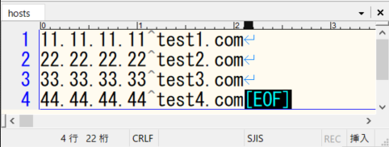

.. image:: ./menu_creation/image1.png
   :width: 3.35069in
   :height: 0.79236in

ITA_利用手順マニュアル

メニュー作成機能

*－*\ 第1.10版\ *－*

Copyright © NEC Corporation 2020. All rights reserved.

免責事項

本書の内容はすべて日本電気株式会社が所有する著作権に保護されています。

本書の内容の一部または全部を無断で転載および複写することは禁止されています。

本書の内容は将来予告なしに変更することがあります。

日本電気株式会社は、本書の技術的もしくは編集上の間違い、欠落について、一切責任を負いません。

日本電気株式会社は、本書の内容に関し、その正確性、有用性、確実性その他いかなる保証もいたしません。

商標

-  LinuxはLinus
      Torvalds氏の米国およびその他の国における登録商標または商標です。

-  Red Hatは、Red Hat,
      Inc.の米国およびその他の国における登録商標または商標です。

-  Apache、Apache Tomcat、Tomcatは、Apache Software
      Foundationの登録商標または商標です。

-  Ansibleは、Red Hat, Inc.の登録商標または商標です。

-  Terraformは、HashiCorpの登録商標または商標です。

その他、本書に記載のシステム名、会社名、製品名は、各社の登録商標もしくは商標です。

なお、® マーク、TMマークは本書に明記しておりません。

※本書では「Exastro IT Automation」を「ITA」として記載します。

**目次­­**

`はじめに <#はじめに>`__ `3 <#はじめに>`__

`1 メニュー作成機能の概要 <#メニュー作成機能の概要>`__
`4 <#メニュー作成機能の概要>`__

`2 メニュー作成機能の主要機能 <#メニュー作成機能の主要機能>`__
`7 <#メニュー作成機能の主要機能>`__

`3
メニュー作成機能のメニューグループ <#メニュー作成機能のメニューグループ>`__
`8 <#メニュー作成機能のメニューグループ>`__

`4
メニュー（パラメータシート/データシート）説明 <#メニューパラメータシートデータシート説明>`__
`10 <#メニューパラメータシートデータシート説明>`__

`5
「メニュー定義・作成」メニューの操作説明 <#メニュー定義作成メニューの操作説明>`__
`13 <#メニュー定義作成メニューの操作説明>`__

`5.1 (A)
項目・グループ・リピートの設定 <#a-項目グループリピートの設定>`__
`13 <#a-項目グループリピートの設定>`__

`5.2 (B) 「メニュー作成情報」タブ <#b-メニュー作成情報タブ>`__
`18 <#b-メニュー作成情報タブ>`__

`5.3 (C) メニュー作成実行 <#c-メニュー作成実行>`__
`24 <#c-メニュー作成実行>`__

`5.4
メニュー作成受付後の「メニュー定義・作成」メニューの使い方 <#メニュー作成受付後のメニュー定義作成メニューの使い方>`__
`25 <#メニュー作成受付後のメニュー定義作成メニューの使い方>`__

`5.5
「メニュー定義一覧」メニューでメニューを確認 <#メニュー定義一覧メニューでメニューを確認>`__
`29 <#メニュー定義一覧メニューでメニューを確認>`__

`5.6
「メニュー作成履歴」メニューで作成状況の確認 <#メニュー作成履歴メニューで作成状況の確認>`__
`32 <#メニュー作成履歴メニューで作成状況の確認>`__

`5.7 作成されたメニューの確認 <#作成されたメニューの確認>`__
`33 <#作成されたメニューの確認>`__

`6
「メニュー作成」メニューグループのインストール時非表示メニュー <#メニュー作成メニューグループのインストール時非表示メニュー>`__
`47 <#メニュー作成メニューグループのインストール時非表示メニュー>`__

`6.1
「カラムグループ管理」メニューでカラムグループを登録 <#カラムグループ管理メニューでカラムグループを登録>`__
`47 <#カラムグループ管理メニューでカラムグループを登録>`__

`6.2
「メニュー項目作成情報」メニューで設定する項目を登録 <#メニュー項目作成情報メニューで設定する項目を登録>`__
`49 <#メニュー項目作成情報メニューで設定する項目を登録>`__

`6.3
「メニュー(縦)作成情報」メニューで縦型登録 <#メニュー縦作成情報メニューで縦型登録>`__
`53 <#メニュー縦作成情報メニューで縦型登録>`__

`6.4
「一意制約(複数項目)作成情報」メニューで一意制約(複数項目)を登録 <#一意制約複数項目作成情報メニューで一意制約複数項目を登録>`__
`55 <#一意制約複数項目作成情報メニューで一意制約複数項目を登録>`__

`6.5
「メニュー作成実行」メニューでパラメータシート/データシートを作成 <#メニュー作成実行メニューでパラメータシートデータシートを作成>`__
`57 <#メニュー作成実行メニューでパラメータシートデータシートを作成>`__

`7 運用操作 <#運用操作>`__ `59 <#運用操作>`__

`7.1 メンテナンス <#メンテナンス>`__ `59 <#メンテナンス>`__

`7.2 ログレベルの変更 <#ログレベルの変更>`__ `60 <#ログレベルの変更>`__

`8 付録 <#付録>`__ `61 <#付録>`__

`8.1 PHPファイルの配置 <#phpファイルの配置>`__
`61 <#phpファイルの配置>`__

`8.2 メニュー・テーブル紐付 <#メニューテーブル紐付>`__
`62 <#メニューテーブル紐付>`__

`8.3 他メニュー連携 <#他メニュー連携>`__ `63 <#他メニュー連携>`__

`8.4 メニュー縦横変換管理 <#メニュー縦横変換管理>`__
`64 <#メニュー縦横変換管理>`__

`8.5 選択1 <#選択1>`__ `65 <#選択1>`__

`8.6 選択2 <#選択2>`__ `66 <#選択2>`__

`8.7
「プルダウン選択」の「選択項目」で利用できる対象について <#プルダウン選択の選択項目で利用できる対象について>`__
`67 <#プルダウン選択の選択項目で利用できる対象について>`__

`8.8
「プルダウン選択」利用時の「参照項目」について <#プルダウン選択利用時の参照項目について>`__
`68 <#プルダウン選択利用時の参照項目について>`__

`8.9 参照項目情報 <#参照項目情報>`__ `70 <#参照項目情報>`__

`8.10
縦メニュー利用時のリピート対象外の項目について <#縦メニュー利用時のリピート対象外の項目について>`__
`71 <#縦メニュー利用時のリピート対象外の項目について>`__

`8.11
入力方式「パラメータシート参照」について <#入力方式パラメータシート参照について>`__
`72 <#入力方式パラメータシート参照について>`__

`8.12
「参照項目」「パラメータシート参照」を用いたメニューのプルダウン検索について <#参照項目パラメータシート参照を用いたメニューのプルダウン検索について>`__
`74 <#参照項目パラメータシート参照を用いたメニューのプルダウン検索について>`__

`8.13
「文字列(複数行)」の項目を「プルダウン選択」にした際のリンクについて <#文字列複数行の項目をプルダウン選択にした際のリンクについて>`__
`77 <#文字列複数行の項目をプルダウン選択にした際のリンクについて>`__

`8.14
Excelファイルアップロードによるメニュー作成について <#excelファイルアップロードによるメニュー作成について>`__
`78 <#excelファイルアップロードによるメニュー作成について>`__

はじめに
========

本書では、ITAメニュー作成
（以降、メニュー作成）システムの機能および操作方法について説明します。

メニュー作成機能の概要
======================

メニュー作成機能は、ITA上で操作可能なメニューを作成する機能です。

作成するメニューの種類として、「パラメータシート」と「データシート」があります。

作成したメニュー（パラメータシート/データシート）は、他のメニューと同様にWeb、Excel、RestAPIから操作が可能です。

メニュー（パラメータシート/データシート）の項目数や形式・サイズ・入力制限はメニュー作成機能で自由に設計することが可能です。

1. パラメータシート

   -  *IaCの変数値を管理*

      -  各ドライバの「代入値自動登録設定」メニューで設定可能なパラメータシートの作成が可能です。

      -  「メニュー作成」メニューグループ＞「メニュー定義・作成」メニュー＞「メニュー作成情報」タブ＞「基本情報」枠＞「作成対象」項目にて、「パラメータシート（オペレーションあり）」および「パラメータシート（ホスト/オペレーションあり）」を選択し作成したメニューをパラメータシートと呼びます。

      -  各ドライバの「代入値自動登録設定」メニューにて、対象となるパラメータシートとIaC変数を設定しておくことで、パラメータシートの「パラメータ」項目に入力された値をIaC変数に自動で代入することが可能です。

   -  *オペレーションあり*

パラメータシートが「オペレーション」単位で作成されます。

-  | *ホスト/オペレーションあり*
   | パラメータシートが「ホスト」と「オペレーション」単位で作成されます。

-  *ホストグループ利用
   *\ 「ホストグループ機能」との連携で、ホストグループに対してのIaC変数値の管理が可能です。

-  *縦メニュー利用
   *\ 同一項目を繰り返すパラメータ設定を行う場合、視認性をよくする縦メニューの利用が可能です。

2. データシート

   -  *ITA内でデータの管理*

      -  自由に項目を作成できるデータシートの作成が可能です。データシートは各ドライバの「代入値自動登録設定」メニューでは利用できません。

      -  CMDB（Configuration Management
         Database、構成管理データベース）として、ITA上で情報を管理する場合に利用できます。

      -  他のメニューからプルダウンで選択する項目の参照元として利用することで、文言の揺れなどを防ぐことが可能です。

..

   例）パラメータシート（ホスト/オペレーションあり）

   .. image:: ./menu_creation/image2.png
      :width: 6.67391in
      :height: 3.20028in

   図　1-1　パラメータシート

   例）データシート

   .. image:: ./menu_creation/image3.png
      :width: 6.69236in
      :height: 2.95139in

   図　1-2 データシート

   例）「参照するプルダウン」としてデータシートを利用する方法

   入力値をプルダウン形式で選択できることで、手打ち入力による文言の揺れを防ぐことが可能です。

   ・「参照するプルダウン」としてデータシートを作成します。

   .. image:: ./menu_creation/image4.png
      :width: 6.23387in
      :height: 2.7069in

   図　1-3　参照元となるデータシート

   ・入力方式に「プルダウン選択」を指定しメニュー（パラメータシート/データシート）を作成します。

   .. image:: ./menu_creation/image5.png
      :width: 6.30055in
      :height: 2.3202in

   図1-4　データシートの登録値をプルダウンメニューで参照するパラメータシート

メニュー作成機能の主要機能
==========================

メニュー作成機能の主要機能は次のカテゴリーに分類されます。

-  | Web
   | Webコンテンツ。ブラウザで提供されるメニュー作成機能を使用できる画面。

-  | BackYard
   | Webコンテンツとは独立してサーバ上で動作する常駐プロセス。

メニュー作成機能のメニューグループ
==================================

「メニュー作成」メニューグループと、それに所属するメニューは以下となります。

-  | 「メニュー定義・作成」メニューでメニュー（パラメータシート/データシート）を作成する場合、「メニュー定義一覧」「カラムグループ管理」「メニュー項目作成情報」「メニュー(縦)作成情報」の各メニューへデータが自動で登録されるため、各メニュー内でデータを作成する必要はありません。
   | また、自動でメニュー（パラメータシート/データシート）が作成されるため「メニュー作成実行」メニューで作成実行する必要もありません。

-  | 非表示になっているメニューを使用したい場合は、「ロール・メニュー紐付管理」で対象のメニューを復活させてください。
   | （復活/廃止の手順は「Exastro-ITA_利用手順マニュアル_管理コンソール」を参照してください。）

**表　3-1　「メニュー作成」メニューグループに所属するメニュー**

+--------+-----------------+-----+-------------------------------------+
| **メニ | **所属          | *   | **説明**                            |
| ュー** | するメニュー**  | *段 |                                     |
|        |                 | 落  |                                     |
| **グル |                 | **  |                                     |
| ープ** |                 |     |                                     |
+========+=================+=====+=====================================+
| メニュ | メニ            | **  | パラメータ                          |
| ー作成 | ュー定義・作成  | 5.1 | シートまたはデータシートとそれに紐  |
|        |                 | ~5. | づく項目を作成することが可能です。  |
|        |                 | 4** |                                     |
|        |                 |     | パラメータシートま                  |
|        |                 |     | たはデータシートの更新も可能です。  |
+--------+-----------------+-----+-------------------------------------+
|        | メ              | *   | 作成するパラメータ                  |
|        | ニュー定義一覧  | *5. | シートまたはデータシートをメンテナ  |
|        |                 | 5** | ンス(参照/更新/廃止/復活)できます。 |
+--------+-----------------+-----+-------------------------------------+
|        | メ              | *   | メニュー作成の状態を確認できます。  |
|        | ニュー作成履歴  | *5. |                                     |
|        |                 | 6** |                                     |
+--------+-----------------+-----+-------------------------------------+
|        | カラ            | *   | 作成するパラメータシートまたはデー  |
|        | ムグループ管理  | *6. | タシートのカラムグループをメンテナ  |
|        |                 | 1** | ンス(参照/更新/廃止/復活)できます。 |
|        |                 |     |                                     |
|        |                 |     | ※イン                               |
|        |                 |     | ストール時は非表示のメニューです。  |
+--------+-----------------+-----+-------------------------------------+
|        | メニュ          | *   | 作成するパラメータシートまたはデ    |
|        | ー項目作成情報  | *6. | ータシートで管理する項目をメンテナ  |
|        |                 | 2** | ンス(参照/更新/廃止/復活)できます。 |
|        |                 |     |                                     |
|        |                 |     | ※イン                               |
|        |                 |     | ストール時は非表示のメニューです。  |
+--------+-----------------+-----+-------------------------------------+
|        | メニュ          | *   | 作成するパラメータ                  |
|        | ー(縦)作成情報  | *6. | シートまたはデータシートのメニュー  |
|        |                 | 3** | 名、開始項目名を選択し縦管理表示の  |
|        |                 |     | 項目数、繰り返し数を指定できます。  |
|        |                 |     |                                     |
|        |                 |     | ※イン                               |
|        |                 |     | ストール時は非表示のメニューです。  |
+--------+-----------------+-----+-------------------------------------+
|        | 一意            | *   | 作成                                |
|        | 制約(複数項目)  | *6. | するパラメータシートまたはデータシ  |
|        |                 | 4** | ートの一意制約(複数項目)をメンテナ  |
|        |                 |     | ンス(参照/更新/廃止/復活)できます。 |
|        |                 |     |                                     |
|        |                 |     | ※イン                               |
|        |                 |     | ストール時は非表示のメニューです。  |
+--------+-----------------+-----+-------------------------------------+
|        | メ              | *   | 「メニュー作成情報」で指定し        |
|        | ニュー作成実行  | *6. | たメニューグループにパラメータシー  |
|        |                 | 5** | トまたはデータシートを作成します。  |
|        |                 |     |                                     |
|        |                 |     | ※イン                               |
|        |                 |     | ストール時は非表示のメニューです。  |
+--------+-----------------+-----+-------------------------------------+
|        | メニュー        | *   | 作成したメニューと                  |
|        | ・テーブル紐付  | *8. | DBのテーブルの紐付けを表示します。  |
|        |                 | 2** |                                     |
|        |                 |     | ※イン                               |
|        |                 |     | ストール時は非表示のメニューです。  |
+--------+-----------------+-----+-------------------------------------+
|        | 他メニュー連携  | *   | 作成したメニューの                  |
|        |                 | *8. | メニューグループ、メニュー、項目、  |
|        |                 | 3** | DBのテーブルの紐付けを表示します。  |
|        |                 |     |                                     |
|        |                 |     | ※イン                               |
|        |                 |     | ストール時は非表示のメニューです。  |
+--------+-----------------+-----+-------------------------------------+
|        | メニュ          | *   | 作成した縦メニューから横変換さ      |
|        | ー縦横変換管理  | *8. | れるメニューの紐付けを表示します。  |
|        |                 | 4** |                                     |
|        |                 |     | ※イン                               |
|        |                 |     | ストール時は非表示のメニューです。  |
+--------+-----------------+-----+-------------------------------------+
|        | 選択1           | *   | プルダウン選択で使用する            |
|        |                 | *8. | 項目を管理するメニューです。(1択用) |
|        |                 | 5** |                                     |
|        |                 |     | ※イン                               |
|        |                 |     | ストール時は非表示のメニューです。  |
+--------+-----------------+-----+-------------------------------------+
|        | 選択2           | *   | プルダウン選択で使用する            |
|        |                 | *8. | 項目を管理するメニューです。(2択用) |
|        |                 | 6** |                                     |
|        |                 |     | ※イン                               |
|        |                 |     | ストール時は非表示のメニューです。  |
+--------+-----------------+-----+-------------------------------------+
|        | 参照項目情報    | *   | 参照項目                            |
|        |                 | *8. | として利用可能な項目を表示します。  |
|        |                 | 9** |                                     |
|        |                 |     | ※イン                               |
|        |                 |     | ストール時は非表示のメニューです。  |
+--------+-----------------+-----+-------------------------------------+

※「メニュー定義・作成」メニューではメニュー（パラメータシート/データシート）を1件ずつメンテナンス可能ですが、一度に複数のメニュー（パラメータシート/データシート）をメンテナンスしたい場合、「メニュー作成」メニューグループの各メニューからエクセルを使用し一括でメンテナンスすることが可能です。

メニュー（パラメータシート/データシート）説明
=============================================

-  作成するシートの分類

| メニュー作成する際、「メニュー作成」メニューグループ>「メニュー定義・作成」メニュー>「メニュー作成情報」タブ>「作成対象」欄にて、パラメータシート」を選択してメニュー作成を実行すると、各ドライバの「代入値自動登録設定」メニューで項目の設定が可能なメニュー（\ **パラメータシート）**\ が作成されます。
| 「データシート」を選択してメニュー作成を実行すると、「代入値自動登録設定」メニューでは利用できないメニュー（\ **データシート）**\ が作成されます。

.. image:: ./menu_creation/image6.png
   :width: 6.69236in
   :height: 1.84583in

図　4-1　「作成対象」欄

.. image:: ./menu_creation/image7.png
   :width: 5.21378in
   :height: 1.64681in

図　4-2　「作成対象」欄で「パラメータシート」を選択し作成されたメニュー（パラメータシート）

.. image:: ./menu_creation/image8.png
   :width: 5.09378in
   :height: 1.64681in

図　4-3　「作成対象」欄で「データシート」を選択し作成されたメニュー（データシート）

**パラメータシートとデータシートの比較**

+------------+--------------+---------------------+-------------------+
| **作成対象 | **代入値自   | **メニュー項目**    | **ホスト/オペレー |
| の選択値** | 動登録設定** |                     | ションとの関係**  |
+============+==============+=====================+===================+
| パラメ     | 設定可能     | 「ホス              | 特定の「          |
| ータシート |              | ト名」と「オペレー  | ホスト・オペレー  |
| （ホスト/  |              | ション」の項目が自  | ション」に紐付く  |
| オペレーシ |              | 動的に付与される。  |                   |
| ョンあり） |              |                     |                   |
|            |              | その他の項目        |                   |
|            |              | は自由に作成可能。  |                   |
+------------+--------------+---------------------+-------------------+
| パラメ     | 設定可能     | 「オペレー          | 特定の「オペレー  |
| ータシート |              | ション」の項目が自  | ション」に紐付く  |
| （         |              | 動的に付与される。  |                   |
| オペレーシ |              |                     |                   |
| ョンあり） |              | その他の項目        |                   |
|            |              | は自由に作成可能。  |                   |
+------------+--------------+---------------------+-------------------+
| デ         | 設定不可     | すべての項目        | 「ホスト」        |
| ータシート |              | を自由に作成可能。  | や「オペレーショ  |
|            |              |                     | ン」に紐付かない  |
+------------+--------------+---------------------+-------------------+

..

   **表　4-1　メニュー（パラメータシート/データシート）の比較**

   ※データシートは、他のメニューからプルダウンで選択する項目の参照元としての利用や、CMDB（Configuration
   Management
   Database、構成管理データベース）としてITA上でデータを一元管理する等の利用を想定しています。

-  作成するメニューの作成パターン

メニュー作成機能で作成できるメニュー（パラメータシート/データシート）の作成パターンは合計5つです。

#. パラメータシート選択　＆　「ホストグループ」利用あり　＆　「縦メニュー」利用あり

#. パラメータシート選択　＆　「ホストグループ」利用あり

#. パラメータシート選択　＆　「縦メニュー」利用あり

#. パラメータシート選択

#. データシート選択

パラメータシートを選択した場合、メニューグループ３つに対してメニュー（パラメータシート）が作成されます。

A. 入力用

B. 代入値自動登録用

C. 参照用

データシートを選択した場合、メニューグループ1つに対してメニュー（データシート）が作成されます。

A) 入力用

|image1|\ メニュー（パラメータシート/データシート）のメンテナンス（登録/更新/廃止/復活）操作が行えるのは「A）入力用」メニューグループのみであり、その他のメニューグループではメンテナンス（登録/更新/廃止/復活）操作が行えません。

**図　4-4　メニュー作成パターン**

・ホストグループ利用

   作業対象ホストを、ホストグループ機能を利用してグルーピングする場合、ホストグループの利用を推奨します。ホストグループ機能については、「利用手順マニュアル_ホストグループ機能」を参照してください。

・縦メニュー利用

   例えばhostsファイルの「IPアドレス」＋「ドメイン」のように同じ項目を繰り返して定義する場合、視認性をよくするため縦メニュー利用を推奨します。カーネルパラメータのように同じ項目数を繰り返して定義しない場合は、縦メニューを利用せず、通常メニューの利用を推奨します。

.. image:: ./menu_creation/image10.png
   :width: 5.02755in
   :height: 0.94812in

図　4-5　「通常メニュー」と「縦メニュー」の比較

「メニュー定義・作成」メニューの操作説明
========================================

「メニュー作成」メニューグループの「メニュー定義・作成」メニューでは、メニュー（パラメータシート/データシート）の作成と項目の設定が同時に行えます。

.. image:: ./menu_creation/image11.png
   :width: 6.69236in
   :height: 4.15903in

図5-1　「メニュー定義・作成」メニュー

(A) 項目・グループ・リピートの設定
----------------------------------

・メニュー（パラメータシート/データシート）に設定する項目を作成します。

-  | 「項目」ボタン
   | :guilabel:`項目`「項目」ボタンを押下すると項目が出力され設定できるようになります。プルダウンメニューから入力方式を選択し、必須項目を入力するとメニュー（パラメータシート/データシート）に項目として追加することが可能です。

|image2|　　　　　　　　　　　　　

図　5.1-1　項目作成

表　5.1-1　項目の設定値

+-----+-----+---------------------------------------------------------+
| *   |     | **説明**                                                |
| *設 |     |                                                         |
| 定  |     |                                                         |
| 箇  |     |                                                         |
| 所  |     |                                                         |
| **  |     |                                                         |
+=====+=====+=========================================================+
| 項  |     | 項目の名称を入力します。                                |
| 目  |     |                                                         |
| 名  |     | ※項目名に「/」は使用禁止です。                          |
|     |     |                                                         |
| (初 |     | ※「リピート枠内で使用した名                             |
| 期  |     | 称[数字]」は、リピート枠外の項目名には使用できません。  |
| 値  |     |                                                         |
| は  |     |                                                         |
| 「  |     |                                                         |
| 項  |     |                                                         |
| 目1 |     |                                                         |
| 」) |     |                                                         |
+-----+-----+---------------------------------------------------------+
| 必  |     | 必須項目にする場合は、チェックボックスを選択します。    |
| 須  |     |                                                         |
+-----+-----+---------------------------------------------------------+
| 一  |     | 一                                                      |
| 意  |     | 意制約項目にする場合は、チェックボックスを選択します。  |
| 制  |     |                                                         |
| 約  |     |                                                         |
+-----+-----+---------------------------------------------------------+
| 入  |     | | 入力方式をプルダウンメニューの「文字列(単一行         |
| 力  |     | )」、「文字列(複数行)」、「整数」、「小数」、「日時」、 |
| 方  |     | 「日付」、「プルダウン選択」、「パスワード」、「ファイ  |
| 式  |     | ルアップロード」、「リンク」のいずれかから選択します。  |
|     |     | | 「文字列(単一行)」を選択した場合、                    |
| (プ |     | 単一行のみ入力可能なテキストボックスの項目になります。  |
| ル  |     |                                                         |
| ダ  |     | 「文字列(複数行)」を選択した場合                        |
| ウ  |     | 、複数行が入力可能なテキストボックスの項目になります。  |
| ン  |     |                                                         |
| メ  |     | 「整数」を選択した場合、整数であること                  |
| ニ  |     | のチェックが行われるテキストボックスの項目になります。  |
| ュ  |     |                                                         |
| ー) |     | 「小数」を選択した場合、小数であること                  |
|     |     | のチェックが行われるテキストボックスの項目になります。  |
|     |     |                                                         |
|     |     | 「日時」と「                                            |
|     |     | 日付」を選択した場合、カレンダー選択の項目になります。  |
|     |     |                                                         |
|     |     | 「プルダウン選択」を選択し                              |
|     |     | た場合、プルダウンの項目になります。データを登録した際  |
|     |     | に値がリンクとなり、クリックで元データが登録されている  |
|     |     | メニューへ遷移できます。遷移後に表示フィルタの検索条件  |
|     |     | にデータが設定されて検索されますが、検索文字列は先頭か  |
|     |     | ら最大1024バイトとなります。（「文字列(複数行)」の項目  |
|     |     | をプルダウン選択にした際のリンクの挙動が変わります。「  |
|     |     | *8.13「文字列(複数行)」の項目を「プルダウン選択」       |
|     |     | にした際のリンクについて*\ 」に詳細を記載しています。） |
|     |     |                                                         |
|     |     | また「参照項目                                          |
|     |     | を選択」ボタンから、「プルダウン選択」で選んだレコード  |
|     |     | と同じ行のレコードを横並びで表示させることができます。  |
|     |     |                                                         |
|     |     | 「パスワード                                            |
|     |     | 」を選択した場合、入力中の文字列が「●」で隠された状態の |
|     |     | テキストボックスの項目になります。（枠内の瞳のアイコン  |
|     |     | を押下している間のみ、入力した文字列が表示されます。）  |
|     |     |                                                         |
|     |     | | 「フ                                                  |
|     |     | ァイルアップロード」を選択した場合、ファイルを参照し選  |
|     |     | 択できるボタンと「事前アップロード」ボタンのある項目に  |
|     |     | なり、ファイルをアップロードすることが可能になります。  |
|     |     | | 「リンク」を選択した場合、入力した                    |
|     |     | URLがリンク表示になるテキストボックスの項目になります。 |
|     |     |                                                         |
|     |     | 「パ                                                    |
|     |     | ラメータシート参照」を選択した場合、作成対象「パラメー  |
|     |     | タシート(オペレーションあり)」で作成したメニューの項目  |
|     |     | を選択し、データを登録した際にオペレーションが一致する  |
|     |     | 項目のレコードが参照されます。また、「パラメータシート  |
|     |     | 参照」は作成対象「データシート」では利用できません。「  |
|     |     | *8.11入力方式「パラ                                     |
|     |     | メータシート参照」について*\ 」に詳細を記載しています。 |
|     |     |                                                         |
|     |     | ※代入値自動登録設定の連携                               |
|     |     | 対象項目は「文字列(単一行)」、「文字列(複数行)」、「整  |
|     |     | 数」、「小数」、「パスワード」、「リンク」になります。  |
|     |     |                                                         |
|     |     | 「日時」、「日付」、「                                  |
|     |     | ファイルアップロード」は連携しません。「プルダウン選択  |
|     |     | 」で選ぶ項目が「日時」、「日付」の場合も連携しません。  |
+-----+-----+---------------------------------------------------------+
| 文  | 最  | 最大バイト数を入力します。                              |
| 字  | 大  |                                                         |
| 列  |     | 最大は8192バイトです。                                  |
|     | バ  |                                                         |
| (単 | イ  | 半角英数字なら文字数分となります。                      |
| 一  | ト  |                                                         |
| 行) | 数  | 全角文字ならば文字数×3＋2バイト必要になります。         |
|     |     |                                                         |
|     |     | 「入力方式」が「文字列(単一行)」の場合、入力必須です。  |
+-----+-----+---------------------------------------------------------+
|     | 正  | 正規表現に                                              |
|     | 規  | よる入力値チェックを行う場合は、正規表現を入力します。  |
|     |     |                                                         |
|     | 表  | 例：0バイト以上の半角数値項目の場合：/^[0-9]*$/         |
|     | 現  |                                                         |
|     |     | 1バイト以上の半角英数字の場合：/^[a-zA-Z0-9]+$/         |
+-----+-----+---------------------------------------------------------+
|     | 初  | 作成したメニューからデータ                              |
|     | 期  | を登録する際、デフォルトで入力欄に入る値を入力します。  |
|     | 値  |                                                         |
|     |     | 項目に設定した「最大バイト数」                          |
|     |     | を超える値、「正規表現」に不一致な値は入力できません。  |
|     |     |                                                         |
|     |     | また、作成したメニューからデータをExcel出力した際に、   |
|     |     | 項目の空欄に初期値に設定した値が入った状態となります。  |
+-----+-----+---------------------------------------------------------+
| 文  | 最  | 最大バイト数を入力します。                              |
| 字  | 大  |                                                         |
| 列  |     | 最大は8192バイトです。                                  |
|     | バ  |                                                         |
| (複 | イ  | 半角英数字なら文字数分となります。                      |
| 数  | ト  |                                                         |
| 行) | 数  | 全角文字ならば文字数×3＋2バイト必要になります。         |
|     |     |                                                         |
|     |     | 「入力方式」が「文字列(複数行)」の場合、入力必須です。  |
+-----+-----+---------------------------------------------------------+
|     | 正  | 正規表現に                                              |
|     | 規  | よる入力値チェックを行う場合は、正規表現を入力します。  |
|     |     |                                                         |
|     | 表  | 例：0バイト以上の半角数値項目の場合：/^[0-9]*$/         |
|     | 現  |                                                         |
|     |     | 1バイト以上の半角英数字の場合：/^[a-zA-Z0-9]+$/         |
+-----+-----+---------------------------------------------------------+
|     | 初  | 作成したメニューからデータ                              |
|     | 期  | を登録する際、デフォルトで入力欄に入る値を入力します。  |
|     | 値  |                                                         |
|     |     | 項目に設定した「最大バイト数」                          |
|     |     | を超える値、「正規表現」に不一致な値は入力できません。  |
|     |     |                                                         |
|     |     | また、作成したメニューからデータをExcel出力した際に、   |
|     |     | 項目の空欄に初期値に設定した値が入った状態となります。  |
+-----+-----+---------------------------------------------------------+
| 整  | 最  | 最小値を入力します。                                    |
| 数  | 小  |                                                         |
|     | 値  | -2147483648～2147483647の整数数値が入力できます。       |
|     |     |                                                         |
|     |     | 未入力の場合は-2147483648になります。                   |
|     |     |                                                         |
|     |     | 最小値は最大値より小さい数値を入力してください。        |
+-----+-----+---------------------------------------------------------+
|     | 最  | 最大値を入力します。                                    |
|     | 大  |                                                         |
|     | 値  | -2147483648～2147483647の整数数値が入力できます。       |
|     |     |                                                         |
|     |     | 未入力の場合は2147483647になります。                    |
|     |     |                                                         |
|     |     | 最大値は最小値より大きい数値を入力してください。        |
+-----+-----+---------------------------------------------------------+
|     | 初  | 作成したメニューからデータ                              |
|     | 期  | を登録する際、デフォルトで入力欄に入る値を入力します。  |
|     | 値  |                                                         |
|     |     | 項目に設定した「最小                                    |
|     |     | 値」を下回る値、「最大値」を上回る値は入力できません。  |
|     |     |                                                         |
|     |     | また、作成したメニューからデータをExcel出力した際に、   |
|     |     | 項目の空欄に初期値に設定した値が入った状態となります。  |
+-----+-----+---------------------------------------------------------+
| 小  | 最  | 最小値を入力します。                                    |
| 数  | 小  |                                                         |
|     | 値  | -99999999999999～999999999                              |
|     |     | 99999、整数・小数合計14桁以下の小数数値が入力できます。 |
|     |     |                                                         |
|     |     | 未入力の場合は-99999999999999になります。               |
|     |     |                                                         |
|     |     | 最小値は最大値より小さい数値を入力してください。        |
+-----+-----+---------------------------------------------------------+
|     | 最  | 最大値を入力します。                                    |
|     | 大  |                                                         |
|     | 値  | -99999999999999～999999999                              |
|     |     | 99999、整数・小数合計14桁以下の小数数値が入力できます。 |
|     |     |                                                         |
|     |     | 未入力の場合は99999999999999になります。                |
|     |     |                                                         |
|     |     | 最大値は最小値より大きい数値を入力してください。        |
+-----+-----+---------------------------------------------------------+
|     | 桁  | 整数・小数の合計桁数上限を入力します。                  |
|     | 数  |                                                         |
|     |     | 例: 0.123は4桁 (整数1桁、小数3桁)                       |
|     |     |                                                         |
|     |     | 11.1111は6桁　 (整数2桁、小数4桁)                       |
|     |     |                                                         |
|     |     | 1～14の整数数値が入力できます。                         |
|     |     |                                                         |
|     |     | 未入力の場合は14になります。                            |
+-----+-----+---------------------------------------------------------+
|     | 初  | 作成したメニューからデータ                              |
|     | 期  | を登録する際、デフォルトで入力欄に入る値を入力します。  |
|     | 値  |                                                         |
|     |     | 項目に設定した「最小値」を下回る値、「最                |
|     |     | 大値」を上回る値、「桁数」を超える値は入力できません。  |
|     |     |                                                         |
|     |     | また、作成したメニューからデータをExcel出力した際に、   |
|     |     | 項目の空欄に初期値に設定した値が入った状態となります。  |
+-----+-----+---------------------------------------------------------+
| プ  | 選  | 作成したメニュー(パラメータシート/デ                    |
| ル  | 択  | ータシート)から参照する対象をプルダウンから選択します。 |
| ダ  |     |                                                         |
| ウ  | 項  | 「選択項目」欄の文                                      |
| ン  | 目  | 字列は「メニューグループ：メニュー：項目」の構成です。  |
| 選  |     |                                                         |
| 択  |     | 「入力方式」が「プルダウン選択」の場合、選択必須です。  |
|     |     |                                                         |
|     |     | ※「選択項目」に表示される対象は「                       |
|     |     | *8.7「プルダウン選択」の「選択                          |
|     |     | 項目」で利用できる対象について*\ 」を参照してください。 |
+-----+-----+---------------------------------------------------------+
|     | 参  | 「プルダウン                                            |
|     | 照  | 選択」の「選択項目」で選んだ項目に対して、同じメニュー  |
|     |     | に存在する別の項目を横並びで表示させることができます。  |
|     | 項  |                                                         |
|     | 目  | 「参照項目を選択」ボ                                    |
|     |     | タンを押下すると横並びで表示させることが可能な項目の一  |
|     |     | 覧が表示され、チェックボックスにチェックを入れて「決定  |
|     |     | 」ボタンを押下することで対象を指定することができます。  |
|     |     |                                                         |
|     |     | 詳細な利用方法は「                                      |
|     |     | *8.8「プルダウン選択                                    |
|     |     | 」利用時の「参照項目」について*\ 」を参照してください。 |
|     |     |                                                         |
|     |     | ※「参照項目」を利用したメニュ                           |
|     |     | ーについて、表示フィルタの「プルダウン検索」で値にカッ  |
|     |     | コがついた選択肢が表示される場合があります。詳しくは「  |
|     |     | *8.12「参照項目」「パラメータシート参照」を用いたメ     |
|     |     | ニューのプルダウン検索について*\ 」を参照してください。 |
+-----+-----+---------------------------------------------------------+
|     | 初  | 作成したメニューからデータを                            |
|     | 期  | 登録する際、デフォルトで選択されている値を指定します。  |
|     | 値  |                                                         |
|     |     | 項目に設定した「選択項                                  |
|     |     | 目」に登録されているデータをプルダウンから選択します。  |
|     |     |                                                         |
|     |     | また、作成したメニューからデータをExcel出力した際に、   |
|     |     | 項目の空欄に初期値に設定した値が入った状態となります。  |
+-----+-----+---------------------------------------------------------+
| パ  | 最  | 最大バイト数を入力します。                              |
| ス  | 大  |                                                         |
| ワ  |     | 最大は8192バイトです。                                  |
| ー  | バ  |                                                         |
| ド  | イ  | 半角英数字なら文字数分となります。                      |
|     | ト  |                                                         |
|     | 数  | 全角文字ならば文字数×3＋2バイト必要になります。         |
|     |     |                                                         |
|     |     | 「入力方式」が「パスワード」の場合、入力必須です。      |
+-----+-----+---------------------------------------------------------+
| フ  | フ  | アップロードするファイルの最大バイト数を入力します。    |
| ァ  | ァ  |                                                         |
| イ  | イ  | 最大は4294967296バイトです。                            |
| ル  | ル  |                                                         |
| ア  | 最  | 「入力                                                  |
| ッ  | 大  | 方式」が「ファイルアップロード」の場合、入力必須です。  |
| プ  | バ  |                                                         |
| ロ  | イ  |                                                         |
| ー  | ト  |                                                         |
| ド  | 数  |                                                         |
+-----+-----+---------------------------------------------------------+
| リ  | 最  | 最大バイト数を入力します。                              |
| ン  | 大  |                                                         |
| ク  |     | 最大は8192バイトです。                                  |
|     | バ  |                                                         |
|     | イ  | 半角英数字なら文字数分となります。                      |
|     | ト  |                                                         |
|     | 数  | 全角文字ならば文字数×3＋2バイト必要になります。         |
|     |     |                                                         |
|     |     | 「入力方式」が「リンク」の場合、入力必須です。          |
+-----+-----+---------------------------------------------------------+
|     | 初  | 作成したメニューからデータ                              |
|     | 期  | を登録する際、デフォルトで入力欄に入る値を入力します。  |
|     | 値  |                                                         |
|     |     | 項目                                                    |
|     |     | に設定した「最大バイト数」を超える値は入力できません。  |
|     |     |                                                         |
|     |     | また、作成したメニューからデータをExcel出力した際に、   |
|     |     | 項目の空欄に初期値に設定した値が入った状態となります。  |
+-----+-----+---------------------------------------------------------+
| パ  | メ  | 作成対象「パラメータシート(オペレーショ                 |
| ラ  | ニ  | ンあり)」で作成したメニューをプルダウンから選択します。 |
| メ  | ュ  |                                                         |
| ー  | ー  |                                                         |
| タ  |     |                                                         |
| シ  |     |                                                         |
| ー  |     |                                                         |
| ト  |     |                                                         |
| 参  |     |                                                         |
| 照  |     |                                                         |
+-----+-----+---------------------------------------------------------+
|     | 項  | 「パラメータシート参照」の「メニュー」で                |
|     | 目  | 選択したメニューから、参照する対象の項目を選択します。  |
|     |     |                                                         |
|     |     | 選択可能な項目は入力方式が「文字列(単一行)」「文字列    |
|     |     | (複数行)」「整数」「小数」「日時」「日付」「パスワード  |
|     |     | 」「ファイルアップロード」「リンク」のものが対象です。  |
|     |     |                                                         |
|     |     | ※「パラメータシート参照」を利用したメニュ               |
|     |     | ーについて、表示フィルタの「プルダウン検索」で値にカッ  |
|     |     | コがついた選択肢が表示される場合があります。詳しくは「  |
|     |     | *8.12「参照項目」「パラメータシート参照」を用いたメ     |
|     |     | ニューのプルダウン検索について*\ 」を参照してください。 |
+-----+-----+---------------------------------------------------------+
| 説  |     |                                                         |
| 明  |     |                                                         |
+-----+-----+---------------------------------------------------------+
| 備  |     | 項目                                                    |
| 考  |     | 名をマウスオーバーした際に表示される説明を入力します。  |
+-----+-----+---------------------------------------------------------+
|     |     | 備考欄を入力します。                                    |
+-----+-----+---------------------------------------------------------+

-  | 「グループ」ボタン
   | カラムグループを設定します。
   | 表示したカラムグループの領域に項目をドラッグ&ドロップすると設定できるようになります。
   | 1つのグループに対して複数の項目が設定できます。

.. image:: ./menu_creation/image13.png
   :width: 6.08396in
   :height: 1.41856in

　　　　　　　　

図　5.1-2　カラムグループ作成

-  | 「リピート」ボタン
   | 縦メニュー作成時に繰り返す項目と回数を設定し、自動適用します。
   | 「縦メニュー利用」欄のチェックボックス「利用する」にチェックを入れると「リピート」ボタンが有効になります。
   | 表示したREPEATの領域に項目をドラッグ&ドロップすると設定できるようになります。

| また、REPEATには2～99の整数値が入力できます。
| ※データシートでは縦メニューは使用不可です。また、一つのリピートに対して項目は複数設定できますが、設定できるリピートは一つだけになります。

.. image:: ./menu_creation/image14.png
   :width: 6.29921in
   :height: 3.12575in

　　　　　　　　　　

図　5.1-3　縦メニュー利用

-  | 「取り消し」ボタン
   | 入力・設定した項目を直前に戻します。

-  「やり直し」ボタン

「取り消し」ボタンを押す前の状態に戻します。

(B) 「メニュー作成情報」タブ
----------------------------

・メニュー作成のために必要な情報を入力します。

-  「基本情報」枠

表5.2-1　「基本情報」枠設定値

+----------+-------------------------------------------+-------+------+
| **設     | **説明**                                  | **作  |      |
| 定箇所** |                                           | 成対  |      |
|          |                                           | 象の  |      |
|          |                                           | 選択  |      |
|          |                                           | 値**  |      |
+==========+===========================================+=======+======+
|          |                                           | *     | **デ |
|          |                                           | *パラ | ータ |
|          |                                           | メー  | シー |
|          |                                           | タ**  | ト** |
|          |                                           |       |      |
|          |                                           | *     |      |
|          |                                           | *シー |      |
|          |                                           | ト**  |      |
+----------+-------------------------------------------+-------+------+
| 項番     | メニ                                      | 表示  | 表示 |
|          | ュー（パラメータシート/データシート）作成 |       |      |
|          | 時は「自動入力」と表示されます。既存メニ  |       |      |
|          | ュー（パラメータシート/データシート）の編 |       |      |
|          | 集時はそのメニューの項番が表示されます。  |       |      |
+----------+-------------------------------------------+-------+------+
| メ       | 作成す                                    | 表示  | 表示 |
| ニュー名 | るメニュー（パラメータシート/データシート |       |      |
|          | ）の名称を入力します。「メインメニュー」  |       |      |
|          | という名称はメニュー名に使用できません。  |       |      |
+----------+-------------------------------------------+-------+------+
| 作成対象 | プルダウンから「パラメー                  | 表示  | 表示 |
|          | タシート(ホスト/オペレーションあり)」、「 |       |      |
|          | パラメータシート(オペレーションあり)」、  |       |      |
|          | 「データシート」のいずれかを選択します。  |       |      |
|          |                                           |       |      |
|          | 「デー                                    |       |      |
|          | タシート」を選択すると、「対象メニューグ  |       |      |
|          | ループ」枠に「入力用」欄が表示されます。  |       |      |
|          |                                           |       |      |
|          | 「                                        |       |      |
|          | パラメータシート（オペレーションあり）」  |       |      |
|          | を選択すると、「基本情報」枠に「縦メニュ  |       |      |
|          | ー利用」チェックボックス、「対象メニュー  |       |      |
|          | グループ」枠に「入力用」欄、「代入値自動  |       |      |
|          | 登録用」欄、「参照用」欄が表示されます。  |       |      |
|          |                                           |       |      |
|          | 「パラメ                                  |       |      |
|          | ータシート（ホスト/オペレーションあり）」 |       |      |
|          | を選択すると、「基本情報」枠に「ホストグ  |       |      |
|          | ループ利用」チェックボックス、「縦メニュ  |       |      |
|          | ー利用」チェックボックス、「対象メニュー  |       |      |
|          | グループ」枠に「入力用」欄、「代入値自動  |       |      |
|          | 登録用」欄、「参照用」欄が表示されます。  |       |      |
|          |                                           |       |      |
|          | 初期値は「パラメータ                      |       |      |
|          | シート(ホスト/オペレーションあり)」です。 |       |      |
+----------+-------------------------------------------+-------+------+
| 表示順序 | メニューグループにおける表                | 表示  | 表示 |
|          | 示順序を入力します。昇順に表示されます。  |       |      |
+----------+-------------------------------------------+-------+------+
| ホ       | 「利用する」チェックボックス              | ※     | 非   |
| ストグル | にチェックをいれた場合、「入力用」メニュ  |       | 表示 |
| ープ利用 | ーグループにて「ホスト名/ホストグループ名 |       |      |
|          | 」単位のパラメータシートが作成されます。  |       |      |
|          |                                           |       |      |
|          | 「利用する」チェックボッ                  |       |      |
|          | クスにチェックを入れない場合は「ホスト名  |       |      |
|          | 」単位のパラメータシートが作成されます。  |       |      |
|          |                                           |       |      |
|          | ※「作成対象」欄で「パラメータシート（ホス |       |      |
|          | ト/オペレーションあり）」を選択した場合、 |       |      |
|          | 「ホストグループ利用」欄が表示されます。  |       |      |
+----------+-------------------------------------------+-------+------+
| 縦メニ   | 「作成対                                  | 表示  | 非   |
| ュー利用 | 象」欄で「パラメータシート」を選択した場  |       | 表示 |
|          | 合、「縦メニュー利用」欄が表示されます。  |       |      |
|          |                                           |       |      |
|          | 「利用する」チェックボ                    |       |      |
|          | ックスにチェックをいれた場合、縦メニュー  |       |      |
|          | に対応したパラメータシートを作成します。  |       |      |
+----------+-------------------------------------------+-------+------+
| 最終     | | 初期表示は「自動入力」となります。      | 表示  | 表示 |
| 更新日時 | | 閲覧、編集モードの場合表示されます。    |       |      |
|          |                                           |       |      |
|          | 最終更新者が「メニュー作成                |       |      |
|          | 機能」(BackYardがレコードを更新する際のユ |       |      |
|          | ーザ)である場合、そのレコードを除いた最新 |       |      |
|          | のレコードの最終更新日時が表示されます。  |       |      |
+----------+-------------------------------------------+-------+------+
| 最       | | 初期表示は「自動入力」となります。      | 表示  | 表示 |
| 終更新者 | | 閲覧、編集モードの場合表示されます      |       |      |
|          |                                           |       |      |
|          | 最終更新者が「メニュー作                  |       |      |
|          | 成機能」(BackYardがレコードを更新する際の |       |      |
|          | ユーザ)である場合、そのレコードを除いた最 |       |      |
|          | 新のレコードの最終更新者が表示されます。  |       |      |
+----------+-------------------------------------------+-------+------+

-  「対象メニューグループ」枠

メニュー（パラメータシート/データシート）作成時に使用するメニューグループを表示します。

「対象メニューグループを選択」ボタンを押下すると、「対象メニューグループ」選択画面が表示され、使用したいメニューグループを選択、設定することが出来ます。

表　5.2-2　「対象メニューグループ」枠設定値

+------+----------------------------------------------+-------+-------+
| **設 | **説明**                                     | **作  |       |
| 定箇 |                                              | 成対  |       |
| 所** |                                              | 象の  |       |
|      |                                              | 選択  |       |
|      |                                              | 値**  |       |
+======+==============================================+=======+=======+
|      |                                              | *     | **デ  |
|      |                                              | *パラ | ータ  |
|      |                                              | メー  | シー  |
|      |                                              | タ**  | ト**  |
|      |                                              |       |       |
|      |                                              | *     |       |
|      |                                              | *シー |       |
|      |                                              | ト**  |       |
+------+----------------------------------------------+-------+-------+
| 入   | 初期値は「入力用」メニューグループです。     | 表示  | 表示  |
| 力用 |                                              |       |       |
|      | 「                                           |       |       |
|      | 対象メニューグループ」選択画面の「入力用」列 |       |       |
|      | で選択したメニューグループ名が表示されます。 |       |       |
|      |                                              |       |       |
|      | ※選択必須項目です。                          |       |       |
+------+----------------------------------------------+-------+-------+
| 代入 | 初期値                                       | 表示  | 非    |
| 値自 | は「代入値自動登録用」メニューグループです。 |       | 表示  |
| 動登 |                                              |       |       |
| 録用 | 「作成対象」                                 |       |       |
|      | 欄が「パラメータシート」の場合、「対象メニュ |       |       |
|      | ーグループ」選択画面の「代入値自動登録用」列 |       |       |
|      | で選択したメニューグループ名が表示されます。 |       |       |
|      |                                              |       |       |
|      | ※「対象メニューグループ                      |       |       |
|      | 」枠に表示されている場合、選択必須項目です。 |       |       |
+------+----------------------------------------------+-------+-------+
| 参   | 初期値は「参照用」メニューグループです。     | 表示  | 非    |
| 照用 |                                              |       | 表示  |
|      | 「                                           |       |       |
|      | 作成対象」欄が「パラメータシート」の場合、「 |       |       |
|      | 対象メニューグループ」選択画面の「参照用」列 |       |       |
|      | で選択したメニューグループ名が表示されます。 |       |       |
|      |                                              |       |       |
|      | ※「対象メニューグループ                      |       |       |
|      | 」枠に表示されている場合、選択必須項目です。 |       |       |
+------+----------------------------------------------+-------+-------+

　　　　　　　　　　　　　

.. image:: ./menu_creation/image15.png
   :width: 5.4125in
   :height: 2.39482in

図　5.2-1　「対象メニューグループ」選択画面

※画像は「作成対象」欄で「パラメータシート」を選択した場合になります。

-  「対象メニューグループ」選択画面

   -  メニュー（パラメータシート/データシート）を作成する対象となるメニューグループを選択します。

   -  デフォルトでは「入力用」「代入値自動登録用」「参照用」メニューグループが選択されています。

   -  使用したいメニューグループを選択し「決定」ボタンを押下してください。

   -  デフォルトのまま「決定」ボタンを押下すると、自動的に「入力用」「代入値自動登録用」「参照用」メニューグループが作成されます。（「作成対象」欄で「データシート」を選択した場合は「入力用」メニューグループのみ作成されます。）

   -  デフォルトのメニューグループを使用しない場合は、事前に「管理コンソール」メニューグループで作成してください。（作成方法については「利用手順マニュアル_管理コンソール」を参照してください。）

   -  「メニュー定義/一覧」メニューに戻る場合は「取消」ボタンを押下してください。

   -  「一意制約(複数項目)」枠

作成したメニューにデータを登録する際に、指定した複数の項目で同じレコードの組み合わせが登録できないように制御する機能です。

.. image:: ./menu_creation/image16.png
   :width: 5.91544in
   :height: 5.18333in

図　5.2-2　「一意制約(複数項目)」の機能

「一意制約(複数項目)を選択」ボタンを押下すると、「一意制約(複数項目)」設定画面が表示され、一意制約を適用させる項目の組み合わせを設定できます。

-  「一意制約(複数項目)」設定画面

-  「パターンを追加」ボタンを押下することで組み合わせのパターンが1つ追加されます。パターンは複数設定することができます。

-  パターンには現在の項目がすべて表示され、項目をクリックすることで一意制約とする項目の組み合わせを設定できます。

-  不要なパターンは「削除」ボタンを押下することで削除することができます。

-  「取消」ボタンを押下することで、設定を反映させずに設定画面を閉じることができます。

-  「決定」ボタンを押下することで、設定した組み合わせのパターンが反映されます。

.. image:: ./menu_creation/image17.png
   :width: 6.26679in
   :height: 3.65152in

図　5.2-3　「一意制約(複数項目)」設定画面

-  以下のパターンはバリデーションエラーになります。

..

   ① 1つのパターンに項目が1つしか選択されていない場合。

   ② 同じ項目の組み合わせのパターンが存在する場合。

.. image:: ./menu_creation/image18.png
   :width: 4.23577in
   :height: 1.98283in

図　5.2-4　「一意制約(複数項目)」バリデーションエラーパターン

-  「アクセス許可ロール」枠

   -  ロールを選択した場合

   -  メニュー定義（「メニュー作成」メニューグループ配下の各メニュー）は、選択したロールからのみアクセスが可能となります。

   -  作成したメニュー（パラメータシート/データシート）は、「ロール/メニュー紐付管理」メニューの設定により選択したロールのみアクセス可能となります。

   -  ロールを一つも選択しなかった場合

   -  メニュー定義（「メニュー作成」メニューグループ配下の各メニュー）は、すべてのロールがアクセス可能となります。

   -  作成したメニュー（パラメータシート/データシート）は、「ロール/メニュー紐付管理」メニューの設定によりシステム管理者のロールと作成ユーザが所属するロールのみアクセス可能となります。

 (C) メニュー作成実行
---------------------

-  「プレビュー」タブ

入力中の項目がテーブル形式で表示されます。

-  「ログ」タブ

「作成」ボタン押下後の作成実行結果の内容を表示します。

-  「作成」ボタン(新規作成時)

必須項目入力後に押下するとメニュー（パラメータシート/データシート）の作成を行います。

確認のダイアログでOKを押下すると下記のダイアログが表示されます。

.. image:: ./menu_creation/image19.png
   :width: 3.15833in
   :height: 1.09722in

図　5.3-1　メニュー受付のダイアログ

作成後は閲覧画面下部の「メニュー作成履歴」ボタンから「メニュー作成履歴」メニューに遷移し、正常にメニューが作成されたか確認をしてください。

.. image:: ./menu_creation/image20.png
   :width: 4.94653in
   :height: 0.59481in

図　5.3-2　閲覧画面の「メニュー作成履歴」ボタン

「メニュー定義・作成」メニューでメニュー（パラメータシート/データシート）を作成した場合、「メニュー定義一覧」、「カラムグループ管理」、「メニュー作成項目」、「メニュー作成(縦)作成情報」の各メニューに対して自動でデータが入ります。

メニュー作成受付後の「メニュー定義・作成」メニューの使い方
----------------------------------------------------------

「メニュー定義・作成」メニューでメニュー(パラメータシート/データシート)を新規作成した後は、作成したメニューの編集や初期化、作成したメニューをテンプレートとして流用する形で新規作成することが可能です。

-  |image3|\ 閲覧画面

図　5.4-1　閲覧画面

| 新規作成後は上記の閲覧画面に遷移します。
| 閲覧画面ではメニュー（パラメータシート/データシート）の編集や作成は出来ません。

画面上に表示されている「編集」、「初期化」、「流用新規」ボタンを押下することで、編集や作成が可能になります。

「編集」ボタンと「初期化」ボタンではなく「作成」ボタンが表示される場合は、メニュー作成機能のBackYard処理がメニュー作成を完了していない状態です。メニュー作成完了後にブラウザ画面を更新すると、「編集」ボタンと「初期化」ボタンが表示されるようになります。

メニュー作成のステータスは「メニュー作成履歴」ボタンより遷移できる「メニュー作成履歴」メニューで確認できます。

.. image:: ./menu_creation/image22.png
   :width: 3.07895in
   :height: 0.69767in

図　5.4-2　Backyard処理が完了していない場合のボタン配置

-  | 「編集」ボタン
   | 「編集」ボタンを押下すると閲覧画面から編集画面へ遷移します。編集画面では、「入力用」メニューグループから登録したデータを保持したまま、項目の追加や削除が可能です（既存の項目の設定値や、基本情報は一部箇所を除いて修正できません）。編集し「作成(編集)」ボタンを押下するとメニュー（パラメータシート/データシート）の編集が実行されます。

-  「初期化」ボタン

..

   「初期化」ボタンを押下すると閲覧画面から初期化画面へ遷移します。初期化画面では値を編集し「作成(初期化)」ボタンを押下するとメニュー（パラメータシート/データシート）が再作成されます。再作成される際、「入力用」メニューグループから登録したデータは削除されます。

-  | 「流用新規」ボタン
   | 「流用新規」ボタンを押下すると、閲覧画面で表示中のメニューをテンプレートとして新規作成する画面へ遷移します。メニュー名と表示順序は新たに入力してください。
   | メニュー名は既存のメニュー名と違う名前にしてください。

-  | 「メニュー作成履歴」ボタン
   | 閲覧画面に表示されているメニューの「メニュー作成履歴」メニューに遷移します。

-  編集画面

.. image:: ./menu_creation/image23.png
   :width: 5.20712in
   :height: 2.76691in

図　5.4-3　編集画面

編集画面では「入力用」メニューグループで登録したデータを保持したまま、メニューの編集をすることが可能です。

既存項目は「項目名」「正規表現」「説明」「備考」の設定値を自由に変更できます。

「最大バイト数」「最小値」「最大値」「桁数」「ファイル最大バイト数」の設定値については、元の値よりも大きい数値にのみ変更できます。

「正規表現」を変更した場合、登録済みのデータが変更後の「正規表現」と不整合な状態になったとしてもデータは保持されます。

「最大バイト数」「最小値」「最大値」「桁数」「ファイル最大バイト数」の

既存項目を削除した場合、その項目に入力されていたデータは削除されます。

新規項目を追加した場合、レコードが空の状態で項目が追加されます。

「必須」「一意制約」にチェックを入れた場合でもレコードが空の状態となるため、登録データに不整合が生じる場合があります。

対象メニューグループを変更した場合、変更前に選択されていたメニューグループに作成されているメニューは廃止され、変更後のメニューグループに新たに登録されます。（その場合も登録したデータは保持されます。）

「基本情報」の「メニュー名」「作成対象」「ホストグループ利用」「縦メニュー利用」の設定値を変更することはできません。

「メニュー項目作成情報」メニューから項目のデータを更新して「作成(編集)」を実行した場合、作成したメニューに不整合が発生する場合があります。

-  | 「作成(編集)」ボタン
      | 編集画面に表示されているメニュー（パラメータシート/データシート）に、データを保持したまま編集します。
      | ※既存メニュー（パラメータシート/データシート）を編集する場合、項目間で項目名の交換ができないため、項目名を変更すると、作成する時エラーが発生する恐れがあります。

-  | 「再読込」ボタン
      | 編集内容が破棄されて登録内容の状態に戻ります。

-  | 「キャンセル」ボタン
      | 「編集」ボタン押下前の状態に戻ります。

-  初期化画面

.. image:: ./menu_creation/image24.png
   :width: 4.85375in
   :height: 2.58022in

図　5.4-4　初期化画面

初期化画面では画面に表示されているメニューを編集することが可能です。

対象メニューグループを変更した場合、変更前に選択されていたメニューグループに作成されているメニューは廃止され、変更後のメニューグループに新たに登録されます。

「基本情報」の「メニュー名」を変更することはできません。

「メニュー名」以外の編集に制限はありませんが、「入力用」メニューグループで登録したデータはすべて削除されます。

-  | 「作成(初期化)」ボタン
      | 編集画面に表示されているメニュー（パラメータシート/データシート）が再作成されます。
      | ※既存メニュー（パラメータシート/データシート）を編集する場合、項目間で項目名の交換ができないため、項目名を変更すると、作成する時エラーが発生する恐れがあります。

-  | 「再読込」ボタン
      | 編集内容が破棄されて登録内容の状態に戻ります。

-  | 「キャンセル」ボタン
      | 「編集」ボタン押下前の状態に戻ります。

「メニュー定義一覧」メニューでメニューを確認
--------------------------------------------

「メニュー定義一覧」メニューでは以下の確認および作業が可能です。

-  作成したメニュー（パラメータシート/データシート）の一覧表示

-  作成したメニュー（パラメータシート/データシート）のメンテナンス(参照/更新/廃止/復活)

-  「メニュー定義・作成」メニューを使用しないメニュー（パラメータシート/データシート）の作成

メニュー（パラメータシート/データシート）のメンテナンス(参照/更新/廃止/復活)が可能です。

.. image:: ./menu_creation/image25.png
   :width: 6.69236in
   :height: 2.95903in

図　5.5-1　「メニュー定義一覧」メニュー

「メニュー定義一覧」メニュー>「一覧/更新」サブメニューには作成したメニュー（パラメータシート/データシート）の一覧が表示されます。表示されている「メニュー定義・作成」ボタンを押下すると「メニュー定義・作成」メニューの閲覧画面に遷移します。

また、入力用・代入値自動登録用・参照用メニューグループのリンクをクリックすると、対象のメニューグループ管理画面へ遷移します。

**下記は「メニュー定義一覧」メニューでメニュー（パラメータシート/データシート）を作成する方法です。**

**「メニュー定義・作成」メニューでメニュー（パラメータシート/データシート）を作成した場合は不要です。**

表　5.5-1　「メニュー定義一覧」メニュー設定値

+---------+---------------------------------------------+------+------+
| **設定  | **説明**                                    | **作 |      |
| 箇所**  |                                             | 成対 |      |
|         |                                             | 象の |      |
|         |                                             | 選択 |      |
|         |                                             | 値** |      |
+=========+=============================================+======+======+
|         |                                             | **   | **デ |
|         |                                             | パラ | ータ |
|         |                                             | メー | シー |
|         |                                             | タ** | ト** |
|         |                                             |      |      |
|         |                                             | **   |      |
|         |                                             | シー |      |
|         |                                             | ト** |      |
+---------+---------------------------------------------+------+------+
| メニ    | 作成するメニュー（パラメータシート/データシ | 表示 | 表示 |
| ュー名  | ート）の名称を入力します。「メインメニュー  |      |      |
|         | 」という名称はメニュー名に使用できません。  |      |      |
|         |                                             |      |      |
|         | 「メニュー作成状態」が「作成済み」の場合    |      |      |
|         | 「メニュー名」を変更することはできません。  |      |      |
+---------+---------------------------------------------+------+------+
| 作      | プルダウンか                                | 表示 | 表示 |
| 成対象  | ら「パラメータシート(ホスト/オペレーション  |      |      |
|         | あり)」、「パラメータシート(オペレーション  |      |      |
|         | あり)」、「データシート」のいずれかを選択す |      |      |
|         | ると「一覧/更新」サブメニューおよび「登録」 |      |      |
|         | サブメニュー内でヘッダーの色が変わります。  |      |      |
|         |                                             |      |      |
|         | 「パラメータシート（ホスト/オペ             |      |      |
|         | レーションあり）」を選択すると、「表示順序  |      |      |
|         | 」欄、「用途」欄、「縦メニュー利用」欄、「  |      |      |
|         | 入力用メニューグループ」欄、「代入値自動登  |      |      |
|         | 録用メニューグループ」欄、「参照用メニュー  |      |      |
|         | グループ」欄、「説明」欄、「アクセス権」欄  |      |      |
|         | 、「備考」欄が設定箇所として表示されます。  |      |      |
|         |                                             |      |      |
|         | 「パラメータ                                |      |      |
|         | シート（オペレーションあり）」を選択すると  |      |      |
|         | 、「表示順序」欄、「縦メニュー利用」欄、「  |      |      |
|         | 入力用メニューグループ」欄、「代入値自動登  |      |      |
|         | 録用メニューグループ」欄、「参照用メニュー  |      |      |
|         | グループ」欄、「説明」欄、「アクセス権」欄  |      |      |
|         | 、「備考」欄が設定箇所として表示されます。  |      |      |
|         |                                             |      |      |
|         | 「データシート」を選                        |      |      |
|         | 択すると、「表示順序」欄、「入力用メニュー  |      |      |
|         | グループ」欄、「説明」欄、「アクセス権」欄  |      |      |
|         | 、「備考」欄が設定箇所として表示されます。  |      |      |
|         |                                             |      |      |
|         | 初期値は「パラメー                          |      |      |
|         | タシート(ホスト/オペレーションあり)」です。 |      |      |
+---------+---------------------------------------------+------+------+
| 表      | メニューグループにおける                    | 表示 | 表示 |
| 示順序  | 表示順序を入力します。昇順に表示されます。  |      |      |
+---------+---------------------------------------------+------+------+
| 用途    | 「作成対象」欄で                            | 表示 | 非   |
|         | 「パラメータシート（ホスト/オペレーションあ |      | 表示 |
|         | り）」を選択した場合、「用途」欄が表示され  |      |      |
|         | ます。「ホスト用」を選択した場合は「ホスト  |      |      |
|         | 名」単位のパラメータシートが作成されます、  |      |      |
|         |                                             |      |      |
|         | 「ホス                                      |      |      |
|         | トグループ用」を選択した場合、「入力用」メ  |      |      |
|         | ニューグループにて「ホスト名/ホストグループ |      |      |
|         | 名」単位のパラメータシートが作成されます。  |      |      |
+---------+---------------------------------------------+------+------+
| 縦      | 「作                                        | 表示 | 非   |
| メニュ  | 成対象」欄で「パラメータシート」を選択した  |      | 表示 |
| ー利用  | 場合、「縦メニュー利用」欄が表示されます。  |      |      |
|         |                                             |      |      |
|         | プルダウンから「●」を選択した場合、縦メニュ |      |      |
|         | ーに対応したパラメータシートを作成します。  |      |      |
+---------+---------------------------------------------+------+------+
| 入力    | 「作成対象」欄が「パラメー                  | 表示 | 表示 |
| 用メニ  | タシート」および「データシート」の場合、「  |      |      |
| ューグ  | 入力用メニューグループ」欄が表示されます。  |      |      |
| ループ  |                                             |      |      |
| ※       | パラ                                        |      |      |
|         | メータシートおよびデータシートを作成するメ  |      |      |
|         | ニューグループをプルダウンから選択します。  |      |      |
+---------+---------------------------------------------+------+------+
| 代      | 「作成対象」欄                              | 表示 | 非   |
| 入値自  | が「パラメータシート」の場合、「代入値自動  |      | 表示 |
| 動登録  | 登録用メニューグループ」欄が表示されます。  |      |      |
| 用メニ  |                                             |      |      |
| ューグ  | 代入                                        |      |      |
| ループ  | 値自動登録用のパラメータシートを作成するメ  |      |      |
| ※       | ニューグループをプルダウンから選択します。  |      |      |
+---------+---------------------------------------------+------+------+
| 参照    | 「作                                        | 表示 | 非   |
| 用メニ  | 成対象」欄が「パラメータシート」の場合、「  |      | 表示 |
| ューグ  | 参照用メニューグループ」欄が表示されます。  |      |      |
| ループ  |                                             |      |      |
| ※       | 参照用のパラメータシートを作成するメ        |      |      |
|         | ニューグループをプルダウンから選択します。  |      |      |
+---------+---------------------------------------------+------+------+
| メニ    | メニ                                        | 表示 | 表示 |
| ュー作  | ュー作成が実行されたかどうかのフラグです。  |      |      |
| 成状態  |                                             |      |      |
|         | 一度でも作成され                            |      |      |
|         | た場合は「作成済み」と表示されます。作成さ  |      |      |
|         | れていない場合は「未作成」と表示されます。  |      |      |
|         |                                             |      |      |
|         | 「作成済み」の                              |      |      |
|         | 場合「メニュー名」を変更できなくなります。  |      |      |
+---------+---------------------------------------------+------+------+
| 説明    | メニュ                                      | 表示 | 表示 |
|         | ー画面の説明欄に表示する内容を入力します。  |      |      |
+---------+---------------------------------------------+------+------+
| 備考    | 自由記述欄です。                            | 表示 | 表示 |
+---------+---------------------------------------------+------+------+

**※**\ デフォルトのメニューグループを使用しない場合は、事前に「管理コンソール」メニューグループで作成してください。（作成方法については「利用手順マニュアル_管理コンソール」を参照してください。）

「メニュー作成履歴」メニューで作成状況の確認
--------------------------------------------

パラメータシートまたはデータシートのメニュー作成の状態を確認します。

.. image:: ./menu_creation/image26.png
   :width: 5.90718in
   :height: 2.82691in

図　5.6-1　「メニュー作成履歴」メニュー

ステータス「未実行」をBackYardが監視しており、BackYardは未実行のデータを元に、メニュー（パラメータシート/データシート）の設定ファイル作成、SQLを実行してテーブル作成、メニュー（パラメータシート/データシート）画面プログラムの配置と登録を行います。

ステータスが「完了」になった時（数十秒程度）にメニュー（パラメータシート/データシート）がメニューグループに追加されます。

表5.6-1　「メニュー作成履歴」メニュー各項目

+------------+---------------------------------------------------------+
| **項目名** | **説明**                                                |
+============+=========================================================+
| メニュー名 | 作成                                                    |
|            | 対象のメニュー（パラメータシート/データシート）名です。 |
+------------+---------------------------------------------------------+
| ステータス | メニュー（パ                                            |
|            | ラメータシート/データシート）作成状況のステータスです。 |
|            |                                                         |
|            | 未実行                                                  |
|            | ：メニュー（パラメータシート/データシート）作成前の状態 |
|            |                                                         |
|            | 実行中：BackYardがメ                                    |
|            | ニュー（パラメータシート/データシート）作成処理を実行中 |
|            |                                                         |
|            | 完了　：メ                                              |
|            | ニュー（パラメータシート/データシート）作成が正常に完了 |
|            |                                                         |
|            | 完了（異常）：メニュー（パ                              |
|            | ラメータシート/データシート）作成時にエラー終了した状態 |
+------------+---------------------------------------------------------+
| メ         | メニュー（パラメータシート/デー                         |
| ニュー資材 | タシート）にて使用されるPHPファイルとSQLファイルです。  |
|            |                                                         |
|            | BackYardとwebサーバが                                   |
|            | 別の場合、この資材をwebサーバに配置する必要があります。 |
|            |                                                         |
|            | 「 *8.1PHPファイルの配置*\ 」を参照                     |
+------------+---------------------------------------------------------+
| メニュー   | メニ                                                    |
| 作成タイプ | ュー（パラメータシート/データシート）作成のタイプです。 |
|            |                                                         |
|            | 新規作成：新しくメニューを作成した場合                  |
|            |                                                         |
|            | 初期化：既存メニューを初期化した場合                    |
|            |                                                         |
|            | 編集：既存メニューを編集した場合                        |
+------------+---------------------------------------------------------+
| 作成し     | ステータスが「完了」の場合、「作成したメ                |
| たメニュー | ニュー」ボタンを押下すると作成したメニュー（パラメータ  |
|            | シート/データシート）画面がブラウザの別タブで開きます。 |
|            |                                                         |
|            | 入力用メニューグループに設定したメニューグループの      |
|            | メニュー（パラメータシート/データシート）に遷移します。 |
+------------+---------------------------------------------------------+
| 備考       | 自由記述欄です。                                        |
+------------+---------------------------------------------------------+

作成されたメニューの確認
------------------------

「メニュー作成」メニューグループ>「メニュー定義・作成」メニュー>「メニュー作成情報」タブ>「基本情報」枠にて選択した値によって作成される下記(1)～(5)パターンのメニュー（パラメータシート/データシート）について説明します。

(1) **データシート**

    A. 入力用メニューグループ

(2) **パラメータシート（オペレーションあり）**

    A. 入力用メニューグループ

    B. 代入値自動登録用メニューグループ

    C. 参照用メニューグループ

(3) **パラメータシート（ホスト/オペレーションあり）**

    A. 入力用メニューグループ

    B. 代入値自動登録用メニューグループ

    C. 参照用メニューグループ

(4) **パラメータシート（ホスト/オペレーションあり）　＆　ホストグループ利用**

    A. 入力用メニューグループ

    B. 代入値自動登録用メニューグループ

    C. 参照用メニューグループ

(5) **パラメータシート ＆　縦メニュー利用**

    A. 入力用メニューグループ

    B. 代入値自動登録用メニューグループ

    C. 参照用メニューグループ

.. image:: ./menu_creation/image27.png
   :width: 6.68725in
   :height: 2.43354in

図　5.7-1　「基本情報」枠の選択箇所

(1) 「作成対象」欄で”データシート”を選択した場合

メニュー（パラメータシート/データシート）作成時に「メニュー定義・作成」メニュー（または「メニュー定義一覧」メニュー）の「作成対象」欄で「データシート」を選択した場合、データシートが作成されます。

.. image:: ./menu_creation/image28.png
   :width: 5.54048in
   :height: 2.28686in

図　5.7-2　データシート作成

「入力用（メニューグループ）」欄で指定したメニューグループにデータシートが追加されていることを確認してください。

.. image:: ./menu_creation/image29.png
   :width: 5.29401in
   :height: 2.7088in

図　5.7-3　「入力用」メニューグループ

**A)　入力用メニューグループ**

   メンテナンス（登録/更新/廃止/復活）が可能なデータシートが作成されます。

   .. image:: ./menu_creation/image30.png
      :width: 5.90718in
      :height: 1.76682in

   図　5.7-4　入力用メニューグループ配下に作成されたデータシート

   ※データシートは特定のホスト/オペレーションに紐づかないためホスト/オペレーション項目は表示されません。

※「代入値自動登録用」および「参照用」メニューグループにはデータシートは作成されません。

(2)
「作成対象」欄で”パラメータシート（オペレーションあり）”を選択した場合

メニュー（パラメータシート/データシート）作成時に「メニュー定義・作成」メニュー（または「メニュー定義一覧」メニュー）の「作成対象」欄で「パラメータシート（オペレーションあり）」を選択した場合、オペレーション単位のパラメータシートが作成されます。

.. image:: ./menu_creation/image31.png
   :width: 4.76041in
   :height: 2.10685in

図　5.7-5 パラメータシート（オペレーションあり）作成

「入力用（メニューグループ）」欄、「代入値自動管理用（メニューグループ）」欄、「参照用（メニューグループ）」欄で指定したメニューグループにパラメータシートが追加されていることを確認してください。

.. image:: ./menu_creation/image29.png
   :width: 5.29401in
   :height: 2.7088in

**図　5.7-6　「入力用」「代入値自動登録用」「参照用」メニューグループ**

   **A)　入力用メニューグループ**

   オペレーション単位でメンテナンス（登録/更新/廃止/復活）が可能なパラメータシートが作成されます。

.. image:: ./menu_creation/image32.png
   :width: 5.16045in
   :height: 2.27353in

図　5.7-7　入力用メニューグループ配下に作成されたパラメータシート

   **B)　代入値自動登録用メニューグループ**

   閲覧専用メニューです。入力用メニューグループで登録した内容がオペレーション単位で「一覧」サブメニューに表示されます。

.. image:: ./menu_creation/image33.png
   :width: 6.28721in
   :height: 3.00693in

図　5.7-8　代入値自動登録用メニューグループ配下に作成されたパラメータシート

   **C) 参照用メニューグループ**

   閲覧専用メニューです。「表示フィルタ」サブメニューの「オペレーション：基準日時」欄で指定した日時の時点で有効になっている設定を「一覧」サブメニューに表示します。

   .. image:: ./menu_creation/image34.png
      :width: 6.25388in
      :height: 2.55355in

図　5.7-9　参照用メニューグループ配下に作成されたパラメータシート

   ※「表示フィルタ」サブメニューの「オペレーション：基準日時」欄が空白の状態で「フィルタ」ボタンを押下した場合、「一覧」サブメニューにオペレーション単位で「基準日時」欄が最新のデータのみ表示されます。

(3)
「作成対象」欄で”パラメータシート（ホスト/オペレーションあり）”を選択した場合

メニュー（パラメータシート/データシート）作成時に「メニュー定義・作成」メニュー（または「メニュー定義一覧」メニュー）の「作成対象」欄で「パラメータシート（ホスト/オペレーションあり）」を選択した場合、ホスト名単位のパラメータシートが作成されます。

.. image:: ./menu_creation/image35.png
   :width: 5.16042in
   :height: 2.37986in

図　5.7-10 パラメータシート（ホスト/オペレーションあり）作成

「入力用（メニューグループ）」欄、「代入値自動管理用（メニューグループ）」欄、「参照用（メニューグループ）」欄で指定したメニューグループにパラメータシートが追加されていることを確認してください。

.. image:: ./menu_creation/image29.png
   :width: 4.66197in
   :height: 2.38541in

**図　5.7-11　「入力用」「代入値自動登録用」「参照用」メニューグループ**

   **A) 入力用メニューグループ**

   ホスト名単位でメンテナンス（登録/更新/廃止/復活）が可能なパラメータシートが作成されます。

.. image:: ./menu_creation/image36.png
   :width: 5.06711in
   :height: 1.9135in

図　5.7-12　入力用メニューグループ配下に作成されたパラメータシート

   **B)　代入値自動登録用メニューグループ**

   閲覧専用メニューです。入力用メニューグループで登録した内容がホスト名単位で「一覧」サブメニューに表示されます。

   .. image:: ./menu_creation/image37.png
      :width: 5.36046in
      :height: 2.50022in

図　5.7-13　代入値自動登録用メニューグループ配下に作成されたパラメータシート

   **C)　参照用メニューグループ**

   閲覧専用メニューです。「表示フィルタ」サブメニューの「オペレーション：基準日時」欄で指定した日時の時点で有効になっている設定をホスト名単位で「一覧」サブメニューに表示します。

   .. image:: ./menu_creation/image38.png
      :width: 5.85384in
      :height: 2.91359in

   図　5.7-14　参照用メニューグループ配下に作成されたパラメータシート

   ※「表示フィルタ」サブメニューの「オペレーション：基準日時」欄が空白の状態で「フィルタ」ボタンを押下した場合、「一覧」サブメニューにホスト名単位で「基準日時」欄が最新のデータのみ表示されます。

| (4)
  「作成対象」欄で”パラメータシート（ホスト/オペレーションあり）”を選択し、
| 「ホストグループ利用」チェックボックスにチェックを入れた場合

メニュー（パラメータシート/データシート）作成時に「メニュー定義・作成」メニュー（または「メニュー定義一覧」メニュー）の「作成対象」欄で「パラメータシート（ホスト/オペレーションあり）」を選択し、「ホストグループ利用」欄の「利用する」チェックボックスにチェックを入れた場合、ホスト名またはホストグループ名単位のパラメータシートが作成されます。

.. image:: ./menu_creation/image39.png
   :width: 5.84051in
   :height: 2.70023in

図　5.7-15 パラメータシート（ホストグループ利用）作成

「入力用（メニューグループ）」欄、「代入値自動管理用（メニューグループ）」欄、「参照用（メニューグループ）」欄で指定したメニューグループにパラメータシートが追加されていることを確認してください。

.. image:: ./menu_creation/image29.png
   :width: 4.99135in
   :height: 2.55394in

**図　5.7-16　「入力用」「代入値自動登録用」「参照用」メニューグループ**

   **A) 入力用メニューグループ**

   ホスト名またはホストグループ名単位でメンテナンス（登録/更新/廃止/復活）が可能なパラメータシートが作成されます。

   .. image:: ./menu_creation/image40.png
      :width: 5.3738in
      :height: 2.39354in

図　5.7-17　入力用メニューグループ配下に作成されたパラメータシート

   「登録」サブメニューの「ホスト名/ホストグループ名」欄にて、ホストグループ名は名称の先頭に[HG]と表示されます。ホスト名は名称の先頭に[H]と表示されます。

   .. image:: ./menu_creation/image41.png
      :width: 2.27473in
      :height: 2.24636in

図　5.7-18　「ホスト名/ホストグループ名」欄

   **B)　代入値自動登録用メニューグループ**

   閲覧専用メニューです。入力用メニューグループで登録した内容がホスト名単位で「一覧」サブメニューに表示されます。

.. image:: ./menu_creation/image42.png
   :width: 5.84028in
   :height: 2.71319in

図　5.7-19　代入値自動登録用メニューグループ配下に作成されたパラメータシート

   **C)　参照用メニューグループ**

   閲覧専用メニューです。「表示フィルタ」サブメニューの「オペレーション：基準日時」欄で指定した日時の時点で有効になっている設定をホスト名単位で「一覧」サブメニューに表示します。

   .. image:: ./menu_creation/image43.png
      :width: 6.22721in
      :height: 2.66023in

   図　5.7-20　参照用メニューグループ配下に作成されたパラメータシート

   ※「表示フィルタ」サブメニューの「オペレーション：基準日時」欄が空白の状態で「フィルタ」ボタンを押下した場合、「一覧」サブメニューにホスト名単位で「基準日時」欄が最新のデータのみ表示されます。

| (5) 「作成対象」欄で”パラメータシート”を選択し、
| 「縦メニュー利用」チェックボックスにチェックを入れた場合

メニュー（パラメータシート/データシート）作成時に「メニュー定義・作成」メニュー（または「メニュー定義一覧」メニュー）の「作成対象」欄で「パラメータシート（オペレーションあり）」および「パラメータシート（ホスト/オペレーションあり）」を選択し、「縦メニュー利用」欄の「利用する」チェックボックスにチェックを入れた場合、作成した項目がREPEAT数に沿った縦表示のパラメータシートが作成されます。

.. image:: ./menu_creation/image44.png
   :width: 5.36046in
   :height: 2.47355in

図　5.7-21 パラメータシート（縦メニュー利用）作成

例）hostsファイルへ記載するパラメータの管理

上記の様に「IPアドレス」と「ドメイン」の2項目を作成し「4:REPEAT」と設定した場合、

|image4|\ 下記のhostsファイルの様に「IPアドレス」と「ドメイン」を4回繰り返す登録をパラメータシートで行うことが可能です。

**図　5.7-22　hostsファイル**

「入力用（メニューグループ）」欄、「代入値自動管理用（メニューグループ）」欄、「参照用（メニューグループ）」欄で指定したメニューグループにパラメータシートが追加されていることを確認してください。

.. image:: ./menu_creation/image29.png
   :width: 4.01853in
   :height: 2.05618in

**図　5.7-23　「入力用」「代入値自動登録用」「参照用」メニューグループ**

   **A) 入力用メニューグループ**

   ホスト名単位でメンテナンス（登録/更新/廃止/復活）が可能なパラメータシートが作成されます。

   （ホストグループ利用にチェックを入れた場合、ホストグループ名単位でメンテナンス可能です。）

   登録済みの「ホスト名」と「オペレーション」の組み合わせに対して、「代入順序」欄を入力することで複数のパラメータを設定することが可能です。

   .. image:: ./menu_creation/image46.png
      :width: 5.74716in
      :height: 2.55355in

図　5.7-24　入力用メニューグループ配下に作成されたパラメータシート

   ※「4：REPEAT」設定の場合、代入順序1～4の範囲で登録することが可能です。

   例）縦メニューを利用しないで上記の登録を試みた場合①

   登録済みの「ホスト名」と「オペレーション」の組み合わせに対して、複数のパラメータを設定することはできません。

   .. image:: ./menu_creation/image47.png
      :width: 5.84051in
      :height: 2.58022in

図　5.7-25　入力用メニューグループ配下に作成されたパラメータシート

   ※「host01」と「operation01」の組み合わせに対し既に「11.11.11.11」「test1.com」が設定されている場合、同様に「22.22.22.22」「test2.com」を設定しようとすると重複エラーになります。

   例）縦メニューを利用しないで上記の登録を試みた場合②

   登録済みの「ホスト名」と「オペレーション」の組み合わせに対して、複数のパラメータを設定する場合、項目数を増やすことで設定可能ですが、パラメータシートが横長になり視認性が悪くなります。

   .. image:: ./menu_creation/image48.png
      :width: 5.60049in
      :height: 2.55355in

図　5.7-26　「メニュー定義・作成」メニュー

   ※「メニュー作成」メニューグループ>「メニュー定義・作成」メニューにて項目を作成した分、パラメータを設定することが可能です。

   .. image:: ./menu_creation/image49.png
      :width: 5.48681in
      :height: 1.76667in

図　5.7-27　入力用メニューグループ配下に作成されたパラメータシート

   ※上記の場合、「IPアドレス_４」「ドメイン_４」まで項目を作成しており、それ以降の項目は存在しません。

   また、項目が存在しないため、同一の「ホスト名」「オペレーション」の組み合わせに対して「IPアドレス_５」「ドメイン_５」にあたる内容（「55.55.55.55」「test5.com」）を登録することはできません。

   hostsファイルの様に、同一の項目を繰り返すパラメータシートを作成する場合、縦メニューの利用を推奨します。（データシートには縦メニューの利用はできません。）

   **B)　代入値自動登録用メニューグループ**

   閲覧専用メニューです。入力用メニューグループで登録した内容が縦メニューから通常メニュー（横表示）に自動的に変換された形式で「一覧」サブメニューに表示されます。

   .. image:: ./menu_creation/image50.png
      :width: 6.69236in
      :height: 1.70972in

図　5.7-28　代入値自動登録用メニューグループ配下に作成されたパラメータシート

   「ホスト名」と「オペレーション」の組み合わせに対して1行で登録内容が表示されます。

   パラメータには「項目名[繰り返し数]」が表示されます。

   **C)　参照用メニューグループ**

   閲覧専用メニューです。「表示フィルタ」サブメニューの「オペレーション：基準日時」欄で指定した日時の時点で有効になっている設定を「ホスト名」と「オペレーション」の組み合わせ単位で「一覧」サブメニューに表示します。

   .. image:: ./menu_creation/image51.png
      :width: 6.20054in
      :height: 2.88692in

図　5.7-29　参照用メニューグループ配下に作成されたパラメータシート

   ※「表示フィルタ」サブメニューの「オペレーション：基準日時」欄が空白の状態で「フィルタ」ボタンを押下した場合、「一覧」サブメニューにホスト名単位で「基準日時」欄が最新のデータのみ表示されます。

「メニュー作成」メニューグループのインストール時非表示メニュー
==============================================================

「カラムグループ管理」メニューでカラムグループを登録
----------------------------------------------------

インストール時「カラムグループ管理」メニューは非表示です。

作成するメニュー（パラメータシート/データシート）のカラムグループをメンテナンス(参照/更新/廃止/復活)できます。

.. image:: ./menu_creation/image52.png
   :width: 6.5739in
   :height: 2.92692in

図　6.1-1　「カラムグループ管理」メニュー

カラムグループとは、メニュー（パラメータシート/データシート）項目の見出し部分を表示上まとめるグループのことです。メニュー作成機能では、作成する項目のカラムグループを作成することができます。

下記の赤枠線部分はカラムグループの例です。

.. image:: ./menu_creation/image53.png
   :width: 5.78717in
   :height: 2.74024in

図　6.1-2　入力用メニューグループ配下に作成されたパラメータシート

表　6.1-1　「カラムグループ管理」メニュー設定値

+------------+---------------------------------------------------------+
| **         | **説明**                                                |
| 設定箇所** |                                                         |
+============+=========================================================+
| カラ       | 親カラム                                                |
| ムグループ | グループとカラムグループ名が「/」つなぎで表示されます。 |
|            |                                                         |
|            | ※「一覧/更新」サブメニューに表示あり                    |
|            |                                                         |
|            | ※「更新」「廃止/復活」ボタンあり                        |
+------------+---------------------------------------------------------+
| 親カラ     | 親カラムグループをプルダウンから選択します。            |
| ムグループ |                                                         |
|            | ※「一覧/更新」サブメニュ                                |
|            | ーの「更新」ボタンおよび「登録」サブメニューに表示あり  |
+------------+---------------------------------------------------------+
| カラム     | カラムグループ名を入力します。                          |
| グループ名 |                                                         |
|            | ※「一覧/更新」サブメニュ                                |
|            | ーの「更新」ボタンおよび「登録」サブメニューに表示あり  |
+------------+---------------------------------------------------------+
| 備考       | 自由記述欄です。                                        |
+------------+---------------------------------------------------------+

更新/廃止時に以下のチェックを行います。

#. そのデータ自身を親カラムグループに選択できません。

#. 他のデータの親グループに指定されている場合、廃止できません。

#. ループ関係になるような親子関係は設定できません。

（親子関係がA⇒B⇒Cの場合、CをAの親には指定できません。）

「メニュー項目作成情報」メニューで設定する項目を登録
----------------------------------------------------

インストール時「メニュー項目作成情報」メニューは非表示です。

パラメータシートまたはデータシートのメニューで管理する項目をメンテナンス(参照/更新/廃止/復活)

できます。

.. image:: ./menu_creation/image54.png
   :width: 6.25388in
   :height: 2.76691in

図　6.2-1　「メニュー項目作成情報」メニュー

**表6.2-1　「メニュー項目作成情報」メニュー設定値**

+-----+-----+---------------------------------------------------------+
| *   |     | **説明**                                                |
| *設 |     |                                                         |
| 定  |     |                                                         |
| 箇  |     |                                                         |
| 所  |     |                                                         |
| **  |     |                                                         |
+=====+=====+=========================================================+
| メ  |     | 項目を紐付けするメニュー（パラ                          |
| ニ  |     | メータシート/データシート）をプルダウンから選択します。 |
| ュ  |     |                                                         |
| ー  |     |                                                         |
| 名  |     |                                                         |
+-----+-----+---------------------------------------------------------+
| 項  |     | メニュー（パラメ                                        |
| 目  |     | ータシート/データシート）に表示する項目名を入力します。 |
| 名  |     |                                                         |
|     |     | ※項目名に「/」は使用禁止です。                          |
+-----+-----+---------------------------------------------------------+
| 表  |     | メニューに表示され                                      |
| 示  |     | るカラムの順序を入力します。左から昇順に表示されます。  |
| 順  |     |                                                         |
| 序  |     |                                                         |
+-----+-----+---------------------------------------------------------+
| 必  |     | 必須項目にする場合は、「●」をプルダウンから選択します。 |
| 須  |     |                                                         |
+-----+-----+---------------------------------------------------------+
| 一  |     | 一意                                                    |
| 意  |     | 制約項目にする場合は、「●」をプルダウンから選択します。 |
| 制  |     |                                                         |
| 約  |     |                                                         |
+-----+-----+---------------------------------------------------------+
| カ  |     | 所属するカラムグループをプルダウンから選択します。      |
| ラ  |     |                                                         |
| ム  |     |                                                         |
| グ  |     |                                                         |
| ル  |     |                                                         |
| ー  |     |                                                         |
| プ  |     |                                                         |
+-----+-----+---------------------------------------------------------+
| 入  |     | 「文字列(単一行)」、「文字列                            |
| 力  |     | (複数行)」、「整数」、「小数」、「日時」、「日付」、「  |
| 方  |     | プルダウン選択」、「パスワード」、「ファイルアップロー  |
| 式  |     | ド」、「リンク」のいずれかをプルダウンから選択します。  |
|     |     |                                                         |
|     |     | 「文字列(単一行)」を選択した場合、                      |
|     |     | 単一行のみ入力可能なテキストボックスの項目になります。  |
|     |     |                                                         |
|     |     | 「文字列(複数行)」を選択した場合                        |
|     |     | 、複数行が入力可能なテキストボックスの項目になります。  |
|     |     |                                                         |
|     |     | 「整数」を選択した場合、整数であること                  |
|     |     | のチェックが行われるテキストボックスの項目になります。  |
|     |     |                                                         |
|     |     | 「小数」を選択した場合、小数であること                  |
|     |     | のチェックが行われるテキストボックスの項目になります。  |
|     |     |                                                         |
|     |     | 「日時」と「                                            |
|     |     | 日付」を選択した場合、カレンダー選択の項目になります。  |
|     |     |                                                         |
|     |     | 「プルダウン選択」を選択し                              |
|     |     | た場合、プルダウンの項目になります。データを登録した際  |
|     |     | に値がリンクとなり、クリックで元データが登録されている  |
|     |     | メニューへ遷移できます。遷移後に表示フィルタの検索条件  |
|     |     | にデータが設定されて検索されますが、検索文字列は先頭か  |
|     |     | ら最大1024バイトとなります。（「文字列(複数行)」の項目  |
|     |     | をプルダウン選択にした際のリンクの挙動が変わります。「  |
|     |     | *8.13「文字列(複数行)」の項目を「プルダウン選択」       |
|     |     | にした際のリンクについて*\ 」に詳細を記載しています。） |
|     |     |                                                         |
|     |     | また「参照項目                                          |
|     |     | を選択」ボタンから、「プルダウン選択」で選んだレコード  |
|     |     | と同じ行のレコードを横並びで表示させることができます。  |
|     |     |                                                         |
|     |     | 「パスワード                                            |
|     |     | 」を選択した場合、入力中の文字列が「●」で隠された状態の |
|     |     | テキストボックスの項目になります。（枠内の瞳のアイコン  |
|     |     | を押下している間のみ、入力した文字列が表示されます。）  |
|     |     |                                                         |
|     |     | | 「フ                                                  |
|     |     | ァイルアップロード」を選択した場合、ファイルを参照し選  |
|     |     | 択できるボタンと「事前アップロード」ボタンのある項目に  |
|     |     | なり、ファイルをアップロードすることが可能になります。  |
|     |     | | 「リンク」を選択した場合、入力した                    |
|     |     | URLがリンク表示になるテキストボックスの項目になります。 |
|     |     |                                                         |
|     |     | 「パ                                                    |
|     |     | ラメータシート参照」を選択した場合、作成対象「パラメー  |
|     |     | タシート(オペレーションあり)」で作成したメニューの項目  |
|     |     | を選択し、データを登録した際にオペレーションが一致する  |
|     |     | 項目のレコードが参照されます。また、「パラメータシート  |
|     |     | 参照」は作成対象「データシート」では利用できません。「  |
|     |     | *8.11入力方式「パラ                                     |
|     |     | メータシート参照」について*\ 」に詳細を記載しています。 |
|     |     |                                                         |
|     |     | ※代入値自動登録設定の連携                               |
|     |     | 対象項目は「文字列(単一行)」、「文字列(複数行)」、「整  |
|     |     | 数」、「小数」、「パスワード」、「リンク」になります。  |
|     |     |                                                         |
|     |     | 「日時」、「日付」、「                                  |
|     |     | ファイルアップロード」は連携しません。「プルダウン選択  |
|     |     | 」で選ぶ項目が「日時」、「日付」の場合も連携しません。  |
+-----+-----+---------------------------------------------------------+
| 文  | 最  | 最大バイト数を入力します。                              |
| 字  | 大  |                                                         |
| 列  | バ  | 最大は8192バイトです。                                  |
|     | イ  |                                                         |
| (単 | ト  | 半角英数字なら文字数分となります。                      |
| 一  | 数  |                                                         |
| 行) |     | 全角文字ならば文字数×３＋２バイト必要になります。       |
|     |     |                                                         |
|     |     | 「入力方式」が「文字列(単一行)」の場合、必須です。      |
|     |     |                                                         |
|     |     | 「入力                                                  |
|     |     | 方式」が「文字列(複数行)」、「整数」、「小数」、「日時  |
|     |     | 」、「日付」、「プルダウン選択」の場合、入力不可です。  |
+-----+-----+---------------------------------------------------------+
|     | 正  | 正規表現に                                              |
|     | 規  | よる入力値チェックを行う場合は、正規表現を入力します。  |
|     | 表  |                                                         |
|     | 現  | 例：0バイト以上の半角数値項目の場合：/^[0-9]*$/         |
|     |     |                                                         |
|     |     | 1バイト以上の半角英数字の場合：/^[a-zA-Z0-9]+$/         |
|     |     |                                                         |
|     |     | 「入力                                                  |
|     |     | 方式」が「文字列(複数行)」、「整数」、「小数」、「日時  |
|     |     | 」、「日付」、「プルダウン選択」の場合、入力不可です。  |
+-----+-----+---------------------------------------------------------+
|     | 初  | 作成したメニューからデータ                              |
|     | 期  | を登録する際、デフォルトで入力欄に入る値を入力します。  |
|     | 値  |                                                         |
|     |     | 項目に設定した「最大バイト数」                          |
|     |     | を超える値、「正規表現」に不一致な値は入力できません。  |
|     |     |                                                         |
|     |     | また、作成したメニューからデータをExcel出力した際に、   |
|     |     | 項目の空欄に初期値に設定した値が入った状態となります。  |
+-----+-----+---------------------------------------------------------+
| 文  | 最  | 最大バイト数を入力します。                              |
| 字  | 大  |                                                         |
| 列  | バ  | 最大は8192バイトです。                                  |
|     | イ  |                                                         |
| (複 | ト  | 半角英数字なら文字数分となります。                      |
| 数  | 数  |                                                         |
| 行) |     | 全角文字ならば文字数×3＋2バイト必要になります。         |
|     |     |                                                         |
|     |     | 「入力方式」が「文字列(複数行)」の場合、必須です。      |
|     |     |                                                         |
|     |     | 「入力                                                  |
|     |     | 方式」が「文字列(単一行)」、「整数」、「小数」、「日時  |
|     |     | 」、「日付」、「プルダウン選択」の場合、入力不可です。  |
+-----+-----+---------------------------------------------------------+
|     | 正  | 正規表現に                                              |
|     | 規  | よる入力値チェックを行う場合は、正規表現を入力します。  |
|     | 表  |                                                         |
|     | 現  | 例：0バイト以上の半角数値項目の場合：/^[0-9]*$/         |
|     |     |                                                         |
|     |     | 1バイト以上の半角英数字の場合：/^[a-zA-Z0-9]+$/         |
|     |     |                                                         |
|     |     | 「入力                                                  |
|     |     | 方式」が「文字列(単一行)」、「整数」、「小数」、「日時  |
|     |     | 」、「日付」、「プルダウン選択」の場合、入力不可です。  |
+-----+-----+---------------------------------------------------------+
|     | 初  | 作成したメニューからデータ                              |
|     | 期  | を登録する際、デフォルトで入力欄に入る値を入力します。  |
|     | 値  |                                                         |
|     |     | 項目に設定した「最大バイト数」                          |
|     |     | を超える値、「正規表現」に不一致な値は入力できません。  |
|     |     |                                                         |
|     |     | また、作成したメニューからデータをExcel出力した際に、   |
|     |     | 項目の空欄に初期値に設定した値が入った状態となります。  |
+-----+-----+---------------------------------------------------------+
| 整  | 最  | 最小値を入力します。                                    |
| 数  | 小  |                                                         |
|     | 値  | -2147483648～2147483647の整数数値が入力できます。       |
|     |     |                                                         |
|     |     | 未入力の場合は-2147483648になります。                   |
|     |     |                                                         |
|     |     | 最小値は最大値より小さい数値を入力してください。        |
|     |     |                                                         |
|     |     | 「入力方式」が「文字列」、「小数」、「日時              |
|     |     | 」、「日付」、「プルダウン選択」の場合、入力不可です。  |
+-----+-----+---------------------------------------------------------+
|     | 最  | 最大値を入力します。                                    |
|     | 大  |                                                         |
|     | 値  | -2147483648～2147483647の整数数値が入力できます。       |
|     |     |                                                         |
|     |     | 未入力の場合は2147483647になります。                    |
|     |     |                                                         |
|     |     | 最大値は最小値より大きい数値を入力してください。        |
|     |     |                                                         |
|     |     | 「入力方式」が「文字列」、「小数」、「日時              |
|     |     | 」、「日付」、「プルダウン選択」の場合、入力不可です。  |
+-----+-----+---------------------------------------------------------+
|     | 初  | 作成したメニューからデータ                              |
|     | 期  | を登録する際、デフォルトで入力欄に入る値を入力します。  |
|     | 値  |                                                         |
|     |     | 項目に設定した「最小                                    |
|     |     | 値」を下回る値、「最大値」を上回る値は入力できません。  |
|     |     |                                                         |
|     |     | また、作成したメニューからデータをExcel出力した際に、   |
|     |     | 項目の空欄に初期値に設定した値が入った状態となります。  |
+-----+-----+---------------------------------------------------------+
| 小  | 最  | 最小値を入力します。                                    |
| 数  | 小  |                                                         |
|     | 値  | -99999999999999～999999999                              |
|     |     | 99999、整数・小数合計14桁以下の小数数値が入力できます。 |
|     |     |                                                         |
|     |     | 未入力の場合は-99999999999999になります。               |
|     |     |                                                         |
|     |     | 最小値は最大値より小さい数値を入力してください。        |
|     |     |                                                         |
|     |     | 「入力方式」が「文字列」、「整数」、「日時              |
|     |     | 」、「日付」、「プルダウン選択」の場合、入力不可です。  |
+-----+-----+---------------------------------------------------------+
|     | 最  | 最大値を入力します。                                    |
|     | 大  |                                                         |
|     | 値  | -99999999999999～999999999                              |
|     |     | 99999、整数・小数合計14桁以下の小数数値が入力できます。 |
|     |     |                                                         |
|     |     | 未入力の場合は99999999999999になります。                |
|     |     |                                                         |
|     |     | 最大値は最小値より大きい数値を入力してください。        |
|     |     |                                                         |
|     |     | 「入力方式」が「文字列」、「整数」、「日時              |
|     |     | 」、「日付」、「プルダウン選択」の場合、入力不可です。  |
+-----+-----+---------------------------------------------------------+
|     | 桁  | 整数・小数の合計桁数上限を入力します。                  |
|     | 数  |                                                         |
|     |     | 例: 0.123は4桁　　　　(整数1桁、小数3桁)                |
|     |     |                                                         |
|     |     | 11.1111は6桁　　(整数2桁、小数4桁)                      |
|     |     |                                                         |
|     |     | 1～14の整数数値が入力できます。                         |
|     |     |                                                         |
|     |     | 未入力の場合は14になります。                            |
|     |     |                                                         |
|     |     | 「入力方式」が「文字列」、「整数」、「日時              |
|     |     | 」、「日付」、「プルダウン選択」の場合、入力不可です。  |
+-----+-----+---------------------------------------------------------+
|     | 初  | 作成したメニューからデータ                              |
|     | 期  | を登録する際、デフォルトで入力欄に入る値を入力します。  |
|     | 値  |                                                         |
|     |     | 項目に設定した「最小値」を下回る値、「最                |
|     |     | 大値」を上回る値、「桁数」を超える値は入力できません。  |
|     |     |                                                         |
|     |     | また、作成したメニューからデータをExcel出力した際に、   |
|     |     | 項目の空欄に初期値に設定した値が入った状態となります。  |
+-----+-----+---------------------------------------------------------+
| プ  | メ  | 作成したメニュー(パラメータシート/デ                    |
| ル  | ニ  | ータシート)から参照する対象をプルダウンから選択します。 |
| ダ  | ュ  |                                                         |
| ウ  | ー  | 「入力方式」が「プルダウン選択」の場合、選択必須です。  |
| ン  | グ  |                                                         |
| 選  | ル  | ※「プルダウン選択」に表示される対象は「                 |
| 択  | ー  | *8.7「プルダウン選択」の「選択                          |
|     | プ  | 項目」で利用できる対象について*\ 」を参照してください。 |
|     | ：  |                                                         |
|     | メ  |                                                         |
|     | ニ  |                                                         |
|     | ュ  |                                                         |
|     | ー  |                                                         |
|     | ：  |                                                         |
|     | 項  |                                                         |
|     | 目  |                                                         |
+-----+-----+---------------------------------------------------------+
|     | 参  | 「プルダウン選択」の「メニューグルー                    |
|     | 照  | プ：メニュー：項目」で選んだ項目に対して、同じメニュー  |
|     |     | に存在する別の項目を横並びで表示させることができます。  |
|     | 項  |                                                         |
|     | 目  | 対象となる項目                                          |
|     |     | は「プルダウン選択/メニューグループ：メニュー：項目」で |
|     |     | 選択した項目と同じメニューの項目のIDをカンマ区切りで入  |
|     |     | 力することで選択できます。項目のIDは「参照項目情報」（  |
|     |     | インストール時非表示）メニューの項番が対象となります。  |
|     |     |                                                         |
|     |     | 詳細な利用方法は「                                      |
|     |     | *8.8「プルダウン選択                                    |
|     |     | 」利用時の「参照項目」について*\ 」を参照してください。 |
|     |     |                                                         |
|     |     | ※「参照項目」を利用したメニュ                           |
|     |     | ーについて、表示フィルタの「プルダウン検索」で値にカッ  |
|     |     | コがついた選択肢が表示される場合があります。詳しくは「  |
|     |     | *8.12「参照項目」「パラメータシート参照」を用いたメ     |
|     |     | ニューのプルダウン検索について*\ 」を参照してください。 |
+-----+-----+---------------------------------------------------------+
|     | 初  | 作成したメニューからデータを                            |
|     | 期  | 登録する際、デフォルトで選択されている値を指定します。  |
|     | 値  |                                                         |
|     |     | 項目に                                                  |
|     |     | 設定した「メニューグループ：メニュー：項目」で選択した  |
|     |     | 項目の項番(ID)を半角数字で入力することで指定できます。  |
|     |     |                                                         |
|     |     | また、作成したメニューからデータをExcel出力した際に、   |
|     |     | 項目の空欄に初期値に設定した値が入った状態となります。  |
+-----+-----+---------------------------------------------------------+
| パ  | 最  | 最大バイト数を入力します。                              |
| ス  | 大  |                                                         |
| ワ  |     | 最大は8192バイトです。                                  |
| ー  | バ  |                                                         |
| ド  | イ  | 半角英数字なら文字数分となります。                      |
|     | ト  |                                                         |
|     | 数  | 全角文字ならば文字数×3＋2バイト必要になります。         |
|     |     |                                                         |
|     |     | 「入力方式」が「パスワード」の場合、入力必須です。      |
+-----+-----+---------------------------------------------------------+
| フ  | フ  | アップロードするファイルの最大バイト数を入力します。    |
| ァ  | ァ  |                                                         |
| イ  | イ  | 最大は4294967296バイトです。                            |
| ル  | ル  |                                                         |
| ア  | 最  | 「入力                                                  |
| ッ  | 大  | 方式」が「ファイルアップロード」の場合、入力必須です。  |
| プ  | バ  |                                                         |
| ロ  | イ  |                                                         |
| ー  | ト  |                                                         |
| ド  | 数  |                                                         |
+-----+-----+---------------------------------------------------------+
| リ  | 最  | 最大バイト数を入力します。                              |
| ン  | 大  |                                                         |
| ク  |     | 最大は8192バイトです。                                  |
|     | バ  |                                                         |
|     | イ  | 半角英数字なら文字数分となります。                      |
|     | ト  |                                                         |
|     | 数  | 全角文字ならば文字数×3＋2バイト必要になります。         |
|     |     |                                                         |
|     |     | 「入力方式」が「リンク」の場合、入力必須です。          |
+-----+-----+---------------------------------------------------------+
|     | 初  | 作成したメニューからデータ                              |
|     | 期  | を登録する際、デフォルトで入力欄に入る値を入力します。  |
|     | 値  |                                                         |
|     |     | 項目                                                    |
|     |     | に設定した「最大バイト数」を超える値は入力できません。  |
|     |     |                                                         |
|     |     | また、作成したメニューからデータをExcel出力した際に、   |
|     |     | 項目の空欄に初期値に設定した値が入った状態となります。  |
+-----+-----+---------------------------------------------------------+
| パ  | メ  | 作成対象「パラメータシート(オペレーションあり           |
| ラ  | ニ  | )」で作成したメニューの項目をプルダウンから選択します。 |
| メ  | ュ  |                                                         |
| ー  | ー  | 選択可能な項目は入力方式が「文字列(単一行)」「文字列    |
| タ  | グ  | (複数行)」「整数」「小数」「日時」「日付」「パスワード  |
| シ  | ル  | 」「ファイルアップロード」「リンク」のものが対象です。  |
| ー  | ー  |                                                         |
| ト  | プ  | ※「パラメータシート参照」を利用したメニュ               |
| 参  | ：  | ーについて、表示フィルタの「プルダウン検索」で値にカッ  |
| 照  | メ  | コがついた選択肢が表示される場合があります。詳しくは「  |
|     | ニ  | *8.12「参照項目」「パラメータシート参照」を用いたメ     |
|     | ュ  | ニューのプルダウン検索について*\ 」を参照してください。 |
|     | ー  |                                                         |
|     | ：  |                                                         |
|     | 項  |                                                         |
|     | 目  |                                                         |
+-----+-----+---------------------------------------------------------+
| 説  |     | 項目                                                    |
| 明  |     | 名をマウスオーバーした際に表示される説明を入力します。  |
+-----+-----+---------------------------------------------------------+
| 備  |     | 自由記述欄です。                                        |
| 考  |     |                                                         |
+-----+-----+---------------------------------------------------------+

※作成済みのメニューについて、項目のデータを「メニュー項目作成情報」から更新し、「メニュー定義・作成」の「編集」を実行すると、編集実行後のメニューでデータの不整合が起こる場合があります。

作成済みのメニューの項目は「メニュー項目作成情報」から直接データを更新しないでください。

「メニュー(縦)作成情報」メニューで縦型登録
------------------------------------------

インストール時「メニュー(縦)作成情報」メニューは非表示です。

パラメータシートを「メニュー名：開始項目名」欄で選択し、縦メニュー表示の項目数・繰り返し数を指定できます。（データシートでは「縦メニューの利用はできません。」

.. image:: ./menu_creation/image55.png
   :width: 6.65391in
   :height: 2.94025in

図　6.3-1　「メニュー（縦）作成情報」メニュー

表　6.3-1　「メニュー（縦）作成情報」メニュー設定値

+----------------+-----------------------------------------------------+
|                |    **説明**                                         |
|   **設定項目** |                                                     |
+================+=====================================================+
| メニュー       |    縦管理表示の対象となるパラメ                     |
| 名：開始項目名 | ータシート、開始項目名をプルダウンから選択します。  |
+----------------+-----------------------------------------------------+
| 項目数         |    開始項目からの項目数を入力します。               |
+----------------+-----------------------------------------------------+
| 繰り返し数     | 縦表示の繰り返し数を入力します。                    |
|                |                                                     |
|                | 2～99の整数値が入力できます。                       |
+----------------+-----------------------------------------------------+
| 備考           | 自由記述欄です。                                    |
+----------------+-----------------------------------------------------+

例）hosts ファイルへ記載するパラメータを管理

   .. image:: ./menu_creation/image45.png
      :width: 4.01701in
      :height: 1.5168in

   図　6.3-2　hostsファイル

   上記のように IP
   アドレス＋ドメイン名のセットで列挙する際に、「メニュー(縦)作成情報」メニューを利用し、

   「メニュー名:開始項目名」欄で「host管理：IP
   アドレス」を選択、項目数を「2」、繰り返し数を「4」に指定することで、下記のように縦表示変換が行われ視認性が高まり、管理をしやすくすることができます。

   .. image:: ./menu_creation/image56.png
      :width: 5.7762in
      :height: 0.46054in

   図　6.3-3　「メニュー（縦）作成情報」メニュー

   横表示

   .. image:: ./menu_creation/image57.png
      :width: 6.29921in
      :height: 0.96544in

   図　6.3-4　代入値自動登録用メニューグループ配下に作成されたパラメータシート

   |image5|\ 縦表示

図　6.3-5　参照用メニューグループ配下に作成されたパラメータシート

「一意制約(複数項目)作成情報」メニューで一意制約(複数項目)を登録
----------------------------------------------------------------

インストール時「一意制約(複数項目)作成情報」メニューは非表示です。

作成するメニュー（パラメータシート/データシート）の一意制約(複数項目)をメンテナンス(参照/更新/廃止/復活)できます。

.. image:: ./menu_creation/image59.png
   :width: 5.20045in
   :height: 3.02026in

図　6.4-1　「一意制約(複数項目)作成情報」メニュー

一意制約(複数項目)は、作成したメニューにデータを登録する際に、指定した複数の項目で同じレコードの組み合わせが登録できないように制御する機能です。

.. image:: ./menu_creation/image60.png
   :width: 6.16154in
   :height: 3.98153in

図　6.4-2　「一意制約(複数項目)作成情報」機能

表　6.4-1　「一意制約(複数項目)作成情報」メニュー設定値

+----------------+-----------------------------------------------------+
|                |    **説明**                                         |
|   **設定項目** |                                                     |
+================+=====================================================+
| メニュー名     | 一意制約(複数項目)を設定するメニュー（パラメー      |
|                | タシート/データシート）をプルダウンから選択します。 |
+----------------+-----------------------------------------------------+
| 一意           |    一意制約を適用する項目の組み合わせを入力します。 |
| 制約(複数項目) |                                                     |
|                |    「メ                                             |
|                | ニュー名」で選択したメニューに存在する項目のIDをカ  |
|                | ンマ区切りで入力することで組み合わせを作成します。  |
|                |                                                     |
|                |    項目のIDは「メニ                                 |
|                | ュー項目作成情報」メニューの「項番」が該当します。  |
+----------------+-----------------------------------------------------+

「メニュー作成実行」メニューでパラメータシート/データシートを作成
-----------------------------------------------------------------

インストール時「メニュー作成実行」メニューは非表示です。

「メニュー定義一覧」メニューで指定したメニューグループにメニュー（パラメータシート/データシート）を作成します。

ロールを選択した場合、メニュー定義は選択したロールからのみアクセスが可能となり、作成したメニュー（パラメータシート/データシート）も「ロール/メニュー紐付管理」メニューの設定により選択したロールのみアクセス可能となります。

ロールを一つも選択しなかった場合、メニュー定義はすべてのロールがアクセス可能となり、作成したメニュー（パラメータシート/データシート）は「ロール/メニュー紐付管理」メニューの設定によりシステム管理者のロールと作成ユーザが所属するロールのみアクセス可能となります。

各項目の設定が済んでいるメニュー（パラメータシート/データシート）が「メニュー作成」サブメニューに表示されます。作成したいメニューにチェックを入れて「メニュー作成開始」ボタンを押下してください。

.. image:: ./menu_creation/image61.png
   :width: 6.24054in
   :height: 2.58022in

図　6.5-1　「メニュー作成実行」メニュー

既に同じ名称のメニュー（パラメータシート/データシート）が登録されている場合や、「メニュー定義一覧」メニューの項番が同じメニューが存在する場合、上書きでメニューが作成され、入力済みのデータは削除されます。

入力済みのデータが必要な場合は、「キャンセル」を選択して、データをバックアップしてください。

（入力済みのデータを保持してメニューを編集したい場合は「
*5.4メニュー作成受付後の「メニュー定義・作成」メニューの使い方*\ 」の「編集画面」を利用してください。）

確認ダイアログにて「OK」をクリックすると、作成を受け付けます。

|image6|　　　　　

図　6.5-2　メニュー作成確認ダイアログ

「メニュー作成履歴」ボタンを押下すると、「メニュー作成履歴」メニューに遷移し、「項番」でフィルタされた

状態で表示されます。

.. image:: ./menu_creation/image63.png
   :width: 5.78717in
   :height: 2.42021in

図　6.5-3　「メニュー作成履歴」ボタン

運用操作
========

メニュー作成機能を活用する操作はクライアントPCのブラウザ画面からのユーザ利用による入力だけでなく、システム運用・保守による操作もあります。用意している運用・保守の操作は次の通りです。

■　メンテナンス

■　ログレベルの変更

メンテナンス
------------

メニュー作成機能のプロセスの開始/停止/再起動に必要なファイルは以下となります。

表7-1

+----------------------------------------+-----------------------------+
| **説明**                               | **対象ファイル名**          |
+========================================+=============================+
| メニュー作成機能                       | ky_create                   |
|                                        | _param_menu_execute.service |
| W                                      |                             |
| ebで入力した情報を元にパラメータシート |                             |
| またはデータシートを作成する機能です。 |                             |
+----------------------------------------+-----------------------------+
| 他メニュー連携メニュー更新機能         | ky_                         |
|                                        | createOtherMenuLink.service |
| 「                                     |                             |
| メニュー項目作成情報」メニューの「メニ |                             |
| ューグループ：メニュー：項目」のプルダ |                             |
| ウンで表示する項目を作成する機能です。 |                             |
+----------------------------------------+-----------------------------+

対象ファイルは「<インストールディレクトリ>/ita-root/backyards/create_param_menu」に

配置されており、「/usr/lib/systemd/system」にリンクが作成されています。

これらは削除しないでください。

プロセス起動/停止/再起動の方法は次の通りです。

   root権限でコマンドを実行してください。

#. プロセス起動

#. プロセス停止

#. プロセス再起動

ログレベルの変更
----------------

#. | NORMALレベルへの変更
   | 以下のファイルの8行目「DEBUG」を「NORMAL」に書き換えます。
   | ログレベル設定ファイル：
     *<インストールディレクトリ>/ita-root/confs/backyardconfs/ita_env*

#. | DEBUGレベルへの変更
   | 以下のファイルの8行目「NORMAL」を「DEBUG」に書き換えます。
   | ログレベル設定ファイル：
     *<インストールディレクトリ>/ita-root/confs/backyardconfs/ita_env*

書き換え後、\ **プロセス再起動(restart)後に有効になります。**

再起動については「\ `6.1
メンテナンス <#メンテナンス>`__\ 」を参照してください。

ログファイルの出力先：
*<インストールディレクトリ>/ita-root/logs/backyardlogs*

付録
====

 PHPファイルの配置
------------------

| ※ITAのwebサーバがBackYardと同じサーバにある場合は、これまでの操作でパラメータ管理メニューが
| 追加されます。しかしwebサーバがBackYardと別のサーバにある場合、自動で資材の配置がされないので、作成したメニューが表示されません。PHP資材を手動にてwebサーバに配置し、web上に表示できるようにする必要があります。

PHPファイルの配置状態

└ita-root

├webconfs

│└sheets

　　　│ │

│ ├XXXXXXXXXX_loadTable.php（XXXXXXXXXX:メニューID）

　　　│ │

　　　│

PHPファイルの配置方法

(1) 「メニュー作成管理」からzipファイルをダウンロードします。

.. image:: ./menu_creation/image64.jpg
   :width: 6.69236in
   :height: 0.45694in

図　8.1-1

(2) Zipファイルを解凍後、WinSCP等を使用してrootユーザ権限でwebサーバの～/ita-root/webconfs/users/に「XXXXXXXXXX_loadTable.php」ファイルを配置します。

※XXXXXXXXXX：メニューID（左0埋め数値10桁）

※「XXXXXXXXXX_loadTable.php」が複数ある場合はすべて配置します。

 メニュー・テーブル紐付
-----------------------

作成したメニューとDBのテーブルの紐付けを表示するメニューです。

インストール時は非表示のメニューです。

BackYardが利用するメニューで、ユーザが操作することはありません。

メニュー作成後に紐付けを直接変更しても、追随して本メニューが変更されることはありません。

.. image:: ./menu_creation/image65.png
   :width: 6.69236in
   :height: 3.09931in

図　8.2-1

表　8.2-1

+--------------------+-------------------------------------------------+
| **項目名**         | **説明**                                        |
+====================+=================================================+
| メニュー           | DBに紐付いているメニュー名です。                |
| グループ:メニュー  |                                                 |
+--------------------+-------------------------------------------------+
| テーブル名         | 作成したテーブル名です。                        |
+--------------------+-------------------------------------------------+
| 主キー             | 作成したテーブルの主キーです。                  |
+--------------------+-------------------------------------------------+
| テーブル名（履歴） | 作成した履歴テーブル名です。                    |
+--------------------+-------------------------------------------------+
| 備考               | 自由記述欄です。                                |
+--------------------+-------------------------------------------------+

 他メニュー連携
---------------

作成したメニューのメニューグループ、メニュー、項目、DBのテーブルの紐付けを表示します。

インストール時は非表示のメニューです。

BackYardが利用するメニューで、ユーザが操作することはありません。

メニュー作成後に紐付けを直接変更しても、追随して本メニューが変更されることはありません。

.. image:: ./menu_creation/image66.png
   :width: 6.69236in
   :height: 2.84583in

図　8.3-1

表　8.3-1

+--------------------+-------------------------------------------------+
| **項目名**         | **説明**                                        |
+====================+=================================================+
| メニューグループ   | DBに紐付いているメニューグループ名です。        |
+--------------------+-------------------------------------------------+
| メニュー           | 作成したパラメ                                  |
|                    | ータシートまたはデータシートのメニュー名です。  |
+--------------------+-------------------------------------------------+
| 項目名             | 紐付いている項目名です。                        |
+--------------------+-------------------------------------------------+
| テーブル名         | 作成したテーブル名です。                        |
+--------------------+-------------------------------------------------+
| 主キー             | 作成したテーブルの主キーです。                  |
+--------------------+-------------------------------------------------+
| カラム名           | 紐づいている項目名です。                        |
+--------------------+-------------------------------------------------+
| 備考               | 自由記述欄です。                                |
+--------------------+-------------------------------------------------+

 メニュー縦横変換管理
---------------------

作成した縦メニューから横変換されるメニューの紐付けを表示します。

インストール時は非表示のメニューです。

BackYardが利用するメニューで、ユーザが操作することはありません。

メニュー作成後に紐付けを直接変更しても、追随して本メニューが変更されることはありません。

.. image:: ./menu_creation/image67.png
   :width: 6.69236in
   :height: 3.21944in

図　8.4-1

表　8.4-1

+--------------------+-------------------------------------------------+
| **項目名**         | **説明**                                        |
+====================+=================================================+
| 変換元メニュー名   | 変換元の縦メニュー名です。                      |
+--------------------+-------------------------------------------------+
| 変換先メニュー名   | 変換先の横メニュー名です。                      |
+--------------------+-------------------------------------------------+
| 用途               | シートのメニューの用途です。                    |
+--------------------+-------------------------------------------------+
| 繰                 | 横メニューの繰り返し開始項目名です。            |
| り返し開始カラム名 |                                                 |
+--------------------+-------------------------------------------------+
| 項目数             | 横メニューの項目数です。                        |
+--------------------+-------------------------------------------------+
| 繰り返し数         | 横メニューの繰り返し数です。                    |
+--------------------+-------------------------------------------------+
| 縦横変換済みフラグ | 縦横変換済みフラグを指定します。                |
+--------------------+-------------------------------------------------+
| 備考               | 自由記述欄です。                                |
+--------------------+-------------------------------------------------+

 選択1
------

プルダウン選択で利用する項目を管理するメニューです。(1択用)

インストール時は非表示のメニューです。

ユーザが操作することはありません。

.. image:: ./menu_creation/image68.png
   :width: 6.69236in
   :height: 3.36597in

図　8.5-1

表　8.5-1

+--------------------+-------------------------------------------------+
| **項目名**         | **説明**                                        |
+====================+=================================================+
| \*-(ブランク)      | プルダウン選択で「*」を利用するための項目です。 |
+--------------------+-------------------------------------------------+

 選択2
------

プルダウン選択で利用する項目を管理するメニューです。(2択用)

インストール時は非表示のメニューです。

ユーザが操作することはありません。

.. image:: ./menu_creation/image69.png
   :width: 6.69236in
   :height: 3.3125in

図　8.6-1

表　8.6-1

+--------------------+-------------------------------------------------+
| **項目名**         | **説明**                                        |
+====================+=================================================+
| Yes-No             | プルダウン選択                                  |
|                    | で「Yes」または「No」を利用するための項目です。 |
+--------------------+-------------------------------------------------+
| True-False         | プルダウン選択で「                              |
|                    | True」または「False」を利用するための項目です。 |
+--------------------+-------------------------------------------------+

「プルダウン選択」の「選択項目」で利用できる対象について
--------------------------------------------------------

項目「プルダウン選択」の「選択項目」で利用できる対象は以下の通りです。

表　8.7-1

+-------------+--------------+-----------------+----------------------+
| **メニュー  | **メニュー** | **項目**        | **備考**             |
| グループ**  |              |                 |                      |
+=============+==============+=================+======================+
| 管理        | メニュー管理 | メニ            |                      |
| コンソール  |              | ューグループ名  |                      |
|             |              | 称+メニュー名称 |                      |
+-------------+--------------+-----------------+----------------------+
|             | ユーザ管理   | ログインID      |                      |
+-------------+--------------+-----------------+----------------------+
| 基本        | 機器一覧     | ホスト名        |                      |
| コンソール  |              |                 |                      |
+-------------+--------------+-----------------+----------------------+
|             |              | IPアドレス      |                      |
+-------------+--------------+-----------------+----------------------+
|             | オペレ       | オ              |                      |
|             | ーション一覧 | ペレーション名  |                      |
+-------------+--------------+-----------------+----------------------+
|             | Movement一覧 | Movement名      |                      |
+-------------+--------------+-----------------+----------------------+
| Symphony    | Sympho       | Symphony名称    |                      |
|             | nyクラス一覧 |                 |                      |
+-------------+--------------+-----------------+----------------------+
| Conductor   | Conduct      | Conductor名称   |                      |
|             | orクラス一覧 |                 |                      |
+-------------+--------------+-----------------+----------------------+
| Ansible共通 | ファイル管理 | ファ            | Ansib                |
|             |              | イル埋込変数名  | leドライバをインスト |
|             |              |                 | ールしている場合のみ |
+-------------+--------------+-----------------+----------------------+
|             | テン         | テンプレ        |                      |
|             | プレート管理 | ート埋込変数名  |                      |
+-------------+--------------+-----------------+----------------------+
| ホストグ    | ホスト       | ホ              | ホストグ             |
| ループ管理  | グループ一覧 | ストグループ名  | ループ機能をインスト |
|             |              |                 | ールしている場合のみ |
+-------------+--------------+-----------------+----------------------+
| メ          | 選択1        | \*-(ブランク)   |                      |
| ニュー作成  |              |                 |                      |
+-------------+--------------+-----------------+----------------------+
| メ          | 選択2        | True-False      |                      |
| ニュー作成  |              |                 |                      |
+-------------+--------------+-----------------+----------------------+
| メ          | 選択2        | Yes-No          |                      |
| ニュー作成  |              |                 |                      |
+-------------+--------------+-----------------+----------------------+

上記とは別に『「メニュー作成」メニューグループの機能で作成したメニュー（パラメータシート/データシート）の入力方式が「文字列(単一行)」「文字列(複数行)」「整数」「小数」「日時」「日付」「リンク」のいずれか、かつ「必須」かつ「一意制約」である項目』も対象となります。

「プルダウン選択」利用時の「参照項目」について
----------------------------------------------

項目に「プルダウン選択」を利用する際、「プルダウン選択」で選択した値を元に、同じメニューにあるほかの項目を横並びで表示させることができます。

「メニュー作成」メニューグループの「メニュー定義・作成」メニューにて、項目に「プルダウン選択」を設定した際、「参照項目を選択」ボタンを押下すると、「選択項目」のメニューにあるほかの項目が選択できる画面が表示されます。

横並びで表示させたい対象の項目にチェックを入れ、「決定」を押下すると「参照項目」に値が挿入されます。

.. image:: ./menu_creation/image70.png
   :width: 5.40859in
   :height: 4.05379in

図　8.8-1

「参照項目」として選択できる項目は、以下の通りです。

表　8.8-1

+---------------------------+----------+------------+----------------+
| **選択項目**              | **メ     | **項目**   | **備考**       |
|                           | ニュー** |            |                |
+===========================+==========+============+================+
| 管理コンソール：メ        | メニ     | メニューID |                |
| ニュー管理：メニュー名称  | ュー管理 |            |                |
+---------------------------+----------+------------+----------------+
| 管理コンソール            | ユ       | メー       |                |
| ：ユーザ管理：ログインID  | ーザ管理 | ルアドレス |                |
+---------------------------+----------+------------+----------------+
| 基本コンソ                | 機器一覧 | IPアドレス |                |
| ール：機器一覧：ホスト名  |          |            |                |
+---------------------------+----------+------------+----------------+
|                           |          | ログイ     |                |
|                           |          | ンユーザID |                |
+---------------------------+----------+------------+----------------+
|                           |          | ログイン   |                |
|                           |          | パスワード |                |
+---------------------------+----------+------------+----------------+

上記とは別に『「選択項目」が「メニュー作成」メニューグループの機能で作成したメニューのとき、「選択項目」で選んだメニューが持つほかの項目で入力方式が「文字列(単一行)」「文字列(複数行)」「整数」「小数」「日時」「日付」「パスワード」「ファイルアップロード」「リンク」のいずれかである項目』も対象となります。

「プルダウン選択」に「参照項目」を設定した状態でメニューを作成すると、「入力用」メニューグループに作成されたメニューについて、「登録」からは「プルダウン選択」項目の欄しか表示されませんが、「一覧/更新」では「プルダウン選択」で設定した値と同じ行にあるレコードが横並びで表示されるようになります。

.. image:: ./menu_creation/image71.png
   :width: 5.75315in
   :height: 2.85225in

図　8.8-2

「代入値自動登録用」メニューグループおよび「参照用」メニューグループに作成されるメニューで「一覧」を表示した際も、「参照項目」の値が横並びに表示された状態となります。

「代入値自動登録用」メニューグループに作成されたメニューにて表示される「参照項目」は、各ドライバの「代入値自動登録設定」にて通常の値と同様に利用できます。

また「縦メニュー利用」時に「参照項目」を設定した「プルダウン選択」をリピート枠内に入れた場合、「参照項目」も通常の項目と同様に繰り返し表示されます。

 参照項目情報
-------------

「メニュー定義・作成」のプルダウン選択で利用できる参照項目の情報を表示します。

インストール時は非表示のメニューです。

BackYardが利用するメニューで、ユーザが操作することはありません。

.. image:: ./menu_creation/image72.png
   :width: 6.68058in
   :height: 3.52697in

図　8.9-1

表　8.9-1

+--------------------+-------------------------------------------------+
| **項目名**         | **説明**                                        |
+====================+=================================================+
| メニュー           | 参照元となる対象のメニュー名です。              |
+--------------------+-------------------------------------------------+
| 表示順序           | 参照項目選                                      |
|                    | 択時における表示順序です。昇順に表示されます。  |
+--------------------+-------------------------------------------------+
| テーブル名         | 参照元となる対象のテーブル名です。              |
+--------------------+-------------------------------------------------+
| 主キー             | 参照元となる対象のテーブルの主キーです。        |
+--------------------+-------------------------------------------------+
| カラム名           | 参照元となる対象のカラム名です。                |
+--------------------+-------------------------------------------------+
| 項目名             | 参照元となる対象の項目名です。                  |
+--------------------+-------------------------------------------------+
| カラムグループ     | 参照元となる対象が所属するカラムグループです。  |
+--------------------+-------------------------------------------------+
| 説明               | 参照元となる対象の説明です。                    |
+--------------------+-------------------------------------------------+
| 入力方式           | 参照元となる対象の入力方式です。                |
+--------------------+-------------------------------------------------+
| Sensitive設定      | 参照元と                                        |
|                    | なる対象が「パスワード」の場合、ONとなります。  |
+--------------------+-------------------------------------------------+
| 既存メニュー       | インストール時デフォルト                        |
|                    | で存在するメニューであるかどうかのフラグです。  |
+--------------------+-------------------------------------------------+
| 備考               | 自由記述欄です。                                |
+--------------------+-------------------------------------------------+

縦メニュー利用時のリピート対象外の項目について
----------------------------------------------

縦メニューを利用したメニューでリピートの対象外とした項目がある場合の動作について説明します。

入力用メニューグループでデータを登録した際、代入順序が若い番号のデータが代入値自動登録用メニューグループでの設定値として採用されます。

.. image:: ./menu_creation/image73.png
   :width: 4.3216in
   :height: 2.45475in

.. image:: ./menu_creation/image74.png
   :width: 5.71451in
   :height: 1.78011in

.. image:: ./menu_creation/image75.png
   :width: 5.64162in
   :height: 2.81817in

図　8.10-1

入力方式「パラメータシート参照」について
----------------------------------------

入力方式「パラメータシート参照」は作成対象「パラメータシート(オペレーションあり)」で作成したメニューの項目を選択し、データを登録した際にオペレーションが一致する項目のレコードが参照されます。

「パラメータシート参照」を使うことにより、「パラメータシート(オペレーションあり)」で作成したTerraformドライバ用パラメータを「パラメータシート(ホスト/オペレーションあり)」のAnsibleドライバ用パラメータとして利用することができます。

「パラメータシート参照」の項目は利用する際に以下のルールがあります。

-  「作成対象」が「データシート」の場合は利用できません。

-  「パラメータシート参照」項目で選択できる参照元の項目の種類（入力方式）は以下となります。

「文字列(単一行)」「文字列(複数行)」「整数」「小数」「日時」「日付」「パスワード」「ファイルアップロード」「リンク」

ただし、「ファイルアップロード」を参照した場合はアップロードしたファイルの「ファイル名」のみの参照となります。（アップロードしたファイルのデータ自体は参照されません。）

-  参照した値はリンクとなり、クリックすることで参照元のメニュー（代入値自動登録用のメニュー）へ遷移できます。

-  参照する値について、指定したオペレーションが参照元のメニューのデータに無い場合は『ID変換失敗(オペレーションID)』という表示になります。

-  参照した値は代入値自動登録で利用できます。

参照元の項目の入力方式が「文字列(単一行)」「文字列(複数行)」「整数」「小数」「パスワード」「ファイルアップロード」「リンク」が対象です。

-  「一意制約(複数項目)」の対象にはできません。

以下に入力方式「パラメータシート参照」を利用したメニューを例として記載します。

.. image:: ./menu_creation/image76.png
   :width: 6.69236in
   :height: 1.56597in

.. image:: ./menu_creation/image77.png
   :width: 4.31061in
   :height: 2.3586in

.. image:: ./menu_creation/image78.png
   :width: 6.69236in
   :height: 1.74086in

.. image:: ./menu_creation/image79.png
   :width: 6.69236in
   :height: 1.42778in

図　8.11-1

「参照項目」「パラメータシート参照」を用いたメニューのプルダウン検索について
----------------------------------------------------------------------------

プルダウン選択の「参照項目」や「パラメータシート参照」を用いたメニューについて、表示フィルタの「プルダウン検索」押下時に同じ値にカッコがついて表示される場合があります。カッコの中には参照元の項番(No)のIDが入ります。

この場合「プルダウン検索」で選択した値について、参照元の項番(No)のIDと値が一致しているレコードが表示対象となります。

参照元のメニューにて『項番は違うが値が同じ』対象を参照した場合にこの状態になります。

以下に『親メニュー(参照元メニュー)』と『子メニュー(「参照項目」を利用したメニュー)』を例として記載します。

.. image:: ./menu_creation/image80.png
   :width: 4.11364in
   :height: 2.76946in

.. image:: ./menu_creation/image81.png
   :width: 6.20604in
   :height: 1.76515in

.. image:: ./menu_creation/image82.png
   :width: 4.29587in
   :height: 2.94697in

.. image:: ./menu_creation/image83.png
   :width: 6.50099in
   :height: 2.68125in

.. image:: ./menu_creation/image84.png
   :width: 5.64286in
   :height: 2.87111in

図　8.12-1

「文字列(複数行)」の項目を「プルダウン選択」にした際のリンクについて
--------------------------------------------------------------------

入力方式が「プルダウン選択」の項目にデータを登録した際に値がリンクとなり、クリックすることで参照元データが登録されているメニューへ遷移し、表示フィルタの検索欄に登録された値が入った状態でフィルタが適用されます。

このとき、「プルダウン選択」の選択項目の入力方式が「文字列(複数行)」である場合、表示フィルタの検索欄には値の一行目の文字列のみが入った状態でフィルタが適用されます。

.. image:: ./menu_creation/image85.png
   :width: 6.69236in
   :height: 1.91736in

.. image:: ./menu_creation/image86.png
   :width: 6.69236in
   :height: 3.38472in

図　8.13-1

Excelファイルアップロードによるメニュー作成について
---------------------------------------------------

以下にメニュー作成をExcelファイルアップロードにより行う手順を記載します。

-  メニュー作成前の設定

-  「管理コンソール」メニューグループ＞「ロール・メニュー紐付管理」メニューで以下のレコードを登録してください。

-  「システム管理者」ロールの場合はレコードが「廃止」された状態で登録されているので「復活」した上で、紐付を以下の通りに「更新」してください。

..

   表　8.14-1　ロール・メニュー紐付管理画面

+----------+----------+----------+----------------------+------------+
| **メ     |          | **メ     |                      | **紐付**   |
| ニューグ |          | ニュー** |                      |            |
| ループ** |          |          |                      |            |
+==========+==========+==========+======================+============+
| **ID**   | **名称** | **ID**   | **名称**             |            |
+----------+----------+----------+----------------------+------------+
| 2,100    | メニ     | 2,100    | メニュー定義一覧     | メン       |
| ,011,601 | ュー作成 | ,160,001 |                      | テナンス可 |
+----------+----------+----------+----------------------+------------+
| 2,100    | メニ     | 2,100    | カラムグループ管理   | メン       |
| ,011,601 | ュー作成 | ,160,008 |                      | テナンス可 |
+----------+----------+----------+----------------------+------------+
| 2,100    | メニ     | 2,100    | メニュー項目作成情報 | メン       |
| ,011,601 | ュー作成 | ,160,002 |                      | テナンス可 |
+----------+----------+----------+----------------------+------------+
| 2,100    | メニ     | 2,100    | メニュー(縦)作成情報 | メン       |
| ,011,601 | ュー作成 | ,160,009 |                      | テナンス可 |
+----------+----------+----------+----------------------+------------+
| 2,100    | メニ     | 2,100    | 一意制               | メン       |
| ,011,601 | ュー作成 | ,160,018 | 約(複数項目)作成情報 | テナンス可 |
+----------+----------+----------+----------------------+------------+
| 2,100    | メニ     | 2,100    | メニュー作成実行     | 閲覧のみ   |
| ,011,601 | ュー作成 | ,160,003 |                      |            |
+----------+----------+----------+----------------------+------------+

-  メニュー作成の手順

(1) 表8.14-2の各メニューにて、Excelファイルアップロードを行います。

(Excelファイルのアップロードの手順は「Exastro-ITA_利用手順マニュアル_管理コンソール」を参照してください。)

   表　8.14-2　メニュー作成の手順

+------+-------------+--------------------+----+----------------------+
| **   | **メニュー  | **メニュー**       | ** | **備考**             |
| 操作 | グループ**  |                    | 必 |                      |
| 順** |             |                    | 須 |                      |
|      |             |                    | ** |                      |
+======+=============+====================+====+======================+
| 1    | メ          | メニュー定義一覧   | ◯  | メ                   |
|      | ニュー作成  |                    |    | ニューグループは作成 |
|      |             |                    |    | する必要があります。 |
+------+-------------+--------------------+----+----------------------+
| 2    | メ          | カラムグループ管理 | ×  | カラ                 |
|      | ニュー作成  |                    |    | ムグループを利用する |
|      |             |                    |    | 際に必要となります。 |
+------+-------------+--------------------+----+----------------------+
| 3    | メ          | メ                 | ◯  |                      |
|      | ニュー作成  | ニュー項目作成情報 |    |                      |
+------+-------------+--------------------+----+----------------------+
| 4    | メ          | メ                 | ×  | 縦メニューを利用する |
|      | ニュー作成  | ニュー(縦)作成情報 |    | 際に必要となります。 |
+------+-------------+--------------------+----+----------------------+
| 5    | メ          | 一意制約           | ×  | 一意制約             |
|      | ニュー作成  | (複数項目)作成情報 |    | (複数項目)を利用する |
|      |             |                    |    | 際に必要となります。 |
+------+-------------+--------------------+----+----------------------+

(2) 「メニュー作成」メニューグループ＞「メニュー作成実行」メニューにて、手順(1)の「メニュー定義一覧」メニューで登録した対象のメニューを選択し「メニュー作成開始」を押下してください。

(3) 「メニュー作成」メニューグループ＞「メニュー作成履歴」メニューにて、作成したメニューを確認してください。

-  メニュー作成の例

以下にExcelファイルアップロードによるメニュー作成の例を記載します。

-  作成するメニュー

表　8.14-3　作成するメニュー

+--------+---------------------------+---------+-------+-------------+
| **     | **作成対象**              | **カラ  | *     | **一意制約( |
| メニュ |                           | ムグル  | *縦メ | 複数項目)** |
| ー名** |                           | ープ**  | ニュ  |             |
|        |                           |         | ー**  |             |
+========+===========================+=========+=======+=============+
| s      | パラメータシート（ホ      | 利      | 利用  | 利用あり    |
| ampleA | スト/オペレーションあり） | 用あり  | あり  |             |
+--------+---------------------------+---------+-------+-------------+

※「メニュー作成」メニューグループ＞「メニュー定義・作成」メニューで作成する場合(画面上で作成する場合)は以下になります。

   .. image:: ./menu_creation/image87.png
      :alt: グラフィカル ユーザー インターフェイス, アプリケーション
      自動的に生成された説明
      :width: 6.50486in
      :height: 3.26087in

   図　8.14-1

-  メニュー作成に必要なExcelファイル

#. 「メニュー定義一覧」Excelファイル

#. 「カラムグループ管理」Excelファイル

#. 「メニュー項目作成情報」Excelファイル

#. 「メニュー(縦)作成情報」Excelファイル

#. 「一意制約(複数項目)作成情報」Excelファイル

-  メニュー作成作業フロー

#. 「メニュー定義一覧」Excelファイルに下記の表データを入力・保存し、アップロードします。

..

   .. image:: ./menu_creation/image88.png
      :alt: テーブル, カレンダー 自動的に生成された説明
      :width: 6.27464in
      :height: 2.48264in

   図　8.14-2

2. 「カラムグループ管理」Excelファイルに下記の表データを入力・保存し、アップロードします。

..

   .. image:: ./menu_creation/image89.png
      :alt: テーブル 自動的に生成された説明
      :width: 5.09446in
      :height: 2.7608in

   図　8.14-3

3. 「メニュー項目作成情報」Excelファイルに下記の表データを入力・保存し、アップロードします。

..

   .. image:: ./menu_creation/image90.png
      :alt: パソコンの画面 中程度の精度で自動的に生成された説明
      :width: 6.07778in
      :height: 4.39641in

   図　8.14-4

4. 「メニュー(縦)作成情報」Excelファイルに下記の表データを入力・保存し、アップロードします。

..

   .. image:: ./menu_creation/image91.png
      :alt: グラフィカル ユーザー インターフェイス が含まれている画像
      自動的に生成された説明
      :width: 6.07778in
      :height: 2.98382in

   図　8.14-5

5. 「一意制約(複数項目)作成情報」Excelファイルに下記の表データを入力・保存し、アップロードします。

..

   .. image:: ./menu_creation/image92.png
      :alt: グラフィカル ユーザー インターフェイス, アプリケーション,
      テーブル 自動的に生成された説明
      :width: 6.39028in
      :height: 2.83408in

   図　8.14-6

6. 「メニュー作成」メニューグループ＞「メニュー作成実行」メニューにて、「sampleA」を選択し「メニュー作成開始」ボタンを押下すると、確認ダイアログが表示されるので「OK」を押下すると、メニュー作成が受け付けされます。

..

   .. image:: ./menu_creation/image93.png
      :alt: グラフィカル ユーザー インターフェイス
      自動的に生成された説明
      :width: 6.04653in
      :height: 3.93084in

   図　8.14-7

7. 「メニュー作成」メニューグループ＞「メニュー作成履歴」メニューの「作成したメニュー」ボタンから「入力用」メニューグループに遷移し、正常に「sampleA」が作成されたか確認をしてください。

..

   .. image:: ./menu_creation/image94.png
      :alt: グラフィカル ユーザー インターフェイス, Web サイト
      中程度の精度で自動的に生成された説明
      :width: 5.73403in
      :height: 8.44902in

   図　8.14-8

.. |image1| image:: ./menu_creation/image9.png
   :width: 6.29921in
   :height: 2.74692in
.. |image2| image:: ./menu_creation/image12.png
   :width: 5.90486in
   :height: 1.59306in
.. |image3| image:: ./menu_creation/image21.png
   :width: 4.90694in
   :height: 2.86667in

.. |image5| image:: ./menu_creation/image58.png
   :width: 6.29861in
   :height: 1.79028in
.. |image6| image:: ./menu_creation/image62.png
   :width: 3.73958in
   :height: 2.11667in
