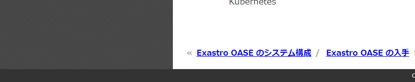
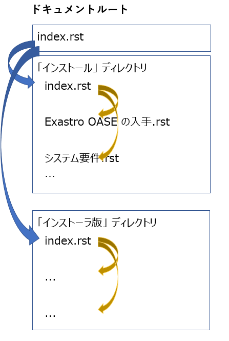
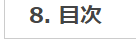
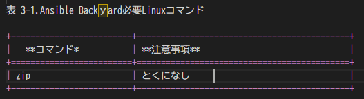
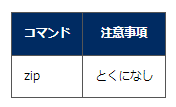
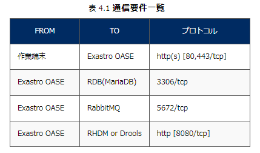

**マニュアル構成**

本マニュアルについて以下の観点で説明します。

   文体、語句

   記載ルール

   ドキュメント仕上がり像

   実装の流れ

   1) 大章ごとにディレクトリを作成

   2) 大章一覧を記述したファイル (indes.rst) を作成

   3) 作成した大章用ディレクトリ内に中章の内容 (=「右 pane
   のボディ」部分 ) を記述した 「.rst ファイル」 を作成

   4) 作成した大章用ディレクトリ内に画像ファイル格納用ディレクトリを作成

   5) 中章一覧を記述したファイル (indes.rst) を作成

   6) .rst ファイル群をビルドしてhtml ファイル生成

**文体，語句**

文体: ですます体 (体言止めなし)

長音記号有無:

つけない: 単語が 3 音以上 (e.g. ブラウザ)

つける: 単語が 2 音以下 (e.g. エラー)

※ JIS（日本工業規格）の「Z8301」準拠

表記のゆれ : 同じ意味をもつ２つ以上の表現は避け、１つに統一する。

e.g. ビルド、生成 ビルドに統一

**記述ルール**

マニュアル内で使われるターミノロジー（専門用語）は、必ずその意味を最初に説明してから使用します。

**ドキュメント仕上がり像**

以下のような構成をもつ html ドキュメントを作成する手順を説明します。

**ページ上部**

.. image:: ./design/image1.png
   :width: 5.41443in
   :height: 2.96222in

   左pane : 章一覧 (大章、中章ごとに採番)

   右pane :

   ヘッダー : パンくず

   ボディ : ドキュメント内容

**ページ下部**

   右 pane :

   フッター : 前ページ / 次ページ へのリンク

   また、これ以降「章」について以下の通り分類して呼ぶことにします。

   大章 : 「2.インストール」

   中章 : 「2.1 Exastro OASE の入手」「2.2 システム要件」

   小章 : 「ハードウェア要件(参考値)」

**実装の前提**

以下がインストールされている事とします。

sphinx-build 5.3.0 以上

**実装の流れ**

ドキュメント作成は以下の手順をとります。

   1) 大章ごとにディレクトリを作成

   2) 大章一覧を記述したファイル (indes.rst) を作成

   3) 作成した大章用ディレクトリ内に中章の内容 (=「右 pane
   のボディ」部分 ) を記述した 「.rst ファイル」 を作成

   4) 作成した大章用ディレクトリ内に画像ファイル格納用ディレクトリを作成

   5) 中章一覧を記述したファイル (indes.rst) を作成

   6) .rst ファイル群をビルドしてhtml ファイル生成

これにより左 pane の章一覧や、各章の番号 は html
生成時自動的に付加されます。

**.rst ファイルに「右 pane のボディ」**

**部分のみ所定の構文で記述**

|image1|\ |image2|

また .rst ファイルは .docx (Word) ファイルから生成することもできます。

.rst ファイル直接記述 -> ビルド -> .html ファイル生成

   .docx ファイル -> コンバート -> .rst ファイル生成 -> ビルド -> .html
   ファイル生成

**1)～6) の各手順について、赤枠内ドキュメントを例に挙げて説明します。**

.. image:: ./design/image4.png
   :width: 5.1083in
   :height: 2.3537in

これ以降、\ **ディレクトリ名は青字**\ 、ファイル名は\ **黒字**\ で表記します。

   1) 大章ごとにディレクトリを作成

   ディレクトリ名は各大章名(英語版)から引用し、以下の通りのフォーマットとします。

   It Automation Base it_automation_base (すべて小文字、単語間は \_
   でつなぐ)

   ドキュメントルート(documentation/v2.0/ja)

   ┗install (大章「インストール」用)

2) 大章一覧を記述したindex.rstファイルを作成

   ドキュメントルート(documentation/v2.0/ja)

   ┗大章用ディレクトリ

   ┗index.rst (大章一覧) **追加**

3) 作成した大章用ディレクトリ内に中章の内容 (=「右 pane のボディ」部分 )
を記述した 「.rst ファイル」 を作成

   1) で作成したディレクトリ内に以下を追加します。

   ドキュメントルート(documentation/v2.0/ja)

   ┗大章用ディレクトリ

   中章の内容を記述した.rst ファイル (１つの中章につき１つ) **★追加**

   index.rst (中章一覧) **★追加**

   ┗index.rst

4) 画像ファイル格納用ディレクトリを作成

   ドキュメントルート(documentation/v2.0/ja)

   ┗大章用ディレクトリ

   中章の内容を記述した.rst ファイル (１つの中章につき１つ)

   画像ファイル格納用ディレクトリ (.rst ファイル名と同名とする)
   **★追加**

   ┗index.rst

5) 中章一覧を記述したファイル (indes.rst) を作成

   ドキュメントルート(documentation/v2.0/ja)

   ┗大章用ディレクトリ

   中章の内容を記述した.rst ファイル (１つの中章につき１つ)

   画像ファイル格納用ディレクトリ (.rst ファイル名と同名とする)
   **★追加**

   index.rst (中章一覧) **★追加**

   ┗index.rst

手順 1) ～ 5) に沿って赤枠内を作成すると以下の通りとなります。

+----------------------------------+---+-------------------------------+
| |image3|                         | * | ドキュメント                  |
|                                  | * | ルート(documentation/v2.0/ja) |
|                                  | → |                               |
|                                  | * | ┗install                      |
|                                  | * |                               |
|                                  |   |    getting_oase.rst           |
|                                  |   |    (「Exastro OASE            |
|                                  |   |                               |
|                                  |   |   の入手」内容を記述したもの) |
|                                  |   |                               |
|                                  |   |    getting_oase (「Exastro    |
|                                  |   |    OASE                       |
|                                  |   |    の                         |
|                                  |   | 入手」ドキュメント画像格納用) |
|                                  |   |                               |
|                                  |   |    system_requirement.rst     |
|                                  |   |    (「システ                  |
|                                  |   | ム要件」の内容を記述したもの) |
|                                  |   |                               |
|                                  |   |    system_requirement         |
|                                  |   |    (「システム                |
|                                  |   | 要件」ドキュメント画像格納用) |
|                                  |   |                               |
|                                  |   |    　 index.rst (中章一覧)    |
|                                  |   |                               |
|                                  |   | index.rst (大章一覧)          |
+==================================+===+===============================+
+----------------------------------+---+-------------------------------+

6) ビルド

document ディレクトリ配下に html ディレクトリを作成します。

所定のディレクトリ、rst ファイルを配置したうえで、document
ディレクトリにカレントをうつし、以下コマンドを入力すると、document/html
フォルダ配下に html が生成されます。

sphinx-build -b html ./ ./html

ここまでが実装の流れです。続いて各 .rst
ファイルの内容について説明します。

**index.rst の役割1**

.rst
ファイルに記述した内容をつなぎ合わせて大章、中章を構成するのは各層に配置する
index.rst の役割です。

ビルド時、システムはドキュメントルート、大章ディレクトリの配下に置かれたindex.rst
の内容を見て章と章を紐づけ、全体を構成します。

+----------------------------------+---+-------------------------------+
| |image4|                         | * | |image5|                      |
|                                  | * |                               |
|                                  | → |                               |
|                                  | * |                               |
|                                  | * |                               |
+==================================+===+===============================+
+----------------------------------+---+-------------------------------+

+-------------------+-------------------------+------------------------+
| **デ              | **記述内容**            | **記述内容詳細         |
| ィレクトリ階層**  |                         | (抜粋)**               |
+===================+=========================+========================+
| **ドキ            | ←大章一覧               | install/index          |
| ュメントルート**  |                         |                        |
|                   | ←中章一覧               | (掲載順 = 章の順番)    |
| **index.rst**     |                         |                        |
|                   |                         | getting_oase           |
| ┗install          |                         |                        |
|                   |                         | system_requirement     |
| getting_oase.rst  |                         |                        |
|                   |                         | (掲載順 = 章の順番)    |
| getting_oase      |                         |                        |
|                   |                         |                        |
| syste             |                         |                        |
| m_requirement.rst |                         |                        |
|                   |                         |                        |
| s                 |                         |                        |
| ystem_requirement |                         |                        |
|                   |                         |                        |
| **index.rst**     |                         |                        |
+-------------------+-------------------------+------------------------+

**index.rst の役割2 全体見出し**

ドキュメントの見出しはドキュメントルート直下の index.rst
にて定義します。

+------------------+----+---------------+-----------------------------+
| |image6|         | *  | **記述す      | **記述内容(抜粋)**          |
|                  | *→ | るindex.rst** |                             |
|                  | ** |               |                             |
+==================+====+===============+=============================+
|                  |    | ルートドキ    | ==========================  |
|                  |    | ュメント直下  |                             |
|                  |    |               | Exastro OASE 1.7            |
|                  |    |               |                             |
|                  |    |               | ==========================  |
+------------------+----+---------------+-----------------------------+

**index.rst 構文**

+--------------------------+-------------------------------------------+
| **構成要素**             | **意味**                                  |
+==========================+===========================================+
| ==============           | ドキュメント全体の見出し                  |
|                          |                                           |
| Exastro OASE 1.7         |                                           |
|                          |                                           |
| ==============           |                                           |
+--------------------------+-------------------------------------------+
| .. toctree::             |                                           |
|                          |                                           |
| :maxdepth: 1             |                                           |
|                          |                                           |
| :numbered: 2             |                                           |
+--------------------------+-------------------------------------------+
| introduction/index       | 章 "はじめに"                             |
|                          | が格納されているディレクトリ名/index      |
+--------------------------+-------------------------------------------+
| installation/index       | 章 "インストール "                        |
|                          | が格納されているディレクトリ名/index      |
+--------------------------+-------------------------------------------+
| oase_components/index    | ….                                        |
|                          |                                           |
|                          | ….                                        |
+--------------------------+-------------------------------------------+

**ドキュメント記述用 .rst ファイル**

getting_oase.rst 等、ドキュメントを記述する .rst
ファイル内の構文は以下の通りです。

**rst ファイル固有表現**

+----+-----------------------------+-----------------------------------+
| ** | **表現**                    | **ビルド結果**                    |
| 種 |                             |                                   |
| 類 |                             |                                   |
| ** |                             |                                   |
+====+=============================+===================================+
| 大 | インストール                | |image7|                          |
| 見 |                             |                                   |
| 出 | ======                      |                                   |
| し |                             |                                   |
+----+-----------------------------+-----------------------------------+
| 中 | Exastro OASE の入手         | |image8|                          |
| 見 |                             |                                   |
| 出 | ----------------------      |                                   |
| し |                             |                                   |
+----+-----------------------------+-----------------------------------+
| ボ | :guilabel:` 監視先の追加\` | |image9|                          |
| タ |                             |                                   |
| ン |                             |                                   |
+----+-----------------------------+-----------------------------------+
| 見 | - LinuxはLinus              | |image10|                         |
| 出 |                             |                                   |
| し |                             |                                   |
| 要 |                             |                                   |
| 素 |                             |                                   |
+----+-----------------------------+-----------------------------------+
| 強 | \**目次*\*                  | |image11|                         |
| 調 |                             |                                   |
+----+-----------------------------+-----------------------------------+
| 画 | .. figure::                 | フォルダ内に                      |
| 像 | ./同じ階層にある            | 格納された画像が差し込まれます。  |
| 差 | 画像用フォルダ名/imagefile  |                                   |
| し |                             |                                   |
| 込 | :scale: xx%                 |                                   |
| み |                             |                                   |
|    | :align: xxx                 |                                   |
+----+-----------------------------+-----------------------------------+
| 表 | |image12|                   | |image13|                         |
| 差 |                             |                                   |
| し |                             |                                   |
| 込 |                             |                                   |
| み |                             |                                   |
| そ |                             |                                   |
| の |                             |                                   |
| 1  |                             |                                   |
+----+-----------------------------+-----------------------------------+
| 表 | .. csv-table:: 通信要件一覧 | |image14|                         |
| 差 |                             |                                   |
| し | :header: FROM, TO,          |                                   |
| 込 | プロトコル                  |                                   |
| み |                             |                                   |
| そ | :widths: 20, 20, 30         |                                   |
| の |                             |                                   |
| 2  | 作業端末, Exastro OASE,     |                                   |
|    | "http(s) [80,443/tcp]"      |                                   |
|    |                             |                                   |
|    | Exastro OASE, RDB(MariaDB), |                                   |
|    | "3306/tcp"                  |                                   |
|    |                             |                                   |
|    | Exastro OASE, RabbitMQ,     |                                   |
|    | "5672/tcp"                  |                                   |
|    |                             |                                   |
|    | Exastro OASE, RHDM or       |                                   |
|    | Drools, "http [8080/tcp]"   |                                   |
+----+-----------------------------+-----------------------------------+
| メ | .. note:: \|                | |image15|                         |
| モ | 補                          |                                   |
| (N | 足的な情報を示しています。  |                                   |
| ot |                             |                                   |
| e) | \| Note                     |                                   |
|    | に記載さ                    |                                   |
|    | れている内容は読み飛ばして  |                                   |
|    | も困ることは無いでしょう。  |                                   |
+----+-----------------------------+-----------------------------------+
| メ | .. tip:: \|                 | |image16|                         |
| モ | 操作や作業におけ            |                                   |
| (  | るノウハウを示しています。  |                                   |
| Ti |                             |                                   |
| p) | \| Tip                      |                                   |
|    | に記載されている内容を読    |                                   |
|    | み飛ばした場合ユーザに混乱  |                                   |
|    | が生じる可能性があります。  |                                   |
+----+-----------------------------+-----------------------------------+
| メ | .. warning:: \|             | |image17|                         |
| モ | 操作                        |                                   |
| (  | 上の注意点を示しています。  |                                   |
| Wa |                             |                                   |
| rn | \| Warning                  |                                   |
| in | に記載さ                    |                                   |
| g) | れた内容はユーザが把握して  |                                   |
|    | おくほうが適切な情報です。  |                                   |
+----+-----------------------------+-----------------------------------+
| メ | .. danger:: \|              | |image18|                         |
| モ | 正常なサービスへ影響を与    |                                   |
| (D | える可能性がある操作につい  |                                   |
| an | ての危険性を示しています。  |                                   |
| ge |                             |                                   |
| r) | \| Danger                   |                                   |
|    | に記載された内容を知        |                                   |
|    | らない場合、大きな問題を引  |                                   |
|    | き起こす可能性があります。  |                                   |
+----+-----------------------------+-----------------------------------+

.. |image1| image:: ./design/image1.png
   :width: 5.40694in
   :height: 2.95833in
.. |image2| image:: ./design/image3.png
   :width: 2.19792in
   :height: 1.63542in
.. |image3| image:: ./design/image4.png
   :width: 5.1083in
   :height: 2.3537in
.. |image4| image:: ./design/image4.png
   :width: 5.1083in
   :height: 2.3537in

.. |image6| image:: ./design/image6.png
.. |image7| image:: ./design/image7.png
   :width: 4.60483in
   :height: 1.22264in
.. |image8| image:: ./design/image7.png
   :width: 4.60483in
   :height: 1.22264in

.. |image10| image:: ./design/image9.png
   :width: 3.21875in
   :height: 1.15625in

.. |image15| image:: ./design/image14.png
   :width: 5.68735in
   :height: 0.56253in
.. |image16| image:: ./design/image15.png
   :width: 5.60102in
   :height: 0.52416in
.. |image17| image:: ./design/image16.png
   :width: 5.27072in
   :height: 0.49804in
.. |image18| image:: ./design/image17.png
   :width: 5.54284in
   :height: 0.53672in
