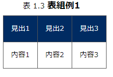

==============
マニュアル構文
==============

index.rst
=========

役割1
-----

| ビルド時、システムはドキュメントルート、大章ディレクトリの配下に置かれたindex.rst の内容を見て章と章を紐づけ、全体を構成します。
.. image:: ./build_flow/image2.png
   :width: 5.84375in
   :height: 1.09375in

役割2
-----

| ドキュメントルート直下の index.rst にてドキュメントの見出しを定義します。

.. table:: イベントリクエストのプロパティ

   +------------------+---------------+-----------------------------+
   | 見出し箇所       | 対象          | **記述内容(抜粋)**          |
   |                  |               |                             |
   |                  |               |                             |
   +==================+===============+=============================+
   | ルートドキ       | ルートドキ    | ルートドキ                  |
   | ュメント直下     | ュメント      | ュメント直下                |
   |                  | ュ            |                             |
   +------------------+---------------+-----------------------------+

記述方法
--------

.. table:: 構成要素

   +--------------------------+---------------------------------------------------------+
   | **項目**                 | **意味**                                                |
   +==========================+=========================================================+
   | |  　===============　   | ドキュメント全体の見出し                                |
   | |  　Exastro OASE 1.7    |                                                         |
   | |  　===============　   |                                                         |
   +--------------------------+---------------------------------------------------------+
   | | 　ディレクトリ1/index  | 各章が格納されているディレクトリ/index を記述します。   |
   | | 　ディレクトリ2/index  |                                                         |
   | | 　ディレクトリ3/index  |                                                         |
   | | 　ディレクトリ4/index  |                                                         |
   +--------------------------+---------------------------------------------------------+

ドキュメント記述用 .rst ファイル
================================

構文
----

| getting_oase.rst 等、ドキュメントを記述する .rst ファイル内の構文は以下の通りです。

.. table:: .rst 構文1

   +------+-----------------------------------+-----------------------------------+
   | **種 | **構文**                          | **ビルド結果**                    |
   | 類** |                                   |                                   |
   +======+===================================+===================================+
   | 大   | |  　======                       | |image1|                          |
   | 見   | |  　大見出                       |                                   |
   | 出   | |  　======                       |                                   |
   +------+-----------------------------------+-----------------------------------+
   | 中   | |                                 | |image2|                          |
   | 見   | |  　中見出                       |                                   |
   | 出   | |  　======                       |                                   |
   +------+-----------------------------------+-----------------------------------+
   | 小   | |                                 | |image3|                          |
   | 見   | |  　小見出                       |                                   |
   | 出   | |  　------                       |                                   |
   +------+-----------------------------------+-----------------------------------+
   | パ   | | 　| 第一パラグラフ              | | 第一パラグラフ                  |
   | ラ   | | 　| 第一パラグラフ続き          | | 第一パラグラフ続き              |
   | グ   | |                                 |                                   |
   | ラ   | | 　| 第二パラグラフ              | | 第二パラグラフ                  |
   | フ   | | 　| 第二パラグラフ続き          | | 第二パラグラフ続き              |
   +------+-----------------------------------+-----------------------------------+
   | 見   | \- LinuxはLinus                   | - LinuxはLinus                    |
   | 出   |                                   |                                   |
   | 要   |                                   |                                   |
   | 素   |                                   |                                   |
   +------+-----------------------------------+-----------------------------------+
   | 番   | | 　#. 要素1                      |  #. 要素1                         |
   | 号   | | 　#. 要素2                      |  #. 要素1                         |
   | 付   |                                   |                                   |
   | 見   |                                   |                                   |
   | 出   |                                   |                                   |
   | 要   |                                   |                                   |
   | 素   |                                   |                                   |
   +------+-----------------------------------+-----------------------------------+
   | 強   | \**強調*\*                        | **強調**                          |
   | 調   |                                   |                                   |
   +------+-----------------------------------+-----------------------------------+
   | イ   | | 　見出                          | 見出                              |
   | ン   | | 　  | 内容1                     |   | 内容1                         |
   | デ   | | 　  | 内容2                     |   | 内容2                         |
   | ン   |                                   |                                   |
   | ト   |                                   |                                   |
   +------+-----------------------------------+-----------------------------------+
   | 画   | | .. figure::                     | フォルダ内に                      |
   | 像   | | ./path/imagefile                | 格納された画像が差し込まれます。  |
   | 差   | | 　:scale: xx%                   |                                   |
   | 込   | | 　:align: xxx                   |                                   |
   +------+-----------------------------------+-----------------------------------+
   | 表   | |image7|                          | |image8|                          |
   | 差   |                                   |                                   |
   | 込   |                                   |                                   |
   | 1    |                                   |                                   |
   +------+-----------------------------------+-----------------------------------+
   | 表   | | .. csv-table:: 表組例2          | |image9|                          |
   | 差   | | 　 :header: 見出1, 見出2, 見出3 |                                   |
   | 込   | | 　 :widths: 20, 20, 40          |                                   |
   | 2    | |                                 |                                   |
   |      | | 　 内容1, 内容2, 内容3          |                                   |
   +------+-----------------------------------+-----------------------------------+

.. warning:: | 表組1 では以下の記号をいれることができません。
   | ※ (こめじるし),  ①などの〇付記号

.. csv-table:: .rst ファイル内構文2
   :header: 種類, 構文, ビルド結果
   :widths: 10, 30, 30

   ボタン,\:guilabel:` アクション`,:guilabel:` アクション`
   メモ, "| \.. note:: | 補足的な情報を示しています。
   | 　　　　 | Note に記載されている内容は読み飛ばしても困ることは無いでしょう。", |image14|
   メモ(Tip), "| \.. tip:: | 操作や作業におけるノウハウを示しています。
   | 　　　　 | Tip に記載されている内容を読み飛ばした場合ユーザに混乱が生じる可能性があります。", |image15|
   メモ(Warning), "| \.. warning:: | 操作上の注意点を示しています。
   | 　　　　 | Warning に記載された内容はユーザが把握しておくほうが適切な情報です。", |image16|
   メモ(Danger), "| \.. danger:: | 正常なサービスへ影響を与える可能性がある操作についての危険性を示しています。
   | 　　　　 | Danger に記載された内容を知らない場合、大きな問題を引き起こす可能性があります。", |image17|

.. |image1| image:: ./manual_syntax/image1.png
   :width: 5.68735in
   :height: 0.56253in
.. |image2| image:: ./manual_syntax/image2.png
   :width: 5.68735in
   :height: 0.56253in
.. |image3| image:: ./manual_syntax/image3.png
   :width: 5.68735in
   :height: 0.56253in
.. |image6| image:: ./build_flow/image6.png
   :width: 5.68735in
   :height: 0.56253in
.. |image7| image:: ./manual_syntax/image7.png
   :width: 5.68735in
   :height: 0.56253in

.. |image14| image:: ./build_flow/image14.png
   :width: 5.68735in
   :height: 0.56253in
.. |image15| image:: ./build_flow/image15.png
   :width: 5.60102in
   :height: 0.52416in
.. |image16| image:: ./build_flow/image16.png
   :width: 5.27072in
   :height: 0.49804in
.. |image17| image:: ./build_flow/image17.png
   :width: 5.54284in
   :height: 0.53672in
