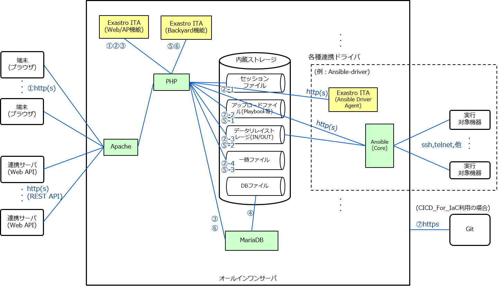

===============================
ITA_システム構成/環境構築ガイド
===============================

.. image:: ./architecture/image1.png
   :width: 3.35079in
   :height: 0.78559in

| 基本編
| －第1.10版－
| Copyright © NEC Corporation 2021. All rights reserved.
| 免責事項
| 本書の内容はすべて日本電気株式会社が所有する著作権に保護されています。
| 本書の内容の一部または全部を無断で転載および複写することは禁止されています。
| 本書の内容は将来予告なしに変更することがあります。
| 日本電気株式会社は、本書の技術的もしくは編集上の間違い、欠落について、一切責任を負いません。
| 日本電気株式会社は、本書の内容に関し、その正確性、有用性、確実性その他いかなる保証もいたしません。
| 商標

-  LinuxはLinus
      Torvalds氏の米国およびその他の国における登録商標または商標です。

-  Red Hatは、Red Hat,
      Inc.の米国およびその他の国における登録商標または商標です。

-  Apache、Apache Tomcat、Tomcatは、Apache Software
      Foundationの登録商標または商標です。

-  Oracle、MySQLは、Oracle Corporation
      およびその子会社、関連会社の米国およびその他の国における登録商標です。

-  MariaDBは、MariaDB Foundationの登録商標または商標です。
| その他、本書に記載のシステム名、会社名、製品名は、各社の登録商標もしくは商標です。
| なお、® マーク、TMマークは本書に明記しておりません。
| ※本書では「Exastro IT Automation」を「ITA」として記載します。

はじめに
========

本書では、ITAシステム運用の為のシステム構成と環境構築について説明します。

システム要件
============

1. 

2. 

3. 

4. 

サーバ動作要件
--------------

|本システムはLinuxサーバで稼働し、クライアントPCからブラウザ経由でアクセスします。
|システムインストールするにあたっては、次の要件を満たしているサーバをご用意ください。

サーバ構成
----------
.. table:: サーバ構成一覧

   +-------------+-----------+----------------+--------------------------+
   |**カテゴリ** | **必須    | **製品名**     | **バージョン**           |
   |             | ／選択**  |                |                          |
   +=============+===========+================+==========================+
   | OS          | いずれかか| RHEL           | 7.x                      |
   |             |           |                | 8.x                      |
   +-------------+-----------+----------------+--------------------------+
   |             |           | CentOS         | 7.x                      |
   |             |           |                |                          |
   |             |           |                | 8.xは2021/12/3\          |
   |             |           |                | 1にEOLとなったため対象外 |
   +-------------+-----------+----------------+--------------------------+
   |             |           | CentOS Stream  | 8.x                      |
   +-------------+-----------+----------------+--------------------------+
   | Webサーバ   | 必須      | Apache         | 2.4系                    |
   +-------------+-----------+----------------+--------------------------+
   | デ\         | 必須      | MariaDB        | 10.3以上                 |
   | ータベース  |           |                |                          |
   +-------------+-----------+----------------+--------------------------+
   | 言語        | 必須      | PHP            | ITAv1.9.1以前：7.2       |
   |             |           |                |                          |
   |             |           |                | ITAv\                    |
   |             |           |                | 1.10.0以降：7.2または7.4 |
   +-------------+-----------+----------------+--------------------------+
   | PH\         | す\       | PhpSpreadsheet | 1.10.1以上               |
   | Pライブラリ | べて必須  |                |                          |
   +-------------+-----------+----------------+--------------------------+
   |             |           | php-yaml       | 2.1.0以上                |
   +-------------+-----------+----------------+--------------------------+
   | Pea\        | 必須      | HTML_AJAX      | 0.5.7以上                |
   | rライブラリ |           |                |                          |
   +-------------+-----------+----------------+--------------------------+

サーバ最小スペック
------------------
.. table:: サーバ最小スペック一覧

   +-------------+---------------+---------------------------------------+
   | カテゴリ    | 最\           | 備考                                  |
   |             | 小スペック値  |                                       |
   +=============+===============+=======================================+
   | CPU         | 2Core         |                                       |
   +-------------+---------------+---------------------------------------+
   | メモリ      | 4GB           |                                       |
   +-------------+---------------+---------------------------------------+
   | デ\         | 1GB           | ITAシステ\                            |
   | ィスク容量  |               | ムの容量。OSやログ保存の容量を除く。  |
   +-------------+---------------+---------------------------------------+

サイジング
----------

| サーバスペックについて、下記三つの観点を目安に設計を行ってください。

メニューあたりのレコード数
  | メニュー作成で設定する、ひとつのメニュー内のレコードの数です。

.. table:: メニューあたりの項目数とサーバスペック一覧

   +------------------------+--------------------+------------------------+
   | メニュー項目数         | CPU                | メモリ                 |
   +========================+====================+========================+
   | ～ 10,000              | 2Core              | 4GB                    |
   +------------------------+--------------------+------------------------+
   | 10,000 ～ 20,000       | 4Core              | 8GB                    |
   +------------------------+--------------------+------------------------+
|
Ansible作業実行の同時実行数
  | Ansibleの作業実行を並列処理で実行する数です。
  | 並列実行数は「Ansible共通」＞「インターフェース情報」＞「並列実行数」で設定することができます。

.. table:: Ansible作業実行の同時実行数とサーバスペック一覧

   +------------------------+--------------------+------------------------+
   | 作業実行の同時実行数   | CPU                | メモリ                 |
   +========================+====================+========================+
   | ～ 50                  | 2Core              | 4GB                    |
   +------------------------+--------------------+------------------------+
   | 50 ～ 100              | 4Core              | 8GB                    |
   +------------------------+--------------------+------------------------+
|
同時ログイン操作数
  | 同時にログインして操作するユーザー数です。
  | ログインした状態で画面遷移やフィルタ検索、登録などの操作を行います。

.. table:: 同時ログイン操作数とサーバスペック一覧
   +------------------------+--------------------+------------------------+
   | 同時ログイン操作数     | CPU                | メモリ                 |
   +========================+====================+========================+
   | ～ 200                 | 2Core              | 4GB                    |
   +------------------------+--------------------+------------------------+
   | 200 ～ 300             | 4Core              | 8GB                    |
   +------------------------+--------------------+------------------------+

.. note:: | ITAインストール後の設定
          | ITAインストール後の設定は、ITAシステムサーバ※1の最小スペック（CPU：2コア／メモリ：4GB）にて動作するように設計されています。
          | 最小スペック以上で設計する場合は、性能を上げるために設定値のチューニングも実施してください。
          | 設定値についてはマニュアルの「【参考】インストール時の各コンフィグ設定値」をご参照ください。
          | ※1 ITAシステムサーバ …
          | Ansibleサーバなど連携ドライバのサーバを別構成にしたITA基本構成

クライアント動作要件
--------------------

本システムの機能を利用するにあたって、クライアント側PCの動作環境は以下を推奨します。

.. table:: クライアント側PCの動作要件
   +--------------+-------------------------+----------------------------+
   | **カテゴリ** | **製品名**              | **バージョン**             |
   +==============+=========================+============================+
   | ソフトウェア | Excel ※1               | MS Office 2010 以上        |
   +--------------+-------------------------+----------------------------+
   | ブラウザ     | Google Chrome           | 72以上                     |
   +--------------+-------------------------+----------------------------+
   |              | FireFox                 | 41以上                     |
   +--------------+-------------------------+----------------------------+
   |              | Edge                    | 20以上                     |
   +--------------+-------------------------+----------------------------+

| ※1 Excelファイルダウンロードを行う場合に必須です（ダウンロードファイル形式がExcelのため）。

システム構成
============

システム構成
------------

| 本ソフトウェアのWeb/AP機能、BackYard機能、データベース、データストレージは、次のようなサーバ構成で運用が可能です。

.. table:: システム構成パターン

   +---+---------------+--------------------------+----------------------+
   | N | 構成          | 説明                     | 備考                 |
   | o |               |                          |                      |
   +===+===============+==========================+======================+
   | 1 | オール        | シ\                      | ITA-BASE機\          |
   |   | インワン構成  | ステムを一つのサーバ上で | 能とオールインワン構 |
   |   |               | 組み立てる構成パターン。 | 成可能な連携ドライバ |
   |   |               |                          |                      |
   |   |               |                          | #. Ansibler-driver   |
   |   |               |                          | #. Cobbler-driver    |
   +---+---------------+--------------------------+----------------------+
   | 2 | HA構成        | システムを全て個別のサー | Web/APサーバ         |
   |   |               | バに切り離して冗長構成を | (Act/Act構成)        |
   |   |               | とり、データファイル、DB |                      |
   |   |               | ファイルを外部ストレージ | DBMSサーバ           |
   |   |               | に格納する構築パターン。 | (Act/Sby構成)        |
   |   |               |                          |                      |
   |   |               |                          | Backyardサーバ       |
   |   |               |                          | (Act/Sby構成)        |
   +---+---------------+--------------------------+----------------------+

| 以降に、代表例としてAnsible Driverおよび Ansible
| Coreを利用するシステムのイメージ図を記載します。

.. table:: システム構成パターン2

  +-------+-------+------------+--------------+--------------------------+
  | **通\ | **F\  | **TO**     | **プロトコ\  | **主な用途**             |
  | 信\   | ROM** |            | ル**         |                          |
  | 番\   |       |            |              |                          |
  | 号\   |       |            | **[ポート番  |                          |
  | 1**   |       |            | 号2]**       |                          |
  |       |       |            |              |                          |
  +=======+=======+============+==============+==========================+
  |       | 端末  | We\        | http(s)      | Exastro \                |
  |       |       | b/APサーバ |              | ITAのWebコンテンツへの\  |
  |       |       |            | [            | アクセス                 |
  |       |       |            | 80(443)/tcp] |                          |
  +-------+-------+------------+--------------+--------------------------+

| 各利用Driverのシステム構成の詳細については、各システム構成／環境構築ガイドを参照ください。

   
|
|

.. image:: ./architecture/image3.png
   :alt: ダイアグラム 自動的に生成された説明
   :width: 6.69236in
   :height: 3.72431in
   :align:  center

システムの通信要件
------------------

本システム構成において、各サービス間の通信要件は以下の通りです。
  | Ansible Driverおよび Terraform
  | Driverで利用する通信要件は以下を参照ください。
  | ・「システム構成／環境構築ガイド_Ansible-driver 編」
  | ・「システム構成／環境構築ガイド_Terraform-driver 編」

.. table:: 通信要件一覧

| ※1「2.1システム構成」の構成イメージに上記番号と紐づく通信番号を記載。
| ※2 ポート番号は標準的なポート番号を記載。

サーバ拡張性の影響ポイント
--------------------------

本システム構成において、サーバ拡張性に影響するポイントと構成の考え方は以下の通りです。
  | CPU/メモリ/ディスクのうち主に何が消費されているか
  | リソースが不足するとどのような影響があるか

.. table:: システム構成パターン2

   +---+---------------+--------------------------+----------------------+
   | N | 構成          | 説明                     | 備考                 |
   | o |               |                          |                      |
   +===+===============+==========================+======================+
   | 1 | オール\       | シ\                      | ITA-BASE機\          |
   |   | インワン構成  | ステムを一つのサーバ上で\| 能とオールインワン構\|
   |   |               | 組み立てる構成パターン。 | 成可能な連携ドライバ |
   |   |               |                          |                      |
   |   |               |                          | * Ansibler-driver    |
   |   |               |                          | * Cobbler-driver     |
   +---+---------------+--------------------------+----------------------+
   | 2 | HA構成        | システムを全て個別のサー\| Web/APサーバ         |
   |   |               | バに切り離して冗長構成を\| (Act/Act構成)        |
   |   |               | とり、データファイル、DB\|                      |
   |   |               | ファイルを外部ストレージ\| DBMSサーバ           |
   |   |               | に格納する構築パターン。 | (Act/Sby構成)        |
   |   |               |                          |                      |
   |   |               |                          | Backyardサーバ       |
   |   |               |                          | (Act/Sby構成)        |
   +---+---------------+--------------------------+----------------------+
   | 2 | HA構成        | システムを全て個別のサー\| Web/APサーバ         |
   |   |               | バに切り離して冗長構成を | (Act/Act構成)        |
   +---+---------------+--------------------------+----------------------+

