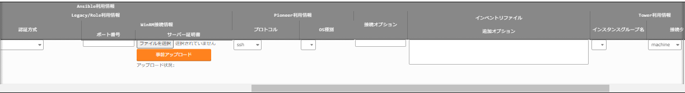

======================
ITA_利用手順マニュアル
======================
.. image:: ./basic_console/image2.png
   :width: 8.24645in
   :height: 11.7091in

基本コンソール
==============

| -第1.9版-
| Copyright © NEC Corporation 2021. All rights reserved.
| 免責事項
| 本書の内容はすべて日本電気株式会社が所有する著作権に保護されています。
| 本書の内容の一部または全部を無断で転載および複写することは禁止されています。
| 本書の内容は将来予告なしに変更することがあります。
| 日本電気株式会社は、本書の技術的もしくは編集上の間違い、欠落について、一切責任を負いません。
| 日本電気株式会社は、本書の内容に関し、その正確性、有用性、確実性その他いかなる保証もいたしません。

| 商標
| LinuxはLinusTorvalds氏の米国およびその他の国における登録商標または商標です。
| Red Hatは、Red Hat,Inc.の米国およびその他の国における登録商標または商標です。
| Apache、Apache Tomcat、Tomcatは、Apache SoftwareFoundationの登録商標または商標です。
| Ansibleは、Red Hat, Inc.の登録商標または商標です。
| AnsibleTowerは、Red Hat, Inc.の登録商標または商標です。

| その他、本書に記載のシステム名、会社名、製品名は、各社の登録商標もしくは商標です。
| なお、® マーク、TMマークは本書に明記しておりません。
| ※本書では「Exastro IT Automation」を「ITA」として記載します。

はじめに
========

本書は、ITAの基本コンソールの機能および操作方法について説明します。

ITA基本コンソールの概要
=======================

| 本章では基本コンソールメニューの機能、操作方法について説明します。
| 基本コンソールでは、ITAを利用して作業を行う上で共通に必要となる以下の機能を提供します。

ITA基本コンソールのメニュー、画面構成
=====================================

本章では、ITA基本コンソールのメニュー、画面構成について説明します

1. 

ITA基本コンソールメニュー 一覧
------------------------------

| ITA共通/基本コンソールのメニューを以下に示します。

.. table:: ITA画面一覧

   +---+-------+----------------+-----------------------------------------+
   | **| **メ  | **メ           | **説明**                                |
   |No | ニュ  | ニュー・画面** |                                         |
   | **| ー**  |                |                                         |
   | o |       |                |                                         |
   | * | **グ  |                |                                         |
   | * | ルー  |                |                                         |
   |   | プ**  |                |                                         |
   +===+=======+================+=========================================+
   | 1 | ITA\  | 機器一覧       | 管理対象システム一覧をメン\             |
   |   | 基本\ |                | テナンス(閲覧/登録/更新/廃止)できます。 |
   |   | コ\   |                |                                         |
   |   | ンソ\ |                |                                         |
   |   | ール  |                |                                         |
   +---+-------+----------------+-----------------------------------------+
   | 2 |       | 投入オペ\      | 投入オペレーション一覧をメン\           |
   |   |       | レーション一覧 | テナンス(閲覧/登録/更新/廃止)できます。 |
   +---+-------+----------------+-----------------------------------------+
   | 3 |       | Movement一覧   | 登録したMovementの一覧を閲覧できます。  |
   +---+-------+----------------+-----------------------------------------+
   | 4 |       | ER図表示       | 各メニューと\                           |
   |   |       |                | 参照データの紐づけをER図で表示します。  |
   +---+-------+----------------+-----------------------------------------+

ITA基本コンソール利用手順
=========================

作業フロー
----------

| ITA基本コンソールにおける標準的な作業フローは以下のとおりです。
| 各作業の詳細は次項に記載しています。
| Movementの登録方法については、各Driverの利用手順マニュアルを参照してください。

**図 3.1-1 作業フロー**

機能・操作方法説明
==================

ITA基本コンソール
-----------------

機器一覧
  | (1) [機器一覧] 画面では、作業対象ホストの情報を管理します。
  | 各オーケストレータの実行前にサーバタイプに応じた必要情報を登録してください。
  | また、再実行の際にサーバ情報が変更になっている場合は、事前に変更処理をしてください。

  | 図 4‑1サブメニュー画面（機器一覧）

.. image:: ./basic_console/image3.png
   :width: 6.20833in
   :height: 1.04167in

  | (2) 「登録」-「登録開始」ボタンより、機器情報の登録を行います。

.. image:: ./basic_console/image4.png
   :width: 6.20833in
   :height: 1.04167in

| 図 4‑2 登録画面（機器一覧 – 共通項目）
| (3) 登録画面の共通項目一覧は以下のとおりです。
| 作業対象の「ホスト名」、「IPアドレス」は、必ず入力してください。
| ※「ログインパスワード」は、「管理」を●とした場合、登録は必須です。

.. table:: 登録画面項目一覧（機器一覧 – 共通項目）

   +-------+-------+----------------------------+----+------+------------+
   | **項  |       | **説明**                   | ** | **入 | **         |
   | 目**  |       |                            | 入 | 力形 | 制約事項** |
   |       |       |                            | 力 | 式** |            |
   |       |       |                            | ** |      |            |
   |       |       |                            |    |      |            |
   |       |       |                            | ** |      |            |
   |       |       |                            | 必 |      |            |
   |       |       |                            | 須 |      |            |
   |       |       |                            | ** |      |            |
   +=======+=======+============================+====+======+============+
   | 管理  |       | 登録情報を識別する         | -  | 自動 | 管理システ |
   | シス  |       | 一意のIDが自動入力されます |    | 入力 | ム項番を10 |
   | テム  |       |                            |    |      | ,000,000以 |
   | 項番  |       |                            |    |      | 上にすると |
   |       |       |                            |    |      | ホストグル |
   |       |       |                            |    |      | ープ機能が |
   |       |       |                            |    |      | 正常に動作 |
   |       |       |                            |    |      | しません。 |
   |       |       |                            |    |      |            |
   |       |       |                            |    |      | ホス       |
   |       |       |                            |    |      | トグループ |
   |       |       |                            |    |      | 機能を使用 |
   |       |       |                            |    |      | する場合は |
   |       |       |                            |    |      | 、管理シス |
   |       |       |                            |    |      | テム項番を |
   |       |       |                            |    |      | 10,000,000 |
   |       |       |                            |    |      | 未満になる |
   |       |       |                            |    |      | ようにして |
   |       |       |                            |    |      | ください。 |
   +-------+-------+----------------------------+----+------+------------+
   | H     |       | HW機器の種別を選択します   | -  | 手動 | 最大長     |
   | W機器 |       |                            |    | 入力 | 128バイト  |
   | 種別  |       |                            |    |      |            |
   +-------+-------+----------------------------+----+------+------------+
   | ホス  |       | ホスト名を入力します       | ○  | 手動 | -          |
   | ト名  |       |                            |    | 入力 |            |
   +-------+-------+----------------------------+----+------+------------+
   | I     |       | IPアドレス(xxx.xx          | ○  | 手動 | 最大       |
   | Pアド |       | x.xxx.xxx形式)を入力します |    | 入力 | 長15バイト |
   | レス  |       |                            |    |      |            |
   +-------+-------+----------------------------+----+------+------------+
   | Ethe  | MAC   | MACアドレスを入力します    | -  | 手動 | 最大       |
   | rWake |       |                            |    | 入力 | 長17バイト |
   | OnLan | アド  |                            |    |      |            |
   |       | レス  |                            |    |      |            |
   +-------+-------+----------------------------+----+------+------------+
   |       | ネ    | ネットワ                   | -  | 手動 | 最大長     |
   |       | ット  | ークデバイス名を入力します |    | 入力 | 256バイト  |
   |       | ワー  |                            |    |      |            |
   |       | クデ  |                            |    |      |            |
   |       | バイ  |                            |    |      |            |
   |       | ス名  |                            |    |      |            |
   +-------+-------+----------------------------+----+------+------------+
   | ログ  |       | ログイン                   | -  | 手動 | 最大       |
   | イン  |       | するユーザーIDを入力します |    | 入力 | 長30バイト |
   | ユー  |       |                            |    |      |            |
   | ザID  |       |                            |    |      |            |
   +-------+-------+----------------------------+----+------+------------+
   | ロ    | 管理  | ITAでパスワードを管理      | -  | リ   | -          |
   | グイ  |       | する場合「●」を選択します  |    | スト |            |
   | ンパ  |       |                            |    | 選択 |            |
   | スワ  |       |                            |    |      |            |
   | ード  |       |                            |    |      |            |
   +-------+-------+----------------------------+----+------+------------+
   |       | ログ  | パスワードを指定します     | ※  | 手動 | 最大長     |
   |       | イン  |                            |    | 入力 | 128バイト  |
   |       |       |                            |    |      |            |
   |       | パ    |                            |    |      |            |
   |       | スワ  |                            |    |      |            |
   |       | ード  |                            |    |      |            |
   +-------+-------+----------------------------+----+------+------------+
   | ssh   | ssh秘 | ssh秘密鍵ファイルを        | -  | 手動 | -          |
   | 鍵    | 密鍵  | 指定して鍵認証する場合の秘 |    | 入力 |            |
   | 認証  | ファ  | 密鍵ファイルを入力します。 |    |      |            |
   | 情報  | イル  | アップロードしたフ         |    |      |            |
   |       |       | ァイルは暗号化されて保存さ |    |      |            |
   |       |       | れます。※登録後にファイル  |    |      |            |
   |       |       | はダウンロードできません。 |    |      |            |
   +-------+-------+----------------------------+----+------+------------+
   |       | パス  | s                          | -  | 手動 | 最大長     |
   |       | フレ  | sh秘密鍵ファイルにパスフレ |    | 入力 | 256バイト  |
   |       | ーズ  | ーズが設定されている場合、 |    |      |            |
   |       |       | パスフレーズを入力します。 |    |      |            |
   +-------+-------+----------------------------+----+------+------------+
   | 備考  |       | 自由記述欄です             | -  | 手動 | -          |
   |       |       |                            |    | 入力 |            |
   +-------+-------+----------------------------+----+------+------------+

| (4) 共通項目の他に、各Driver/オーケストレータを利用する場合に情報を登録します。
| 各Driverの詳細はそれぞれの利用手順を参照してください。

#. Ansible利用情報

| 図 4‑3 登録画面（機器一覧 – Ansible）

.. note:: | Ansible利用情報はAnsible driverに必要なパラメータです。
          | 詳細については、「利用手順マニュアル_Ansible-driver」を参照してください。

紐付対象メニュー
~~~~~~~~~~~~~~~~

| 紐付対象メニューでは、代入値自動登録設定で連携するCMDBのメニューを登録／更新／廃止を行います。
| BackYardで自動的に作成されますが、手動で変更したい場合は本メニューをメンテナンスしてください。
| インストール時『紐付対象メニュー』は非表示の設定になっております。管理コンソールのロール・メニュー紐付管理メニューにて復活処理を行うことによって表示されるようになります。

.. image:: ./basic_console/image6.png
**図 4‑4サブメニュー画面（紐付対象メニュー）**

| (2) 「登録」-「登録開始」ボタンより、メニューの紐付けを行います。

.. image:: ./basic_console/image7.png
図 4‑5 登録画面（紐付対象メニュー）

| (3) 登録画面の項目一覧は以下のとおりです。

.. table:: 録画面項目一覧（紐付対象メニュー）

   +-----------+--------------------------------+----+------+-------------+
   | **項目**  | **説明**                       | ** | **入 | *           |
   |           |                                | 入 | 力形 | *制約事項** |
   |           |                                | 力 | 式** |             |
   |           |                                | ** |      |             |
   |           |                                |    |      |             |
   |           |                                | ** |      |             |
   |           |                                | 必 |      |             |
   |           |                                | 須 |      |             |
   |           |                                | ** |      |             |
   +===========+================================+====+======+=============+
   | メ        | CMDBのメニューが表示されます。 | ○  | リ   | -           |
   | ニューグ  |                                |    | スト |             |
   | ループ:メ | 代入値自動登録設定で連携す     |    | 選択 |             |
   | ニュー※2  | るCMDBのメニューを選択します。 |    |      |             |
   +-----------+--------------------------------+----+------+-------------+
   | 備考      | 自由記述欄です。               | -  | 手動 | 最大長      |
   |           |                                |    | 入力 | 4000バイト  |
   +-----------+--------------------------------+----+------+-------------+

※2 CMDBのメニューグループとメニューの登録が必要です。

メニューグループとメニューの登録についての説明は、「利用手順マニュアル_管理コンソール」を参照してください。

投入オペレーション一覧
~~~~~~~~~~~~~~~~~~~~~~

(1) [投入オペレーション一覧]画面では、オーケストレータで実行する、作業対象ホストに対する

オペレーションを管理します。

   例）「サービス追加工事作業」 など

   .. image:: ./basic_console/image8.png

**図 4‑6サブメニュー画面（投入オペレーション一覧）**

(2) 「登録」-「登録開始」ボタンより、オペレーション情報の登録を行います。

.. image:: ./basic_console/image9.png

図 4‑7 登録画面（投入オペレーション一覧）

(3) 登録画面の項目一覧は以下のとおりです。

**表4.1‑3　登録画面項目一覧（投入オペレーション一覧）**

+-----------+--------------------------------+----+------+-------------+
| **項目**  | **説明**                       | ** | **入 | *           |
|           |                                | 入 | 力形 | *制約事項** |
|           |                                | 力 | 式** |             |
|           |                                | ** |      |             |
|           |                                |    |      |             |
|           |                                | ** |      |             |
|           |                                | 必 |      |             |
|           |                                | 須 |      |             |
|           |                                | ** |      |             |
+===========+================================+====+======+=============+
| オペレー  | 任意                           | ○  | 手動 | 最大        |
| ション名  | のオペレーション名を登録します |    | 入力 | 長256バイト |
+-----------+--------------------------------+----+------+-------------+
| 実施      | オペレーシ                     | ○  | 手動 | -           |
| 予定日時  | ョンの実施予定日時を入力します |    | 入力 |             |
|           |                                |    |      |             |
|           | ※こ                            |    |      |             |
|           | こで指定した日付で実際に処理が |    |      |             |
|           | 実行されるわけではありません。 |    |      |             |
|           |                                |    |      |             |
|           | ※実施予定日時が設定            |    |      |             |
|           | されているオペレーションに紐づ |    |      |             |
|           | く作業履歴は、指定した保存期間 |    |      |             |
|           | を過ぎると自動で削除されます。 |    |      |             |
+-----------+--------------------------------+----+------+-------------+
| オペレー  | オペレーションを識別           | -  | 自動 | -           |
| ションID  | する一意のIDが自動入力されます |    | 入力 |             |
+-----------+--------------------------------+----+------+-------------+
| 最終      | Symphony                       | -  | 表示 | 未実行のオ  |
| 実行日時  | 実行や各ドライバの作業実行で、 |    | 項目 | ペレーショ  |
|           | このオペレーションを選択し実行 |    |      | ンの場合は  |
|           | した実績の日時が表示されます。 |    |      | 空白が表示  |
|           |                                |    |      | されます。  |
+-----------+--------------------------------+----+------+-------------+
| 備考      | 自由記述欄です                 | -  | 手動 | -           |
|           |                                |    | 入力 |             |
+-----------+--------------------------------+----+------+-------------+

Movement一覧
~~~~~~~~~~~~

| (1) [Movement一覧]画面では、オーケストレータを利用する際のMovementとオーケストレータ
| の関連付けを確認できます（参照のみ）。
| Movementの実際の登録は、各Driverの利用手順マニュアルを参照し、各オーケストレータの
| ITA用ドライバーのコンソールメニューから行ってください。

.. image:: ./basic_console/image10.png

   **図 4‑8サブメニュー画面（**\ Movement\ **一覧）**

ER図表示
~~~~~~~~

| (1) [ER図表示]画面では、各メニューと参照データの紐づけをER図で表示します。
| ログインユーザが閲覧可能権限を持つメニューのみ表示されます。

#. プリント
| 表示されているER図を印刷します。

#. メニューグループ選択
| 表示するメニューグループを選択します。

   ※メニュー表示時では管理コンソールは選択されていません。

3. リレーション

..

   ER図上に表示されているリレーションの表示/非表示を選択します。

4. 全体表示

..

   ER図の全体が表示されます。

5. 表示リセット

..

   ER図の拡大・縮小状態がリセットされ、左上にそろえられます。

6. メニューの項目一覧

..

   各メニューの表示フィルタにある項目が表示されます。

   ※備考・最終更新者・最終更新日は表示されません。

7. リレーション

..

   リレーションのある項目間で一方向の矢印が引かれます。

   ※以下のリレーションは数が多く、煩雑になるため紐付けをしておりません。

   ・オペレーション一覧のオペレーションID

   ・オペレーション一覧のオペレーション名

   ・機器一覧のホスト名

.. image:: ./basic_console/image11.png
   :width: 6.65625in
   :height: 2.95833in

図 4‑9 ER図表示画面

(2) 操作説明

+-----------------------+----------------------------------------------+
| **操作**              | **動作**                                     |
+=======================+==============================================+
| ER図の拡大・縮小      | マウスのホイールを上下に動かします。         |
+-----------------------+----------------------------------------------+
| 移動                  | マウスの右ボタンでドラッグします。           |
+-----------------------+----------------------------------------------+
| リ\                   | リレーションのある項目をクリックします。     |
| レーションの強調/解除 |                                              |
+-----------------------+----------------------------------------------+
| リレー                | リ\                                          |
| ションの強調（一時）  | レーションのある項目にカーソルを合わせます。 |
+-----------------------+----------------------------------------------+

(3) ER図の生成されるタイミング

..

   ER図の生成されるタイミングは以下の通りです。

A. ITAをインストール

B. メニュー作成機能にてメニューを作成

C. [メニューインポート]メニューでkymファイルのインポート

ER図メニュー管理
~~~~~~~~~~~~~~~~

(1) [ER図メニュー管理]画面では、ER図表示に使用するメニューとテーブル/ビューの関連付けを管理します。

本メニューでデータを挿入後、ER図項目管理で項目データを挿入することによってER図表示メニューでテーブル情報が表示されるようになりますが、ログインユーザに表示権限のないメニューは表示されません。

BackYardで自動的に作成されますが、手動で変更したい場合は本メニューをメンテナンスしてください。

ER図メニュー管理のデータは履歴がありません。再生成するタイミングでデータはすべて消えますが、最終更新者がユーザである場合は削除されません。

インストール時『ER図メニュー管理』メニューは非表示の設定になっております。管理コンソールのロール・メニュー紐付管理メニューにて復活処理を行うことによって表示されるようになります。

.. image:: ./basic_console/image12.png
   :width: 6.57292in
   :height: 2.92455in

**図 4‑10サブメニュー画面（ER図メニュー管理）**

(2) 「登録」-「登録開始」ボタンより、ER図に表示するメニュー情報の登録を行います。

.. image:: ./basic_console/image13.png
   :width: 5.625in
   :height: 0.73958in

図 4‑11 ER図メニュー管理

(3) 登録画面の項目一覧は以下のとおりです。

.. table:: 登録画面項目一覧（ER図メニュー管理）

+-----------+--------------------------------+----+------+-------------+
| **項目**  | **説明**                       | ** | **入 | *           |
|           |                                | 入 | 力形 | *制約事項** |
|           |                                | 力 | 式** |             |
|           |                                | ** |      |             |
|           |                                |    |      |             |
|           |                                | ** |      |             |
|           |                                | 必 |      |             |
|           |                                | 須 |      |             |
|           |                                | ** |      |             |
+===========+================================+====+======+=============+
| メ        | メニューが表示されます。       | ○  | リ   | -           |
| ニューグ  |                                |    | スト |             |
| ループ：  | ER図で表示                     |    | 選択 |             |
| メニュー  | させたいメニューを選択します。 |    |      |             |
+-----------+--------------------------------+----+------+-------------+
| テ        | メニューグループ：メニューに   | ○  | 手動 | 最大        |
| ーブル名  | 紐付くテーブル名を登録します。 |    | 入力 | 長256バイト |
+-----------+--------------------------------+----+------+-------------+
| ビュー名  | メニューグループ：メニュー     | -  | 手動 | 最大        |
|           | に紐付くビュー名を登録します。 |    | 入力 | 長256バイト |
+-----------+--------------------------------+----+------+-------------+
| 備考      | 自由記述欄です                 | -  | 手動 | -           |
|           |                                |    | 入力 |             |
+-----------+--------------------------------+----+------+-------------+

ER図項目管理
~~~~~~~~~~~~

#. [ER図項目管理]画面では、ER図に関する設定を行います。表示するメニュー内の項目を設定します。

| BackYardで自動的に作成されますが、手動で変更したい場合は本メニューをメンテナンスしてください。
| ER図項目管理のデータは履歴がありません。再生成するタイミングでデータはすべて消えますが、最終更新者がユーザである場合は削除されません。
| インストール時『ER図項目管理』メニューは非表示の設定になっております。管理コンソールのロール・メニュー紐付管理メニューにて復活処理を行うことによって表示されるようになります。

.. image:: ./basic_console/image14.png
   :width: 6.25584in
   :height: 2.77818in

図 4‑12 サブメニュー画面（ER図項目管理）

(2) 「登録」-「登録開始」ボタンより、ER図に表示するメニュー情報の登録を行います。

.. image:: ./basic_console/image15.png
   :width: 6.11649in
   :height: 0.73033in

図 4‑13 ER図項目管理

(3) 登録画面の項目一覧は以下のとおりです。

.. table:: 登録画面項目一覧（ER図項目管理）

+-----------+--------------------------------+----+------+-------------+
| **項目**  | **説明**                       | ** | **入 | *           |
|           |                                | 入 | 力形 | *制約事項** |
|           |                                | 力 | 式** |             |
|           |                                | ** |      |             |
|           |                                |    |      |             |
|           |                                | ** |      |             |
|           |                                | 必 |      |             |
|           |                                | 須 |      |             |
|           |                                | ** |      |             |
+===========+================================+====+======+=============+
| メ        | ER図メニュー管理で設           | ○  | リ   | -           |
| ニューグ  | 定したメニューが表示されます。 |    | スト |             |
| ループ：  |                                |    | 選択 |             |
| メニュー  | ER図で表示                     |    |      |             |
|           | させたいメニューを選択します。 |    |      |             |
+-----------+--------------------------------+----+------+-------------+
| 表示順序  | ER図表示メニューで表           | -  | 手動 | 数値        |
|           | 示される際の順序を入力します。 |    | 入力 |             |
+-----------+--------------------------------+----+------+-------------+
| 項目      | 任意の項目名を入力します。     | ○  | 手動 | 最大        |
|           |                                |    | 入力 | 長256バイト |
|           | メニュ                         |    |      |             |
|           | ー内で一意に指定してください。 |    |      |             |
+-----------+--------------------------------+----+------+-------------+
| 項        | グ                             | ○  | リ   | -           |
| 目タイプ  | ループかアイテムを選択します。 |    | スト |             |
|           |                                |    | 選択 |             |
+-----------+--------------------------------+----+------+-------------+
| 親項目    | 項目の                         | -  | 手動 | 最大        |
|           | 所属するグループを指定します。 |    | 入力 | 長256バイト |
|           |                                |    |      |             |
|           | グループに                     |    |      |             |
|           | 所属しない場合は入力不要です。 |    |      |             |
+-----------+--------------------------------+----+------+-------------+
| 物理名    | 項目の物理名を入力します。     | -  | 手動 | 最大        |
|           |                                |    | 入力 | 長256バイト |
|           | 関連                           |    |      |             |
|           | 項目を指定する際に使用します。 |    |      |             |
+-----------+--------------------------------+----+------+-------------+
| 論理名    | 項目の論理名を入力します。     | ○  | 手動 | 最大        |
|           |                                |    | 入力 | 長256バイト |
|           | ER図上で表示される名称です。   |    |      |             |
+-----------+--------------------------------+----+------+-------------+
| 関連テ    | リレーションをつなげる項目が所 | -  | 手動 | 最大        |
| ーブル名  | 属するテーブル名を入力します。 |    | 入力 | 長256バイト |
+-----------+--------------------------------+----+------+-------------+
| 関連項目  | リレーションをつな             | -  | 手動 | 最大        |
|           | げる項目の物理名を入力します。 |    | 入力 | 長256バイト |
|           |                                |    |      |             |
|           | 登録                           |    |      |             |
|           | のない物理名を設定した場合、リ |    |      |             |
|           | レーションは紐付けされません。 |    |      |             |
+-----------+--------------------------------+----+------+-------------+
| 備考      | 自由記述欄です                 | -  | 手動 | -           |
|           |                                |    | 入力 |             |
+-----------+--------------------------------+----+------+-------------+

運用上の注意事項
================

1. 

オペレーション作業履歴の定期削除
--------------------------------

|「投入オペレーション一覧」メニューに登録されているオペレーションの実施予定日時に紐づくデータを削除する機能を用意しております。
|詳細は、「利用手順マニュアル_管理コンソール」を参照してください。
