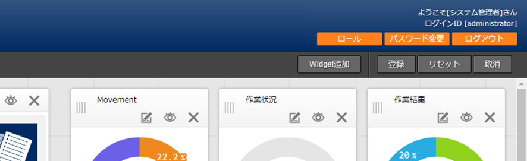
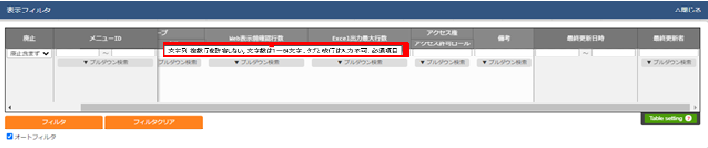
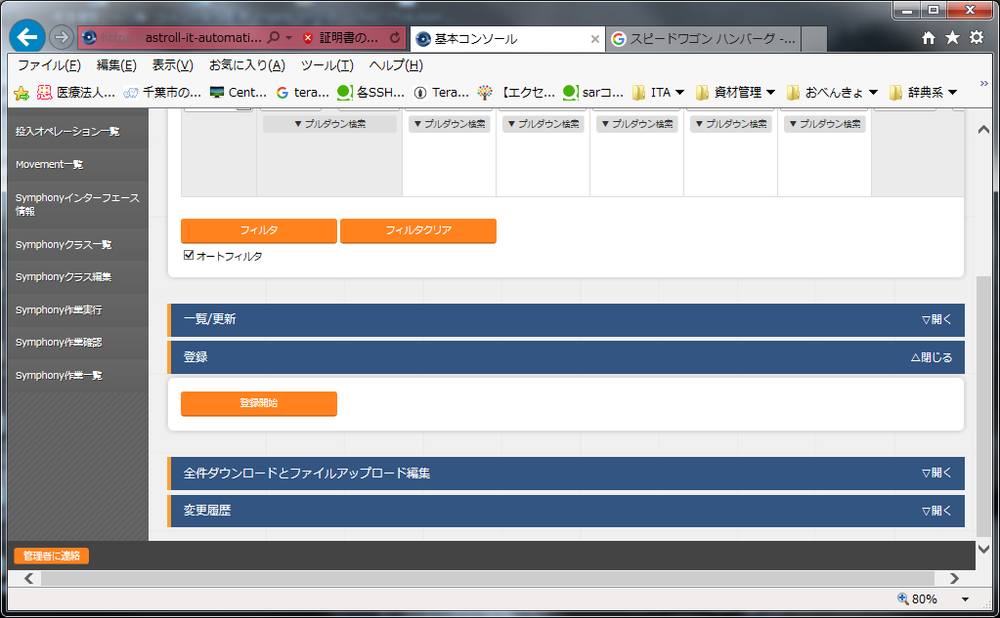
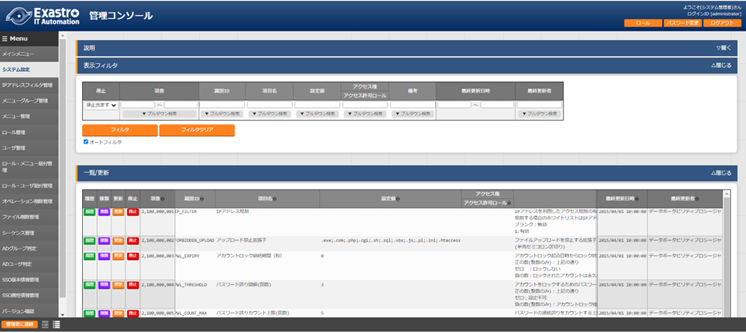
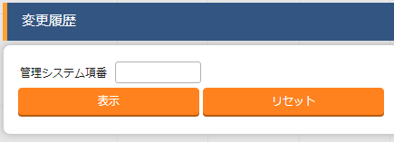

.. image:: ./management_console/image1.png
   :width: 3.35079in
   :height: 0.78559in

ITA_利用手順マニュアル

管理コンソール

*－*\ 第1.10版\ *－*

Copyright © NEC Corporation 2019. All rights reserved.

免責事項

本書の内容はすべて日本電気株式会社が所有する著作権に保護されています。

本書の内容の一部または全部を無断で転載および複写することは禁止されています。

本書の内容は将来予告なしに変更することがあります。

日本電気株式会社は、本書の技術的もしくは編集上の間違い、欠落について、一切責任を負いません。

日本電気株式会社は、本書の内容に関し、その正確性、有用性、確実性その他いかなる保証もいたしません。

商標

-  LinuxはLinus
      Torvalds氏の米国およびその他の国における登録商標または商標です。

-  Red Hatは、Red Hat,
      Inc.の米国およびその他の国における登録商標または商標です。

-  Apache、Apache Tomcat、Tomcatは、Apache Software
      Foundationの登録商標または商標です。

-  Ansibleは、Red Hat, Inc.の登録商標または商標です。

-  Active Directoryは、米国Microsoft
      Corporationの米国およびその他の国における登録商標または商標です。

その他、本書に記載のシステム名、会社名、製品名は、各社の登録商標もしくは商標です。

なお、® マーク、TMマークは本書に明記しておりません。

※本書では「Exastro IT Automation」を「ITA」として記載します。

目次
====

`目次 <#目次>`__ `2 <#目次>`__

`はじめに <#はじめに>`__ `4 <#はじめに>`__

`1.
ITAシステム　管理コンソールの概要 <#itaシステム-管理コンソールの概要>`__
`5 <#itaシステム-管理コンソールの概要>`__

`1.1 ITA管理コンソールについて <#ita管理コンソールについて>`__
`5 <#ita管理コンソールについて>`__

`1.1.1 画面説明
ログイン、パスワード登録 <#画面説明-ログインパスワード登録>`__
`6 <#画面説明-ログインパスワード登録>`__

`(1) ログイン画面 <#ログイン画面>`__ `6 <#ログイン画面>`__

`(2) パスワード変更 <#パスワード変更>`__ `6 <#パスワード変更>`__

`(3)
ログアウト画面（もう一度ログインする） <#ログアウト画面もう一度ログインする>`__
`6 <#ログアウト画面もう一度ログインする>`__

`(4) 「ロール」ボタン <#ロールボタン>`__ `7 <#ロールボタン>`__

`1.1.2 画面説明 メインメニュー <#画面説明-メインメニュー>`__
`8 <#画面説明-メインメニュー>`__

`(1) 画面構成 <#画面構成>`__ `8 <#画面構成>`__

`(2) Widgetの編集 <#widgetの編集>`__ `10 <#widgetの編集>`__

`(3) Widgetの登録 <#widgetの登録>`__ `15 <#widgetの登録>`__

`(4) その他 <#その他>`__ `16 <#その他>`__

`1.1.3 画面説明 基本画面構成 <#画面説明-基本画面構成>`__
`17 <#画面説明-基本画面構成>`__

`(1) 表示フィルタ <#表示フィルタ>`__ `18 <#表示フィルタ>`__

`(2) 一覧/更新 <#一覧更新>`__ `19 <#一覧更新>`__

`(3) 複製 <#複製>`__ `20 <#複製>`__

`(4) 登録 <#登録>`__ `22 <#登録>`__

`(5)
登録全件ダウンロードとファイルアップロード編集 <#登録全件ダウンロードとファイルアップロード編集>`__
`22 <#登録全件ダウンロードとファイルアップロード編集>`__

`(6) 変更履歴 <#変更履歴>`__ `24 <#変更履歴>`__

`(7)
プルダウンによる入力項目について <#プルダウンによる入力項目について>`__
`28 <#プルダウンによる入力項目について>`__

`(8) テーブル設定 <#テーブル設定>`__ `28 <#テーブル設定>`__

`(9) ヘッダー固定設定 <#ヘッダー固定設定>`__ `30 <#ヘッダー固定設定>`__

`(10) サブメニュー初期状態設定 <#サブメニュー初期状態設定>`__
`30 <#サブメニュー初期状態設定>`__

`1.1.4 画面説明 メニューの操作方法 <#画面説明-メニューの操作方法>`__
`32 <#画面説明-メニューの操作方法>`__

`(1) システム設定 <#システム設定>`__ `32 <#システム設定>`__

`(2) メニューグループ管理 <#メニューグループ管理>`__
`36 <#メニューグループ管理>`__

`(3) メニュー管理 <#メニュー管理>`__ `41 <#メニュー管理>`__

`(4) ロール管理 <#ロール管理>`__ `43 <#ロール管理>`__

`(5) ユーザー管理 <#ユーザー管理>`__ `45 <#ユーザー管理>`__

`(6) ロール・メニュー紐付管理 <#ロールメニュー紐付管理>`__
`46 <#ロールメニュー紐付管理>`__

`(7) ロール・ユーザ紐付管理 <#ロールユーザ紐付管理>`__
`47 <#ロールユーザ紐付管理>`__

`(8) シーケンス管理 <#シーケンス管理>`__ `48 <#シーケンス管理>`__

`(9) SSO基本情報管理 <#sso基本情報管理>`__ `49 <#sso基本情報管理>`__

`(10) SSO属性情報管理 <#sso属性情報管理>`__ `50 <#sso属性情報管理>`__

`(11) ITAバージョン確認 <#itaバージョン確認>`__
`50 <#itaバージョン確認>`__

`(12) IPアドレスフィルタ管理 <#ipアドレスフィルタ管理>`__
`52 <#ipアドレスフィルタ管理>`__

`(13) オペレーション削除管理 <#オペレーション削除管理>`__
`53 <#オペレーション削除管理>`__

`(14) ファイル削除管理 <#ファイル削除管理>`__ `55 <#ファイル削除管理>`__

`(15) ファイル項目-ファイル削除機能 <#_Toc101961101>`__
`56 <#_Toc101961101>`__

`(16)
ファイル項目-ファイルダウンロード機能 <#ファイル項目-ファイルダウンロード機能>`__
`56 <#ファイル項目-ファイルダウンロード機能>`__

`(17)
パスワード項目-パスワード削除機能 <#パスワード項目-パスワード削除機能>`__
`56 <#パスワード項目-パスワード削除機能>`__

`1.2 BackYardコンテンツ <#backyardコンテンツ>`__
`57 <#backyardコンテンツ>`__

`1.2.1 BackYard処理一覧 <#backyard処理一覧>`__
`58 <#backyard処理一覧>`__

`1.2.2 BackYard処理説明 <#backyard処理説明>`__
`59 <#backyard処理説明>`__

`(1) メール送信 <#メール送信>`__ `59 <#メール送信>`__

`(2) ロール紐付確認＋クリーニング <#ロール紐付確認クリーニング>`__
`64 <#ロール紐付確認クリーニング>`__

`(3)
投入オペレーション確認＋クリーニング <#投入オペレーション確認クリーニング>`__
`64 <#投入オペレーション確認クリーニング>`__

`(4) ファイル確認＋クリーニング <#ファイル確認クリーニング>`__
`64 <#ファイル確認クリーニング>`__

`(5)
ActiveDirectory情報ミラーリング <#activedirectory情報ミラーリング>`__
`64 <#activedirectory情報ミラーリング>`__

`1.3 ActiveDirectory連携機能の利用 <#_Toc101961112>`__
`65 <#_Toc101961112>`__

`1.3.1 利用の開始 <#利用の開始>`__ `66 <#利用の開始>`__

`1.3.2 機能概要 <#機能概要>`__ `67 <#機能概要>`__

`(1) AD情報ミラーリング機能 <#ad情報ミラーリング機能>`__
`67 <#ad情報ミラーリング機能>`__

`(2) AD認証（Kerberos認証）機能 <#ad認証kerberos認証機能>`__
`67 <#ad認証kerberos認証機能>`__

`1.3.3 AD情報ミラーリング機能 <#_Toc101961117>`__
`68 <#_Toc101961117>`__

`1.3.4 AD認証（Kerberos認証）機能 <#ad認証kerberos認証機能-1>`__
`70 <#ad認証kerberos認証機能-1>`__

`1.3.5 本機能の例外について <#本機能の例外について>`__
`71 <#本機能の例外について>`__

`(1) 連携対象外レコード <#連携対象外レコード>`__
`71 <#連携対象外レコード>`__

`(2) AD認証対象外（ITA内部認証） <#ad認証対象外ita内部認証>`__
`71 <#ad認証対象外ita内部認証>`__

`2. 運用操作 <#運用操作>`__ `73 <#運用操作>`__

`2.1 インストールの開始 <#_Toc101961124>`__ `73 <#_Toc101961124>`__

`2.2
オペレーション作業履歴の定期削除 <#オペレーション作業履歴の定期削除>`__
`73 <#オペレーション作業履歴の定期削除>`__

`2.3 ログレベルの変更 <#ログレベルの変更>`__ `75 <#ログレベルの変更>`__

`2.4 メンテナンス <#メンテナンス>`__ `75 <#メンテナンス>`__

`2.4.1 ITAシステム
独立型プロセスの起動/停止/再起動 <#itaシステム-独立型プロセスの起動停止再起動>`__
`76 <#itaシステム-独立型プロセスの起動停止再起動>`__

`(1) プロセス起動 <#プロセス起動>`__ `76 <#プロセス起動>`__

`(2) プロセス停止 <#プロセス停止>`__ `76 <#プロセス停止>`__

`(3) プロセス再起動 <#プロセス再起動>`__ `76 <#プロセス再起動>`__

`76 <#section-4>`__

`3. Appendix <#appendix>`__ `77 <#appendix>`__

`3.1 トラブルシューティング <#_Toc101961135>`__ `77 <#_Toc101961135>`__

はじめに
========

本書は、ITAシステムの管理コンソールの概要および操作方法について記載したものです。

ITAシステム　管理コンソールの概要
=================================

本章ではITAを操作するための管理コンソールについて説明します。

ITA管理コンソールについて
-------------------------

ITA管理コンソールでは、ITAを利用するユーザー（アカウント）、操作メニューの実行権限の

登録／更新／削除を行います。

また、ITA初期メニュー以外に、利用部門が独自の情報をITAのデータベース上で管理する場合、管理レベルにあった個別メニューの作成もできます。

個別メニューの登録／変更／削除をご使用される際は、製品サポートへお問い合わせください。

表 1.1- 1 Webコンテンツメニュー/画面一覧

+----+--------------------------+--------------------------------------+
| ** |    **メニューグループ**  |    **メニュー・画面**                |
| No |                          |                                      |
| ** |                          |                                      |
+====+==========================+======================================+
| 1  | 共通部                   |    ログイン画面                      |
+----+--------------------------+--------------------------------------+
| 2  |                          |    パスワード変更画面                |
+----+--------------------------+--------------------------------------+
| 3  |                          |    ログアウト画面                    |
+----+--------------------------+--------------------------------------+
| 4  |                          |    「ロール」ボタン                  |
+----+--------------------------+--------------------------------------+
| 5  | ITA管理コンソール        |    メインメニュー                    |
+----+--------------------------+--------------------------------------+
| 6  |                          |    システム設定                      |
+----+--------------------------+--------------------------------------+
| 7  |                          |    メニューグループ管理              |
+----+--------------------------+--------------------------------------+
| 8  |                          |    メニュー管理                      |
+----+--------------------------+--------------------------------------+
| 9  |                          |    ロール管理                        |
+----+--------------------------+--------------------------------------+
| 10 |                          |    ユーザー管理                      |
+----+--------------------------+--------------------------------------+
| 11 |                          |    ロール・メニュー紐付管理          |
+----+--------------------------+--------------------------------------+
| 12 |                          |    ロール・ユーザ紐付管理            |
+----+--------------------------+--------------------------------------+
| 13 |                          |    シーケンス管理                    |
+----+--------------------------+--------------------------------------+
| 14 |                          |    SSO基本情報管理                   |
+----+--------------------------+--------------------------------------+
| 15 |                          |    SSO属性情報管理                   |
+----+--------------------------+--------------------------------------+
| 16 |                          |    ITAバージョン確認                 |
+----+--------------------------+--------------------------------------+
| 17 |                          |    IPアドレス                        |
|    |                          | フィルタ管理（デフォルトでは非表示） |
+----+--------------------------+--------------------------------------+
| 18 |                          |    オペレーシ                        |
|    |                          | ョン削除管理（デフォルトでは非表示） |
+----+--------------------------+--------------------------------------+
| 19 |                          |    ファ                              |
|    |                          | イル削除管理（デフォルトでは非表示） |
+----+--------------------------+--------------------------------------+

画面説明 ログイン、パスワード登録
~~~~~~~~~~~~~~~~~~~~~~~~~~~~~~~~~

ログイン画面
^^^^^^^^^^^^

ITAシステムのメニュー画面に未ログインでアクセスした場合、「ログイン画面」が表示されます。

   .. image:: ./management_console/image2.png
      :width: 4.33071in
      :height: 1.74712in

図 1.1- 1 ITAログイン画面

**ITAシステムのインストール直後は必ず次のログインＩＤとパスワードでログインしてください。**

   ログインID ：administrator

   初期パスワード ：password

インストール後に初めてログインした際は「パスワード変更画面」に遷移します。

パスワード変更
^^^^^^^^^^^^^^

ログインユーザーは任意のタイミングで自身のパスワードを変更できます。

各メニュー画面右上の「パスワード変更」ボタンから「パスワード変更画面」に遷移し、パスワード

変更を行ってください。

   　　|image1|

図 1.1- 2 ITAパスワード変更画面

ログアウト画面（もう一度ログインする）
^^^^^^^^^^^^^^^^^^^^^^^^^^^^^^^^^^^^^^

各メニュー画面右上「ログアウト」ボタンをクリックすると、システムからログアウトします。

表示されている「もう一度ログインする」リンクをクリックすると、ログイン画面に遷移します。

　　|image2|

図 1.1- 3 ITAログアウト画面

「ロール」ボタン
^^^^^^^^^^^^^^^^

ログインしているユーザは「ロール」ボタンを押下することで自分がどのロールに所属しているかを確認することが可能です。

.. image:: ./management_console/image5.png
   :width: 5.51181in
   :height: 0.58853in

図 1.1- 4 「ロール」ボタン

例として、以下のようなロール・ユーザ紐付がある状態で「user_A」がログインした場合、「ロール」ボタンを押下すると「user_A」が所属する「role_A」「role_C」が表示されます。

.. image:: ./management_console/image6.png
   :width: 5.51181in
   :height: 3.36359in

図 1.1- 5 administratorから見た「ロール・ユーザ紐付管理」メニュー

.. image:: ./management_console/image7.png
   :width: 5.51181in
   :height: 1.24455in

図 1.1- 6 user_Aから見た「ロール」画面

-  「ロール・ユーザ紐付管理」メニューの表示権限がないユーザでも「ロール」ボタンからロールを確認することが可能

-  「ロール」ボタンの表示切り替えは「システム設定」メニューから変更が可能

-  データレコード毎のロールベースアクセス制御に関わらずロールを確認することが可能

画面説明 メインメニュー
~~~~~~~~~~~~~~~~~~~~~~~

メインメニューにはWidgetが表示されます。

Widgetの内容や配置は個人でカスタマイズすることができます。

画面構成
^^^^^^^^

　
No.1～5のWidgetがデフォルトで表示されます。No.6～9はデフォルトでは表示されません（「Widget追加」ボタンを押下することで追加できます）。

.. image:: ./management_console/image8.png
   :width: 6.69236in
   :height: 4.68611in

図 1.1- 7 各種Widget （No.1～9）

表 1.1- 2 Widget一覧（No.1～9）

+---+-------------+------------------------------------------+-------+
| * | *           | **説明**                                 | *     |
| * | *Widget名** |                                          | *デフ |
| N |             |                                          | ォル  |
| o |             |                                          | ト**  |
| . |             |                                          |       |
| * |             |                                          |       |
| * |             |                                          |       |
+===+=============+==========================================+=======+
| 1 | メニュ      | 各メニューグループのパネルが表示さ       | 表示  |
|   | ーグループ  | れます。パネルを押下することで指定のメニ |       |
|   |             | ューグループのメインメニューへ遷移できま |       |
|   |             | す。\ **インストールしたドライバーのみ** |       |
|   |             | \ が表示されます。「メニューグループ」Wi |       |
|   |             | dgetを\ **削除することはできません**\ 。 |       |
+---+-------------+------------------------------------------+-------+
| 2 | Movement    | 各オーケストレーションに登録されている   | 表示  |
|   |             | Movementの件数が円グラフで表示されます。 |       |
|   |             |                                          |       |
|   |             | 「SUM」列の数値また                      |       |
|   |             | はグラフを押下することで、各ドライバーの |       |
|   |             | 「Movement一覧」メニューへ遷移できます。 |       |
+---+-------------+------------------------------------------+-------+
| 3 | 作業状況    | Conductor、Symphonyの作業状況のステー    | 表示  |
|   |             | タスごとに件数が円グラフで表示されます。 |       |
|   |             |                                          |       |
|   |             | 「CON」列の数値を押下すること            |       |
|   |             | で、「Conductor」メニューグループの「Con |       |
|   |             | ductor作業一覧」メニューへ遷移できます。 |       |
|   |             |                                          |       |
|   |             | 「SYM」列の数値を押下するこ              |       |
|   |             | とで、「Symphony」メニューグループの「Sy |       |
|   |             | mphony作業一覧」メニューへ遷移できます。 |       |
+---+-------------+------------------------------------------+-------+
| 4 | 作業結果    | Conductor、Symphonyの作業結果のステー    | 表示  |
|   |             | タスごとに件数が円グラフで表示されます。 |       |
|   |             |                                          |       |
|   |             | 「CON」列の数値を押下すること            |       |
|   |             | で、「Conductor」メニューグループの「Con |       |
|   |             | ductor作業一覧」メニューへ遷移できます。 |       |
|   |             |                                          |       |
|   |             | 「SYM」列の数値を押下するこ              |       |
|   |             | とで、「Symphony」メニューグループの「Sy |       |
|   |             | mphony作業一覧」メニューへ遷移できます。 |       |
+---+-------------+------------------------------------------+-------+
| 5 | 作業履歴    | Conductor、Symphonyの作業履              | 表示  |
|   |             | 歴の日別の結果が棒グラフで表示されます。 |       |
|   |             |                                          |       |
|   |             | 棒グラフにカーソルを合わ                 |       |
|   |             | せて押下すると件数の詳細が表示されます。 |       |
|   |             |                                          |       |
|   |             | 「CON」列の数値を押下すること            |       |
|   |             | で、「Conductor」メニューグループの「Con |       |
|   |             | ductor作業一覧」メニューへ遷移できます。 |       |
|   |             |                                          |       |
|   |             | 「SYM」列の数値を押下するこ              |       |
|   |             | とで、「Symphony」メニューグループの「Sy |       |
|   |             | mphony作業一覧」メニューへ遷移できます。 |       |
+---+-------------+------------------------------------------+-------+
| 6 | メニ        | メインメニューとは別に                   | 非    |
|   | ューセット  | メニューグループのセットを作成できます。 | 表示  |
+---+-------------+------------------------------------------+-------+
| 7 | リンク      | リンクのリストを作成できます。           | 非    |
|   |             |                                          | 表示  |
+---+-------------+------------------------------------------+-------+
| 8 | 画像        | 画像を貼り付けできます。                 | 非    |
|   |             |                                          | 表示  |
+---+-------------+------------------------------------------+-------+
| 9 | 予          | ステータスが「未実行（予約）」である     | 非    |
|   | 約作業確認  | Symphony・Conductorの一覧を表示します。  | 表示  |
|   |             |                                          |       |
|   |             | インスタンスID                           |       |
|   |             | 、Symphony及びConductor名、オペレー      |       |
|   |             | ション名、予約日時、予約日時までの残り時 |       |
|   |             | 間が確認可能です。インスタンスIDを押下す |       |
|   |             | ると、対象の作業確認画面へと遷移します。 |       |
+---+-------------+------------------------------------------+-------+

Widgetの編集
^^^^^^^^^^^^

　 画面右上の「編集」ボタンを押下することで編集画面に移行します。

.. image:: ./management_console/image9.png
   :width: 5.90051in
   :height: 1.59347in

図 1.1- 8メインメニュー画面 編集ボタン

-  Widget追加

1. Widgetを追加したい箇所にカーソルを合わせ、DASHBOARD内にblankを追加します。

..

   | 既存Widgetの上もしくは下にカーソルを合わせると「＋Blank」ボタンが表示されます。
   | 「＋Blank」ボタンを押下しblankを追加することでWidgetを追加することが可能です。

   .. image:: ./management_console/image10.png
      :width: 5.32046in
      :height: 2.98693in

図 1.1- 9 メインメニュー 「+Blank」

2. 「Widget追加」ボタンを押下します。

..

   .. image:: ./management_console/image11.png
      :width: 5.31379in
      :height: 1.20677in

図 1.1- 10 メインメニュー 「Widget追加」ボタン

1. 

2. 

3. 追加したいWidgetを選択し、「決定」ボタンを押下します。

..

   .. image:: ./management_console/image12.png
      :width: 5.31354in
      :height: 2.78704in

図 1.1- 11 「Widgetを追加する」画面

   **※ 「メニューセット」Widgetへの追加**

   「メニューグループ」Widgetから「メニューセット」Widgetへ、パネルをドラッグ＆ドロップで移動させることができます。

   .. image:: ./management_console/image13.png
      :width: 5.3937in
      :height: 2.95347in

図 1.1- 12 「メニューセット」枠

-  Widget編集

..

   各Widgetの右上に表示される各種ボタン（以下A、B、C）からWidgetを編集することが可能です。

   .. image:: ./management_console/image14.png
      :width: 5.90551in
      :height: 3.36963in

図 1.1- 13 Widget枠内各ボタン

A. 編集ボタン

..

   Widgetの内容を編集できます。

   .. image:: ./management_console/image15.png
      :width: 5.11811in
      :height: 3.07607in

図 1.1- 14 Widget「編集」画面

   .. image:: ./management_console/image16.png
      :width: 5.11811in
      :height: 3.83181in

図 1.1- 15 「リンク」Widgetの「編集」画面

   .. image:: ./management_console/image17.png
      :width: 5.11811in
      :height: 3.64144in

図 1.1- 16「画像」Widgetの「編集」画面

   .. image:: ./management_console/image18.png
      :width: 5.11811in
      :height: 3.00225in

図 1.1- 17 「作業履歴」Widgetの「編集」画面

   .. image:: ./management_console/image19.png
      :width: 5.12962in
      :height: 3.89623in

図 1.1- 18 「予約作業確認」Widgetの「編集」画面

表 1.1- 3 各種Widget「編集」画面項目一覧

+----+-----------+--------------------------------+-------------------+
| *  | *         | **説明**                       | **対象Widget**    |
| *N | *項目名** |                                |                   |
| o. |           |                                |                   |
| ** |           |                                |                   |
+====+===========+================================+===================+
| 1  | 名称      | Widgetの名称を変更します。     | メ                |
|    |           |                                | ニューグループ、M |
|    |           |                                | ovement、作業状況 |
|    |           |                                | 、作業結果、作業  |
|    |           |                                | 履歴、メニューセ  |
|    |           |                                | ット、リンク、画  |
|    |           |                                | 像、予約作業確認  |
+----+-----------+--------------------------------+-------------------+
| 2  | 横サイズ  | Widgetの横幅を変更します。     |                   |
+----+-----------+--------------------------------+-------------------+
| 3  | 縦サイズ  | Widgetの縦幅を変更します。     |                   |
+----+-----------+--------------------------------+-------------------+
| 4  | タイ      | Widgetのタイトルバ             |                   |
|    | トルバー  | ーの表示・非表示を変更します。 |                   |
+----+-----------+--------------------------------+-------------------+
| 5  | 枠・背景  | 枠・背                         |                   |
|    |           | 景の表示・非表示を変更します。 |                   |
+----+-----------+--------------------------------+-------------------+
| 6  | 一        | 一行に表示するアイコン         | メニュー          |
|    | 行項目数  | の数を指定することが可能です。 | グループ、メニュ  |
|    |           |                                | ーセット、リンク  |
+----+-----------+--------------------------------+-------------------+
| 7  | 項        | リンクの名称です。             | リンク            |
|    | 目・名称  |                                |                   |
+----+-----------+--------------------------------+-------------------+
| 8  | 項目・URL | リンク先のURLです。            |                   |
+----+-----------+--------------------------------+-------------------+
| 9  | 項目      | aタグのTargetを指定できます。  |                   |
|    | ・Target  |                                |                   |
|    |           | （例：_blank、_parentなど）    |                   |
+----+-----------+--------------------------------+-------------------+
| 10 | 画像URL   | 画像のあるURLを設定します。    | 画像              |
+----+-----------+--------------------------------+-------------------+
| 11 | Link URL  | 画像クリ                       |                   |
|    |           | ック時のリンク先を設定します。 |                   |
+----+-----------+--------------------------------+-------------------+
| 12 | Link      | 画像                           |                   |
|    | Target    | クリック時の挙動を設定します。 |                   |
+----+-----------+--------------------------------+-------------------+
| 13 | 期間      | 表                             | 作業履歴          |
|    |           | 示する履歴の期間を設定します。 |                   |
+----+-----------+--------------------------------+-------------------+
| 14 | 期        | 予約作業確                     | 予約作業確認      |
|    | 間（日）  | 認にて、実行予定日が何日先まで |                   |
|    |           | の作業を表示するか設定します。 |                   |
|    |           |                                |                   |
|    |           | 例として、1/1                  |                   |
|    |           | 14:00                          |                   |
|    |           | 時点に「3」を設定した場合、1/4 |                   |
|    |           | 23:59:59までに実行さ           |                   |
|    |           | れる作業が表示対象となります。 |                   |
+----+-----------+--------------------------------+-------------------+
| 15 | Symphony  | 「表示しない」を選             |                   |
|    |           | 択すると、予約作業確認Widgetか |                   |
|    |           | らSymphonyが非表示となります。 |                   |
+----+-----------+--------------------------------+-------------------+
| 16 | Conductor | 「表示しない」を選択           |                   |
|    |           | すると、予約作業確認Widgetから |                   |
|    |           | Conductorが非表示となります。  |                   |
+----+-----------+--------------------------------+-------------------+

B. 非表示ボタン

..

   Widgetの表示/非表示の選択を行います。

C. 削除ボタン

..

   Widgetを削除します。

Widgetの登録
^^^^^^^^^^^^

　
画面右上の「登録」ボタンを押下することで、編集したWidgetを保存することが可能です。

.. image:: ./management_console/image20.png
   :width: 5.90718in
   :height: 1.80682in

図 1.1- 19 Widget「登録」ボタン

その他
^^^^^^

　
画面右上のボタンを押下することで、Widgetの変更内容をリセット及び取り消すことが可能です。

図 1.1- 20 Widget 「リセット」ボタン・「取消」ボタン

表 1.1- 4　編集画面のボタン

+----+---------------+-------------------------------------------------+
| *  | **項目名**    | **説明**                                        |
| *N |               |                                                 |
| o. |               |                                                 |
| ** |               |                                                 |
+====+===============+=================================================+
| 1  | 「リセ        | Widgetの構成をデフォルトに戻します。            |
|    | ット」ボタン  |                                                 |
+----+---------------+-------------------------------------------------+
| 2  | 「            | 編集内容を破棄します。                          |
|    | 取消」ボタン  |                                                 |
+----+---------------+-------------------------------------------------+

画面説明 基本画面構成
~~~~~~~~~~~~~~~~~~~~~

| ITAシステムが提供する各メニュー画面は基本的に同じ要素で構成されています。
| その構成要素は次のとおりです。

   .. image:: ./management_console/image22.png
      :width: 6.29921in
      :height: 3.66109in

図 1.1- 21 画面構成

表 1.1- 5 画面構成一覧

+---+------------+-----------------------------------------------------+
| * | **画面名** | **説明**                                            |
| * |            |                                                     |
| N |            |                                                     |
| o |            |                                                     |
| * |            |                                                     |
| * |            |                                                     |
+===+============+=====================================================+
| 1 | メニュ     | 各メニューが所属しているグループの名称。            |
|   | ーグループ | 現在表示しているメニューグループ名が表示されます。  |
+---+------------+-----------------------------------------------------+
| 2 | メニュー   | 現在のメニューグループで、                          |
|   |            | 操作/表示可能なメニューがリストとして表示されます。 |
+---+------------+-----------------------------------------------------+
| 3 | サ         | 各メニューに対応する登録、設定などを行う部分です。  |
|   | ブメニュー | ※詳細は後述します。                                 |
+---+------------+-----------------------------------------------------+
| 4 | ロ         | 現在ログインしているアカウント名が表示されます。    |
|   | グイン情報 | 所属しているロールの確                              |
|   |            | 認やパスワード変更、ログアウト処理操作が可能です。  |
+---+------------+-----------------------------------------------------+
| 5 | シス       | 管理者のメールアドレスのリンクです。                |
|   | テム管理者 |                                                     |
+---+------------+-----------------------------------------------------+

各メニュー操作部の構成要素に対する操作方法を説明します。

表示フィルタ
^^^^^^^^^^^^

| 各メニューで登録されている項目を表示するための検索条件を指定します。
| 検索条件、検索項目はメニューごとに異なります。ここでは共通機能について説明します。

   .. image:: ./management_console/image24.png
      :width: 6.57544in
      :height: 1.44028in

図 1.1- 22 表示フィルタ画面

A. 廃止カラム

-  初期状態では、「廃止含まず」がセットされています。

-  | 他に「全レコード」、「廃止のみ」が任意操作で選択可能であり、希望表示方法を指定します。
   | **必ずいずれかの選択が必須**\ 。

B. 検索条件

-  検索する条件を指定します。

-  システム名や備考などにおいて、文字指定ができる項目については「あいまい検索」
   or 「プルダウン検索」でフィルタすることができます。

C. アクセス権

-  アクセス権の詳細については、「ITA利用手順マニュアル　ロールベースアクセス制御」を参照して下さい。

D. オートフィルタ

-  オートフィルタをチェックしておくと、フィルタ条件を選択するごとに条件に合った一覧を自動で表示します。

   画面表示時のチェック有無は、管理コンソール「メニュー管理」の「オートフィルタチェック」で設定可能です。

E. カラム説明 (Description)

-  カーソルを合わせると該当する列の説明文がポップアップ表示されます。

F. テーブル設定

-  テーブルの項目の表示/非表示切り替えと、テーブルをスクロールした際の固定箇所の設定が行えます。

-  テーブルの設定はフィルタ表示、一覧/更新、変更履歴の項目で行えます。

-  機能の詳細は「\ *(8)テーブル設定*\ 」で説明します。

一覧/更新
^^^^^^^^^

表示フィルタで指定した検索条件に一致した項目の一覧が表示されます

.. image:: ./management_console/image25.png
   :width: 6.44206in
   :height: 3.16667in

図 1.1- 23 「一覧／更新」サブメニュー

   .. image:: ./management_console/image26.png
      :width: 5.90551in
      :height: 1.3518in

図 1.1- 24 「一覧/更新」サブメニュー 更新フォーム

A. フィルタ　

-  検索条件を手入力およびプルダウンメニューから選択し、Enterキーまたは「フィルタ」ボタンを押下すると「一覧／更新」サブメニューに登録情報が表示されます。

G. 履歴

-  各項目に対して「履歴」ボタンを押下すると変更履歴画面に遷移します。

H. 複製

-  各項目に対して「複製」ボタンを押下すると、対象項目の値を反映した状態の登録画面に遷移します。

I. 更新

-  各項目に対して「更新」ボタンを押下すると更新画面に遷移します。

-  情報を更新し、「更新」ボタンを押下することで更新が完了します。

J. 廃止

-  「廃止」ボタンを押下すると廃止画面に遷移します。

-  「廃止」ボタンを押下すると登録情報が無効になります。

-  無効となった情報は、復活させることができます。

   表示フィルタの「廃止のみ」を選択して表示し、「復活」ボタンを押下することで、

   情報が有効になります。

K. アクセス権

-  アクセス権の詳細については、「ITA利用手順マニュアル_データレコード毎のロールベースアクセス制御」を参照して下さい。

複製
^^^^

   複製ボタンを押下後、対象項目の値を反映した状態の登録画面に遷移します。

   .. image:: ./management_console/image27.png
      :width: 4.672in
      :height: 0.6248in

.. image:: ./management_console/image28.png
   :width: 5.98836in
   :height: 1.10732in

図 1.1- 25 登録画面（複製時）

   尚、対象項目がパスワード項目またはアクセス許可ロールの場合、複製処理は行われません。

   .. image:: ./management_console/image29.png
      :width: 5.9012in
      :height: 0.77156in

   .. image:: ./management_console/image30.png
      :width: 5.83027in
      :height: 1.29105in

図 1.1- 26 登録画面（複製時-パスワード項目）

.. image:: ./management_console/image31.png
   :width: 6.35838in
   :height: 0.41699in

.. image:: ./management_console/image32.png
   :width: 6.69236in
   :height: 0.8in

図 1.1- 27 登録画面（複製時-アクセス許可ロール項目）

   Ansible-Legacyメニューグループ＞代入値管理メニューのように、Sensitive設定が存在する項目に関しては、Sensitive設定が「OFF」の場合のみ複製処理を行います。

Sensitive設定が「OFF」の場合

   .. image:: ./management_console/image33.png
      :width: 6.19403in
      :height: 0.62538in

   .. image:: ./management_console/image34.png
      :width: 6.23724in
      :height: 0.9517in

Sensitive設定が「ON」の場合

   .. image:: ./management_console/image35.png
      :width: 6.2833in
      :height: 0.60831in

.. image:: ./management_console/image36.png
   :width: 6.12494in
   :height: 0.93284in

図 1.1- 28 登録画面（複製時- Sensitive設定）

登録
^^^^

| 各メニューに対して、新規に項目を登録します。
| 登録内容は各メニューによって異なりますので、各利用手順マニュアルを参照してください。

   .. image:: ./management_console/image38.png
      :width: 5.864in
      :height: 1.19163in

図 1.1- 29 登録（１件ごと）画面

A. 登録

-  | 「登録」サブメニューを開き、「登録開始」ボタンを押下して登録フォームを表示します。
   | 必要な情報を入力し、「登録」ボタンを押下します。

L. アクセス権

-  アクセス権の詳細については、「ITA利用手順マニュアル_データレコード毎のロールベースアクセス制御」を参照して下さい。

登録全件ダウンロードとファイルアップロード編集
^^^^^^^^^^^^^^^^^^^^^^^^^^^^^^^^^^^^^^^^^^^^^^

各メニュー画面に登録されている情報を一括してエクセル形式でダウンロードすることができます。

また、同じ形式のファイルで、一括して情報を登録することができます。

|image3|\ |image4|

図 1.1- 30 登録（一括）画面

A. 全件ダウンロード、新規登録用ダウンロード

-  「全件ダウンロード(Excel)」ボタンを押下すると、各メニュー画面で登録している項目の一覧をエクセル形式でダウンロードできます。

-  「新規登録用ダウンロード(Excel)」ボタンを押下すると、各メニュー画面に対応する新規登録用のエクセルシートをダウンロードできます。

M. ファイルアップロード

-  | Ａの全件ダウンロード、新規登録用ダウンロードでダウンロードしたエクセルファイルを編集し、ここからアップロードすることで一括して追加、登録ができます。
   | 「参照」ボタンでファイルを指定し、「ファイルアップロード」ボタンを押下してください。

B. 変更履歴全件ダウンロード

-  「変更履歴全件ダウンロード(Excel)」ボタンを押下すると、各メニュー画面で登録している項目一覧の変更履歴全件をエクセル形式でダウンロードできます。

変更履歴
^^^^^^^^

各メニューで、登録した項目の変更履歴を表示することができます。

|image5|\ |image6|

図 1.1- 31 変更履歴画面

A. 各メニューの主キーを指定することで、対応する項目の変更履歴を表示することができます。

N. 変更実施日時が新しい順に一覧表示され、前回との変更箇所が青色太文字で表示されます。

-  プルダウン選択を含んだ場合の変更履歴について

..

   「プルダウン選択」の参照元を変更した場合、参照側の値も自動的に変更されます。「変更履歴」は、値を編集（登録/更新/廃止/復活）した時点の値が表示されます。

   以下、例を用いて説明します。

   例：

   パラメータシート「ぱらむ001」の項目「ぱらむB」が「マスタ001」の項目「マスタ」を参照している場合

   ※事前準備として、以下のデータシートおよびパラメータシートを作成

   データシート「マスタ001」

   .. image:: ./management_console/image43.png
      :width: 5.51181in
      :height: 1.81191in

図 1.1- 32　「メニュー定義・作成」メニューで作成したデータシート

   パラメータシート「ぱらむ001」

   .. image:: ./management_console/image44.png
      :width: 5.51181in
      :height: 2.10418in

図 1.1- 33　「メニュー定義・作成」メニューで作成したパラメータシート

   操作：

#. 「マスタ001」に値「mas1-1」を登録

..

   .. image:: ./management_console/image45.png
      :width: 5.31496in
      :height: 1.54314in

図 1.1- 34　データシート「マスタ001」

2. 「ぱらむ001」に 1 件登録

..

   .. image:: ./management_console/image46.png
      :width: 5.31496in
      :height: 1.16315in

図 1.1- 35　パラメータシート「ぱらむ001」

3. 「ぱらむ001」を更新 ※「更新」ボタンの押下のみ

..

   .. image:: ./management_console/image47.png
      :width: 5.31496in
      :height: 1.62421in

図 1.1- 36　パラメータシート「ぱらむ001」

4. 「マスタ001」の値を「mas1-2」に更新

..

   .. image:: ./management_console/image48.png
      :width: 5.31496in
      :height: 1.5448in

図 1.1- 37　データシート「マスタ001」

5. 「マスタ001」の値を「mas1-3」に更新

..

   （図省略）

6. 「ぱらむ001」を更新 ※「更新」ボタンの押下のみ

..

   （図省略）

7. 「マスタ001」の値を「mas1-4」に更新

..

   （図省略）

8. 「マスタ001」の値を「mas1-5」に更新

..

   （図省略）

9. 「ぱらむ001」を更新 ※「更新」ボタンの押下のみ

..

   （図省略）

   結果：

   「マスタ001」の変更履歴

   .. image:: ./management_console/image49.png
      :width: 5.31496in
      :height: 2.25657in

図 1.1- 38　データシート「マスタ001」の変更履歴

   「ぱらむ001」の変更履歴

   .. image:: ./management_console/image50.png
      :width: 5.32046in
      :height: 3.38029in

図 1.1- 39　パラメータシート「ぱらむ001」の変更履歴

プルダウンによる入力項目について
^^^^^^^^^^^^^^^^^^^^^^^^^^^^^^^^

登録/更新時の入力項目で、プルダウンによる選択が可能な項目は、以下の仕様となっています。

   .. image:: ./management_console/image51.png
      :width: 5.90551in
      :height: 1.85529in

図 1.1- 40　 プルダウンによる入力項目

A. 検索窓が表示されます。検索したい語句を入力することにより、選択項目を絞り込むことができます。部分一致検索で、大文字と小文字、全角と半角は補正検索されます。

O. 選択項目が表示されます。

テーブル設定
^^^^^^^^^^^^

-  テーブルの項目の表示/非表示切り替えと、テーブルをスクロールした際の固定箇所の設定が行えます。

-  テーブルの設定は「フィルタ表示」、「一覧/更新」、「変更履歴」の項目で行えます。

-  テーブル設定はWebブラウザのローカルストレージに保存されるため、設定はWebブラウザごとになります。

.. image:: ./management_console/image52.png
   :width: 6.34447in
   :height: 2.52239in

   .. image:: ./management_console/image53.png
      :width: 1.36477in
      :height: 0.40631in

図 1.1- 41　 テーブル設定メニュー表示（一覧/更新）

A. Paging

-  選択すると一覧下部にページ送り機能が表示されます。

-  数値を書き換えることで1ページ内の最大表示数を変更することが可能です。

B. Heading Fixed 　

-  テーブルをスクロールした際の固定箇所を設定します。

-  デフォルトでは全ての設定で固定になっています。

-  各固定箇所の説明は以下の通りです。

   Top Heading Fixed　：　テーブル上部の項目名

   Left Heading Fixed　：　テーブル左部の更新、廃止、一意項目

   例） 「メニュー管理」メニューの場合はメニューID

   Right Heading Fixe ： テーブル右部の最終更新日時、最終更新者

P. Show or Hide

-  選択した項目の表示/非表示を設定します。

-  デフォルトでは全ての項目が表示されます。

Q. ボタン

-  Applyボタンを押下すると選択/非選択した項目が設定に反映されます。

-  Closeを押下するとテーブル設定メニューが閉じます。

-  Resetを押下すると選択/非選択した項目が全てデフォルトの状態に戻ります。

R. 非表示項目数の表示

-  Show or Hideで非表示にした項目数が表示されます。

-  全項目を表示している場合は、数字は表示されません。

ヘッダー固定設定
^^^^^^^^^^^^^^^^

フッター内の左側のアイコンを押下するとヘッダーを固定化・固定解除することができます。

図 1.1- 42　ヘッダー固定化アイコン

サブメニュー初期状態設定
^^^^^^^^^^^^^^^^^^^^^^^^

   フッター内の右側のアイコンを押下するとサブメニューの開閉の初期状態を設定することができます。\ |image7|

図 1.1- 43　サブメニュー初期状態設定アイコン

　　　選択したサブメニューが、メニューにアクセスした際にあらかじめ開いた状態に設定されます。

　　　（※デフォルトで開く設定のものは初期設定でチェックが付いています。）

　|image8|

図 1.1- 44　 サブメニュー初期状態設定画面

画面説明 メニューの操作方法
~~~~~~~~~~~~~~~~~~~~~~~~~~~

システム設定
^^^^^^^^^^^^

ITAシステム導入・運用時に設定すべき各種情報の登録／更新／廃止を行います。

   .. image:: ./management_console/image57.png
      :width: 6.22721in
      :height: 2.75357in

図 1.1- 45　 システム設定画面

   【システム設定変更方法】

   ・「一覧/更新」の変更したい項目の「更新」ボタンをクリックする。

   ・「設定値」に変更したい値を入力し、更新をクリックする。

   ※「識別ID」は変更しないでください。ITAの動作が保証されません。

   .. image:: ./management_console/image58.png
      :width: 5.88542in
      :height: 0.93592in

図 1.1- 46　システム設定

IPアドレス規制
''''''''''''''

   IPアドレスを利用したアクセス規制の有効/無効を選択することが出来ます。

   無効の場合は設定値を「ブランク」、有効の場合は「1」を設定してください。

   規制する場合のホワイトリストはメニュー名称「IPアドレスフィルタ管理」にて編集出来ます。

アップロード禁止拡張子
''''''''''''''''''''''

   ファイルアップロードを禁止する拡張子を設定することが出来ます。

   ※拡張子は半角セミコロン区切りで入力してください。

   ※アップロード禁止拡張子の許可を増やすと、セキュリティホールになる可能性があります。

アカウントロック継続期間（秒）
''''''''''''''''''''''''''''''

   アカウントロックされてからのロック状態を維持する期間（秒）を設定することが出来ます。

   正の数(整数のみ)：設定した値の期間ロック状態

   ゼロ　：ロックしない

   負の数：ロックされたアカウントは永久にロック状態

パスワード誤り閾値(回数)
''''''''''''''''''''''''

   アカウントをロックするためのパスワード失敗閾値を設定することが出来ます。

   設定した回数を超える誤ったパスワードの入力があった場合、アカウントはロックされます。

   正の数(整数のみ)：アカウントロックするための失敗回数

   ゼロ；設定不可

   負の数(整数のみ)：アカウントロック機能がOFFになる（ロックされない）

パスワード誤りカウント上限(回数)
''''''''''''''''''''''''''''''''

   パスワードの連続誤りをカウントする上限回数を設定することが出来ます。

   パスワード誤り閾値(回数)を超えた状態でパスワードを誤ると、ユーザー管理のPWカウンタはパスワード誤りカウント上限(回数)までカウントされ続けます。

   ※上限値に達してもアカウントはロックされません。

   正の数(整数のみ)：設定した回数を上限とする

   ゼロ以下：誤りがカウントされない

パスワード再登録防止期間（日）
''''''''''''''''''''''''''''''

   同一パスワードの再登録を防止する期間(日数)を設定することが出来ます。

   正の数(整数のみ)：設定した期間、同一パスワードが利用不可となる

   ゼロ以下：再登録防止期間は無くなり同一パスワードが利用可能となる

パスワード有効期間(日)
''''''''''''''''''''''

   パスワードの有効期間(日数)を設定することが出来ます。

   正の数(整数のみ)：設定した期間、初回ログイン時のパスワード変更が有効となる

   ゼロ以下：パスワードが永久に有効（利用可能）となる

   ※ユーザー管理メニュー＞「パスワード無期限設定」・「初回パスワード再設定無効」により、ログイン時のパスワード変更有無について更に細かく設定が可能です。

パスワード無期限設定：ユーザー単位でパスワードが永久に有効（利用可能）となる。「パスワード有効期間(日)」が1以上である場合に適用される。
'''''''''''''''''''''''''''''''''''''''''''''''''''''''''''''''''''''''''''''''''''''''''''''''''''''''''''''''''''''''''''''''''''''''

初回パスワード再設定無効：ユーザー単位で初回ログイン時（ユーザー管理メニュー＞「最終ログイン日時」が空）のパスワード再設定を無効にする。「パスワード有効期間(日)」が1以上である場合に適用される。
'''''''''''''''''''''''''''''''''''''''''''''''''''''''''''''''''''''''''''''''''''''''''''''''''''''''''''''''''''''''''''''''''''''''''''''''''''''''''''''''''''''''''''''''''''''''''''''''''

認証継続期間：未操作（秒）
''''''''''''''''''''''''''

   未操作時に認証(セッション)を継続する期間（秒）を設定することが出来る。

   正の数(整数のみ)：設定した期間、未操作時に認証(セッション)を継続する

   (※ただしphp.iniの「session.gc_maxlifetime」で指定の値より小さい値を設定すること)

   ゼロ：無効

   負の数、整数値以外：3600

認証継続期間：最長（秒）
''''''''''''''''''''''''

   認証(セッション)を継続する最長期間（秒）を設定することが出来ます。

   正の数(整数のみ)：設定した期間、認証(セッション)を継続する

   (※ただしphp.iniの「session.gc_maxlifetime」で指定の値より小さい値を設定すること)

   ゼロ：無効

   負の数、整数値以外：86400

画面デザイン選択
''''''''''''''''

   項目名「画面デザイン選択」の設定値を任意の値に変更することで

   システム毎にITAの画面デザインを変更することが出来ます。

   入力する設定値と設定値に対応する画面デザインは以下になります。

表 1.1- 6 デザイン一覧

+----------------+-----------------------------------------------------+
| **設定値**     | **画面デザイン**                                    |
+================+=====================================================+
| default        | 青色を基調とした初期デザイン                        |
+----------------+-----------------------------------------------------+
| red            | 赤色を基調としたデザイン                            |
+----------------+-----------------------------------------------------+
| green          | 緑色を基調としたデザイン                            |
+----------------+-----------------------------------------------------+
| blue           | 青色を基調としたデザイン                            |
+----------------+-----------------------------------------------------+
| orange         | オレンジ色を基調としたデザイン                      |
+----------------+-----------------------------------------------------+
| yellow         | 黄色を基調としたデザイン                            |
+----------------+-----------------------------------------------------+
| purple         | 紫色を基調としたデザイン                            |
+----------------+-----------------------------------------------------+
| brown          | 茶色を基調としたデザイン                            |
+----------------+-----------------------------------------------------+
| gray           | 灰色を基調としたデザイン                            |
+----------------+-----------------------------------------------------+
| cool           | 寒色を基調としたデザイン                            |
+----------------+-----------------------------------------------------+
| cute           | ピンク色を基調としたデザイン                        |
+----------------+-----------------------------------------------------+
| natural        | 自然をイメージしたデザイン                          |
+----------------+-----------------------------------------------------+
| gorgeous       | 赤と黒を基調としたゴージャスなデザイン              |
+----------------+-----------------------------------------------------+
| oase           | ExastroOASEをイメージしたデザイン                   |
+----------------+-----------------------------------------------------+
| epoch          | ExastroEPOCHをイメージしたデザイン                  |
+----------------+-----------------------------------------------------+
| darkmode       | 夜間などに最適な暗色デザイン                        |
+----------------+-----------------------------------------------------+

※設定値は完全一致のみの入力で変更出来ます。

未入力と誤った設定値を入力した場合はdefaultに設定されます。

Symphony / Conductor インターバル時間設定
'''''''''''''''''''''''''''''''''''''''''

   Symphony（及びConductor）メニューグループ＞定期作業実行メニューに登録されたSymphony・Conductorに対し、実行日時（次回実行日付）の何分前にステータスを「未実行（予約）」に更新するか設定します。（初期値は3分です。）

表 1.1- 7 システム設定画面(Symphony / Conductor インターバル時間設定)

+----------------+-----------------------------------------------------+
| **設定値**     | **システムに反映される値**                          |
+================+=====================================================+
| 1～525600      | 設定された値（分）                                  |
+----------------+-----------------------------------------------------+
| 上記以外       | 3（分）                                             |
+----------------+-----------------------------------------------------+

メニューグループ管理
^^^^^^^^^^^^^^^^^^^^

メニュー（子）はメニューグループ（親）に属します。この画面で親となるメニューグループの

登録／更新／廃止を行います。メニューグループ名称は、\ **一意**\ である必要があります。

メニューグループに対するメニューの確認
''''''''''''''''''''''''''''''''''''''

「一覧/更新」サブメニューから、その機能に対するメニュー情報の対応を確認できます。

   .. image:: ./management_console/image59.png
      :width: 5.84717in
      :height: 3.1336in

図 1.1- 47　 メニューグループ管理画面

メニュー管理への遷移
メニューIDまたはメニュー名称のリンクをクリックすると、対象のメニュー管理へ遷移します。
''''''''''''''''''''''''''''''''''''''''''''''''''''''''''''''''''''''''''''''''''''''

   .. image:: ./management_console/image60.png
      :width: 4.20769in
      :height: 1.97483in

図 1.1- 48　 メニュー情報画面（メニュー管理）

ここで、各サブメニューの操作について説明します。操作は、他のメニューにおいても共通です。

**データ更新系の操作のため、システム管理者でログイン**\ してください。

   【登録内容の更新／廃止 － 1件ごと更新／廃止／復活】

メニューグループを1件1件更新／廃止／復活する場合の操作です。

「一覧/更新」サブメニューに登録情報を表示
'''''''''''''''''''''''''''''''''''''''''

「表示フィルタ」に検索条件を入力し、Enterキーか「フィルタ」ボタンをクリックします。

１）登録内容を変更する － 「更新」 ボタンで編集モードにし、値を変更

２）項目を無効にする － 「廃止」 ボタンをクリック

３）無効（廃止）の項目を有効にする － 「復活」 ボタンをクリック

実行確認のポップアップ画面が表示され、「OK」または「キャンセル」をクリックします。
''''''''''''''''''''''''''''''''''''''''''''''''''''''''''''''''''''''''''''''''''

   【追加登録 – 1件ずつ登録】

メニューグループを1件1件登録する場合の操作です。

「登録」 サブメニューを開き、「登録開始」 ボタンをクリックして登録フォームを表示します。
''''''''''''''''''''''''''''''''''''''''''''''''''''''''''''''''''''''''''''''''''''''''

「メニューグループ名称」を入力し、「登録」 ボタンをクリックします。
'''''''''''''''''''''''''''''''''''''''''''''''''''''''''''''''''''

-  メニューグループ名称は重複登録できません。

-  「表示順序」は任意ですが、空白の場合はメニューグループがメインメニューに表示されません。

-  「表示順序」の昇順にメインメニューに表示されます。「表示順序」が同じ場合は、

..

   「メニューグループID」の昇順で表示されます。

-  「備考」は任意です。

.. image:: ./management_console/image61.png
   :width: 5.90551in
   :height: 1.88499in

図 1.1- 49　メニューグループ管理画面（登録）

   【登録内容の更新／廃止– まとめて更新／廃止】

一度に複数のメニューグループを登録する場合の操作です。

#. .. rubric:: 「全件ダウンロードとファイルアップロード編集」サブメニューを開き、「全件ダウンロード(Excel)」
      で新規登録用シートをダウンロードします。
      :name: 全件ダウンロードとファイルアップロード編集サブメニューを開き全件ダウンロードexcel-で新規登録用シートをダウンロードします

#. .. rubric:: 以下の各項目を入力してファイルを保存します。
      :name: 以下の各項目を入力してファイルを保存します

   実行処理種別= 登録／更新／廃止／復活 を選択

-  メニューグループ名称 = 変更後の名称

-  表示順序 = 変更後の内容

-  備考 = 変更後の内容

「ファイルを選択」 ボタンで②のファイルを指定し、「ファイルアップロード」 でアップロードを行います。
'''''''''''''''''''''''''''''''''''''''''''''''''''''''''''''''''''''''''''''''''''''''''''''''''''

-  「実行処理種別」が未選択および正しい処理種別を選択していない場合、

..

   登録が実行されません。

   【追加登録 – まとめて登録】

一度に複数のメニューグループを登録する場合の操作です。

#. .. rubric:: 「全件ダウンロードとファイルアップロード編集」サブメニューを開き、
      「新規登録用ダウンロード(Excel)」
      で新規登録用シートをダウンロードします。
      :name: 全件ダウンロードとファイルアップロード編集サブメニューを開き-新規登録用ダウンロードexcel-で新規登録用シートをダウンロードします

#. .. rubric:: 以下の各項目を入力してファイルを保存します。
      :name: 以下の各項目を入力してファイルを保存します-1

-  実行処理種別 = 登録

-  メニューグループ名称 = 新規に登録するメニューグループ名称

-  表示順序 = メニューグループの表示順序

..

   .. image:: ./management_console/image62.png
      :width: 4.72984in
      :height: 3.41106in

図 1.1- 50　 メニューグループ管理画面

「ファイルを選択」 ボタンで②のファイルを指定し、「ファイルアップロード」でアップロードを行います。
''''''''''''''''''''''''''''''''''''''''''''''''''''''''''''''''''''''''''''''''''''''''''''''''''

※
「実行処理種別」を「登録」\ **以外**\ にすると、\ **登録が実行されません**\ 。

※
メニューグループの登録を行うと、作成したメニューグループ配下に自動的に「メインメニュー」

   が登録されて、「システム管理者」ロールのユーザで参照することが可能となります。

   具体的には、以下のメニューに自動的にデータが登録されます。

-  「メニュー管理」メニュー

-  「ロール・メニュー紐付管理」メニュー

..

   【パネル用画像】

「登録」 サブメニューにて「パネル用画像」を設定することができます。

-  「パネル用画像」に使用できるのは\ **PNGファイルのみ**\ です。IPFファイル\ :sup:`\*`\  [1]_を使用することはできません。

.. image:: ./management_console/image61.png
   :width: 5.90551in
   :height: 1.88499in

図 1.1- 51　パネル用画像画面

「パネル画像エディタ」サブメニューでパネル用画像を作成することができます。

.. image:: ./management_console/image63.png
   :width: 5.90551in
   :height: 4.03342in

図 1.1- 52 パネル画像エディタ画面

「Save IPF」ボタン
編集したパネル画像のデータをIPF形式の圧縮ファイルで保存することができます。
'''''''''''''''''''''''''''''''''''''''''''''''''''''''''''''''''''''''''''

「Read IPF」ボタン
IPFファイルをキャンバスに読み込むことができます。
※「Save IPF」ボタンで保存した状態から編集を継続することができます。
'''''''''''''''''''''''''''''''''''''''''''''''''''''''''''''''''''

「Output PNG」ボタン
キャンバス上で編集したパネル画像をアートボードの領域でPNG画像として保存します。
※編集の継続はできません。
'''''''''''''''''''''''''''''''''''''''''''''''''''''''''''''''''''''''''''''''

「View Reset」ボタン
キャンバスの位置を初期値に戻します。
''''''''''''''''''''''''''''''''''''

「Full Screen」ボタン
エディタをフルスクリーンで表示することができます。
''''''''''''''''''''''''''''''''''''''''''''''''''

キャンバス
右クリックでドラッグアンドドロップし位置を移動することができます。
''''''''''''''''''''''''''''''''''''''''''''''''''''''''''''''''''

アートボード
PNG画像として書き出される範囲です。
'''''''''''''''''''''''''''''''''''

パネル画像の詳細設定機能
''''''''''''''''''''''''

-  「Layer」タブ

a. 各種レイヤーを追加することができます。

   -  「Text」ボタン ： 一行テキスト

   -  「Symbol」ボタン ： アイコン

   -  「Shape」ボタン ： 基本図形

   -  「Image」ボタン ： 画像

b. 編集対象を選択し、アイコンの左側から下記の操作が可能です。

   -  順番入れ替え ：
         ドラッグアンドドロップでレイヤーを入れ替えることができます。

   -  表示非表示 ： アイコンのクリックで切り替えることができます。

   -  コピー ： 選択したレイヤーをコピーし複製することができます。

   -  削除 ： 選択したレイヤーを削除することができます。

c. | 追加された各種レイヤーに以下の設定が可能
      | 　※レイヤーごとに編集できる項目が変わります。

   -  「Common」タブ ：
         共通・メイン項目です。色やサイズの変更が可能です。

   -  「IME」タブ ： （レイヤーの種類が「Text」の場合）

..

   入力補助機能を使用することができます。

-  「Symbol」タブ ： （レイヤーの種類が「Symbol」の場合）

..

   シンボルを切り替えることが可能です。

-  「Shape」タブ ： （レイヤーの種類が「Shape」の場合）

..

   図形を切り替えることが可能です。

-  「Border」タブ ： 線の詳細設定が可能です。

-  「Transform」タブ ： 大きさや角度などの詳細設定が可能です。

-  「Filter」タブ ： 各種効果の詳細設定が可能です。

..

   ※Edgeは未対応のため非表示

-  | 「Document」タブ
   | 作成したパネル画像に任意の名称を設定できます。

メニュー管理
^^^^^^^^^^^^

この画面でコンテンツの機能（メニュー）の登録／更新／廃止を行います。

メニュー名称は\ **一意**\ である必要があります。

メニューグループ管理への遷移
''''''''''''''''''''''''''''

   メニューグループIDまたはメニューグループ名称のリンクをクリックすると、対象のメニューグループ管理へ遷移します。

メニューに対するロール情報の確認
''''''''''''''''''''''''''''''''

「一覧/更新」サブメニューから、その機能に対するロール情報の対応を確認できます。

   .. image:: ./management_console/image64.png
      :width: 5.99385in
      :height: 3.15361in

図 1.1- 53　メニュー管理

3. ロール管理への遷移

..

   ロールIDまたはロール名称のリンクをクリックすると、対象のロール管理へ遷移します。

.. image:: ./management_console/image65.png
   :width: 5.15748in
   :height: 1.43314in

図 1.1- 54　 ロール情報画面（メニュー管理）

#. 

#. 

#. .. rubric:: パラメータ
      :name: パラメータ

メニューの登録情報には次の項目があります。

   .. image:: ./management_console/image66.png
      :width: 5.90551in
      :height: 1.02935in

図 1.1- 55　メニュー登録画面（メニュー管理）

表 1.1- 8 「メニュー管理」のパラメータ

+---+--------------------+----+------+--------------------------------+
| * | **項目名**         | ** |      |                                |
| * |                    | 説 |      |                                |
| N |                    | 明 |      |                                |
| o |                    | ** |      |                                |
| . |                    |    |      |                                |
| * |                    |    |      |                                |
| * |                    |    |      |                                |
+===+====================+====+======+================================+
| 1 | 認証要否           | 不 | ロ   |                                |
|   |                    | 要 | グイ |                                |
|   |                    | ： | ンせ |                                |
|   |                    |    | ずに |                                |
|   |                    |    | アク |                                |
|   |                    |    | セス |                                |
|   |                    |    | 可能 |                                |
+---+--------------------+----+------+--------------------------------+
|   |                    | 要 | ロ   |                                |
|   |                    | ： | グイ |                                |
|   |                    |    | ン後 |                                |
|   |                    |    | のみ |                                |
|   |                    |    | アク |                                |
|   |                    |    | セス |                                |
|   |                    |    | 可能 |                                |
+---+--------------------+----+------+--------------------------------+
| ２ | サービス状態      | サ |      | アクティブ状                   |
|   |                    | ー |      | 態。一般ユーザーがアクセス可能 |
|   |                    | ビ |      |                                |
|   |                    | ス |      |                                |
|   |                    | 提 |      |                                |
|   |                    | 供 |      |                                |
|   |                    | 中 |      |                                |
|   |                    | ： |      |                                |
+---+--------------------+----+------+--------------------------------+
|   |                    | メ |      | システム管理者のみアクセス可能 |
|   |                    | ニ |      |                                |
|   |                    | ュ |      |                                |
|   |                    | ー |      |                                |
|   |                    | 開 |      |                                |
|   |                    | 発 |      |                                |
|   |                    | 中 |      |                                |
|   |                    | ： |      |                                |
+---+--------------------+----+------+--------------------------------+
| ３ | メニュー          | メ |      |                                |
|   | グループ内表示順序 | ニ |      |                                |
|   |                    | ュ |      |                                |
|   |                    | ー |      |                                |
|   |                    | グ |      |                                |
|   |                    | ル |      |                                |
|   |                    | ー |      |                                |
|   |                    | プ |      |                                |
|   |                    | の |      |                                |
|   |                    | サ |      |                                |
|   |                    | ブ |      |                                |
|   |                    | メ |      |                                |
|   |                    | ニ |      |                                |
|   |                    | ュ |      |                                |
|   |                    | ー |      |                                |
|   |                    | で |      |                                |
|   |                    | 表 |      |                                |
|   |                    | 示 |      |                                |
|   |                    | す |      |                                |
|   |                    | る |      |                                |
|   |                    | 順 |      |                                |
|   |                    | 序 |      |                                |
|   |                    | 。 |      |                                |
|   |                    | 昇 |      |                                |
|   |                    | 順 |      |                                |
|   |                    | で |      |                                |
|   |                    | 上 |      |                                |
|   |                    | か |      |                                |
|   |                    | ら |      |                                |
|   |                    | 表 |      |                                |
|   |                    | 示 |      |                                |
|   |                    | さ |      |                                |
|   |                    | れ |      |                                |
|   |                    | る |      |                                |
+---+--------------------+----+------+--------------------------------+
| ４ | オー              | メ |      |                                |
|   | トフィルタチェック | ニ |      |                                |
|   |                    | ュ |      |                                |
|   |                    | ー |      |                                |
|   |                    | 表 |      |                                |
|   |                    | 示 |      |                                |
|   |                    | 時 |      |                                |
|   |                    | に |      |                                |
|   |                    | 「 |      |                                |
|   |                    | オ |      |                                |
|   |                    | ー |      |                                |
|   |                    | ト |      |                                |
|   |                    | フ |      |                                |
|   |                    | ィ |      |                                |
|   |                    | ル |      |                                |
|   |                    | タ |      |                                |
|   |                    | 」 |      |                                |
|   |                    | の |      |                                |
|   |                    | チ |      |                                |
|   |                    | ェ |      |                                |
|   |                    | ッ |      |                                |
|   |                    | ク |      |                                |
|   |                    | ボ |      |                                |
|   |                    | ッ |      |                                |
|   |                    | ク |      |                                |
|   |                    | ス |      |                                |
|   |                    | に |      |                                |
|   |                    | チ |      |                                |
|   |                    | ェ |      |                                |
|   |                    | ッ |      |                                |
|   |                    | ク |      |                                |
|   |                    | を |      |                                |
|   |                    | 入 |      |                                |
|   |                    | れ |      |                                |
|   |                    | る |      |                                |
|   |                    | か |      |                                |
|   |                    | ど |      |                                |
|   |                    | う |      |                                |
|   |                    | か |      |                                |
|   |                    | の |      |                                |
|   |                    | 設 |      |                                |
|   |                    | 定 |      |                                |
+---+--------------------+----+------+--------------------------------+
| ５ | 初回フィルタ      | メ |      |                                |
|   |                    | ニ |      |                                |
|   |                    | ュ |      |                                |
|   |                    | ー |      |                                |
|   |                    | 表 |      |                                |
|   |                    | 示 |      |                                |
|   |                    | 時 |      |                                |
|   |                    | に |      |                                |
|   |                    | 「 |      |                                |
|   |                    | フ |      |                                |
|   |                    | ィ |      |                                |
|   |                    | ル |      |                                |
|   |                    | タ |      |                                |
|   |                    | 」 |      |                                |
|   |                    | を |      |                                |
|   |                    | 押 |      |                                |
|   |                    | 下 |      |                                |
|   |                    | し |      |                                |
|   |                    | た |      |                                |
|   |                    | 状 |      |                                |
|   |                    | 態 |      |                                |
|   |                    | で |      |                                |
|   |                    | 表 |      |                                |
|   |                    | 示 |      |                                |
|   |                    | す |      |                                |
|   |                    | る |      |                                |
|   |                    | か |      |                                |
|   |                    | ど |      |                                |
|   |                    | う |      |                                |
|   |                    | か |      |                                |
|   |                    | の |      |                                |
|   |                    | 設 |      |                                |
|   |                    | 定 |      |                                |
+---+--------------------+----+------+--------------------------------+
| ６ | Web表示最大行数   | 「 |      |                                |
|   |                    | 一 |      |                                |
|   |                    | 覧 |      |                                |
|   |                    | /  |      |                                |
|   |                    | 更 |      |                                |
|   |                    | 新 |      |                                |
|   |                    | 」 |      |                                |
|   |                    | に |      |                                |
|   |                    | 表 |      |                                |
|   |                    | 示 |      |                                |
|   |                    | す |      |                                |
|   |                    | る |      |                                |
|   |                    | 最 |      |                                |
|   |                    | 大 |      |                                |
|   |                    | 行 |      |                                |
|   |                    | 数 |      |                                |
+---+--------------------+----+------+--------------------------------+
| ７ | Web表示前確認行数 | 「 |      |                                |
|   |                    | 一 |      |                                |
|   |                    | 覧 |      |                                |
|   |                    | /  |      |                                |
|   |                    | 更 |      |                                |
|   |                    | 新 |      |                                |
|   |                    | 」 |      |                                |
|   |                    | に |      |                                |
|   |                    | 出 |      |                                |
|   |                    | 力 |      |                                |
|   |                    | す |      |                                |
|   |                    | る |      |                                |
|   |                    | 前 |      |                                |
|   |                    | に |      |                                |
|   |                    | 確 |      |                                |
|   |                    | 認 |      |                                |
|   |                    | ダ |      |                                |
|   |                    | イ |      |                                |
|   |                    | ア |      |                                |
|   |                    | ロ |      |                                |
|   |                    | グ |      |                                |
|   |                    | を |      |                                |
|   |                    | 表 |      |                                |
|   |                    | 示 |      |                                |
|   |                    | す |      |                                |
|   |                    | る |      |                                |
|   |                    | 最 |      |                                |
|   |                    | 大 |      |                                |
|   |                    | 行 |      |                                |
|   |                    | 数 |      |                                |
+---+--------------------+----+------+--------------------------------+
| ８ | Excel出力最大行数 | E  |      |                                |
|   |                    | xc |      |                                |
|   |                    | el |      |                                |
|   |                    | 出 |      |                                |
|   |                    | 力 |      |                                |
|   |                    | す |      |                                |
|   |                    | る |      |                                |
|   |                    | 最 |      |                                |
|   |                    | 大 |      |                                |
|   |                    | 行 |      |                                |
|   |                    | 数 |      |                                |
|   |                    | （ |      |                                |
|   |                    | 0  |      |                                |
|   |                    | ～ |      |                                |
|   |                    | 1  |      |                                |
|   |                    | 04 |      |                                |
|   |                    | 85 |      |                                |
|   |                    | 76 |      |                                |
|   |                    | ま |      |                                |
|   |                    | で |      |                                |
|   |                    | 設 |      |                                |
|   |                    | 定 |      |                                |
|   |                    | 可 |      |                                |
|   |                    | 能 |      |                                |
|   |                    | ） |      |                                |
+---+--------------------+----+------+--------------------------------+

「Web表示最大行数」 と
「Web表示前確認行数」には次のような関係があります。

図 1.1- 56　Web表示最大行数の処理概要

「各メニュー項目一覧」又は「各メニュー項目一覧の全履歴数」が「Excel出力最大行数」を超えている場合、そのメニューの「全件ダウンロードとファイルアップロード編集」の項目の表示が、以下のように変化します。

   .. image:: ./management_console/image67.png
      :width: 5.70844in
      :height: 3.16017in

図 1.1- 57　エラー表示画面（メニュー管理）

この画面からダウンロードできるファイルは、Excelではなく独自フォーマットのCSVです。

このファイルを使って編集、アップロードを行いたい場合は、「独自フォーマット編集Excel作成

ツール」のボタンでツールをダウンロードし、ダウンロードされたファイルの中にある「ReadMe」

ファイルの説明に従って操作してください。

画面下部の変更履歴全件ダウンロードは出力し確認する用途で、アップロードには対応しておりません。

ロール管理
^^^^^^^^^^

ロールの登録／更新／廃止を行います。

また、そのロールを持つユーザーや対応付けられているメニューを確認のみ行えます。

ロール名は\ **一意**\ である必要があります。

ITAインストール時は「システム管理者」、「SSOデフォルトロール」、「oaseアクション」の3ロールが登録されています。

   ・「システム管理者」はadministratorユーザに紐づくロールです。

   ・「SSOデフォルトロール」はシングルサインオンで使用するロールです。詳細については、「ITA利用手順マニュアル　ロールベースアクセス制御」を参照して下さい。

   ・「oaseアクション」はExastro Operation Autonomy Support
   Engine（以下OASE）で使用するロールです。詳細については、OASEのマニュアルを参照して下さい。

ロールに対するユーザ情報の確認
''''''''''''''''''''''''''''''

「一覧/更新」サブメニューから、その機能に対するユーザ情報の対応を確認できます。

ロールに対するメニュー情報の確認
''''''''''''''''''''''''''''''''

   　　　　　　　「一覧/更新」サブメニューから、その機能に対するメニュー情報の対応を確認できます。\ |image9|

図 1.1- 58　 ロール管理画面

3. ユーザ管理への遷移

..

   ユーザIDまたはログインIDのリンクをクリックすると、対象のユーザ管理へ遷移します。

   .. image:: ./management_console/image69.png
      :width: 5.86292in
      :height: 1.22466in

図 1.1- 59　ユーザ情報画面（ロール管理）

4. メニューグループ管理への遷移

..

   メニューグループIDまたはメニューグループ名称のリンクをクリックすると、対象のメニューグループ管理へ遷移します。

5. メニュー管理への遷移

..

   メニューIDまたはメニュー名称のリンクをクリックすると、対象のメニュー管理へ遷移します。

   .. image:: ./management_console/image70.png
      :width: 5.89847in
      :height: 2.94526in

図 1.1- 60　メニュー情報画面（ロール管理）

ユーザー管理
^^^^^^^^^^^^

ユーザー（アカウント）の登録／更新／廃止を行います。

また、「ロール情報」ボタンから、ユーザーとロール（実行権限）の紐付のメンテナンスができます。

アカウントロックがかかった場合、この画面から解除可能です。

ログインIDは\ **一意**\ である必要があります。

.. image:: ./management_console/image71.png
   :width: 5.94718in
   :height: 3.16694in

図 1.1- 61　ロール設定画面への遷移操作画面（ユーザ管理）

.. image:: ./management_console/image72.png
   :width: 6.50545in
   :height: 1.14151in

図 1.1- 62　パスワード無期限設定・初回パスワード再設定無効（ユーザ管理）

   「パスワード無期限設定」・「初回パスワード再設定無効」により、ログイン時のパスワード変更有無について更に細かく設定が可能です。

パスワード無期限設定：ユーザー単位でパスワードが永久に有効（利用可能）となる。システム設定＞「パスワード有効期間(日)」が1以上である場合に適用される。
'''''''''''''''''''''''''''''''''''''''''''''''''''''''''''''''''''''''''''''''''''''''''''''''''''''''''''''''''''''''''''''''''''''''''''''''''''''

初回パスワード再設定無効：ユーザー単位で初回ログイン時（「最終ログイン日時」が空）のパスワード再設定を無効にする。システム設定＞「パスワード有効期間(日)」が1以上である場合に適用される。
'''''''''''''''''''''''''''''''''''''''''''''''''''''''''''''''''''''''''''''''''''''''''''''''''''''''''''''''''''''''''''''''''''''''''''''''''''''''''''''''''''''''''''''''''''''''''

「PW最終更新日時」は以下の場合に更新されます。

・パスワード変更画面にてパスワードを変更した場合、システム日時が設定されます。

・ユーザ管理メニューにてパスワードを更新した場合、空が設定されます。

   ・「パスワード無期限設定」、「初回パスワード設定無効」、システム設定＞「パスワード有効期間(日)」の設定によりログイン時にパスワード変更画面に遷移せずにログインして、かつ「PW最終更新日時」が空の場合、システム日時が設定されます。

   ※AD連携のユーザとSSO連携のユーザは「PW最終更新日時」は更新されません。

   「最終ログイン日時」はログイン時にシステム日時が設定されます。

ロール・メニュー紐付管理
^^^^^^^^^^^^^^^^^^^^^^^^

各メニューとロール対応付けの登録／更新／廃止を行います。

ロールに紐付かないメニュー画面はメニューグループに表示されません。

#. .. rubric:: ロール管理への遷移
      ロールIDまたはロール名称のリンクをクリックすると、対象のロール管理へ遷移します。
      :name: ロール管理への遷移-ロールidまたはロール名称のリンクをクリックすると対象のロール管理へ遷移します

#. .. rubric:: メニューグループ管理への遷移
      :name: メニューグループ管理への遷移-1

..

   メニューグループIDまたはメニューグループ名称のリンクをクリックすると、対象のメニューグループ管理へ遷移します。

メニュー管理への遷移
''''''''''''''''''''

   メニューIDまたはメニュー名称のリンクをクリックすると、対象のメニュー管理へ遷移します。

   .. image:: ./management_console/image73.png
      :width: 6.1672in
      :height: 3.32029in

図 1.1- 63　 ロール・メニュー紐付管理画面

「\ *(3)メニュー管理*\ 」「\ *(4)ロール管理*\ 」で登録したロールとメニューがリストボックスに表示される

（下図 ①,②）ので、それぞれを選択し、紐付タイプ（下図 ③）を選択します。

   .. image:: ./management_console/image74.png
      :width: 5.90551in
      :height: 1.57387in

図 1.1- 64　グループメニュー権限の設定画面（ロール・メニュー紐付管理）

ロール・ユーザ紐付管理
^^^^^^^^^^^^^^^^^^^^^^

各ユーザー（アカウント）とロール（実行権限）対応付けの登録／更新／廃止を行います。

ロールに紐付かないユーザー（アカウント）は各メニュー画面にアクセスできません。

#. .. rubric:: ロール管理への遷移
      ロールIDまたはロール名称のリンクをクリックすると、対象のロール管理へ遷移します。
      :name: ロール管理への遷移-ロールidまたはロール名称のリンクをクリックすると対象のロール管理へ遷移します-1

#. .. rubric:: ユーザ管理への遷移
      ユーザIDまたはログインIDのリンクをクリックすると、対象のユーザ管理へ遷移します
      :name: ユーザ管理への遷移-ユーザidまたはログインidのリンクをクリックすると対象のユーザ管理へ遷移します

.. _section-1:

|image10|
'''''''''

図 1.1- 65　ロール・ユーザ紐付管理画面

「\ *(4)ロール管理*\ 」ならびに「\ *(5)ユーザー管理*\ 」で登録したロールとユーザーがリストボックスに

表示される（下図 ①, ②）ので、それぞれを選択します。

4. | のデフォルトアクセス権の詳細については、「ITA利用手順マニュアル　ロールベースアクセス制御」を参照して下さい。
   | |image11|

..

   図 1.1- 66　 ユーザー権限の設定画面（ロール・ユーザ設定画面）

シーケンス管理
^^^^^^^^^^^^^^

   各メニューの一意項目(項番、IDなど)に対して、次の登録時に使用される数値を設定します。

   備考が「履歴テーブル用」のレコードは、変更履歴で使用される履歴通番の値(数値)を設定できます。

   ※1 新規登録・廃止はできません。

   ※2
   すでに使用されている値を設定した場合、対象メニューの登録がエラーとなります。

   ※3 設定可能な最小値は-2147483648、最大値は2147483646です。

   値が2147483647になっている場合、対象メニューの登録が行えない状態となるため、値の変更をしてください。

   ※4 本メニュー自体のエクスポート/インポートには対応しておりません。

   各メニュー単位のエクスポート/インポート時にシーケンスの値も引き継がれます。

   ※5
   v1.6.0以降のメニュー作成機能で作成したメニューのシーケンスは、このメニューに自動的に追加されます。

   ※6
   「機器一覧」メニューの一意項目を10,000,000以上にするとホストグループ機能が正常に動作しません。ホストグループ機能を使用する場合は、「機器一覧」メニューの一意項目を10,000,000未満になるようにしてください。

   .. image:: ./management_console/image77.png
      :width: 5.73383in
      :height: 3.86033in

図 1.1- 67　 シーケンス管理画面

SSO基本情報管理
^^^^^^^^^^^^^^^

シングルサインオン(以下SSO)の認証プロバイダーの基本情報の登録／更新／廃止を行います。

SSO設定方法の詳細は、「システム構成／設定ガイド_SSO（シングルサインオン）
編」

   を別紙マニュアルとして用意させて頂いておりますので、そちらをご参照ください。

.. image:: ./management_console/image78.png
   :width: 5.90718in
   :height: 3.59365in

図 1.1- 68　SSO基本情報管理画面

SSO属性情報管理
^^^^^^^^^^^^^^^

SSOの認証プロバイダーの属性情報の登録／更新／廃止を行います。

.. image:: ./management_console/image79.png
   :width: 5.90718in
   :height: 3.59365in

図 1.1- 69　 SSO属性情報管理画面

ITAバージョン確認
^^^^^^^^^^^^^^^^^

ITAの各機能のバージョンを確認します。

インストール済みの機能のみ確認できます。

.. image:: ./management_console/image80.png
   :width: 6.06299in
   :height: 3.35519in

図 1.1- 70　 ITAバージョン確認画面

IPアドレスフィルタ管理
^^^^^^^^^^^^^^^^^^^^^^

ITAシステムに接続を許可するユーザー端末の登録／更新／廃止を行います。

当機能は、導入初期は無効のため、\ **メニューに表示されていません**\ 。

利用する場合は、以下の手順で有効にしてください。

「ロール・メニュー紐付管理」を開く
''''''''''''''''''''''''''''''''''

「表示フィルタ」→「メニューグループ」のプルダウンから「管理コンソール」を選択する
'''''''''''''''''''''''''''''''''''''''''''''''''''''''''''''''''''''''''''''''''

「IPアドレスフィルタ管理」を「復活」する
''''''''''''''''''''''''''''''''''''''''

画面をリロードする
''''''''''''''''''

IPv4形式のアドレスを登録し、「システム設定」で「IPアドレス規制」を有効にすると、登録した端末からのみアクセス可能になります。

.. image:: ./management_console/image81.png
   :width: 5.90718in
   :height: 3.68699in

図 1.1- 71　 IPアドレスフィルタ管理画面

※
「システム設定」で「IPアドレス規制」が無効の場合、「IPフィルタ機能は無効になっています。」

メッセージが表示されます。

**【注意】**

**接続可能な端末を登録後に**\ 「システム設定」の「IPアドレス規制」を有効にしてください。

有効端末を\ **登録せず**\ 「IPアドレス規制」を有効にすると、\ **ITAシステム自体に接続できなくなります**\ 。

オペレーション削除管理
^^^^^^^^^^^^^^^^^^^^^^

基本コンソール「投入オペレーション一覧」
に登録されているオペレーションの実施予定日に紐づくデータを、指定した「論理削除日数」と「物理削除日数」に基づき削除する設定を行います。

「論理削除日数」を過ぎた場合は廃止、「物理削除日数」を過ぎた場合はDBから削除します。

当機能は、導入初期は無効のため、\ **メニューに表示されていません**\ 。

利用する場合は、以下の手順で有効にしてください。

.. _ロールメニュー紐付管理を開く-1:

「ロール・メニュー紐付管理」を開く
''''''''''''''''''''''''''''''''''

.. _表示フィルタメニューグループのプルダウンから管理コンソールを選択する-1:

「表示フィルタ」→「メニューグループ」のプルダウンから「管理コンソール」を選択する
'''''''''''''''''''''''''''''''''''''''''''''''''''''''''''''''''''''''''''''''''

「オペレーション削除管理」を「復活」する
''''''''''''''''''''''''''''''''''''''''

.. _画面をリロードする-1:

画面をリロードする
''''''''''''''''''

   .. image:: ./management_console/image82.png
      :width: 5.90718in
      :height: 3.68699in

図 1.1- 72　 オペレーション削除管理画面

**【注意】**

**「論理削除日数」＝「物理削除日数」**\ で設定した場合、データはDBから\ **削除されません**\ 。

データをDBから削除する場合は\ **「論理削除日数」＜「物理削除日数」**\ に設定してください。

画面の項目一覧は以下のとおりです。

表 1.1- 9　登録画面項目一覧（投入オペレーション一覧）

+----------+----------------------------------+----+------+-----------+
| **項目** | **説明**                         | ** | **入 | **制      |
|          |                                  | 入 | 力形 | 約事項**  |
|          |                                  | 力 | 式** |           |
|          |                                  | ** |      |           |
|          |                                  |    |      |           |
|          |                                  | ** |      |           |
|          |                                  | 必 |      |           |
|          |                                  | 須 |      |           |
|          |                                  | ** |      |           |
+==========+==================================+====+======+===========+
| 論理     | マシン日時を基準に               | ○  | 手動 | 数値      |
| 削除日数 | して、オペレーションの実施予定日 |    | 入力 |           |
|          | が指定した日数日数を経過していた |    |      |           |
|          | ら、論理削除（廃止）を行います。 |    |      |           |
+----------+----------------------------------+----+------+-----------+
| 物理     | マシン日時を基準にして、オペレー | ○  | 手動 | 数値      |
| 削除日数 | ションの実施予定日が指定した日数 |    | 入力 |           |
|          | 日数を経過していたら、物理削除（ |    |      |           |
|          | DBからレコード削除）を行います。 |    |      |           |
+----------+----------------------------------+----+------+-----------+
| テ       | 削                               | ○  | 手動 | 最大長    |
| ーブル名 | 除対象のテーブル名を指定します。 |    | 入力 | 256バイト |
+----------+----------------------------------+----+------+-----------+
| 主キー   | テーブル                         | ○  | 手動 | 最大長    |
| カラム名 | の主キーのカラム名を指定します。 |    | 入力 | 256バイト |
+----------+----------------------------------+----+------+-----------+
| オペレー | テーブルでオペレーションIDを保   | ○  | 手動 | 最大長    |
| ションID | 持しているカラム名を指定します。 |    | 入力 | 256バイト |
| カラム名 |                                  |    |      |           |
+----------+----------------------------------+----+------+-----------+
| デー     | 履歴データパス1～4でインタフ     | -  | 手動 | 最大長1   |
| タストレ | ェース情報のデータストレージ配下 |    | 入力 | 024バイト |
| ージパス | のパスを指定している場合、インタ |    |      |           |
| 取得SQL  | フェース情報のデータストレージ情 |    |      |           |
|          | 報を取得するSELECT文を記載します |    |      |           |
|          | 。データストレージ配下のパスを指 |    |      |           |
|          | 定していない場合は省略可能です。 |    |      |           |
|          |                                  |    |      |           |
|          | | exp)                           |    |      |           |
|          | | select                         |    |      |           |
|          |   ANSIBLE_STORAGE_PATH_LNX AS    |    |      |           |
|          |   **PATH** from                  |    |      |           |
|          |   B_ANSIBLE_IF_INFO where        |    |      |           |
|          |   DISUSE_FLAG='0'                |    |      |           |
|          | | ※必ずエイリ                    |    |      |           |
|          | アス名にPATHを設定してください。 |    |      |           |
+----------+----------------------------------+----+------+-----------+
| 履歴デー | | 履歴データパス1(省略可能)      | -  | 手動 | 最大長1   |
| タパス1  | | 作業イン                       |    | 入力 | 024バイト |
|          | スタンスディレクトリの投入データ |    |      |           |
|          | 履歴や結果データ履歴など、~/ita  |    |      |           |
|          | -root/配下のパスの場合は、~/ita- |    |      |           |
|          | oot/からの相対パスを記載します。 |    |      |           |
|          |                                  |    |      |           |
|          | | 　exp)                         |    |      |           |
|          | | 　 Ansible Legacy              |    |      |           |
|          |   投入データ履歴の場合           |    |      |           |
|          | | 　                             |    |      |           |
|          |   u                              |    |      |           |
|          | ploadfiles/2100020113/FILE_INPUT |    |      |           |
|          | | 　Ansible Legacy               |    |      |           |
|          |   結果データ履歴の場合           |    |      |           |
|          | | 　uploadfiles/2100020113       |    |      |           |
|          |   /FILE_RESULT                   |    |      |           |
|          | | 作業                           |    |      |           |
|          | インスタンスディレクトリ(データ  |    |      |           |
|          | ストレージ)など、インタフェース  |    |      |           |
|          |   情報のデータストレージ配下のパ |    |      |           |
|          | スの場合はデータストレージを示す |    |      |           |
|          | キーワード「/__data_relay_storag |    |      |           |
|          | e__/」を付けたパスを記載します。 |    |      |           |
|          |                                  |    |      |           |
|          | | 　exp)                         |    |      |           |
|          | | 　 Ansible Legacy              |    |      |           |
|          |   作                             |    |      |           |
|          | 業インスタンスディレクトリの場合 |    |      |           |
|          | | 　                             |    |      |           |
|          |   /_                             |    |      |           |
|          | _data_relay_storage__/legacy/ns/ |    |      |           |
|          | | ~                              |    |      |           |
|          | /ita-root/配下またはデータストレ |    |      |           |
|          | ージ配下以外のパスの場合は絶対パ |    |      |           |
|          |   スを記載します。               |    |      |           |
|          | | 　exp)                         |    |      |           |
|          | | 　 /var/log/hoge               |    |      |           |
|          | | 履歴デ                         |    |      |           |
|          | ータパス2～履歴データパス4も同様 |    |      |           |
+----------+----------------------------------+----+------+-----------+
| 履歴デー | 履歴データパス2(省略可能)        | -  | 手動 | 最大長1   |
| タパス2  |                                  |    | 入力 | 024バイト |
+----------+----------------------------------+----+------+-----------+
| 履歴デー | 履歴データパス3(省略可能)        | -  | 手動 | 最大長1   |
| タパス3  |                                  |    | 入力 | 024バイト |
+----------+----------------------------------+----+------+-----------+
| 履歴デー | 履歴データパス4(省略可能)        | -  | 手動 | 最大長1   |
| タパス4  |                                  |    | 入力 | 024バイト |
+----------+----------------------------------+----+------+-----------+
| 備考     | 自由記述欄です                   | -  | 手動 | 最大長4   |
|          |                                  |    | 入力 | 000バイト |
+----------+----------------------------------+----+------+-----------+

ファイル削除管理
^^^^^^^^^^^^^^^^

サーバ上のファイルの最終更新日を確認して、保存期間が過ぎているファイルを削除する設定を行います。

当機能は、導入初期は無効のため、\ **メニューに表示されていません**\ 。

利用する場合は、以下の手順で有効にしてください。

.. _ロールメニュー紐付管理を開く-2:

「ロール・メニュー紐付管理」を開く
''''''''''''''''''''''''''''''''''

.. _表示フィルタメニューグループのプルダウンから管理コンソールを選択する-2:

「表示フィルタ」→「メニューグループ」のプルダウンから「管理コンソール」を選択する
'''''''''''''''''''''''''''''''''''''''''''''''''''''''''''''''''''''''''''''''''

「ファイル削除管理」を「復活」する
''''''''''''''''''''''''''''''''''

.. _画面をリロードする-2:

画面をリロードする
''''''''''''''''''

   .. image:: ./management_console/image83.png
      :width: 5.90718in
      :height: 3.68699in

図 1.1- 73　 ファイル削除管理画面

画面の項目一覧は以下のとおりです。

表 1.1- 10　登録画面項目一覧（投入オペレーション一覧）

+----------+-------------------------------+-----+-------+------------+
| **項目** | **説明**                      | *   | **入  | **         |
|          |                               | *入 | 力形  | 制約事項** |
|          |                               | 力  | 式**  |            |
|          |                               | **  |       |            |
|          |                               |     |       |            |
|          |                               | *   |       |            |
|          |                               | *必 |       |            |
|          |                               | 須  |       |            |
|          |                               | **  |       |            |
+==========+===============================+=====+=======+============+
| 削除日数 | 最終更新日を基                | ○   | 手動  | 数値       |
|          | 準にして、設定した日数を経過  |     | 入力  |            |
|          | していたら、削除を行います。  |     |       |            |
+----------+-------------------------------+-----+-------+------------+
| 削除     | 削                            | ○   | 手動  | 最大長     |
| 対象ディ | 除対象ファイルが格納されてい  |     | 入力  | 1024バイト |
| レクトリ | るディレクトリを設定します。  |     |       |            |
+----------+-------------------------------+-----+-------+------------+
| 削除対象 | 削除対                        | ○   | 手動  | 最大長     |
| ファイル | 象のファイル名を指定します。  |     | 入力  | 1024バイト |
|          |                               |     |       |            |
|          | ワイル                        |     |       |            |
|          | ドカードでの設定が可能です。  |     |       |            |
+----------+-------------------------------+-----+-------+------------+
| サブディ | 削除対象デ                    | ○   | リ    | あり／なし |
| レクトリ | ィレクトリ直下のディレクトリ  |     | スト  |            |
| 削除有無 | も削除するかどうか設定する。  |     | 選択  |            |
|          |                               |     |       |            |
|          | 「あり」の場合、削除対象ディ  |     |       |            |
|          | レクトリ直下のディレクトリの  |     |       |            |
|          | 名前と最終更新日を確認して、  |     |       |            |
|          | 削除対象であれば削除します。  |     |       |            |
+----------+-------------------------------+-----+-------+------------+

ファイル項目-ファイル削除機能
^^^^^^^^^^^^^^^^^^^^^^^^^^^^^

必須でないファイル項目において、「ファイル削除」チェックボックスにチェックを入れた状態で更新を実行すると、登録済みのファイルが削除されます。（必須項目の場合はチェックボックスが非表示となります。）

|image12|　　　　　　　|image13|

図 1.1- 74　 ファイル項目-ファイル削除チェックボックス

ファイル項目-ファイルダウンロード機能
^^^^^^^^^^^^^^^^^^^^^^^^^^^^^^^^^^^^^

ファイル名のリンクを押下することでダウンロードが可能です。

※ただし、鍵ファイルの場合はダウンロード不可となります。

|image14|　　　　　|image15|

図 1.1- 75　ファイル項目-ファイルダウンロード

.. _section-2:

パスワード項目-パスワード削除機能
^^^^^^^^^^^^^^^^^^^^^^^^^^^^^^^^^

必須でないパスワード項目において、「パスワード削除」チェックボックスにチェックを入れた状態で更新を実行すると、対象項目の値が削除されます。（必須項目の場合はチェックボックスが非表示となります。）

|image16|　　　　　　　|image17|

図 1.1- 76　ファイル項目-ファイルダウンロード

.. _section-3:

BackYardコンテンツ
------------------

ここでは、ITA基本機能でのBackYardコンテンツについて説明します。

BackYardはサーバー内で独立して動作する常駐プロセス化した機能です。Webブラウザ上で操作する

Webコンテンツとは異なり、ユーザーはBackYardの存在を意識することはありません。

処理の開始・停止等の制御はコマンドラインで実行してください。

BackYard処理一覧
~~~~~~~~~~~~~~~~

BackYardの処理の一覧を以下に記述します。

表 1.2- 1 BackYard機能

+---+---------------------+------------------------------+------------+
| * |    **処理名称**     | **ファイル名**               | **備考**   |
| * |                     |                              |            |
| N |                     |                              |            |
| o |                     |                              |            |
| * |                     |                              |            |
| * |                     |                              |            |
+===+=====================+==============================+============+
| 1 | メール送信          | ky_mail\ :sup:`※1`           | 必要が無け |
|   |                     |                              | れば停止可 |
+---+---------------------+------------------------------+------------+
| 2 | ロール紐付          | ky_std_checkc                | 常駐       |
|   | 確認＋クリーニング  | ondition-linklist\ :sup:`※1` |            |
+---+---------------------+------------------------------+------------+
| 3 | 投入オペレーション  | ky_execinstance_dataauto     | Cron起動   |
|   | 確認＋クリーニング  | clean-workflow.sh\ :sup:`※2` |            |
+---+---------------------+------------------------------+------------+
| 4 | ファイル            | ky_file_auto                 | Cron起動   |
|   | 確認＋クリーニング  | clean-workflow.sh\ :sup:`※3` |            |
+---+---------------------+------------------------------+------------+
| 5 | ActiveDirect        | ky_acti                      | 常駐       |
|   | ory情報ミラーリング | vedirectory_roleuser_replica |            |
|   |                     | tion-workflow.php\ :sup:`※4` |            |
+---+---------------------+------------------------------+------------+

..

   ※1 ファイル配置ディレクトリは ~/ita-root/backyards/webdbcore

   ※2、4 ファイル配置ディレクトリは ~/ita-root/backyards/ita-base

   ※3 ファイル配置ディレクトリは ~/ita-root/backyards/common

BackYard処理説明
~~~~~~~~~~~~~~~~

BackYardの処理について説明を以下より記述します。

メール送信
^^^^^^^^^^

メール送信は、ユーザーが作成したメールのテンプレートに送信元、送信先アドレスや本文内の変数を動的に置換し、自動送信する処理です。

メール送信はテンプレートリスト、テンプレート、送信依頼ファイルという3つのファイル（詳細後述）を

参照し、実行の要否を判断しながら処理を行います。

送信パターンは
フリー型、セーフ型、フリーフォーマット型の3パターンがあります。

それぞれのパターンによる各ファイルの要不要、必要事項は次の表のとおりです。

表 1.2- 2 送信タイプ別参照ファイルへの記載事項

+----------+--------+-------+------+-----+-----+----+----+---+-----+
| フ       | **テ   | *     |      |     |     | ** |    |   |     |
| ァイル名 | ンプレ | *テン |      |     |     | 送 |    |   |     |
|          | ート** | プレ  |      |     |     | 信 |    |   |     |
|          |        | ート  |      |     |     | 依 |    |   |     |
|          |        | リス  |      |     |     | 頼 |    |   |     |
|          |        | ト**  |      |     |     | フ |    |   |     |
|          |        |       |      |     |     | ァ |    |   |     |
|          |        |       |      |     |     | イ |    |   |     |
|          |        |       |      |     |     | ル |    |   |     |
|          |        |       |      |     |     | ** |    |   |     |
+==========+========+=======+======+=====+=====+====+====+===+=====+
|          | ファ   | テ    | 置き | fr  | cc  | タ | f  | c | 置  |
|          | イル中 | ンプ  | 換え | om, |     | イ | ro | c | き  |
|          | の項目 | レー  |      | to  |     | ト | m, |   | 換  |
|          |        | トID  | 文   |     |     | ル | to |   | え  |
|          |        |       | 言数 |     |     |    |    |   |     |
|          |        |       |      |     |     |    |    |   | 文  |
|          |        |       |      |     |     |    |    |   | 字  |
|          |        |       |      |     |     |    |    |   | 列  |
+----------+--------+-------+------+-----+-----+----+----+---+-----+
| 送       | 位置   | 1列目 | 2    | 3列 | 4列 | 1  | 2  | 4 | 5行 |
| 信タイプ |        |       | 列目 | 目  | 目  | 行 | ,3 | 行 | 目 |
|          |        |       |      |     |     | 目 | 行 | 目 | 以 |
|          |        |       |      |     |     |    | 目 |   | 降  |
+----------+--------+-------+------+-----+-----+----+----+---+-----+
| フリー型 | 必要   | 必須  | 数値 | 不  |     | 必 | 必 | 任 | 指 |
|          |        |       |      | 要  |     | 須 | 須 | 意 | 定 |
|          |        |       | （   |     |     |    |    |   | 分  |
|          |        |       | 0以  |     |     |    |    |   | の  |
|          |        |       | 上） |     |     |    |    |   |     |
|          |        |       |      |     |     |    |    |   | 文  |
|          |        |       |      |     |     |    |    |   | 字  |
|          |        |       |      |     |     |    |    |   | 列  |
+----------+--------+-------+------+-----+-----+----+----+---+-----+
| セーフ型 |        |       |      | 必  | 任  |    | 不 |   |     |
|          |        |       |      | 須  | 意  |    | 要 |   |     |
+----------+--------+-------+------+-----+-----+----+----+---+-----+
| フリ     | 不要   |       | X    |     |     |    |    |   | 不  |
| ーフォー | （※）  |       | 固定 |     |     |    |    |   | 要  |
| マット型 |        |       |      |     |     |    |    |   |     |
+----------+--------+-------+------+-----+-----+----+----+---+-----+

※ メール本文は送信依頼ファイルに記述します。

次に、各ファイルの説明とサンプルを提示します。

**【重要】**\ 各ファイルは、\ **文字コード[UTF-8]／改行(LF)**\ で編集してください。

テンプレートリスト
''''''''''''''''''

・ファイル名 ： sysmail.list

・配置ディレクトリ ： ~/ita-root/confs/backyardconfs/

メールテンプレートで使用する変数数や送信先アドレスなどをリストするファイルです。

このリストを元に送信処理が行われます。

■ テンプレートリスト記述例

図 1.2- 1テンプレートリスト　記述例

表 1.2- 3 テンプレートリストの必須パラメータ一覧表

+---+------------------+-------+---------------------------------------+
| * | **項目**         | **必  | **補足**                              |
| * |                  | 須**  |                                       |
| N |                  |       |                                       |
| o |                  |       |                                       |
| * |                  |       |                                       |
| * |                  |       |                                       |
+===+==================+=======+=======================================+
| 1 | テンプレートID   | ○     | 001~999 （000は予約済のため使用不可） |
+---+------------------+-------+---------------------------------------+
| 2 | 置き換え文言数   | ○     | 可変文字列数。例）日付、人名など      |
+---+------------------+-------+---------------------------------------+
| 3 | 送信             | △     | 送                                    |
|   | 元メールアドレス |       | 信依頼ファイルに記述しない場合は必須  |
+---+------------------+-------+---------------------------------------+
| 4 | 送信             | △     | 同上                                  |
|   | 先メールアドレス |       |                                       |
+---+------------------+-------+---------------------------------------+
| 5 | ccアドレス       | ×     | 不要の場合は「null」を指定            |
+---+------------------+-------+---------------------------------------+

※ 「4 送信先メールアドレス」を複数指定する場合はコンマ区切り

テンプレート
''''''''''''

・ファイル名 ： sysmail_body_nnn.txt

・配置ディレクトリ ： ~/ita-root/confs/backyardconfs/

メールの本体です。ファイル名の[ nnn ]
は「テンプレートID」を入れてください。

例） ○ sysmail_body_001.txt

   × sysmail_body_1.txt

メール本文と、可変部分があれば置換用の変数（%%001%% ～
%%999%%）を記述します。

変数は、テンプレートリストファイルに指定した「置き換え文言数」分の連番にします。

■ テンプレート記述例 [OK]

■ テンプレート記述例 [NG]

送信依頼ファイル
''''''''''''''''

・ファイル名 ： sysmail_nnn_任意の半角英数字.txt

・配置ディレクトリ ： ~/ita-root/temp/ky_mail_queues/ky_sysmail_0_queue/

テンプレートに差し込む文字列を記載します。ファイル名の[ nnn ]
は「テンプレートID」を

入れてください。[ nnn
]以降はファイルが一意になるよう任意の半角文字列を入れてください。

例） ファイル命名の例

○ sysmail_001_20140813123025_123456789

○ sysmail_001_a001.txt

× sysmail_001\_

× sysmail_001_.txt

テンプレートリスト、テンプレートを用意後、このファイルを配置ディレクトリに置くことで、

メールが送信されます。

メール送信の際、置き換え文字をテンプレート中の変数に差込みます。

送信依頼ファイルは、メール送信後、送信状況によって以下のディレクトリに移動します。

送信成功 → ~/ita-root/temp/ky_mail_queues/ky_sysmail_1_success

送信失敗 → ~/ita-root/temp/ky_mail_queues/ky_sysmail_2_error

■ 送信依頼ファイルフォーマット

   送信依頼ファイルは、行ごとに意味が決まっています。

   1行目 ： メールタイトル

   2行目 ： 送信元メールアドレス

3行目 ： 送信先メールアドレス（複数指定の場合はコンマで区切る）

4行目 ： ccメールアドレス（不要の場合は空行）

5行目以降 ： 置き換え文字列

-  2～4行目はフリー型のみ必要

-  5行目以降の\ **行数**\ が、テンプレートリストの置き換え文言数、および

..

   テンプレートの変数の数と同じでない場合、エラーになります。

「\ *①テンプレートリスト*\ 」「\ *②テンプレート*\ 」を例に、送信依頼ファイル記述例を提示します。

■ 送信依頼ファイル記述例

１） フリー型例： テンプレートID = 001

   sysmail_001_20160401_0001.txt

送信されたメール ： 送信依頼ファイルから置換された箇所（赤字）

２） セーフ型例： テンプレートID = 002

sysmail_002_20160401_0001.txt

※ メールアドレスはテンプレートリストファイルに指定

送信されたメール ： 送信依頼ファイルから置換されたか所（赤字）

テンプレートリストから置換されたか所（青字）

３） フリーフォーマット型： テンプレートID = 004

sysmail_004_20160401_0001.txt

送信されたメール： テンプレートリストから置換されたか所（青字）

.. image:: ./management_console/image90.wmf
   :width: 6.18681in
   :height: 3.98958in

図 1.2- 2 メール送信の動作イメージ

メール送信までの操作手順
''''''''''''''''''''''''

テンプレートID決定～送信までの手順を説明します。

ファイルのフォーマットや命名などは、「\ *①テンプレートリスト* ～
*③送信依頼ファイル*\ 」

を参照してください。

１）テンプレートリストファイルの編集とテンプレートIDの決定

テンプレートリストファイルを編集で開き、テンプレートIDを決定します（重複しない番号）。

行を追加し、1列目に決定したIDを記述します。

フリー型、セーフ型の場合で可変の文字列を利用したい場合、置換文字数分を2列目に

記述します。

送信モードにより、メールアドレスも記述します。

２）テンプレートファイル作成（フリーフォーマット型以外）

メール本文を記述します。

可変部分がある場合、変数で記述します。

-  可変部分がない場合、テンプレートファイルは不要です。

３）送信依頼ファイル作成

４）所定ディレクトリへファイル配置

-  テンプレートリスト ―~/ita-root/confs/backyardconfs/

-  テンプレート ―~/ita-root/confs/backyardconfs/

-  送信依頼ファイル ―~/ita-root/temp/ky_mail_queues/ky_sysmail_0_queue/

ロール紐付確認＋クリーニング
^^^^^^^^^^^^^^^^^^^^^^^^^^^^

ロール紐付リスト（ロール・ユーザ／ロール・メニュー）の内容を確認し、ロールとユーザー、

ロールとメニューで無効な紐付け関係が存在したら、その情報を消去する処理です。

独立型の常駐プロセスとして動作します。

投入オペレーション確認＋クリーニング
^^^^^^^^^^^^^^^^^^^^^^^^^^^^^^^^^^^^

「オペレーション削除管理」メニューの設定に基づいてデータの削除を行います。

ファイル確認＋クリーニング
^^^^^^^^^^^^^^^^^^^^^^^^^^

「ファイル削除管理」メニューの設定に基づいてファイルの削除を行います。

ActiveDirectory情報ミラーリング
^^^^^^^^^^^^^^^^^^^^^^^^^^^^^^^

後述のActiveDirectory連携機能において、ミラーリング（一方向同期）処理を行います。

-  ActiveDirectory連携機能についての詳細は、「
   *1.3ActiveDirectory連携機能の利用*\ 」を

..

   | ご参照ください。

ActiveDirectory連携機能の利用
-----------------------------

ActiveDirectory（以下、AD
といいます）をご利用されている場合、お使いのADドメインを構成する

ドメインコントローラーとITAを連携させることができます。

後述の環境要件を満たすだけで、AD側の設定は何ら変更せずにITA側の設定のみで連携を開始できます。

ITA側の環境構築および設定方法の詳細は、「システム構成／環境構築ガイド_ActiveDirectory連携
編」

を別紙マニュアルとして用意させて頂いておりますので、そちらをご参照ください。

**※
なお、本節で用いる用語の内、以下の用語は全て以下の意味で用いるものとします。**

-  （用語）サインインID ―
   （意味）AD上の属性「userPrincipalName」の@より左側の値

-  （用語）グループ名 ―
   （意味）セキュリティグループの「sAMAccountName」の値

利用の開始
~~~~~~~~~~

【環境要件】

本機能をご利用頂くには、AD側は以下の要件を満たしている事が必要です。

-  WindowsServer 2000以降である

-  ITAと連携するAD上のユーザーには、userPrincipalNameの設定がされている

**※ITAでは、ログイン認証時のログイン名は「userPrincipalName」のみをサポートしています。**

   【AD連携機能の有効化】

次の２つの条件を満たしている限り、自動で有効になります。

以下に示す所定のディレクトリに後述の「外部認証設定ファイル」が存在している
''''''''''''''''''''''''''''''''''''''''''''''''''''''''''''''''''''''''''

（所定ディレクトリ）

-  ~/ita-root/confs/webconfs/

後述の「外部認証設定ファイル」の内容において、有効な行が少なくとも１行はある
''''''''''''''''''''''''''''''''''''''''''''''''''''''''''''''''''''''''''''

   【外部認証設定ファイルの準備】

外部認証設定ファイルの以下①～③ついて、適切に述する必要があります。

ファイル名
''''''''''

ファイル名は必ず以下の名前である必要があります。

（ファイル名）

-  ExternalAuthSettings.ini

2. .. rubric:: 接続先DomainControllerの指定
      :name: 接続先domaincontrollerの指定

   ■セクション：『DomainController_1（DomainController_2）（DomainController_3）』

-  host ― 連携先のDomainControllerのhostを指定します。

-  port ―
      上記で指定のDomainControllerへ接続する際に使用するポートを指定します。

後述の「\ *1.3.2機能概要*\ 」で紹介する機能のいずれにおいても、接続先のDomainControllerの

hostおよび接続に使用するportは上記の設定値を使用します。

ミラーリング用ユーザーの指定
''''''''''''''''''''''''''''

■セクション『Replication_Connect』

-  ConnectionUser ― ミラーリング処理でAD上の情報を探索する為の

..

   ユーザーを指定します。

-  UserPassword ― 上記で使用するユーザーのパスワードを指定します。

-  Basedn ― ドメインのベースdnを指定します。

..

   （探索範囲を指定の場合、OUも指定）

ここで指定されたユーザーがミラーリング処理においてAD上の探索を行います。

その為、ConnectionUserにはAD上の探索権限を持つユーザーを指定する必要があります。

**※注：これらの設定に誤りがある場合でも、外部認証設定ファイルが存在する限り本機能は有効に**

**なります。この場合、後述の「連携対象外ユーザー」
且つ、同じく後述の「連携対象外ロール」を**

**権限として持つユーザー以外はITAにログインできなくなります。**

機能概要
~~~~~~~~

本機能は、次に挙げる２つの機能を提供します。

AD情報ミラーリング機能
^^^^^^^^^^^^^^^^^^^^^^

ADユーザーでITAにログインする為には、ITA上の「ユーザー管理」および「ロール管理」ならびに

「ロール・ユーザ紐付管理」の3テーブルに対してもレコードを登録する必要があります。

AD情報のミラーリング機能は、これらのテーブルに対して後述する所定のAD情報を基に

レコードの自動登録および更新をします。

一度登録されたロールはAD連携機能が有効である限り常にミラーリング（一方向同期）される為、

AD上で変更した内容はITA上の当該レコードにも反映されます。

ミラーリング機能については、「\ *1.3.3
AD情報ミラーリング機能*\ 」で詳述します。

AD認証（Kerberos認証）機能
^^^^^^^^^^^^^^^^^^^^^^^^^^

ログイン試行時の認証処理に、連携先ADのKerberos認証機能を利用します。

AD連携機能が有効である限り、自動的にAD認証となります。

AD認証機能については、「\ *1.3.4
AD認証（Kerberos認証）機能*\ 」で詳述します。

.. _ad情報ミラーリング機能-1:

AD情報ミラーリング機能
~~~~~~~~~~~~~~~~~~~~~~

AD連携機能では、AD上のユーザーと所属するセキュリティグループの関係を権限として扱います。

（後述の連携対象外ユーザーを除きます）

ミラーリング機能は、AD上のユーザーと所属するセキュリティグループの関係を自動的にITA上へ

反映する機能です。

   【登録および更新】

以下のものを所定のAD情報としてITA上にミラーリングします。

まだITA上に登録されたことのないAD情報の場合には「登録」処理を行い、一度でも登録されたことがあるAD情報の場合には「更新」\* [2]_処理を行います。

AD上のユーザー情報 → ITA上の「\ *1.1.4(5)ユーザー管理*\ 」
''''''''''''''''''''''''''''''''''''''''''''''''''''''''''

-  サインインID － ログインID

-  表示名 \* [3]_ － ログイン名

-  電子メール \* [4]_ － メールアドレス

AD上のセキュリティグループ情報 → ITA上の「\ *1.1.4(4)(4)ロール管理*\ 」
'''''''''''''''''''''''''''''''''''''''''''''''''''''''''''''''''''''''

-  グループ名 － ロール名称

AD上のユーザーが所属するセキュリティグループ情報→ ITA上の\ *「1.1.4(7)ロール・ユーザ紐付管理*\ 」
'''''''''''''''''''''''''''''''''''''''''''''''''''''''''''''''''''''''''''''''''''''''''''''''''

-  ②のITA上に登録されたロールIDと名称 －ロール（ID:名称）
   :sup:`\*`\  [5]_

-  ②にある①のITAに登録されたユーザIDと名称
   －ユーザ（ユーザID:ログインID）

**※注 ：
OUは権限として扱いません。よって、ITA上のロール名としても扱われません。**

**※注 ：
「\ 1.1.4(6)ロール・メニュー紐付管理\ 」については、手動で設定する必要があります。**

ミラーリングされたレコードの最終更新者には「ActiveDirectoryユーザ同期プロシージャ」が

設定されます。

このミラーリング処理は、AD連携機能が有効である限り常に実行されます。

したがって、ITA上でレコードの上記①～③を更新しても、AD情報で再度上書き更新されます。

また、廃止および復活処理についてもAD上の有効／無効の状態に基づきミラーリングをします。

廃止および復活の詳細については、本項で後述します。

**※AD連携機能を有効にした状態のままITA上でレコードを作成および編集する場合には、**

**後述の『特別ユーザー』および『特別ロール』の設定をする必要があります。**

**詳細は、「\ 1.3.5 本機能の例外について\ 」をご参照下さい。**

**
**

   【廃止】

以下の場合は、ITA上の当該レコードが活性中であればミラーリング処理でそれを廃止処理します。

-  AD上からユーザーまたはセキュリティグループを削除した。

-  AD上のユーザーアカウントを無効にした。

-  AD上でユーザーの「userPrincipalName」を削除した。

-  AD上でグループのタイプをセキュリティグループから配布グループに変更した。

..

   【復活】

以下の場合は、ITA上の当該レコードが廃止中であればミラーリング処理でそれを復活処理します。

-  AD上から削除されていてユーザーまたはセキュリティグループが復元された
      \* [6]_。

-  AD上でアカウントを無効にしていたユーザーに対し、再度アカウントを有効化した。

-  AD上で「userPrincipalName」が削除していたユーザーに対し、再度「userPrincipalName」設定した。

-  AD上でグループタイプを配布グループにしていたグループを再度セキュリティグループに変更した。

表 1.3- 1 ケース別 廃止／復活処理の区別一覧表

+---------------------------------+------------------+-----------------+
| **AD上の情報操作内容**          | *                |                 |
|                                 | *ITA上のレコード |                 |
|                                 | 活性状態（ミラー |                 |
|                                 | リング処理前）** |                 |
+=================================+==================+=================+
|                                 | **廃止中**       | **活性中**      |
+---------------------------------+------------------+-----------------+
| ユーザーまたはグループの削除    | 何もしない       | 廃止            |
+---------------------------------+------------------+-----------------+
| ユーザーアカウントの無効        | 何もしない       | 廃止            |
+---------------------------------+------------------+-----------------+
| ユーザーuserPrincipanNameを削除 | 何もしない       | 廃止            |
+---------------------------------+------------------+-----------------+
| グル                            | 何もしない       | 廃止            |
| ープタイプの変更（セキュリティ  |                  |                 |
| → 配布）                        |                  |                 |
+---------------------------------+------------------+-----------------+
| ユーザーまたはグループの復元    | 復活             | 何もしない      |
+---------------------------------+------------------+-----------------+
| ユーザーアカウントの有効        | 復活             | 何もしない      |
+---------------------------------+------------------+-----------------+
| ユ                              | 復活             | 何もしない      |
| ーザーuserPrincipanNameを再設定 |                  |                 |
+---------------------------------+------------------+-----------------+
| グループタイプの変更（配布 →    | 復活             | 何もしない      |
| セキュリティ）                  |                  |                 |
+---------------------------------+------------------+-----------------+

.. _ad認証kerberos認証機能-1:

AD認証（Kerberos認証）機能
~~~~~~~~~~~~~~~~~~~~~~~~~~

AD連携機能が有効である場合にはお使いのドメインに対してKerberos認証を行う為、

普段AD上でお使いのサインインIDおよびパスワードをそのままご利用ください。

但し、以下のものに1つでも該当するユーザーは、本機能でログイン頂けません。

-  連携対象外ユーザー\* [7]_ （次項で詳述）

-  AD上で「Kerberos事前認証を必要としない」フラグがONのユーザー

-  AD上で「ユーザーは次回ログオン時にパスワード変更が必要」フラグがONのユーザー

-  AD上で「アカウントロック」状態であるユーザー

-  ITAのログインに、サインインID以外のログオン情報を用いようとしたユーザー

-  何らかの理由で「\ *1.1.4(5)ユーザー管理*\ 」に登録されていないユーザー

-  何らかの理由で「\ *1.1.4(7)ロール・ユーザ紐付管理*\ 」に紐付く権限が登録されていないユーザー

また、認証処理そのものは通過した場合でも、「\ *1.1.4(6)ロール・メニュー紐付管理*\ 」でメニューへのアクセス権限を何ら紐付けられていないユーザーは、「不正アクセス画面」に遷移されます。

**※注：AD連携機能が有効の場合、ITA上でログインに失敗した場合でもAD上の**

**ロックアウトカウンターにカウントが入ります。（次項で詳述する「連携対象外ユーザー」を除く）**

本機能の例外について
~~~~~~~~~~~~~~~~~~~~

AD情報ミラーリング機能」および「\ *1.3.4
AD認証（Kerberos認証）機能*\ 」のいずれにおいても

例外があります。

本項では、例外について説明します。

連携対象外レコード
^^^^^^^^^^^^^^^^^^

ITA上で作成した「ユーザー管理」レコード、「ロール管理」レコード、「ロール・ユーザ紐付管理」レコード

は、\ **原則としてミラーリング処理の際に自動的に廃止されます。**

但し、例外として①～⑧の場合にはAD連携機能の連携対象外扱いとし、廃止されません。

ITAデフォルト（ユーザーID：1）のシステム管理者ユーザーの「ユーザー管理」レコード
''''''''''''''''''''''''''''''''''''''''''''''''''''''''''''''''''''''''''''''''

ITAデフォルト（ロールID：1）のシステム管理者ロールの「ロール管理」レコード
''''''''''''''''''''''''''''''''''''''''''''''''''''''''''''''''''''''''''

特別ユーザーに指定されている「ユーザー管理」レコード
''''''''''''''''''''''''''''''''''''''''''''''''''''

特別ロールに指定されている「ロール管理」レコード
''''''''''''''''''''''''''''''''''''''''''''''''

ユーザーまたはロールのどちらか一方でも特別指定されている「ロール・ユーザ紐付管理」レコード
''''''''''''''''''''''''''''''''''''''''''''''''''''''''''''''''''''''''''''''''''''''''''

SSO認証ユーザー(認証方式：sso)レコード
''''''''''''''''''''''''''''''''''''''

SSOデフォルトロール(ロールID：2100000001) のシステム管理者ロールの「ロール管理」レコード
''''''''''''''''''''''''''''''''''''''''''''''''''''''''''''''''''''''''''''''''''''''''

OASEアクション(ロールID：2100000002) のシステム管理者ロールの「ロール管理」レコード
'''''''''''''''''''''''''''''''''''''''''''''''''''''''''''''''''''''''''''''''''''

なお、ADユーザーのサインインIDが **連携対象外ユーザー** \* [8]_
のログインIDと重複した場合は、

当該のADユーザーの情報はITA上にミラーリングされません。

同様に、AD上のグループ名が **連携対象外ロール** \* [9]_
のロール名と重複した場合は、

当該のグループ名はITA上にミラーリングされません。

**※特別ユーザーおよび特別ロールについては、外部認証設定ファイルで設定可能です。**

なお、機能の性質上、特別ユーザーおよび特別ロールの設定にはADからミラーリングしたレコードも

指定できますが、推奨はされません。

特別ユーザーおよび特別ロールの設定機能は、あくまでもITA上で作成したレコードをミラーリング処理の対象から除外した場合にのみ利用されることを想定して提供しています。

**※ADからミラーリングしたレコードを特別ユーザーおよび特別ロールに設定した場合は、**

**廃止がされないだけでなく、更新および復活もされなくなります。**

AD認証対象外（ITA内部認証）
^^^^^^^^^^^^^^^^^^^^^^^^^^^

連携対象外ユーザーは、AD連携機能が有効中であったとしても、常にITA上で管理されるログインIDとパスワードに基づいて認証処理が行われます。（ITA内部認証）

**※元々はADからミラーリングされたユーザーであっても特別ユーザーに指定した場合は、**

**ITA内部認証となります。**

運用操作
========

ITAシステムに対する操作は、ユーザーによるブラウザ画面からの入力だけではなく、sshコンソールや

FTPソフトを使ったシステム運用・保守による操作もあります。運用・保守の操作対象は次のとおりです。

-  2.1インストールの開始

-  2.2オペレーション作業履歴の定期削除

-  2.3ログレベルの変更

-  2.4メンテナンス

1. 

インストールの開始
------------------

インストール時の事後作業については、別マニュアル
「インストールマニュアル」の「3項 動作確認」をご参照ください。

オペレーション作業履歴の定期削除
--------------------------------

投入オペレーション一覧に登録されているオペレーションで、実施日が設定されているオペレーションに紐づく作業履歴は、指定した保存期間を過ぎると削除されます。（廃止扱いとされます。）

作業履歴には以下のものがあります。

-  ITA ― Symphonyで管理している情報

-  各オーケストレータのドライバー ― Ansible driverで管理している情報

保存期間は以下のファイルによって指定できます。

この機能は、Cronに登録されている日時処理によって作動します。

Cronには、コマンド｛　crontab
–e　｝　により以下の行が登録されており、実行時間を指定することが

できます。

ログレベルの変更
----------------

ITAシステム 独立型プロセスのログレベルの変更方法は次のとおりです。

■ 対象ファイル

~/ita-root/backyards/webdbcore/ky_mail

~/ita-root/backyards/webdbcore/ky_std_checkcondition-linklist

~/ita-root/backyards/ita_base/ky_std_symphony-dataautoclean.sh

~/ita-root/backyardconfs/commn/ky_execinstance_dataautoclean-workflow.sh

   【NORMALレベル】

「LOG_LEVEL='NORMAL'」を有効にします。

   【DEBUGレベル】

「LOG_LEVEL='DEBUG'」を有効にします。

※ログレベル変更は、\ **プロセス再起動（Restart）後に有効になります**\ 。（「
2.4メンテナンス」参照）

 メンテナンス
-------------

ITAシステム 独立型プロセスの起動/停止/再起動
~~~~~~~~~~~~~~~~~~~~~~~~~~~~~~~~~~~~~~~~~~~~

メール送信機能を例示します。

ロール紐付確認 ＋
クリーニングの場合は、「ky_mail」を「ky_std_checkcondition-linklist」に読み替えてください。

プロセス起動
^^^^^^^^^^^^

プロセス停止
^^^^^^^^^^^^

プロセス再起動
^^^^^^^^^^^^^^

.. _section-4:

Appendix
========

2. 

トラブルシューティング
----------------------

+------+---------------------------------------------------------------+
|      | **内容**                                                      |
|   ** |                                                               |
| No** |                                                               |
+======+===============================================================+
|      | 表示の動作が重くなる                                          |
|  Q-1 |                                                               |
|      | 大型サイズのファイルダウンロードに時間かかりすぎる            |
|      |                                                               |
|      | 処理がタイムアウトになる                                      |
|      |                                                               |
|      | PHPスクリプトが強制終了する                                   |
+------+---------------------------------------------------------------+
| A-1  | PHPのメモリ設定が足りないことが考えられます。                 |
|      |                                                               |
|      |    PHP設定ファイル「php.ini」内の次のパラメ                   |
|      | ータの値を見直して、割り当て可能な最大値を設定してください。  |
|      |                                                               |
|      |    ・memory_limit PHPに割り当て可能なメモリ                   |
|      |                                                               |
|      | ファイルのアップロードで同様な事象も発生する可能性が          |
|      | あるため、次のパラメータ値の見直しもあわせて行ってください。  |
|      |                                                               |
|      |    ・post_max_size postデータに許可される最大サイズ           |
|      |                                                               |
|      |    ・upload_max_filesize ファイルあたりの最大サイズ           |
+------+---------------------------------------------------------------+
| Q-2  | 「ita-root」（ITAシ                                           |
|      | ステムのルートディレクトリ）の作成の注意点を教えてください。  |
+------+---------------------------------------------------------------+
| A-2  | ディレクトリ位置は、「                                        |
|      | 絶対パス」と、ブラウザで指定する「ファイル名」の2つを合わせて |
|      | 1,024文字以内で収まるように配慮してください。                 |
|      |                                                               |
|      | 全体のパス名が長い場合、サーバ                                |
|      | ーの動作に悪影響（遅い／フリーズ）を与える可能性があります。  |
+------+---------------------------------------------------------------+
| Q-3  | ITAシステムではWeb画面上の「表示フィルター」                  |
|      | サブメニューでキーワード検索や曖昧検索が可能ですが、RDBMSが\  |
|      |  **Oracleの場合**\ 、ワイルドカード記号（たとえば”*”、や”#”） |
|      | **のみを指定*                                                 |
|      | *\ する曖昧検索は期待とおりの結果が得られないことがあります。 |
+------+---------------------------------------------------------------+
| A-3  | Oracleで記号の曖                                              |
|      | 昧検索を行いたい場合、記号の前後に文字列をあわせて入力・検索  |
|      |                                                               |
|      | を行ってください。                                            |
|      |                                                               |
|      | （例） × ： 「*」                                             |
|      |                                                               |
|      | ○ ： 「あ*」、「い*は」など                                   |
+------+---------------------------------------------------------------+
| Q-4  | アカウントロックされてログイン出来ない場合                    |
+------+---------------------------------------------------------------+
| A-4  | ログインを何回か失敗するとアカウントがロックされます。        |
|      |                                                               |
|      | ロックがかかる失敗回                                          |
|      | 数は「システム設定」内のパラメータの設定によって変更します。  |
|      |                                                               |
|      |    ・PWL_THRESHOLD パスワード誤り閾値(回数)                   |
|      |                                                               |
|      | またアカウントロックの継続期間                                |
|      | も「システム設定」内のパラメータの設定によって変更可能です。  |
|      |                                                               |
|      |    ・PWL_EXPIRY アカウントロック継続期間（秒）                |
|      |                                                               |
|      | ※パラメータ「PWL_EXP                                          |
|      | IRY」の値をゼロ(０)にすると、ログインを何回失敗してもロックは |
|      |                                                               |
|      |    掛かりません。                                             |
+------+---------------------------------------------------------------+
| Q-5  | AD連携機能で、                                                |
|      | 外部認証設定ファイルに複数のDomainControllerの設定する時に、  |
|      |                                                               |
|      | 異なるドメインのDomainControllerを設定できますか。            |
+------+---------------------------------------------------------------+
| A-5  | 設定できません。                                              |
|      |                                                               |
|      | ITAではAD連携時に                                             |
|      | 内部処理としてADのドメイン一意キーであるSIDを取得しています。 |
|      |                                                               |
|      | 異なるドメイン間ではS                                         |
|      | IDが重複する可能性がある為、異なるドメインのDomainContoroller |
|      |                                                               |
|      | を設定した場合にはITA側にAD情報を同期できなくなります。       |
+------+---------------------------------------------------------------+
| Q-6  | 一度ITAと連携し                                               |
|      | たADドメインを再構築したところ、AD連携ができなくなりました。  |
+------+---------------------------------------------------------------+
| A-6  | 再構築した                                                    |
|      | 場合（バックアップした場合も含む）は、内部処理で取得したSIDが |
|      |                                                               |
|      | ITA上のDB内で重複する場合があります。                         |
|      |                                                               |
|      | 重複が                                                        |
|      | 発生した時点で、AD連携機能の処理が正しく行われなくなります。  |
|      |                                                               |
|      | 一度ITAと連携したADドメインを再構築後に再度ITAと              |
|      | 連携した場合は、お手数ですがITAそのものも再構築してください。 |
+------+---------------------------------------------------------------+
| Q-7  | 一度AD連携を有効にした                                        |
|      | ものの、不要になったので無効にしました。しかし、ミラーリング  |
|      |                                                               |
|      | 処理でITA上に登録された                                       |
|      | ユーザー・レコードならびにロール・レコードが廃止されません。  |
+------+---------------------------------------------------------------+
| A-7  | 仕様となります。                                              |
|      |                                                               |
|      | お手数ですが、画面上か                                        |
|      | ら手動で廃止して頂くか、ファイルアップロード機能を利用頂いて  |
|      |                                                               |
|      | 一括廃止するなどして下さい。                                  |
+------+---------------------------------------------------------------+
| Q-8  | ITA上にミラーリングされているADユー                           |
|      | ザーなのにも関わらず、ITAにログインできないユーザーがいます。 |
+------+---------------------------------------------------------------+
| A-8  | ITA上にミラーリン                                             |
|      | グされているADユーザーだったとしても、外部認証設定ファイルに  |
|      |                                                               |
|      | 記述された内                                                  |
|      | 容で以下の①と②に相違があり且つ①で指定された範囲外のユーザーは |
|      |                                                               |
|      | ログインできません。                                          |
|      |                                                               |
|      | ①                                                             |
|      | 『DomainControlle                                             |
|      | r_1（DomainController_2）（DomainController_3）』の【basedn】 |
|      |                                                               |
|      | ② 『Replication_Connect』の【basedn】                         |
|      |                                                               |
|      | 詳細は、「システム構                                          |
|      | 成／環境構築ガイド_ActiveDirectory連携編」をご参照ください）  |
+------+---------------------------------------------------------------+
| Q-9  | OUで                                                          |
|      | 探索範囲を指定する時に、複数のOUを指定することはできますか。  |
+------+---------------------------------------------------------------+
| A-9  | できません。                                                  |
|      |                                                               |
|      | 複数のOUを指定された                                          |
|      | い場合には、それら上位となるレイヤーにOUを更に作成して頂き、  |
|      |                                                               |
|      | その上位のOUを探索範囲として指定してください。                |
+------+---------------------------------------------------------------+
| Q-10 | Azure ActiveDirectory（以下、Azure                            |
|      | ADと言います）に対してITAのAD連携機能を                       |
|      |                                                               |
|      | 使うことはできますか。                                        |
+------+---------------------------------------------------------------+
| A-10 | できません。                                                  |
+------+---------------------------------------------------------------+
| Q-11 | 「Azure AD Connect」でAzure                                   |
|      | ADと同期しているADに対してITAのAD連携機能を                   |
|      |                                                               |
|      | 使っている時、Azure                                           |
|      | ADで作成および編集したグル                                    |
|      | ープのグループ名がITA上のロール名に反映されない時があります。 |
+------+---------------------------------------------------------------+
| A-11 | AD連携機能に                                                  |
|      | おいて取得するグループ名称は、グループのsAMAccountNameです。  |
|      |                                                               |
|      | ADの製品仕様として、Azure                                     |
|      | AD上で作成および編集したグループ名が必ずしもADの              |
|      |                                                               |
|      | sAMAccountNa                                                  |
|      | meに反映されるわけではない為、反映されなかった場合にはITA上の |
|      |                                                               |
|      | ロール名にも反映されません。                                  |
|      |                                                               |
|      | ※ADの詳細な                                                   |
|      | 仕様についてはMicrosoft社のサポートおよび公式ドキュメント等を |
|      |                                                               |
|      | ご参照ください。                                              |
+------+---------------------------------------------------------------+

.. [1]
   :sup:`∗`
   「パネル画像エディタ」機能で編集・保存が可能な独自拡張子ファイルです。

.. [2]
   \* 上記①～③の情報に変更がない場合は、更新処理は行われません。

.. [3]
   \*
   AD上で設定されていない場合は、自動的にサインインIDと同一のものをITA上に設定します。

.. [4]
   \*
   AD上で設定されていない場合は、自動的にダミー値をITA上に設定します。

.. [5]
   \*
   AD上でユーザーが１人も所属していないグループの場合は、レコードが作成されません。

.. [6]
   :sup:`∗`
   AD自体のバックアップを使って復元した場合やサーバーOSのフルバックアップを使って復元した場合など

.. [7]
   \*
   ITA内部認証（ITA上で管理されるログインIDとパスワードに基づく認証）にてログインして下さい。

.. [8]
   \* 上記①③を合わせたユーザー

.. [9]
   \* 上記②④を合わせたロール

.. |image1| image:: ./management_console/image3.png
   :width: 4.33071in
   :height: 1.70309in
.. |image2| image:: ./management_console/image4.png
   :width: 4.33071in
   :height: 1.44875in
.. |image3| image:: ./management_console/image39.png
   :width: 2.03125in
   :height: 2.29468in
.. |image4| image:: ./management_console/image40.png
   :width: 2.46957in
   :height: 2.32088in
.. |image5| image:: ./management_console/image41.png
   :width: 4.01111in
   :height: 1.58125in

.. |image7| image:: ./management_console/image55.png
   :width: 6.37389in
   :height: 2.84691in
.. |image8| image:: ./management_console/image56.png
   :width: 6.29921in
   :height: 2.59227in
.. |image9| image:: ./management_console/image68.png
   :width: 5.66049in
   :height: 2.98693in
.. |image10| image:: ./management_console/image75.png
   :width: 6.04052in
   :height: 3.19361in
.. |image11| image:: ./management_console/image76.png
   :width: 6.2162in
   :height: 1.2in
.. |image12| image:: ./management_console/image84.png
   :width: 2.16185in
   :height: 1.36408in
.. |image13| image:: ./management_console/image85.png
   :width: 2.19826in
   :height: 1.35278in
.. |image14| image:: ./management_console/image86.png
   :width: 2.25335in
   :height: 0.99057in
.. |image15| image:: ./management_console/image87.png
   :width: 1.67925in
   :height: 1.06655in
.. |image16| image:: ./management_console/image88.png
   :width: 1.01734in
   :height: 1.37478in
.. |image17| image:: ./management_console/image89.png
   :width: 0.99776in
   :height: 1.39547in
