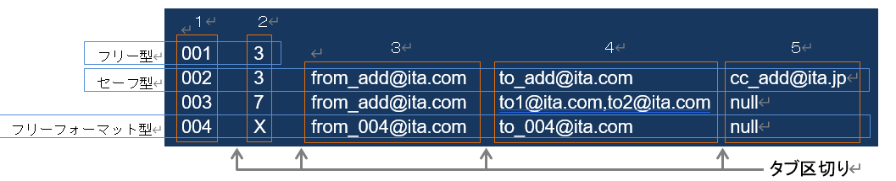

BackYardコンテンツ
------------------

| ここでは、ITA基本機能でのBackYardコンテンツについて説明します。
| BackYardはサーバー内で独立して動作する常駐プロセス化した機能です。Webブラウザ上で操作する
| Webコンテンツとは異なり、ユーザーはBackYardの存在を意識することはありません。
| 処理の開始・停止等の制御はコマンドラインで実行してください。

BackYard処理一覧
~~~~~~~~~~~~~~~~
| BackYardの処理の一覧を以下に記述します。

.. debug:ActiveDirectoryについての記述は削除？

.. table:: BackYard機能
   :align: left

   +---------+---------------------+-------------------------------+-----------------+
   | **No.** | **処理名称**        | **ファイル名**                | **備考**        |
   |         |                     |                               |                 |
   +=========+=====================+===============================+=================+
   | 1       | メール送信          | ky_mail\ :sup:`※1`            | 必要が無ければ\ |
   |         |                     |                               | 停止可          |
   +---------+---------------------+-------------------------------+-----------------+
   | 2       | ロール紐付\         | ky_std_checkc\                | 常駐            |
   |         | 確認＋クリーニング  | ondition-linklist\ :sup:`※1`  |                 |
   +---------+---------------------+-------------------------------+-----------------+
   | 3       | 投入オペレーション\ | ky_execinstance_dataauto\     | Cron起動        |
   |         | 確認＋クリーニング  | clean-workflow.sh\ :sup:`※2`  |                 |
   +---------+---------------------+-------------------------------+-----------------+
   | 4       | ファイル\           | ky_file_auto\                 | Cron起動        |
   |         | 確認＋クリーニング  | clean-workflow.sh\ :sup:`※3`  |                 |
   +---------+---------------------+-------------------------------+-----------------+
   | 5       | ActiveDirect\       | ky_acti\                      | 常駐            |
   |         | ory情報ミラーリング | vedirectory_roleuser_replica\ |                 |
   |         |                     | tion-workflow.php\ :sup:`※4`  |                 |
   |         |                     |                               |                 |
   +---------+---------------------+-------------------------------+-----------------+

.. note:: | ※1 ファイル配置ディレクトリは ~/ita-root/backyards/webdbcore
          | ※2、4 ファイル配置ディレクトリは ~/ita-root/backyards/ita-base
          | ※3 ファイル配置ディレクトリは ~/ita-root/backyards/common

BackYard処理説明
~~~~~~~~~~~~~~~~
| BackYardの処理の説明を以下に記述します。

メール送信
**********

| メール送信は、ユーザーが作成したメールのテンプレートに送信元、送信先アドレスや本文内の変数を動的に置換し、自動送信する処理です。
| メール送信はテンプレートリスト、テンプレート、送信依頼ファイルという3つのファイル（詳細後述）を参照し、実行の要否を判断しながら処理を行います。
| 送信パターンはフリー型、セーフ型、フリーフォーマット型の3パターンがあります。
| それぞれのパターンによる各ファイルの要不要、必要事項は次の表のとおりです。

.. table:: 送信タイプ別参照ファイルへの記載事項
   :align: left

   +-------------+--------------+-----------+-----------+--------+-------+----------+---------+-------+-----------+
   | **ファ\     | **テンプ\    | **テンプレートリスト**                 | **送信依頼ファイル**                   |
   | イル名**    | レート**     |                                        |                                        |
   |             |              |                                        |                                        |
   +-------------+--------------+-----------+-----------+--------+-------+----------+---------+-------+-----------+
   |             | ファイル中\  | テンプ\   | 置き換え\ | from,  | cc    | タイトル | from,   | cc    | 置き換え\ |
   |             | の項目       | レートID  | 文言数    | to     |       |          | to      |       | 文字列    |
   +-------------+--------------+-----------+-----------+--------+-------+----------+---------+-------+-----------+
   | 送信タイプ  | 位置         | 1列目     | 2列目     | 3列目  | 4列目 | 1行目    | 2,3行目 | 4行目 | 5行目\    |
   |             |              |           |           |        |       |          |         |       | 以降      |
   |             |              |           |           |        |       |          |         |       |           |
   +=============+==============+===========+===========+========+=======+==========+=========+=======+===========+
   | フリー型    | 必要         | 必須      | 数値      | 不要           | 必須     | 必須    | 任意  | 指定分の\ |
   |             |              |           |           |                |          |         |       | 文字列    |
   +-------------+              +           + （0以上） +--------+-------+          +---------+-------+           +
   | セーフ型    |              |           |           | 必須   | 任意  |          | 不要            |           |
   +-------------+--------------+           +-----------+        +       +          +                 +-----------+
   | フリー\     | 不要（※）    |           | X 固定    |        |       |          |                 | 不要      |
   | フォー\     |              |           |           |        |       |          |                 |           |
   | マット型    |              |           |           |        |       |          |                 |           |
   +-------------+--------------+-----------+-----------+--------+-------+----------+---------+-------+-----------+

.. tip:: | ※メール本文は送信依頼ファイルに記述します。

| 次に、各ファイルの説明とサンプルを提示します。

.. danger:: | 各ファイルは、\ **文字コード[UTF-8]／改行(LF)**\ で編集してください。

   .. _template_list:
#. | テンプレートリスト
   | - ファイル名 ： sysmail.list
   | - 配置ディレクトリ ： ~/ita-root/confs/backyardconfs/
   | メールテンプレートで使用する変数数や送信先アドレスなどをリストするファイルです。
   | このリストを元に送信処理が行われます。
   |
   .. figure:: ./management_console/image200.png
      :width: 5.84375in
      :align: center
      :alt: template_list example

      テンプレートリスト記述例

   .. table:: テンプレートリストの必須パラメータ一覧表
      :align: left

      +---------+-----------------+-----------+-----------------------------------------+
      | **No.** | **項目**        | **必須**  | **補足**                                |
      +=========+=================+===========+=========================================+
      | 1       | テンプレートID  | ○         | 001~999（000は予約済のため使用不可）    |
      +---------+-----------------+-----------+-----------------------------------------+
      | 2       | 置き換え文言数  | ○         | 可変文字列数。例）日付、人名など        |
      +---------+-----------------+-----------+-----------------------------------------+
      | 3       | 送信元\         | △         | 送信依頼ファイルに記述しない場合は必須  |
      |         | メールアドレス  |           |                                         |
      +---------+-----------------+-----------+-----------------------------------------+
      | 4       | 送信先\         | △         | 同上                                    |
      |         | メールアドレス  |           |                                         |
      +---------+-----------------+-----------+-----------------------------------------+
      | 5       | ccアドレス      | ×         | 不要の場合は「null」を指定              |
      +---------+-----------------+-----------+-----------------------------------------+
   .. note:: | 「4 送信先メールアドレス」を複数指定する場合はコンマ区切り
   .. _template:

#. | テンプレート
   | - ファイル名 　　　： sysmail_body_nnn.txt
   | - 配置ディレクトリ ： ~/ita-root/confs/backyardconfs/
   | メールの本体です。
   | ファイル名の[ nnn ]は「テンプレートID」を入れてください。
   | 例）
   | 　　○ sysmail_body_001.txt
   | 　　× sysmail_body_1.txt
   | メール本文と、可変部分があれば置換用の変数（%%001%% ～ %%999%%）を記述します。
   | 変数は、テンプレートリストファイルに指定した「置き換え文言数」分の連番にします。

   .. figure:: ./management_console/image201.png
      :width: 5.84375in
      :align: center
      :alt: template_list example

      テンプレート記述例 [OK]

   .. figure:: ./management_console/image202.png
      :width: 5.84375in
      :align: center
      :alt: template_list example

      テンプレート記述例 [NG]

#. | 送信依頼ファイル
   | - ファイル名 　　　： sysmail_nnn_任意の半角英数字.txt
   | - 配置ディレクトリ ： ~/ita-root/temp/ky_mail_queues/ky_sysmail_0_queue/
   | テンプレートに差し込む文字列を記載します。
   | ファイル名の[ nnn ]は「テンプレートID」を入れてください。
   | [ nnn ]以降はファイルが一意になるよう任意の半角文字列を入れてください。
   | 例） ファイル命名の例
   |  　　○ sysmail_001_20140813123025_123456789
   |  　　○ sysmail_001_a001.txt
   |  　　× sysmail_001\_
   |  　　× sysmail_001\_.txt
   | テンプレートリスト、テンプレートを用意後、このファイルを配置ディレクトリに置くことで、
   | メールが送信されます。
   |
   | メール送信の際、置き換え文字をテンプレート中の変数に差込みます。
   | 送信依頼ファイルは、メール送信後、送信状況によって以下のディレクトリに移動します。
   |  　　送信成功 → ~/ita-root/temp/ky_mail_queues/ky_sysmail_1_success
   |  　　送信失敗 → ~/ita-root/temp/ky_mail_queues/ky_sysmail_2_error
   | ■ 送信依頼ファイルフォーマット
   | 　送信依頼ファイルは、行ごとに意味が決まっています。
   | 　　1行目 ： メールタイトル
   | 　　2行目 ： 送信元メールアドレス
   | 　　3行目 ： 送信先メールアドレス（複数指定の場合はコンマで区切る）
   | 　　4行目 ： ccメールアドレス（不要の場合は空行）
   | 　　5行目以降 ： 置き換え文字列

   .. note:: -  | 2～4行目はフリー型のみ必要になります。
             -  | 5行目以降の\ **行数**\ が、テンプレートリストの置き換え文言数、
                | およびテンプレートの変数の数と同じでない場合、エラーになります。

   | 「:ref:`テンプレートリスト<template_list>`」「:ref:`テンプレート<template>`」を例に、送信依頼ファイル記述例を提示します。
   | 送信依頼ファイル記述例
   #. | **フリー型例**： テンプレートID = 001

      .. figure:: ./management_console/image203.png
         :width: 5.84375in
         :align: center
         :alt: template_list example
         
         sysmail_001_20160401_0001.txt 

      .. figure:: ./management_console/image204.png
         :width: 5.84375in
         :align: center
         :alt: template_list example

         送信されたメール ： 送信依頼ファイルから置換された箇所（赤字）
         テンプレートリストから置換されたか所（青字）

   #. | **セーフ型例**： テンプレートID = 002

      .. figure:: ./management_console/image205.png
         :width: 5.84375in
         :align: center
         :alt: template_list example
         
      .. note:: | メールアドレスはテンプレートリストファイルに指定

      .. figure:: ./management_console/image206.png
         :width: 5.84375in
         :align: center
         :alt: template_list example
         
         送信されたメール ： 送信依頼ファイルから置換されたか所（赤字）
         テンプレートリストから置換されたか所（青字）

   #. | **フリーフォーマット型**： テンプレートID = 004

      .. figure:: ./management_console/image207.png
         :width: 5.84375in
         :align: center
         :alt: template_list example

         sysmail_004_20160401_0001.txt

      .. figure:: ./management_console/image208.png
         :width: 5.84375in
         :align: center
         :alt: template_list example

         送信されたメール： テンプレートリストから置換されたか所（青字）

      .. figure:: ./management_console/image209.png
         :width: 5.84375in
         :align: center
         :alt: template_list example

         メール送信の動作イメージ

#. | **メール送信までの操作手順**

   | テンプレートID決定～送信までの手順を説明します。
   | ファイルのフォーマットや命名などは、「\ *①テンプレートリスト* ～ *③送信依頼ファイル*\ 」を参照してください。
   #. | テンプレートリストファイルの編集とテンプレートIDの決定
      | テンプレートリストファイルを編集で開き、テンプレートIDを決定します（重複しない番号）。
      | 行を追加し、1列目に決定したIDを記述します。
      | フリー型、セーフ型の場合で可変の文字列を利用したい場合、置換文字数分を2列目に記述します。
      | 送信モードにより、メールアドレスも記述します。

   #. | テンプレートファイル作成（フリーフォーマット型以外）
      | メール本文を記述します。
      | 可変部分がある場合、変数で記述します。

      .. tip:: | 可変部分がない場合、テンプレートファイルは不要です。

   #. | 送信依頼ファイル作成
   #. | 所定ディレクトリへファイル配置
      | -  テンプレートリスト ―~/ita-root/confs/backyardconfs/
      | -  テンプレート 　　　―~/ita-root/confs/backyardconfs/
      | -  送信依頼ファイル 　―~/ita-root/temp/ky_mail_queues/ky_sysmail_0_queue/

ロール紐付確認＋クリーニング
****************************

| ロール紐付リスト（ロール・ユーザ／ロール・メニュー）の内容を確認し、ロールとユーザー、
| ロールとメニューで無効な紐付け関係が存在したら、その情報を消去する処理です。
| 独立型の常駐プロセスとして動作します。

投入オペレーション確認＋クリーニング
************************************

| 「オペレーション削除管理」メニューの設定に基づいてデータの削除を行います。

ファイル確認＋クリーニング
**************************

| 「ファイル削除管理」メニューの設定に基づいてファイルの削除を行います。

運用操作
========

| ITAシステムに対する操作は、ユーザーによるブラウザ画面からの入力だけではなく、
| sshコンソールやFTPソフトを使ったシステム運用・保守による操作もあります。
| 運用・保守の操作対象は次のとおりです。
- | 2.1インストールの開始
- | 2.2オペレーション作業履歴の定期削除
- | 2.3ログレベルの変更
- | 2.4メンテナンス

インストールの開始
------------------

| インストール時の事後作業については、別マニュアル「インストールマニュアル」の「3項 動作確認」をご参照ください。

オペレーション作業履歴の定期削除
--------------------------------

| 投入オペレーション一覧に登録されているオペレーションで、実施日が設定されているオペレーションに紐づく作業履歴は、指定した保存期間を過ぎると削除されます。（廃止扱いとされます。）
| 作業履歴には以下のものがあります。
- | ITA  　　　　　　　　　　　　　― Symphonyで管理している情報
- | 各オーケストレータのドライバー ― Ansible driverで管理している情報

| 保存期間は以下のファイルによって指定できます。
- | ITA
  | ~/ita-root/confs/backyardconfs/ita_base/keep_day_length.txt
- | Ansible
  | ~/ita-root/confs/backyardconfs/ansible_driver/keep_day_length.txt
- | ドライバー共通
  | ~/ita-root/confs/backyardconfs/ita_base/dataautoclean_conf.txt

| この機能は、Cronに登録されている日時処理によって作動します。
| Cronには、コマンド｛　crontab–e　｝により以下の行が登録されており、実行時間を指定することができます。

ログレベルの変更
----------------

| ITAシステム 独立型プロセスのログレベルの変更方法は次のとおりです。
|
■ 対象ファイル
  | ~/ita-root/backyards/webdbcore/ky_mail
  | ~/ita-root/backyards/webdbcore/ky_std_checkcondition-linklist
  | ~/ita-root/backyards/ita_base/ky_std_symphony-dataautoclean.sh
  |  ~/ita-root/backyardconfs/commn/ky_execinstance_dataautoclean-workflow.sh

- 【NORMALレベル】
  | 「LOG_LEVEL='NORMAL'」を有効にします。

  .. code-block:: bash

   #   ログ出力レベル
   #   DEBUG ：解析レベルでログ出力
   #   NORMAL：クリティカルな場合のみログ出力
   #LOG_LEVEL='DEBUG'
   LOG_LEVEL='NORMAL'

- 【DEBUGレベル】
  | 「LOG_LEVEL='DEBUG'」を有効にします。

  .. code-block:: bash

   # ログ出力レベル
   #  DEBUG ：解析レベルでログ出力
   #  NORMAL：クリティカルな場合のみログ出力
   LOG_LEVEL='DEBUG'
   #LOG_LEVEL='NORMAL'

.. tip:: | ログレベル変更は、\ **プロセス再起動（Restart）後に有効になります**\ 。（「2.4メンテナンス」参照）

メンテナンス
-------------

ITAシステム 独立型プロセスの起動/停止/再起動
~~~~~~~~~~~~~~~~~~~~~~~~~~~~~~~~~~~~~~~~~~~~

| メール送信機能を例示します
| ロール紐付確認 ＋ クリーニングの場合は、「ky_mail」を「ky_std_checkcondition-linklist」に読み替えてください。

プロセス起動
************
.. code-block:: bash

   $ service ky_mail start

プロセス停止
************
.. code-block:: bash

  $ service ky_mail stop

プロセス再起動
**************
.. code-block:: bash

  $ service ky_mail restart

Appendix
========
トラブルシューティング
----------------------

.. debug:QA-1がPHP、QA-5, 6, 7, 10, 11がAD連携関連

.. table::
   :align: left

   +---------+-------------------------------------------------------------------+
   | **No.** | **内容**                                                          |
   |         |                                                                   |
   |         |                                                                   |
   +=========+===================================================================+
   | Q-1     | 表示の動作が重くなる                                              |
   |         | 大型サイズのファイルダウンロードに時間かかりすぎる                |
   |         | 処理がタイムアウトになる                                          |
   |         | PHPスクリプトが強制終了する                                       |
   +---------+-------------------------------------------------------------------+
   | A-1     | PHPのメモリ設定が足りないことが考えられます。                     |
   |         | PHP設定ファイル「php.ini」内の次のパラメ ータの値を\              |
   |         | 見直して、割り当て可能な最大値を設定してください。                |
   |         | 　・memory_limit PHPに割り当て可能なメモリ                        |
   |         |                                                                   |
   |         | ファイルのアップロードで同様な事象も発生する可能性が\             |
   |         | あるため、次のパラメータ値の見直しもあわせて行ってください。      |
   |         | 　・post_max_size postデータに許可される最大サイズ                |
   |         | 　・upload_max_filesize ファイルあたりの最大サイズ                |
   +---------+-------------------------------------------------------------------+
   | Q-2     | 「ita-root」（ITAシステムの\                                      |
   |         | ルートディレクトリ）の作成の注意点を教えてください。              |
   +---------+-------------------------------------------------------------------+
   | A-2     | ディレクトリ位置は、「絶対パス」と、ブラウザで\                   |
   |         | 指定する「ファイル名」の2つを合わせて\                            |
   |         | 1,024文字以内で収まるように配慮してください。                     |
   |         |                                                                   |
   |         | 全体のパス名が長い場合、サーバーの動作に\                         |
   |         | 悪影響（遅い／フリーズ）を与える可能性があります。                |
   +---------+-------------------------------------------------------------------+
   | Q-3     | ITAシステムではWeb画面上の「表示フィルター」\                     |
   |         | サブメニューでキーワード検索や曖昧検索が可能ですが、\             |
   |         | RDBMSが\ **Oracleの場合**\ 、ワイルドカード\                      |
   |         | 記号（たとえば”*”、や”#”）\ **のみを指定**\ する\                 |
   |         | 曖昧検索は期待とおりの結果が得られないことがあります。            |
   +---------+-------------------------------------------------------------------+
   | A-3     | Oracleで記号の曖昧検索を行いたい場合、\                           |
   |         | 記号の前後に文字列をあわせて入力・検索を行ってください。          |
   |         | （例） × ： 「*」                                                 |
   |         | 　　　 ○ ： 「あ*」、「い*は」など                                |
   +---------+-------------------------------------------------------------------+
   | Q-4     | アカウントロックされてログイン出来ない場合                        |
   +---------+-------------------------------------------------------------------+
   | A-4     | ログインを何回か失敗するとアカウントがロックされます。            |
   |         | ロックがかかる失敗回数は「システム設定」内の\                     |
   |         | パラメータの設定によって変更します。                              |
   |         | 　・PWL_THRESHOLD パスワード誤り閾値(回数)                        |
   |         |                                                                   |
   |         | またアカウントロックの継続期間\                                   |
   |         | も「システム設定」内のパラメータの設定によって変更可能です。      |
   |         | 　・PWL_EXPIRY アカウントロック継続期間（秒）                     |
   |         |                                                                   |
   |         | ※パラメータ「PWL_EXPIRY」の値を\                                  |
   |         | ゼロ(０)にすると、ログインを何回失敗してもロックは掛かりません。  |
   +---------+-------------------------------------------------------------------+
   | Q-5     | AD連携機能で、\                                                   |
   |         | 外部認証設定ファイルに複数のDomainControllerの設定する時に、\     |
   |         | 異なるドメインのDomainControllerを設定できますか。                |
   +---------+-------------------------------------------------------------------+
   | A-5     | 設定できません。                                                  |
   |         |                                                                   |
   |         | ITAではAD連携時に\                                                |
   |         | 内部処理としてADのドメイン一意キーであるSIDを取得しています。     |
   |         |                                                                   |
   |         | 異なるドメイン間ではSIDが\                                        |
   |         | 重複する可能性がある為、異なるドメインのDomainContorollerを\      |
   |         | 設定した場合にはITA側にAD情報を同期できなくなります。             |
   +---------+-------------------------------------------------------------------+
   | Q-6     | 一度ITAと連携したADドメインを再構築したところ、\                  |
   |         | AD連携ができなくなりました。                                      |
   +---------+-------------------------------------------------------------------+
   | A-6     | 再構築した場合（バックアップした場合も含む）は、\                 |
   |         | 内部処理で取得したSIDがITA上のDB内で重複する場合があります。      |
   |         |                                                                   |
   |         | 重複が発生した時点で、AD連携機能の\                               |
   |         | 処理が正しく行われなくなります。                                  |
   |         |                                                                   |
   |         | 一度ITAと連携したADドメインを再構築後に再度ITAと\                 |
   |         | 連携した場合は、お手数ですがITAそのものも再構築してください。     |
   +---------+-------------------------------------------------------------------+
   | Q-7     | 一度AD連携を有効にしたものの、\                                   |
   |         | 不要になったので無効にしました。しかし、ミラーリング\             |
   |         | 処理でITA上に登録された\                                          |
   |         | ユーザー・レコードならびにロール・レコードが廃止されません。      |
   +---------+-------------------------------------------------------------------+
   | A-7     | 仕様となります。                                                  |
   |         |                                                                   |
   |         | お手数ですが、画面上から手動で廃止して\                           |
   |         | 頂くか、ファイルアップロード機能を利用頂いて\                     |
   |         | 一括廃止するなどして下さい。                                      |
   +---------+-------------------------------------------------------------------+
   | Q-8     | ITA上にミラーリングされているADユーザーなのにも\                  |
   |         | 関わらず、ITAにログインできないユーザーがいます。                 |
   +---------+-------------------------------------------------------------------+
   | A-8     | ITA上にミラーリングされている\                                    |
   |         | ADユーザーだったとしても、外部認証設定ファイルに記述された\       |
   |         | 内容で以下の①と②に相違があり且つ①で\                              |
   |         | 指定された範囲外のユーザーはログインできません。                  |
   |         | ①『DomainController_1（DomainController_2）\                      |
   |         | （DomainController_3）』の【basedn】                              |
   |         | ② 『Replication_Connect』の【basedn】                             |
   |         |                                                                   |
   |         | 詳細は、「システム構成／環境構築\                                 |
   |         | ガイド_ActiveDirectory連携編」をご参照ください）                  |
   +---------+-------------------------------------------------------------------+
   | Q-9     | OUで探索範囲を指定する時に、複数の\                               |
   |         | OUを指定することはできますか。                                    |
   +---------+-------------------------------------------------------------------+
   | A-9     | できません。                                                      |
   |         |                                                                   |
   |         | 複数のOUを指定されたい場合には、それら\                           |
   |         | 上位となるレイヤーにOUを更に作成して頂き、\                       |
   |         | その上位のOUを探索範囲として指定してください。                    |
   +---------+-------------------------------------------------------------------+
   | Q-10    | Azure ActiveDirectory（以下、Azure \                              |
   |         | ADと言います）に対してITAのAD連携機能を使うことはできますか。     |
   +---------+-------------------------------------------------------------------+
   | A-10    | できません。                                                      |
   +---------+-------------------------------------------------------------------+
   | Q-11    | 「Azure AD Connect」でAzure \                                     |
   |         | ADと同期しているADに対してITAのAD連携機能を\                      |
   |         | 使っている時、AzureADで作成および編集した\                        |
   |         | グループのグループ名がITA上のロール名に反映されない時があります。 |
   +---------+-------------------------------------------------------------------+
   | A-11    | AD連携機能において取得する\                                       |
   |         | グループ名称は、グループのsAMAccountNameです。                    |
   |         |                                                                   |
   |         | ADの製品仕様として、AzureAD上で作成\                              |
   |         | および編集したグループ名が必ずしもADの\                           |
   |         | sAMAccountNameに反映されるわけではない為、反映されなかった\       |
   |         | 場合にはITA上のロール名にも反映されません。                       |
   |         |                                                                   |
   |         | ※ADの詳細な仕様については\                                        |
   |         | 仕様についてはMicrosoft社のサポート\                              |
   |         | および公式ドキュメント等をご参照ください。                        |
   +---------+-------------------------------------------------------------------+

.. |ref1| image:: ./management_console/image9.png
   :width: 5.90051in
   :height: 1.59347in

.. |image1| image:: ./management_console/image3.png
   :width: 4.33071in
   :height: 1.70309in
.. |image2| image:: ./management_console/image4.png
   :width: 4.33071in
   :height: 1.44875in
.. |image3| image:: ./management_console/image39.png
   :width: 2.03125in
   :height: 2.29468in
.. |image4| image:: ./management_console/image40.png
   :width: 2.46957in
   :height: 2.32088in
.. |image5| image:: ./management_console/image41.png
   :width: 4.01111in
   :height: 1.58125in
.. |image6| image:: ./management_console/image42.png
   :width: 1.92172in
   :height: 0.69318in
.. |image7| image:: ./management_console/image55.png
   :width: 6.37389in
   :height: 2.84691in
.. |image8| image:: ./management_console/image56.png
   :width: 6.29921in
   :height: 2.59227in
.. |image9| image:: ./management_console/image68.png
   :width: 5.66049in
   :height: 2.98693in
.. |image10| image:: ./management_console/image75.png
   :width: 6.04052in
   :height: 3.19361in
.. |image11| image:: ./management_console/image76.png
   :width: 6.2162in
   :height: 1.2in
.. |image12| image:: ./management_console/image84.png
   :width: 2.16185in
   :height: 1.36408in
.. |image13| image:: ./management_console/image85.png
   :width: 2.19826in
   :height: 1.35278in
.. |image14| image:: ./management_console/image86.png
   :width: 2.25335in
   :height: 0.99057in
.. |image15| image:: ./management_console/image87.png
   :width: 1.67925in
   :height: 1.06655in
.. |image16| image:: ./management_console/image88.png
   :width: 1.01734in
   :height: 1.37478in
.. |image17| image:: ./management_console/image89.png
   :width: 0.99776in
   :height: 1.39547in

