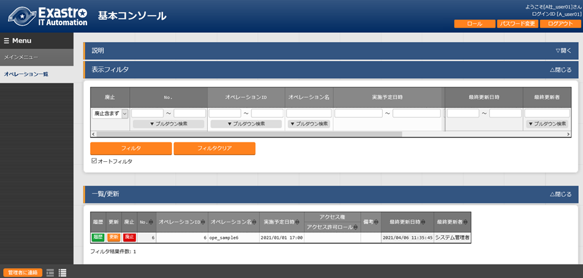
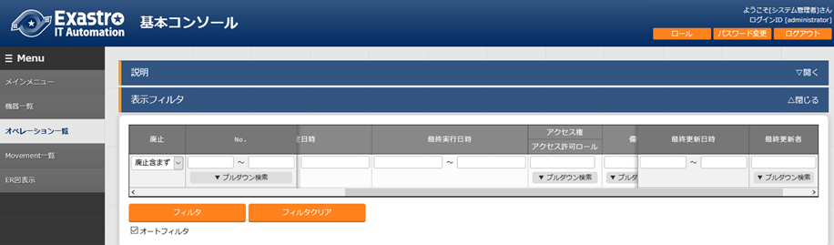
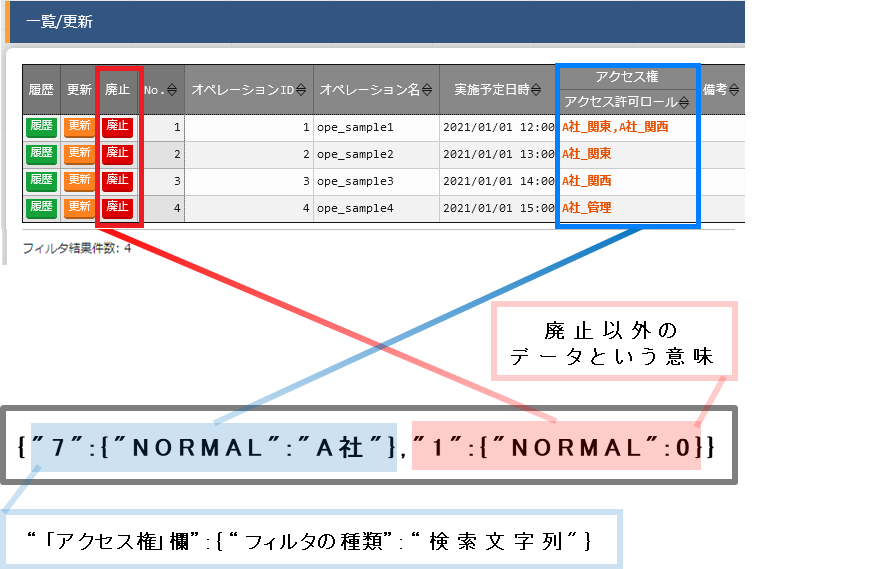

.. image:: ./rbac/image1.pngmedia
   :width: 3.35069in
   :height: 0.79236in

ITA_利用手順マニュアル

データレコード毎のロールベースアクセス制御

*－*\ 第1.9版\ *－*

Copyright © NEC Corporation 2021. All rights reserved.

免責事項

本書の内容はすべて日本電気株式会社が所有する著作権に保護されています。

本書の内容の一部または全部を無断で転載および複写することは禁止されています。

本書の内容は将来予告なしに変更することがあります。

日本電気株式会社は、本書の技術的もしくは編集上の間違い、欠落について、一切責任を負いません。

日本電気株式会社は、本書の内容に関し、その正確性、有用性、確実性その他いかなる保証もいたしません。

商標

-  LinuxはLinus
      Torvalds氏の米国およびその他の国における登録商標または商標です。

-  Red Hatは、Red Hat,
      Inc.の米国およびその他の国における登録商標または商標です。

-  Apache、Apache Tomcat、Tomcatは、Apache Software
      Foundationの登録商標または商標です。

-  Ansibleは、Red Hat, Inc.の登録商標または商標です。

その他、本書に記載のシステム名、会社名、製品名は、各社の登録商標もしくは商標です。

なお、® マーク、TMマークは本書に明記しておりません。

※本書では「Exastro IT Automation」を「ITA」として記載します。

**目次­­**

`はじめに <#はじめに>`__ `3 <#はじめに>`__

`1
データレコード毎のロールベースアクセス制御（RBAC）の概要 <#データレコード毎のロールベースアクセス制御rbacの概要>`__
`4 <#データレコード毎のロールベースアクセス制御rbacの概要>`__

`2 ロールベースアクセス制御
(RBAC)の主要機能 <#ロールベースアクセス制御-rbacの主要機能>`__
`5 <#ロールベースアクセス制御-rbacの主要機能>`__

`3 ユーザ毎のロール紐付 <#ユーザ毎のロール紐付>`__
`6 <#ユーザ毎のロール紐付>`__

`3.1
アクセスを制御するロールを設計しロール管理に登録 <#アクセスを制御するロールを設計しロール管理に登録>`__
`8 <#アクセスを制御するロールを設計しロール管理に登録>`__

`3.2
ロールとメニューの紐付をロール・メニュー紐付管理に登録 <#ロールとメニューの紐付をロールメニュー紐付管理に登録>`__
`10 <#ロールとメニューの紐付をロールメニュー紐付管理に登録>`__

`3.3
ユーザ（アカウント）をユーザ管理に登録 <#ユーザアカウントをユーザ管理に登録>`__
`11 <#ユーザアカウントをユーザ管理に登録>`__

`3.4
ユーザとロールの紐付をロール・ユーザ管理に登録 <#ユーザとロールの紐付をロールユーザ管理に登録>`__
`12 <#ユーザとロールの紐付をロールユーザ管理に登録>`__

`4 データ毎のロール紐付 <#データ毎のロール紐付>`__
`13 <#データ毎のロール紐付>`__

`4.1 新規データ <#新規データ>`__ `17 <#新規データ>`__

`4.2 データ更新 <#データ更新>`__ `20 <#データ更新>`__

`4.2.1 廃止したロールの扱い <#_Toc65672892>`__ `20 <#_Toc65672892>`__

`4.2.2
ユーザとロールの紐付を廃止したロールの扱い <#ユーザとロールの紐付を廃止したロールの扱い>`__
`22 <#ユーザとロールの紐付を廃止したロールの扱い>`__

`4.2.3
特定のデータを複数のロールで共有した場合の扱い <#特定のデータを複数のロールで共有した場合の扱い>`__
`23 <#特定のデータを複数のロールで共有した場合の扱い>`__

`4.3 データ廃止 <#データ廃止>`__ `25 <#データ廃止>`__

`4.4 データ復活 <#データ復活>`__ `25 <#データ復活>`__

`4.5 Excelからのアップロード <#excelからのアップロード>`__
`25 <#excelからのアップロード>`__

`4.6 RestAPIからのアップロード <#restapiからのアップロード>`__
`29 <#restapiからのアップロード>`__

`4.6.1 EDIT（X-Command） <#_Toc65672903>`__ `29 <#_Toc65672903>`__

`5 紐付けロールによる表示制御 <#紐付けロールによる表示制御>`__
`30 <#紐付けロールによる表示制御>`__

`5.1 一覧表示 <#一覧表示>`__ `31 <#一覧表示>`__

`5.1.1 各ユーザでのログイン結果 <#各ユーザでのログイン結果>`__
`32 <#各ユーザでのログイン結果>`__

`5.2 変更履歴 <#変更履歴>`__ `41 <#変更履歴>`__

`5.3 表示フィルタ <#表示フィルタ>`__ `46 <#表示フィルタ>`__

`5.4 RestAPI表示フィルタ <#_Toc65672915>`__ `52 <#_Toc65672915>`__

はじめに
========

本書では、データレコード毎のロールベースアクセス制御（RBAC）の機能および操作方法について説明します。

データレコード毎のロールベースアクセス制御（RBAC）の概要
========================================================

ユーザ毎にアクセスを許可するロールを付与し、データレコード毎にロールを付与することでデータレコード毎のアクセスを制御できます。

上記機能を利用しない場合、デフォルトアクセス権およびアクセス許可ロールは空白のままとして下さい。

本書では、「データレコード毎のロールベースアクセス制御（RBAC）」を以降「ロールベースアクセス制御（RBAC）」と表記します。

ロールベースアクセス制御 (RBAC)の主要機能
=========================================

ロールベースアクセス制御
(RBAC)の主要機能は次のカテゴリーに分類されます。

-  | Web
   | Webコンテンツ。ブラウザで提供されるメニュー作成機能を使用できる画面。

-  | BackYard
   | Webコンテンツとは独立してサーバ上で動作する常駐プロセス。

ユーザ毎のロール紐付
====================

ロールベースアクセス制御
(RBAC)を行うには、ユーザ毎にアクセスを許可するロールを設定します。

例として「表3-1」の登録例をもとに以降（章立て3.1～3.4）の手順にて説明します。

表　3- 1 章立てと登録例

+----+--------------------------+-------------------------------------+
| ** | **「管理コンソ           | **登録例**                          |
| 章 | ール」メニューグループ** |                                     |
| ・ |                          |                                     |
| 節 |                          |                                     |
| ** |                          |                                     |
+====+==========================+=====================================+
| 3  | 「ロール管理」メニュー   | +--------------------------------+  |
| .1 |                          | | **ロール**                     |  |
|    |                          | +================================+  |
|    |                          | | Role_A                         |  |
|    |                          | +--------------------------------+  |
|    |                          | | Role_B                         |  |
|    |                          | +--------------------------------+  |
+----+--------------------------+-------------------------------------+
| 3  | 「ロール・メ             | +----------+----------+----------+  |
| .2 | ニュー紐付管理」メニュー | | **       | **メ     | **紐付** |  |
|    |                          | | ロール** | ニュー** |          |  |
|    |                          | +==========+==========+==========+  |
|    |                          | | Role_A   | Menu_A   | メン     |  |
|    |                          | |          |          | テナンス |  |
|    |                          | +----------+----------+----------+  |
|    |                          | | Role_B   | Menu_A   | メン     |  |
|    |                          | |          |          | テナンス |  |
|    |                          | +----------+----------+----------+  |
|    |                          | | Role_B   | Menu_B   | メン     |  |
|    |                          | |          |          | テナンス |  |
|    |                          | +----------+----------+----------+  |
+----+--------------------------+-------------------------------------+
| 3  | 「ユーザ管理」メニュー   | +--------------------------------+  |
| .3 |                          | | **ユーザ**                     |  |
|    |                          | +================================+  |
|    |                          | | User_A                         |  |
|    |                          | +--------------------------------+  |
|    |                          | | User_B                         |  |
|    |                          | +--------------------------------+  |
+----+--------------------------+-------------------------------------+
| 3  | 「ロール・               | +--------+--------+-------------+   |
| .4 | ユーザ紐付管理」メニュー | | **ロ   | **ユ   | **デ        |   |
|    |                          | | ール** | ーザ** | フォルトア  |   |
|    |                          | |        |        | クセス権**  |   |
|    |                          | +========+========+=============+   |
|    |                          | | Role_A | User_A | ●           |   |
|    |                          | +--------+--------+-------------+   |
|    |                          | | Role_B | User_B | ●           |   |
|    |                          | +--------+--------+-------------+   |
+----+--------------------------+-------------------------------------+
| -  | 「メニュー管理」メニュー | +--------------------------------+  |
|    |                          | | **メニュー**                   |  |
| ※  |                          | +================================+  |
|    |                          | | Menu_A                         |  |
|    |                          | +--------------------------------+  |
|    |                          | | Menu_B                         |  |
|    |                          | +--------------------------------+  |
+----+--------------------------+-------------------------------------+

※メニューの作成について、詳細は「利用手順マニュアル
メニュー作成機能」を参照ください。

上記の「表 3-1」を図化すると以下のような関係になります。

.. image:: ./rbac/image2.png
   :width: 6.69236in
   :height: 3.96528in

図　3- 1　全体図

上記における「パターン：d」の場合、以下のダイアログが表示されます。

.. image:: ./rbac/image3.png
   :width: 4.89652in
   :height: 1.97944in

**図 3-2 表示権限が無い場合に表示されるダイアログ**

例えば、ユーザ「User_A」が紐付けの設定がされていないメニュー「Menu_B」にアクセスを試みた場合、メニューに対し権限がないためトップページに遷移します。

アクセスを制御するロールを設計しロール管理に登録
------------------------------------------------

   アクセスを制御するロールを設計し
   「管理コンソール」メニューグループ>「ロール管理」メニュー
   より登録します。

   .. image:: ./rbac/image4.png
      :width: 6.5739in
      :height: 1.66014in

**図 3.1-1 「管理コンソール」メニューグループ>「ロール管理」メニュー**

ロールには2つの役割があります。

#. メニューへのアクセス権

..

   各メニューへのアクセス権は
   「管理コンソール」メニューグループ>「ロール・メニュー紐付管理」メニュー
   より登録します。

   .. image:: ./rbac/image5.png
      :width: 5.70866in
      :height: 1.33646in

**図 3.1-1
「管理コンソール」メニューグループ>「ロール・メニュー紐付管理」メニュー**

2. データレコード毎に付与するロール

..

   ユーザ毎に各データに付与するロールは
   「管理コンソール」メニューグループ>「ロール・ユーザ紐付管理」メニュー
   より登録します。

   .. image:: ./rbac/image6.png
      :width: 5.70866in
      :height: 1.3565in

**図 3.1-2
「管理コンソール」メニューグループ>「ロール・ユーザ紐付管理」メニュー**

   ITAをインストールすると、デフォルトの設定として以下のロールが登録されますが、更新等の操作は行わないでください。

.. image:: ./rbac/image7.png
   :width: 6.33772in
   :height: 0.7189in

**図　3.1-3　「管理コンソール」メニューグループ>「ロール管理」メニュー**

   また、本書ではロールの2つの役割のうち、「②データレコード毎に付与するロール」について説明していきます。（
   「図　3- 1　全体図」における、「パターン：a、b、c」が該当します。）

   「①メニューへのアクセス権」については「利用手順マニュアル_管理コンソール.」を参照してください。（
   「図　3- 1　全体図」における、「パターン：d」が該当します。）

ロールとメニューの紐付をロール・メニュー紐付管理に登録
------------------------------------------------------

   各ロールとメニューの紐付を
   「管理コンソール」メニューグループ>「ロール・メニュー紐付管理」メニュー
   より登録します。

   ロールを新規に登録した場合、「ロール・メニュー紐付管理」メニューで、ロールと各メニューへの紐付けを行う必要があります。

   .. image:: ./rbac/image8.png
      :width: 6.10236in
      :height: 1.49299in

**図　3.1-4　「管理コンソール」メニューグループ>「ロール・メニュー紐付管理」メニュー**

   ITAをインストールすると、デフォルトの設定として「システム管理者（ロール）」で各メニューへの紐付が登録されますが、更新等の操作はしないでください。

.. image:: ./rbac/image9.png
   :width: 6.09107in
   :height: 1.07787in

**図 3.2-5
「管理コンソール」メニューグループ>「ロール・メニュー紐付管理」メニュー**

   「Menu_A」「Menu_B」が作成済みであることを前提とします。

   メニューの作成方法については「利用手順マニュアル
   メニュー作成機能」を参照してください。

   .. image:: ./rbac/image10.png
      :width: 6.1072in
      :height: 2.54022in

**図 3.2-6 「入力用」メニューグループ>「Menu_A」メニュー**

ユーザ（アカウント）をユーザ管理に登録
--------------------------------------

   ユーザ（アカウント）を　「管理コンソール」メニューグループ>「ユーザ管理」メニュー
   より登録します。

   .. image:: ./rbac/image11.png
      :width: 5.89263in
      :height: 1.45831in

**図 3.3-1 「管理コンソール」メニューグループ>「ユーザ管理」メニュー**

   ITAをインストールすると、デフォルトの設定として以下のユーザ（アカウント）が登録されますが、更新等の操作はしないでください。

   .. image:: ./rbac/image12.png
      :width: 6.17112in
      :height: 0.58436in

**図 3.3-2 「管理コンソール」メニューグループ>「ユーザ管理」メニュー**

ユーザとロールの紐付をロール・ユーザ管理に登録
----------------------------------------------

   ユーザとロールの紐付を　「管理コンソール」メニューグループ>「ロール・ユーザ紐付管理」メニュー
   より登録します。

   新規データ登録時、データに付与するデフォルトのロールとして指定する場合、「デフォルトアクセス権」欄で設定を実施します。

   「デフォルトアクセス権」欄で「●」を設定することにより、新規データを登録する時のデフォルトに設定されるロール(アクセス許可ロール）となります。

   .. image:: ./rbac/image13.png
      :width: 6.10236in
      :height: 1.30487in

**図 3.4-1
「管理コンソール」メニューグループ>「ロール・ユーザ紐付管理」メニュー**

   ロールベースアクセス制御（RBAC）を導入しない場合、「デフォルトアクセス権」欄は空白のままとしてください。

   ITAをインストールすると、デフォルトで以下のユーザ・ロール紐付が登録されますが、更新等の操作はしないでください。

   .. image:: ./rbac/image14.png
      :width: 6.36628in
      :height: 0.61156in

**図 3.4-2
「管理コンソール」メニューグループ>「ロール・ユーザ紐付管理」メニュー**

データ毎のロール紐付
====================

以降の説明では、以下の「表 4-1」が設定されていることを前提とします。

表　4- 1 メニューと登録例

+---+--------------------------+---------------------------------------+
| * | **メニュー**             | **登録例**                            |
| * |                          |                                       |
| N |                          |                                       |
| o |                          |                                       |
| . |                          |                                       |
| * |                          |                                       |
| * |                          |                                       |
+===+==========================+=======================================+
| * | 「管理コンソ             | システム管理者、A社_管理、A社_関東、A |
| * | ール」メニューグループ>  | 社_関西、B社_管理、B社_関東、B社_関西 |
| 1 |                          |                                       |
| * | 「ロール管理」メニュー   |                                       |
| * |                          |                                       |
+---+--------------------------+---------------------------------------+
| * | 「管理コンソ             | +----------------+----------------+   |
| * | ール」メニューグループ>  | | **ログインID** | **ユーザ名**   |   |
| 2 |                          | +================+================+   |
| * | 「ユーザ管理」メニュー   | | administrator  | システム管理者 |   |
| * |                          | +----------------+----------------+   |
|   |                          | | A_admin        | A社_admin      |   |
|   |                          | +----------------+----------------+   |
|   |                          | | A_user01       | A社_user01     |   |
|   |                          | +----------------+----------------+   |
|   |                          | | A_user02       | A社_user02     |   |
|   |                          | +----------------+----------------+   |
|   |                          | | A_user03       | A社_user03     |   |
|   |                          | +----------------+----------------+   |
|   |                          | | B_admin        | B社_admin      |   |
|   |                          | +----------------+----------------+   |
|   |                          | | B_user01       | B社_user01     |   |
|   |                          | +----------------+----------------+   |
|   |                          | | B_user02       | B社_user02     |   |
|   |                          | +----------------+----------------+   |
|   |                          | | B_user03       | B社_user03     |   |
|   |                          | +----------------+----------------+   |
+---+--------------------------+---------------------------------------+
| * | 「管理コンソ             | +----------+----------------------+   |
| * | ール」メニューグループ>  | | **       | **ユーザ名**         |   |
| 3 |                          | | ロール** |                      |   |
| * | 「ロール・               | +==========+======================+   |
| * | ユーザ紐付管理」メニュー | | システ   | システム管理者       |   |
|   |                          | | ム管理者 |                      |   |
|   |                          | +----------+----------------------+   |
|   |                          | | A社_管理 | システム             |   |
|   |                          | |          | 管理者、A社_admin(●) |   |
|   |                          | +----------+----------------------+   |
|   |                          | | A社_関東 | システム             |   |
|   |                          | |          | 管理者、A社_admin、  |   |
|   |                          | |          |                      |   |
|   |                          | |          | A社_u                |   |
|   |                          | |          | ser01(●)、A社_user03 |   |
|   |                          | +----------+----------------------+   |
|   |                          | | A社_関西 | システム             |   |
|   |                          | |          | 管理者、A社_admin、  |   |
|   |                          | |          |                      |   |
|   |                          | |          | A社_u                |   |
|   |                          | |          | ser02(●)、A社_user03 |   |
|   |                          | +----------+----------------------+   |
|   |                          | | B社_管理 | システム             |   |
|   |                          | |          | 管理者、B社_admin(●) |   |
|   |                          | +----------+----------------------+   |
|   |                          | | B社_関東 | システム             |   |
|   |                          | |          | 管理者、B社_admin、  |   |
|   |                          | |          |                      |   |
|   |                          | |          | B社_user             |   |
|   |                          | |          | 01(●)、B社_user03(●) |   |
|   |                          | +----------+----------------------+   |
|   |                          | | B社_関西 | システム             |   |
|   |                          | |          | 管理者、B社_admin、  |   |
|   |                          | |          |                      |   |
|   |                          | |          | B社_user             |   |
|   |                          | |          | 02(●)、B社_user03(●) |   |
|   |                          | +----------+----------------------+   |
|   |                          |                                       |
|   |                          | ●…デフォルトアクセス権                |
+---+--------------------------+---------------------------------------+
| * | 「管理コンソ             | 「基本コンソール」メニューグループ>   |
| * | ール」メニューグループ>  |                                       |
| 4 |                          | 「オペレーション一覧」メニュー        |
| * | 「メニュー管理」メニュー |                                       |
| * |                          |                                       |
+---+--------------------------+---------------------------------------+
|   | 「管理コンソ             | +----------------+----------------+   |
|   | ール」メニューグループ>  | | **ロール**     | **メニュー**   |   |
|   |                          | +================+================+   |
|   | 「ロール・メ             | | システ         | 「基本コン     |   |
|   | ニュー紐付管理」メニュー | | ム管理者、A社  | ソール」メニュ |   |
|   |                          | | _管理、A社_関  | ーグループ>「  |   |
|   |                          | | 東、A社_関西、 | オペレーション |   |
|   |                          | | B社_管理、B社_ | 一覧」メニュー |   |
|   |                          | | 関東、B社_関西 |                |   |
|   |                          | +----------------+----------------+   |
+---+--------------------------+---------------------------------------+

1. 「表　4- 1」の登録例を反映した「ロール管理」メニュー

.. image:: ./rbac/image15.png
   :width: 6.10236in
   :height: 2.72084in

**図 4-1 「管理コンソール」メニューグループ>「ロール管理」メニュー**

1. 

2. 「表　4- 1」の登録例を反映した「ユーザ管理」メニュー

.. image:: ./rbac/image16.png
   :width: 6.10236in
   :height: 2.66595in

**図 4-2 「管理コンソール」メニューグループ>「ユーザ管理」メニュー**

1. 

2. 

3. 「表　4- 1」の登録例を反映した「ロール・ユーザ紐付管理」メニュー

..

   .. image:: ./rbac/image17.png
      :width: 5.70823in
      :height: 4.01711in

**図 4-3
「管理コンソール」メニューグループ>「ロール・ユーザ紐付管理」メニュー**

表　4- 2　「ロール・ユーザ紐付管理」の設定値一覧

+------------------+------+------+------+------+------+------+------+
| **ロール名称　** | **   | **A  | **A  | **A  | **B  | **B  | **B  |
|                  | シス | 社\_ | 社\_ | 社\_ | 社\_ | 社\_ | 社\_ |
|                  | テム | 管   | 関   | 関   | 管   | 関   | 関   |
|                  | 管理 | 理** | 東** | 西** | 理** | 東** | 西** |
|                  | 者** |      |      |      |      |      |      |
+------------------+------+------+------+------+------+------+------+
| **               | 〇   | 〇   | 〇   | 〇   | 〇   | 〇   | 〇   |
| システム管理者** |      |      |      |      |      |      |      |
|                  |      |      |      |      |      |      |      |
| （               |      |      |      |      |      |      |      |
| administrator）  |      |      |      |      |      |      |      |
+------------------+------+------+------+------+------+------+------+
| **A社_admi       |      | ●    | 〇   | 〇   |      |      |      |
| n**\ （A_admin） |      |      |      |      |      |      |      |
+------------------+------+------+------+------+------+------+------+
| **A社_user01     |      |      | ●    |      |      |      |      |
| **\ （A_user01） |      |      |      |      |      |      |      |
+------------------+------+------+------+------+------+------+------+
| **A社_user02     |      |      |      | ●    |      |      |      |
| **\ （A_user02） |      |      |      |      |      |      |      |
+------------------+------+------+------+------+------+------+------+
| **A社_user03     |      |      | 〇   | 〇   |      |      |      |
| **\ （A_user03） |      |      |      |      |      |      |      |
+------------------+------+------+------+------+------+------+------+
| **B社_admi       |      |      |      |      | ●    | 〇   | 〇   |
| n**\ （B_admin） |      |      |      |      |      |      |      |
+------------------+------+------+------+------+------+------+------+
| **B社_user01     |      |      |      |      |      | ●    |      |
| **\ （B_user01） |      |      |      |      |      |      |      |
+------------------+------+------+------+------+------+------+------+
| **B社_user02     |      |      |      |      |      |      | ●    |
| **\ （B_user02） |      |      |      |      |      |      |      |
+------------------+------+------+------+------+------+------+------+
| **B社_user03     |      |      |      |      |      | ●    | ●    |
| **\ （B_user03） |      |      |      |      |      |      |      |
+------------------+------+------+------+------+------+------+------+

..

   ●:　ロール・ユーザ紐付管理で紐付あり。デアォルトアクセス権で「●」を設定

   〇:　ロール・ユーザ紐付管理で紐付あり。デアォルトアクセス権で「空白」を設定

1. 

2. 

3. 

4. 「表　4- 1」の登録例を反映した「ロール・メニュー紐付管理」メニュー

新規ロールに対して「ロール・メニュー紐付管理」メニューで、ロールとメニューの紐付けを行う必要があります。

ここでは前提として、各ロールに
「基本コンソール」メニューグループ>「オペレーション一覧」メニュー
への紐付けを行います。

.. image:: ./rbac/image18.png
   :width: 6.55138in
   :height: 2.16564in

**図 4-4
「管理コンソール」メニューグループ>「ロール・メニュー紐付管理」メニュー**

例）ユーザ「B_admin」でログインした場合

   紐付を実施したことで
   「基本コンソール」メニューグループ>「オペレーション一覧」メニュー
   にユーザ「B_admin」がアクセス可能となります。

   .. image:: ./rbac/image19.png
      :width: 5.7605in
      :height: 2.76691in

**図 4-5 「基本コンソール」メニューグループ>「オペレーション」メニュー**

新規データ
----------

   データ登録時、登録するデータに対し「アクセス権」を設定することが可能です。

   以下「図 4.1-1」は、
   「基本コンソール」メニューグループ>「オペレーション一覧」メニュー
   にて、データ（オペレーション）を登録する「登録」サブメニューです。

   .. image:: ./rbac/image20.png
      :width: 6.42722in
      :height: 3.0736in

   **図 4.1-1
   「基本コンソール」メニューグループ>「オペレーション一覧」メニュー**

A. | 「アクセス許可ロール」欄
   | データレコードへのアクセスを許可するロールが表示されます。
   | 「アクセス許可ロール」欄には、デフォルトのアクセス許可ロール\ :sup:`※1`\ が表示されます。

..

   デフォルトのアクセス許可ロールが設定されて無いユーザの場合、空白となります。

   | アクセス許可ロールが紐づいているユーザのみが、データの閲覧・変更が可能になります。
   | アクセス許可ロールが空白の場合、全てのユーザにデータの閲覧・変更が可能になります。

   ロールベースアクセス制御（RBAC）を導入していない場合、アクセス許可ロールは設定しないでください。

   ※1　「デフォルトのアクセス許可ロール」について

   「ロール・ユーザ紐付管理」メニューの「デフォルトアクセス権」欄に「●」が選択されているロールは、登録時「アクセス許可ロール」欄にデフォルトでロール名が表示されます。

   .. image:: ./rbac/image21.png
      :width: 5.28221in
      :height: 2.81824in

   **図 4.1-2
   「管理コンソール」メニューグループ>「ロール・ユーザ紐付管理」メニュー**

   例）ユーザ「A_user03」でログインした場合

   ユーザ「A_user03」には「デフォルトアクセス権」を設定していないため、登録時「アクセス許可ロール」欄にはデフォルトで何も表示されません。

   .. image:: ./rbac/image22.png
      :width: 5.30694in
      :height: 1.41944in

   **図 4.1-3
   「基本コンソール」メニューグループ>「オペレーション一覧」メニュー**

   例）ユーザ「B_user03」でログインした場合

   ユーザ「B_user03」に「デフォルトアクセス権」を設定しているため、登録時「アクセス許可ロール」欄には設定したロールがデフォルトで表示されます。

   .. image:: ./rbac/image23.png
      :width: 5.32014in
      :height: 1.45972in

   **図 4.1-4
   「基本コンソール」メニューグループ>「オペレーション一覧」メニュー**

B. | 「設定」欄
   | アクセス許可ロールを変更したい場合、「設定」ボタンを押下します。
   | アクセス許可ロールを変更するダイアログが表示されます。

..

   | ダイアログには「ロール・ユーザ紐付管理」メニューでユーザに紐づけたロールの一覧が表示されます。
   | アクセスを許可するロールを選択し、「決定」ボタンを押下します。

   | 選択したロールが「アクセス許可ロール」欄に反映されます。
   | ロール未選択で「決定」ボタンを押下した場合、「アクセス許可ロール」欄は空白となります。

   アクセス許可ロールが空白の場合、全てのユーザでデータの閲覧・変更が可能になります。

   「登録」ボタンを押下すると「アクセス許可ロール」欄に表示されている内容が登録されます。

   例）ユーザ「A_user03」でログインした場合

   ユーザ「A_user03」に紐付くロール「A社_関東」と「A社_関西」がダイアログに表示されます。

   .. image:: ./rbac/image24.png
      :width: 5.70866in
      :height: 3.70914in

**図 4.1-5 アクセス許可ロールを変更するダイアログ**

**
**

データ更新
----------

   | 「アクセス許可ロール」欄には、データレコードへのアクセスを許可するロールが表示されます。
   | 必要に応じてアクセス許可ロールを変更します。

   .. image:: ./rbac/image25.png
      :width: 6.10236in
      :height: 1.88455in

   **図 4.2-1
   「基本コンソール」メニューグループ>「オペレーション」メニュー**

1. 

2. 

3. 

4. 

   1. 
   2. 

廃止したロールの扱い
~~~~~~~~~~~~~~~~~~~~

「管理コンソール」メニューグループ>「ロール管理」メニュー
でロールを廃止した場合、廃止したロールは「アクセス許可ロール」欄の表示が「ID変換失敗」となります。

例）ロール「A社_関西」を廃止した場合

   .. image:: ./rbac/image26.png
      :width: 5.90551in
      :height: 2.17646in

   **図 4.2-2
   「基本コンソール」メニューグループ>「オペレーション」メニュー**

**
**

   「図
   4.2-2」の状態で「更新」ボタンを押下すると、「アクセス許可ロール」欄から廃止されたロールが削除されます（この場合、「ID変換失敗」が消え「A社_関東」のみが表示されます）。

   .. image:: ./rbac/image27.png
      :width: 5.90551in
      :height: 2.36082in

   **図 4.2-3
   「基本コンソール」メニューグループ>「オペレーション」メニュー**

「一覧/更新」サブメニューの「更新」ボタンを押下しない限り、「アクセス許可ロール」欄には廃止されたロールが「ID変換失敗」という表示で残ります。

ユーザとロールの紐付を廃止したロールの扱い
~~~~~~~~~~~~~~~~~~~~~~~~~~~~~~~~~~~~~~~~~~

「管理コンソール」メニューグループ>「ロール・ユーザ管理」メニュー
でロールの紐付を廃止した場合、紐付を廃止したロールは「アクセス許可ロール」欄の表示が「********」となります。

例）ユーザ「B_user03」からロール「B社_関西」の紐付けを廃止、ユーザ「B_user03」でログイン

   .. image:: ./rbac/image28.png
      :width: 6.1872in
      :height: 2.96692in

   **図 4.2-3
   「基本コンソール」メニューグループ>「オペレーション」メニュー**

   「図
   4.2-3」の状態で「更新」ボタンを押下しても、「アクセス許可ロール」欄は変更されません。

   「アクセス許可ロール」欄から「********」表示を排除したい場合、「一覧/更新」サブメニューの「設定」ボタンを押下してダイアログを表示し、「決定」ボタンを押下します。

   .. image:: ./rbac/image29.png
      :width: 5.90551in
      :height: 1.26358in

   **図 4.2-4 「Role select」画面**

   .. image:: ./rbac/image30.png
      :width: 5.85384in
      :height: 2.80691in

   **図 4.2-5
   「基本コンソール」メニューグループ>「オペレーション」メニュー**

   ダイアログの「決定」ボタンを押下しない限り、「アクセス許可ロール」欄には紐付を廃止されたロールが「********」という表示で残ります。

特定のデータを複数のロールで共有した場合の扱い
~~~~~~~~~~~~~~~~~~~~~~~~~~~~~~~~~~~~~~~~~~~~~~

   データに対し複数のアクセス許可ロールが登録されている場合、「ロール・ユーザ紐付管理」メニューで紐付が無いロールは「アクセス許可ロール」欄にて「*******」と表示されます。

例）ユーザ「B_user03」でログインし、「アクセス許可ロール」欄をデフォルトの状態でデータ登録します。

   .. image:: ./rbac/image31.png
      :width: 5.90718in
      :height: 2.83358in

   **図 4.2-6
   「基本コンソール」メニューグループ>「オペレーション」メニュー**

   ユーザ「B_user01」でログインします。ユーザ「B_user01」にはロール「B社_関西」との紐付がありません。紐付がないロールはアクセス許可ロールの表示が「********」となります。

   .. image:: ./rbac/image32.png
      :width: 5.97385in
      :height: 2.86025in

   **図 4.2-7
   「基本コンソール」メニューグループ>「オペレーション」メニュー**

   「図
   4.2-7」の状態で「更新」ボタンを押下しても、「アクセス許可ロール」欄は変更されません。

   「アクセス許可ロール」欄から「********」表示を排除したい場合、「設定」ボタンを押下してダイアログを表示し、「決定」ボタンを押下します。

   .. image:: ./rbac/image33.png
      :width: 5.90551in
      :height: 1.24091in

   **図 4.2-8 「Role select」画面**

   .. image:: ./rbac/image34.png
      :width: 5.90718in
      :height: 2.24686in

   **図 4.2-9
   「基本コンソール」メニューグループ>「オペレーション」メニュー**

   ダイアログの「決定」ボタンを押下しない限り、「アクセス許可ロール」欄には紐付を廃止されたロールが「********」という表示で残ります。

データ廃止
----------

データを廃止してもアクセス許可ロールは変更されることはありません。

データ復活
----------

データを復活してもアクセス許可ロールは変更されることはありません。

Excelからのアップロード
-----------------------

「表　4- 1」を基に登録した以下の情報を用いて説明します。

.. image:: ./rbac/image35.png
   :width: 5.90551in
   :height: 2.06256in

**図　4.5-1
「管理コンソール」メニューグループ>「ロール・ユーザ紐付管理」メニュー**

以下のボタンからExcelをダウンロードした場合、ダウンロードしたExcelの空白行にある「アクセス許可ロール」列に、ユーザのデフォルトアクセス許可ロールが表示されます。

|image1|\ |image2|

**図 4.5-2
「基本コンソール」メニューグループ>「オペレーション」メニュー**

例）ユーザ「A_admin」でログインしExcelをダウンロードした場合

   |image3|\ **図 4.5-3 「一覧/更新」サブメニュー>「Excel出力」ボタン
   からダウンロード**

Excelからアップロードを行う場合、「アクセス許可ロール」列には
「管理コンソール」メニューグループ>「ロール・ユーザ紐付管理」メニュー
にて、ユーザに紐付いているロールの範囲内でロールを設定します。

ロールを複数設定する場合はカンマで区切る必要があります。

例）ユーザに紐付いているロールの範囲内での設定

   **表4.5-1 「図　4.5-1」の一覧化**

+-----------------------+----------------------------------------------+
| **ログインユーザ**    | **アクセス許可ロールの設定値**               |
+=======================+==============================================+
| A_admin               | A社_管理, A社_関東, A社_関西                 |
+-----------------------+----------------------------------------------+
| A_user01              | A社_関東                                     |
+-----------------------+----------------------------------------------+
| A_user02              | A社_関西                                     |
+-----------------------+----------------------------------------------+
| A_user03              | A社_関東, A社_関西                           |
+-----------------------+----------------------------------------------+

#. 登録

..

   例）ユーザ「A_admin」でログインしExcelをダウンロードした場合

   下図の赤枠のように必要情報を記入します。

   .. image:: ./rbac/image39.png
      :width: 5.70866in
      :height: 3.35093in

   **図 4.5-4 出力したExcelの更新**

   「基本コンソール」メニューグループ>「オペレーション一覧」メニュー>「全件ダウンロードとファイルアップロード編集」サブメニュー
   の「ファイルアップロード」ボタンより、上記で更新したExcel （\ **図
   4.5-4**\ ）
   をアップロードすると、データが登録され「一覧/更新」サブメニューに追加されます。

   .. image:: ./rbac/image40.png
      :width: 5.77383in
      :height: 2.18019in

   **図 4.5-5 更新したExcelをアップロードした結果**

#. 

#. 更新

..

   更新レコードに設定されているアクセス許可ロールの範囲内でロールを設定しますが、複数のユーザでデータを共有したい場合等でログインユーザに紐付がないロールを残したい場合、ロール名は「********(ロールID)」を設定してください

   例）ログインユーザに紐付がないロールを残したい場合

   **表4.5-2 更新レコードのアクセス許可ロールの設定**

+-----------------------+----------------------------------------------+
| **ログインユーザ**    | **アクセス許可ロールの設定値**               |
+=======================+==============================================+
| A_admin               | A社_管理, A社_関東, A社_関西                 |
+-----------------------+----------------------------------------------+
| A_user01              | \********(2), A社_関東, \********(4)         |
+-----------------------+----------------------------------------------+
| A_user02              | \********(2), \********(3), A社_関西         |
+-----------------------+----------------------------------------------+
| A_user03              | \********(2), A社_関東, A社_関西             |
+-----------------------+----------------------------------------------+

..

   .. image:: ./rbac/image41.png
      :width: 5.7205in
      :height: 1.96684in

   **図 4.5-6
   「A_user01」でログインした場合の「一覧/更新」サブメニュー**

#. 

#. 

#. 廃止・復活

..

   廃止・復活でアクセス許可ロールが変更されることはありません。

アクセス許可ロールが空白の場合、全てのユーザでデータの閲覧・変更が可能になります（Excelからアップロードする場合、自動的にアクセス許可ロールが指定されます
※\ **図 4.5-3**\ ）。

ロールベースアクセス制御（RBAC）を導入しない場合、アクセス許可ロールは設定しないで下さい。

**
**

RestAPIからのアップロード
-------------------------

RestAPIからのアップロード（登録・更新・廃止・復活）については前述の「4.5
Excelからのアップロード」と同様です。

ただし、Excelからのアップロードと異なり、「アクセス許可ロール」はデフォルトで指定がありません。

   **表 4.6-1 アップロード元によるデフォルト値の差**

+-------------+------------------------------+------------------------+
| **アップ    | **デフォルト値**             | **デフォ               |
| ロード元**  |                              | ルト値で登録した結果** |
+=============+==============================+========================+
| Excel       | ログインした                 | 指定                   |
|             | ユーザのデフォルトアクセス許 | されたロールのユーザの |
|             | 可ロールが指定される（\ **図 | み、データの参照が可能 |
|             | 4.5-3**\ ）                  |                        |
+-------------+------------------------------+------------------------+
| RestAPI     | 指定なし                     | 全ユ                   |
|             |                              | ーザがデータの参照可能 |
+-------------+------------------------------+------------------------+

RestAPIからアップロードする場合は「アクセス許可ロールの指定なし」がデフォルトとなります。

「アクセス許可ロール」欄が空白の場合、すべてのユーザでデータの閲覧・変更が可能となるため、特定のロール以外から閲覧・変更をさせたくないデータがある場合はご注意ください。

データを閲覧・変更するユーザを絞りたい場合は、アクセス許可ロールを指定の上アップロードしてください。

ロールベースアクセス制御（RBAC）を導入しない場合、アクセス許可ロールは設定しないで下さい。

1. 

2. 

3. 

4. 

EDIT（X-Command）
~~~~~~~~~~~~~~~~~

RestAPIからの操作については「ITA_利用手順マニュアル
RestAPI」もあわせてご参照ください。

※「FILTER（X-Command）」については「\ *5.4
RestAPI表示フィルタ*\ 」で後述します。

RestAPIからデータの登録・更新を行う場合のアクセス許可ロールには、
「管理コンソール」メニューグループ>「ロール・ユーザ紐付管理」メニュー
でユーザに紐付いているロールの範囲内でロールを設定します。ロールを複数設定する場合はカンマで区切る必要があります。

アクセス許可ロールが空白の場合、全てのユーザでデータの閲覧・変更が可能になります。

ロールベースアクセス制御（RBAC）を導入しない場合、アクセス許可ロールは設定しないで下さい。

紐付けロールによる表示制御
==========================

本章以降では、
「基本コンソール」メニューグループ>「オペレーション一覧」メニュー
に以下のデータが登録されていることを前提とします。　

.. image:: ./rbac/image42.png
   :width: 6.20054in
   :height: 2.80691in

図 5- 1 「基本コンソール」メニューグループ>「オペレーション」メニュー

+-------------+-----+-----+-----+-----+-----+-----+-----+-----+-----+
|             | op  | op  | op  | op  | op  | op  | op  | op  | op  |
|             | e\_ | e\_ | e\_ | e\_ | e\_ | e\_ | e\_ | e\_ | e\_ |
|             |     |     |     |     |     |     |     |     |     |
|             | s   | s   | s   | s   | s   | s   | s   | s   | s   |
|             | amp | amp | amp | amp | amp | amp | amp | amp | amp |
|             | le1 | le2 | le3 | le4 | le5 | le6 | le7 | le8 | le9 |
+-------------+-----+-----+-----+-----+-----+-----+-----+-----+-----+
| **システ    | ◆　 | ◆   | ◆   | ◆   | ◆   | ◆　 | ◆　 | ◆　 | ◆　 |
| ム管理者**  | 　  |     |     |     |     | 　  | 　  | 　  | 　  |
|             | 　  |     |     |     |     | 　  | 　  | 　  | 　  |
| （admi      |     |     |     |     |     |     |     |     |     |
| nistrator） |     |     |     |     |     |     |     |     |     |
+-------------+-----+-----+-----+-----+-----+-----+-----+-----+-----+
| **          | ◆　 | ◆   | ◆　 | ◆   |     | ◆　 |     |     |     |
| A社_admin** | 　  |     | 　  |     |     | 　  |     |     |     |
|             | 　  |     | 　  |     |     | 　  |     |     |     |
| （A_admin） |     |     |     |     |     |     |     |     |     |
+-------------+-----+-----+-----+-----+-----+-----+-----+-----+-----+
| **A         | ◆　 | ◆   |     |     |     | ◆　 |     |     |     |
| 社_user01** | 　  |     |     |     |     | 　  |     |     |     |
|             | 　  |     |     |     |     | 　  |     |     |     |
| （          |     |     |     |     |     |     |     |     |     |
| A_user01）  |     |     |     |     |     |     |     |     |     |
+-------------+-----+-----+-----+-----+-----+-----+-----+-----+-----+
| **A         | ◆　 |     | ◆　 |     |     | ◆　 |     |     |     |
| 社_user02** | 　  |     | 　  |     |     | 　  |     |     |     |
|             | 　  |     |     |     |     | 　  |     |     |     |
| （          |     |     |     |     |     |     |     |     |     |
| A_user02）  |     |     |     |     |     |     |     |     |     |
+-------------+-----+-----+-----+-----+-----+-----+-----+-----+-----+
| **A         | ◆　 | ◆   | ◆　 |     |     | ◆　 |     |     |     |
| 社_user03** | 　  |     | 　  |     |     | 　  |     |     |     |
|             | 　  |     | 　  |     |     | 　  |     |     |     |
| （          |     |     |     |     |     |     |     |     |     |
| A_user03）  |     |     |     |     |     |     |     |     |     |
+-------------+-----+-----+-----+-----+-----+-----+-----+-----+-----+
| **          |     |     |     |     |     | ◆　 | ◆　 | ◆　 | ◆　 |
| B社_admin** |     |     |     |     |     | 　  | 　  | 　  | 　  |
|             |     |     |     |     |     | 　  | 　  | 　  | 　  |
| （B_admin） |     |     |     |     |     |     |     |     |     |
+-------------+-----+-----+-----+-----+-----+-----+-----+-----+-----+
| **B         |     |     |     |     |     | ◆　 |     | ◆　 |     |
| 社_user01** |     |     |     |     |     | 　  |     | 　  |     |
|             |     |     |     |     |     | 　  |     | 　  |     |
| （          |     |     |     |     |     |     |     |     |     |
| B_user01）  |     |     |     |     |     |     |     |     |     |
+-------------+-----+-----+-----+-----+-----+-----+-----+-----+-----+
| **B         |     |     |     |     |     | ◆　 |     |     | ◆　 |
| 社_user02** |     |     |     |     |     | 　  |     |     | 　  |
|             |     |     |     |     |     | 　  |     |     | 　  |
| （          |     |     |     |     |     |     |     |     |     |
| B_user02）  |     |     |     |     |     |     |     |     |     |
+-------------+-----+-----+-----+-----+-----+-----+-----+-----+-----+
| **B         |     |     |     |     |     | ◆　 |     | ◆　 | ◆　 |
| 社_user03** |     |     |     |     |     | 　  |     | 　  | 　  |
|             |     |     |     |     |     | 　  |     | 　  | 　  |
| （          |     |     |     |     |     |     |     |     |     |
| B_user03）  |     |     |     |     |     |     |     |     |     |
+-------------+-----+-----+-----+-----+-----+-----+-----+-----+-----+

表 5- 1 ユーザごとに表示されるデータ一覧

◆：各ユーザで表示対象となるデータ

一覧表示
--------

「一覧/更新」サブメニューに表示されるデータは、
「管理コンソール」メニューグループ>「ロール・ユーザ紐付管理」メニュー
でユーザに紐付けたロールが、アクセス許可ロールに付与されているデータになります。

.. image:: ./rbac/image43.png
   :width: 6.10236in
   :height: 4.25316in

**図 5.1-1 「表　4- 1」を反映した「ロール・ユーザ紐付管理」メニュー**

5. 

   1. 

各ユーザでのログイン結果
~~~~~~~~~~~~~~~~~~~~~~~~

-  **ユーザ名：システム管理者** （ログインID：administrator）\ **　**

..

   ユーザ「administrator」でログインした場合、以下のデータが
   「基本コンソール」メニューグループ>「オペレーション一覧」メニュー
   に表示されます。

   .. image:: ./rbac/image44.png
      :width: 5.70866in
      :height: 0.94009in

   **表 5.1-1 「表 5- 1」の抜粋**

   .. image:: ./rbac/image45.png
      :width: 5.90718in
      :height: 2.82024in

   **図　5.1-2
   「administrator」でログインした場合の「一覧/更新」サブメニュー**

   ユーザ「administrator」と各ロールの紐付は以下のとおりです（前述の「表　4-1」から抜粋したものです）。

   .. image:: ./rbac/image46.png
      :width: 5.70866in
      :height: 1.10477in

   **表 5.1-2 「表　4- 1」の抜粋**

-  **ユーザ名：A社_管理　**\ （ユーザID：A_admin）

..

   ユーザ「A_admin」でログインした場合、以下のデータが
   「基本コンソール」メニューグループ>「オペレーション一覧」メニュー
   に表示されます。

   .. image:: ./rbac/image47.png
      :width: 5.70866in
      :height: 0.82221in

   **表 5.1-3 「表 5- 1」の抜粋**

   .. image:: ./rbac/image48.png
      :width: 5.94718in
      :height: 2.12685in

   **図　5.1-3
   「A_admin」でログインした場合の「一覧/更新」サブメニュー**

   ユーザ「A_admin」と各ロールの紐付は以下のとおりです（前述の「表　4-1」から抜粋したものです）。

   .. image:: ./rbac/image49.png
      :width: 5.70866in
      :height: 0.97267in

   **表 5.1-4 「表　4- 1」の抜粋**

**
**

-  **ユーザ名：A社_user01　**\ （ユーザID：A_user01）

..

   ユーザ「A_user01」でログインした場合、以下のデータが
   「基本コンソール」メニューグループ>「オペレーション一覧」メニュー
   に表示されます。

   .. image:: ./rbac/image50.png
      :width: 5.70866in
      :height: 0.82221in

**表 5.1-5 「表 5- 1」の抜粋**

   .. image:: ./rbac/image51.png
      :width: 5.90718in
      :height: 1.84683in

   **図　5.1-4
   「A_user01」でログインした場合の「一覧/更新」サブメニュー**

   ユーザ「A_user01」と各ロールの紐付は以下のとおりです（前述の「表　4-1」から抜粋したものです）。

   .. image:: ./rbac/image52.png
      :width: 5.70866in
      :height: 0.96615in

   **表 5.1-6 「表　4- 1」の抜粋**

-  **ユーザ名：A社_user02　**\ （ユーザID：A_user02）

..

   ユーザ「A_user02」でログインした場合、以下のデータが
   「基本コンソール」メニューグループ>「オペレーション一覧」メニュー
   に表示されます。

   .. image:: ./rbac/image53.png
      :width: 5.70866in
      :height: 0.82695in

**表 5.1-7 「表 5- 1」の抜粋**

   .. image:: ./rbac/image54.png
      :width: 6.02719in
      :height: 1.88683in

   **図　5.1-5
   「A_user02」でログインした場合の「一覧/更新」サブメニュー**

   ユーザ「A_user02」と各ロールの紐付は以下のとおりです（前述の「表　4-1」から抜粋したものです）。

   .. image:: ./rbac/image55.png
      :width: 5.70866in
      :height: 0.96615in

   **表 5.1-8 「表　4- 1」の抜粋**

**
**

-  **ユーザ名：A社_user03　**\ （ユーザID：A_user03）

..

   ユーザ「A_user03」でログインした場合、以下のデータが
   「基本コンソール」メニューグループ>「オペレーション一覧」メニュー
   に表示されます。

   .. image:: ./rbac/image56.png
      :width: 5.70866in
      :height: 0.82754in

**表 5.1-9 「表 5- 1」の抜粋**

   .. image:: ./rbac/image57.png
      :width: 6.09386in
      :height: 2.07351in

   **図　5.1-6
   「A_user03」でログインした場合の「一覧/更新」サブメニュー**

   ユーザ「A_user03」と各ロールの紐付は以下のとおりです（前述の「表　4-1」から抜粋したものです）。

   .. image:: ./rbac/image58.png
      :width: 5.70866in
      :height: 0.96615in

   **表 5.1-10 「表　4- 1」の抜粋**

-  **
   ユーザ名：B社_管理　**\ （ユーザID：B_admin）

..

   ユーザ「B_admin」でログインした場合、以下のデータが
   「基本コンソール」メニューグループ>「オペレーション一覧」メニュー
   に表示されます。

   .. image:: ./rbac/image59.png
      :width: 5.70866in
      :height: 0.8228in

   **表 5.1-11 「表 5- 1」の抜粋**

   .. image:: ./rbac/image60.png
      :width: 5.85384in
      :height: 1.90017in

   **図　5.1-7
   「B_admin」でログインした場合の「一覧/更新」サブメニュー**

   ユーザ「B_admin」と各ロールの紐付は以下のとおりです（前述の「表　4-1」から抜粋したものです）。

   .. image:: ./rbac/image61.png
      :width: 5.70866in
      :height: 0.96615in

   **表 5.1-12 「表　4- 1」の抜粋**

**
**

-  **ユーザ名：B社_user01　**\ （ユーザID：B_user01）

..

   ユーザ「B_user01」でログインした場合、以下のデータが
   「基本コンソール」メニューグループ>「オペレーション一覧」メニュー
   に表示されます。

   .. image:: ./rbac/image62.png
      :width: 5.70866in
      :height: 0.82695in

**表 5.1-13 「**\ 表　4- 1\ **表 5- 1」の抜粋**

   .. image:: ./rbac/image63.png
      :width: 6.12053in
      :height: 1.75349in

   **図　5.1-8
   「B_user01」でログインした場合の「一覧/更新」サブメニュー**

   ユーザ「B_user01」と各ロールの紐付は以下のとおりです（前述の「表　4-1」から抜粋したものです）。

   .. image:: ./rbac/image64.png
      :width: 5.70866in
      :height: 0.96615in

   **表 5.1-14 「表　4- 1」の抜粋**

-  **ユーザ名：B社_user02　**\ （ユーザID：B_user02）

..

   ユーザ「B_user02」でログインした場合、以下のデータが
   「基本コンソール」メニューグループ>「オペレーション一覧」メニュー
   に表示されます。

   .. image:: ./rbac/image65.png
      :width: 5.70866in
      :height: 0.82695in

**表 5.1-15 「表 5- 1」の抜粋**

   .. image:: ./rbac/image66.png
      :width: 6.1472in
      :height: 1.71348in

   **図　5.1-9
   「B_user02」でログインした場合の「一覧/更新」サブメニュー**

   ユーザ「B_user02」と各ロールの紐付は以下のとおりです（前述の「表　4-1」から抜粋したものです）。

   .. image:: ./rbac/image67.png
      :width: 5.70866in
      :height: 0.96615in

   **表 5.1-16 「表　4- 1」の抜粋**

**
**

-  **ユーザ名：B社_user03　**\ （ユーザID：B_user03）

..

   ユーザ「B_user03」でログインした場合、以下のデータが
   「基本コンソール」メニューグループ>「オペレーション一覧」メニュー
   に表示されます。

   .. image:: ./rbac/image68.png
      :width: 5.70866in
      :height: 0.82695in

**表 5.1-17 「表 5- 1」の抜粋**

   .. image:: ./rbac/image69.png
      :width: 6.17387in
      :height: 1.88683in

   **図　5.1-10
   「B_user03」でログインした場合の「一覧/更新」サブメニュー**

   ユーザ「B_user03」と各ロールの紐付は以下のとおりです（前述の「表　4-1」から抜粋したものです）。

   .. image:: ./rbac/image70.png
      :width: 5.70866in
      :height: 0.96615in

   **表 5.1-18 「表　4- 1」の抜粋**

変更履歴
--------

| 「一覧/更新」サブメニューに表示されるデータのみ「変更履歴」サブメニューへも表示が可能です。
| また、履歴にもアクセス許可ロールが付与されています。

例）ユーザ「B_user02」でログインした場合

   「一覧/更新」サブメニューに表示されるデータ（オペレーションID：6、9）が、「変更履歴」サブメニューで表示可能です。

   .. image:: ./rbac/image71.png
      :width: 6.04052in
      :height: 1.70015in

   .. image:: ./rbac/image72.png
      :width: 6.07036in
      :height: 1.41098in

**図 5.2-1
「基本コンソール」メニューグループ>「オペレーション一覧」メニュー**

   また、アクセス権のないデータについては表示することができません。

   .. image:: ./rbac/image73.png
      :width: 5.52048in
      :height: 2.6469in

**図 5.2-2
「基本コンソール」メニューグループ>「オペレーション一覧」メニュー**

*ユーザの「ロール・ユーザ紐付管理」メニューで紐付いているロール*\ が付与されているデータを、「変更履歴」サブメニューでは表示対象としています。

例）ユーザ「B_user02」でログインした場合

   *ユーザ「B_user02」の「ロール・ユーザ紐付管理」メニューで紐付いているロール*

   .. image:: ./rbac/image74.png
      :width: 5.90718in
      :height: 1.55347in

   **図 5.2-3
   「管理コンソール」メニューグループ>「ロール・ユーザ紐付管理」メニュー**

   *ユーザの「ロール・ユーザ紐付管理」メニューで紐付いているロール*\ が付与されているデータ

   .. image:: ./rbac/image75.png
      :width: 5.98719in
      :height: 2.86025in

**図 5.2-4
「基本コンソール」メニューグループ>「オペレーション一覧」メニュー**

「変更履歴」サブメニューに表示されるデータについて、新しくアクセス許可ロールを付与された場合、アクセス許可ロールが異なる過去のロールに紐づくデータは表示されません。

例）「A社」のデータが「B社」に渡った場合

   ユーザ「A_admin」「B_admin」のデータを用いて、データが「A社」から「B社」に渡った場合のアクセス許可ロールについて説明します。

   下図は、ユーザ「administrator」でログインした時の「オペレーション一覧」メニューです。

   .. image:: ./rbac/image76.png
      :width: 6.20054in
      :height: 2.96692in

**図 5.2-5
「基本コンソール」メニューグループ>「オペレーション一覧」メニュー**

   「A社サイド（ユーザ：A_admin）」から見えているものを赤色で、「B社サイド（ユーザ：B_admin）」から見えているものを青色で塗り分けています。（ユーザ「A_admin」および「B_admin」でログインした場合のそれぞれの表示については、既出の「図
   5.1-4」および「図 5.1-8」をご確認ください。）

   また、他のロールから見られたくない情報として「備考」欄に「極秘１～３」および「社外秘１～３」を登録しています。

   データが「A社」から「B社」に渡る場合を想定し、A社サイドの「極秘１～３」を削除したうえで「オペレーションID：1、2、3、4」の「アクセス許可ロール」欄を「B_社管理」に変更します。

   .. image:: ./rbac/image77.png
      :width: 6.05548in
      :height: 1.69444in

**図 5.2-6
「基本コンソール」メニューグループ>「オペレーション一覧」メニュー**

**
**

   ユーザ「administrator」からログアウトし、ユーザ「B_admin」でログインしなおした場合、「一覧/更新」サブメニューには「オペレーションID：1、2、3、4、6、7、8、9」の計8件が表示されます。

   .. image:: ./rbac/image78.png
      :width: 5.94718in
      :height: 2.84691in

**図 5.2-7
「基本コンソール」メニューグループ>「オペレーション一覧」メニュー**

   アクセス許可ロールを変更した「オペレーションID：1、2、3、4」について「変更履歴」サブメニューで表示を確認すると、異なる過去のロール（A社サイド）に紐づくデータは表示されません。

   .. image:: ./rbac/image79.png
      :width: 5.90718in
      :height: 4.44705in

**図 5.2-8
「基本コンソール」メニューグループ>「オペレーション一覧」メニュー**

   「オペレーションID：1、2、3、4、7、8、9」について「社外秘１～７」と備考欄を書き換えます。

   .. image:: ./rbac/image80.png
      :width: 6.00052in
      :height: 2.44021in

**図 5.2-9
「基本コンソール」メニューグループ>「オペレーション一覧」メニュー**

   「変更履歴」サブメニューにて、「オペレーションID：2」のデータを指定した結果、ロールが「A社サイド」だったころに登録されていた「極秘１」は表示されず、今回登録した「社外秘２」のみが表示されます。

   .. image:: ./rbac/image81.png
      :width: 5.90718in
      :height: 1.63347in

**図 5.2-10
「基本コンソール」メニューグループ>「オペレーション一覧」メニュー**

表示フィルタ
------------

「一覧/更新」サブメニューに表示できるデータのみ「表示フィルタ」サブメニューで絞り込んだ表示が可能です。

.. image:: ./rbac/image82.png
   :width: 6.43008in
   :height: 3.07896in

**図 5.3-1
ユーザ「administrator」で「フィルタ」ボタンを押下した場合の「一覧/更新」サブメニュー**

**図 5.3-2
ユーザ「A_user01」で「フィルタ」ボタンを押下した場合の「一覧/更新」サブメニュー**

「表示フィルタ」サブメニューの「アクセス権」欄において、以下のパターンで検索が可能です。

   **図 5.3-3
   「基本コンソール」メニューグループ>「オペレーション一覧」メニュー**

**表 5.3-1 検索パターン**

+---+------------------------------------------------------------------+
| * | **パターン**                                                     |
| * |                                                                  |
| N |                                                                  |
| o |                                                                  |
| . |                                                                  |
| * |                                                                  |
| * |                                                                  |
+===+==================================================================+
| * | プルダウンメニューにて、単一選択での検索                         |
| * |                                                                  |
| 1 |                                                                  |
| * |                                                                  |
| * |                                                                  |
+---+------------------------------------------------------------------+
| * | プルダウンメニューにて、複数選択での検索                         |
| * |                                                                  |
| 2 |                                                                  |
| * |                                                                  |
| * |                                                                  |
+---+------------------------------------------------------------------+
| * | プルダウンメニューにて、”{空白}”を単一選択した検索               |
| * |                                                                  |
| 3 |                                                                  |
| * |                                                                  |
| * |                                                                  |
+---+------------------------------------------------------------------+
| * | プルダウンメニューにて、”{空白}”とその他を複数選択した検索       |
| * |                                                                  |
| 4 |                                                                  |
| * |                                                                  |
| * |                                                                  |
+---+------------------------------------------------------------------+
| * | 文字列入力にて、キーワードを入力したあいまい検索                 |
| * |                                                                  |
| 5 |                                                                  |
| * |                                                                  |
| * |                                                                  |
+---+------------------------------------------------------------------+
| * | 文字列入力にて、実在するロール名称を入力した検索                 |
| * |                                                                  |
| 6 |                                                                  |
| * |                                                                  |
| * |                                                                  |
+---+------------------------------------------------------------------+
| * | 文                                                               |
| * | 字列入力にて、実在するロール名称をカンマで区切り複数入力した検索 |
| 7 |                                                                  |
| * |                                                                  |
| * |                                                                  |
+---+------------------------------------------------------------------+

また、検索ができないパターンとして文字列入力欄にカンマを使用した場合は、あいまい検索ができません。

検索パターンNo.1～7について以降で詳細を説明します。

1. プルダウンメニューにて、単一選択での検索

..

   例）ユーザ「administrator」でログインし、「アクセス権」欄のプルダウンメニューにて、

   アクセス許可ロール「システム管理者」を選択した検索結果

   .. image:: ./rbac/image85.png
      :width: 5.70866in
      :height: 2.61408in

   **図 5.3-4
   「基本コンソール」メニューグループ>「オペレーション一覧」メニュー**

2. プルダウンメニューにて、複数選択での検索

..

   例）ユーザ「administrator」でログインし、「アクセス権」欄のプルダウンメニューにて、

   アクセス許可ロール「A社_関西」と「B社_関西」を選択した検索結果

   .. image:: ./rbac/image86.png
      :width: 6.01455in
      :height: 2.5in

   **図 5.3-5
   「基本コンソール」メニューグループ>「オペレーション一覧」メニュー**

3. プルダウンメニューにて、”{空白}”を単一選択した検索

..

   例）ユーザ「administrator」でログインし、「アクセス権」欄のプルダウンメニューにて、

   アクセス許可ロール「{空白}」を選択した検索結果

   .. image:: ./rbac/image87.png
      :width: 6.10916in
      :height: 2.35417in

   **図 5.3-6
   「基本コンソール」メニューグループ>「オペレーション一覧」メニュー**

4. プルダウンメニューにて、”{空白}”とその他を複数選択した検索

..

   例）ユーザ「administrator」でログインし、「アクセス権」欄のプルダウンメニューにて、

   アクセス許可ロール「{空白}」と「A社_管理」を選択した検索結果

   .. image:: ./rbac/image88.png
      :width: 5.70866in
      :height: 2.86538in

   **図 5.3-7
   「基本コンソール」メニューグループ>「オペレーション一覧」メニュー**

5. 文字列入力にて、キーワードを入力したあいまい検索

..

   例）ユーザ「administrator」でログインし、「アクセス権」欄の文字列入力にて、

   キーワード「管理」を入力した検索結果

   .. image:: ./rbac/image89.png
      :width: 5.66325in
      :height: 3.15318in

   **図 5.3-8
   「基本コンソール」メニューグループ>「オペレーション一覧」メニュー**

   ※カンマを使用した場合は、あいまい検索ができません。

6. 文字列入力にて、実在するロール名称を入力した検索

..

   例）ユーザ「administrator」でログインし、「アクセス権」欄の文字列入力にて、

   キーワード「A社_関東」を入力した検索結果

   .. image:: ./rbac/image90.png
      :width: 5.70778in
      :height: 2.97219in

   **図 5.3-9
   「基本コンソール」メニューグループ>「オペレーション一覧」メニュー**

7. 文字列入力にて、実在するロール名称をカンマで区切り複数入力した検索

..

   例）ユーザ「administrator」でログインし、「アクセス権」欄の文字列入力にて、

   キーワード「A社_関東,A社_関西」を入力した検索結果

   .. image:: ./rbac/image91.png
      :width: 5.6765in
      :height: 2.8801in

   **図 5.3-10
   「基本コンソール」メニューグループ>「オペレーション一覧」メニュー**

   ※カンマで区切り複数入力する場合、記述する順序によっては検索ができません。

1. 

2. 

3. 

4. 

RestAPI表示フィルタ
-------------------

ReatAPIのFILTER(X-Command)でのアクセス許可ロールの扱い方について説明します。

FILTER(X-Command)の列毎のフィルタの種類が3種類あります。

**表 5.4-1 フィルタの種類**

+-------------+--------------------------------------------------------+
| **フィル    | **詳細**                                               |
| タの種類**  |                                                        |
+=============+========================================================+
| **NORMAL**  | 通常の 曖昧検索                                        |
+-------------+--------------------------------------------------------+
| **RANGE**   | STARTとENDで指定されたロールをOR検索                   |
+-------------+--------------------------------------------------------+
| **LIST**    | 複数の完全一致条件による検索                           |
+-------------+--------------------------------------------------------+

フィルタを扱うパターンとしてさらに下記の条件に分かれます。

**表 5.4-2 ロール名の数**

+------------+---------------------------------------------------------+
| **ロー     |                                                         |
| ル名の数** |                                                         |
+============+=========================================================+
| **A**      | 1個                                                     |
+------------+---------------------------------------------------------+
| **B**      | 複数                                                    |
+------------+---------------------------------------------------------+

**表 5.4-3 検索パターン**

+------------+---------------------------------------------------------+
| **検索     |                                                         |
| パターン** |                                                         |
+============+=========================================================+
| **a**      | 曖昧なロール名を曖昧検索                                |
+------------+---------------------------------------------------------+
| **b**      | 完全一致するロール名を曖昧検索                          |
+------------+---------------------------------------------------------+
| **c**      | 完全一致するロール名を完全一致で検索                    |
+------------+---------------------------------------------------------+

上記の組み合わせを用いて、各フィルタでのアクセス許可ロールの扱い方について説明します。

また、RestAPIの構成としては以下の「図 5.4-1」のとおりです。

**図 5.4-1 RestAPIの構成**

前提として、「表 5- 1」の登録情報に下図赤枠の情報を追加しています。

.. image:: ./rbac/image93.png
   :width: 6.62055in
   :height: 3.06597in

**図 5.4-2
「基本コンソール」メニューグループ>「オペレーション一覧」メニュー**

**NORMAL**
''''''''''

A) ロール名が1個の場合

   a. 曖昧なロール名を曖昧検索

..

   .. image:: ./rbac/image94.png
      :width: 5.31496in
      :height: 1.9246in

   **図 5.4-3
   「基本コンソール」メニューグループ>「オペレーション一覧」メニュー**

b. 完全一致するロール名を曖昧検索

..

   .. image:: ./rbac/image95.png
      :width: 5.31496in
      :height: 1.44124in

   **図 5.4-4
   「基本コンソール」メニューグループ>「オペレーション一覧」メニュー**

B) ロール名が複数の場合

b) | 完全一致するロール名を曖昧検索
   | （該当あり）

..

   .. image:: ./rbac/image96.png
      :width: 5.31496in
      :height: 1.26575in

   **図 5.4-5
   「基本コンソール」メニューグループ>「オペレーション一覧」メニュー**

b) | 完全一致するロール名を曖昧検索
   | （該当なし）

..

   .. image:: ./rbac/image97.png
      :width: 5.15473in
      :height: 0.95302in

   **図 5.4-6
   「基本コンソール」メニューグループ>「オペレーション一覧」メニュー**

**RANGE**
'''''''''

A) ロール名が1個の場合

a) 曖昧なロール名を曖昧検索

..

   .. image:: ./rbac/image98.png
      :width: 5.31496in
      :height: 2.63944in

   **図 5.4-7
   「基本コンソール」メニューグループ>「オペレーション一覧」メニュー**

b) 完全一致するロール名を曖昧検索

..

   .. image:: ./rbac/image99.png
      :width: 5.31496in
      :height: 1.84348in

   **図 5.4-8
   「基本コンソール」メニューグループ>「オペレーション一覧」メニュー**

B) ロール名が複数の場合

b) 完全一致するロール名を曖昧検索

..

   （該当あり）

   .. image:: ./rbac/image100.png
      :width: 5.31496in
      :height: 2.27181in

   **図 5.4-9
   「基本コンソール」メニューグループ>「オペレーション一覧」メニュー**

b) 完全一致するロール名を曖昧検索

..

   （該当なし）

   .. image:: ./rbac/image101.png
      :width: 5.31496in
      :height: 0.95302in

   **図 5.4-10
   「基本コンソール」メニューグループ>「オペレーション一覧」メニュー**

**LIST**
''''''''

A) ロール名が1個の場合

c) 完全一致するロール名を完全一致で検索

..

   （該当あり）

   .. image:: ./rbac/image102.png
      :width: 5.31496in
      :height: 1.24776in

   **図 5.4-11
   「基本コンソール」メニューグループ>「オペレーション一覧」メニュー**

c) 完全一致するロール名を完全一致で検索

..

   （該当なし）

   .. image:: ./rbac/image101.png
      :width: 5.31496in
      :height: 0.95302in

   **図 5.4-12
   「基本コンソール」メニューグループ>「オペレーション一覧」メニュー**

B) ロール名が複数の場合

c) 完全一致するロール名を完全一致で検索

..

   .. image:: ./rbac/image103.png
      :width: 4.91606in
      :height: 1.38872in

   **図 5.4-13
   「基本コンソール」メニューグループ>「オペレーション一覧」メニュー**

.. |image1| image:: ./rbac/image36.png
   :width: 2.439in
   :height: 1.37107in
.. |image2| image:: ./rbac/image37.png
   :width: 3.07547in
   :height: 1.17799in
.. |image3| image:: ./rbac/image38.png
   :width: 5.90551in
   :height: 2.69508in
