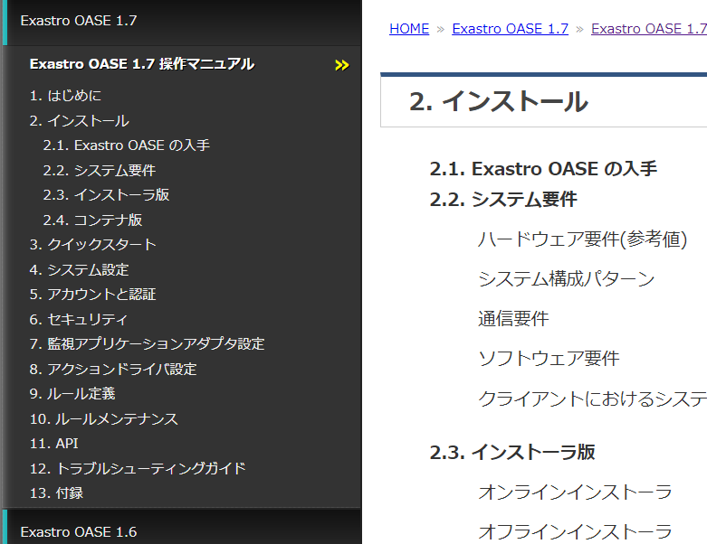
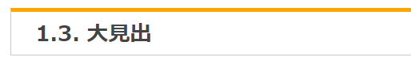

==============
マニュアル構文
==============

.. _index-rns:
index.rst
=========

機能1
-----
| ビルド時、システムはドキュメントルート、、大章ディレクトリの配下に置かれたindex.rst の内容を見て章と章を紐づけ、全体を構成します。
.. figure:: ../../images/ja_manual_design/role_of_index_rst_v2_0.png
   :width: 5.84375in
   :height: 1.09375in
   :align: center
   :alt: role_of_index

   index.rstの役割

機能2
-----
| 各 index.rst で章見出しを定義する事が出来ます。
|
| 各index.rst 内に記述した見出と出力結果

.. code-block:: bash

  documentation
  　|-- html
  　|-- images
  　|-- v2.0
  　|   |-- ja_manual_design
  　|   |   |-- index.rst <-- "マニュアル構成法" を記述
  　|   |
  　|   |-- ja
  　|   |   |-- index.rst <--- "Exastro-it-automation 2.0 操作マニュアル" を記述
  　|   |
  　|   |-- index.rst
  　|-- install
  　|-- index.rst <--- "xastro-it-automation Documentation" を記述

.. figure:: ../../images/ja_manual_design/title_in_index_rst_v_2_0.png
   :width: 5.84375in
   :height: 1.09375in
   :align: center
   :alt: title_in_index_rst

   各index.rst 内見出

index.rst 内構文
----------------
| indes.rst 内の記述方法について大章「インストール」内に配置した index.rst を例に挙げて説明します。
.. code-block:: bash
   
   ============ 
   インストール
   ============

   .. toctree::
   :maxdepth: 1

   getting_oase
   requirements
   installer/index
   container/index

| 記述した内容が章見出し (インストール) となります。
.. code-block:: bash
   
   ============ 
   インストール
   ============

.. figure:: ../../images/ja_manual_design/indexrst_syntax1_v2_0.png
   :width: 5.84375in
   :height: 1.09375in
   :align: center
   :alt: role_of_index

   大章まで表示

| どのレベルの見出しまで右側の見出一覧に表示するかを指定します。
.. code-block:: bash
   
   .. toctree::
   :maxdepth: 1

.. figure:: ../../images/ja_manual_design/toctree_lvl1.png
   :width: 5.84375in
   :height: 1.09375in
   :align: center
   :alt: role_of_index

   中章まで表示

.. code-block:: bash
   
   .. toctree::
   :maxdepth: 2

   小章まで表示

| 配下にくる章が格納されているディレクトリを指定します。
.. code-block:: bash
   
   getting_oase
   requirements
   installer/index
   container/index

.. _doc-rns:
ドキュメント記述用 .rst ファイル
================================

構文 (ドキュメント内見出)
-------------------------
大見出
~~~~~~
.. code-block:: bash
   
   ======
   大見出
   ======
| |image1| 

中見出
~~~~~~~
.. code-block:: bash
   
   中見出
   ======
| |image2| 

小見出1
~~~~~~~
.. code-block:: bash
   
   小見出1
   -------
| |image3| 

小見出2
~~~~~~~
.. code-block:: bash
   
   小見出2
   ~~~~~~~
| |image4| 

小見出3
~~~~~~~
.. code-block:: bash
   
   小見出3
   *******
| |image5| 

構文 (リスト)
-----------
番号なしリスト
~~~~~~~~~~~~~~
.. code-block:: bash
   
   - リストa
   - リストb
- リストa
- リストb

番号付リスト
~~~~~~~~~~~~
.. code-block:: bash
   
   #. リストa
   #. リストb
#. リストa
#. リストb

構文 (強調)
-----------
強調
~~~~
.. code-block:: bash

   **強調されます**
**強調されます**

コマンド
~~~~~~~~
.. code-block:: bash

   ファイル一覧は :command:`ls` で見ることができます。 
ファイル一覧は :command:`ls` で見ることができます。 

ファイルパス
~~~~~~~~~~~~
.. code-block:: bash

   nginx のメインの設定ファイルは :file:`/etc/nginx/nginx.conf` です。
nginx のメインの設定ファイルは :file:`/etc/nginx/nginx.conf` です。

構文 (パラグラフ)
-----------------
パラグラフ
~~~~~~~~~~
.. code-block:: bash

   | パラグラフはじまり
   | つづきのパラグラ

   | 第二パラグラフ
| パラグラフはじまり
| つづきのパラグラフ

| 第二パラグラフ

見出+パラグラフ
~~~~~~~~~~~~~~~~
.. code-block:: bash

   見出
     | 内容1
     | 内容2
見出
  | 内容1
  | 内容2

番号付見出+パラグラフ
~~~~~~~~~~~~~~~~~~~~~
.. code-block:: bash

   #. | 番号付見出
      | 内容1
      | 内容2
#. | 番号付見出
   | 内容1
   | 内容2

構文 (画像差込)
---------------
画像差込 (キャプション付)
~~~~~~~~~~~~~~~~~~~~~~~~~
.. code-block:: bash

   幅 5 inch x scale 60% = 幅 3 inch で表示されます。

   .. figure:: ../../images/ja_manual_design/charg.png
      :width: 5in
      :scale: 80%
      :align: center
      :alt: role_of_index

      index.rstの役割  <--- キャプション
幅 5 inch x scale 60% = 幅 3 inch で表示されます。

.. figure:: ../../images/ja_manual_design/chart.png
   :width: 5in
   :scale: 80%
   :align: center
   :alt: role_of_index

   index.rstの役割

画像差込 (キャプションなし)
~~~~~~~~~~~~~~~~~~~~~~~~~
.. code-block:: bash

   幅 300px x scale 80% = 幅 240px で表示されます。
   .. image:: ../../images/ja_manual_design/chart.png
      :width: 300px
      :scale: 80%
      :align: center
      :alt: role_of_index
幅 300px x scale 80% = 幅 240px で表示されます。

.. image:: ../../images/ja_manual_design/chart.png
   :width: 300px
   :height: 300px
   :scale: 80%
   :align: center
   :alt: role_of_index

画像差込 (文中引用))
~~~~~~~~~~~~~~~~~~~~
.. code-block:: bash

   画像がここに→　|aa| 差し込まれます。

   .. |aa| image:: ../../images/ja_manual_design/sample_img_v2_0.png
      :width: 1.5in
      :alt: サンプルイメージ指定したパスにある画像が差し込まれます。

画像がここに→　|aa| 差し込まれます。

|
構文 (表)
---------
グリッドテーブル
~~~~~~~~~~~~~~~~
.. code-block:: bash

   .. table:: グリッドテーブルサンプル

      +----------+-------+---------+
      | 見出1    | 見出2 | 見出3   |
      |          |       |         |
      +==========+=======+=========+
      | 内容1    | 内容2 | 内容3   |
      +----------+-------+---------+
.. table:: グリッドテーブルサンプル

   +----------+-------+---------+
   | 見出1    | 見出2 | 見出3   |
   |          |       |         |
   +==========+=======+=========+
   | 内容1    | 内容2 | 内容3   |
   +----------+-------+---------+

CSVテーブル
~~~~~~~~~~~
.. code-block:: bash

   .. csv-table:: CSVテーブルサンプル
      :header: 項目名1, 項目名2, 項目名3
      :widths: 10, 30, 30

      内容1, 内容2, 内容3

.. csv-table:: CSVテーブルサンプル
   :header: 項目名1, 項目名2, 項目名3
   :widths: 10, 30, 30

   内容1, 内容2, 内容3
|
.. warning:: | 表組1 では以下の記号は半角記号扱いとなります。
   | ※ (こめじるし),  ①などの〇付記号

リストテーブル
~~~~~~~~~~~~~~
.. code-block:: bash

   .. list-table:: リストテーブルサンプル
      :widths: 30 40 20
      :header-rows: 1
      :align: left

      * - 項目名1
        - 項目名2
        - 項目名3
      * - 内容A
        - | リストテーブルでは
          | １セル内に複数行入れることが
          | 容易にできます。
        - | 内容C
      * - 内容D
        - 内容E
        - 内容F

.. list-table:: リストテーブルサンプル
   :widths: 10 20 10
   :header-rows: 1
   :align: left

   * - 項目名1
     - 項目名2
     - 項目名3
   * - 内容A
     - | リストテーブルでは
       | １セル内に複数行入れることが
       | 容易にできます。
     - | 内容C
   * - 内容D
     - 内容E
     - 内容F

グリッドテーブル内表記の注意点
------------------------------

複数行をつなげて表示
~~~~~~~~~~~~~~~~~~~~
**正**

.. code-block:: bash

   +-------
   | 通信条\    --> "通信条件" とつなげて出力されます。
   | 件
**誤**

.. code-block:: bash

   +-------
   | 通信条    --> "通信条 件" と出力されます。
   | 件

文字強調
~~~~~~~~
**正**

.. code-block:: bash

   +-------
   | **通\    --> 正しく強調されます。
   | 信** 
**誤**

.. code-block:: bash

   +-------
   |**通\     --> 強調されません。(罫線と、** の間に空きがない)
   | 信** 
**誤**

.. code-block:: bash

   +-------
   |**通\     --> 強調されません。(終わりの ** が続いていない)
   | 信* 
   |*

複数行をつなげて出力 (任意の箇所に空白をいれる時)
~~~~~~~~~~~~~~~~~~~~~~~~~~~~~~~~~~~~~~~~~~~
"Exastro ITAのWebコンテンツへのアクセス" と一行で出力する場合。
空白は行末につけます。

**正**

.. code-block:: bash

   | Exastro \                | --> "Exastro ITAのWebコンテンツへのアクセス"
   | ITAのWebコンテンツへの\  |
   | アクセス                 |
   |                          |
  -+--------------------------+
**誤**

.. code-block:: bash

   | Exastro\                 | -->文字列が崩れます。 (空白が行頭にきています。)
   |  ITAのWebコンテンツへの\ |
   | アクセス                 |
   |                          |
  -+--------------------------+

表内での一覧表記
~~~~~~~~~~~~~~~~
.. code-block:: bash

   .. table:: 表組例1

      +-----------------+---------+
      | 新機\           | 項目B   |
      | 能について      |         |   --> "*" 又は "#." を使って項目を列挙します。
      |                 |         |   --> 前行との間に要空白  
      | * 項目1         |         |
      | * 項目2         |         |
      +-----------------+---------+

構文 (ボタン)
-------------
ボタン
~~~~~~
.. code-block:: bash

   :guilabel:` アクション`
:guilabel:` アクション`

|
構文 (注釈)
-------------------
note
~~~~
.. code-block:: bash

   .. note:: | 補足的な情報を示しています。
    | Note に記載されている内容は読み飛ばしても困ることは無いでしょう。
.. note:: | 補足的な情報を示しています。
   | Note に記載されている内容は読み飛ばしても困ることは無いでしょう。
tip
~~~
.. code-block:: bash

   .. tip:: | 操作や作業におけるノウハウを示しています。
      | Tip に記載されている内容を読み飛ばした場合ユーザに混乱が生じる可能性があります。
.. tip:: | 操作や作業におけるノウハウを示しています。
   | Tip に記載されている内容を読み飛ばした場合ユーザに混乱が生じる可能性があります。
warning
~~~~~~~
.. code-block:: bash

   .. warning:: | 操作上の注意点を示しています。
      | Warning に記載された内容はユーザが把握しておくほうが適切な情報です。
.. warning:: | 操作上の注意点を示しています。
   | Warning に記載された内容はユーザが把握しておくほうが適切な情報です。
danger
~~~~~~
.. code-block:: bash

   .. danger:: | 正常なサービスへ影響を与える可能性がある操作についての危険性を示しています。
      | Danger に記載された内容を知らない場合、大きな問題を引き起こす可能性があります。
.. danger:: | 正常なサービスへ影響を与える可能性がある操作についての危険性を示しています。
   | Danger に記載された内容を知らない場合、大きな問題を引き起こす可能性があります。

.. |aa| image:: ../../images/ja_manual_design/chart.png
   :width: 1.5in
   :height: 0.52in
   :alt: サンプルイメージ

.. |image2| image:: ./manual_syntax/image2.png
   :width: 5.68735in
   :height: 0.56253in
.. |image3| image:: ./manual_syntax/image3.png
   :width: 5.68735in
   :height: 0.56253in
   :scale: 90%

.. |image6| image:: ./build_flow/image6.png
   :width: 5.68735in
   :height: 0.56253in
.. |image7| image:: ./manual_syntax/image7.png
   :width: 5.68735in
   :height: 0.56253in
.. |image8| image:: ./manual_syntax/image8.png
   :width: 5.68735in
   :height: 0.56253in
.. |image14| image:: ./build_flow/image14.png
   :width: 5.68735in
   :height: 0.56253in
.. |image15| image:: ./build_flow/image15.png
   :width: 5.60102in
   :height: 0.52416in
.. |image16| image:: ./build_flow/image16.png
   :width: 5.27072in
   :height: 0.49804in
.. |image17| image:: ./build_flow/image17.png
   :width: 5.54284in
   :height: 0.53672in
